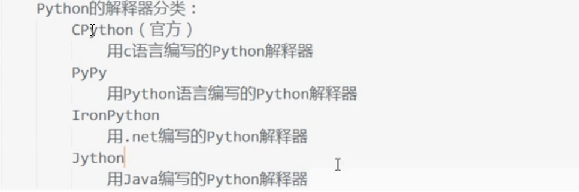

# 1.python命令行计算乘方

> 1.输入python进入python命令行环境
>
> 2.若计算2^3,则输入2**3即可

# 2.python的特点

> 1.跨平台
>
> 2.能用更少的代码实现其它语言的功能

# 3.python的应用范围

> 操作系统，web，3d动画，企业应用，云计算

# 4.python的shell

> 1.IDLE是python的shell，开始菜单搜索IDLE打开即可
>
> 2.python的hello world
>
> ```python
> >>> print("hello world")  #python3不需要在语句结尾加上分号
> hello
> >>> print(5+3)
> 8
> >>> 5+3  #直接计算
> 8
> >>> 98765432123456789*98745612321456789  #还可以进行大数的运算
> 9752653071224018859963738972190521
> >>> 
> ```
>
> 3.alt+n或alt+p进入上一条或下一条语句

# 5.python解释器



> 命令行运行python文件
>
> ```python
> python hello.py 或者 hello.py
> ```
>
> 

# 6. python语法

## 6.1 python关键字

```python
>>> import keyword
>>> keyword.kwlist
['False', 'None', 'True', 'and', 'as', 'assert', 'async', 'await', 'break', 'class', 'continue', 'def', 'del', 'elif', 'else', 'except', 'finally', 'for', 'from', 'global', 'if', 'import', 'in', 'is', 'lambda', 'nonlocal', 'not', 'or', 'pass', 'raise', 'return', 'try', 'while', 'with', 'yield']
>>> 
```

## 6.2 python注释

> 1.单行注释：使用#
>
> 2.多行注释：使用'''或""",即3个单引号或3个双引号

## 6.3 行与缩进

> python使用缩进表示代码块，同一个代码块的语句必须使用相同的空格进行缩进，不使用{}

## 6.4 语句跨行

> 1.Python 通常是一行写完一条语句，但如果语句很长，我们可以使用反斜杠(\)来实现多行语句
>
> ```python
> total = item_one + \
>         item_two + \
>         item_three
> ```
>
> 2.在 [], {}, 或 () 中的多行语句，不需要使用反斜杠(\)
>
> ```python
> total = ['item_one', 'item_two', 'item_three',
>         'item_four', 'item_five']
> ```
>
> 

## 6.5 运算符

> 1.逻辑运算符：使用and,or,not表示与，或，非
>
> 2.成员运算符：in,not in 判断一个值是否在字符串、列表或元祖中
>
> 3.算数运算符：
>
> **，进行幂运算
>
> //，向下取整除法，9//2=4
>
> ```python
> // 得到的并不一定是整数类型的数，它与分母分子的数据类型有关系
> >>> 7//2
> 3
> >>> 7.0//2
> 3.0
> >>> 7//2.0
> 3.0
> >>> 
> ```
>
> 4.身份运算符:身份运算符用于比较两个对象的存储单元
>
> ```
> 1.is
> is 是判断两个标识符是不是引用自一个对象,x is y, 类似 id(x) == id(y) , 如果引用的是同一个对象则返回 True，否则返回 False
> 2.is not
> 注： id() 函数用于获取对象内存地址。
> ```
>
> 5.is 与 == 区别
>
> ```
> is 用于判断两个变量引用对象是否为同一个， == 用于判断引用变量的值是否相等。
> ```
>
> 

## 6.6 python数值类型转换

> - **int(x)** 将x转换为一个整数。
> - **float(x)** 将x转换到一个浮点数。
> - **complex(x)** 将x转换到一个复数，实数部分为 x，虚数部分为 0。
> - **complex(x, y)** 将 x 和 y 转换到一个复数，实数部分为 x，虚数部分为 y。x 和 y 是数字表达式

## 6.7 在交互模式中，最后被输出的表达式结果被赋值给变量 **_** 

```python
>>> tax = 12.5 / 100
>>> price = 100.50
>>> price * tax
12.5625
>>> price + _
113.0625
```

## 6.8 字符串

### 6.8.1 字符串格式化

> Python 支持格式化字符串的输出 。尽管这样可能会用到非常复杂的表达式，但最基本的用法是将一个值插入到一个有字符串格式符 %s 的字符串中。
>
> ```python
> print ("我叫 %s 今年 %d 岁!" % ('小明', 10))
> ```

### 6.8.2 Python三引号

> python三引号允许一个字符串跨多行，字符串中可以包含换行符、制表符以及其他特殊字符

```python
para_str = """这是一个多行字符串的实例
多行字符串可以使用制表符
TAB ( \t )。
也可以使用换行符 [ \n ]。
"""
```

> 三引号让程序员从引号和特殊字符串的泥潭里面解脱出来，自始至终保持一小块字符串的格式是所谓的WYSIWYG（所见即所得）格式的。一个典型的用例是，当你需要一块HTML或者SQL时，这时用字符串组合，特殊字符串转义将会非常的繁琐。