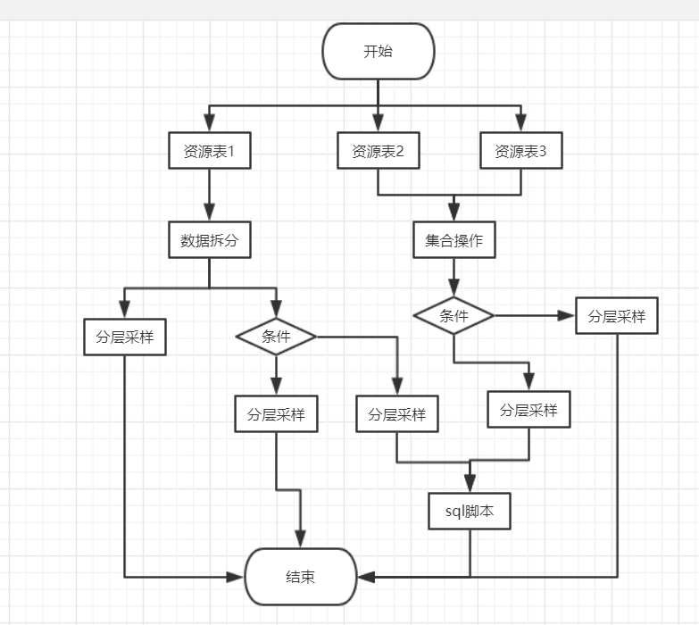

双重判断

oozie构建流程

| index | current            | next     | end（链表） |
| ----- | ------------------ | -------- | ----------- |
| 1     | **start(load)**    | fork-1   | join-1      |
| 2     | fork-1(1)          | 资源表1  | join-1      |
| 3     | **资源表1(load)**  | 数据拆分 | join-1      |
| 4     | **数据拆分(load)** | fork-2   | join-2      |
| 5     | fork-2             | 分层采样 | join-2      |
| 6     | **分层采样**       | join-2   | join-1      |
| 7     | join-1             | end      |             |
| 8     | **fork-2**         | 条件     | join-2      |
| 9     | 条件               | 分层     | join-2      |
|       |                    |          |             |
|       |                    |          |             |
|       |                    |          |             |
|       |                    |          |             |
|       |                    |          |             |
|       |                    |          |             |
|       |                    |          |             |
|       |                    |          |             |
|       |                    |          |             |
|       |                    |          |             |

