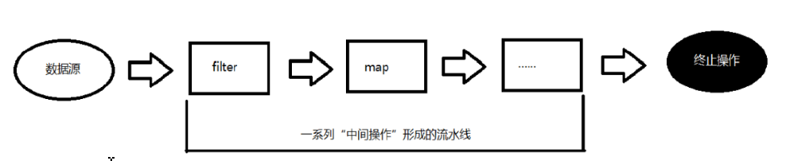
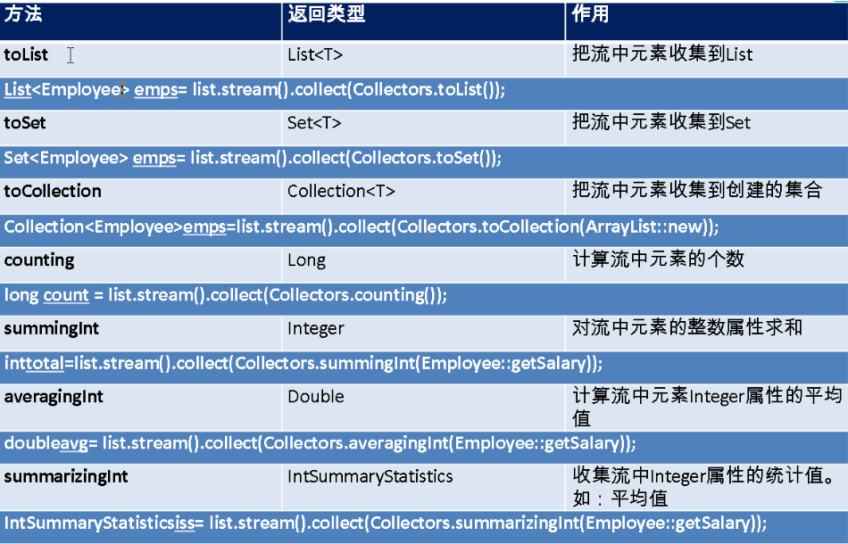
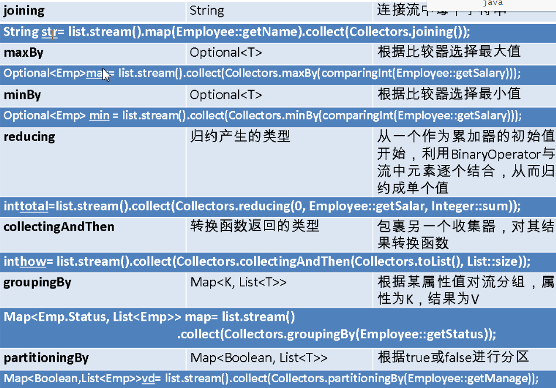
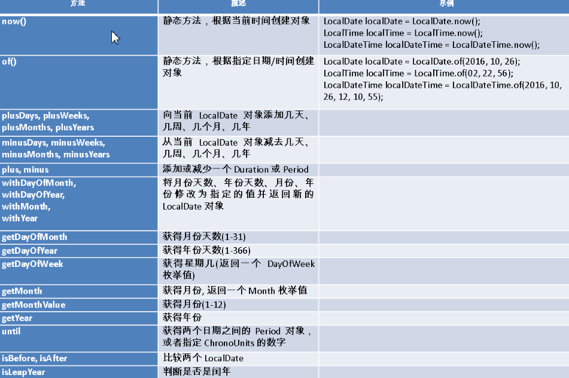
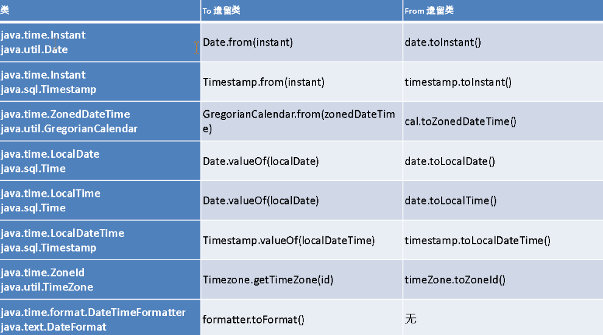

## 说明

## 目录

## lambda表达式

### 为什么使用`lambda`表达式？

> `Lambda `是一个匿名函数，我们可以把`Lambda `表达式理解为是一段可以传递的代码（将代码像数据一样进行传递）。可以写出更简洁、更灵活的代码。作为一种更紧凑的代码风格，使Java的语言表达能力得到了提升。

### 从匿名类到`Lambda `的转换

> 匿名内部类方式：
>
> ```java
>      Runnable runnable = new Runnable() {
>          @Override
>          public void run() {
>              System.out.println("hello world");
>          }
>      };
> ```
>
> `Lambda`表达式：
>
> ```java
>      Runnable runnable = () -> System.out.println("hello world");
> ```
> 匿名内部类方式：
>
> ```java
>         TreeSet<String> treeSet = new TreeSet<>(new Comparator<String>() {
>             @Override
>             public int compare(String o1, String o2) {
>                 return Integer.compare(o1.length(),o2.length());
>             }
>         });
> ```
>
> `Lambda`表达式：
>
> ```java
>         TreeSet<String> treeSet = new TreeSet<>((o1, o2) -> Integer.compare(o1.length(),o2.length()));
> ```
>
> 使用方法引用还可以简写成：
>
> ```java
>         TreeSet<String> treeSet = new TreeSet<>(Comparator.comparingInt(String::length));
> ```

### `lambda`表达式语法

> `Lambda `表达式在Java 语言中引入了一个新的语法元素和操作符。这个操作符为“`->`” ，该操作符被称为`Lambda` 操作符或剪头操作符。它将`Lambda` 分为两个部分：
> 左侧：指定了`Lambda `表达式需要的所有参数
> 右侧：指定了`Lambda `体，即`Lambda` 表达式要执行的功能。

### `lambda`表达式语法格式

> 1. 无参，无返回值，Lambda 体只需一条语句
>
>    ```java
>    Runnable runnable = () -> System.out.println("hello world");
>    ```
>
> 2. Lambda 需要一个参数
>
>    ```java
>    Consumer<String> fun = (a)-> System.out.println(a);
>    ```
>
> 3. Lambda 只需要一个参数时，参数的小括号可以省略
>
>    ```java
>    Consumer<String> fun = a-> System.out.println(a);
>    ```
>
> 4. Lambda 需要两个参数，并且有返回值
>
>    ```java
>            BinaryOperator<Long> fun = (x,y)->{
>                return x+y;
>            };
>        }
>    ```
>
> 5. 当Lambda 体只有一条语句时，return 与大括号可以省略
>
>    ```java
>    BinaryOperator<Long> fun = (x,y)-> x+y;
>    ```
>
> 6. Lambda 支持类型推断，故方法参数不需要声明类型，可以省略
>
>    > 上述`Lambda `表达式中的参数类型都是由编译器推断得出的。`Lambda `表达式中无需指定类型，程序依然可以编译，这是因为`javac`根据程序的上下文，在后台推断出了参数的类型。`Lambda `表达式的类型依赖于上下文环境，是由编译器推断出来的。这就是所谓的“类型推断”

## 函数式接口

### 什么是函数式接口？

> - 只包含一个抽象方法的接口，称为函数式接口。
> - 你可以通过`Lambda` 表达式来创建该接口的对象。（若`Lambda `表达式抛出一个受检异常，那么该异常需要在目标接口的抽象方法上进行声明）。
> - 我们可以在任意函数式接口上使用`@FunctionalInterface`注解，这样做可以检查它是否是一个函数式接口，同时`javadoc`也会包含一条声明，说明这个接口是一个函数式接口。

### 自定义函数式接口

> ```java
> @FunctionalInterface
> public interface MyNumber {
>     double getValue();
> }
> ```
>
> 函数式接口中使用泛型：
>
> ```java
> @FunctionalInterface
> public interface MyNumber<T> {
>     T getValue(T t);
> }
> ```

### 作为参数传递Lambda 表达式

>定义方法：
>```java
>public String toUpperString(MyNumber<String> fun, String str) {
>    return fun.getValue(str);
>}
>```
>
>使用方法：
>
>```java
>String result = toUpperString((str) -> str.toUpperCase(), "abc");
>System.out.println(result);
>```
>
>说明：
>
>```
>作为参数传递Lambda 表达式：为了将Lambda 表达式作为参数传递，接收Lambda 表达式的参数类型必须是与该Lambda 表达式兼容的函数式接口的类型。
>```

### Java 内置四大核心函数式接口

|        函数式接口        | 参数类型 | 返回类型 |                             用途                             |
| :----------------------: | :------: | :------: | :----------------------------------------------------------: |
|  Consumer<T>
消费型接口   |    T     |   void   |     对类型为T的对象应用操作，包含方法：
void accept(T t)      |
|  Supplier<T>
供给型接口   |    无    |    T     |            返回类型为T的对象，包含方法：T get();             |
| Function<T, R>
函数型接口 |    T     |    R     | 对类型为T的对象应用操作，并返回结果。结果是R类型的对象。包含方法：R apply(T t); |
|  Predicate<T>
断定型接口  |    T     | boolean  | 确定类型为T的对象是否满足某约束，并返回boolean 值。包含方法
boolean test(T t); |

### 其他函数式接口

| 函数式接口 | 参数类型 | 返回类型 | 用途 |
| ---------- | -------- | -------- | ---- |
|            |          |          |      |
| :--------------------------------------------------: | :-----------: | :-----------: | :----------------------------------------------------------: |
| ---------------------------------------------------- | ------------- | ------------- | ------------------------------------------------------------ |
|                                                      |               |               |                                                              |
|                  BiFunction<T,U,R>                   |      T,U      |       R       | 对类型为T,U参数应用操作，返回R类型的结果。包含方法为
R apply(T t,U u); |
|           UnaryOperator<T>
(Function子接口)           |       T       |       T       | 对类型为T的对象进行一元运算，并返回T类型的结果，如平方运算。包含方法为
T apply(T t); |
|         BinaryOperator<T>
(BiFunction子接口)          |      T,T      |       T       | 对类型为T的对象进行二元运算，并返回T类型的结果，如加法运算。包含方法为
T apply(T t1,T t2); |
|                   BiConsumer<T,U>                    |      T,U      |     void      |   对类型为T,U参数应用操作。包含方法为
void accept(T t,U u)    |
| ToIntFunction<T>
ToLongFunction<T>
ToDoubleFunction<T> |       T       | int
long
double |             分别计算int、long、double、值的函数              |
|    IntFunction<R>
LongFunction<R>
DoubleFunction<R>    | int
long
double |       R       |            参数分别为int、long、double类型的函数             |

### 注意

> - 若一个接口含有一个抽象方法，同时含有另一个覆盖Object类的抽象方法，那么该接口仍然是一个函数式接口
> - 在java中，lambda表达式是一个对象，而不是一个函数，但在python中它是函数
>
> 为什么会存在这种情况：
>
> ```
> 由于Object是任何类型的父类，当一个类实现MyInterface接口时，该类也会继承Object，则Object类的方法被该类继承，就相当于覆盖了该接口定义的toString()方法
> ```
>
> ```java
> @FunctionalInterface
> public interface MyInterface {
>     void test();
> 
>     /**
>      * 该方法同Onject的方法相同
>      */
>     String toString();
> }
> ```

## 方法引用与构造器引用

### 什么是方法引用？

> - 当要传递给Lambda体的操作，已经有实现的方法了，可以使用方法引用！（实现抽象方法的参数列表，必须与方法引用方法的参数列表保持一致！）方法引用：使用操作符“::” 将方法名和对象或类的名字分隔开来。如下三种主要使用情况：
>
>   - 对象::实例方法
>   - 类::静态方法
>   - 类::实例方法，则对应的函数式接口的参数则是调用该方法的对象本身，如：String::toUpperCase
>
> - 举例
>
> ```java
> (s) -> System.out.println(s);
> 等价于
> System.out::println
> ```
> ```java
> BinaryOperator<Double> bo = (a,b)->Math.pow(a,b);
> 等价于
> BinaryOperator<Double> bo = Math::pow;
> ```
>
> ```java
> compare((x,y)->x.equals(y),"abc","abc")
> 等价于
> compare(String::equals,"abc","abc")
> ```
> 注意
>
> - 当需要引用方法的第一个参数是调用对象，并且第二个参数是需要引用方法的第二个参数(或无参数)时：`ClassName::methodName`,如`x.equals(y)`可以写成`String::equals`

### 构造器引用

> - 格式：ClassName::new
>
> - 与函数式接口相结合，自动与函数式接口中方法兼容。可以把构造器引用赋值给定义的方法，与构造器参数列表要与接口中抽象方法的参数列表一致！
>
> - 举例
>
>   ```java
>   Function<Integer,MyClass> fun=n->new MyClass(n);
>   等价于
>   Function<Integer,MyClass> fun=MyClass::new;
>   ```

### 数组引用

> - 格式：type[] :: new
>
> - 举例
>
>   ```java
>   Function<Integer,Integer[]> fun2 = n->new Integer[n];
>   等价于
>   Function<Integer,Integer[]> fun2 = Integer[]::new;
>   ```

## Stream API

### 了解Stream

> - Java8中有两大最为重要的改变。第一个是Lambda 表达式；另外一个则是Stream API(java.util.stream.*)。
> - Stream 是Java8 中处理集合的关键抽象概念，它可以指定你希望对集合进行的操作，可以执行非常复杂的查找、过滤和映射数据等操作。使用Stream API 对集合数据进行操作，就类似于使用SQL 执行的数据库查询。也可以使用Stream API 来并行执行操作。简而言之，Stream API 提供了一种高效且易于使用的处理数据的方式。

### 什么是Stream

> - 流(Stream) 到底是什么呢？是数据渠道，用于操作数据源（集合、数组等）所生成的元素序列。“集合讲的是数据，流讲的是计算！”
>
> - 注意
>
>   > ①Stream 自己不会存储元素。
>   > ②Stream 不会改变源对象。相反，他们会返回一个持有结果的新Stream。
>   > ③Stream 操作是延迟执行的。这意味着他们会等到需要结果的时候才执行。

### Stream 的操作三个步骤

> - 创建Stream
>   一个数据源（如：集合、数组），获取一个流
>
> - 中间操作
>   一个中间操作链，对数据源的数据进行处理
>
> - 终止操作(终端操作)
>   一个终止操作，执行中间操作链，并产生结果
>
>   

### 创建Stream

> - 通过集合框架获取
>
> Java8 中的Collection 接口被扩展，提供了两个获取流的方法：
>
>   > - default Stream<E> stream() : 返回一个顺序流
>   > - default Stream<E> parallelStream() : 返回一个并行流
>
> - 由数组创建流
>
> Java8 中的Arrays 的静态方法stream() 可以获取数组流
>
>   > - static <T> Stream<T> stream(T[] array): 返回一个流
>   >
>   > - 重载形式，能够处理对应基本类型的数组
>   >
>   >   > public static IntStream stream(int[] array)
>   >   > public static LongStream stream(long[] array)
>   >   > public static DoubleStream stream(double[] array
>   >
>
> - 由值创建流
>
> 可以使用静态方法Stream.of(), 通过显示值创建一个流。它可以接收任意数量的参数
>
>   > public static<T> Stream<T> of(T... values) : 返回一个流
>
> - 由函数创建流：创建无限流
>
>   > 可以使用静态方法Stream.iterate() 和Stream.generate(), 创建无限流
>   >
>   > - 迭代
>   >
>   >   > ```java
>   >   > public static<T> Stream<T> iterate(final T seed, final UnaryOperator<T> f)
>   >   > ```
>   >   >
>   >   > 如：
>   >   >
>   >   > ```java
>   >   >        Stream.iterate(0, a -> a + 2)
>   >   >                .forEach(System.out::println);
>   >   > ```
>   >   >
>   >   > 程序会从0开始，一直加2打印
>   >
>   > - 生成
>   >
>   >   > ```java
>   >   > public static<T> Stream<T> generate(Supplier<T> s)
>   >   > ```
>   >   >
>   >   > 如：
>   >   >
>   >   > ```java
>   >   > Stream.generate(Math::random).forEach(System.out::println);
>   >   > ```
>   >   >
>   >   > 程序会一直产生小数并打印
>   >

### Stream 的中间操作

- 多个中间操作可以连接起来形成一个流水线，除非流水线上触发终止操作，否则中间操作不会执行任何的处理！而在终止操作时一次性全部处理，称为“惰性求值”

### 筛选与切片

- filter(Predicate p):接收Lambda ，从流中排除某些元素，只留下符合条件的元素。
- distinct():筛选，通过流所生成元素的hashCode() 和equals() 去除重复元素
- limit(long maxSize):截断流，使其元素不超过给定数量
- skip(long n):跳过元素，返回一个扔掉了前n 个元素的流。若流中元素不足n 个，则返回一个空流。与limit(n) 互补

### 映射

|              方法               |                             描述                             |
| :-----------------------------: | :----------------------------------------------------------: |
|         map(Function f)         | 接收一个函数作为参数，该函数会被应用到每个元素上，并将其映射成一个新的元素。 |
| mapToDouble(ToDoubleFunction f) | 接收一个函数作为参数，该函数会被应用到每个元素上，产生一个新的DoubleStream。 |
|    mapToInt(ToIntFunction f)    | 接收一个函数作为参数，该函数会被应用到每个元素上，产生一个新的IntStream |
|   mapToLong(ToLongFunction f)   | 接收一个函数作为参数，该函数会被应用到每个元素上，产生一个新的LongStream。 |
|       flatMap(Function f)       | 接收一个函数作为参数，将流中的每个值都换成另一个流，然后把所有流连接成一个流 |

flatMap(扁平化映射)详解

> 需求：将字符串集合的字符提取成一个一个的字符
>
> ```java
> List<String> list = Arrays.asList("afasfa", "gsgfs", "ghskj", "gbsj");
> ```
>
> 方法1：使用map
>
> ```java
> public class Hello {
>     public static void main(String[] args) {
>         List<String> list = Arrays.asList("afasfa", "gsgfs", "ghskj", "gbsj");
>         Stream<Stream<Character>> stream = list.stream().map(Hello::filterCharacter);
>         stream.forEach(sm -> sm.forEach(System.out::println));
>     }
> 
>     //将字符串映射从一个字符流
>     public static Stream<Character> filterCharacter(String str) {
>         List<Character> list = new ArrayList<>();
>         for (char c : str.toCharArray()) {
>             list.add(c);
>         }
>         return list.stream();
>     }
> }
> ```
>
> 方法2：使用flatMap
>
> ```java
> public class Hello {
>     public static void main(String[] args) {
>         List<String> list = Arrays.asList("afasfa", "gsgfs", "ghskj", "gbsj");
>         Stream<Character> stream = list.stream().flatMap(Hello::filterCharacter);
>         stream.forEach(System.out::println);
>     }
> 
>     //将字符串映射从一个字符流
>     public static Stream<Character> filterCharacter(String str) {
>         List<Character> list = new ArrayList<>();
>         for (char c : str.toCharArray()) {
>             list.add(c);
>         }
>         return list.stream();
>     }
> }
> ```
>
> `flatMap`会将每个元素产生的流合并成一个流，将每个流中的元素添加到最终的流中，而不是将流添加到最终的流中，所以返回值是`Stream<Character>`，而map只是把每个元素映射成一个流，所以返回值是`Stream<Stream<Character>>`
>
> ```
> map就相当于将["aaa","bbb"]转换成{{a,a,a},{b,b,b}}
> 而flatMap是转换为{a,a,a,b,b,b}
> ```

### 排序

|          方法          |                描述                |
| :--------------------: | :--------------------------------: |
|        sorted()        |  产生一个新流，其中按自然顺序排序  |
| sorted(Comparatorcomp) | 产生一个新流，其中按比较器顺序排序 |

```java
public class Hello {
    public static void main(String[] args) {
        List<String> list = Arrays.asList("afasfa", "bsgfs", "ahskj", "gbsj");
        //降序排列
        list.stream().sorted((a,b)-> -a.compareTo(b)).forEach(System.out::println);
    }

}
```

### Stream 的终止操作

- 终端操作会从流的流水线生成结果。其结果可以是任何不是流的值，例如：List、Integer，甚至是void

### 查找与匹配

|         方法          |                             描述                             |
| :-------------------: | :----------------------------------------------------------: |
| allMatch(Predicate p) |                     检查是否匹配所有元素                     |
| anyMatch(Predicate p) |                   检查是否至少匹配一个元素                   |
| noneMatch(Predicatep) |                   检查是否没有匹配所有元素                   |
|      findFirst()      |                        返回第一个元素                        |
|       findAny()       |                    返回当前流中的任意元素                    |
|        count()        |                       返回流中元素总数                       |
|   max(Comparatorc)    |                        返回流中最大值                        |
|   min(Comparatorc)    |                        返回流中最小值                        |
|  forEach(Consumerc)   | 内部迭代(使用Collection 接口需要用户去做迭代，称为外部迭代。相反，Stream API 使用内部迭代——它帮你把迭代做了) |

- allMatch

  判断集合元素的长度是否都大于3，结果为true

  ```java
  public class Hello {
      public static void main(String[] args) {
          List<String> list = Arrays.asList("afasfa", "bsgfs", "ahskj", "gbsj");
          boolean match = list.stream().allMatch(s -> s.length() > 3);
          System.out.println(match);
      }
  }
  ```

- anyMatch

  判断集合中是否有长度大于5的元素,结果为true

  ```java
  public class Hello {
      public static void main(String[] args) {
          List<String> list = Arrays.asList("afasfa", "bsgfs", "ahskj", "gbsj");
          boolean match = list.stream().anyMatch(s -> s.length() > 5);
          System.out.println(match);
      }
  }
  ```

- noneMatch

  判断集合元素是否长度都不大于6，结果为true

  ```java
  public class Hello {
      public static void main(String[] args) {
          List<String> list = Arrays.asList("afasfa", "bsgfs", "ahskj", "gbsj");
          boolean match = list.stream().noneMatch(s -> s.length() > 6);
          System.out.println(match);
      }
  }
  ```

- max

  找到集合中长度最大的元素

  ```java
  public class Hello {
      public static void main(String[] args) {
          List<String> list = Arrays.asList("afasfa", "bsgfs", "ahskj", "gbsj");
          Optional<String> max = list.stream().max(Comparator.comparingInt(String::length));
          System.out.println(max.get());
      }
  }
  ```

### 归约

- 将流中的元素反复结合形成一个值

|               方法               |                          描述                           |
| :------------------------------: | :-----------------------------------------------------: |
| reduce(T iden, BinaryOperator b) |      可以将流中元素反复结合起来，得到一个值。
返回T      |
|     reduce(BinaryOperator b)     | 可以将流中元素反复结合起来，得到一个值。
返回Optional<T> |

- reduce(T iden, BinaryOperator b)

  集合元素求和

  ```java
  public class Hello {
      public static void main(String[] args) {
          List<Integer> list = Arrays.asList(11, 15, 16, 25);
          Integer reduce = list.stream().reduce(0, (a, b) -> a + b);
          System.out.println(reduce);
      }
  }
  ```

- reduce(BinaryOperator b)

  集合元素求和

  ```java
  public class Hello {
      public static void main(String[] args) {
          List<Integer> list = Arrays.asList(11, 15, 16, 25);
          //对于结果可能为空的，会将结果封装到Optional中
          Optional<Integer> reduce = list.stream().reduce((a, b) -> a + b);
          System.out.println(reduce.get());
      }
  }
  ```

### 收集

| 方法                 | 描述                                                         |
| :------------------- | ------------------------------------------------------------ |
| collect(Collector c) | 将流转换为其他形式。接收一个Collector接口的实现，用于给Stream中元素做汇总的方法 |

- Collector 接口中方法的实现决定了如何对流执行收集操作(如收集到List、Set、Map)。但是Collectors 实用类提供了很多静态方法，可以方便地创建常见收集器实例，具体方法与实例如下表：

  

  IntSummaryStatistics获取集合属性的统计信息

  ```java
  public class Hello {
      public static void main(String[] args) {
          List<Integer> list = Arrays.asList(11, 15, 16, 25);
          IntSummaryStatistics statistics = list.stream().collect(Collectors.summarizingInt(value -> value));
          System.out.println(statistics.getAverage());
          System.out.println(statistics.getCount());
          System.out.println(statistics.getMax());
          System.out.println(statistics.getMin());
          System.out.println(statistics.getSum());
      }
  }
  ```

  

## 接口中的默认方法与静态方法

- Java 8中允许接口中包含具有具体实现的方法，该方法称为“默认方法”，默认方法使用default关键字修饰

  ```java
  public interface MyNumber<T> {
      T getValue(T t);
  
      default String getName(){
          return "zhangsan";
      }
  }
  ```

- 接口默认方法的”类优先”原则
  若一个接口中定义了一个默认方法，而另外一个父类或接口中又定义了一个同名的方法时

  - 选择父类中的方法。如果一个父类提供了具体的实现，那么接口中具有相同名称和参数的默认方法会被忽略。
  - 接口冲突。如果一个父接口提供一个默认方法，而另一个接口也提供了一个具有相同名称和参数列表的方法（不管方法是否是默认方法），那么必须覆盖该方法来解决冲突

## 新时间日期API

### 使用LocalDate、LocalTime、LocalDateTime

- LocalDate、LocalTime、LocalDateTime 类的实例是不可变的对象，分别表示使用ISO-8601日历系统的日期、时间、日期和时间。它们提供了简单的日期或时间，并不包含当前的时间信息。也不包含与时区相关的信息

  

### Instant 时间戳

- 用于“时间戳”的运算。它是以Unix元年(传统的设定为UTC时区1970年1月1日午夜时分)开始所经历的描述进行运算

### Duration 和Period

- Duration:用于计算两个“时间”间隔
- Period:用于计算两个“日期”间隔

### 日期的操纵

- TemporalAdjuster : 时间校正器。有时我们可能需要获取例如：将日期调整到“下个周日”等操作。

- TemporalAdjusters : 该类通过静态方法提供了大量的常用TemporalAdjuster 的实现。
  例如获取下个周日：

  ```java
  public class Hello {
      public static void main(String[] args) {
          LocalDate date = LocalDate.now().with(TemporalAdjusters.next(DayOfWeek.SUNDAY));
          System.out.println(date);
      }
  }
  ```

### 解析与格式化

- java.time.format.DateTimeFormatter 类：该类提供了三种格式化方法：
  - 预定义的标准格式
  - 语言环境相关的格式
  - 自定义的格式

### 时区的处理

- Java8 中加入了对时区的支持，带时区的时间为分别为：
  ZonedDate、ZonedTime、ZonedDateTime
  其中每个时区都对应着ID，地区ID都为“{区域}/{城市}”的格式
  例如：Asia/Shanghai 等
  ZoneId：该类中包含了所有的时区信息
  - getAvailableZoneIds() : 可以获取所有时区时区信息
  - of(id) : 用指定的时区信息获取ZoneId 对象

### 与传统日期处理的转换



## 其它新特性