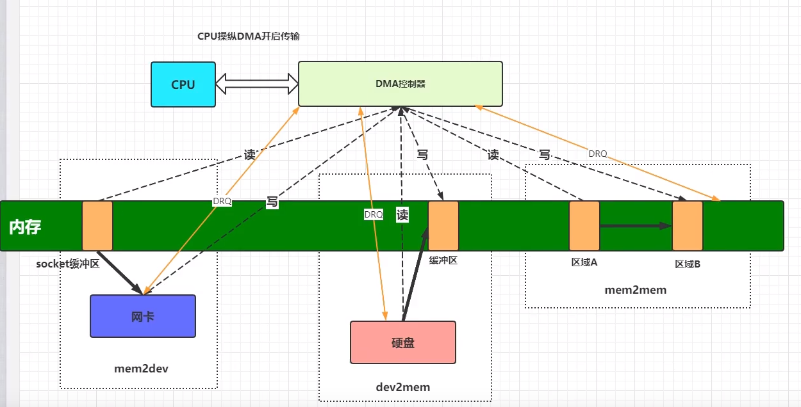
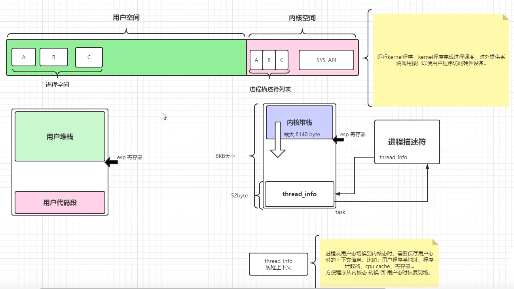

## 说明

## 目录

## DMA技术

> - 即Direct Memory Access，直接内存访问,即绕开CPU进行数据读写。在计算机中，相比CPU来说，外部设备访问速度是非常缓慢的...
> - 因而，"memory 到memory"或者"memory 到device"或者"device 到memory"之间搬运数据是非常浪费CPU时间的!造成CPU无法及时处理实时事件..怎么办?因此工程师设计出来一-种专门协助CPU搬运数据的硬件 "DMA控制器” ，**协助CPU完成数据搬运**。
> - 

## 用户态和内核态的切换

