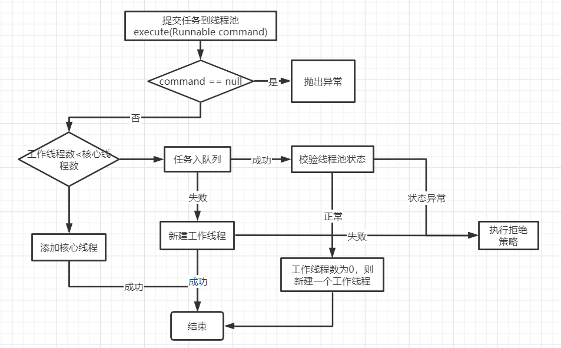

## 说明

## 目录

## 概述

> ThreadPoolExecutor用于创建线程池

## 核心参数

| 参数类型                 | 参数名          | 参数含义                                                     |
| ------------------------ | --------------- | ------------------------------------------------------------ |
| int                      | corePoolSize    | 核心线程数，创建后会一直维持在线程池中，除非参数`allowCoreThreadTimeOut`被设置 |
| int                      | maximumPoolSize | 最大线程数，与核心线程不同，这些线程在空闲一定时间后**会被回收** |
| long                     | keepAliveTime   | 非核心工作线程空闲时间                                       |
| TimeUnit                 | unit            | 非核心工作线程空闲时间单位                                   |
| BlockingQueue<Runnable>  | workQueue       | 任务队列，当提交的任务**核心线程**无法处理时，会将任务添加到队列 |
| ThreadFactory            | threadFactory   | 线程工程，用于创建工作线程，可自定义                         |
| RejectedExecutionHandler | handler         | 当线程池无法处理任务时，对任务执行的拒绝策略，可自定义       |

## 内置的线程池

> 内置线程池都是基于ThreadPoolExecutor创建，使用不同的参数进行构建，**使用Executors的静态方法进行创建**

### FixedThreadPool

> 核心线程池与最大线程数相等，并且使用无界队列

```java
public static ExecutorService newFixedThreadPool(int nThreads) {
    return new ThreadPoolExecutor(nThreads, nThreads,
                                  0L, TimeUnit.MILLISECONDS,
                                  new LinkedBlockingQueue<Runnable>());
}
```

### SingleThreadExecutor

> 只有一个工作线程的线程池,并且使用无界队列，用于任务的顺序执行

```java
public static ExecutorService newSingleThreadExecutor() {
    return new FinalizableDelegatedExecutorService
        (new ThreadPoolExecutor(1, 1,
                                0L, TimeUnit.MILLISECONDS,
                                new LinkedBlockingQueue<Runnable>()));
}
```

### CachedThreadPool

> 工作线程会组件增大的线程池，使用无界队列，任务过多就会创建过多的工作线程，很容易使内存不足

```java
public static ExecutorService newCachedThreadPool() {
    return new ThreadPoolExecutor(0, Integer.MAX_VALUE,
                                  60L, TimeUnit.SECONDS,
                                  new SynchronousQueue<Runnable>());
}
```

## 内置的拒绝策略

| 名称                | 功能                                                     |
| ------------------- | -------------------------------------------------------- |
| DiscardOldestPolicy | 将队列中最老的任务（即第一个任务）丢弃，然后添加新的任务 |
| DiscardPolicy       | 对任务不做任何操作                                       |
| AbortPolicy         | 抛出异常                                                 |
| CallerRunsPolicy    | 使用当前线程执行该任务                                   |

## 任务执行流程

> 以execute(Runnable command)方法为例
>
> 1. 工作线程数小于核心线程数，创建一个核心工作线程执行任务
> 2. 任务添加到队列，等待工作线程执行
> 3. 工作线程数等于核心线程数，任务队列已满，则新建非核心工作线程执行任务
> 4. 当工作线程数达到最大线程数（此时队列已满），执行拒绝策略



## 原理

### 核心成员变量

```java
//一个原子变量，用于保存线程池状态+工作线程数，int类型32位，高3位保存线程池的5种状态，第29位保存工作线程数
private final AtomicInteger ctl = new AtomicInteger(ctlOf(RUNNING, 0));
//工作线程使用的int的二进制位数，29
private static final int COUNT_BITS = Integer.SIZE - 3;
//最大工作线程数
private static final int CAPACITY   = (1 << COUNT_BITS) - 1;

// 线程池状态
//接受新任务并且会处理队列中的任务
private static final int RUNNING    = -1 << COUNT_BITS;
//不接受新任务，但是会处理队列中的任务
private static final int SHUTDOWN   =  0 << COUNT_BITS;
//不接受新任务，不处理队列任务，中断所有运行中的任务
private static final int STOP       =  1 << COUNT_BITS;
//所有任务都已经被终止，工作线程数=0，然后调用线程池的terminated()钩子方法
private static final int TIDYING    =  2 << COUNT_BITS;
//terminated()方法执行完成后会转换成TERMINATED状态
private static final int TERMINATED =  3 << COUNT_BITS;

//状态转换
RUNNING -> SHUTDOWN  调用shutdown()方法
(RUNNING or SHUTDOWN) -> STOP  调用shutdownNow()方法
SHUTDOWN -> TIDYING   队列和线程池都为空
STOP -> TIDYING    线程池为空
TIDYING -> TERMINATED   调用terminated()方法
```

### ctl的相关方法

```java
//获取运行状态
private static int runStateOf(int c)     { return c & ~CAPACITY; }
//获取工作线程数
private static int workerCountOf(int c)  { return c & CAPACITY; }
//构造ctl
private static int ctlOf(int rs, int wc) { return rs | wc; }
```

### 工作线程Worker

```java
//继承自AQS，所以工作线程是一个锁
private final class Worker
    extends AbstractQueuedSynchronizer
    implements Runnable
{
    /** 关联的线程 */
    final Thread thread;
    /** 执行的任务，可能为null */
    Runnable firstTask;
    /** 工作线程完成的任务数 */
    volatile long completedTasks;

    Worker(Runnable firstTask) {
        //禁止中断直到调用runWorker方法，中断需要调用Worker.interruptIfStarted()方法，需要state>=0
        setState(-1); 
        this.firstTask = firstTask;
        this.thread = getThreadFactory().newThread(this);
    }

    /** 方法执行委托给线程池的runWorker方法  */
    public void run() {
        runWorker(this);
    }

    // Lock methods
    //
    // 0：未锁定状态
    // 1：锁定状态

    // 是否为独占状态，true:独占
    protected boolean isHeldExclusively() {
        return getState() != 0;
    }

    // 尝试加锁
    protected boolean tryAcquire(int unused) {
        //加锁
        if (compareAndSetState(0, 1)) {
            //设置当前线程独占
            setExclusiveOwnerThread(Thread.currentThread());
            return true;
        }
        return false;
    }

    //尝试释放锁
    protected boolean tryRelease(int unused) {
        //设置独占线程为null
        setExclusiveOwnerThread(null);
        //设置为无锁状态
        setState(0);
        return true;
    }

    public void lock()        { acquire(1); }
    public boolean tryLock()  { return tryAcquire(1); }
    public void unlock()      { release(1); }
    public boolean isLocked() { return isHeldExclusively(); }

    void interruptIfStarted() {
        Thread t;
        if (getState() >= 0 && (t = thread) != null && !t.isInterrupted()) {
            try {
                t.interrupt();
            } catch (SecurityException ignore) {
            }
        }
    }
}
```