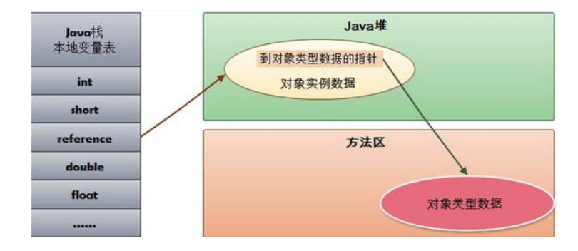
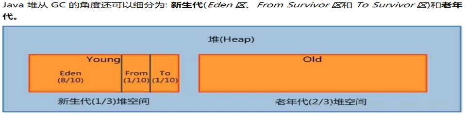
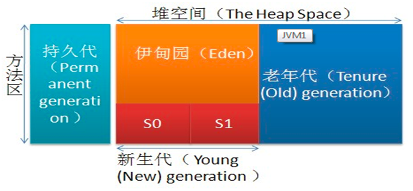
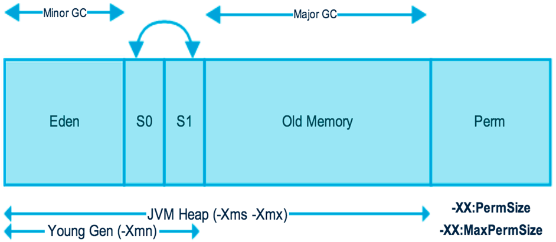
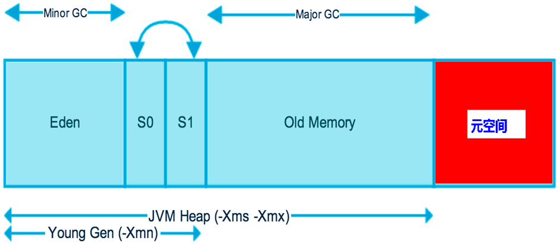
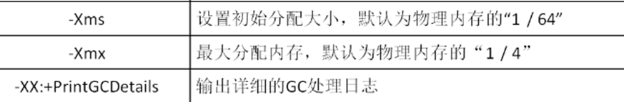
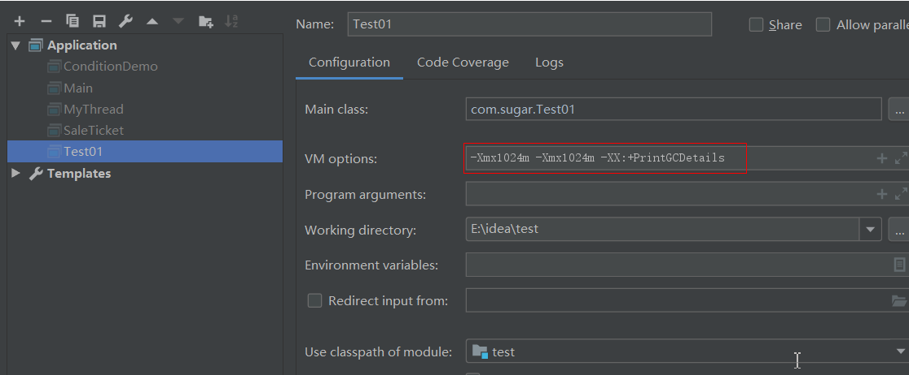
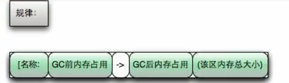
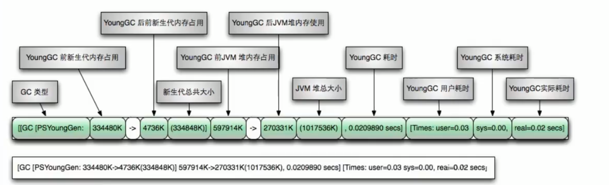
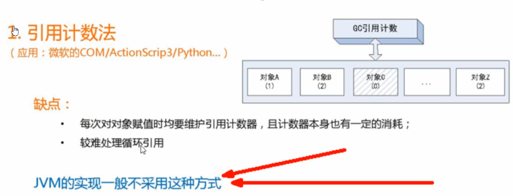

## 说明

## 目录

## jvm概述

### jvm组成结构


> - java线程start之后，不会立刻执行，会等待操作系统进行调度才会真正执行
>
> - 线程状态可通过Thread.State枚举类进行查看，该枚举类有6个值
>
>   - NEW：新建状态，即就绪状态
>   - RUNNABLE：运行状态
>   - BLOCKED：阻塞状态
>   - WAITING：等待状态
>   - TIMED_WAITING：等待状态
>   - TERMINATED：终止状态
>
>   其中WAITING、TIMED_WAITING组合起来为等待状态
>
> - 异常抛出是从运行时数据区进行抛出

### 类加载器和JNI(java本地库接口)


> - bootstrap加载器：根加载器，由c++语言编写，在java代码中打印出来是null，它负责加载rt.jar,即运行时依赖，我们常用的类都在里面
> - ext：扩展类加载器，java语言写的，加载jre/lib/ext/*.jar
> - App:应用类加载器，加载我们自己编写的类
> - 自定义类加载器：

### 类加载器的双亲委派机制

> - 当需要加载一个类时，会按根加载器--》ext加载器--》app加载器，逐层向下查找，没找到就报ClassNotFoundException
> - 每个类加载器都有一个指向父加载器的成员属性，当需要当前类加载器加载类时，它会先委派其父类加载器先加载，父加载器无法加载，再自己进行加载
> - 若自定义一个java.lang.String类，执行其main方法就会报错，因为根加载器会加载到jdk的String类，该类没有main方法，就会包找不到main方法的错误
> - 双亲委派机制的一个作用：保证自定义的类不会污染jdk自带的类，因为就算定义了相同的类，根据双亲委派机制，也会先加载jdk的，就不会造成程序错误，否则源代码之前引用的类就错乱了

### 方法区、程序计数器、本地方法栈


> - jvm的优化99%是优化堆，1%是优化方法区
> - 方法区主要放的是构造函数、接口定义
> - 本地方法主要是一些系统函数和其它语言库（如c语言）

#### 方法区

> - 线程共享
> - 存在gc垃圾回收
> - 方法区不是存放方法的
> - 方法区是供各线程共享的运行时内存区域，**它存储了每一个类的结构信息**（类加载器将class文件加载到jvm里形成对应的Class类），例如运行时常量池、字段和方法数据、构造函数和普通方法的字节码内容。这是虚拟机的规范，在不同的虚拟机里实现方式是不一样的，最典型的就是永久代（PermGen sapce，1.7）和元空间（Metaspace,1.8）
> - **实例变量存在堆内存中，和方法区无关**

### 栈、堆

> 栈管运行，堆管存储
>
> 栈的例子：子弹弹夹
>
> 队列的例子：排队买票

#### 栈

**栈是什么**

> - 栈也叫栈内存，主管java程序的运行，是在线程创建时创建，它的生命周期是跟随线程的生命周期，线程结束栈内存也就释放
> - 对于栈来说不存在垃圾回收，只要线程结束栈就over
> - 生命周期和线程一致，是线程私有的。
> - 基本类型的变量和对象的引用都是在函数的栈内存分配

**栈帧**

> - 一个方法调用就会形成一个栈帧，调用方法时压栈，方法结束时出栈
> - 栈帧中主要保存3类数据
>   - 本地变量(Local Variable)：输入参数、输出参数以及方法内的局部变量
>   - 栈操作（Operand Stack）：记录出栈、入栈的操作，即方法入口和出口
>   - 栈帧数据（Frame Data）:包括类文件、方法等
> - 每个方法执行的同时都会创建一个栈帧，用于存储局部变量表、操作数栈、动态链接、方法出口等信息，每个方法从调用到执行完毕的过程，就对应着一个栈帧在虚拟机中入栈到出栈的过程。栈的大小与具体的jvm实现有关，通常在256k~756k之间，约等于1Mb左右

**StackOverFlowError**

> - 栈空间溢出错误，它是一个Error，在如递归调用时无法终止的情况下回产生该错误

#### 栈的运行原理


#### 堆、栈、方法区的关系

> - HotSpot是使用指针的方式来访问对象：
> - Java堆中会存放访问**类元数据**的地址，
> - reference存储的就直接是对象的地址
>
> 

#### 1.7堆内存示意图

> - 一个JVM实例只存在一个堆内存，堆内存的大小是可以调节的。类加载器读取了类文件后，需要把类、方法、常变量放到堆内存中，保存所有引用类型的真实信息，以方便执行器执行
> - 刚创建的对象存在于伊甸区中，当伊甸区快满时，开始进行垃圾回收
> - 堆逻辑上分为3个部分：新生代+老年代+永久代（元空间）
> - 1.8时使用元空间替换了永久代 


##### 新生区


> - -Xms参数说明：-X是固定写法，m是单位mb,s是start，而-Xmx的x是max
> - 默认情况下jvm的内存为物理内存的1/4

##### 年老区

> - 一般经过15次垃圾回收之后还存活的对象会被放入年老区


##### 永久区

> 永久代中不存在垃圾回收，就算内存用完了也不会


##### 程序内存划分小结


> - JVM从软件层面屏蔽了底层硬件、指令层面的细节
> - JVM运行时数据区，分为2部分：数据、指令
>   - 数据：方法区、堆
>   - 指令：程序计数器、虚拟机栈、本地方法栈
> - 程序计数器：指向当前线程正在执行的字节码指令的地址（行号）,主要在线程切换时保存状态
> - 虚拟机栈：存储当前线程运行方法时所需要的方法参数、指令、返回地址
> - 栈帧：局部变量表、操作数栈、动态链接、出口
> - javap -v class:反编译class文件
> - 动态链接：

## **MinorGC**的过程

### 新生代和老年代内存比例图



### MinorGC（young gc）的过程

> 复制->清空->互换

#### eden、SurvivorFrom 复制到 SurvivorTo，年龄+1 

> - 首先，当Eden区满的时候会触发第一次GC,把还活着的对象拷贝到SurvivorFrom区，
> - 当Eden区再次触发GC的时候会扫描Eden区和From区域,对这两个区域进行垃圾回收，经过这次回收后还存活的对象,则直接复制到To区域（如果有对象的年龄已经达到了老年的标准，则复制到老年代区），同时把这些对象的年龄+1

#### 清空 eden、SurvivorFrom 

> - 然后，清空Eden和SurvivorFrom中的对象，也即复制之后有交换，谁空谁是to

#### SurvivorTo和 SurvivorFrom 互换 

> - 最后，SurvivorTo和SurvivorFrom互换，原SurvivorTo成为下一次GC时的SurvivorFrom区。
>
> - 部分对象会在From和To区域中复制来复制去,如此交换15次(由JVM参数MaxTenuringThreshold决定,这个参数默认是15),最终如果还是存活,就存入到老年代

## 方法区



> - 实际而言，方法区（Method Area）和堆一样，是各个线程共享的内存区域，它用于存储虚拟机加载的：类信息+普通常量+静态常量+编译器编译后的代码等等，虽然JVM规范将方法区描述为堆的一个逻辑部分，但它却还有一个别名叫做Non-Heap(非堆)，目的就是要和堆分开。
> - 对于HotSpot虚拟机，很多开发者习惯将方法区称之为“永久代(Parmanent Gen)” ，但严格本质上说两者不同，或者说使用永久代来实现方法区而已，永久代是方法区(相当于是一个接口interface)的一个实现，
> - jdk1.7的版本中，已经将原本放在永久代的字符串常量池移走。
> - jdk1.7永久存储区是一个常驻内存区域，用于存放JDK自身所携带的Class,Interface 的元数据，也就是说它存储的是运行环境必须的类信息，被装载进此区域的数据是不会被垃圾回收器回收掉的，关闭JVM 才会释放此区域所占用的内存

## 堆参数调优

### **jdk1.7堆内存结构图**

> - -Xms:-X是固定写法，m是M的意思，s表示start，即堆初始化内存大小
> - -Xmx:堆最大内存
> - -Xmn:新生代和老年代的比例，一般不调整，默认为1:2
> - -XX:PermSize:永久代的初始化内存大小
> - -XX:MaxPermSize:永久代最大内存大小



### **jdk1.8堆内存结构图**

> - JDK 1.8之后将最初的永久代取消了，由元空间取代
> - 元空间与永久代之间最大的区别在于：永久带使用的JVM的堆内存，但是java8以后的**元空间并不在虚拟机中而是使用本机物理内存**。
> - 因此，默认情况下，元空间的大小仅受本地内存限制。类的元数据放入native memory, 字符串池和类的静态变量放入java 堆中，这样加载多少类的元数据就不再由MaxPermSize 控制, 而由系统的实际可用空间来控制



### 参数调优



> - java将运行时环境封装成了Runtimr对象，通过它可以获取运行时的各种参数信息
> - 最好将-Xms和-Xmx设置成一样，避免内存忽高忽低

#### 获取系统可用cpu核心数

```java
Runtime.getRuntime().availableProcessors()
```

#### 获取堆初始化大小和最大大小

```java
System.out.println(Runtime.getRuntime().totalMemory());
System.out.println(Runtime.getRuntime().maxMemory());
//默认为1/64系统内存
System.out.println("-Xms:"+(Runtime.getRuntime().totalMemory()/1024/1024)+"MB");
//默认为1/4系统内存
System.out.println("-Xmx:"+(Runtime.getRuntime().maxMemory()/1024/1024)+"MB");
```

#### idea jvm参数设置



**运行结果**

```
12
1029177344
1029177344
-Xms:981MB
-Xmx:981MB
Heap
 PSYoungGen      total 305664K, used 20971K [0x00000000eab00000, 0x0000000100000000, 0x0000000100000000)
  eden space 262144K, 8% used [0x00000000eab00000,0x00000000ebf7afb8,0x00000000fab00000)
  from space 43520K, 0% used [0x00000000fd580000,0x00000000fd580000,0x0000000100000000)
  to   space 43520K, 0% used [0x00000000fab00000,0x00000000fab00000,0x00000000fd580000)
 ParOldGen       total 699392K, used 0K [0x00000000c0000000, 0x00000000eab00000, 0x00000000eab00000)
  object space 699392K, 0% used [0x00000000c0000000,0x00000000c0000000,0x00000000eab00000)
 Metaspace       used 3095K, capacity 4496K, committed 4864K, reserved 1056768K
  class space    used 336K, capacity 388K, committed 512K, reserved 1048576K
```

**结果分析**

> - jvm堆由PSYoungGen（年轻代）和ParOldGen（老年代）组成，它们的大小305664K+699392K正好是981MB，这也证明了元空间确实不在堆中

#### OOM

```java
public class Test01 {

    public static void main(String[] args) {
        String str = "hello world";
        Random random = new Random();
        while (true) {
            str = str + str + random.nextInt(888888888) + random.nextInt(999999999);
        }
    }
}
```

**运行结果**

> - 程序先进行young gc，之后达到full gc条件进行full gc，之后内存还是不够则抛出`java.lang.OutOfMemoryError: Java heap space`

```
[GC (Allocation Failure) [PSYoungGen: 512K->504K(1024K)] 512K->532K(1536K), 0.0004671 secs] [Times: user=0.00 sys=0.00, real=0.00 secs] 
[GC (Allocation Failure) [PSYoungGen: 1016K->488K(1024K)] 1044K->636K(1536K), 0.0006986 secs] [Times: user=0.00 sys=0.00, real=0.00 secs] 
[GC (Allocation Failure) [PSYoungGen: 1000K->488K(1024K)] 1148K->740K(1536K), 0.0004536 secs] [Times: user=0.00 sys=0.00, real=0.00 secs] 
[GC (Allocation Failure) [PSYoungGen: 959K->491K(1024K)] 1211K->884K(1536K), 0.0003819 secs] [Times: user=0.00 sys=0.00, real=0.00 secs] 
[Full GC (Ergonomics) [PSYoungGen: 491K->468K(1024K)] [ParOldGen: 392K->280K(512K)] 884K->748K(1536K), [Metaspace: 3061K->3061K(1056768K)], 0.0033904 secs] [Times: user=0.00 sys=0.00, real=0.00 secs] 
[GC (Allocation Failure) --[PSYoungGen: 954K->954K(1024K)] 1234K->1426K(1536K), 0.0005113 secs] [Times: user=0.03 sys=0.00, real=0.00 secs] 
[Full GC (Ergonomics) [PSYoungGen: 954K->0K(1024K)] [ParOldGen: 472K->414K(512K)] 1426K->414K(1536K), [Metaspace: 3073K->3073K(1056768K)], 0.0033759 secs] [Times: user=0.00 sys=0.00, real=0.00 secs] 
[Full GC (Ergonomics) [PSYoungGen: 486K->348K(1024K)] [ParOldGen: 414K->356K(512K)] 900K->704K(1536K), [Metaspace: 3074K->3074K(1056768K)], 0.0036726 secs] [Times: user=0.00 sys=0.00, real=0.00 secs] 
[Full GC (Allocation Failure) [PSYoungGen: 348K->348K(1024K)] [ParOldGen: 356K->344K(512K)] 704K->692K(1536K), [Metaspace: 3074K->3074K(1056768K)], 0.0034826 secs] [Times: user=0.00 sys=0.00, real=0.00 secs] 
Exception in thread "main" java.lang.OutOfMemoryError: Java heap space
	at java.util.Arrays.copyOf(Arrays.java:3332)
	at java.lang.AbstractStringBuilder.ensureCapacityInternal(AbstractStringBuilder.java:124)
	at java.lang.AbstractStringBuilder.append(AbstractStringBuilder.java:674)
	at java.lang.StringBuilder.append(StringBuilder.java:208)
	at com.sugar.Test01.main(Test01.java:11)
Heap
 PSYoungGen      total 1024K, used 416K [0x00000000ffe80000, 0x0000000100000000, 0x0000000100000000)
  eden space 512K, 81% used [0x00000000ffe80000,0x00000000ffee8270,0x00000000fff00000)
  from space 512K, 0% used [0x00000000fff80000,0x00000000fff80000,0x0000000100000000)
  to   space 512K, 45% used [0x00000000fff00000,0x00000000fff3ac20,0x00000000fff80000)
 ParOldGen       total 512K, used 344K [0x00000000ffe00000, 0x00000000ffe80000, 0x00000000ffe80000)
  object space 512K, 67% used [0x00000000ffe00000,0x00000000ffe56238,0x00000000ffe80000)
 Metaspace       used 3156K, capacity 4496K, committed 4864K, reserved 1056768K
  class space    used 342K, capacity 388K, committed 512K, reserved 1048576K

Process finished with exit code 1

```

#### gc日志解读



**young gc**



**full gc**

```
[Full GC (Allocation Failure):gc类型
[PSYoungGen: 348K->348K(1024K)] ：新生代清理结果
[ParOldGen: 356K->344K(512K)] ：老年代清理结果
704K->692K(1536K),：堆内存
[Metaspace: 3074K->3074K(1056768K)], ：元空间
0.0034826 secs] ：gc耗时
[Times: user=0.00 sys=0.00, real=0.00 secs] ：各方面耗时

```

## gc算法

> - jvm进行gc时，并非每次都对上面3个内存区域一起回收，大部分时候回收的都是指新生代。因此gc按照回收的区域又分为3种类型，一种是普通gc（Minor gc）,一种是全局gc（Major gc or Full gc）
> - **Minor gc和Full gc的区别**
>   - Minor gc：只针对新生代区域的gc,指发生在新生代的垃圾收集动作，因为大多数java对象存活率都不高，所以Minor gc非常频繁，一般回收速度也比较块
>   - Full gc：指发生在老年代的垃圾收集动作，出现了Full gc，经常会伴随至少一次的Minor gc（但并不是绝对的）。Full gc的速度一般要比Minor gc慢上10倍以上，因为Full gc需要清理的内存更多

### System.gc()

> - 手动开启gc，但并不会立刻执行

### 引用计数法



### 复制算法

### 标记清除

### 标记压缩

### 分代收集算法

> - 次数上频繁收取young区
> - 次数上较少手机old区
> - 基本不动元空间