## 说明

## 目录

## jvm内存区域

### 运行时数据区


### 各个区域的作用


> - -Xms:堆最小值
> - -Xmx:堆最大值
> - -Xmn:新生代大小
> - -XX:NewSize:新生代最小值
> - -XX:MaxNewSize:新生代最大值

### jdk各版本内存区域变化

#### jdk1.6


#### jdk1.7

> 将运行时常量池从方法区移到堆中


#### jdk1.8


### 直接内存

> 避免数据在系统态和用户态之间相互拷贝


### 堆和栈


### 方法出入栈


> 栈上分配：对于某些局部对象，可以在栈上进行分配创建，这样它的声明周期就跟所在方法相同，方法执行完成，该对象自然就被销毁，但是若对象被作为方法的返回值进行返回，其作用域就超出了方法，这个时候就不能进行栈上分配，所以会对对象进行**逃逸分析**来使用栈上分配

#### 栈上分配测试

##### 代码

```java
public class TestStackAllocate {
    public static class User {
        private int age;
        private String name;

        public User(int age, String name) {
            this.age = age;
            this.name = name;
        }
    }

    public static void getUser() {
        User user = new User(18, "zhangsan");
    }

    public static void main(String[] args) {
        long start = System.currentTimeMillis();
        for (int i = 0; i < 100000000; i++) {
            getUser();
        }
        long end = System.currentTimeMillis();
        System.out.println((end - start) + "ms");
    }
}
```

##### jvm参数

```
-server
-Xmx10m
-Xms10m
-XX:+DoEscapeAnalysis
-XX:+PrintGC
-XX:+EliminateAllocations
-XX:-UseTLAB
```

##### 参数说明

```
-server：JVM 运行的模式, server 才能进行逃逸分析 mix/client,
-Xmx10m：jvm堆最大值
-Xms10m：jvm堆最小值
-XX:+DoEscapeAnalysis：开启逃逸分析，必须在-server模式下
-XX:+PrintGC：打印gc日志
-XX:+EliminateAllocations：开启标量替换
-XX:-UseTLAB：ThreadLocalAllocBuffer，事先在堆里面为每个线程分配一块私有内存
```

### 虚拟机中的对象

> - 指针碰撞：内存是连续分配的，有一个指针指向未分配内存的首地址，下一次分配内存时从该位置进行分配，分配完成后修改指针
> - 空闲列表：内存是不连续分配的，可以一块内存用了，它下一块内存没有使用，这时就使用一个列表标识哪些内存使用了，哪些没有使用，下一次分配内存时，则从列表中查找未分配的内存，然后修改列表
> - 检查加载：检查类的Class信息是否加载
> - 分配内存：为对象在堆上分配内存
> - 内存空间初始化：对象的属性赋初始值，如int初始值为0
> - 设置：设置对象的Class信息，对象头信息
> - 对象初始化：执行对象的构造方法


### 对象的内存布局

> 对其填充：hotspot虚拟机中要求对象大小为8字节的整数倍，当对象大小不足时，进行对其填充

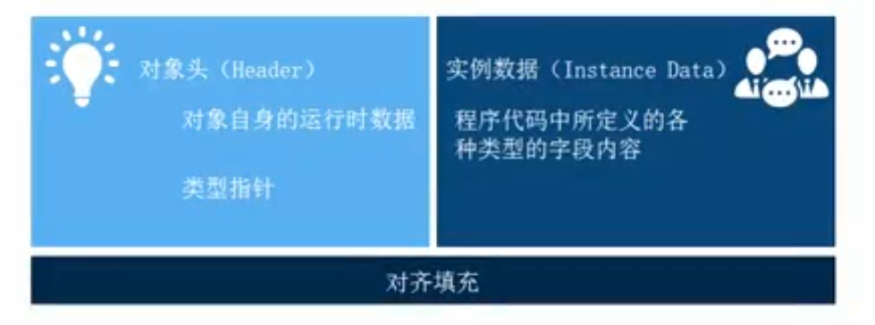

### 对象的访问定位

> - 句柄：代码中的引用指向的是句柄池中的地址，而真正的对象地址由句柄持有
>   - 访问对象需要句柄进行转发
>   - 垃圾回收时只需要修改句柄指向的地址即可，引用不需要修改，因为引用指向的是句柄
>
> - 直接指针：引用直接指向对象地址，访问速度较快
>   - 垃圾回收时对象整理会修改对象地址，引用就会跟着修改

### OOM异常

> - GC overhead limit exceeded：程序中可能存在循环不停在创建对象
> - Java heap space：程序中创建大对象，直接把堆撑爆 

###  元空间溢出

> 设置虚拟机参数-XX:MaxMetaspaceSize=3m
>
> ```
> Error occurred during initialization of VM
> MaxMetaspaceSize is too small.
> ```

### 栈溢出

> 使用无限递归
>
> -Xss2m：设置栈的大小
>
> - 对于树结构的数据进行操作时，不递归的效率要高于递归，因为递归会不断的生成新的栈帧

### 直接内存溢出

> nio网络通讯会使用直接内存，jvm参数:-XX:MaxDirectMemorySize=10m
>
> 异常
>
> ```
> Exception in thread "main" java.lang.OutOfMemoryError: Direct buffer memory
> 	at java.nio.Bits.reserveMemory(Bits.java:694)
> 	at java.nio.DirectByteBuffer.<init>(DirectByteBuffer.java:123)
> 	at java.nio.ByteBuffer.allocateDirect(ByteBuffer.java:311)
> ```

## 垃圾回收器和内存分配策略

### GC要做的事情

> - where/which:在堆上找到哪些对象可以回收
> - when:何时进行垃圾回收
> - how:怎样进行垃圾回收

### 判断对象的存活

#### 引用计数

> 维护一个映射表，保存每个对象被引用了多少次，这样，垃圾回收时回收引用计数为0的即可
>
> 缺点：当2个对象相互引用，这时引用就不为0，但是这2个对象也没被其它对象引用了，这时就没办法回收

#### 可达性分析

> - 在Java，可作为GC Roots的对象包括:
>   - 1.方法区:类静态属性引用的对象,static修饰;
>   - 2.方法区:常量引用的对象，final修饰；
>   - 3.虚拟机栈(本地变量表)中引用的对象，当前线程存活，其栈中的对象则任然存活.
>   - 4.本地方法栈JNI(Native方法)中引用的对象。

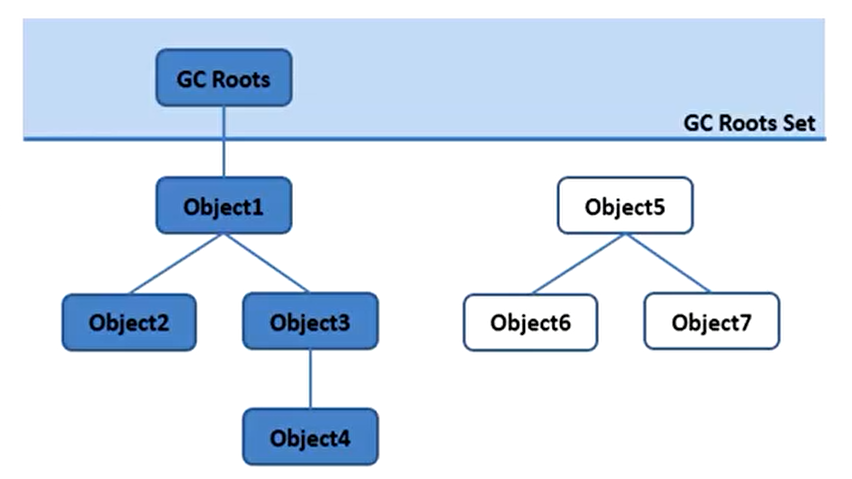

> 图中的Object5,6,7从任何一个GC roots都到达不了，就会被回收

### java中的引用

#### 强引用

> 程序中new出的对象都是强引用

#### 软引用(SoftReference)

> 有用但非必须的引用，gc时不一定会被回收，但在系统发生OOM之前，这些对象会被回收

##### 示例代码

> jvm参数：-Xmx10M -Xms10M

```java
public class TestOOM {

    static class User {
        private int id;
        private String name;

        public User(int id, String name) {
            this.id = id;
            this.name = name;
        }

        @Override
        public String toString() {
            return "User{" +
                    "id=" + id +
                    ", name='" + name + '\'' +
                    '}';
        }
    }

    public static void main(String[] args) {
        //分配一个强引用
        User user = new User(1, "sugar");
        //分配一个弱引用
        SoftReference<User> softReference = new SoftReference<>(user);
        user = null;
        System.out.println(softReference.get());
        //手动调用gc，gc是弱引用不一定会被回收
        System.gc();
        System.out.println("after gc");
        System.out.println(softReference.get());
        //触发OOM
        List<byte[]> list = new ArrayList<>();
        try {
            for (int i = 0; i < 100; i++) {
                list.add(new byte[1024 * 1024 * 1]);
                System.out.println(softReference.get());
            }
        } catch (Throwable e) {
            //OOM前弱引用被回收
            System.out.println("after OOM:" + softReference.get());
        }
    }
}
```

##### 执行结果

```
User{id=1, name='sugar'}
after gc
User{id=1, name='sugar'}
User{id=1, name='sugar'}
User{id=1, name='sugar'}
User{id=1, name='sugar'}
User{id=1, name='sugar'}
User{id=1, name='sugar'} 
User{id=1, name='sugar'}
User{id=1, name='sugar'}
after OOM:null
```

#### 弱引用(WeakReference)

> 有用（程度比软引用更低）但非必须的引用，只能生存到下一次GC前，GC时，不管内存是否充足，都会回收弱引用指向的对象

##### 示例代码

```java
public class TestOOM {

    static class User {
        private int id;
        private String name;

        public User(int id, String name) {
            this.id = id;
            this.name = name;
        }

        @Override
        public String toString() {
            return "User{" +
                    "id=" + id +
                    ", name='" + name + '\'' +
                    '}';
        }
    }

    public static void main(String[] args) {
        //分配一个强引用
        User user = new User(1, "sugar");
        //分配一个弱引用
        WeakReference<User> softReference = new WeakReference<>(user);
        user = null;
        System.out.println(softReference.get());
        //手动调用gc，gc是弱引用不一定会被回收
        System.gc();
        System.out.println("after gc");
        System.out.println(softReference.get());
    }
}
```

##### 执行结果

```
User{id=1, name='sugar'}
after gc
null
```

#### 虚引用(PhantomReference)

> 幽灵引用，最弱的引用，被垃圾回收时可以收到通知

### 标记-清除算法(Mark-Sweep)

> 标记清除后会造成内存空间不连续

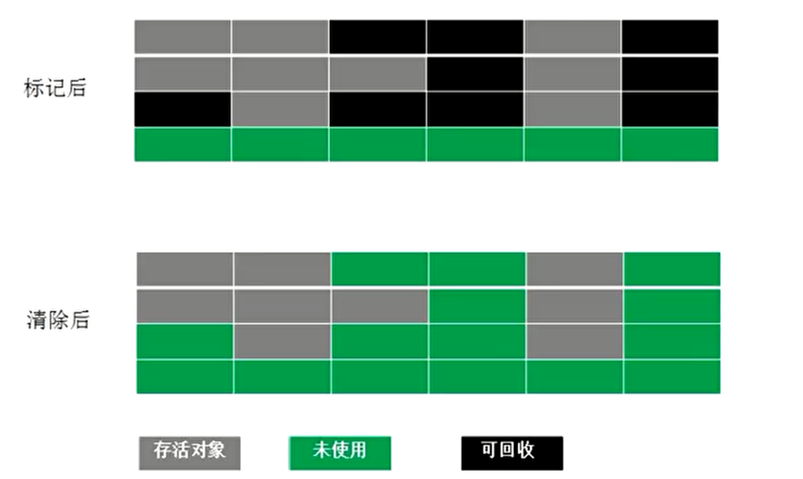

### 复制算法(copying)

> 将堆内存分为2个区域，分配对象只在其中一个区域进行，当内存不足时，进行垃圾回收，然后将剩余对象复制到另一个区域进行整理，这样内存也连续了，然后2个区域职责交换
>
> 缺点：始终有一半的内存得不到使用，对象的复制比较耗时

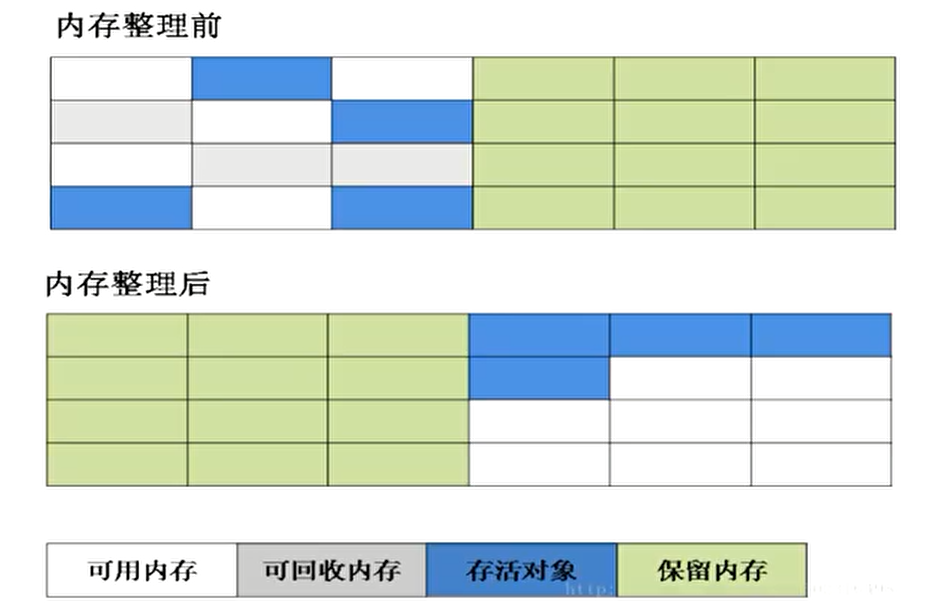

### 标记-整理算法(Mark-Compact)

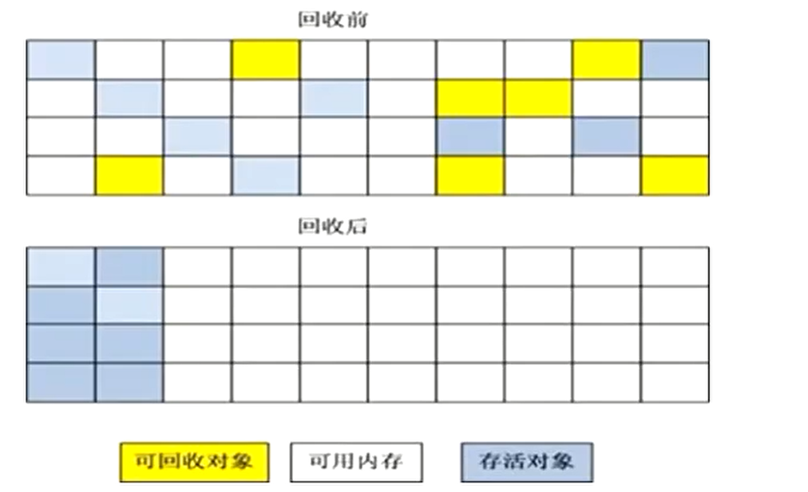

### 分代收集

> 分代收集针对新生代、老年代使用不同的gc算法

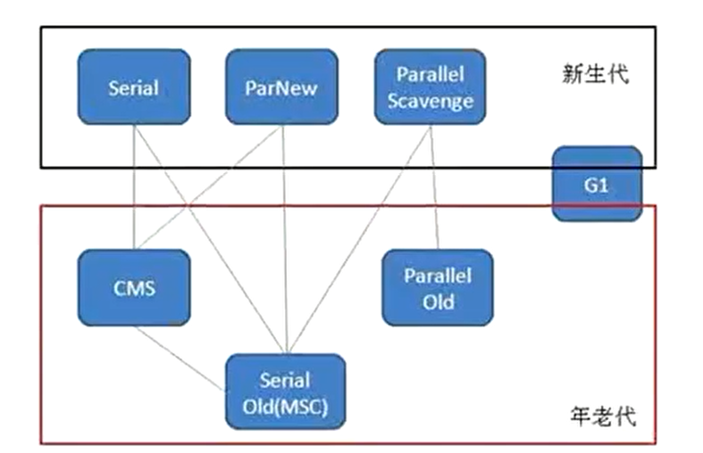

#### 新生代

> 分为Eden区和Survivor区(2个，Survivor0和Survivor1)，内存默认比例8:1:1
>
> - 新生代使用复制算法进行gc，称为minor gc或young gc

#### 老年代

> 进行full gc
>
> - 新生代的对象存活过一个gc次数，就会被放入老年代

### 垃圾回收器

> 查看系统使用的gc收集器情况
>
> java -XX:+PrintCommandLineFlags -version
>
> 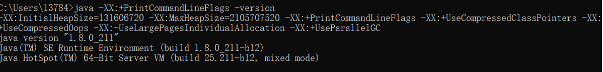

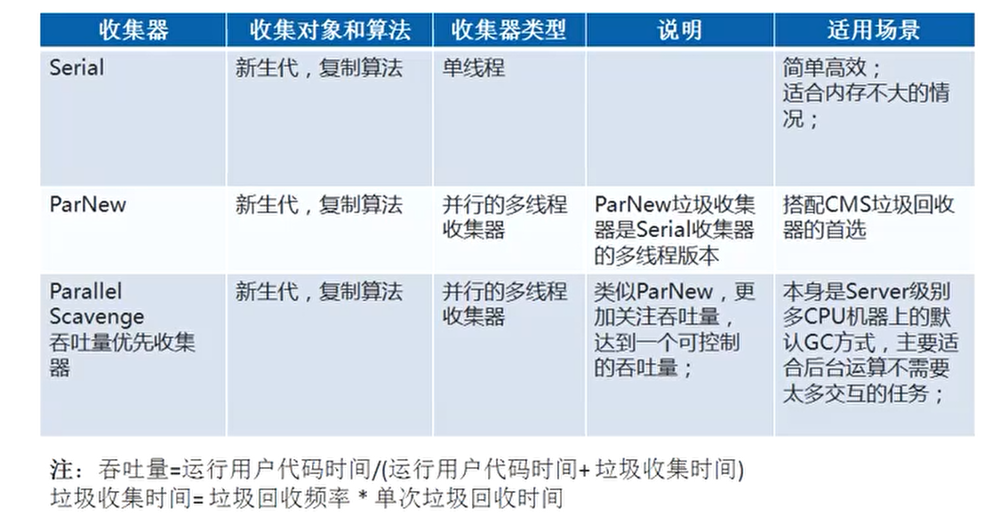

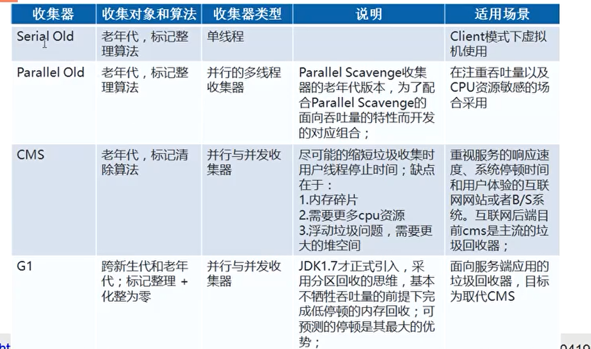

#### 垃圾回收器工作示意图

> - Serial/Serial Old:最古老的，单线程，独占式（gc线程运行时，程序中的其它线程都会被暂停），成熟，单CPU 
>   - -XX:+UseSerialGC新生代和老年代都用串行收集器
>   - -XX:+UseParNewGC新生代使用ParNew，老年代使用 Serial Old
>   - -XX:+UseParallelGC新生代使用ParallerGC，老年代使用 SerialOld
> - ParNew 和 Serial 基本没区别，唯一的区别:多线程，多CPU的，停顿时间比 Serial 少

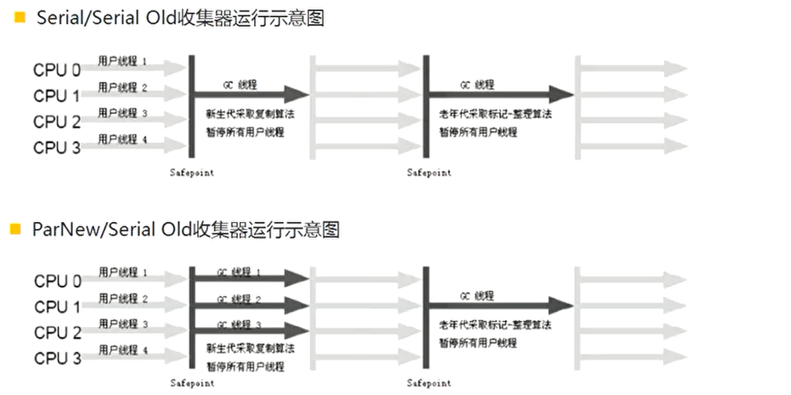

> Parallel Scavenge/Parallel Old
>
> - 关注吞吐量。
> - 停顿时间短的适合用户交互的程序，提高用户体验。
> - 关注吞吐量，后台计算任务
> - -XX:MaxGCPauseMills :控制最大停顿时间
> - -XX:GCTimeRatio 允许垃圾回收时间的占总时间的比率 ，吞吐量的倒数 ，如整数 =19，则允许的GC时间 (1/1+19)=5%
> - -XX:+UseAdaptivesizePolicy：自适应大小策略，如果开启 AdaptiveSizePolicy，则每次 GC 后会重新计算 Eden、From 和 To 区的大小，计算依据是 GC 过程中统计的 **GC 时间、吞吐量、内存占用量**
>   - [JVM GC 之「AdaptiveSizePolicy」实战](<https://www.jianshu.com/p/7414fd6862c5>)
> - -XX:+UseParallerOldGC:新生代使用 ParallerGC，老年代使用 Parallel Old.
>
> Concurrent Mark Sweep
>
> - 关注最短停顿时间
> - 过程
>   - 初始标记：暂停应用，时间短暂，只标记GC roots直接关联的对象，即第一层
>   - 并发标记：和用户的应用程序同时进行
>   - 重新标记：暂停应用，时间短暂，在并发标记过程中，某些对象的状态可能已经发生了变化（但是数量不多），就需要重新标记
>   - 并发清除：和用户的应用程序同时进行
>   - 参数：-XX:+UseConcMarkSweepGC，新生代使用 ParNew，表示老年代的用 CMS

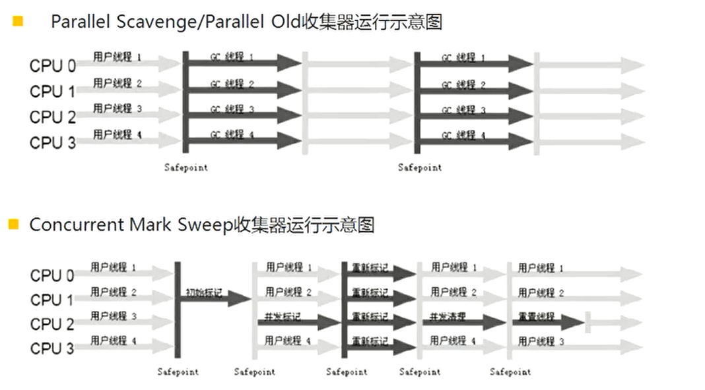

#### G1图示

> 开启G1:-XX:+UseG1GC

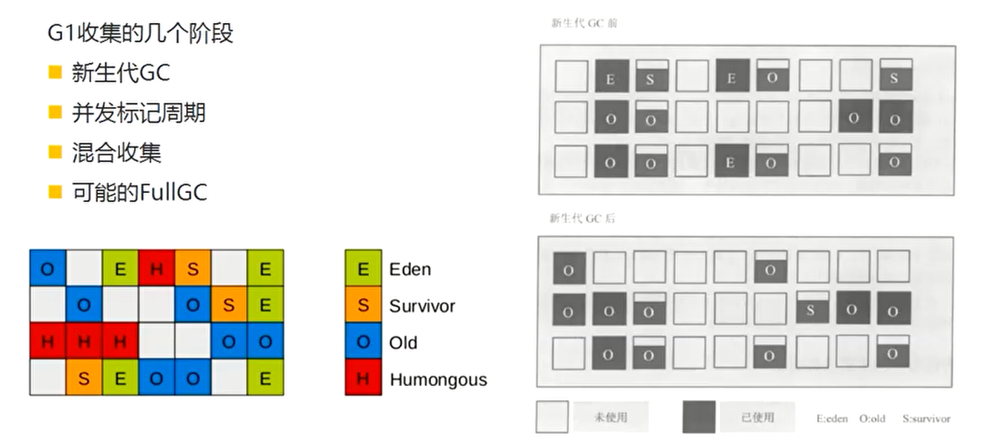

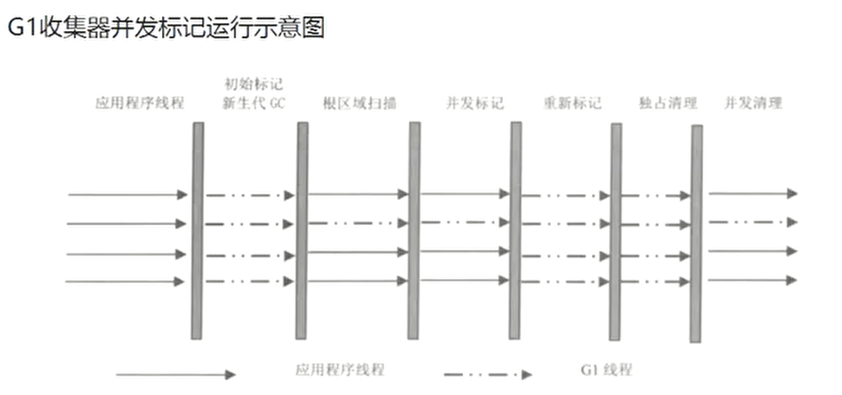

### 新一代的垃圾回收

> JDK 11中的ZGC-—种可扩展的低延迟垃圾收集器
>
> - 处理TB量级的堆
> - GC时间不超过10ms
> - 与使用G1相比，应用吞吐量的降低不超过15%