## 说明

## 目录

## jvm内存区域

### 运行时数据区

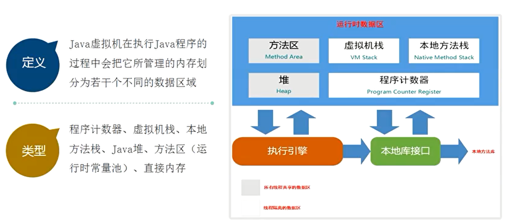

### 各个区域的作用

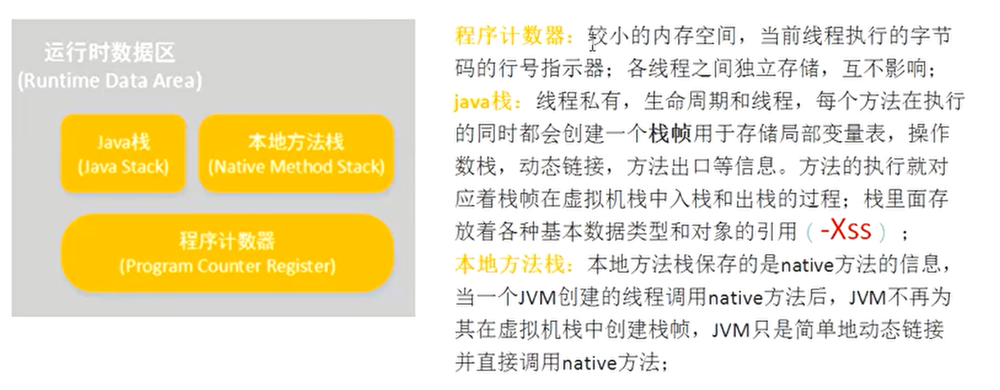

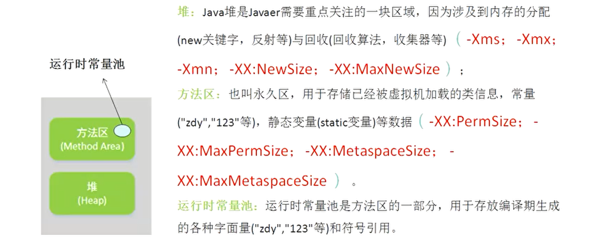

> - -Xms:堆最小值
> - -Xmx:堆最大值
> - -Xmn:新生代大小
> - -XX:NewSize:新生代最小值
> - -XX:MaxNewSize:新生代最大值

### jdk各版本内存区域变化

#### jdk1.6

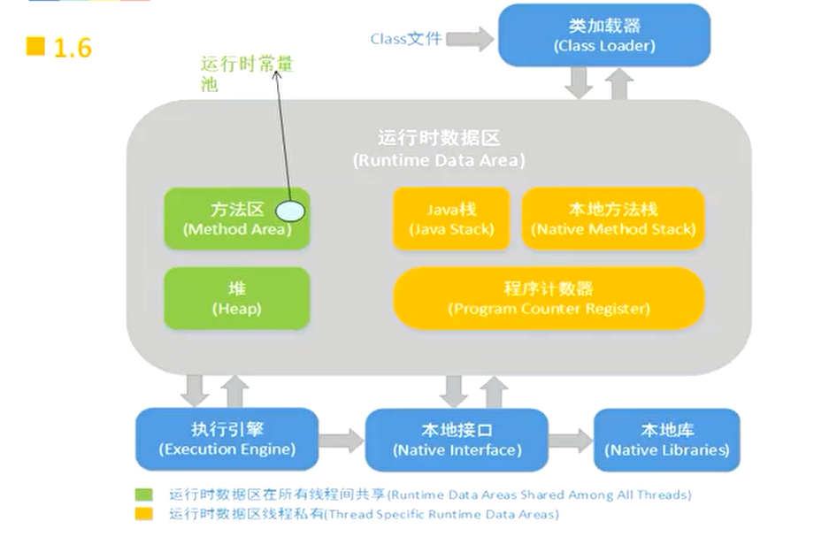

#### jdk1.7

> 将运行时常量池从方法区移到堆中

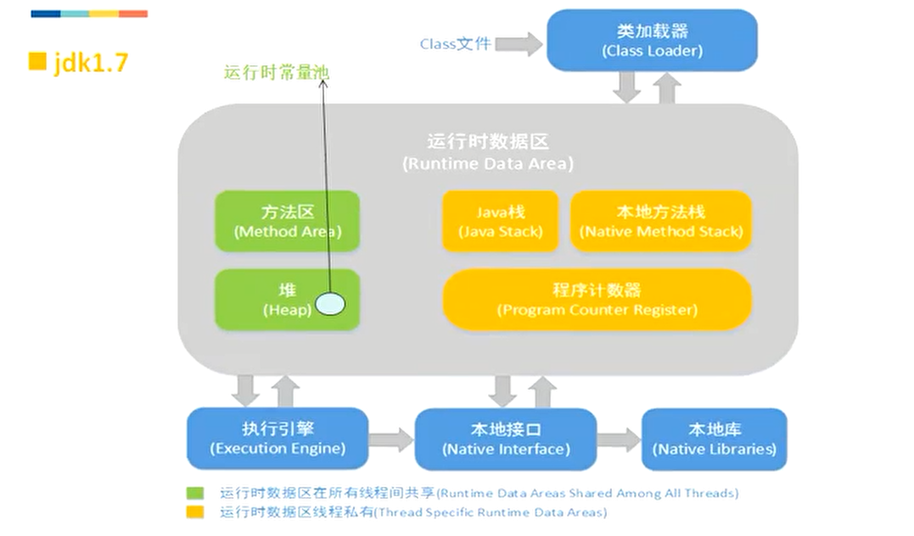

#### jdk1.8

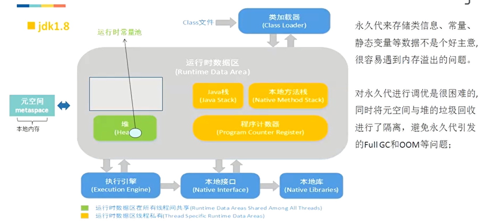

### 直接内存

> 避免数据在系统态和用户态之间相互拷贝

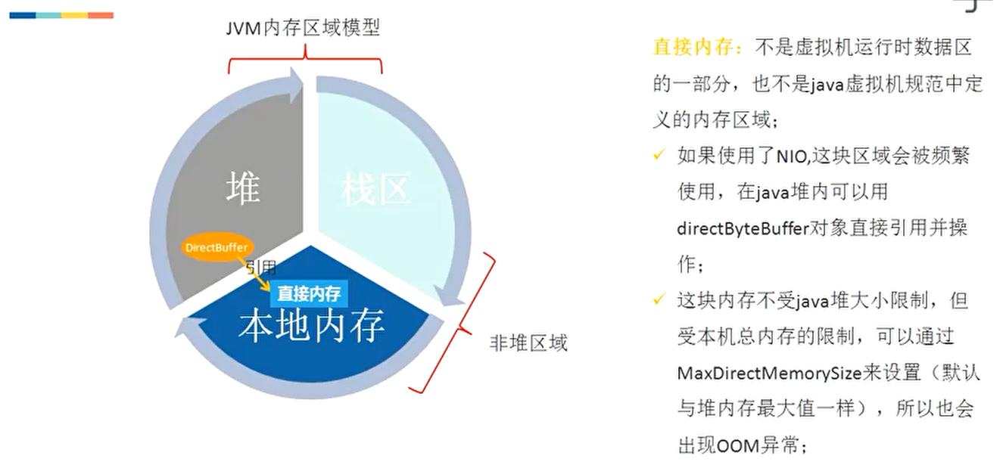

### 堆和栈

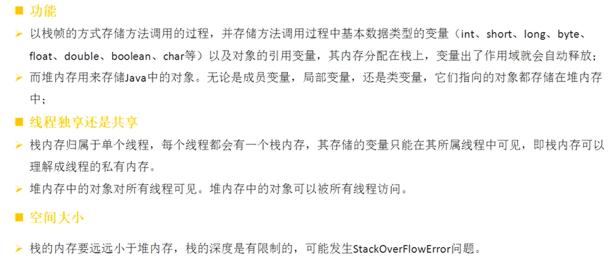

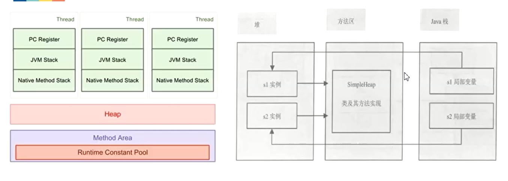

### 方法出入栈

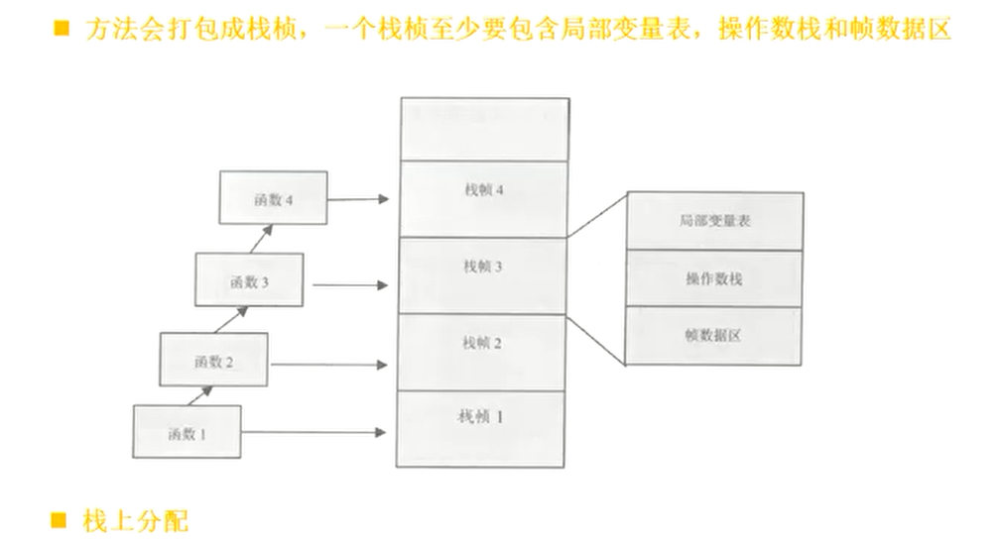

> 栈上分配：对于某些局部对象，可以在栈上进行分配创建，这样它的声明周期就跟所在方法相同，方法执行完成，该对象自然就被销毁，但是若对象被作为方法的返回值进行返回，其作用域就超出了方法，这个时候就不能进行栈上分配，所以会对对象进行**逃逸分析**来使用栈上分配

#### 栈上分配测试

##### 代码

```java
public class TestStackAllocate {
    public static class User {
        private int age;
        private String name;

        public User(int age, String name) {
            this.age = age;
            this.name = name;
        }
    }

    public static void getUser() {
        User user = new User(18, "zhangsan");
    }

    public static void main(String[] args) {
        long start = System.currentTimeMillis();
        for (int i = 0; i < 100000000; i++) {
            getUser();
        }
        long end = System.currentTimeMillis();
        System.out.println((end - start) + "ms");
    }
}
```

##### jvm参数

```
-server
-Xmx10m
-Xms10m
-XX:+DoEscapeAnalysis
-XX:+PrintGC
-XX:+EliminateAllocations
-XX:-UseTLAB
```

##### 参数说明

```
-server：JVM 运行的模式, server 才能进行逃逸分析 mix/client,
-Xmx10m：jvm堆最大值
-Xms10m：jvm堆最小值
-XX:+DoEscapeAnalysis：开启逃逸分析，必须在-server模式下
-XX:+PrintGC：打印gc日志
-XX:+EliminateAllocations：开启标量替换
-XX:-UseTLAB：ThreadLocalAllocBuffer，事先在堆里面为每个线程分配一块私有内存
```

### 虚拟机中的对象

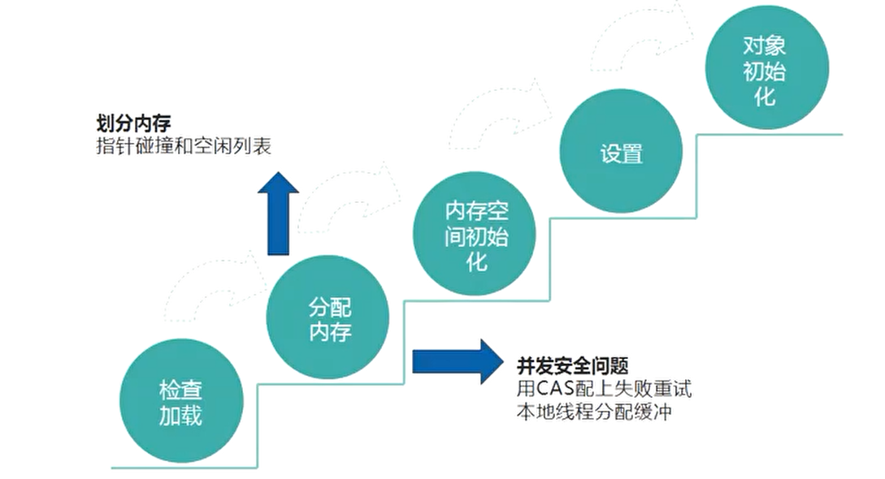