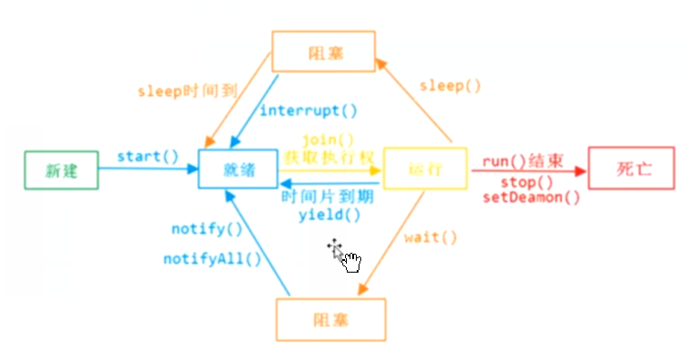

## 说明

## 目录

## 线程基础

### CPU核心数和线程数的关系

> - 一般来说，CPU核心数和线程数是**1:1**的关系
> - Intel引入**超线程技术**之后，CPU核心数：线程数=**1:2**

### CPU时间片轮转机制

> - RR调度，  时间片轮转法（Round-Robin，RR）主要用于分时系统中的进程调度。为了实现轮转调度，系统把所有就绪进程按先入先出的原则排成一个队列。新来的进程加到就绪队列末尾。每当执行进程调度时，进程调度程序总是选出就绪队列的队首进程，让它在 CPU 上运行一个时间片的时间。时间片是一个小的时间单位，通常为 10~100ms 数量级。当进程用完分给它的时间片后，系统的计时器发出时钟中断，调度程序便停止该进程的运行，把它放入就绪队列的末尾；然后，把 CPU 分给就绪队列的队首进程，同样也让它运行一个时间片，如此往复
>
>   [CPU时间片轮转机制(RR调度)](https://hacpai.com/article/1541479518505)
>
> - 上下文切换

### 什么是进程和线程

> - 进程：程序运行进行资源分配的最小单位，进程内部可能包含多个线程，这多个线程会共享该进程的资源，而进程和进程之间是相互独立的
> - 线程：CPU调度的最小单位，线程必须依附于某个进程，使用分配给进程的资源
> - 一个进程运行时，必须要创建一个线程

### 澄清并行和并发

> - 并行：同一时刻执行的任务数，如一个食堂有8个窗口，则并行度为8
> - 并发：是一个假的并行，与时间单位相关，如一个食堂有8个窗口，每个学生打饭时间30s，则1分钟的并发度为16
> - [并发和并行的区别](https://www.jianshu.com/p/cbf9588b2afb)

### 高并发编程的意义、好处和注意事项

> - 由于多个线程关系资源，就存在资源冲突，可能会造成死锁
> - 创建太多的线程可能使机器崩溃

## 认识java里的线程

### java里的抽象天生就是多线程的，那么有几种新启动线程的方式？

> - 类Thread：继承Thread
> - 接口Runnable：不带返回值的线程
> - 接口Callable：带返回值的线程，使用Future接收返回结果
>
> ```java
> public class MyThread {
> 
>     public static class MyRunnable implements Runnable{
> 
>         @Override
>         public void run() {
>             System.out.println("MyRunnable start");
>         }
>     }
> 
>     public static class MyCallable implements Callable<String>{
> 
>         @Override
>         public String call() throws Exception {
>             System.out.println("MyCallable start");
>             return "MyCallable";
>         }
>     }
> 
>     public static void main(String[] args) throws ExecutionException, InterruptedException {
>         new Thread(new MyRunnable()).start();
> 
>         MyCallable myCallable = new MyCallable();
>         //使用FutureTask将Callable包装成Runnable
>         FutureTask<String> futureTask = new FutureTask<>(myCallable);
>         new Thread(futureTask).start();
> 
>         //获取结果
>         System.out.println(futureTask.get());
>     }
> }
> ```

### 只有一个main函数的程序执行时会有几个线程？

```java
public class OnlyMain {
    public static void main(String[] args) {
        //虚拟机线程管理接口
        ThreadMXBean threadMXBean = ManagementFactory.getThreadMXBean();
        //获取当前所有线程信息数组
        ThreadInfo[] threadInfos = threadMXBean.dumpAllThreads(false, false);
        for (ThreadInfo threadInfo : threadInfos) {
            System.out.println(MessageFormat.format("[{0}] {1}",threadInfo.getThreadId(),threadInfo.getThreadName()));
        }
    }
}
```

运行结果

```
[6] Monitor Ctrl-Break
[5] Attach Listener
[4] Signal Dispatcher
[3] Finalizer
[2] Reference Handler
[1] main	
```

说明

> **Reference Handler**：它主要用于处理引用对象本身（软引用、弱引用、虚引用）的垃圾回收问题
>
> **Finalizer**：finalize方法相关的线程
>
> **Attach Listener** ：线程是负责接收到外部的命令，而对该命令进行执行的并且吧结果返回给发送者。通常我们会用一些命令去要求jvm给我们一些反馈信息，如：java -version、jmap、jstack等等。如果该线程在jvm启动的时候没有初始化，那么，则会在用户第一次执行jvm命令时，得到启动
>
> **signal dispather**： 前面我们提到第一个Attach Listener线程的职责是接收外部jvm命令，当命令接收成功后，会交给signal dispather线程去进行分发到各个不同的模块处理命令，并且返回处理结果。signal dispather线程也是在第一次接收外部jvm命令时，进行初始化工作。

### 如何让线程安全停止工作？

#### 已废弃

> - stop()：已废弃，无法保证线程占用的资源安全释放
> - resume()：已废弃
> - suspend()：已废弃，挂起线程，不会释放线程所占用的资源
> - destroy()：已废弃

#### 正确方式

> - interrupt()：中断当前线程，java中线程是**协作式**的，调用该方法时，并不会强制关闭该线程，只是发送了一个信号（本质上是修改一个**中断标志**，将其设置为true），不一定会成功
>
>   ```java
>       public void interrupt() {
>           if (this != Thread.currentThread())
>               checkAccess();
>   
>           synchronized (blockerLock) {
>               Interruptible b = blocker;
>               if (b != null) {
>                   interrupt0();           // Just to set the interrupt flag，设置中断标志
>                   b.interrupt(this);
>                   return;
>               }
>           }
>           interrupt0();
>       }
>   ```
>
> - interrupted()：静态方法，判定当前线程是否处于中断状态，并且会将中断标志设置为false
>
>   ```java
>   public static boolean interrupted() {
>           return currentThread().isInterrupted(true);
>       }
>   ```
>
> - isInterrupted()：判定当前线程是否处于中断状态，不清除标志
>
>   ```java
>       public boolean isInterrupted() {
>           return isInterrupted(false);
>       }
>   
>   //ClearInterrupted标识是否清楚标志位
>   private native boolean isInterrupted(boolean ClearInterrupted);
>   ```

#### 使用demo

> - 若主线程调用的线程的interrupt()方法，而该线程内部并没有处理中断状态的话，则该线程不会被中断
>
>   ```java
>   public class MyThread2 {
>       public static class MyRunnable implements Runnable{
>   
>           @Override
>           public void run() {
>               Thread thread = Thread.currentThread();
>               while (!thread.isInterrupted()){
>                   System.out.println("MyRunnable run");
>               }
>               System.out.println("MyRunnable Interrupt:"+thread.isInterrupted());
>           }
>       }
>   
>       public static void main(String[] args) throws InterruptedException {
>           Thread thread = new Thread(new MyRunnable());
>           thread.start();
>           TimeUnit.MILLISECONDS.sleep(200);
>           thread.interrupt();
>       }
>   }
>   ```
>
> - 若线程中抛出**InterruptedException**，则必须手动在catch块中调用thread.interrupt()中断线程
>
>   ```java
>   public class MyThread2 {
>       public static class MyRunnable implements Runnable{
>   
>           @Override
>           public void run() {
>               Thread thread = Thread.currentThread();
>               while (!thread.isInterrupted()){
>                   try {
>                       Thread.sleep(100);
>                   } catch (InterruptedException e) {
>                       //手动中断
>                       thread.interrupt();
>                       e.printStackTrace();
>                   }
>               }
>               System.out.println("MyRunnable Interrupt:"+thread.isInterrupted());
>           }
>       }
>   
>       public static void main(String[] args) throws InterruptedException {
>           Thread thread = new Thread(new MyRunnable());
>           thread.start();
>           TimeUnit.MILLISECONDS.sleep(200);
>           thread.interrupt();
>       }
>   }
>   ```
>
> - 

### 对java里的线程在多一点认识

#### 线程常用方法和线程状态



#### run方法和start方法

> - 若直接调用run方法，run方法会被当成普通方法调用
> - 要启动线程，需要调用线程的start方法，虚拟机会将其映射成操作系统的一个线程

#### 线程优先级

> - 优先级范围为1~10，默认为5，优先级在不同的操作系统有不同的表现，不好移植，所以不建议使用
> - 优先级值越高，调度器将倾向于让其先执行
> - 优先级可以通过setPriority()进行设置

#### 守护线程

> - 及后台线程，主线程结束后，不管守护线程是否结束，都会结束守护线程
> - 守护线程中的try-finally块不一定会执行，因为还没有开始执行虚拟机就停止运行了

## 线程之间的共享和协作

### java内置锁synchronized

> - synchronized使用对象的锁实现隔离
>
> - synchronized可以修饰方法或者代码块
>
> - synchronized使用在方法上，一个任务可以多次获得对象的锁，即在一个同步方法里面可以调用另一个同步方法，虚拟机会在每进入一次同步方法时进行计数，进入+1，离开-1，执行变成0结束
>
>   > - 静态方法：使用类的Class对象（类锁）进行加锁
>   > - 实例方法：使用this对象（对象锁）进行加锁
>
> - synchronized使用在代码块

### volatile

> - 保证多线程情况下变量值的**可见性**，因为每个线程操作时，都会将变量的值从主内存先复制一份到自己的工作内存，待操作完成后，再刷新会主内存
>
> - volatile可以保证变量前后不进行指令重排序
>
> - volatile并不能保证原子性，如两个线程都对变量a=0进行+1，可能执行完成后值为1，而不是2
>
>   > a++实际上是3个操作，volatile只能保证每一次执行第一步的时候是从主内存获取最新值，而不是使用工作内存中的缓存值
>   >
>   > 1. 从主内存读取a的值到工作内存
>   >
>   > 2. 进行+1操作得到2
>   >
>   > 3. 将新值写回主内存

### 线程间的协作

#### 等待和通知

> - wait()：对象上的方法，调用wait()方法的当前线程会让出对象锁，进入阻塞状态
>
> - notify()/notifyAll()：对象上的方法，notify会唤醒一个在阻塞队列上等待对象锁的线程，notifyAll会唤醒所有线程
>
> - 等待和通知的标准范式
>
>   > - 等待方
>   >
>   >   ```
>   >   1.获取对象的锁
>   >   2.循环里判断条件是否满足，不满足调用wait方法
>   >   3.条件满足执行业务逻辑
>   >   ```
>   >
>   > - 通知方
>   >
>   >   ```
>   >   1.获取对象的锁
>   >   2.改变条件
>   >   3.通知所有等待带对象上的线程
>   >   ```
>   >
>   >   
>
> - notify()/notifyAll()应该用哪个？
>
>   > 应该尽量使用notifyAll，因为如果使用notify，可能会丢失信号，唤醒一个非预期的线程，这时其它所有线程仍然处于阻塞状态
>
> - 1

## 并发工具类

### ThreadLocal

> - ThreadLocal可以保证每个线程操作的变量的线程安全