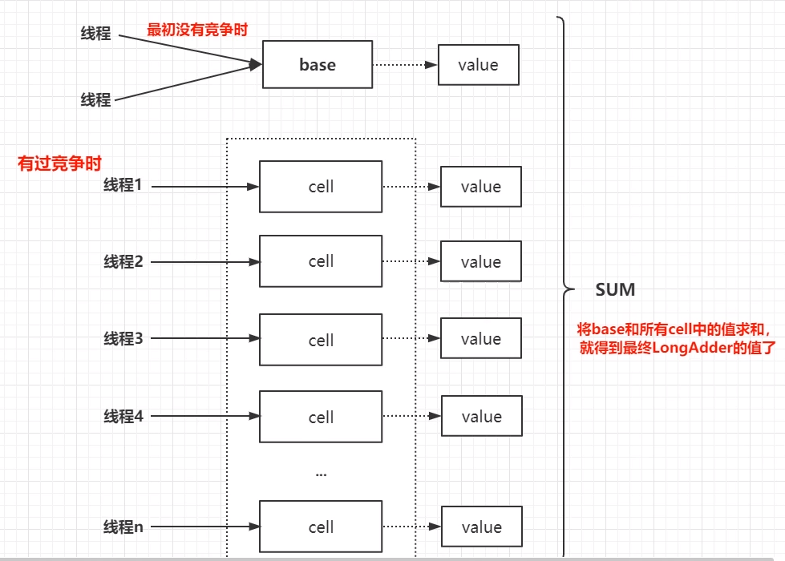

## 说明

## 目录

## AtomicLong高并发效率低原因

```java
public final long getAndIncrement() {
    return unsafe.getAndAddLong(this, valueOffset, 1L);
}

public final long getAndAddLong(Object o, long offset, long delta) {
    long v;
    //自旋直到cas成功为止，高并发情况下，每次只能有一个线程成功，则其它线程又会继续自旋，直到cas成功
    do {
        v = getLongVolatile(o, offset);
    } while (!compareAndSwapLong(o, offset, v, v + delta));
    return v;
}
```

## LongAdder执行流程图  

> - 多个线程开始都对base进行cas操作，但只要一个线程会成功，失败的线程就在cell数组（可动态扩容）中找到一个合适的cell，寻址方式类似于HashMap，然后操作对应的cell，这样就减少了多个线程对同一个变量的竞争
> - 当要获取当前值时，需要对base和cell数组所有的cell进行求和，但是**不会保证实时性**



## add方法

```java
public void add(long x) {
    //as：cells数组引用
    //b: base的值
    //v: 表示期望值
    //m: cells数组的长度
    //a: 当前线程命中的cell
    Cell[] as; long b, v; int m; Cell a;
    //条件一:true->表示cells已经初始化过了，当前线程应该将数据写入到对应的cell中
    //      fatse->表示cells未初始化，当前所有线程应该将数据写到base
    //条件二: false->表示当前线程cas替换数据成功，
    //      true->表示发生竞争了，可能需要重试 或者 扩容
    if ((as = cells) != null || !casBase(b = base, b + x)) {
        //进入执行体条件，2选1
        //1.cells数组不为空
        //2.cas设置base失败

        //true：未发生竞争，false:发生竞争
        boolean uncontended = true;
        //条件一: true->说明 cells 未初始化，也就是多线程写base发生竞争了
        //      false->说明 cells 已经初始化了，当前线程应该是 找自己的cell写值
        //条件二: getProbe()获取当前线程的hash值 m表示cells长度-1 cells长度一定是2的次方数
        //      true->说明当前线程对应下标的cell为空，需要创建 LongAccumulate 支持
        //      false-> 说明当前线程对应的cell不为空，说明下一步想要将x值 添加到ceい中。
        //条件三: true->表示cas失败，意味着当前线程对应的ceLL有竞争
        //      false->表示cas成功
        if (as == null || (m = as.length - 1) < 0 ||
            (a = as[getProbe() & m]) == null ||
            !(uncontended = a.cas(v = a.value, v + x)))
            //都有哪些情况会调用？
            //1.true->说明 cells 未初始化，也就是多线程写base发生竞争了[重试|初始化cells]
            //2.true-> 说明当前线程对应下标的cell为空，需要创建 LongAccumulate 支持
            //3.true->表示cas失败，意味着当前线程对应的cell有竞争[重试|扩容]
            longAccumulate(x, null, uncontended);
    }
}
```

## longAccumulate

> longAccumulate继承自Striped64

```java
 //都有哪些情况会调用？
    //1.true->说明 cells 未初始化，也就是多线程写base发生竞争了[初始化cells]
    //2.true-> 说明当前线程对应下标的cell为空，需要创建 LongAccumulate 支持
    //3.true->表示cas失败，意味着当前线程对应的cell有竞争[重试|扩容]

    //wasUncontended:只有cells初始化之后，并且当前线程 竟争修改线程对应的cell失败，才会是false
    final void longAccumulate(long x, LongBinaryOperator fn,
                              boolean wasUncontended) {
        //h：线程的hash值
        int h;
        //条件成立，说明当前线程还未分配hash值
        if ((h = getProbe()) == 0) {
            //给当前线程分配hash值,Thread的probe只能通过ThreadLocalRandom初始化
            ThreadLocalRandom.current(); // force initialization
            //获取新的hash值
            h = getProbe();
            //为什么？因为默认情况下 当前线程肯定是写入到了cells[0] 位置。不把它当做一次真正的竞争
            //由于给当前线程重新分配了hash值，下一次找cell就不一定会找到0了
            wasUncontended = true;
        }
        //表示扩容意向 false 一定不会扩容，true 可能会扩容
        boolean collide = false;                // True if last slot nonempty
        for (;;) {
            //as 当前cells数组引用
            //a 当前命中cell
            //n cells数组长度
            //v 期望值
            Cell[] as; Cell a; int n; long v;
            //CASE1:表示cells已经初始化了，当前线程应该将数据写入到对应的cell中
            if ((as = cells) != null && (n = as.length) > 0) {
                //2.true-> 说明当前线程对应下标的cell为空，需要创建 LongAccumulate 支持
                //3.true->表示cas失败，意味着当前线程对应的cell有竞争[重试|扩容]

                //CASE1.1:true->表示当前线程对应的下标位置的cell为nuLL，需要创建new Cell
                if ((a = as[(n - 1) & h]) == null) {
                    //true：锁未被占用
                    if (cellsBusy == 0) {       // Try to attach new Cell
                        Cell r = new Cell(x);   // Optimistically create
                        //加锁设置cell
                        if (cellsBusy == 0 && casCellsBusy()) {
                            //创建cell是否成功
                            boolean created = false;
                            try {               // Recheck under lock
                                //m cells数组长度
                                //j 当前线程命中的cell下标
                                Cell[] rs; int m, j;
                                //rs[j = (m - 1) & h] == null：再次检查对应cell是否未初始化，
                                //因为多线程情况下其他线程可能将该位置cell初始化过了
                                if ((rs = cells) != null &&
                                    (m = rs.length) > 0 &&
                                    rs[j = (m - 1) & h] == null) {
                                    rs[j] = r;
                                    created = true;
                                }
                            } finally {
                                cellsBusy = 0;
                            }
                            if (created)
                                break;
                            continue;           // Slot is now non-empty
                        }
                    }
                    //扩容意向强制修改为false，因为进入当前if时对应cell为空，不需要扩容
                    collide = false;
                }
                //wasUncontended:只有cells初始化之后，并且当前线程 竟争修改线程对应的cell失败，才会是false
                else if (!wasUncontended)       // CAS already known to fail
                    wasUncontended = true;      // Continue after rehash
                //CASE 1.3:当前线程rehash过hash值，然后新命中的ceLL不为空
                //true -> 写成功，退出循环
                //false -> 表示rehash之后命中的新的cell也有竞争 重试1次
                else if (a.cas(v = a.value, ((fn == null) ? v + x :
                                             fn.applyAsLong(v, x))))
                    break;
                //CASE 1.4:
                //条件一:n >- NCPU true->扩容意向改为faLse,表示不扩容了 false->说明ceLLs数组还可以扩容
                //条件二:cells !- as true->其它线程己经扩容过了，当前线程rehash之后重试即可
                else if (n >= NCPU || cells != as)
                    collide = false;            // At max size or stale
                //CASE 1.5:
                //!cotlide = true 设置扩容意向 为true 但是不一定真的发生扩容
                else if (!collide)
                    collide = true;
                //CASE 1.6:真正扩容的逻辑
                //条件一:celtsBusy == 0 true->衣示当前无锁状态，当前线程可以去竞争这把锁
                //条件二: casCellsBusy true->表示当前线程 获取锁成功，可以执行扩容逻辑
                //      false->表示当前时刻有其它线程在做扩容相关的操作。
                else if (cellsBusy == 0 && casCellsBusy()) {
                    try {
                        //双重检查
                        if (cells == as) {      // Expand table unless stale
                            Cell[] rs = new Cell[n << 1];
                            for (int i = 0; i < n; ++i)
                                rs[i] = as[i];
                            cells = rs;
                        }
                    } finally {
                        cellsBusy = 0;
                    }
                    collide = false;
                    continue;                   // Retry with expanded table
                }
                //重置当前线程hash值
                h = advanceProbe(h);
            }
            //CASE2:前置条件cells还未初始化 as 为null
            //条件一:true 表示当前未加锁
            //条件二：cells -- as?因为其它线程可能会在你给as赋值之后修改了 cells
            //条件三：true 表示获取锁成功会把cellsBusy = 1,false 表示其它线程正在持有这把锁
            else if (cellsBusy == 0 && cells == as && casCellsBusy()) {
                boolean init = false;
                try {                           // Initialize table
                    //cells == as?防止其它线程己经初始化了，当前线程再次初始化导致丢失数据
                    if (cells == as) {
                        Cell[] rs = new Cell[2];
                        rs[h & 1] = new Cell(x);
                        cells = rs;
                        init = true;
                    }
                } finally {
                    cellsBusy = 0;
                }
                if (init)
                    break;
            }
            //CASE3:cells数组正在被其它线程初始化
            //1.当前celltsBusy加锁状态，表示其它线程正在初始化cel1s,所以当前线程将值累加到base
            //2.cells被其它线程初始化后，当前线程需要将数据累加到base
            else if (casBase(v = base, ((fn == null) ? v + x :
                                        fn.applyAsLong(v, x))))
                break;                          // Fall back on using base
        }
    }
```