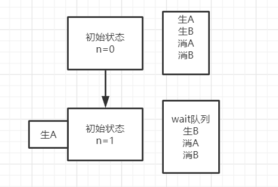

## 说明

## 目录

## 基础知识

### 线程与进程

> 根本区别：进程是操作系统资源分配的基本单位，而线程是任务调度和执行的基本单位,1个进程包含一个或多个线程
>
> [进程和线程的主要区别](https://blog.csdn.net/kuangsonghan/article/details/80674777)

### 线程的状态转换

[Java多线程及线程状态转换](https://www.cnblogs.com/nwnu-daizh/p/8036156.html)

### wait()和notify()

> -  两个方法只有在synchronized中才会生效，否则会抛出异常
> - wait():执行了该方法的线程释放对象的锁，JVM会把该线程放到对象的等待池中。该线程等待其它线程唤醒 
> - notify():执行该方法的线程唤醒在对象的等待池中等待的一个线程，JVM从对象的等待池中随机选择一个线程，把它转到对象的锁池中

#### 线程虚假唤醒

> - 在生产者消费者模型中，不能使用if来判断共享变量，需要放在循环中，当线程被唤醒时，再判断一次条件
>
>   ```java
>        synchronized (obj) {
>            while (<condition does not hold>)
>                obj.wait();
>            ... // Perform action appropriate to condition
>        }
>   
>   ```
>
> - 以2个生产者+2个消费者为例，目的是生产者生产1个产品，立即通知消费者消费，始终保持产品数量为0
>
>   ```java
>   class Apple {
>       private int number = 0;
>   
>       public synchronized void increment() throws InterruptedException {
>           if (number != 0) {
>               wait();
>           }
>           number++;
>           System.out.println(String.format("%s产生了一个苹果，苹果数：%d", Thread.currentThread().getName(), number));
>           notifyAll();
>       }
>   
>       public synchronized void decrement() throws InterruptedException {
>           if (number == 0) {
>               wait();
>           }
>           number--;
>           System.out.println(String.format("%s消费了一个苹果，苹果数：%d", Thread.currentThread().getName(), number));
>           notifyAll();
>       }
>   }
>   
>   
>   public class Main {
>       public static void main(String[] args) {
>           Apple apple = new Apple();
>   
>           new Thread(() -> {
>               try {
>                   for (int i = 0; i < 10; i++) {
>                       apple.increment();
>                   }
>               } catch (InterruptedException e) {
>                   e.printStackTrace();
>               }
>           }, "生产者A").start();
>           new Thread(() -> {
>               try {
>                   for (int i = 0; i < 10; i++) {
>                       apple.increment();
>                   }
>               } catch (InterruptedException e) {
>                   e.printStackTrace();
>               }
>           }, "生产者B").start();
>           new Thread(() -> {
>               try {
>                   for (int i = 0; i < 10; i++) {
>                       apple.decrement();
>                   }
>               } catch (InterruptedException e) {
>                   e.printStackTrace();
>               }
>           }, "消费者A").start();
>           new Thread(() -> {
>               try {
>                   for (int i = 0; i < 10; i++) {
>                       apple.decrement();
>                   }
>               } catch (InterruptedException e) {
>                   e.printStackTrace();
>               }
>           }, "消费者B").start();
>       }
>   }
>   ```
>
>   运行结果可能出现大于1的数甚至小于0的数
>
> - 产生以上问题的原因解读
>
>   - 首先，4个线程启动，由于number开始为0，由于使用了synchronized，同一时间只能有一个线程获取到对象锁，加入生产者A拿到锁，此时不满足number != 0，则会生产一个苹果，然后notifyAll()通知其它3个线程	
>
>     
>
>   - 若此时生产者B拿到锁，此时满足number != 0，进入wait状态，让出锁
>
>   - 然后生产者A又拿到锁，此时满足number != 0，进入wait状态，让出锁
>
>   - **注意**：此时生产者A、B都处于wait状态，若下次拿到锁，都会对number 就你行+1操作，就产生了预料之外的结果，若使用while来判断条件，线程被激活后，还会再判断一次number，就灭蝇问题
>
>   - 然后消费者A拿到了锁，消费一个苹果，然后notifyAll()通知其它3个线程

### synchronized

- 对象的同步方法中可以调用另一个同步方法吗？

  > 可以，一个任务（即线程）可以多次获得对象的锁，每调用一个同步方法，对象锁计数+1，退出方法-1

- 类的static方法添加synchronized，使用的锁对象是类的class对象？

  > 对，synchronized static方法可以在类的范围内防止对static数据的并发访问

### 并发底层知识

[并发机制底层实现整理](https://www.jianshu.com/p/1e82c75034b7)

### volatile

[volatile 相关整理](https://www.jianshu.com/p/ccfe24b63d87)

> - volatile保证线程每次访问到的数据都是最新的数据，即从主存中直接获取
> - volatile可以防止指令从排序
> - volatile 只能保证对单次读/写的原子性。i++ 这种操作不能保证原子性

### Unsafe

[说说Java的Unsafe类](https://www.jianshu.com/p/cda24891f9e4)

[JAVA中神器的双刃剑--Unsafe](https://www.cnblogs.com/throwable/p/9139947.html)

### CAS

[java中的CAS实现原理](https://www.cnblogs.com/javalyy/p/8882172.html)

#### 解决CAS的ABA问题

- AtomicStampedReference和AtomicMarkableReference

  > [AtomicStampedReference使用方法](https://blog.csdn.net/qq_21993785/article/details/80667021)
  >
  > [关于AtomicStampedReference使用的坑](https://blog.csdn.net/xybz1993/article/details/79992120)
  >
  > [AtomicReference，AtomicStampedReference与AtomicMarkableReference的区别](https://www.cnblogs.com/xyhz0310/p/9627582.html)

### AQS

[Java技术之AQS详解](https://www.jianshu.com/p/da9d051dcc3d)

### java四种引用类型

[软引用、弱引用、虚引用-他们的特点及应用场景](https://www.jianshu.com/p/825cca41d962)

### java创建线程的几种方式

> - 继承Thread类
>
> - 实现接口Runnable
>
> - 实现Callable，Callable接口实现的方法为call，并且方法有返回值，方法会抛出异常
>
>   ```java
>   public class MyThread {
>   
>       public static class MyRunnable implements Runnable {
>   
>           @Override
>           public void run() {
>               System.out.println("MyRunnable start");
>           }
>       }
>   
>       public static class MyCallable implements Callable<String> {
>   
>           @Override
>           public String call() throws Exception {
>               System.out.println("MyCallable start");
>               return "MyCallable";
>           }
>       }
>   
>       public static void main(String[] args) throws ExecutionException, InterruptedException {
>           MyCallable myCallable = new MyCallable();
>           FutureTask<String> futureTask = new FutureTask<>(myCallable);
>           new Thread(futureTask).start();
>   
>           System.out.println(futureTask.get());
>       }
>   }
>   ```
>
> - 

## JUC包

### ForkJoin框架

#### 简介

> 从JDK1.7开始，Java提供Fork/Join框架用于并行执行任务，它的思想就是讲一个大任务分割成若干小任务，最终汇总每个小任务的结果得到这个大任务的结果。
>
> 这种思想和MapReduce很像（input --> split --> map --> reduce --> output）
>
> 主要有两步：
>
> - 第一、任务切分；
> - 第二、结果合并
>
> 它的模型大致是这样的：线程池中的每个线程都有自己的工作队列（PS：这一点和ThreadPoolExecutor不同，ThreadPoolExecutor是所有线程公用一个工作队列，所有线程都从这个工作队列中取任务），当自己队列中的任务都完成以后，会从其它线程的工作队列中**偷一个任务执行（工作窃取）**，这样可以充分利用资源。
>
> [Java ForkJoin框架](https://www.cnblogs.com/cjsblog/p/9078341.html)
>
> [forkJoin全面剖析](https://www.cnblogs.com/linlinismine/p/9295701.html)

#### 使用方法

> - 继承RecursiveTask创建带有返回值的任务，没有返回值使用RecursiveAction
> - 任务内部需要有一个判断任务是否需要继续拆分的机制
> - 当任务需要拆分时，拆分后，需要使用invokeAll()递归拆分子任务
> - 使用join()方法获取任务的返回值
> - 执行主任务需要先创建一个ForkJoinPool，由ForkJoinPool的实例提交该任务,然后使用join方法即可获取任务结果

#### 简单使用

> 求2个整数之间所有整数的和

SumTask.java

```java
public class SumTask extends RecursiveTask<Long> {
    private Long start;
    private Long end;
    private final Long THRESHOLD = 1000L;

    public SumTask(Long start, Long end) {
        this.start = start;
        this.end = end;
    }

    @Override
    protected Long compute() {
        if(end-start<=THRESHOLD){
             return LongStream.range(start,end+1).sum();
        }else {
            Long mid = (start+end)/2;
            SumTask left = new SumTask(start,mid);
            SumTask right = new SumTask(mid,end);
            invokeAll(left,right);
            return left.join()+right.join();
        }
    }
}
```

ForkJoinTest.java

```java
public class ForkJoinTest {
    public static void main(String[] args) {
        long start = System.currentTimeMillis();
        ForkJoinPool forkJoinPool = new ForkJoinPool();
        SumTask sumTask = new SumTask(1L, 1000000000L);
        forkJoinPool.execute(sumTask);
        System.out.println(sumTask.join());
        long end = System.currentTimeMillis();
        System.out.println("time:"+(end-start));
    }
}
```

### 使用ReentrantLock和Condition实现精准控制线程交替打印

> - 要实现3个线程交替顺序打印，可以通过还可以通过join方法实现

```java
class MyPrint {
    private int flag = 1;
    private Lock lock = new ReentrantLock();
    private Map<Integer, Condition> conditionMap = new HashMap<>();

    public MyPrint() {
        Condition c1 = lock.newCondition();
        Condition c2 = lock.newCondition();
        Condition c3 = lock.newCondition();
        conditionMap.put(1, c1);
        conditionMap.put(2, c2);
        conditionMap.put(3, c3);
    }

    public void print(int printTime) {
        lock.lock();
        try {
            while (flag != printTime) {
                conditionMap.get(flag).await();
            }
            for (int i = 0; i < printTime * 5; i++) {
                System.out.println(String.format("线程%s,111", Thread.currentThread().getName()));
            }
            int newFlag = (printTime + 1) % 4;
            flag = newFlag == 0 ? 1 : newFlag;
            conditionMap.get(flag).signal();
        } catch (Exception e) {
            e.printStackTrace();
        } finally {
            lock.unlock();
        }
    }

}

public class ConditionDemo {
    public static void main(String[] args) {
        MyPrint myPrint = new MyPrint();
        new Thread(() -> myPrint.print(1), "A").start();
        new Thread(() -> myPrint.print(2), "B").start();
        new Thread(() -> myPrint.print(3), "C").start();
    }
}
```

## CAS（Compare And Swap）

### 什么是原子操作

> 对于java来说。如i++这种操作，并不是原子的，i++分为3步：读取i的值、加一、写回内存；CAS是操作系统提供的可以对上诉情况进行原子操作的指令，它的原理如下：
>
> - CAS包含3个操作数
>   - 内存地址V
>   - 期望值A
>   - 新值B
>
> - 首先一个内存地址V保存了一个变量,线程从V上读取的值与期望的值A相同，则将新值B赋值给地址V，否则不作操作，返回失败

### CAS存在的问题

#### ABA问题

> 有2个线程，其中线程1预期值为A，这时线程2将原始值修改A-->B-->A，线程2修改了2次，又将值修改回了原值A，这对于线程1是无感知的，但其实内存中的值是修改了的
>
> **解决办法**：增加一个版本号，对于每一次修改都修改版本号

#### 性能问题

> 如AotimicInteger的getAndIncrement方法，对原值进行加一操作，每次调用都会内部**自旋**直到成功为止，如果自旋次数过多，就比较耗费性能

#### 只能保证一个变量的原子操作

> java提供了一个类**AtomicReference**解决这个问题，将多个变量组合成一个对象来操作

### java原子操作类分类

> - 更新基本类型类型：AtomicBoolean， Atomiclnteger, AtomicLong
> - 更新数组类:AtomiclntegerArray. AtomicLongArray， AtomicReferenceArray
> - 更新引用类型:AtomicReference， AtomicMarkableReference，AtomicStampedReference
>   - AtomicMarkableReference和AtomicStampedReference都是解决ABA问题的，AtomicMarkableReference关心的是变量是否被修改过，而AtomicStampedReference关心的是变量被修改过几次
> - 原子更新字段类:AtomicReferenceFieldUpdater,AtomiclntegerFieldUpdater,AtomicLongFieldUpdater

### java原子操作类使用

#### Atomiclnteger

```java
public class Test01 {

    public static void main(String[] args) {
        AtomicInteger ai = new AtomicInteger(0);
        ai.getAndIncrement();   //i++
        System.out.println(ai.get());
        ai.incrementAndGet();   //++i
        System.out.println(ai.get());
    }
}
```

#### AtomicReference

```java
public class Test01 {

    public static void main(String[] args) {
        User user = new User("zhangsan",18);
        AtomicReference<User> reference = new AtomicReference<>();
        reference.set(user);
        System.out.println(reference.get());
        User user2 = new User("lisi",20);
        //比较对象的引用
        reference.compareAndSet(user,user2);
        System.out.println(reference.get());

    }

    static class User{
        private String name;
        private int age;

        public User(String name, int age) {
            this.name = name;
            this.age = age;
        }

        @Override
        public String toString() {
            return "User{" +
                    "name='" + name + '\'' +
                    ", age=" + age +
                    '}';
        }
    }
}
```

#### AtomiclntegerArray

```java
public class Test01 {

    public static void main(String[] args) {
        int[] arr = {1, 2};
        AtomicIntegerArray ref = new AtomicIntegerArray(arr);
        //将第一个元素修改为3
        int arr0 = ref.getAndSet(0, 3);
        System.out.println(arr[0]); //1
        System.out.println(arr0);   //1
        System.out.println(ref.get(0)); //3
    }
}
```

#### AtomicStampedReference

```java
public class Test01 {

    public static void main(String[] args) {
        String str = "hello";
        AtomicStampedReference<String> ref = new AtomicStampedReference<>(str, 0);
        boolean result = ref.compareAndSet(str, "hello world", 0, 1);
        System.out.println(result); //true
        //虽然引用的值是对的，但版本号不对，则会修改失败
        boolean result2 = ref.compareAndSet(ref.getReference(), "hello world2", 0, 2);
        System.out.println(result2); //false
    }
}
```

##### 实现原理

> - 使用内部类Pair持有引用和版本号
>
> - compareAndSet源码
>
>   ```java
>   public boolean compareAndSet(V   expectedReference,
>                                V   newReference,
>                                int expectedStamp,
>                                int newStamp) {
>       Pair<V> current = pair;
>       //引用和版本号都对应才进行修改
>       //或者新的引用与版本号与当前的引用和版本号才进行修改
>       return
>           expectedReference == current.reference &&
>           expectedStamp == current.stamp &&
>           ((newReference == current.reference &&
>             newStamp == current.stamp) ||
>            casPair(current, Pair.of(newReference, newStamp)));
>   }
>   
>   private boolean casPair(Pair<V> cmp, Pair<V> val) {
>       return UNSAFE.compareAndSwapObject(this, pairOffset, cmp, val);
>   }
>   ```
>

### java8对CAS的优化

> 增加了LongAdder和DoubleAdder

## AQS