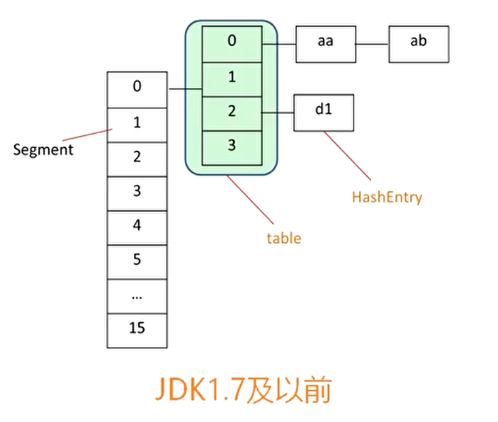

##  说明

## 目录

## 基础知识

### 线程与进程

> 根本区别：进程是操作系统资源分配的基本单位，而线程是任务调度和执行的基本单位,1个进程包含一个或多个线程
>
> [进程和线程的主要区别](https://blog.csdn.net/kuangsonghan/article/details/80674777)

### 线程的状态转换

[Java多线程及线程状态转换](https://www.cnblogs.com/nwnu-daizh/p/8036156.html)

### wait()和notify()

> -  两个方法只有在synchronized中才会生效，否则会抛出异常
> - wait():执行了该方法的线程释放对象的锁，JVM会把该线程放到对象的等待池中。该线程等待其它线程唤醒 
> - notify():执行该方法的线程唤醒在对象的等待池中等待的一个线程，JVM从对象的等待池中随机选择一个线程，把它转到对象的锁池中

#### 线程虚假唤醒

> - 在生产者消费者模型中，不能使用if来判断共享变量，需要放在循环中，当线程被唤醒时，再判断一次条件
>
>   ```java
>        synchronized (obj) {
>            while (<condition does not hold>)
>                obj.wait();
>            ... // Perform action appropriate to condition
>        }
>   
>   ```
>
> - 以2个生产者+2个消费者为例，目的是生产者生产1个产品，立即通知消费者消费，始终保持产品数量为0
>
>   ```java
>   class Apple {
>       private int number = 0;
>   
>       public synchronized void increment() throws InterruptedException {
>           if (number != 0) {
>               wait();
>           }
>           number++;
>           System.out.println(String.format("%s产生了一个苹果，苹果数：%d", Thread.currentThread().getName(), number));
>           notifyAll();
>       }
>   
>       public synchronized void decrement() throws InterruptedException {
>           if (number == 0) {
>               wait();
>           }
>           number--;
>           System.out.println(String.format("%s消费了一个苹果，苹果数：%d", Thread.currentThread().getName(), number));
>           notifyAll();
>       }
>   }
>   
>   
>   public class Main {
>       public static void main(String[] args) {
>           Apple apple = new Apple();
>   
>           new Thread(() -> {
>               try {
>                   for (int i = 0; i < 10; i++) {
>                       apple.increment();
>                   }
>               } catch (InterruptedException e) {
>                   e.printStackTrace();
>               }
>           }, "生产者A").start();
>           new Thread(() -> {
>               try {
>                   for (int i = 0; i < 10; i++) {
>                       apple.increment();
>                   }
>               } catch (InterruptedException e) {
>                   e.printStackTrace();
>               }
>           }, "生产者B").start();
>           new Thread(() -> {
>               try {
>                   for (int i = 0; i < 10; i++) {
>                       apple.decrement();
>                   }
>               } catch (InterruptedException e) {
>                   e.printStackTrace();
>               }
>           }, "消费者A").start();
>           new Thread(() -> {
>               try {
>                   for (int i = 0; i < 10; i++) {
>                       apple.decrement();
>                   }
>               } catch (InterruptedException e) {
>                   e.printStackTrace();
>               }
>           }, "消费者B").start();
>       }
>   }
>   ```
>
>   运行结果可能出现大于1的数甚至小于0的数
>
> - 产生以上问题的原因解读
>
>   - 首先，4个线程启动，由于number开始为0，由于使用了synchronized，同一时间只能有一个线程获取到对象锁，加入生产者A拿到锁，此时不满足number != 0，则会生产一个苹果，然后notifyAll()通知其它3个线程	
>
>     
>
>   - 若此时生产者B拿到锁，此时满足number != 0，进入wait状态，让出锁
>
>   - 然后生产者A又拿到锁，此时满足number != 0，进入wait状态，让出锁
>
>   - **注意**：此时生产者A、B都处于wait状态，若下次拿到锁，都会对number 就你行+1操作，就产生了预料之外的结果，若使用while来判断条件，线程被激活后，还会再判断一次number，就灭蝇问题
>
>   - 然后消费者A拿到了锁，消费一个苹果，然后notifyAll()通知其它3个线程

### synchronized

- 对象的同步方法中可以调用另一个同步方法吗？

  > 可以，一个任务（即线程）可以多次获得对象的锁，每调用一个同步方法，对象锁计数+1，退出方法-1

- 类的static方法添加synchronized，使用的锁对象是类的class对象？

  > 对，synchronized static方法可以在类的范围内防止对static数据的并发访问

### 并发底层知识

[并发机制底层实现整理](https://www.jianshu.com/p/1e82c75034b7)

### volatile

[volatile 相关整理](https://www.jianshu.com/p/ccfe24b63d87)

> - volatile保证线程每次访问到的数据都是最新的数据，即从主存中直接获取
> - volatile可以防止指令从排序
> - volatile 只能保证对单次读/写的原子性。i++ 这种操作不能保证原子性

### Unsafe

[说说Java的Unsafe类](https://www.jianshu.com/p/cda24891f9e4)

[JAVA中神器的双刃剑--Unsafe](https://www.cnblogs.com/throwable/p/9139947.html)

### AQS

[Java技术之AQS详解](https://www.jianshu.com/p/da9d051dcc3d)

### java四种引用类型

[软引用、弱引用、虚引用-他们的特点及应用场景](https://www.jianshu.com/p/825cca41d962)

### java创建线程的几种方式

> - 继承Thread类
>
> - 实现接口Runnable
>
> - 实现Callable，Callable接口实现的方法为call，并且方法有返回值，方法会抛出异常
>
>   ```java
>   public class MyThread {
>   
>       public static class MyRunnable implements Runnable {
>   
>           @Override
>           public void run() {
>               System.out.println("MyRunnable start");
>           }
>       }
>   
>       public static class MyCallable implements Callable<String> {
>   
>           @Override
>           public String call() throws Exception {
>               System.out.println("MyCallable start");
>               return "MyCallable";
>           }
>       }
>   
>       public static void main(String[] args) throws ExecutionException, InterruptedException {
>           MyCallable myCallable = new MyCallable();
>           FutureTask<String> futureTask = new FutureTask<>(myCallable);
>           new Thread(futureTask).start();
>   
>           System.out.println(futureTask.get());
>       }
>   }
>   ```
>
> - 

## 线程虚假唤醒

### 什么是虚假唤醒

> - 当一个条件满足时，很多线程都被唤醒了，但是只有其中部分是有用的唤醒，其它的唤醒都是无用功
> - 比如说买货，如果商品本来没有货物，突然进了一件商品，这时所有的线程都被唤醒了，但是只能一个人买，所以其他人都是假唤醒，获取不到对象的锁

### 如何避免虚假唤醒

> - wait要始终保证在while循环当中，保证被唤醒后再次验证条件
> - 因为if判断只会在进去的时候判断一次，当唤醒多个线程后，多个线程都不会再判断条件，直接向下继续执行，如有一个生产者，2个消费者时，生产者生产了一个产品，通过notifyAll（因为notify无法实现精确唤醒，就只有使用notifyAll来保证需要的线程被唤醒）唤醒所有等待的线程去消费产品，这时产品就会减2，就出现了错误状态

## JUC包

### ForkJoin框架

#### 简介

> 从JDK1.7开始，Java提供Fork/Join框架用于并行执行任务，它的思想就是讲一个大任务分割成若干小任务，最终汇总每个小任务的结果得到这个大任务的结果。
>
> 这种思想和MapReduce很像（input --> split --> map --> reduce --> output）
>
> 主要有两步：
>
> - 第一、任务切分；
> - 第二、结果合并
>
> 它的模型大致是这样的：线程池中的每个线程都有自己的工作队列（PS：这一点和ThreadPoolExecutor不同，ThreadPoolExecutor是所有线程公用一个工作队列，所有线程都从这个工作队列中取任务），当自己队列中的任务都完成以后，会从其它线程的工作队列中**偷一个任务执行（工作窃取）**，这样可以充分利用资源。
>
> [Java ForkJoin框架](https://www.cnblogs.com/cjsblog/p/9078341.html)
>
> [forkJoin全面剖析](https://www.cnblogs.com/linlinismine/p/9295701.html)

#### 使用方法

> - 继承RecursiveTask创建带有返回值的任务，没有返回值使用RecursiveAction
> - 任务内部需要有一个判断任务是否需要继续拆分的机制
> - 当任务需要拆分时，拆分后，需要使用invokeAll()递归拆分子任务
> - 使用join()方法获取任务的返回值
> - 执行主任务需要先创建一个ForkJoinPool，由ForkJoinPool的实例提交该任务,然后使用join方法即可获取任务结果

#### 简单使用

> 求2个整数之间所有整数的和

SumTask.java

```java
public class SumTask extends RecursiveTask<Long> {
    private Long start;
    private Long end;
    private final Long THRESHOLD = 1000L;

    public SumTask(Long start, Long end) {
        this.start = start;
        this.end = end;
    }

    @Override
    protected Long compute() {
        if(end-start<=THRESHOLD){
             return LongStream.range(start,end+1).sum();
        }else {
            Long mid = (start+end)/2;
            SumTask left = new SumTask(start,mid);
            SumTask right = new SumTask(mid,end);
            invokeAll(left,right);
            return left.join()+right.join();
        }
    }
}
```

ForkJoinTest.java

```java
public class ForkJoinTest {
    public static void main(String[] args) {
        long start = System.currentTimeMillis();
        ForkJoinPool forkJoinPool = new ForkJoinPool();
        SumTask sumTask = new SumTask(1L, 1000000000L);
        forkJoinPool.execute(sumTask);
        System.out.println(sumTask.join());
        long end = System.currentTimeMillis();
        System.out.println("time:"+(end-start));
    }
}
```

### 使用ReentrantLock和Condition实现精准控制线程交替打印

> - 要实现3个线程交替顺序打印，可以通过还可以通过join方法实现

```java
class MyPrint {
    private int flag = 1;
    private Lock lock = new ReentrantLock();
    private Map<Integer, Condition> conditionMap = new HashMap<>();

    public MyPrint() {
        Condition c1 = lock.newCondition();
        Condition c2 = lock.newCondition();
        Condition c3 = lock.newCondition();
        conditionMap.put(1, c1);
        conditionMap.put(2, c2);
        conditionMap.put(3, c3);
    }

    public void print(int printTime) {
        lock.lock();
        try {
            while (flag != printTime) {
                conditionMap.get(flag).await();
            }
            for (int i = 0; i < printTime * 5; i++) {
                System.out.println(String.format("线程%s,111", Thread.currentThread().getName()));
            }
            int newFlag = (printTime + 1) % 4;
            flag = newFlag == 0 ? 1 : newFlag;
            conditionMap.get(flag).signal();
        } catch (Exception e) {
            e.printStackTrace();
        } finally {
            lock.unlock();
        }
    }

}

public class ConditionDemo {
    public static void main(String[] args) {
        MyPrint myPrint = new MyPrint();
        new Thread(() -> myPrint.print(1), "A").start();
        new Thread(() -> myPrint.print(2), "B").start();
        new Thread(() -> myPrint.print(3), "C").start();
    }
}
```

## CAS（Compare And Swap）

### 什么是原子操作

> 对于java来说。如i++这种操作，并不是原子的，i++分为3步：读取i的值、加一、写回内存；CAS是操作系统提供的可以对上诉情况进行原子操作的指令，它的原理如下：
>
> - CAS包含3个操作数
>   - 内存地址V
>   - 期望值A
>   - 新值B
>
> - 首先一个内存地址V保存了一个变量,线程从V上读取的值与期望的值A相同，则将新值B赋值给地址V，否则不作操作，返回失败

### CAS存在的问题

#### ABA问题

> 有2个线程，其中线程1预期值为A，这时线程2将原始值修改A-->B-->A，线程2修改了2次，又将值修改回了原值A，这对于线程1是无感知的，但其实内存中的值是修改了的
>
> **解决办法**：增加一个版本号，对于每一次修改都修改版本号

#### 性能问题

> 如AotimicInteger的getAndIncrement方法，对原值进行加一操作，每次调用都会内部**自旋**直到成功为止，如果自旋次数过多，就比较耗费性能

#### 只能保证一个变量的原子操作

> java提供了一个类**AtomicReference**解决这个问题，将多个变量组合成一个对象来操作

### java原子操作类分类

> - 更新基本类型类型：AtomicBoolean， Atomiclnteger, AtomicLong
> - 更新数组类:AtomiclntegerArray. AtomicLongArray， AtomicReferenceArray
> - 更新引用类型:AtomicReference， AtomicMarkableReference，AtomicStampedReference
>   - AtomicMarkableReference和AtomicStampedReference都是解决ABA问题的，AtomicMarkableReference关心的是变量是否被修改过，而AtomicStampedReference关心的是变量被修改过几次
> - 原子更新字段类:AtomicReferenceFieldUpdater,AtomiclntegerFieldUpdater,AtomicLongFieldUpdater

### java原子操作类使用

#### Atomiclnteger

```java
public class Test01 {

    public static void main(String[] args) {
        AtomicInteger ai = new AtomicInteger(0);
        ai.getAndIncrement();   //i++
        System.out.println(ai.get());
        ai.incrementAndGet();   //++i
        System.out.println(ai.get());
    }
}
```

#### AtomicReference

```java
public class Test01 {

    public static void main(String[] args) {
        User user = new User("zhangsan",18);
        AtomicReference<User> reference = new AtomicReference<>();
        reference.set(user);
        System.out.println(reference.get());
        User user2 = new User("lisi",20);
        //比较对象的引用
        reference.compareAndSet(user,user2);
        System.out.println(reference.get());

    }

    static class User{
        private String name;
        private int age;

        public User(String name, int age) {
            this.name = name;
            this.age = age;
        }

        @Override
        public String toString() {
            return "User{" +
                    "name='" + name + '\'' +
                    ", age=" + age +
                    '}';
        }
    }
}
```

#### AtomiclntegerArray

```java
public class Test01 {

    public static void main(String[] args) {
        int[] arr = {1, 2};
        AtomicIntegerArray ref = new AtomicIntegerArray(arr);
        //将第一个元素修改为3
        int arr0 = ref.getAndSet(0, 3);
        System.out.println(arr[0]); //1
        System.out.println(arr0);   //1
        System.out.println(ref.get(0)); //3
    }
}
```

#### AtomicStampedReference

```java
public class Test01 {

    public static void main(String[] args) {
        String str = "hello";
        AtomicStampedReference<String> ref = new AtomicStampedReference<>(str, 0);
        boolean result = ref.compareAndSet(str, "hello world", 0, 1);
        System.out.println(result); //true
        //虽然引用的值是对的，但版本号不对，则会修改失败
        boolean result2 = ref.compareAndSet(ref.getReference(), "hello world2", 0, 2);
        System.out.println(result2); //false
    }
}
```

##### 实现原理

> - 使用内部类Pair持有引用和版本号
>
> - compareAndSet源码
>
>   ```java
>   public boolean compareAndSet(V   expectedReference,
>                                V   newReference,
>                                int expectedStamp,
>                                int newStamp) {
>       Pair<V> current = pair;
>       //引用和版本号都对应才进行修改
>       //或者新的引用与版本号与当前的引用和版本号才进行修改
>       return
>           expectedReference == current.reference &&
>           expectedStamp == current.stamp &&
>           ((newReference == current.reference &&
>             newStamp == current.stamp) ||
>            casPair(current, Pair.of(newReference, newStamp)));
>   }
>   
>   private boolean casPair(Pair<V> cmp, Pair<V> val) {
>       return UNSAFE.compareAndSwapObject(this, pairOffset, cmp, val);
>   }
>   ```
>

### java8对CAS的优化

> 增加了LongAdder和DoubleAdder

## 显示锁

### 说明

> - 我们平时使用的synchronized是内置锁，它是java语言提供的特性，从jdk7依赖，synchronized的性能不断被优化，已经不像开始那样是重量级锁了
> - 在没有特殊要求的情况下，就可以使用synchronized进行加锁
> - 显示锁即Lock接口

### Lock接口使用场景

> - 获取锁可中断
> - 获取锁可以使用超时
> - 可以尝试获取锁
> - 读多写少的情况可以使用读写锁

### Lock接口核心方法

> - lock():加锁
> - lockInterruptibly()：加锁时可中断
> - newCondition()：获取一个与当前锁关联的Condition对象
> - tryLock()：尝试加锁
> - tryLock(long time, TimeUnit unit)：带超时的尝试加锁
> - unlock()：解锁
>
> 

### Lock接口使用

```java
public class LockDemo {

    private static Lock lock = new ReentrantLock();

    private static int a = 1;

    public static void increment() {
        lock.lock();
        try {
            a++;
        } catch (Exception e) {
            e.printStackTrace();
        } finally {//保证锁能够被释放
            lock.unlock();
        }
    }

    public static void main(String[] args) {
        increment();
    }
}
```

### 可重入锁

> - 可重入锁，指的是**以线程为单位**，当一个线程获取对象锁之后，这个线程可以再次获取本对象上的锁，而其他的线程是不可以的
> - synchronized 和   ReentrantLock 都是可重入锁
> - 可重入锁的意义之一在于**防止死锁**
> - 实现原理实现是通过为每个锁关联一个请求计数器和一个占有它的线程。当计数为0时，认为锁是未被占有的；线程请求一个未被占有的锁时，JVM将记录锁的占有者，并且将请求计数器置为1 ；如果同一个线程再次请求这个锁，计数器将递增；每次占用线程退出同步块，计数器值将递减。直到计数器为0,锁被释放。
> - 对于synchronized修饰的同步方法，可以在同步方法中再调用同步方法，这就叫可重入，synchronized会在内部维护一个计数器，每进入一次同步方法，计数加1，退出则减一，最后恢复为0，这时其它线程就可以获取到锁
> - **一个线程执行synchronized同步代码时，再次重入该锁过程中，如果抛出异常，会释放锁**
> - ReentrantLock即是一个基于Lock接口实现的可重入锁，功能同synchronized相同，而且功能更加丰富

### 公平锁与非公平锁

#### 说明

> - 锁Lock分为公平锁和非公平锁。
> - 公平锁：表示线程获取锁的顺序是按照加锁的顺序来分配的，及先来先得，先进先出的顺序。（优于操作系统时间片的切换，也不一定按顺序，一两个线程的顺序变化了，只是这种概率很小）
> - 非公平锁：表示获取锁的抢占机制，是随机获取锁的，和公平锁不一样的就是先来的不一定能拿到锁，
>   有可能一直拿不到锁，所以结果不公平。
> - 非公平锁的效率高于公平锁：因为当线程A获取到锁时，线程B无法获取到锁，这时线程B就会被挂起，当线程A执行完后，这时有一个线程C也来获取锁，它就会先获取到锁，因为线程B从挂起状态恢复（上下文切换）需要较长的时间，可能当线程C执行完后，线程B刚好就恢复了，这样效率就提升了，减少了等待线程B恢复挂起的时间
> - `ReentrantLock`默认创建的是非公平锁，要创建公平锁，可以使用其带参数的构造方法创建

#### 举例

> 以ATM取钱为例，如图
>
> 
>
> **公平锁**：大家都排队，如果一个线程堵着了(路人甲)，其他线程只能等待这个。最终，三个线程操作完成，总耗时9min.
>
> **非公平锁情况下**：多个线程操作的共享资源的时候，发现共享资源还没有被锁定(路人甲还在摸索过程)，就尝试插队(路人丙尝试和甲沟通，先插队操作并教会甲)，如果插队成功(甲同意了)，就操作共享资源(丙先操作ATM机)；如果插队失败(甲不同意)，接着排队(丙回到队伍中排队)。如果插队成功，最终耗时：5min.

#### 各自优缺点

> **非公平锁**
>
> - 优点：效率高；
> - 缺点：容易导致线程“饥饿”。当多个线程使用非公平的话，有可能有一个线程一直就获取不到竞争权，导致这个线程会“饥饿而死”
> - 适用场景：如果在不考虑TPS(单位时间内成功完成的次数)作为唯一考量指标的场景下，可以使用非公平锁来操作，因为非公平锁能提高系统的吞吐量
>
> **公平锁**
>
> - 优点：避免了线程的“饥饿”；
> - 缺点：性能相对于公平锁会差很多

#### 实现原理


### 排他锁

> 即锁只能被一个线程获取，synchronized和ReentrantLock都是排他锁

### 读写锁

> - 多个读线程可以互不影响，一旦有写线程写数据，则停止其它线程操作
>
> - 读和读互不影响，读和写互斥，写和写互斥
>
> - ReadWriteLock是读写锁接口，其实现是
>
>   
>
> - 其性能优于synchronized，当对于资源的操作读多写少的情况，可以使用ReadWriteLock

#### ReadWriteLock

> - Java并发库中ReetrantReadWriteLock实现了ReadWriteLock接口并添加了可重入的特性
> - ReetrantReadWriteLock读写锁的效率明显高于synchronized关键字
> - ReetrantReadWriteLock读写锁的实现中，读锁使用共享模式；写锁使用独占模式，换句话说，读锁可以在没有写锁的时候被多个线程同时持有，写锁是独占的
> - ReetrantReadWriteLock读写锁的实现中，需要注意的，当有读锁时，写锁就不能获得；而当有写锁时，除了获得写锁的这个线程可以获得读锁外，其他线程不能获得读锁

#### 锁升级、降级

> - 同一个线程中，在没有释放读锁的情况下，就去申请写锁，这属于锁升级，ReentrantReadWriteLock是不支持的，下面代码会产生死锁
>
>   ```java
>   ReentrantReadWriteLock rtLock = new ReentrantReadWriteLock();
>   rtLock.readLock().lock();
>   System.out.println("get readLock.");
>   rtLock.writeLock().lock();
>   System.out.println("blocking");
>   ```
>
> - ReentrantReadWriteLock支持锁降级,同一个线程先获取了写锁，然后可以获取读锁，不会产生死锁，但是不释放写锁还是会产生问题，不释放的话其它线程就无法获取写锁
>
> - 多线程获取读锁不互斥，读写锁之间为互斥

### Condition

#### 概述

> - Condition实现了Lock锁的通知唤醒机制
> - 与synchronized的wait和notify对应
> - Condition接口的await与Object的wait对应
> - Condition接口的signal与Object的notify对应
> - 通知时建议使用signal而不是signalAll，保证精确唤醒

#### 使用

> 实现基于ReentrantLock的生产者消费者模型

##### 产品Apple.java

```java
public class Apple {
    private int count = 0;

    private Lock lock = new ReentrantLock();
    //可以创建多个
    private Condition condition = lock.newCondition();

    public void increment() {
        lock.lock();
        try {
            while (count != 0) {
                condition.await();
            }
            count++;
            System.out.println(Thread.currentThread().getName() + "生产了一个苹果");
            //通知消费者进行消费
            condition.signal();
        } catch (Exception e) {
            e.printStackTrace();
        } finally {
            lock.unlock();
        }
    }

    public void decrement() {
        lock.lock();
        try {
            while (count == 0) {
                condition.await();
            }
            count--;
            System.out.println(Thread.currentThread().getName() + "消费了一个苹果");
            condition.signal();
        } catch (Exception e) {
            e.printStackTrace();
        } finally {
            lock.unlock();
        }
    }

}
```

##### 生产者

```java
public class Producer implements Runnable {

    private Apple apple;

    public Producer(Apple apple) {
        this.apple = apple;
    }

    @Override
    public void run() {
        for (int i = 0; i < 10; i++) {
            apple.increment();
        }
    }
}
```

##### 消费者

```java
public class Consumer implements Runnable {

    private Apple apple;

    public Consumer(Apple apple) {
        this.apple = apple;
    }

    @Override
    public void run() {
        for (int i = 0; i < 10; i++) {
            apple.decrement();
        }
    }
}
```

##### 测试

```java
public class Main {
    public static void main(String[] args) {
        Apple apple = new Apple();

        Thread thread = new Thread(new Producer(apple), "生产者");
        thread.start();

        Thread thread1 = new Thread(new Consumer(apple), "消费者");
        thread1.start();
    }
}
```

## LockSupport

### 作用

> - 阻塞一个线程，park开头的方法
> - 唤醒一个线程，unpark
> - 构建同步组件的基础工具
> -  LockSupport是一个线程阻塞工具类，可用于在线程内任意位置让线程阻塞和释放

#### 类定义

```java
public class LockSupport 
```

#### 构造器

```java
//私有构造器，不能被实例化 -- 实质就是个工作类，只能调用静态方法
private LockSupport() {} // Cannot be instantiated.
```

#### UnSafe

```java
// Hotspot implementation via intrinsics API
private static final sun.misc.Unsafe UNSAFE;
//用于记录线程被谁阻塞的，用于线程监控和分析工具来定位原因，其表示parkBlocker在内存的偏移量
//之所以用偏移量是因为parkBlockerOffset被赋值时线程必须是阻塞的，阻塞时直接调方法无效只能走内存
private static final long parkBlockerOffset;
private static final long SEED;
private static final long PROBE;
private static final long SECONDARY;
static {
    try {
        UNSAFE = sun.misc.Unsafe.getUnsafe();
        Class<?> tk = Thread.class;
        //获取指定变量的内存偏移量
        parkBlockerOffset = UNSAFE.objectFieldOffset
            (tk.getDeclaredField("parkBlocker"));
        SEED = UNSAFE.objectFieldOffset
            (tk.getDeclaredField("threadLocalRandomSeed"));
        PROBE = UNSAFE.objectFieldOffset
            (tk.getDeclaredField("threadLocalRandomProbe"));
        SECONDARY = UNSAFE.objectFieldOffset
            (tk.getDeclaredField("threadLocalRandomSecondarySeed"));
    } catch (Exception ex) { throw new Error(ex); }
}
```

#### permit(许可)

> - LockSupport和每个使用它的线程都与一个permit关联，某种意义上可认为是Semaphore类，但区别于Semaphores，permit至多只有一个，并不能被累加（**即重复调动unpark也不会累加，最多为1**）
>
> - permit相当于一个开关(只有0和1两个值)，**默认为0**，执行过程如下：
>
>   - 调用unpark方法，,若permit=0，permit+1，即permit=1
>
>     ```java
>     //先调用uppark再调用park，程序可正常退出，打印出end，若交换顺序，线程会被阻塞，因为permit默认为0
>     LockSupport.unpark(Thread.currentThread());
>     LockSupport.park();
>     System.out.println("end");
>     ```
>
>   - 调用park方法，permit被消费-1，即permit=0，同时park方法直接返回
>
>   - 再次调用park方法，线程会被阻塞(此时permit=0，线程无许可可用，直到permit=1之前都会被阻塞)

### LockSupport重要方法

#### setBlocker方法（私有）

```java
/**
 *  返回提供给最近一次尚未解除阻塞的被park方法调用的blocker对象，如果该调用未阻塞，则返回null
 */
public static Object getBlocker(Thread t) {
    if (t == null)
        throw new NullPointerException();
    return UNSAFE.getObjectVolatile(t, parkBlockerOffset);
}
/**
  * 此对象在线程受阻塞时被记录，以允许监视工具和诊断工具确定线程受阻塞的原因
  */
private static void setBlocker(Thread t, Object arg) {
    // Even though volatile, hotspot doesn't need a write barrier here.
    UNSAFE.putObject(t, parkBlockerOffset, arg);
}
```

##### 通过jstack查看Blocker

**程序**

```java
public class MainTest {
    public static void main(String[] args) {
        new Thread(() -> LockSupport.park(),"sally").start();
        new Thread(() -> LockSupport.park("hello"),"kira").start();
        while (true);
    }
}
```

**dump**

> - 从dump文件可以看出，名称为kira的线程的Blocker是一个String对象
> - 所以创建线程时最好同时设置其名称，方便排查


#### park方法

> - 作用：该方法用于等待"许可"，调用时可能发生以下两种情况：
>   - 当"许可"可用(permit=1)时，立即返回并且消费这个许可(将许可变成不可用,即将permit从1设置为0)
>   - 当"许可"不可用(permit=0)时，当前线程可能被阻塞 `java.lang.Thread.State : WAITING parking`
> - **使用：** 由于park方法可能在任何时候"无理由"返回，因此通常会在循环中使用(在返回之前再次检查条件),防止虚假唤醒
> - **适用：** park方法是"busy wait"(忙碌等待)的一种优化(即不需要在自旋上浪费太多时间)，但它必须与unpark配对使用才更高效
> - **注意：** park方法的许可(permit=0)默认是被占用的，在unpark之前调用会获取不到许可而被阻塞

```java
//UNSAFE.park`的两个参数，第一个参数为true的时候表示传入的是绝对时间，false表示相对时间，即从当前时间开始算。第二个参数就是等待的时间，0L表示永久等待
public static void park() {
    UNSAFE.park(false, 0L);
}
//纳秒级超时返回
public static void parkNanos(long nanos) {
    if (nanos > 0)
        UNSAFE.park(false, nanos);
}
//毫秒级限时等待
//注意这里的时间需要使用系统时间加上需要等待的时间
//LockSupport.parkUntil(System.currentTimeMillis() + 3000);
public static void parkUntil(long deadline) {
    UNSAFE.park(true, deadline);
}
//三种形式的 park 还各自支持一个 blocker 对象参数
//建议最好使用这些形式，而不是不带此参数的原始形式
//在锁实现中提供的作为 blocker 的普通参数是 this
public static void park(Object blocker) {
    Thread t = Thread.currentThread();
    setBlocker(t, blocker);
    UNSAFE.park(false, 0L);
    //线程唤醒后重置blocker为null，因为此时线程已经没有被阻塞了
    setBlocker(t, null);
}
public static void parkNanos(Object blocker, long nanos) {
    if (nanos > 0) {
        Thread t = Thread.currentThread();
        setBlocker(t, blocker);
        UNSAFE.park(false, nanos);
        setBlocker(t, null);
    }
}
public static void parkUntil(Object blocker, long deadline) {
    Thread t = Thread.currentThread();
    setBlocker(t, blocker);
    UNSAFE.park(true, deadline);
    setBlocker(t, null);
}
```

#### unpark方法

> - **作用：** 该方法用于提供"许可"，会将还不可用的"许可"变成可用，若许可已经可用，则不作操作
> - **注意：** 由于park方法默认是许可占有并阻塞线程，因此调用park之前最好先调用unpark(当然因为park\unpark的顺序解耦性，所以前后执行顺序无所谓，只是代码上最好遵循 `先释放再获取` 的规则)

```java
/**
  * 注意：必须指定一个线程(但无所谓该线程是否park)，将尝试释放其可能拥有的许可
  */
public static void unpark(Thread thread) {
    if (thread != null)
        UNSAFE.unpark(thread);
}
```

### LockSupport不可重入

> LockSupport不可重入，因为许可permit只有0和1两个值，当一个线程多次调用park方法，线程将被第二个park方法阻塞

```java
public static void main(String[] args) {
    //permit：0--》1
    LockSupport.unpark(Thread.currentThread());//我们直接用主线程
    System.out.println("执行unpark");
    //permit：1--》0，直接返回，不会阻塞
    LockSupport.park();
    System.out.println("执行第一次park");
    //permit=0，阻塞等待permit变成1
    LockSupport.park();
    System.out.println("执行第二次park");
    while (true);
```

### LockSupport与中断

> - **中断响应：** LockSupport支持中断响应，线程调用park阻塞时仍能够响应中断请求，但不会抛出InterruptedException异常

```java
public class MainTest {
    public static void main(String[] args) {
        Thread thread = new Thread(() -> {
            long start = System.currentTimeMillis();
            while ((System.currentTimeMillis() - start) <= 1000) ;//空转1s
            System.out.println("空转1s结束");
            LockSupport.park();//等待"许可"
            //true
            System.out.println(Thread.currentThread().getName() + "是否被中断："
                    + Thread.currentThread().isInterrupted());
        }, "test");
        thread.start();
        thread.interrupt();//中断线程
    }
}
```

### suspend() vs wait() vs park()

#### 说明

> - suspend() ：Thread的方法，将线程挂起，已弃用
> - wait()：Object的方法，将线程进行阻塞
> - park()：LockSupport的方法，将线程进行阻塞

#### suspend() vs wait()

> - suspend()不会释放锁，wait()会释放锁同时还支持超时处理

#### park() vs suspend()

> - LockSupport解决了suspend()不释放锁从而容易死锁的问题，比如resume()方法被阻塞时，即其他线程在调用resume()方法之前获取同步锁时被阻塞而导致resume()方法无法执行进而导致死锁

#### park() vs wait()

> - LockSupport不需要先获得某个对象的锁，也不会抛出InterruptedException异常
> - **unpark方法可以先于park方法调用，其没有方法调用的时序问题**
> - wait/notify机制有个问题在于线程调用notify方法去唤醒其他线程时，需要保证需被唤醒线程必须被wait方法阻塞，否则被唤醒线程会永远处于WAITING状态，同时notify方法只能唤醒一个线程，当同时有多个线程在同一个对象上wait等待，就只能有一个线程可以被唤醒(不能指定，随机唤醒一个线程)，所以通常使用notifyAll方法
> - park/unpark机制通过引入单个"许可"的概念实现对线程同步的解耦，线程间无须关心对方的状态，因为不需要一个变量专门用于存储状态

### LockSupport官方标准用法

#### 标准用法

```java
//官方提供的标准用法,防止线程虚假唤醒，即线程被唤醒后再次校验条件
while (!canProceed()) { ... LockSupport.park(this); }}
```

#### FIFOMutex

```java
/**
  * Here is a sketch of a first-in-first-out non-reentrant lock class:
  * 官方提供了一个FIFO先进先出的非重入锁实现Demo
  */
class FIFOMutex {
    private final AtomicBoolean locked = new AtomicBoolean(false);//锁标记
    private final Queue<Thread> waiters
      = new ConcurrentLinkedQueue<Thread>();//无界线程安全队列，存放等待线程

    public void lock() {
        boolean wasInterrupted = false;//标记中断
        Thread current = Thread.currentThread();
        waiters.add(current);//添加当前线程到队尾(FIFO)
        // Block while not first in queue or cannot acquire lock
        //阻塞条件：当前线程非队列首元素(FIFO) or 没有获得锁
        while (waiters.peek() != current ||
            !locked.compareAndSet(false, true)) {
            LockSupport.park(this);
            //补充一点：调用interrupted方法会将线程真正的中断状态清除，连续调用会返回false
            //这里的作用主要用于在park调用时线程阻塞过程中忽略中断带来的其他影响
            if (Thread.interrupted()) // ignore interrupts while waiting
                wasInterrupted = true;//当前线程若被中断，需要重新标记中断状态
        }
        //当能够获取锁后，将首元素移除(FIFO)，立即返回
        waiters.remove();
        if (wasInterrupted)          // reassert interrupt status on exit
            current.interrupt();//若线程被标记为中断，需要重新声明为中断状态
    }

    public void unlock() {
      locked.set(false);//解锁
      LockSupport.unpark(waiters.peek());//解除队列首元素的阻塞，FIFO
    }
}
```


## AQS

### 概念

> - AQS:AbstractQueuedSynchronizer，抽象队列同步器
> - 

### 使用

> - AQS使用模板方法将逻辑都实现了，子类只需要根据需要重写相应的方法即可
> - 继承AQS:AbstractQueuedSynchronizer，实现其中的抽象方法，AQS中使用了模板方法设计模式，将公共逻辑都抽象了
> - 子类实现抽象方法，写自己的逻辑即可
> - 模板方法（独占式获取锁）
>   - acquire
>   - acquireInterruptibly
>   - tryAcquireNanos
> - 模板方法（共享式获取锁）
>   - acquireShared
>   - acquireSharedInterruptibly
>   - tryAcquireSharedNanos
> - 模板方法（独占式释放资源）
>   - release
> - 模板方法（共享式释放资源）
>   - releaseShared
> - 抽象方法
>   - 独占式获取：tryAcquire
>   - 独占式释放：tryRelease
>   - 共享式获取：tryAcquireShared
>   - 共享式释放：tryReleaseShared
>   - isHeldExclusively：同步器是否处于独占模式

### AQS继承结构

#### 父类、接口

> - 可以看到AQS继承了AbstractOwnableSynchronizer，实现了Serializable接口
>
>   
>
> - **AbstractOwnableSynchronizer**：抽象锁持有线程同步器，用于表示当前是哪个线程获取到了锁
>
>   
>
>   - **属性**：exclusiveOwnerThread标识当前持有锁的线程，在独占模式使用，使用transient标识，不会被序列化
>   - **方法**：都是final的，不能被重写
>     - setExclusiveOwnerThread(Thread thread)：设置当前持有锁的线程，如果设为null，则表示当前没有线程获取到锁
>     - Thread getExclusiveOwnerThread()：返回当前持有锁的线程
>
>   

#### 子类

> JDK并发包很多工具类都是基于AQS构建的


### AQS内部类

> - ConditionObject:实现java语法层面的通知唤醒机制
> - Node：等待队列的节点，用于封装一个线程，ConditionObject持有的也是Node的实例

### ConditionObject

> - **ConditionObject**：AQS的内部类，与锁关联的条件对象
>
>   ```java
>   public class ConditionObject implements Condition, java.io.Serializable
>   ```
>
>   - Condition接口定义了java语法层面的通知唤醒机制（await和signal）
>
>     
>
>   - 相对于Object的wait和notify增加了中断机制和超时机制，更加灵活
>
>   - 在Object上同步等待（synchronized）的对象会被添加到同一个等待队列（只有一个），而ConditionObject可以创建多个，即一个Lock可以对应多个Condition，可以实现精确控制
>
>   - Condition可以保证等待队列的线程按顺序进行唤醒，而Object.notify无法保证，只会随机唤醒一个，所以一般使用notifyAll以保证唤醒需要唤醒的那个线程
>
>   - 同wait和notify一样，为了防止**虚假唤醒**，对于共享变量的判断最好使用循环，保证线程恢复时会再次验证共享变量的值
>
> - 一个Condition关联一个等待队列，它是一个单向链表，包含指向头尾的引用
>
>   
>
> - 

#### addConditionWaiter

> - 添加当前线程到等待队列
>
>   ```java
>   private Node addConditionWaiter() {
>       Node t = lastWaiter;
>       // 尾节点不为空，并且不是处于等待队列等待状态，则对等待队列进行清理
>       if (t != null && t.waitStatus != Node.CONDITION) {
>           //清理队列中非Node.CONDITION状态的节点
>           unlinkCancelledWaiters();
>           //清理后获取最新的尾节点
>           t = lastWaiter;
>       }
>       //构造当前线程对应的Node
>       Node node = new Node(Thread.currentThread(), Node.CONDITION);
>       if (t == null)
>           firstWaiter = node;
>       else
>           t.nextWaiter = node;
>       lastWaiter = node;
>       return node;
>   }
>   ```
>
> - 1

### Node

> - 当一个线程竞争锁失败时，AQS就会将该线程封装成一个Node，加入同步队列
>
> - AQS同步队列的节点，AQS会维护一个双向的同步队列
>
>   
>
> - 

#### Node的状态

```java
//线程等待超时或被中断，需要从队列移除
static final int CANCELLED =  1;
//后续的节点处于等待状态，当前节点对应的线程执行后，会通知下一个节点
static final int SIGNAL    = -1;
//当前节点处于等待队列，即在condition上await
static final int CONDITION = -2;
/**
 * waitStatus value to indicate the next acquireShared should
 * unconditionally propagate
 */
//共享式锁中，状态需要向后面的节点传播
static final int PROPAGATE = -3;
//初始状态
0
//取值为以上5个值  
volatile int waitStatus;
```

#### Node的其它属性

```java
//指示节点在共享模式下等待的标记
static final Node SHARED = new Node();
//指示节点正在排他模式中等待的标记
static final Node EXCLUSIVE = null;
//指向前一个节点
volatile Node prev;
//指向后一个节点
volatile Node next;
//当前Node关联的线程
volatile Thread thread;
//在等待队列（在condition上await）中的下一个Node
Node nextWaiter;
```


### 同步状态state

> ```java
> //保证线程可见性，1表示已经被获取了锁，0表示还没有线程获取到锁
> private volatile int state;
> //访问同步状态
> protected final int getState() {
>     return state;
> }
> //设置同步状态，不能保证原子性
> protected final void setState(int newState) {
>     state = newState;
> }
> //使用cas设置同步状态
> protected final boolean compareAndSetState(int expect, int update) {
>     // See below for intrinsics setup to support this
>     return unsafe.compareAndSwapInt(this, stateOffset, expect, update);
> }
> ```

#### 节点在队列中增加或移除


### 同步队列与等待队列的关系

> - 一个Lock锁对应多个Condition
> - 
>
> - 节点在队列之间移动
>
>   
>
> - 在signal的时候，就会有公平锁和非公平锁
>   - 公平锁：即被唤醒的节点，不会去竞争锁，而是直接加入同步队列尾部，若该节点时头结点，直接尝试获取锁
>   - 非公平锁：唤醒的节点会先尝试获取锁，若获取失败，则加入同步队列尾部

### 独占式同步状态的同步与释放


## 并发工具类

### ConcurrentHashMap

#### 位运算

> - a与2的幂次方取模：a%(2^n)  === a&(2^n-1)
> - 位运算可以用来作权限控制，或者某一个事物拥有许多属性，需要判断是否拥有某些属性的情况，特别方便，并且计算速度很快

##### 位运算应用到权限

> - 一个二进制位保存一种权限，1表示拥有权限，0表示没有，int类型即可保存32种权限
>
> - 以数据库的增删改查权限为例，代码如下
>
>   ```java
>   public class PersonPermission {
>       public static final int ADD = 1;//0001 = 1
>       public static final int DELETE = 1 << 1;//0010 = 2
>       public static final int UPDATE = 1 << 2;//0100 = 4
>       public static final int QUERY = 1 << 3;//1000 = 8
>   
>       //存储目前用户的权限
>       private int flag;
>   
>       public int getFlag() {
>           return flag;
>       }
>   
>       public void setFlag(int flag) {
>           this.flag = flag;
>       }
>   
>       /**
>        * 判断用户是否具有某个权限
>        */
>       private boolean hasPermission(int permission) {
>           return (flag & permission) == permission;
>       }
>   
>       /**
>        * 判断用户是否没有某个权限
>        */
>       private boolean hasNotPermission(int permission) {
>           return (flag & permission) == 0;
>       }
>   
>       /**
>        * 添加权限（1个或多个）
>        */
>       private void addPermission(int permission) {
>           flag = flag | permission;
>   
>       }
>   
>       /**
>        * 删除权限（1个或多个）
>        */
>       private void deletePermission(int permission) {
>           flag = flag &~ permission;
>       }
>   
>       public static void main(String[] args) {
>           PersonPermission permission = new PersonPermission();
>           permission.setFlag(15);
>           printPermission(permission);
>           System.out.println("------------------------------------");
>           permission.deletePermission(DELETE | QUERY);
>           printPermission(permission);
>           System.out.println("------------------------------------");
>           permission.addPermission(DELETE | QUERY);
>           printPermission(permission);
>       }
>   
>       private static void printPermission(PersonPermission permission) {
>           System.out.println(permission.hasPermission(ADD));
>           System.out.println(permission.hasPermission(DELETE));
>           System.out.println(permission.hasPermission(UPDATE));
>           System.out.println(permission.hasPermission(QUERY));
>       }
>   }
>   ```
>   
>- 运行结果
> 
>  ```
>   true
>   true
>   true
>   true
>   ------------------------------------
>   true
>   false
>   true
>   false
>   ------------------------------------
>   true
>   true
>   true
>   true
>   
>   Process finished with exit code 0
>   
>   ```

##### Modifier

> - Modifier是JDK的一个类，是对java中各种修饰符，如public,private,protected等作判断的类，其中就运用了位运算保存各种修饰符

### HashMap线程不安全

> - 在多线程情况下进行put操作，当添加的元素达到阈值时，会触发扩容，一边进行扩容，另外的线程又在put元素，就会导致entry链表产生死循环

### ConcurrentHashMap数据结构

#### jdk1.7

> - 通过Segment实现锁分段，Segment是ReentrantLock的子类
> - 初始化过程
>   - 设置一个2的每次的并发度
>   - 计算初始化HashEntry的容量cap,默认为2
>   - 设置segmentShift：该值用于保存key的hash值右移的位数
>   - 设置segmentMask：Segment的长度-1
> - get时计算hash值会在原始hash值的基础上再使用wang jenkins散列算法再散列，该算法可以使结果分布更加均匀；
>   - **定位Segment**：(hash>>>segmentShift)&segmentMask计算元素在哪个Segment中；
>   - **定位table**：hash&（table.length-1）确定在table的哪个位置，得到链表，再迭代链表查找元素
> - put
>   - 尝试加锁
>   - 定位Segment
>   - 定位table
>   - 插入元素，
>   - 可能会触发扩容，Segment不会扩容，table会扩容
> - size:先进行2次不加锁的统计，若2次统计结果相同，则直接返回，否则会对所有的Segment加锁再统计
> - 扩容
>   - Segment在初始化时大小就确定了，即并发级别
>   - 每个Segment中的table数组扩容会将大小翻倍，然后将所有元素重新散列，新的元素位置要么不变，要么变成原始index + 原table数组size



#### jdk1.8


##### 和1.7的区别

> 1. 取消了segment数组，直接使用table数组保存数据，锁的粒度更小，减小并发冲突
> 2. 数据结构由1.7的`数组+链表`的结构变成`数组+链表+红黑树`，链表转红黑树的阈值是8，大于等于阈值就进行转换，小于等于阈值有从红黑树转换回链表

##### 主要数据结构

> 1. Node:链表节点，结构与1.7的HashEntry相同
>
> ```java
> static class Node<K,V> implements Map.Entry<K,V> {
>     final int hash;
>     final K key;
>     volatile V val;
>     volatile Node<K,V> next;
> ```
>
> 2. sizeCtl
>
>    ```java
>    private transient volatile int sizeCtl;
>    ```
>
>    - 值为-1：表示正在初始化
>    - 值为其他负数：-（1+活跃扩容线程数）
>    - 0：默认值，表示还没有初始化
>    - 大于0：初始化或下一次扩容时的阈值
>
> 3. TreeNode:红黑树节点
>
>    ```java
>    static final class TreeNode<K,V> extends Node<K,V> {
>        TreeNode<K,V> parent;  // red-black tree links
>        TreeNode<K,V> left;
>        TreeNode<K,V> right;
>        TreeNode<K,V> prev;    // needed to unlink next upon deletion
>        boolean red;
>    ```
>
> 4. 红黑树根节点
>
>    ```java
>    static final class TreeBin<K,V> extends Node<K,V> {
>        TreeNode<K,V> root;
>        volatile TreeNode<K,V> first;
>        volatile Thread waiter;
>        volatile int lockState;
>        // values for lockState
>        static final int WRITER = 1; // set while holding write lock
>        static final int WAITER = 2; // set when waiting for write lock
>        static final int READER = 4; // increment value for setting read lock
>    ```
>
> 5. 

##### 初始化操作

> - 无参构造器没有做任何操作
>
>   ```java
>   public ConcurrentHashMap() {
>   }
>   ```
>
> - 带容量参数的构造器也只是初始化了一下容量,将传入的值计算为2的幂次方
>
>   ```java
>   public ConcurrentHashMap(int initialCapacity) {
>       if (initialCapacity < 0)
>           throw new IllegalArgumentException();
>       int cap = ((initialCapacity >= (MAXIMUM_CAPACITY >>> 1)) ?
>                  MAXIMUM_CAPACITY :
>                  tableSizeFor(initialCapacity + (initialCapacity >>> 1) + 1));
>       this.sizeCtl = cap;
>   }
>   ```
>
> - 并不会初始化table数组

##### put

> - 同样会对key的hashcode进行再散列，使数据分布更加均匀
>
> ```java
> int hash = spread(key.hashCode())
>    
> static final int spread(int h) {
>    return (h ^ (h >>> 16)) & HASH_BITS;
> }
> ```
>
> - 第一次put时，table数组为空，进行初始化
>
>   ```java
>   private final Node<K,V>[] initTable() {
>       Node<K,V>[] tab; int sc;
>       while ((tab = table) == null || tab.length == 0) {
>           //其他线程正在执行初始化操作，当前线程让出cpu，等待其初始化完成
>           if ((sc = sizeCtl) < 0)
>               Thread.yield(); // lost initialization race; just spin
>           //设置初始化状态
>           else if (U.compareAndSwapInt(this, SIZECTL, sc, -1)) {
>               try {
>                   if ((tab = table) == null || tab.length == 0) {
>                       int n = (sc > 0) ? sc : DEFAULT_CAPACITY;
>                       @SuppressWarnings("unchecked")
>                       Node<K,V>[] nt = (Node<K,V>[])new Node<?,?>[n];
>                       table = tab = nt;
>                       //sc=0.75n
>                       sc = n - (n >>> 2);
>                   }
>               } finally {
>                   sizeCtl = sc;
>               }
>               break;
>           }
>       }
>       return tab;
>   }
>   ```
>
> - put
>
>   ```java
>   final V putVal(K key, V value, boolean onlyIfAbsent) {
>       if (key == null || value == null) throw new NullPointerException();
>       //进行再散列，是元素分步更均匀
>       int hash = spread(key.hashCode());
>       int binCount = 0;
>       for (Node<K,V>[] tab = table;;) {
>           Node<K,V> f; int n, i, fh;
>           //table为空，进行初始化
>           if (tab == null || (n = tab.length) == 0)
>               tab = initTable();
>           //指定位置还没有存放元素，则设置元素到该位置
>           else if ((f = tabAt(tab, i = (n - 1) & hash)) == null) {
>               if (casTabAt(tab, i, null,
>                            new Node<K,V>(hash, key, value, null)))
>                   break;                   // no lock when adding to empty bin
>           }
>           //帮助扩容
>           else if ((fh = f.hash) == MOVED)
>               tab = helpTransfer(tab, f);
>           else {
>               V oldVal = null;
>               synchronized (f) {
>                   //当前位置是链表
>                   if (tabAt(tab, i) == f) {
>                       if (fh >= 0) {
>                           binCount = 1;
>                           for (Node<K,V> e = f;; ++binCount) {
>                               K ek;
>                               if (e.hash == hash &&
>                                   ((ek = e.key) == key ||
>                                    (ek != null && key.equals(ek)))) {
>                                   oldVal = e.val;
>                                   if (!onlyIfAbsent)
>                                       e.val = value;
>                                   break;
>                               }
>                               Node<K,V> pred = e;
>                               if ((e = e.next) == null) {
>                                   pred.next = new Node<K,V>(hash, key,
>                                                             value, null);
>                                   break;
>                               }
>                           }
>                       }
>                       //红黑树
>                       else if (f instanceof TreeBin) {
>                           Node<K,V> p;
>                           binCount = 2;
>                           if ((p = ((TreeBin<K,V>)f).putTreeVal(hash, key,
>                                                          value)) != null) {
>                               oldVal = p.val;
>                               if (!onlyIfAbsent)
>                                   p.val = value;
>                           }
>                       }
>                   }
>               }
>               if (binCount != 0) {
>                   //达到阈值8，将链表转化为红黑树，当数量小于等于6，又会转化为链表
>                   if (binCount >= TREEIFY_THRESHOLD)
>                       treeifyBin(tab, i);
>                   if (oldVal != null)
>                       return oldVal;
>                   break;
>               }
>           }
>       }
>       //判断是否需要扩容
>       addCount(1L, binCount);
>       return null;
>   }
>   ```
>
> - 

##### get

> ```java
> public V get(Object key) {
>     Node<K,V>[] tab; Node<K,V> e, p; int n, eh; K ek;
>     //再散列
>     int h = spread(key.hashCode());
>     //1.数组不为空，且计算出的index位置的元素部位null才开始查找
>     if ((tab = table) != null && (n = tab.length) > 0 &&
>         (e = tabAt(tab, (n - 1) & h)) != null) {
>         //若刚好是头结点，则直接返回
>         if ((eh = e.hash) == h) {
>             if ((ek = e.key) == key || (ek != null && key.equals(ek)))
>                 return e.val;
>         }
>         //红黑树查找
>         else if (eh < 0)
>             return (p = e.find(h, key)) != null ? p.val : null;
>         //链表查找
>         while ((e = e.next) != null) {
>             if (e.hash == h &&
>                 ((ek = e.key) == key || (ek != null && key.equals(ek))))
>                 return e.val;
>         }
>     }
>     return null;
> }
> ```

##### 扩容

> - transfer方法进行扩容，容量会翻倍
> - 当map在进行扩容时，其它线程插入元素，发现其正在扩容，会帮助进行扩容helpTransfer，然后再执行插入操作，即多线程扩容

### ConcurrentSkipListMap、ConcurrentSkipListSet

### ConcurrentLinkedQueue

### CopyOnWriteArraylist、CopyOnWriteArraySet

> - 写时复制容器
> - 只能保证最终一致性，不能保证实时一致性
> - 适合读多写少的场景，如白名单、黑名单

### 阻塞队列

#### 概念

> - 当队列已满，线程插入元素将被阻塞到队列不满
> - 当队列为空，获取元素将被阻塞到队列不空

#### 常用方法

| 方法 | 抛出异常（不是所有容器） | 返回值 | 一直阻塞 | 超时退出    |
| ---- | ------------------------ | ------ | -------- | ----------- |
| 插入 | add,队列已满             | offer  | put      | offer(time) |
| 删除 | remove,队列为空          | poll   | take     | poll(time ) |
| 检查 | element,队列为空         | peek   | N/A      | N/A         |

#### 常用的阻塞队列

> - ArrayBlockingQueue：一个由数组结构组成的**有界**阻塞队列。
>   - 先进先出
>   - 需要设置初始大小
>   - 内部只有一个锁，生产者与消费者公用
> - LinkedBlockingQueue：一个由链表结构组成的**有界**阻塞队列。
>   - 先进先出
>   - 可以不设定初始大小，默认为Integer.MAX_VALUE
>   - 内部有2个锁，生产者与消费者各一个
> - PriorityBlockingQueue：一个支持优先级排序的**无界**阻塞队列。
>   - 默认按自然顺序排序
>   - 自定义排序可以在构造的时候传入Comparator，或元素本身实现Comparable接口
> - DelayQueue：一个使用优先级队列实现的**无界**阻塞队列。
>   - 支持延时获取元素
>   - 元素必须实现Delayed接口
>   - 可以用来做缓存系统，订单到期，限时支付等
> - SynchronousQueue :一个**不存储元素**的阻塞队列。
>   - 每一个put操作都要等待一个take操作
> - LinkedTransferQueue ：一个由链表结构组成的**无界**阻塞队列。
>   - transfer：阻塞到有消费者获取元素才返回
>   - tryTransfer：无论消费者是否接受都直接返回
> - LinkedBlockingDeque:一个由链表结构组成的**双向**阻塞队列。
>   - 队列的头和尾都可以添加删除元素

#### 基于DelayQueue实现简单的订单超时

##### 实现Delayed接口持有对象

```java
public class ItemVo<T> implements Delayed {

    //过期时间点，单位ms
    private long activeTime;
    private T data;

    public ItemVo(long activeTime, T data) {
        //将传入的时间转换为毫秒+当前纳秒即为过期时间
        this.activeTime = TimeUnit.NANOSECONDS.convert(activeTime, TimeUnit.MILLISECONDS) + System.nanoTime();
        this.data = data;
    }

    public long getActiveTime() {
        return activeTime;
    }

    public T getData() {
        return data;
    }

    /**
     * 返回当前对象的剩余时间
     */
    @Override
    public long getDelay(TimeUnit unit) {
        //过期时间减去当前时间
        return unit.convert(this.activeTime - System.nanoTime(), TimeUnit.NANOSECONDS);
    }

    /**
     * 按剩余时间进行排序
     *
     */
    @Override
    public int compareTo(Delayed o) {
        long d = getDelay(TimeUnit.NANOSECONDS) - o.getDelay(TimeUnit.NANOSECONDS);
        return d == 0 ? 0 : (d > 0 ? 1 : -1);
    }
}
```

##### 订单类Order

```java
@Data
@AllArgsConstructor
public class Order {
    private String orderNo;
    private String orderName;

}
```

##### 生产者

```java
/**
 * 将订单存放到队列
 */
public class PutOrder implements Runnable {
    private Logger logger = LoggerFactory.getLogger(PutOrder.class);

    private DelayQueue<ItemVo<Order>> queue;

    public PutOrder(DelayQueue<ItemVo<Order>> queue) {
        this.queue = queue;
    }

    @Override
    public void run() {
        Order order = new Order("001", "订单1");
        ItemVo<Order> itemVo = new ItemVo<>(5000, order);
        queue.offer(itemVo);
        logger.info("订单001 5 秒后到期");

        Order order2 = new Order("002", "订单2");
        ItemVo<Order> itemVo2 = new ItemVo<>(7000, order2);
        queue.offer(itemVo2);
        logger.info("订单001 7 秒后到期");

    }
}
```

##### 消费者

```java
public class FetchOrder implements Runnable {
    private Logger logger = LoggerFactory.getLogger(FetchOrder.class);

    private DelayQueue<ItemVo<Order>> queue;

    public FetchOrder(DelayQueue<ItemVo<Order>> queue) {
        this.queue = queue;
    }

    @Override
    public void run() {
        while (true){
            try {
                ItemVo<Order> itemVo = queue.take();
                logger.info("订单{}到期",itemVo.getData().getOrderName());
            } catch (InterruptedException e) {
                e.printStackTrace();
            }
        }
    }
}
```

##### 测试类

```java
public class OrderTest {
    private static Logger logger = LoggerFactory.getLogger(OrderTest.class);

    public static void main(String[] args) throws InterruptedException {
        DelayQueue<ItemVo<Order>> queue = new DelayQueue<>();
        new Thread(new PutOrder(queue)).start();
        new Thread(new FetchOrder(queue)).start();

        for (int i = 0; i < 15; i++) {
            TimeUnit.MILLISECONDS.sleep(500);
            logger.info("500ms");
        }
    }
}
```

## 线程池

### 为什么要使用线程池

> - 降低资源的消耗，重复利用资源，降低线程创建和销毁的资源消耗
> - 提高响应速度：线程创建时间T1,执行时间T2，线程销毁时间T3，当T1远远比T2长时，就浪费的大量时间创建线程，使用线程池就可以免去T1和T3
> - 提高线程的可管理性