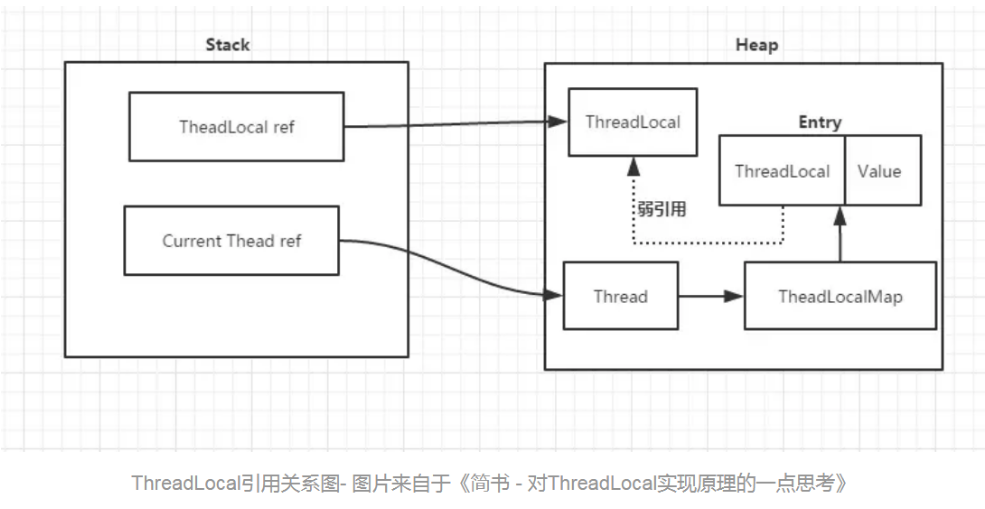

# 问题1：ThreadLocal的理解

问：`ThreadLocal`了解吗？您能给我说说他的主要用途吗？

答：

- 从JAVA官方对`ThreadLocal`类的说明定义（定义在示例代码中）：`ThreadLocal`类用来提供线程内部的局部变量。这种变量在多线程环境下访问（通过`get`和`set`方法访问）时能保证各个线程的变量相对独立于其他线程内的变量。`ThreadLocal`实例通常来说都是`private static`类型的，用于关联线程和线程上下文
- 我们可以得知`ThreadLocal`的作用是：`ThreadLocal`的作用是提供线程内的局部变量，不同的线程之间不会相互干扰，这种变量在线程的生命周期内起作用，减少同一个线程内多个函数或组件之间一些公共变量的传递的复杂度。
- 上述可以概述为：`ThreadLocal`提供线程内部的局部变量，在本线程内随时随地可取，隔离其他线程

**示例代码**：

```java
/**
 * 该类提供了线程局部 (thread-local) 变量。 这些变量不同于它们的普通对应物，
 * 因为访问某个变量（通过其 get 或 set 方法）的每个线程都有自己的局部变量
 * 它独立于变量的初始化副本。ThreadLocal 实例通常是类中的 private static 字段
 * 它们希望将状态与某一个线程（例如，用户 ID 或事务 ID）相关联。
 *
 * 例如，以下类生成对每个线程唯一的局部标识符。
 * 
 * 线程 ID 是在第一次调用 UniqueThreadIdGenerator.getCurrentThreadId() 时分配的，
 * 在后续调用中不会更改。
 * <pre>
 * import java.util.concurrent.atomic.AtomicInteger;
 *
 * public class ThreadId {
 *     // 原子性整数，包含下一个分配的线程Thread ID 
 *     private static final AtomicInteger nextId = new AtomicInteger(0);
 *
 *     // 每一个线程对应的Thread ID
 *     private static final ThreadLocal<Integer> threadId =
 *         new ThreadLocal<Integer>() {
 *             @Override protected Integer initialValue() {
 *                 return nextId.getAndIncrement();
 *         }
 *     };
 *
 *     // 返回当前线程对应的唯一Thread ID, 必要时会进行分配
 *     public static int get() {
 *         return threadId.get();
 *     }
 * }
 * </pre>
 * 每个线程都保持对其线程局部变量副本的隐式引用，只要线程是活动的并且 ThreadLocal 实例是可访问的
 * 在线程消失之后，其线程局部实例的所有副本都会被垃圾回收，（除非存在对这些副本的其他引用）。
 *
 * @author  Josh Bloch and Doug Lea
 * @since   1.2
 */
public class ThreadLocal<T> {
·····
   /**
     * 自定义哈希码（仅在ThreadLocalMaps中有用）
     * 可用于降低hash冲突
     */
    private final int threadLocalHashCode = nextHashCode();

    /**
     * 生成下一个哈希码hashCode. 生成操作是原子性的. 从0开始
     * 
     */
    private static AtomicInteger nextHashCode =
        new AtomicInteger();


    /**
     * 表示了连续分配的两个ThreadLocal实例的threadLocalHashCode值的增量 
     */
    private static final int HASH_INCREMENT = 0x61c88647;


    /**
     * 返回下一个哈希码hashCode
     */
    private static int nextHashCode() {
        return nextHashCode.getAndAdd(HASH_INCREMENT);
    }
·····

}
```

- 其中`nextHashCode()`方法就是一个原子类不停地去加上0x61c88647，这是一个很特别的数，叫斐波那契散列（Fibonacci Hashing），斐波那契又有一个名称叫黄金分割，也就是说将这个数作为哈希值的增量将会使哈希表的分布更为均匀

# 问题2：ThreadLocal基本实现原理

问：`ThreadLocal`实现原理是什么，它是怎么样做到局部变量不同的线程之间不会相互干扰的？

答：

- 通常，如果我不去看源代码的话，我猜`ThreadLocal`是这样子设计的：每个`ThreadLocal`类都创建一个`Map`，然后用线程的ID `threadID`作为`Map`的`key`，要存储的局部变量作为`Map`的`value`，这样就能达到各个线程的值隔离的效果。这是最简单的设计方法，JDK最早期的`ThreadLocal`就是这样设计的。

- 但是，JDK后面优化了设计方案，现时JDK8 `ThreadLocal`的设计是：每个`Thread`维护一个`ThreadLocalMap`(`ThreadLocalMap`是`ThreadLocal`的静态内部类)哈希表，这个哈希表的`key`是`ThreadLocal`实例本身，`value`才是真正要存储的值`Object`。

  ```java
  static class ThreadLocalMap {
  
          /**
           * 此哈希映射中的条目扩展了WeakReference，
           * 使用其主ref字段作为键（始终是ThreadLocal对象）。
           * 请注意null键（即entry.get（） == null）表示不再引用该键，
           * 因此可以从表中删除条目。这些条目在下面的代码中称为“陈旧条目”
           */
          static class Entry extends WeakReference<ThreadLocal<?>> {
              /** 与此ThreadLocal关联的值. */
              Object value;
  
              Entry(ThreadLocal<?> k, Object v) {
                  super(k);
                  value = v;
              }
          }
  ```

  

- 这个设计与我们一开始说的设计刚好相反，这样设计有如下几点优势：

  1） 这样设计之后每个`Map`存储的`Entry`数量就会变小，因为之前的存储数量由`Thread`的数量决定，现在是由`ThreadLocal`的数量决定。

  2） 当`Thread`销毁之后，对应的`ThreadLocalMap`也会随之销毁，能减少内存的使用。



# 问题3：ThreadLocal常用api原理

问：您能说说`ThreadLocal`常用操作的底层实现原理吗？如存储`set(T value)`，获取`get()`，删除`remove()`等操作。

答：

## get()

- 调用`get()`操作获取`ThreadLocal`中对应当前线程存储的值时，进行了如下操作：

  1 ) 获取当前线程`Thread`对象，进而获取此线程对象中维护的`ThreadLocalMap`对象。

  2 ) 判断当前的`ThreadLocalMap`是否存在：

- 如果存在，则以当前的`ThreadLocal` 为 `key`，调用`ThreadLocalMap`中的`getEntry`方法获取对应的存储实体 e。找到对应的存储实体 e，获取存储实体 e 对应的 `value`值，即为我们想要的当前线程对应此`ThreadLocal`的值，返回结果值。

- 如果不存在，则证明此线程没有维护的`ThreadLocalMap`对象，调用`setInitialValue`方法进行初始化。返回`setInitialValue`初始化的值。

- `setInitialValue`方法的操作如下：

  1 ) 调用`initialValue`获取初始化的值。

  2 ) 获取当前线程`Thread`对象，进而获取此线程对象中维护的`ThreadLocalMap`对象。

  3 ) 判断当前的`ThreadLocalMap`是否存在：

- 如果存在，则调用`map.set`设置此实体`entry`。

- 如果不存在，则调用`createMap`进行`ThreadLocalMap`对象的初始化，并将此实体`entry`作为第一个值存放至`ThreadLocalMap`中。

PS：关于`ThreadLocalMap`对应的相关操作，放在下一个问题详细说明。

示例代码：

```java
 /**
     * 返回当前线程对应的ThreadLocal的初始值
     * 此方法的第一次调用发生在，当线程通过{@link #get}方法访问此线程的ThreadLocal值时
     * 除非线程先调用了 {@link #set}方法，在这种情况下，
     * {@code initialValue} 才不会被这个线程调用。
     * 通常情况下，每个线程最多调用一次这个方法，
     * 但也可能再次调用，发生在调用{@link #remove}方法后，
     * 紧接着调用{@link #get}方法。
     *
     * <p>这个方法仅仅简单的返回null {@code null};
     * 如果程序员想ThreadLocal线程局部变量有一个除null以外的初始值，
     * 必须通过子类继承{@code ThreadLocal} 的方式去重写此方法
     * 通常, 可以通过匿名内部类的方式实现
     *
     * @return 当前ThreadLocal的初始值
     */
    protected T initialValue() {
        return null;
    }

    /**
     * 创建一个ThreadLocal
     * @see #withInitial(java.util.function.Supplier)
     */
    public ThreadLocal() {
    }

    /**
     * 返回当前线程中保存ThreadLocal的值
     * 如果当前线程没有此ThreadLocal变量，
     * 则它会通过调用{@link #initialValue} 方法进行初始化值
     *
     * @return 返回当前线程对应此ThreadLocal的值
     */
    public T get() {
        // 获取当前线程对象
        Thread t = Thread.currentThread();
        // 获取此线程对象中维护的ThreadLocalMap对象
        ThreadLocalMap map = getMap(t);
        // 如果此map存在
        if (map != null) {
            // 以当前的ThreadLocal 为 key，调用getEntry获取对应的存储实体e
            ThreadLocalMap.Entry e = map.getEntry(this);
            // 找到对应的存储实体 e 
            if (e != null) {
                @SuppressWarnings("unchecked")
                // 获取存储实体 e 对应的 value值
                // 即为我们想要的当前线程对应此ThreadLocal的值
                T result = (T)e.value;
                return result;
            }
        }
        // 如果map不存在，则证明此线程没有维护的ThreadLocalMap对象
        // 调用setInitialValue进行初始化
        return setInitialValue();
    }

    /**
     * set的变样实现，用于初始化值initialValue，
     * 用于代替防止用户重写set()方法
     *
     * @return the initial value 初始化后的值
     */
    private T setInitialValue() {
        // 调用initialValue获取初始化的值，默认返回null
        T value = initialValue();
        // 获取当前线程对象
        Thread t = Thread.currentThread();
        // 获取此线程对象中维护的ThreadLocalMap对象
        ThreadLocalMap map = getMap(t);
        // 如果此map存在
        if (map != null)
            // 存在则调用map.set设置此实体entry
            map.set(this, value);
        else
            // 1）当前线程Thread 不存在ThreadLocalMap对象
            // 2）则调用createMap进行ThreadLocalMap对象的初始化
            // 3）并将此实体entry作为第一个值存放至ThreadLocalMap中
            createMap(t, value);
        // 返回设置的值value
        return value;
    }

    /**
     * 获取当前线程Thread对应维护的ThreadLocalMap 
     * 
     * @param  t the current thread 当前线程
     * @return the map 对应维护的ThreadLocalMap 
     */
    ThreadLocalMap getMap(Thread t) {
        return t.threadLocals;
    }

```

## set(T value)

- 调用`set(T value)`操作设置ThreadLocal中对应当前线程要存储的值时，进行了如下操作：

  1 ) 获取当前线程`Thread`对象，进而获取此线程对象中维护的`ThreadLocalMap`对象。

  2 ) 判断当前的`ThreadLocalMap`是否存在：

- 如果存在，则调用`map.set`设置此实体`entry`。

- 如果不存在，则调用`createMap`进行`ThreadLocalMap`对象的初始化，并将此实体`entry`作为第一个值存放至`ThreadLocalMap`中。

示例代码：

```java
/**
     * 设置当前线程对应的ThreadLocal的值
     * 大多数子类都不需要重写此方法，
     * 只需要重写 {@link #initialValue}方法代替设置当前线程对应的ThreadLocal的值
     *
     * @param value 将要保存在当前线程对应的ThreadLocal的值
     *  
     */
    public void set(T value) {
        // 获取当前线程对象
        Thread t = Thread.currentThread();
        // 获取此线程对象中维护的ThreadLocalMap对象
        ThreadLocalMap map = getMap(t);
        // 如果此map存在
        if (map != null)
            // 存在则调用map.set设置此实体entry
            map.set(this, value);
        else
            // 1）当前线程Thread 不存在ThreadLocalMap对象
            // 2）则调用createMap进行ThreadLocalMap对象的初始化
            // 3）并将此实体entry作为第一个值存放至ThreadLocalMap中
            createMap(t, value);
    }

    /**
     * 为当前线程Thread 创建对应维护的ThreadLocalMap. 
     *
     * @param t the current thread 当前线程
     * @param firstValue 第一个要存放的ThreadLocal变量值
     */
    void createMap(Thread t, T firstValue) {
        t.threadLocals = new ThreadLocalMap(this, firstValue);
    }
```

## remove()

- 调用`remove()`操作删除ThreadLocal中对应当前线程已存储的值时，进行了如下操作：

  1 ) 获取当前线程`Thread`对象，进而获取此线程对象中维护的`ThreadLocalMap`对象。

  2 ) 判断当前的`ThreadLocalMap`是否存在， 如果存在，则调用`map.remove`，以当前`ThreadLocal`为`key`删除对应的实体`entry`。

- 示例代码：

```java
/**
     * 删除当前线程中保存的ThreadLocal对应的实体entry
     * 如果此ThreadLocal变量在当前线程中调用 {@linkplain #get read}方法
     * 则会通过调用{@link #initialValue}进行再次初始化，
     * 除非此值value是通过当前线程内置调用 {@linkplain #set set}设置的
     * 这可能会导致在当前线程中多次调用{@code initialValue}方法
     *
     * @since 1.5
     */
     public void remove() {
        // 获取当前线程对象中维护的ThreadLocalMap对象
         ThreadLocalMap m = getMap(Thread.currentThread());
        // 如果此map存在
         if (m != null)
            // 存在则调用map.remove
            // 以当前ThreadLocal为key删除对应的实体entry
             m.remove(this);
     }
```

# 问题4：ThreadLocalMap的内部实现

问：对`ThreadLocal`的常用操作实际是对线程`Thread`中的`ThreadLocalMap`进行操作，核心是`ThreadLocalMap`这个哈希表，你能谈谈`ThreadLocalMap`的内部底层实现吗?

## 结构

答：

- `ThreadLocalMap`的底层实现是一个定制的自定义`HashMap`哈希表，核心组成元素有：

  1 ) `Entry[] table;`：底层哈希表 table, 必要时需要进行扩容，底层哈希表 table.length 长度必须是2的n次方。

  2 ) `int size;`：实际存储键值对元素个数 entries

  3 ) `int threshold;`：下一次扩容时的阈值，阈值 threshold = 底层哈希表table的长度 `len * 2 / 3`。当`size >= threshold`时，遍历`table`并删除`key`为`null`的元素，如果删除后`size >= threshold*3/4`时，需要对`table`进行扩容（详情请查看`set(ThreadLocal<?> key, Object value)`方法说明）。

- 其中`Entry[] table;`哈希表存储的核心元素是`Entry`，`Entry`包含：

  1 ) `ThreadLocal<?> k；`：当前存储的`ThreadLocal`实例对象

  2 ) `Object value;`：当前 ThreadLocal 对应储存的值value

- 需要注意的是，此`Entry`继承了弱引用 `WeakReference`，所以在使用`ThreadLocalMap`时，发现`key == null`，则意味着此`key ThreadLocal`不在被引用，需要将其从`ThreadLocalMap`哈希表中移除。(弱引用相关问题解释请查看 问答 5)

示例代码：

```java
/**
     * ThreadLocalMap 是一个定制的自定义 hashMap 哈希表，只适合用于维护
     * 线程对应ThreadLocal的值. 此类的方法没有在ThreadLocal 类外部暴露，
     * 此类是私有的，允许在 Thread 类中以字段的形式声明 ，     
     * 以助于处理存储量大，生命周期长的使用用途，
     * 此类定制的哈希表实体键值对使用弱引用WeakReferences 作为key， 
     * 但是, 一旦引用不在被使用，
     * 只有当哈希表中的空间被耗尽时，对应不再使用的键值对实体才会确保被 移除回收。
     */
    static class ThreadLocalMap {

        /**
         * 实体entries在此hash map中是继承弱引用 WeakReference, 
         * 使用ThreadLocal 作为 key 键.  请注意，当key为null（i.e. entry.get()
         * == null) 意味着此key不再被引用,此时实体entry 会从哈希表中删除。
         */
        static class Entry extends WeakReference<ThreadLocal<?>> {
            /** 当前 ThreadLocal 对应储存的值value. */
            Object value;

            Entry(ThreadLocal<?> k, Object v) {
                super(k);
                value = v;
            }
        }

        /**
         * 初始容量大小 16 -- 必须是2的n次方.
         */
        private static final int INITIAL_CAPACITY = 16;

        /**
         * 底层哈希表 table, 必要时需要进行扩容.
         * 底层哈希表 table.length 长度必须是2的n次方.
         */
        private Entry[] table;

        /**
         * 实际存储键值对元素个数 entries.
         */
        private int size = 0;

        /**
         * 下一次扩容时的阈值
         */
        private int threshold; // 默认为 0

        /**
         * 设置触发扩容时的阈值 threshold
         * 阈值 threshold = 底层哈希表table的长度 len * 2 / 3
         */
        private void setThreshold(int len) {
            threshold = len * 2 / 3;
        }

        /**
         * 获取该位置i对应的下一个位置index
         */
        private static int nextIndex(int i, int len) {
            return ((i + 1 < len) ? i + 1 : 0);
        }

        /**
         * 获取该位置i对应的上一个位置index
         */
        private static int prevIndex(int i, int len) {
            return ((i - 1 >= 0) ? i - 1 : len - 1);
        }

    }
```

## 初始化

- `ThreadLocalMap`的构造方法是延迟加载的，也就是说，只有当线程需要存储对应的`ThreadLocal`的值时，才初始化创建一次（仅初始化一次）。初始化步骤如下：

  1） 初始化底层数组`table`的初始容量为 16。

  2） 获取`ThreadLocal`中的`threadLocalHashCode`，通过`threadLocalHashCode & (INITIAL_CAPACITY - 1)`，即ThreadLocal 的 hash 值 threadLocalHashCode  % 哈希表的长度 length 的方式计算该实体的存储位置。

  3） 存储当前的实体，key 为 : 当前ThreadLocal  value：真正要存储的值

  4）设置当前实际存储元素个数 size 为 1

  5）设置阈值`setThreshold(INITIAL_CAPACITY)`，为初始化容量 16 的 2/3。

示例代码：

```java
 /**
         * 用于创建一个新的hash map包含 (firstKey, firstValue).
         * ThreadLocalMaps 构造方法是延迟加载的,所以我们只会在至少有一个
         * 实体entry存放时，才初始化创建一次（仅初始化一次）。
         */
        ThreadLocalMap(ThreadLocal<?> firstKey, Object firstValue) {
            // 初始化 table 初始容量为 16
            table = new Entry[INITIAL_CAPACITY];
            // 计算当前entry的存储位置
            // 存储位置计算等价于：
            // ThreadLocal 的 hash 值 threadLocalHashCode  % 哈希表的长度 length
            int i = firstKey.threadLocalHashCode & (INITIAL_CAPACITY - 1);
            // 存储当前的实体，key 为 : 当前ThreadLocal  value：真正要存储的值
            table[i] = new Entry(firstKey, firstValue);
            // 设置当前实际存储元素个数 size 为 1
            size = 1;
            // 设置阈值，为初始化容量 16 的 2/3。
            setThreshold(INITIAL_CAPACITY);
        }
```

- `ThreadLocal`的`get()`操作实际是调用`ThreadLocalMap`的`getEntry(ThreadLocal<?> key)`方法,此方法快速适用于获取某一存在`key`的实体 `entry`，否则，应该调用`getEntryAfterMiss(ThreadLocal<?> key, int i, Entry e)`方法获取，这样做是为了最大限制地提高直接命中的性能，该方法进行了如下操作：

  1 ) 计算要获取的`entry`的存储位置，存储位置计算等价于：`ThreadLocal`的 `hash` 值 `threadLocalHashCode`  % 哈希表的长度 `length`。

  2 )  根据计算的存储位置，获取到对应的实体 `Entry`。判断对应实体`Entry`是否存在 并且 `key`是否相等：

- 存在对应实体`Entry`并且对应`key`相等，即同一`ThreadLocal`，返回对应的实体`Entry`。

- 不存在对应实体`Entry` 或者 `key`不相等，则通过调用`getEntryAfterMiss(ThreadLocal<?> key, int i, Entry e)`方法继续查找。

- `getEntryAfterMiss(ThreadLocal<?> key, int i, Entry e)`方法操作如下：

  1 ) 获取底层哈希表数组`table`，循环遍历对应要查找的实体`Entry`所关联的位置。

  2 ) 获取当前遍历的`entry` 的 `key ThreadLocal`，比较`key`是否一致，一致则返回。

  3 ) 如果`key`不一致 并且 `key` 为 `null`，则证明引用已经不存在，这是因为`Entry`继承的是`WeakReference`，这是弱引用带来的坑。调用`expungeStaleEntry(int staleSlot)`方法删除过期的实体`Entry`（此方法不单独解释，请查看示例代码，有详细注释说明）。

  4 ) `key`不一致 ，`key`也不为空，则遍历下一个位置，继续查找。

  5 ) 遍历完毕，仍然找不到则返回`null`。

示例代码：

```java
/**
         * 根据key 获取对应的实体 entry.  此方法快速适用于获取某一存在key的
         * 实体 entry，否则，应该调用getEntryAfterMiss方法获取，这样做是为
         * 了最大限制地提高直接命中的性能
         *
         * @param  key 当前thread local 对象
         * @return the entry 对应key的 实体entry, 如果不存在，则返回null
         */
        private Entry getEntry(ThreadLocal<?> key) {
            // 计算要获取的entry的存储位置
            // 存储位置计算等价于：
            // ThreadLocal 的 hash 值 threadLocalHashCode  % 哈希表
            的长度 length
            int i = key.threadLocalHashCode & (table.length - 1);
            // 获取到对应的实体 Entry 
            Entry e = table[i];
            // 存在对应实体并且对应key相等，即同一ThreadLocal
            if (e != null && e.get() == key)
                // 返回对应的实体Entry 
                return e;
            else
                // 不存在 或 key不一致，则通过调用getEntryAfterMiss继续查找
                return getEntryAfterMiss(key, i, e);
        }

        /**
         * 当根据key找不到对应的实体entry 时，调用此方法。
         * 直接定位到对应的哈希表位置
         *
         * @param  key 当前thread local 对象
         * @param  i 此对象在哈希表 table中的存储位置 index
         * @param  e the entry 实体对象
         * @return the entry 对应key的 实体entry, 如果不存在，则返回null
         */
        private Entry getEntryAfterMiss(ThreadLocal<?> key, int i, Entry e) {
            Entry[] tab = table;
            int len = tab.length;
            // 循环遍历当前位置的所有实体entry
            while (e != null) {
                // 获取当前entry 的 key ThreadLocal
                ThreadLocal<?> k = e.get();
               // 比较key是否一致，一致则返回
                if (k == key)
                    return e;
                // 找到对应的entry ，但其key 为 null，则证明引用已经不存在
                // 这是因为Entry继承的是WeakReference，这是弱引用带来的坑
                if (k == null)
                    // 删除过期(stale)的entry
                    expungeStaleEntry(i);
                else
                    // key不一致 ，key也不为空，则遍历下一个位置，继续查找
                    i = nextIndex(i, len);
                // 获取下一个位置的实体 entry
                e = tab[i];
            }
            // 遍历完毕，找不到则返回null
            return null;
        }


        /**
         * 删除对应位置的过期实体，并删除此位置后对应相关联位置key = null的实体
         *
         * @param staleSlot 已知的key = null 的对应的位置索引
         * @return 对应过期实体位置索引的下一个key = null的位置
         * (所有的对应位置都会被检查)
         */
        private int expungeStaleEntry(int staleSlot) {
            // 获取对应的底层哈希表 table
            Entry[] tab = table;
            // 获取哈希表长度
            int len = tab.length;

            // 擦除这个位置上的脏数据
            tab[staleSlot].value = null;
            tab[staleSlot] = null;
            size--;

            // 直到我们找到 Entry e = null（即循环一圈完毕），才执行rehash操作
            // 就是遍历完该位置的所有关联位置的实体
            Entry e;
            int i;
            // 查找该位置对应所有关联位置的过期实体，进行擦除操作
            for (i = nextIndex(staleSlot, len);
                 (e = tab[i]) != null;
                 i = nextIndex(i, len)) {
                ThreadLocal<?> k = e.get();
                if (k == null) {
                    e.value = null;
                    tab[i] = null;
                    size--;
                } else {
                    int h = k.threadLocalHashCode & (len - 1);
                    //不相等说明table的长度已经改变，删除原位置的值，减小hash冲突，增加getEntry方法的命中率，使该位置留给hash值匹配的entry
                    if (h != i) {
                        tab[i] = null;

                        // 我们必须一直遍历直到最后
                        // 因为还可能存在多个过期的实体
                        while (tab[h] != null)
                            h = nextIndex(h, len);
                        tab[h] = e;
                    }
                }
            }
            return i;
        }

        /**
         * 删除所有过期的实体
         */
        private void expungeStaleEntries() {
            Entry[] tab = table;
            int len = tab.length;
            for (int j = 0; j < len; j++) {
                Entry e = tab[j];
                if (e != null && e.get() == null)
                    expungeStaleEntry(j);
            }
        }
```

​	

- `ThreadLocal`的`set(T value)`操作实际是调用`ThreadLocalMap`的`set(ThreadLocal<?> key, Object value)`方法，该方法进行了如下操作：

  1 ) 获取对应的底层哈希表`table`，计算对应`threalocal`的存储位置。

  2 ) 循环遍历`table`对应该位置的实体，查找对应的`threadLocal`。

  3 ) 获取当前位置的`threadLocal`，如果`key threadLocal`一致，则证明找到对应的`threadLocal`，将新值赋值给找到的当前实体`Entry`的`value`中，结束。

  4 ) 如果当前位置的`key threadLocal`不一致，并且`key threadLocal`为`null`，则调用`replaceStaleEntry(ThreadLocal<?> key, Object value,int staleSlot)`方法（此方法不单独解释，请查看示例代码，有详细注释说明），替换该位置`key == null` 的实体为当前要设置的实体，结束。

  5 ) 如果当前位置的`key threadLocal`不一致，并且`key threadLocal`不为`null`，则创建新的实体，并存放至当前位置 i `tab[i] = new Entry(key, value);`，实际存储键值对元素个数`size + 1`，由于弱引用带来了这个问题，所以要调用`cleanSomeSlots(int i, int n)`方法清除无用数据（此方法不单独解释，请查看示例代码，有详细注释说明），才能判断现在的`size`有没有达到阀值`threshhold`，如果没有要清除的数据，存储元素个数仍然 大于 阈值 则调用`rehash`方法进行扩容（此方法不单独解释，请查看示例代码，有详细注释说明）。

示例代码：

```java
/**
         * 设置对应ThreadLocal的值
         *
         * @param key 当前thread local 对象
         * @param value 要设置的值
         */
        private void set(ThreadLocal<?> key, Object value) {

            // 我们不会像get()方法那样使用快速设置的方式，
            // 因为通常很少使用set()方法去创建新的实体
            // 相对于替换一个已经存在的实体, 在这种情况下,
            // 快速设置方案会经常失败。

            // 获取对应的底层哈希表 table
            Entry[] tab = table;
            // 获取哈希表长度
            int len = tab.length;
            // 计算对应threalocal的存储位置
            int i = key.threadLocalHashCode & (len-1);
            
            // 循环遍历table对应该位置的实体，查找对应的threadLocal
            for (Entry e = tab[i];e != null;e = tab[i = nextIndex(i, len)]) {
                // 获取当前位置的ThreadLocal
                ThreadLocal<?> k = e.get();
                // 如果key threadLocal一致，则证明找到对应的threadLocal
                if (k == key) {
                    // 赋予新值
                    e.value = value;
                    // 结束
                    return;
                }
                // 如果当前位置的key threadLocal为null
                if (k == null) {
                    // 替换该位置key == null 的实体为当前要设置的实体
                    replaceStaleEntry(key, value, i);
                    // 结束
                    return;
                }
            }
            // 当前位置的e==null
            // 创建新的实体，并存放至当前位置i
            tab[i] = new Entry(key, value);
            // 实际存储键值对元素个数 + 1
            int sz = ++size;
            // 由于弱引用带来了这个问题，所以先要清除无用数据，才能判断现在的size有没有达到阀值threshhold
            // 如果没有要清除的数据，存储元素个数仍然 大于 阈值 则扩容
            if (!cleanSomeSlots(i, sz) && sz >= threshold)
                // 扩容
                rehash();
        }

        /**
         * 当执行set操作时，获取对应的key threadLocal，并替换过期的实体
         * 将这个value值存储在对应key threadLocal的实体中，无论是否已经存在体
         * 对应的key threadLocal
         *
         * 有一个副作用, 此方法会删除该位置下和该位置nextIndex对应的所有过期的实体
         *
         * @param  key 当前thread local 对象
         * @param  value 当前thread local 对象对应存储的值
         * @param  staleSlot 第一次找到此过期的实体对应的位置索引index
         *         .
         */
        private void replaceStaleEntry(ThreadLocal<?> key, Object value,
                                       int staleSlot) {
            // 获取对应的底层哈希表 table
            Entry[] tab = table;
            // 获取哈希表长度
            int len = tab.length;
            Entry e;

            // 往前找，找到table中第一个过期的实体的下标
            // 清理整个table是为了避免因为垃圾回收带来的连续增长哈希的危险
            // 也就是说，哈希表没有清理干净，当GC到来的时候，后果很严重

            // 记录要清除的位置的起始首位置
            int slotToExpunge = staleSlot;
            // 从该位置开始，往前遍历查找第一个过期的实体的下标
            for (int i = prevIndex(staleSlot, len);
                 (e = tab[i]) != null;
                 i = prevIndex(i, len))
                if (e.get() == null)
                    slotToExpunge = i;

            // 找到key一致的ThreadLocal或找到一个key为 null的
            for (int i = nextIndex(staleSlot, len);
                 (e = tab[i]) != null;
                 i = nextIndex(i, len)) {
                ThreadLocal<?> k = e.get();

                // 如果我们找到了key，那么我们就需要把它跟新的过期数据交换来保持哈希表的顺序
                // 那么剩下的过期Entry呢，就可以交给expungeStaleEntry方法来擦除掉
                // 将新设置的实体放置在此过期的实体的位置上
                if (k == key) {
                    // 替换，将要设置的值放在此过期的实体中
                    e.value = value;
                    tab[i] = tab[staleSlot];
                    tab[staleSlot] = e;

                    // 如果存在，则开始清除之前过期的实体
                    if (slotToExpunge == staleSlot)
                        slotToExpunge = i;
                    // 在这里开始清除过期数据
                    cleanSomeSlots(expungeStaleEntry(slotToExpunge), len);
                    return;
                }

                // / 如果我们没有在往后查找中找没有找到过期的实体，
                // 那么slotToExpunge就是第一个过期Entry的下标了
                if (k == null && slotToExpunge == staleSlot)
                    slotToExpunge = i;
            }

            // 最后key仍没有找到，则将要设置的新实体放置
            // 在原过期的实体对应的位置上。
            tab[staleSlot].value = null;
            tab[staleSlot] = new Entry(key, value);

            // 如果该位置对应的其他关联位置存在过期实体，则清除
            if (slotToExpunge != staleSlot)
                cleanSomeSlots(expungeStaleEntry(slotToExpunge), len);
        }


        /**
         * 启发式的扫描查找一些过期的实体并清除，
         * 此方法会再添加新实体的时候被调用, 
         * 或者过期的元素被清除时也会被调用.
         * 如果实在没有过期数据，那么这个算法的时间复杂度就是O(log n)
         * 如果有过期数据，那么这个算法的时间复杂度就是O(n)
         * 
         * @param i 一个确定不是过期的实体的位置，从这个位置i开始扫描
         *
         * @param n 扫描控制: 有{@code log2(n)} 单元会被扫描,
         * 除非找到了过期的实体, 在这种情况下
         * 有{@code log2(table.length)-1} 的格外单元会被扫描.
         * 当调用插入时, 这个参数的值是存储实体的个数，
         * 但如果调用 replaceStaleEntry方法, 这个值是哈希表table的长度
         * (注意: 所有的这些都可能或多或少的影响n的权重
         * 但是这个版本简单，快速，而且似乎执行效率还可以）
         *
         * @return true 返回true，如果有任何过期的实体被删除。
         */
        private boolean cleanSomeSlots(int i, int n) {
            boolean removed = false;
            Entry[] tab = table;
            int len = tab.length;
            do {
                i = nextIndex(i, len);
                Entry e = tab[i];
                if (e != null && e.get() == null) {
                    n = len;
                    removed = true;
                    i = expungeStaleEntry(i);
                }
            } while ( (n >>>= 1) != 0);
            return removed;
        }


        /**
         * 哈希表扩容方法
         * 首先扫描整个哈希表table，删除过期的实体
         * 缩小哈希表table大小 或 扩大哈希表table大小，扩大的容量是加倍.
         */
        private void rehash() {
            // 删除所有过期的实体
            expungeStaleEntries();

            // 使用较低的阈值threshold加倍以避免滞后
            // 存储实体个数 大于等于 阈值的3/4则扩容
            if (size >= threshold - threshold / 4)
                resize();
        }

        /**
         * 扩容方法，以2倍的大小进行扩容
         * 扩容的思想跟HashMap很相似，都是把容量扩大两倍
         * 不同之处还是因为WeakReference带来的
         */
        private void resize() {
            // 记录旧的哈希表
            Entry[] oldTab = table;
            // 记录旧的哈希表长度
            int oldLen = oldTab.length;
            // 新的哈希表长度为旧的哈希表长度的2倍
            int newLen = oldLen * 2;
            // 创建新的哈希表
            Entry[] newTab = new Entry[newLen];
            int count = 0;
            // 逐一遍历旧的哈希表table的每个实体，重新分配至新的哈希表中
            for (int j = 0; j < oldLen; ++j) {
                // 获取对应位置的实体
                Entry e = oldTab[j];
                // 如果实体不会null
                if (e != null) {
                    // 获取实体对应的ThreadLocal
                    ThreadLocal<?> k = e.get(); 
                    // 如果该ThreadLocal 为 null
                    if (k == null) {
                        // 则对应的值也要清除
                        // 就算是扩容，也不能忘了为擦除过期数据做准备
                        e.value = null; // Help the GC
                    } else {
                        // 如果不是过期实体，则根据新的长度重新计算存储位置
                        int h = k.threadLocalHashCode & (newLen - 1);
                       // 将该实体存储在对应ThreadLocal的最后一个位置
                        while (newTab[h] != null)
                            h = nextIndex(h, newLen);
                        newTab[h] = e;
                        count++;
                    }
                }
            }
            // 重新分配位置完毕，则重新计算阈值Threshold
            setThreshold(newLen);
            // 记录实际存储元素个数
            size = count;
            // 将新的哈希表赋值至底层table
            table = newTab;
        }
```

# ThreadLocal应用

## 每个线程获取线程隔离的对象

```java
class Student {
    private String name;
    private Integer age;

    private Student() {
    }

    private static ThreadLocal<Student> local = new ThreadLocal();

    /**
     * 利用ThreadLocal使每个线程得到线程共享的Student对象，不需要使用synchronized进行同步，因为每个线程获取的都不同
     * @return  线程关联的Student对象
     */
    public static Student getInstance() {
        Student student = local.get();
        if (student == null) {
            student = new Student();
            local.set(student);
        }
        return student;
    }

    public String getName() {
        return name;
    }

    public void setName(String name) {
        this.name = name;
    }

    public Integer getAge() {
        return age;
    }

    public void setAge(Integer age) {
        this.age = age;
    }
}
```

