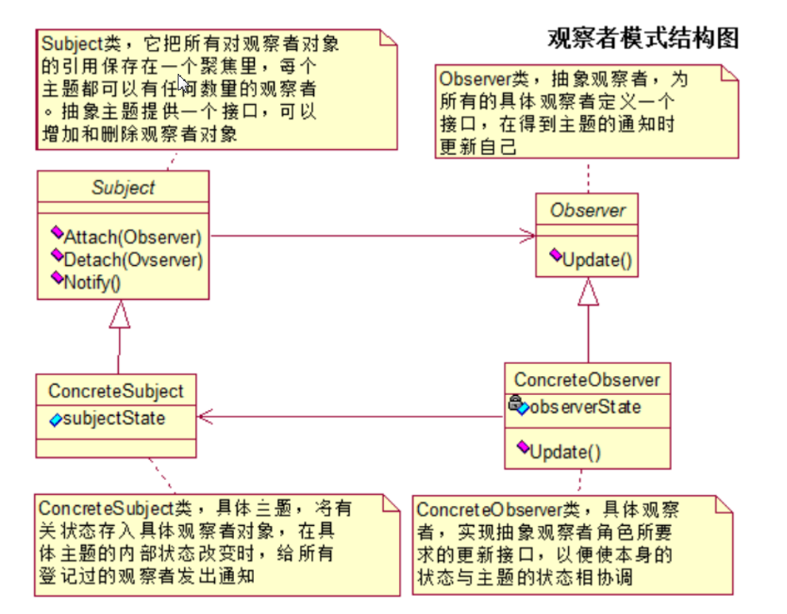

# 什么是观察者模式？

- 在对象之间定义了一对多的依赖，这样一来，当一个对象改变状态，依赖它的对象会收到通知并自动更新
- 通俗的说：其实就是发布订阅模式，发布者发布信息，订阅者获取信息，订阅了就能收到信息，没订阅就收不到信息

# uml类图



# 观察者模式的4个角色

- **抽象被观察者角色**：也就是一个抽象主题，它把所有对观察者对象的引用保存在一个集合中，每个主题都可以有任意数量的观察者。抽象主题提供一个接口，可以增加和删除观察者角色。一般用一个抽象类和接口来实现。
- **抽象观察者角色**：为所有的具体观察者定义一个接口，在得到主题通知时更新自己。
- **具体被观察者角色**：也就是一个具体的主题，在集体主题的内部状态改变时，所有登记过的观察者发出通知。
- **具体观察者角色**：实现抽象观察者角色所需要的更新接口，一边使本身的状态与制图的状态相协调

# 使用举例

- 有一个微信公众号服务，不定时发布一些消息，关注公众号就可以收到推送消息，取消关注就收不到推送消息

# 具体代码实现

1. 定义一个抽象被观察者接口

   ```java
   /**
    * 抽象被观察者接口
    * 声明了添加、删除、通知观察者方法
    */
   public interface Observerable {
       
       void registerObserver(Observer o);
       void removeObserver(Observer o);
       void notifyObserver();
       
   }
   ```

2. 定义一个抽象观察者接口

   ```java
   /***
    * 抽象观察者
    * 定义了一个update()方法，当被观察者调用notifyObservers()方法时，观察者的update()方法会被回调。
    *
    */
   public interface Observer {
       void update(String message);
   }
   ```

3. 定义被观察者，实现了Observerable接口，对Observerable接口的三个方法进行了具体实现，同时有一个List集合，用以保存注册的观察者，等需要通知观察者时，遍历该集合即可

   ```java
   package com.fh.observer;
   
   import java.util.ArrayList;
   import java.util.List;
   
   /**
    * 被观察者，也就是微信公众号服务
    * 实现了Observerable接口，对Observerable接口的三个方法进行了具体实现
    * @author jstao
    *
    */
   public class WechatServer implements Observerable {
       
       //注意到这个List集合的泛型参数为Observer接口，设计原则：面向接口编程而不是面向实现编程
       private List<Observer> list;
       private String message;
       
       public WechatServer() {
           list = new ArrayList<>();
       }
       
       @Override
       public void registerObserver(Observer o) {
           list.add(o);
       }
       
       @Override
       public void removeObserver(Observer o) {
           if(!list.isEmpty())
               list.remove(o);
       }
   
       //遍历
       @Override
       public void notifyObserver() {
           for (Observer oserver : list) {
               oserver.update(message);
           }
       }
       
       public void setInfomation(String s) {
           this.message = s;
           System.out.println("微信服务更新消息： " + s);
           //消息更新，通知所有观察者
           notifyObserver();
       }
   
   }
   ```

4. 定义具体观察者，微信公众号的具体观察者为用户User

   ```java
   package com.fh.observer;
   
   /**
    * 观察者
    * 实现了update方法
    * @author jstao
    *
    */
   public class User implements Observer {
   
       private String name;
       private String message;
       
       public User(String name) {
           this.name = name;
       }
       
       @Override
       public void update(String message) {
           this.message = message;
           read();
       }
       
       public void read() {
           System.out.println(name + " 收到推送消息： " + message);
       }
       
   }
   ```

5. 编写一个测试类

   > 首先注册了三个用户，ZhangSan、LiSi、WangWu。公众号发布了一条消息"PHP是世界上最好用的语言！"，三个用户都收到了消息。
   >
   > 用户ZhangSan看到消息后颇为震惊，果断取消订阅，这时公众号又推送了一条消息，此时用户ZhangSan已经收不到消息，其他用户
   >
   > 还是正常能收到推送消息

   ```java
   package com.fh.observer;
   
   public class Test {
       
       public static void main(String[] args) {
           WechatServer server = new WechatServer();
           
           Observer userZhang = new User("ZhangSan");
           Observer userLi = new User("LiSi");
           Observer userWang = new User("WangWu");
           
           server.registerObserver(userZhang);
           server.registerObserver(userLi);
           server.registerObserver(userWang);
           server.setInfomation("PHP是世界上最好用的语言！");
           
           System.out.println("----------------------------------------------");
           server.removeObserver(userZhang);
           server.setInfomation("JAVA是世界上最好用的语言！");
           
       }
   }
   ```

6. 测试结果

   ```java
   微信服务更新消息： PHP是世界上最好用的语言！
   ZhangSan 收到推送消息： PHP是世界上最好用的语言！
   LiSi 收到推送消息： PHP是世界上最好用的语言！
   WangWu 收到推送消息： PHP是世界上最好用的语言！
   ----------------------------------------------
   微信服务更新消息： JAVA是世界上最好用的语言！
   LiSi 收到推送消息： JAVA是世界上最好用的语言！
   WangWu 收到推送消息： JAVA是世界上最好用的语言！
   ```

# 小结

- 这个模式是松偶合的。改变主题或观察者中的一方，另一方不会受到影像。
- JDK中也有自带的观察者模式。但是被观察者是一个类而不是接口，限制了它的复用能力。
- 在JavaBean和Swing中也可以看到观察者模式的影子。

# JDK的观察者

- jdk提供了Observable类作为被观察者类，开发时可以继承该类
- jdk提供了Observer作为观察者接口