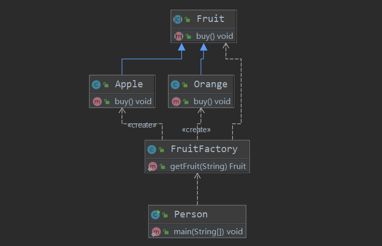
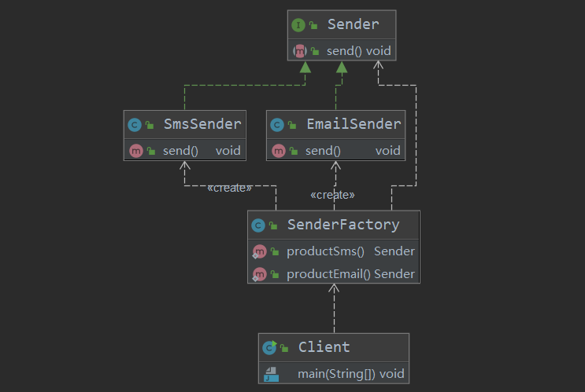
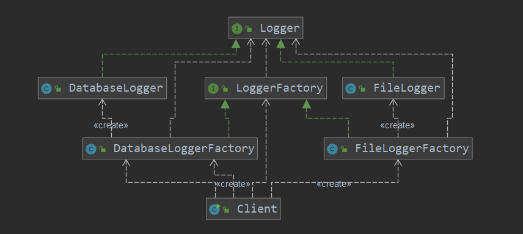
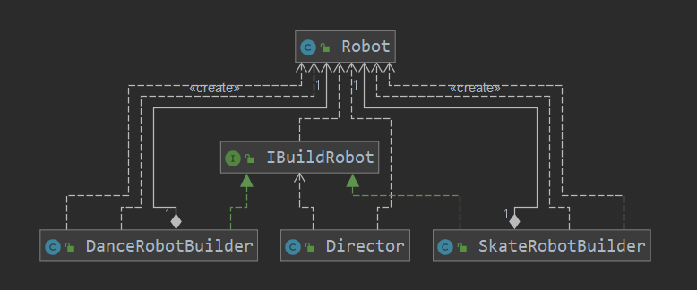

## 说明

## 目录

## 设计模式七大原则

### 设计模式的目的

> 编写软件过程中，程序员面临着来自 耦合性，内聚性以及可维护性，可扩展性，重用性，灵活性 等多方面的挑战，设计模式是为了让程序(软件)，具有更好
>
> 1)      代码重用性 (即：相同功能的代码，不用多次编写)
>
> 2)      可读性 (即：编程规范性,  便于其他程序员的阅读和理解)
>
> 3)      可扩展性 (即：当需要增加新的功能时，非常的方便，称为可维护)
>
> 4)      可靠性 (即：当我们增加新的功能后，对原来的功能没有影响)
>
> 5)      使程序呈现高内聚，低耦合的特性分享金句：
>
> 6)      设计模式包含了面向对象的精髓，“懂了设计模式，你就懂了面向对象分析和设计（OOA/D）的精要”
>
> 7)      Scott Mayers 在其巨著《Effective C++》就曾经说过：C++老手和 C++新手的区别就是前者手背上有很多伤疤

### 设计模式七大原则

> 设计模式原则，其实就是程序员在编程时，应当遵守的原则，也是各种设计模式的基础(即：设计模式为什么这样设计的依据)
>
> 设计模式常用的七大原则有:
>
> 1)      单一职责原则
>
> 2)      接口隔离原则
>
> 3)      依赖倒转(倒置)原则
>
> 4)      里氏替换原则
>
> 5)      开闭原则
>
> 6)      迪米特法则
>
> 7)      合成复用原则

### 单一职责原则

#### 基本介绍

> 对类来说的，即一个类应该只负责一项职责。如类A 负责两个不同职责：职责 1，职责 2。当职责 1 需求变更而改变 A 时，可能造成职责 2 执行错误，所以需要将类 A 的粒度分解为 A1，A2

#### 应用实例

以交通工具案例为例

**方案一**

```java
public class SingleResponsibility1 {
    public static void main(String[] args) {
        Vehicle vehicle = new Vehicle();
        vehicle.run("摩托车");
        vehicle.run("汽车");
        vehicle.run("飞机");
    }


}

// 交通工具类
// 方 式 1
// 1. 在方式 1 的 run 方法中，违反了单一职责原则
// 2. 解决的方案非常的简单，根据交通工具运行方法不同，分解成不同类即可
class Vehicle {
    public void run(String vehicle) {
        System.out.println(vehicle + " 在公路上跑....");
    }
}
```

**方案二**

```java
public class SingleResponsibility1 {
    public static void main(String[] args) {
        RoadVehicle roadVehicle = new RoadVehicle();
        roadVehicle.run("摩托车");
        roadVehicle.run("汽车");

        AirVehicle airVehicle = new AirVehicle();
        airVehicle.run("飞机");
    }

}

//方案 2 的分析
//1. 遵守单一职责原则
//2. 但是这样做的改动很大，即将类分解，同时修改客户端
//3. 改进：直接修改 Vehicle 类，改动的代码会比较少=>方案 3

class RoadVehicle {
    public void run(String vehicle) {
        System.out.println(vehicle + "公路运行");
    }
}

class AirVehicle {
    public void run(String vehicle) {
        System.out.println(vehicle + "天空运行");
    }


}

class WaterVehicle {
    public void run(String vehicle) {
        System.out.println(vehicle + "水中运行");
    }
}
```

**方案三**

```java
public class SingleResponsibility1 {
    public static void main(String[] args) {
        Vehicle2 vehicle2 = new Vehicle2();
        vehicle2.run("汽车");
        vehicle2.runWater("轮船");
        vehicle2.runAir("飞机");

    }

}

//方式 3 的分析
//1. 这种修改方法没有对原来的类做大的修改，只是增加方法
//2. 这里虽然没有在类这个级别上遵守单一职责原则，但是在方法级别上，仍然是遵守单一职责
class Vehicle2 {
    public void run(String vehicle) {
//处理
        System.out.println(vehicle + " 在公路上运行....");


    }

    public void runAir(String vehicle) {
        System.out.println(vehicle + " 在天空上运行....");
    }


    public void runWater(String vehicle) {
        System.out.println(vehicle + " 在水中行....");
    }

//方法 2.
//..
//..

//...
}
```

#### 单一职责原则注意事项和细节

> 1)      降低类的复杂度，一个类只负责一项职责。
>
> 2)      提高类的可读性，可维护性
>
> 3)      降低变更引起的风险
>
> 4)      通常情况下，我们应当遵守单一职责原则，只有逻辑足够简单，才可以在代码级违反单一职责原则；只有类中方法数量足够少，可以在方法级别保持单一职责原则

### 接口隔离原则

> -  客户端不应该依赖它不需要的接口
> - 一个类对另一个类的依赖应该建立在最小的接口上，即依赖的接口的方法没有多余的，全是客户端需要的
> - 当依赖的接口方法不是全部需要时，就需要拆分该接口，通过多实现的方式组合出需要的类
> - **接口隔离原则**和**单一职责原则**非常类似。单一职责原则要求接口的职责是单一的，而接口隔离原则要求接口尽量细化，它们有异曲同工之妙，都是要让我们的接口功能尽量单一，尽量小。但是，单一职责原则的着重点是在“职责”，而接口隔离原则只单纯地要求接口最小化。那么，如果已经满足单一职责原则的接口，在当前的需求下还可以继续细化，那么还需要细化吗？答案是不要再细化了。在实践中，接口设计的粒度越小，系统就越灵活，这是事实。但是灵活的同时也带来了系统的复杂化，导致开发难度增加。所以接口并不是越小越好，必须要有一个度。当单一职责原则和接口隔离原则存在矛盾时，以满足单一职责原则为底线。

### 依赖倒转原则

> - 高层模块不应该依赖低层模块，二者都应该依赖其抽象
> - 抽象不应该依赖细节，细节应该依赖抽象
> - **依赖倒转(倒置)的中心思想是面向接口编程**
> - 依赖倒转原则是基于这样的设计理念：相对于细节的多变性，抽象的东西要稳定的多。以抽象为基础搭建的架构比以细节为基础的架构要稳定的多。在java 中，抽象指的是接口或抽象类，细节就是具体的实现类
> - 使用接口或抽象类的目的是制定好规范，而不涉及任何具体的操作，把展现细节的任务交给他们的实现类去完成

#### 依赖传递的3种方式

> -  接口传递：即方法的参数是一个接口
> - 构造方法传递：将依赖传递为内部的属性
> - setter 方式传递：将依赖传递为内部的属性

#### 依赖倒转原则的注意事项和细节

> - 低层模块尽量都要有抽象类或接口，或者两者都有，程序稳定性更好.
> -  变量的声明类型尽量是抽象类或接口, 这样我们的变量引用和实际对象间，就存在一个缓冲层，利于程序扩展和优化
> - 继承时遵循**里氏替换原则**

### 里式替换原则

#### OOP 中的继承性的思考和说明

> - 继承包含这样一层含义：父类中凡是已经实现好的方法，实际上是在设定规范和契约，虽然它不强制要求所有的子类必须遵循这些契约，但是如果子类对这些已经实现的方法任意修改，就会对整个继承体系造成破坏。
> - 继承在给程序设计带来便利的同时，也带来了弊端。比如使用继承会给程序带来侵入性，程序的可移植性降低， 增加对象间的耦合性，如果一个类被其他的类所继承，则当这个类需要修改时，必须考虑到所有的子类，并且父类修改后，所有涉及到子类的功能都有可能产生故障
> -  问题提出：在编程中，如何正确的使用继承? => 里氏替换原则

#### 基本介绍

> - 里氏替换原则(Liskov Substitution Principle)在 1988 年，由麻省理工学院的以为姓里的女士提出的。
>
> - 如果对每个类型为 T1 的对象 o1，都有类型为 T2 的对象 o2，使得以 T1 定义的所有程序 P 在所有的对象 o1 都代换成 o2 时，程序 P 的行为没有发生变化，那么类型 T2 是类型 T1 的子类型。换句话说，所有引用基类的地方必须能透明地使用其子类的对象。
>
> - 在使用继承时，遵循里氏替换原则，**在子类中尽量不要重写父类的方法**
>
> - 里氏替换原则告诉我们，继承实际上让两个类耦合性增强了，在适当的情况下，可以通过聚合，组合，依赖 来解决问题。.

### 开闭原则

> - 一个软件实体如类，模块和函数应该**对扩展开放(对提供方)，对修改关闭(对使用方)**。**用抽象构建框架，用实现扩展细节。**
>
> - 当软件需要变化时，尽量通过扩展软件实体的行为来实现变化，而不是通过修改已有的代码来实现变化。
>
> - 编程中遵循其它原则，以及使用设计模式的目的就是遵循开闭原则。

### 迪米特原则

> - 一个对象应该对其他对象保持最少的了解
>
> - 类与类关系越密切，耦合度越大
>
> - 迪米特法则(Demeter Principle)又叫**最少知道原则**，即一个类对自己依赖的类知道的越少越好。也就是说，对于被依赖的类不管多么复杂，都尽量将逻辑封装在类的内部。对外除了提供的 public 方法，不对外泄露任何信息
>
> - 迪米特法则还有个更简单的定义：**只与直接的朋友通信**
>
> - 直接的朋友：每个对象都会与其他对象有耦合关系，只要两个对象之间有耦合关系，我们就说这两个对象之间是朋友关系。耦合的方式很多，依赖，关联，组合，聚合等。其中，我们称出现**成员变量，方法参数，方法返回值中的类为直接的朋友**，**而出现在局部变量中的类不是直接的朋友**。也就是说，陌生的类最好不要以局部变量的形式出现在类的内部。

### 合成复用原则

> 原则是尽量使用合成/聚合的方式，而不是使用继承

### 设计原则核心思想

> - 找出应用中可能需要变化之处，把它们独立出来，不要和那些不需要变化的代码混在一起。
>
> -  针对接口编程，而不是针对实现编程。
>
> - 为了交互对象之间的松耦合设计而努力

## 设计模式分类

设计模式分为三种类型，共 **23** 种

> - 创建型模式：单例模式、抽象工厂模式、原型模式、建造者模式、工厂模式。                                         
>
> -  结构型模式：适配器模式、桥接模式、装饰模式、组合模式、外观模式、享元模式、代理模式。
>
> - 行为型模式：模版方法模式、命令模式、访问者模式、迭代器模式、观察者模式、中介者模式、备忘录模式、解释器模式（Interpreter 模式）、状态模式、策略模式、职责链模式(责任链模式)。

## 单例设计模式

### 概述

> - 所谓类的单例设计模式，就是采取一定的方法保证在整个的软件系统中，对某个类只能存在一个对象实例，并且该类只提供一个取得其对象实例的方法(静态方法)。
>
> - 单例设计模式八种方式
>
>   **1)**      饿汉式**(**静态常量**)**
>
>   **2)**      饿汉式（静态代码块）
>
>   **3)**      懒汉式(线程不安全)
>
>   **4)**      懒汉式(线程安全，同步方法)
>
>   **5)**      懒汉式(线程安全，同步代码块)
>
>   **6)**      双重检查
>
>   **7)**      静态内部类
>
>   **8)**      枚举

### 饿汉式(静态常量)

#### 实现方式

> 1)      构造器私有化 (防止 new )
>
> 2)      类的内部创建对象
>
> 3)      向外暴露一个静态的公共方法。getInstance

#### 代码

```java
public class Singleton {

    private static final Singleton INSTANCE = new Singleton();

    private Singleton() {
    }

    public static Singleton getInstance() {
        return INSTANCE;
    }
}
```

#### 优缺点

> 1)      优点：这种写法比较简单，就是在类装载的时候就完成实例化。**避免了线程同步问题**。
>
> 2)      缺点：在类装载的时候就完成实例化，没有达到 Lazy Loading 的效果。如果从始至终从未使用过这个实例，则会造成内存的浪费
>
> 3)      这种方式基于 classLoader 机制避免了多线程的同步问题，不过，instance 在类装载时就实例化，在单例模式中大多数都是调用 getInstance 方法， 但是导致类装载的原因有很多种(如Class.forName)，因此不能确定有其他的方式（或者其他的静态方法）导致类装载，这时候初始化 instance 就没有达到 lazy loading 的效果
>
> **结论**：这种单例模式可用，可能造成内存浪费

### 饿汉式(静态代码块)

#### 代码

```java
public class Singleton2 {
    private static Singleton2 instance;

    static {
        instance = new Singleton2();
    }

    private Singleton2() {
    }

    public static Singleton2 getInstance() {
        return instance;
    }
}
```

#### 优缺点

> 1)  这种方式和上面的方式其实类似，只不过将类实例化的过程放在了静态代码块中，也是在类装载的时候，就执行静态代码块中的代码，初始化类的实例。优缺点和上面是一样的。
>
> 2)  结论：这种单例模式可用，但是可能造成内存浪费

### 懒汉式(线程不安全)

#### 代码

```java
public class Singleton3 {
    private static Singleton3 singleton3;

    private Singleton3() {
    }

    public static Singleton3 getInstance() {
        if (singleton3 == null) {
            singleton3 = new Singleton3();
        }
        return singleton3;
    }
}
```

#### 优缺点

> 1)       起到了 **Lazy Loading** 的效果，但是只能在单线程下使用。
>
> 2)       如果在多线程下，一个线程进入了 if (singleton == null)判断语句块，还未来得及往下执行，另一个线程也通过了这个判断语句，这时便会产生多个实例。所以在多线程环境下不可使用这种方式
>
> 3)       结论：在实际开发中，不要使用这种方式.

### 懒汉式(线程安全，同步方法)

#### 代码

```java
public class Singleton3 {
    private static Singleton3 singleton3;

    private Singleton3() {
    }

    public static synchronized Singleton3 getInstance() {
        if (singleton3 == null) {
            singleton3 = new Singleton3();
        }
        return singleton3;
    }
}
```

#### 优缺点

> 1)      解决了线程安全问题
>
> 2)      效率太低了，每个线程在想获得类的实例时候，执行 getInstance()方法都要进行同步。而其实这个方法只执行一次实例化代码就够了，后面的想获得该类实例，直接 return 就行了。方法进行同步效率太低
>
> 3)      结论：在实际开发中，不推荐使用这种方式

### 懒汉式(线程安全，同步代码块)

#### 代码

```java
public class Singleton3 {
    private static Singleton3 singleton3;

    private Singleton3() {
    }

    public static Singleton3 getInstance() {
        if (singleton3 == null) {
            synchronized (Singleton3.class) {
                singleton3 = new Singleton3();
            }
        }
        return singleton3;
    }
}
```

#### 优缺点

> - 线程不安全
> - 表面上加了synchronized想保证线程安全，但实际上不行，当有多个线程进入if块后，获取到锁还是会创建新的对象
> - 不推荐使用

### 双重检查

#### 代码

```java
public class Singleton3 {
    //保证多线程可见性
    private static volatile Singleton3 singleton3;

    private Singleton3() {
    }

    public static Singleton3 getInstance() {
        if (singleton3 == null) {
            synchronized (Singleton3.class) {
                //再加一个if判断保证最初几个进入if的线程不会创建不同的实例
                if (singleton3 == null) {
                    singleton3 = new Singleton3();
                }
            }
        }
        return singleton3;
    }
}
```

#### 优缺点

> 1)       Double-Check 概念是多线程开发中常使用到的，如代码中所示，我们进行了两次 if (singleton == null)检查，这样就可以保证线程安全了。
>
> 2)       这样，实例化代码只用执行一次，后面再次访问时，判断 if (singleton == null)，直接 return 实例化对象，也避免的反复进行方法同步.
>
> 3)       线程安全；延迟加载；效率较高
>
> 4)       结论：在实际开发中，推荐使用这种单例设计模式

### 静态内部类

#### 代码

```java
public class Singleton {

    private Singleton() {
    }

    private static class SingletonInstance {
        private static final Singleton INSTANCE = new Singleton();
    }

    public static Singleton getInstance() {
        return SingletonInstance.INSTANCE;
    }
}
```

#### 优缺点

> 1)      这种方式采用了类装载的机制来保证初始化实例时只有一个线程。
>
> 2)      静态内部类方式在 Singleton 类被装载时并不会立即实例化，而是在需要实例化时，调用 getInstance 方法，才会装载 SingletonInstance 类，从而完成 Singleton 的实例化。
>
> 3)      类的静态属性只会在第一次加载类的时候初始化，所以在这里，JVM 帮助我们保证了线程的安全性，在类进行初始化时，别的线程是无法进入的。
>
> 4)      优点：避免了线程不安全，利用静态内部类特点实现延迟加载，效率高
>
> 5)      结论：推荐使用.

### 枚举

#### 代码

```java
public enum Singleton {
    INSTANCE;

    public void hello() {
        System.out.println("hello");
    }

}
```

#### 优缺点

> 1)      这借助 JDK1.5 中添加的枚举来实现单例模式。不仅能避免多线程同步问题，而且还能**防止反序列化**重新创建新的对象。
>
> 2)      这种方式是 **Effective Java** 作者 **Josh Bloch**  提倡的方式
>
> 3） 枚举不能懒加载，类加载时就会实例化（包括Class.forName）
>
> 结论：推荐使用

### 单例模式注意事项和细节说明

> 1)      单例模式保证了 系统内存中该类只存在一个对象，节省了系统资源，对于一些需要频繁创建销毁的对象，使用单例模式可以提高系统性能
>
> 2)      当想实例化一个单例类的时候，必须要记住使用相应的获取对象的方法，而不是使用 new
>
> 3)      单例模式使用的场景：需要频繁的进行创建和销毁的对象、创建对象时耗时过多或耗费资源过多(即：重量级对象)，但又经常用到的对象、工具类对象、频繁访问数据库或文件的对象(比如数据源、**session** 工厂等)
>
> 4） **除枚举单例，其它方式都不能防止反序列化问题，这时需要类重写readResolve方法即可解决**

## 工厂模式

### 简单工厂模式

#### 概述

> 简单工厂模式又 叫静态工厂方法模式（Static FactoryMethod Pattern）,是通过专门定义一个类来负责创建其他类的实例，被创建的实例通常都具有共同的父类

#### 举例

> - 客户需要水果，直接通过FruitFactory获取即可，不用关心其它细节,只需要使用水果每次作为参数传递给FruitFactory
>
>   ```java
>   public class FruitFactory {
>       public static Fruit getFruit(String name) {
>           switch (name) {
>               case "apple":
>                   return new Apple();
>               case "orange":
>                   return new Orange();
>               default:
>                   return null;
>           }
>       }
>   }
>   ```
>
> - 当增加新的水果时，首先需要扩展一个新的水果类，然后修改FruitFactory的代码，但是客户端不需要修改，若客户端想要获得新的水果，传新水果的名称就可以了，这样就将变化的逻辑都抽取到了FruitFactory
>
> 

#### 优缺点

**优点**

> 1. 一个调用者想创建一个对象，只要知道其实现类名称就可以了。
>
> 2. 扩展性高，如果想增加一个产品，只要扩展一个接口实现类就可以。
>
> 3. 屏蔽产品的具体实现，调用者只关心产品的接口。

**缺点**

> - 工厂类与具体产品紧耦合，每次要添加/删除/修改 都要需要改工厂类代码

### 工厂方法模式

#### 概述

> - 即创建具体的产品不采用接受客户端传参的方式，而是提供多个工厂方法，每个方法产生具体的产品，客户端想要什么产品，调用对应的工厂方法即可
>
>   
>
> - 

### 抽象工厂模式

#### 概述

> 定义一个用于创建对象的接口，但是让子类来决定到底创建哪一个实例。抽象工厂让一个类的实例化延迟到其子类

#### 举例

> - 以日志系统举例，Logger是日志记录器接口，LoggerFactory是产生具体日志记录器的工厂接口
>
> - 当要扩展是，需要添加一个日志记录器实现Logger，然后添加一个工厂实现LoggerFactory即可
>
>   
>
> - 

#### 优缺点

**优点**

> - 在抽象模式中，不同的工厂来创建客户所需要的产品，同时还向客户端隐藏了哪种具体产品类将被实例化这一细节，用户只需要关心所需要产品对应的工厂，无须关心创建细节，甚至无须知道具体产品类的类名。
> - 基于工厂角色和产品角色的多态性设计是抽象工厂的关键，他能够让工厂模式自主的创建产品对象，而如何创建这个对象的细节完全封装在工厂类。
> - 使用抽象工厂模式最大的优点就是你新加类的时候不用动源代码，只要写新的产品新的工厂来继承对应的类就行了

**缺点**

> - 既是优点又是缺点，你要新加类型的时候，既要创建产品类，又要创建工厂类，增加了一大波类。在一定的程度上增加系统的复杂度。
> - 由于考虑到系统的可扩展性，需要引入抽象层，在客户端代码中均用抽象定义，更加难以理解！

## 原型模式

### 简介

> -  原型模式(Prototype 模式)是指：用原型实例指定创建对象的种类，并且通过拷贝这些原型，创建新的对象
>
> - 原型模式是一种创建型设计模式，允许一个对象再创建另外一个可定制的对象，无需知道如何创建的细节
>
> - 工作原理是:通过将一个原型对象传给那个要发动创建的对象，这个要发动创建的对象通过请求原型对象拷贝它们自己来实施创建，即 对象**.clone**()

### 浅拷贝与深拷贝

#### 浅拷贝

> - 对于数据类型是**基本数据类型**的成员变量，浅拷贝会直接进行值传递，也就是将该属性值复制一份给新的对象。
>
> - 对于数据类型是引用数据类型的成员变量，比如说成员变量是某个数组、某个类的对象等，那么浅拷贝会进行引用传递，也就是只是将该成员变量的引用值（内存地址）复制一份给新的对象。因为实际上两个对象的该成员变量都指向同一个实例。在这种情况下，在一个对象中修改该成员变量会影响到另一个对象的该成员变量值
>
> -  浅拷贝是使用默认的 clone()方法来实现

#### 深拷贝

> - 复制对象的所有基本数据类型的成员变量值
>
> - 为所有引用数据类型的成员变量申请存储空间，并复制每个引用数据类型成员变量所引用的对象，直到该对象可达的所有对象。也就是说，**对象进行深拷贝要对整个对象(包括对象的引用类型)进行拷贝**
>
> - 深拷贝实现方式 1：重写 **clone** 方法来实现深拷贝
>
> -  深拷贝实现方式 2：通过对象序列化实现深拷贝(推荐)

##### 重写 **clone** 方法来实现深拷贝

```java
public class Person implements Cloneable {
    private String name;
    private int age;
    private Person friend;

    public Person(String name, int age, Person friend) {
        this.name = name;
        this.age = age;
        this.friend = friend;
    }

    public String getName() {
        return name;
    }

    public void setName(String name) {
        this.name = name;
    }

    public int getAge() {
        return age;
    }

    public void setAge(int age) {
        this.age = age;
    }

    public Person getFriend() {
        return friend;
    }

    public void setFriend(Person friend) {
        this.friend = friend;
    }

    @Override
    protected Object clone() throws CloneNotSupportedException {
        //先进行浅拷贝
        Person person = (Person) super.clone();
        //拷贝引用属性
        if (friend != null) {
            Person friendCopy = (Person) friend.clone();
            person.setFriend(friendCopy);
        }

        return person;
    }
}
```

##### 通过对象序列化实现深拷贝

```java
public class Person implements Serializable {
    private String name;
    private int age;
    private Person friend;

    public Person(String name, int age, Person friend) {
        this.name = name;
        this.age = age;
        this.friend = friend;
    }

    public String getName() {
        return name;
    }

    public void setName(String name) {
        this.name = name;
    }

    public int getAge() {
        return age;
    }

    public void setAge(int age) {
        this.age = age;
    }

    public Person getFriend() {
        return friend;
    }

    public void setFriend(Person friend) {
        this.friend = friend;
    }

    @Override
    protected Object clone() {
        try (ByteArrayOutputStream bos = new ByteArrayOutputStream();
             ObjectOutputStream oos = new ObjectOutputStream(bos);
        ) {
            //序列化对象
            oos.writeObject(this);

            try (ByteArrayInputStream bis = new ByteArrayInputStream(bos.toByteArray());
                 ObjectInputStream ois = new ObjectInputStream(bis)) {
                //反序列化对象
                return ois.readObject();
            } catch (Exception e) {
                e.printStackTrace();
            }
        } catch (Exception e) {
            e.printStackTrace();
        }

        return null;
    }
}
```

### 原型模式的注意事项和细节

> -  创建新的对象比较复杂时，可以利用原型模式简化对象的创建过程，同时也能够提高效率
>
> - 不用重新初始化对象，而是动态地获得对象运行时的状态
>
> - 如果原始对象发生变化(增加或者减少属性)，其它克隆对象的也会发生相应的变化，无需修改代码
>
> - 在实现深克隆的时候可能需要比较复杂的代码
>
> - 缺点：需要为每一个类配备一个克隆方法，这对全新的类来说不是很难，但对已有的类进行改造时，需要修改其源代码，违背了 ocp 原则

## 建造者模式

### 基本介绍

> - 造者模式（**Builder Pattern**） 又叫生成器模式，是一种对象构建模式。它可以将复杂对象的建造过程抽象出来（抽象类别），使这个抽象过程的不同实现方法可以构造出不同表现（属性）的对象。
>
> - 建造者模式 是一步一步创建一个复杂的对象，它允许用户只通过指定复杂对象的类型和内容就可以构建它们， 用户不需要知道内部的具体构建细节。

### 建造者模式的四个角色

> 1) Product（产品角色）： 一个具体的产品对象。
>
> 2) Builder（抽象建造者）： 创建一个 Product 对象的各个部件指定的 接口**/**抽象类。
>
> 3) ConcreteBuilder（具体建造者）： 实现接口，构建和装配各个部件。
>
> 4)Director（指挥者）： 构建一个使用 Builder 接口的对象。它主要是用于创建一个复杂的对象。它主要有两个作用，一是：隔离了客户与对象的生产过程，二是：负责控制产品对象的生产过程。

### 举例

> 以创造一个机器人为例
>
> 

#### Product

```java
public class Robot {
    private String head;
    private String body;
    private String hand;
    private String foot;
    public String getHead() {
        return head;
    }
    public void setHead(String head) {
        this.head = head;
    }
    public String getBody() {
        return body;
    }
    public void setBody(String body) {
        this.body = body;
    }
    public String getHand() {
        return hand;
    }
    public void setHand(String hand) {
        this.hand = hand;
    }
    public String getFoot() {
        return foot;
    }
    public void setFoot(String foot) {
        this.foot = foot;
    }
}
```

#### Builder

```java
public interface IBuildRobot {
    void buildHead();

    void buildBody();

    void buildHand();

    void buildFoot();

    Robot createRobot();

}
```

#### ConcreteBuilder

```java
public class DanceRobotBuilder implements IBuildRobot {
    private Robot robot;
    public DanceRobotBuilder(){
        robot = new Robot ();
    }
    @Override
    public void buildHead() {
        robot.setHead("写入机械舞程序");       
    }
    @Override
    public void buildBody() {
        robot.setBody("钛合金身体");
    }
    @Override
    public void buildHand() {
        robot.setHand("钛合金手");      
    }
    @Override
    public void buildFoot() {
        robot.setFoot("钛合金脚");
    }
    @Override
    public Robot createRobot () {
        return robot;
    }

}
```

#### Director

```java
public class Director {
    public Robot createRobotByDirecotr(IBuildRobot ibr){
        ibr.buildBody();
        ibr.buildFoot();
        ibr.buildHand();
        ibr.buildHead(); 
        return ibr.createRobot ();
    }
}
```

### 另一种建造者模式实现

> 通过**静态内部类**的方式创建,一般用于构建比较复杂的对象，对象的属性比较多，通过内部构建一个普通的产品对象，通过用户调用不同的方法修改部分构造行为将其构造成需要的对象

```java
public class House {
    //地基
    private String base = "普通地基";
    //钢筋
    private String rebar = "普通钢筋";
    //墙
    private String wall = "普通墙";

    private House() {
    }

    public static HouseBuilder builder() {
        return new HouseBuilder();
    }

    public static class HouseBuilder {

        private House house;

        public HouseBuilder() {
            //创建一个普通房子
            house = new House();
        }

        public HouseBuilder base(String base) {
            house.setBase(base);
            return this;
        }

        public HouseBuilder rebar(String rebar) {
            house.setRebar(rebar);
            return this;
        }

        public HouseBuilder wall(String wall) {
            house.setWall(wall);
            return this;
        }

        public House build() {
            return house;
        }
    }

    public String getBase() {
        return base;
    }

    public void setBase(String base) {
        this.base = base;
    }

    public String getRebar() {
        return rebar;
    }

    public void setRebar(String rebar) {
        this.rebar = rebar;
    }

    public String getWall() {
        return wall;
    }

    public void setWall(String wall) {
        this.wall = wall;
    }

    @Override
    public String toString() {
        return "House{" +
                "base='" + base + '\'' +
                ", rebar='" + rebar + '\'' +
                ", wall='" + wall + '\'' +
                '}';
    }
}
```

适配器模式

