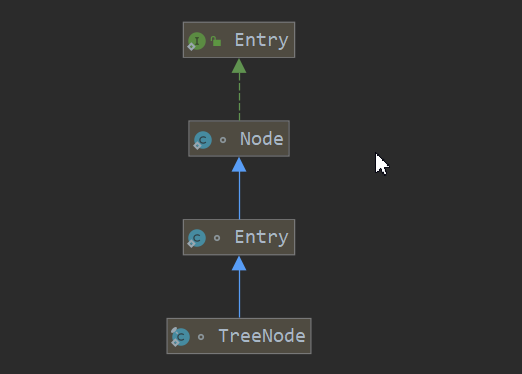
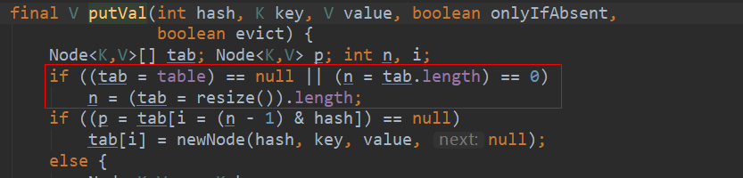
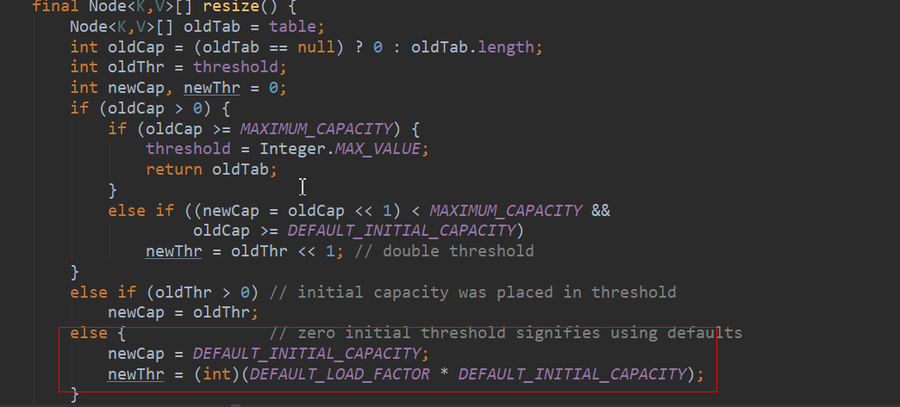

## 说明

## 目录

## HashMap

### HashMap存储结构

> - HashMap用于存储k-v形式的值，因此内部会有一个**Node<K,V>**类来存储数据
>
> - 在jdk1.7时HashMap是使用**数组+链表**的形式存储数据，而1.8则使用了**数组+链表+红黑树**的形式存储数据，因此内部会有一个**TreeNode<K,V>**类存储红黑树的节点
>
> - TreeNode<K,V>实际是Node<K,V>类的一个子类
>
>   
>
> - 既然HashMap使用会数组数组保存数据，则肯定有一个数组的成员变量,
>
>   ```java
>   //transient说明标识该字段序列化时排除
>   transient Node<K,V>[] table;
>   ```
>
> - 而数据是有容量的，默认容量是16，并且每次扩容都需要保证该容量是2的次方,之所以是2的次方，一方面是方便进行位运算（因为在计算机中位运算的效率是最高的），其次是在存储元素的时候计算元素存储在table具体index时只需要依赖key
>
>   ```java
>   static final int DEFAULT_INITIAL_CAPACITY = 1 << 4; // aka 16
>   ```
>
> - 在创建HashMap时是可以指定初始化大小的，虽然可以设置不是2的次方的数，但代码内部会进行转换成大于该数的最小2次幂，在构造方法中会调用tableSizeFor方法进行计算
>
>   ```java
>   //计算出大于等于cap的最小2次幂
>   static final int tableSizeFor(int cap) {
>           int n = cap - 1;
>           n |= n >>> 1;
>           n |= n >>> 2;
>           n |= n >>> 4;
>           n |= n >>> 8;
>           n |= n >>> 16;
>           return (n < 0) ? 1 : (n >= MAXIMUM_CAPACITY) ? MAXIMUM_CAPACITY : n + 1;
>       }
>   ```
>
> - HashMap还有一个比较重要的属性**threshold**，在HashMap第一次初始化的时候，threshold会持有初始化大小，之后threshold会变成size*loadFactor的值，即HashMap扩容的阈值，之所以需要**扩容**，时因为数组的容量有限，在加上链表和红黑树的节点，就会很臃肿，因此需要扩容并把元素**重新散列**，扩容时容量会变成原来的**2倍**
>
> - size属性用于保存HashMap中元素的个数
>
> - **loadFactor**是另一个比较重要的属性，用于计算HashMap扩容时的阈值，默认为0.75，这是jdk官方在性能等多方面权衡下的结果，是一个比较理想的值，一般不需要修改

### HashMap在调用put方法时做了什么

> - 首先，HashMap在调用构造方法的时候其实并没有初始化table,因此它会在第一次put的时候进行初始化
>
>   第一次put的时候，table的值为null，则会走第一个if
>
>   
>
>   进入resize方法，由于table=null,则oldCap和oldThr的值都为0（当使用默认构造的时候），则会走以下逻辑，这个时候就会将阈值设置为size*loadFactor
>
>   > - 当使用new HashMap()创建的时候，只会初始化负载因子为0.75
>   >
>   >   ```java
>   >   public HashMap() {
>   >           this.loadFactor = DEFAULT_LOAD_FACTOR; // all other fields defaulted
>   >       }
>   >   ```
>   >
>   > - 使用HashMap(int initialCapacity)创建时，会初始化负载因子和阈值
>   >
>   >   ```java
>   >   public HashMap(int initialCapacity) {
>   >           this(initialCapacity, DEFAULT_LOAD_FACTOR);
>   >       }
>   >   
>   >   //threshold第一次设置的时候会设置成数组大小
>   >   public HashMap(int initialCapacity, float loadFactor) {
>   >           if (initialCapacity < 0)
>   >               throw new IllegalArgumentException("Illegal initial capacity: " +
>   >                                                  initialCapacity);
>   >           if (initialCapacity > MAXIMUM_CAPACITY)
>   >               initialCapacity = MAXIMUM_CAPACITY;
>   >           if (loadFactor <= 0 || Float.isNaN(loadFactor))
>   >               throw new IllegalArgumentException("Illegal load factor: " +
>   >                                                  loadFactor);
>   >           this.loadFactor = loadFactor;
>   >           this.threshold = tableSizeFor(initialCapacity);
>   >       }
>   >   ```
>   >
>   > - 11
>
>   
>
> - 

### HashMap为什么不是线程安全的

> 当多个线程操作时，若触发扩容，这时其它线程又操作该HashMap执行插入，删除等操作，就会产生无法预料的结果（死循环）

## HashTable

> HashTable是线程安全的HashMap，它在每一个方法上都使用了synchronized进行同步，这样就导致在并发的时候使用效率特别低下，因此被废弃了，不推荐使用

## ConcurrentHashMap

> jdk1.7时ConcurrentHashMap使用锁分段技术实现线程安全，jdk1.8修改为使用cas保证线程安全