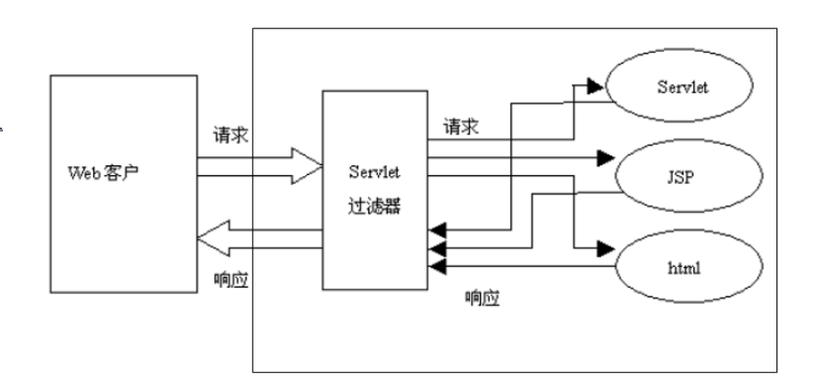

# 1. 为什么会有jsp？

```
答：jsp是为了简化servlet的开发，若直接使用servlet，想要返回一个html页面，就需要使用通过response对象反复输出html页面的字符串，这样使开发更加麻烦，为了从这种方式中脱离出来，出现了jsp，它可以在html页面中写java代码，jsp的本质是一个servlet，是由servlet引擎将jsp转化生成，是HttpServlet的一个子类

说明：由servlet引擎生成的servlet存放于tomcat目录里work目录对应的目录中
```

# 2. 在jsp里为什么可以使用隐含对象？

```
答：jsp本质是一个servlet，整个jsp页面实际是在对应的servlet里面的service方法里输出的，该方法有2个参数，HttpServletRequest和HttpServletResponse，该方法开头还定义了几个对象，pageContext,session,application,config,page,out,(exception，该对象在jsp页面被声明为errorpage时可以使用)共9个内置对象
```

# 3. jsp基本语法

```jsp
1.jsp模板元素：静态的html代码即为jsp模板元素
2.jsp表达式：out.print相当于<=>,在生成的servlet中两种方式相同
3.脚本片段，根据条件输出
	<% int a = 5;
    if (a > 5)  else %>
4.jsp声明：<%!%>,声明的方法会被封装到service之外，不建议使用
5.jsp注释：<%--可以注释掉java代码--%>
```

# 4. 作用域对象的属性相关方法

```
1.getAttribute(String name)  获取属性
2.setAttribute(String name, Object var2)  设置属性
3.removeAttribute(String var1)  移除属性
4.四大作用域对象，作用域范围从小到大：pageContext、request、session、application
	pageContext：仅作用于当前jsp页面
	request:同一个请求
	session：一次会话，浏览器打开到关闭是一次会话，或者会话超时
	application：当前web应用
```

# 5. 请求重定向和转发

## 5.1 请求转发

```java
protected void doGet(HttpServletRequest req, HttpServletResponse resp) throws ServletException, IOException {
        RequestDispatcher dispatcher = req.getRequestDispatcher("/hello2.jsp");
        dispatcher.forward(req,resp);
    }
```

## 5.2 重定向

```java
protected void doGet(HttpServletRequest req, HttpServletResponse resp) throws ServletException, IOException {
        resp.sendRedirect("/hello2.jsp");
    }
```

## 5.3 两者的区别

```
1.转发是一次请求（服务器内部转发另一次），重定向是2次
2.重定向会改变浏览器url地址，转发不会
3.转发是的request和response是同一个
4.转发只能转发到服务器内部资源，重定向可以定向到任何资源，如重定向到百度
5.对于请求的转发，/代表当前web应用的根目录，对于重定向代表的是当前web站点的根目录
	req.getRequestDispatcher("/hello2.jsp")表示的是ip:port/webname/hello2.jsp
	resp.sendRedirect("/hello2.jsp")表示的url是ip:port/hello2.jsp
```

# 6. jsp指令

## 6.1 jsp指令简介

```
主要用于告诉引擎如何处理页面的其它部分，在jsp指令中，属性对大小写敏感，写法如下：
<%@ page contentType="text/html;charset=UTF-8" language="java" %>
```

## 6.2 page指令

```jsp
page指令用于定义jsp页面的各种属性，可以在jsp的任意地方，但建议写在开头
属性：
	extends:用于定义生成的servlet类要继承的类，一般不使用
	
	import：导jsp需要引用的包
		<%@ page import="java.util.Date" %>
		
	session：值为true或false，默认为true,表示当前jsp页面是否可以使用session，比较重要
		<%@ page session="false" %>
		
	errorPage:声明错误页面是哪一个，出错了就内部转发跳转到那个页面，重要
		<%@ page errorPage="/error.jsp" %>，/代表当前web应用的根目录
		
	isErrorPage：声明当前页面是否为错误页面，是错误页面才可以使用exception对象，与errorPage配合使用，重要，一般不建议直接访问该页面，因为若页面中使用了exception对象，直接访问就会报空指针异常，
		<%@ page isErrorPage="true" %>
		
	如何使一个页面不能被直接访问：将页面放在WEB-INF目录下，
		访问方式1：该目录下的资源可以由servlet转发过去，转发时加上/WEB-INF/error.jsp即可
		访问发送2：在web.xml里面配置，如
		<error-page>
            <error-code>500</error-code>
            <location>/WEB-INF/error.jsp</location>
    	</error-page>
    	或
    	<error-page>
            <exception-type>java.lang.ArithmeticException</exception-type>
            <location>/WEB-INF/error.jsp</location>
    	</error-page>
    	这样当出现500错误或算数异常的时候，就会转发跳转到该页面
    	
	contentType：指定当前jsp页面的响应类型和字符编码，实际由		 									response.setContentType("text/html;charset=UTF-8")设置
	<%@ page contentType="text/html;charset=UTF-8" %>
	
	isELIgnored：指定当前页面是否可以使用el表达式，默认为true，通常使用false，不忽略
	<%@ page isELIgnored="true" %> 
	
	
```

```jsp
page指令可以拆分，如
<%@ page contentType="text/html;charset=UTF-8" language="java"  pageEncoding="utf-8" %>
可以拆分成
<%@ page contentType="text/html;charset=UTF-8" language="java" %>
<%@ page pageEncoding="utf-8" %>
```

## 6.3 include指令

include指令用于通知JSP引擎在翻译当前JSP页面时将其他文件中的内容合并进当前JSP页面转换成的Servlet源文件中，这种在源文件级别进行引入的方式称之为静态引入，当前JSP页面与静态引入的页面紧密结合为一个Servlet。（将另一个jsp生成的html完全包含进去，包括doctype头等）

静态包含时在一个页面定义的变量，另一个页面可以使用，只要使用时该变量已经定义

```jsp
<%@ include file="/a.jsp"%>
其中file指定要包含文件的相对路径，/代表当前web应用的根目录，如果不写/，则相对于当前jsp页面
```

**包含的细节：**

```
1.被引入的文件必须遵循JSP语法，其中的内容可以包含静态HTML、JSP脚本元素、JSP指令和JSP行为元素等普通JSP页	面所具有的一切内容。  
2.被引入的文件可以使用任意的扩展名，即使其扩展名是html，JSP引擎也会按照处理jsp页面的方式处理它里面的内	容，为了见明知意，JSP规范建议使用.jspf（JSP fragments）作为静态引入文件的扩展名。 
3.在将JSP文件翻译成Servlet源文件时，JSP引擎将合并被引入的文件与当前JSP页面中的指令元素（设置				pageEncoding属性的page指令除外），所以，除了import和pageEncoding属性之外，page指令的其他属性不	能在这两个页面中有不同的设置值。
4.除了指令元素之外，被引入的文件中的其他元素都被转换成相应的Java源代码，然后插入进当前JSP页面所翻译成的	Servlet源文件中，插入位置与include指令在当前JSP页面中的位置保持一致。  
5.引入文件与被引入文件是在被JSP引擎翻译成Servlet的过程中进行合并，而不是先合并源文件后再对合并的结果进行	翻译（即不是先将两个jsp页面进行合并再翻译）。当前JSP页面的源文件与被引入文件的源文件可以采用不同的字符集	编码，即使在一个页面中使用page指令的pageEncoding或contentType属性指定了其源文件的字符集编码，在另外一	个页面中还需要用page指令的pageEncoding或contentType属性指定其源文件所使用的字符集 。 
6.Tomcat 5.x在访问JSP页面时，可以检测它所引入的其他文件是否发生了修改，如果发生了修改，则重新编译当前JSP	页面
7.file属性的设置值必须使用相对路径，如果以“/”开头，表示相对于当前WEB应用程序的根目录（注意不是站点根目	录），否则，表示相对于当前文件。
```

## 6.4 jsp标签

### **6.4.1 概念**

> 1.JSP还提供了一种称之为Action的元素，在JSP页面中使用Action元素可以完成各种通用的JSP页面功能，也      	可以实现一些处理复杂业务逻辑的专用功能。 
> 2.Action元素采用XML元素的语法格式，即每个Action元素在JSP页面中都以XML标签的形式出现。
> 3.JSP规范中定义了一些标准的Action元素，这些元素的标签名都以jsp作为前缀，并且全部采用小写，例如，	<jsp:include>、<jsp:forward>等等。  

### **6.4.2 jsp:include标签**

> •**<jsp:include**>标签用于把另外一个资源的输出内容插入进当前JSP页面的输出内容之中，这种在JSP页面执行时的引入方式称之为动态引入。
>
> 动态引入不是生成一个servlet源文件，而是2个servlet源文
>
> •**语法：**
>
> <jsp:include page="relativeURL | <%=expression%>" flush="true|false" />
>
> 
>
> page属性用于指定被引入资源的**相对路径**，它也可以通过执行一个表达式来获得。
>
> flush属性指定在插入其他资源的输出内容时，是否先将当前JSP页面的已输出的内容刷新到客户端。  

### 6.4.3 jsp:forward

> 作用：用于在页面中进行转发，同使用requestDispacher转发的效果相同
>
> 语法：<jsp:forward page="relativeURL |<%=expression%>" /> ，page属性用于指定请求转发到的资源的相对路径，它也可以通过执行一个表达式来获得
>
> 2者区别：jsp:forward 可以使用jsp:param传递一些参数，实际代码内部是将参数放在request中，jsp:include也可以传递参数，如

```jsp
    <%--在a.jsp中就可以获取到name的值--%>	
    <jsp:forward page="/a.jsp">
        <jsp:param name="name" value="zhangsan"></jsp:param>
    </jsp:forward>
```

## 6.5 taglib指令

用于引入标签库

# 7. jsp中文乱码问题

> 1.保证jsp页面中charset（响应类型）和pageEncoding（页面类型）都保持一致，且设为utf-8，这样在jsp页面就可以写中文,且响应内容为中文；然后保证浏览器使用同样的编码进行解析，即设置html的meta
>
> tomcat默认对于url的编码采用的是iso-8859-1
>
> 2.post请求获取中文参数乱码：在获取参数前需要进行如下设置

```java
request.setCharacterEncoding("utf-8");
```

> 3.get请求获取中文参数乱码
>
> ​	方式1.将参数进行转码,但对每个参数转码太麻烦，代码如下：

```java
		String val = request.getParameter("name");
        String name = new String(val.getBytes("iso-8859-1"), "utf-8");
```

> ​	方式2.设置tomcat的URIEncoding="utf-8"

```xml
<Connector port="8081" protocol="HTTP/1.1"
               connectionTimeout="20000"
               redirectPort="8443" URIEncoding="utf-8"/>
```

> ​	方式3.设置tomcat的useBodyEncodingForURI="true"，这样request.setCharacterEncoding("utf-8");对	于get请求也会生效

```xml
<Connector port="8081" protocol="HTTP/1.1"
               connectionTimeout="20000"
               redirectPort="8443" useBodyEncodingForURI="true"/>
```

# 8. 会话和会话状态之cookie

> http协议是无状态协议，服务器不能判断哪些请求是同一个浏览器发出的，所以就需要一种机制能够让服务器识别同一个浏览器发出的请求，servlet规范中有两种实现会话跟踪的技术：cookie和session

## 8.1 cookie的特点

> 1.cookie是客户端保存http状态信息的方案，即浏览器来保存
>
> 2.Cookie是在浏览器访问WEB服务器的某个资源时，由WEB服务器在HTTP响应消息头中附带传送给浏览器的一个小文本文件
>
> 3.一旦WEB浏览器保存了某个Cookie，那么它在以后每次访问该WEB服务器时，都会在HTTP请求头中将这个Cookie回传给WEB服务器
>
> 4.底层的实现原理： WEB服务器通过在HTTP响应消息中增加Set-Cookie响应头字段将Cookie信息发送给浏览器，浏览器则通过在HTTP请求消息中增加Cookie请求头字段将Cookie回传给WEB服务器
>
> 5.一个Cookie只能标识一种信息，它至少含有一个标识该信息的名称（NAME）和设置值（VALUE）
>
> 6.一个WEB站点可以给一个WEB浏览器发送多个Cookie，一个WEB浏览器也可以存储多个WEB站点提供的Cookie
>
> 7.浏览器一般只允许存放300个Cookie，每个站点最多存放20个Cookie，每个Cookie的大小限制为4KB

## 8.2 创建cookie示例

```java
protected void doGet(HttpServletRequest request, HttpServletResponse response) {
        Cookie cookie = new Cookie("name", "zhangsan");
        response.addCookie(cookie);
    }
```

## 8.3 获取cookie示例

```java
protected void doGet(HttpServletRequest request, HttpServletResponse response) {
        Cookie[] cookies = request.getCookies();
        for (Cookie cookie : cookies) {
            System.out.println(cookie);
        }
    }
```

## 8.4 cookie的发送

> 1.创建Cookie对象
>
> 2.设置最大时效
>
> ```java
> cookie.setMaxAge(int time)
>     1.若设置为0，表示立即删除
>     2.若设置为负数，表示不存储
>     3.若设置为正数，表示cookie的保留时间，单位为秒
> ```
>
> 3.将Cookie放入到HTTP响应报头
>
> ```
> 1.如果创建了一个cookie，并将它发送到浏览器，默认情况下它是一个会话级别的cookie; 存储在浏览器的内存中，用户退出浏览器之后被删除。若希望浏览器将该cookie存储在磁盘上，则需要使用maxAge，并给出一个以秒为单位的时间。将最大时效设为0则是命令浏览器删除该cookie
> 
> 2.发送cookie需要使用HttpServletResponse的addCookie方法，将cookie插入到一个 Set-Cookie　HTTP响应报头中。由于这个方法并不修改任何之前指定的Set-Cookie报头，而是创建新的报头，因此将这个方法称为是addCookie，而非setCookie
> ```

## 8.5 会话cookie和持久cookie的区别

> 1.如果不设置过期时间，则表示这个cookie生命周期为浏览器会话期间，只要关闭浏览器窗口，cookie就消失了。这种生命期为浏览器会话期的cookie被称为会话cookie。会话cookie一般不保存在硬盘上而是保存在内存里
>
> 2.如果设置了过期时间，浏览器就会把cookie保存到硬盘上，关闭后再次打开浏览器，这些cookie依然有效直到超过设定的过期时间
>
> 3.存储在硬盘上的cookie可以在不同的浏览器进程间共享，比如两个IE窗口。而对于保存在内存的cookie，不同的浏览器有不同的处理方式

## 8.6 使用cookie实现简单自动登录

```java
		String name = request.getParameter("name");
		//用户名不为空即添加cookie
        if (null != name && !name.trim().equals("")) {
            Cookie cookie = new Cookie("name", name);
            response.addCookie(cookie);
        } else { //用户名为空则判断该cookie是否存在
            Cookie[] cookies = request.getCookies();
            for (Cookie cookie : cookies) {
                if ("name".equals(cookie.getName())) {
                    name = cookie.getValue();
                    break;
                }
            }
        }
		//用户名不存在则重定向到登录页面
        if (null != name && !name.trim().equals("")) {
            response.sendRedirect("login.jsp");
        } else {
            out.println("hello:" + name);
        }
```

## 8.7 利用cookie实现最近浏览商品功能

> 需求：只保留最近浏览过的5个商品，且不重复，同样的一个book，删除原来的，将其显示到最后

books.jsp

```jsp
<%@ page contentType="text/html;charset=UTF-8" language="java" %>
<html>
<head>
    <title>书籍列表</title>
</head>
<body>
<a href="book.jsp?book=servlet">servlet</a><br/>
<a href="book.jsp?book=jsp">jsp</a><br/>
<a href="book.jsp?book=spring">spring</a><br/>
<a href="book.jsp?book=mybatis">mybatis</a><br/>
<a href="book.jsp?book=maven">maven</a><br/>
<a href="book.jsp?book=shiro">shiro</a><br/>
<a href="book.jsp?book=hibernate">hibernate</a><br/>
<a href="book.jsp?book=springmvx">springmvx</a><br/>
<br/><br/>
<%
    Cookie[] cookies = request.getCookies();
    if (null != cookies && cookies.length > 0) {
        for (Cookie cookie : cookies) {
            if (cookie.getName().startsWith("book_")) {
                out.println(cookie.getValue());
            }
        }
    }
%>
</body>
</html>
```

book.jsp

```jsp
<%@ page import="java.util.List" %>
<%@ page import="java.util.ArrayList" %>
<%@ page contentType="text/html;charset=UTF-8" language="java" %>
<html>
<head>
    <title>书籍详情</title>
</head>
<body>
<a href="books.jsp">back</a>
<%
    String book = request.getParameter("book");
    out.println("book:" + book);
    //保存名称相同的book
    Cookie tempCookie = null;
    Cookie[] cookies = request.getCookies();
    List<Cookie> cookieList = new ArrayList<>();
    if (null != cookies && cookies.length > 0) {
        for (Cookie cookie : cookies) {
            if (cookie.getName().startsWith("book")) {
                cookieList.add(cookie);
                //找到名称相同的book
                if (cookie.getName().equals(book)) {
                    tempCookie = cookie;
                }
            }
        }
    }
    //没有名称相同的则删除第一个book
    if (cookieList.size() >= 5 && tempCookie == null) {
        tempCookie = cookieList.get(0);
    }

    if (tempCookie != null) {
        tempCookie.setMaxAge(0);
        response.addCookie(tempCookie);
    }

    Cookie cookie = new Cookie("book_" + book, book);
    response.addCookie(cookie);
%>
</body>
</html>
```

## 8.8 cookie的作用范围

> 1.cookie可以作用于当前目录和当前目录的子目录，若在子目录的一个jsp里添加一个cookie，在该文件的上一级目录下的jsp页面是获取不到该cookie的
>
> 2.如何打破该作用域范围？
>
> ```java
> //设置cookie的作用域为当前web应用的根目录下，若设置为/，则代表站点的根目录，不带项目名
> cookie.setPath(request.getContextPath());
> ```

# 9. 会话和会话状态之session

## 9.1 简介

> 1.session，中文经常翻译为会话，其本来的含义是指有始有终的一系列动作/消息，比如打电话是从拿起电话拨号到挂断电话这中间的一系列过程可以称之为一个session
>
> 2.session在Web开发环境下的语义又有了新的扩展，它的含义是指一类用来在客户端与服务器端之间保持状态的解决方案。有时候Session也用来指这种解决方案的存储结构
>
> 3.session机制采用的是在服务器端保持 HTTP 状态信息的方案
>
> 4.服务器使用一种类似于散列表的结构(也可能就是使用散列表)来保存信息
>
> 5.当程序需要为某个客户端的请求创建一个session时，服务器首先检查这个客户端的请求里是否包含了一个session标识(即sessionId),如果已经包含一个sessionId则说明以前已经为此客户创建过session，服务器就按照sessionid把这个session检索出来使用(如果检索不到，可能会新建一个，这种情况可能出现在服务端已经删除了该用户对应的session对象，但用户人为地在请求的URL后面附加上一个JSESSION的参数)。如果客户请求不包含sessionId，则为此客户创建一个session并且生成一个与此session相关联的sessionId，这个sessionid将在本次响应中返回给客户端保存

## 9.2 保存sessionId的几种方式

> 1.使用cookie:保存sessionid的方式可以采用cookie，这样在交互过程中浏览器可以自动的按照规则把这个标识发送给服务器
>
> 2.url重写：由于cookie可以被人为的禁用，必须有其它的机制以便在cookie被禁用时仍然能够把sessionid传递回服务器，经常采用的一种技术叫做URL重写，就是把sessionid附加在URL路径的后面，附加的方式也有两种，一种是作为URL路径的附加信息，另一种是作为查询字符串附加在URL后面。网络在整个交互过程中始终保持状态，就必须在每个客户端可能请求的路径后面都包含这个sessionid

## 9.3 session cookie

> 1.session通过SessionID来区分不同的客户,session是以cookie或URL重写为基础的，默认使用cookie来实现，系统会创造一个名为JSESSIONID的输出cookie，这称之为sessioncookie,以区别persistentcookies(也就是我们通常所说的cookie),sessioncookie是存储于浏览器内存中的，并不是写到硬盘上的，通常看不JSESSIONID，但是当把浏览器的cookie禁止后，web服务器会采用URL重写的方式传递Sessionid，会将JSESSIONID作为url的一个参数进行传递
>
> 2.session cookie针对某一次会话而言，会话结束session cookie也就随着消失了，而persistent cookie只是存在于客户端硬盘上的一段文本
>
> 3.关闭浏览器，只会是浏览器端内存里的session cookie消失，但不会使保存在服务器端的session对象消失，同样也不会使已经保存到硬盘上的持久化cookie消失

## 9.3 session的生命周期

> 1.什么时候创建session？
>
> ```
> 1.是否浏览器访问服务端的任何一个jsp，服务器都会立即创建一个HttpSession对象？
> 答：不一定，若当前jsp是客户端访问当前web应用的第一个资源，且jsp的page指定的session属性为false,则服务器不会创建HttpSession对象；若当前jsp不是客户端访问当前web应用的第一个资源，且其它页面已经成了了一个HttpSession对象，则当前jsp会返回该HttpSession对象，不会创建一个新的
> 2.session=“false“  到底表示什么意思？
> 当前 JSP 页面禁用 session 隐含变量！但可以使用其他的显式的 HttpSession 对象
> 3.对于 Serlvet 而言：若 Serlvet 是客户端访问的第一个 WEB 应用的资源，则只有调用了 request.getSession() 或 request.getSession(true) 才会创建 HttpSession 对象
> ```
>
> 2.request.getSession(true)和request.getSession(false)是什么意思？
>
> ```
> 若为false,如果存在一个会话session，则返回该session，否则返回null
> 若无true，则表示肯定会返回一个session，如果存在一个会话session，则返回该session，否则就创建一个新的返回
> ```
>
> 3.request.getSession()等同于request.getSession(true)
>
> 4.什么时候销毁session对象？
>
> ```
> 1.直接调用session的invalidate()方法
> 2.服务器卸载当前web应用
> 3.超过session的过期时间
> 调用getMaxInactiveInterval()方法可以获取session的过期时间，默认为1800s
> 调用setMaxInactiveInterval(60)设置过期时间，单位为s
> 也可以在web.xml里配置session的过期时间，单位为分钟，在tomcat的配置目录里有一个web.xml文件，里面是一些默认配置，若不进行配置，就会使用该文件中的默认配置，如session的过期的默认时间就是该文件里面设置的
> 	<session-config>
>         <session-timeout>10</session-timeout>
>     </session-config>
> 4.并不是关闭了浏览器就销毁了session
> ```

## 9.4 session的常用方法

```java
session.getId() //获取sessionid
session.getMaxInactiveInterval()  //获取session过期时间
session.getCreationTime()  //获取session创建时间
session.getLastAccessedTime()  //获取session上一次访问时间
session.setAttribute("username",username)  //设置属性
session.getAttribute("username")  //获取属性
session.invalidate();  //设置session立即过期，可用于实现登录的注销功能
session.removeAttribute("username")  //移除属性
```

## 9.5 利用url重写实现session跟踪

> 主要用于在浏览器禁用了cookie情况下跟踪session
>
> 1.Servlet规范中引入了一种补充的会话管理机制，它允许不支持Cookie的浏览器也可以与WEB服务器保持连续的会话。这种补充机制要求在响应消息的实体内容中必须包含下一次请求的超链接，并将会话标识号作为超链接的URL地址的一个特殊参数
>
> 2.将会话标识号以参数形式附加在超链接的URL地址后面的技术称为URL重写。如果在浏览器不支持Cookie或者关闭了Cookie功能的情况下，WEB服务器还要能够与浏览器实现有状态的会话，就必须对所有可能被客户端访问的请求路径（包括超链接、form表单的action属性设置和重定向的URL）进行URL重写
>
> 3.实现url重写的2个方法
>
> response.encodeURL方法，response.encodeRedirectURL方法

```jsp
<a href="<%=response.encodeURL("login.jsp")%>">返回登录页面</a>
```

## 9.6 利用session实现简易购物车

> step-1.jsp 用于显示商品列表，提交信息
>
> ProcessStep1Servlet.java  将书籍信息设置到session中，重定向到step-2.jsp
>
> step-2.jsp 用于填写用户信息
>
> ProcessStep2Servlet.java  将用户信息设置到session中，重定向到confirm.jsp
>
> confirm.jsp

step-1.jsp 用于显示商品列表，提交信息

```jsp
<%@ page contentType="text/html;charset=UTF-8" language="java" %>
<html>
<head>
    <title>商品列表</title>
</head>
<body>
<h1>step-1:选择要购买的书籍</h1>
<form action="<%=request.getContextPath()%>/processStep1" method="post">
    <table>
        <tr>
            <td>书名</td>
            <td>购买</td>
        </tr>
        <tr>
            <td>java</td>
            <td><input type="checkbox" name="book" value="java"></td>
        </tr>
        <tr>
            <td>html</td>
            <td><input type="checkbox" name="book" value="html"></td>
        </tr>
        <tr>
            <td>css</td>
            <td><input type="checkbox" name="book" value="css"></td>
        </tr>
        <tr>
            <td>spring</td>
            <td><input type="checkbox" name="book" value="spring"></td>
        </tr>
        <tr>
            <td>mybatis</td>
            <td><input type="checkbox" name="book" value="mybatis"></td>
        </tr>
        <tr>
            <td colspan="2"><input type="submit" value="提交"></td>
        </tr>
    </table>
</form>
</body>
</html>
```

ProcessStep1Servlet.java

```java
@WebServlet(name = "ProcessStep1Servlet",urlPatterns ={"/processStep1"} )
public class ProcessStep1Servlet extends HttpServlet {
    protected void doPost(HttpServletRequest request, HttpServletResponse response) throws IOException {
        //1.获取所有书籍
        String[] books = request.getParameterValues("book");
        //2.将书籍放入session中
        request.getSession().setAttribute("books", books);
        //3.重定向到step-2页面
        response.sendRedirect(request.getContextPath() + "/shoppingCart/step-2.jsp");
    }
}
```

step-2.jsp 用于填写用户信息

```jsp
<%@ page contentType="text/html;charset=UTF-8" language="java" %>
<html>
<head>
    <title>商品列表</title>
</head>
<body>
<h1>step-2:请输入用户信息</h1>
<form action="<%=request.getContextPath()%>/processStep2" method="post">
    <table>
        <tr>
            <td>姓名</td>
            <td><input type="text" name="name"></td>
        </tr>
        <tr>
            <td>地址</td>
            <td><input type="text" name="addr"></td>
        </tr>
        <tr>
            <td colspan="2"><input type="submit" value="提交"></td>
        </tr>
    </table>
</form>
</body>
</html>
```

ProcessStep2Servlet.java

```java
@WebServlet(name = "ProcessStep2Servlet",urlPatterns ={"/processStep2"} )
public class ProcessStep2Servlet extends HttpServlet {
    protected void doPost(HttpServletRequest request, HttpServletResponse response) throws IOException {
        //1.获取所有用户信息并封装
        request.setCharacterEncoding("utf-8");
        String name = request.getParameter("name");
        String addr = request.getParameter("addr");
        Customer customer = new Customer(name, addr);
        //2.将书籍放入session中
        request.getSession().setAttribute("customer", customer);
        //3.重定向到step-2页面
        response.sendRedirect(request.getContextPath() + "/shoppingCart/confirm.jsp");
    }
}
```

confirm.jsp

```java
<%@ page contentType="text/html;charset=UTF-8" language="java" %>
<html>
<head>
    <title>信息确认页面</title>
</head>
<body>
<%
    Customer customer = (Customer)session.getAttribute("customer");
    String[] books = (String[]) session.getAttribute("books");
%>
    <h1>确认信息</h1>
    <table>
        <tr>
            <td>姓名：</td>
            <td><%=customer.getName()%></td>
        </tr>
        <tr>
            <td>地址：</td>
            <td><%=customer.getAddr()%></td>
        </tr>
        <tr>
            <td >书：</td>
            <td>
                <%
                    for (String book : books) {
                        out.println(book);
                        out.println("<br/>");
                    }
                %>
            </td>
        </tr>
    </table>
</body>
</html>
```

## 9.7 路径问题

> 开发时建议写绝对路径，如form表单里的action,重定向是的路径，因为绝对路径肯定不会有问题，但相对路径可能会产生问题
>
> 如：在由servlet转发到另一个页面是，地址栏显示的是该servelt的路径，而不是转发的页面地址，若这个jsp里使用的相对路径，则可能会产生路径错乱的问题
>
> /a.jsp
>
> ​	-path
>
> ​		/b.jsp
>
> ​		/c.jsp
>
> a.jsp ->/servlet -转发->b.jsp(有一个超链接：和b.jsp同路径下的c.jsp)->c.jsp(找不到)

> 绝对路径：相对于当前web应用的根目录的路径
>
> /的含义：
>
> ```
> 1.有时候代表的是当前web应用的根目录，如：http:127.0.0.1:8081/contextPath
> 	在request转发的时候，web.xml里面配置servlet的时候
> 2.有时候代表的是当前站点的根目录,如：http:127.0.0.1:8081
> 	超链接，表单的action,重定向
> 总结：若/需要由servlet容器来处理，则其代表的就是web应用的根目录；若由浏览器解析，则代表web站点的根目录
> ```
>
> 可以使用request或application的getContextPath获取web应用的根路径，该路径结尾没有/

## 9.8 解决表单重复提交的问题

### 9.8.1 出现重复提交的情况

> 1.调用 RequestDispatcher.forward()方法，浏览器所保留的URL是先前的表单提交的URL，此时点击”刷新”,浏览器将再次提交用户先前输入的数据，引起重复提交
>
> 如果采用 HttpServletResponse.sendRedirct()方法将客户端重定向到成功页面，将不会出现重复一条问题
>
> 2.在响应页面还没有响应时，重复点击提交按钮，也会重复提交
>
> 3.返回表单提交页面，再次点击提交，也会重复提交

## 9.8.2 不是重复提交的情况

> 1.返回表单页面，然后刷新，这个不算重复提交

### 9.8.3 如何避免表单重复提交

> 1.在表单中作一个标记，提交到servlet时，检查标记是否存在且和预定义标记相同，若相同，则受理请求，销毁标记，若不一致或没有标记，则相应提示信息：“重复提交”
>
> ```
> 1.提供一个隐藏域，传递一个参数，行不通：没有方法清除固定的请求参数
> 2.将标记放到request中，行不通：表单页面刷新，原来的request被销毁，会产生一个新的request
> 3.将标记放到session中，配合隐藏域传值，后台对比session中的值和隐藏域的值是否相同，相同则销毁标记，
> ```
>
> ```jsp
> <%
>     long time = new Date().getTime();
>     String value = "" + time;
>     session.setAttribute("token", value);
> 
> %>
> <form action="test" method="post">
>     <input type="text" name="username">
>     <input type="hidden" name="token" value="<%=value%>">
> </form>
> ```
>
> 注意：要保证产生的值足够随机，springmvc和Struts都提供了避免重复提交的组件，其内部能够产生随机值，可调用其方法获取该值

### 9.8.4 利用session实现一次性验证码

> 验证码的作用：防止恶意提交
>
> 原理：和表单重复提交一样
>
> 步骤：
>
> ```
> 1.在原表单页面产生一个随机验证码，产生的同时将其放入session中
> 2.填写验证码提交后，和session中的验证码进行比对，相同则通过，不同则移除session中原始的验证码字符串，重定向到表单提交页面，直到验证码输入正确
> ```
>

# 10. javaBean在jsp里的应用

> 1.jsp:useBean标签
>
> ```jsp
> <jsp:useBean id="tom" class="com.sugar.bean.Student" scope="session">
> 效果：在scope指定的作用域对象中查找tom，找到则直接返回，没找到则通过反射创建一个对象返回
> ```
>
> ```jsp
> <jsp:useBean id="tom" beanName="com.sugar.bean.Student" scope="session" type="java.lang.Object"></jsp:useBean>
> 效果：在scope指定的作用域对象中查找tom，并且转换为type指定的类型，例子中返回的则是Object对象，所有只能调用Object对象的方法
> ```
>
> 2.jsp:setProperty
>
> ```jsp
> <jsp:setProperty name="tom" property="age" value="19"></jsp:setProperty>
> 说明：name的值和usebean里的id值对
> 
> <jsp:setProperty name="tom" property="*"></jsp:setProperty>
> 说明：通过请求参数里面的值设置属性，即get请求后面的参数
> ```
>
> 3.jsp:getProperty
>
> ```jsp
> <jsp:getProperty name="tom" property="age"></jsp:getProperty>
> ```

# 11. EL表达式

> 1.语法
>
> ```
> ${scope.user.name}
> 说明：第一个是EL隐式对象,其中name可以是user的一个属性（必须含有get该属性的方法，且名称遵循javaBean规范），也可以是get方法出去get后第一个字母小写的值，如user有一个getSchool()方法（user可以没有school属性），则可以使用user.school获取该值
> ```
>
> 2.[]和.
>
> ```jsp
> 取值的时候可以使用[]和.，[]用于在属性中含有.或属性是数组的情况下使用，如：
> ${sessionScope.user.name}等同于${sessionScope.user["name"]}
> ```
>
> 3.EL变量
>
> ```
> 取值的时候可以不指定作用域对象，EL会在4个作用域(page,request,session,application)对象中从小到大一次查找，返回第一个找到的值，若没有指定，则返回null
> ```
>
> 4.EL会进行自动类型转换，若请求参数中含有一个如12的数字，EL会将其转换成整形
>
> 5.EL隐含对象
>
> ```
> 1.与作用域相关的隐含对象，pageScope,requestScope,sessionScope,applicationScope
> 从作用域中获取值
> ```
>
> ```
> 2.与请求参数相关的隐含对象：param,paramValues
> 可以从
> ```
>
> ```
> 3.其它隐含对象：
> cookie，header，headerValues
> initParam(获取web.xml里的初始化参数)
> pageContext
> ```

# 12. EL运算符

> 1.算数运算符：+，-，*，/，%
>
> 2.关系运算符：=，>,<等也可以使用eq,gt,lt
>
> 3.empty运算符：作用域一个数组，若该数组不存在或数组为空，则返回true
>
> ```jsp
> ${empty requestScope.students}
> ```

# 13.自定义标签

# 14.JSTL

> JSTL是一个标准的通用标签库，经常使用的是其中的core核心库，要使用它，需要先导入对应的jar包（包括**standard.jar** 和 **jstl.jar**），然后在jsp页面使用如下代码导入使用
>
> ```jsp
> <%@ taglib prefix="c" uri="http://java.sun.com/jsp/jstl/core" %>
> ```

## 14.1常用标签

```
1.表达式操作
<c:out>	用于在JSP中显示数据，就像<%= ... >，会对输出内容进行自动转义，例如：
	request.setAttribute("book","<<java>>");
	使用el表达式输出达不到想要的效果，但<c:out>会将内容转义，即可原样输出
<c:set>	用于保存数据
<c:remove>	用于删除数据
<c:catch>	用来处理产生错误的异常状况，并且将错误信息储存起来（几乎不用）

2.流程控制
<c:if>	与我们在一般程序中用的if一样
<c:choose>	本身只当做<c:when>和<c:otherwise>的父标签
<c:when>	<c:choose>的子标签，用来判断条件是否成立
<c:otherwise>	<c:choose>的子标签，接在<c:when>标签后，当<c:when>标签判断为false时被执行

3.迭代操作
<c:forEach>	基础迭代标签，接受多种集合类型
<c:forTokens>	根据指定的分隔符来分隔内容并迭代输出

4.url操作
<c:import>	检索一个绝对或相对 URL，然后将其内容暴露给页面
<c:param>	用来给包含或重定向的页面传递参数
<c:redirect>	重定向至一个新的URL.
<c:url>	使用可选的查询参数来创造一个URL
```

## 14.2标签详细说明

### 1.c:out

> <c:out>标签用来显示一个表达式的结果，与<%= %>作用相似，它们的区别就是<c:out>标签可以直接通过"."操作符来访问属性。举例来说，如果想要访问customer.address.street，只需要这样写：<c:out value="customer.address.street">。c:out标签会自动忽略XML标记字符（即转义），所以它们不会被当做标签来处理。
>
> 语法
>
> ```jsp
> <c:out value="<string>" default="<string>" escapeXml="<true|false>"/>
> ```
>
> 属性
>
> ```
> 属性	描述	是否必要	默认值
> value	要输出的内容	是	无
> default	输出的默认值	否	主体中的内容
> escapeXml	是否忽略XML特殊字符	否	true
> ```
>


### 2.c:set

> <c:set>标签用于在指定的作用域范围内设置变量值和对象属性。
>
> <c:set>标签就是<jsp:setProperty>行为标签的孪生兄弟。
>
> 这个标签之所以很有用呢，是因为它会计算表达式的值，然后使用计算结果来设置 JavaBean 对象或 java.util.Map 对象的值
>
> 语法：
>
> ```jsp
> <c:set
>    var="<string>"
>    value="<string>"
>    target="<string>"
>    property="<string>"
>    scope="<string>"/>
> 
> 1.在作用域里设值
> <c:set var="name" value="sugar" scope="page"/>
> 2.使用EL表达式
> <c:set var="name" value="${param.name}" scope="session"/>
> 3.设值对象属性的值，target和value支持EL表达式
> <s:set target="${requestScope.stu} property="name" value="${param.name}"/>
> ```
>
> 属性
>
> ```
> 属性	描述	是否必要	默认值
> value	要存储的值	否	主体的内容
> target	要修改的属性所属的对象	否	无
> property	要修改的属性	否	无
> var	存储信息的变量	否	无
> scope	var属性的作用域	否	Page
> ```
>
> 如果指定了target属性，那么property属性也需要被指定。

### 3.c:remove

> <c:remove>标签用于移除一个变量，可以指定这个变量的作用域，若未指定，则默认为变量第一次出现的作用域。这个标签不是特别有用，不过可以用来确保JSP完成清理工作
>
> 语法
>
> ```jsp
> <c:remove var="<string>" scope="<string>"/>
> 
> <c:remove var="name" scope="session"/>
> ```
>
> 属性
>
> ```
> 属性	描述	是否必要	默认值
> var	要移除的变量名称	是	无
> scope	变量所属的作用域	否	所有作用域
> ```
>

### 4.c:if

> 1.没有else，但是可以把判断的结果保存起来，通过var属性
>
> 2.<c:if>标签判断表达式的值，如果表达式的值为 true 则执行其主体内容
>
> 语法
>
> ```jsp
> <c:if test="<boolean>" var="<string>" scope="<string>">
>    ...
> </c:if>
> 
> <c:if test="${requestScope.age>18}">成年</c:if>
> //将判断的结果保存到request的isAdult变量中
> <c:if test="${requestScope.age>18}" var="isAdult" scope="request">成年</c:if>
> ```
>
> 属性
>
> ```
> 属性	描述	是否必要	默认值
> test	条件	是	无
> var	用于存储条件结果的变量	否	无
> scope	var属性的作用域	否	page
> ```

### 5.c:choose，c:when，c:otherwise

> 1.<c:choose>标签与Java switch语句的功能一样，用于在众多选项中做出选择，只能作为c:when，c:otherwise的父标签，switch语句中有case，而<c:choose>标签中对应有<c:when>，switch语句中有default，而<c:choose>标签中有<c:otherwise>，c:otherwise必须在c:when之后使用
>
> 语法
>
> ```jsp
> <c:choose>
>     <c:when test="<boolean>">
>         ...
>     </c:when>
>     <c:when test="<boolean>">
>         ...
>     </c:when>
>     ...
>     ...
>     <c:otherwise>
>         ...
>     </c:otherwise>
> </c:choose>
> ```
>
> 属性
>
> ```
> <c:choose>标签没有属性。
> <c:when>标签只有一个属性，在下表中有给出。
> <c:otherwise>标签没有属性
> 
> <c:when>标签的属性如下：
> 属性	描述	是否必要	默认值
> test	条件	是	无
> ```

### 6.c:forEach，c:forTokens

> 这些标签封装了Java中的for，while，do-while循环。
>
> 相比而言，<c:forEach>标签是更加通用的标签，因为它迭代一个集合中的对象。
>
> <c:forTokens>标签通过指定分隔符将字符串分隔为一个数组然后迭代它们
>
> 1.c:forEach语法
>
> ```jsp
> <c:forEach
>     items="<object>"
>     begin="<int>"
>     end="<int>"
>     step="<int>"
>     var="<string>"
>     varStatus="<string>">
>     
> <c:forEach begin="1" end="10" step="3" var="i">${i},</c:forEach>
> 会输出1,4,7,10,
>     
> 遍历集合
>     <c:forEach items="${requestScope.stus}" var="stu">
>     ${stu.name}
>     </c:forEach>
>     
> 遍历集合时使用begin,begin也是从0开始的，begin="1"表示第二个元素
>     <c:forEach items="${requestScope.stus}" var="stu" begin="1" end="5" step="2">
>     ${stu.name}
>     </c:forEach>
>     
> 遍历map
>      <c:forEach items="${requestScope.map}" var="entry">
>     ${entry.key},${entry.value}
>     </c:forEach>
>     
> 遍历枚举类型
>      <c:forEach items="${pageContext.session.attributeNames}" var="name">
>     ${name}
>     </c:forEach>
> ```
>
> 属性
>
> ```
> 属性	描述	是否必要	默认值
> items	要被循环的信息	否	无
> begin	开始的元素（0=第一个元素，1=第二个元素）	否	0
> end	最后一个元素（0=第一个元素，1=第二个元素）	否	Last element
> step	每一次迭代的步长	否	1
> var	代表当前条目的变量名称	否	无
> varStatus	代表循环状态的变量名称	否	无
> ```
>
> varStatus返回的是一个LoopTagSupport的一个内部类
>
> varStatus属性
>
> | 属性  | 类型    | 意义                                         |
> | ----- | ------- | -------------------------------------------- |
> | index | number  | 当前这次迭代从 0 开始的迭代索引              |
> | count | number  | 当前这次迭代从 1 开始的迭代计数              |
> | first | boolean | 用来表明当前这轮迭代是否为第一次迭代的标志   |
> | last  | boolean | 用来表明当前这轮迭代是否为最后一次迭代的标志 |
>
> 2.c:forTokens语法
>
> ```jsp
> <c:forTokens
>     items="<string>"
>     delims="<string>"
>     begin="<int>"
>     end="<int>"
>     step="<int>"
>     var="<string>"
>     varStatus="<string>">
> ```
>
> 属性
>
> ```
> 属性	描述	是否必要	默认值
> delims	分隔符	是	无
> ```

### 7.c:import

> <c:import>标签提供了所有<jsp:include>行为标签所具有的功能，同时也允许包含绝对URL。
>
> 举例来说，使用<c:import>标签可以包含一个FTP服务器中不同的网页内容
>
> 语法
>
> ```jsp
> <c:import
>    url="<string>"
>    var="<string>"
>    scope="<string>"
>    varReader="<string>"
>    context="<string>"
>    charEncoding="<string>"/>
> ```
>
> 属性
>
> ```
> 属性	描述	是否必要	默认值
> url	待导入资源的URL，可以是相对路径和绝对路径，并且可以导入其他主机资源	是	无
> 
> context	当使用相对路径访问外部context资源时，context指定了这个资源的名字。	否	当前应用程序
> charEncoding	所引入的数据的字符编码集	否	ISO-8859-1
> var	用于存储所引入的文本的变量	否	无
> scope	var属性的作用域	否	page
> varReader	可选的用于提供java.io.Reader对象的变量	否	无
> ```

### 8.c:redirect

> <c:redirect>标签通过自动重写URL来将浏览器重定向至一个新的URL，它提供内容相关的URL，并且支持c:param标签
>
> 语法
>
> ```jsp
> <c:redirect url="<string>" context="<string>"/>
> ```
>
> 属性
>
> ```
> 属性	描述	是否必要	默认值
> url	目标URL	是	无
> context	紧接着一个本地网络应用程序的名称	否	当前应用程序
> ```

### 9.c:url

> <c:url>标签将URL格式化为一个字符串，然后存储在一个变量中。
>
> 这个标签在需要的时候会自动重写URL。
>
> var属性用于存储格式化后的URL。
>
> <c:url>标签只是用于调用response.encodeURL()方法的一种可选的方法。它真正的优势在于提供了合适的URL编码，包括<c:param>中指定的参数。
>
> 语法
>
> ```jsp
> <c:url
>   var="<string>"
>   scope="<string>"
>   value="<string>"
>   context="<string>"/>
> 
> 将生成的url存储到var中，然后添加到scope指定的域对象中，还可以使用c:param为url指定参数，它会对参数进行自动转码（如中文）
> <c:url value="www.baidu.com" var="baidu" scope="page">
> <c:param name="name" value="zhangsan"></c:param>
> </c:url>
> ```
>
> 属性
>
> ```
> 属性	描述	是否必要	默认值
> value	基础URL	是	无
> context	本地网络应用程序的名称	否	当前应用程序
> var	代表URL的变量名	否	Print to page
> scope	var属性的作用域	否	Page
> ```

# 15.filter(过滤器)

## 15.1过滤器简介

> 过滤器可以动态地拦截请求和响应，以变换或使用包含在请求或响应中的信息
>
> 1.Filter 的基本功能是**对** **Servlet** **容器调用** **Servlet** **的过程进行拦截**，**从而在** **Servlet** **进行响应处理的前后实现一些特殊的功能**。
>
> 2.在 Servlet API 中定义了三个接口类来开供开发人员编写 Filter 程序：Filter, FilterChain, FilterConfig
>
> 3.**Filter** **程序是一个实现了** **Filter** **接口的** **Java** **类**，与 Servlet 程序相似，**它由** **Servlet** **容器进行调用和执行**
>
> 4.**Filter** **程序需要在** **web.xml** **文件中进行注册和设置它所能拦截的资源**：Filter 程序可以拦截 Jsp, Servlet, 静态图片文件和静态 html 文件

## 15.2Filter 的过滤过程



## 15.3filter的demo

> 1.编写一个filter
>
> ```
> 需要实现Filter接口，该接口有3个方法，init,doFilter,destroy
> ```
>
> 2.配置filter
>
> ```
> 配置方式根配置servlet几乎相同，其中url-pattern指定该Filter拦截的资源
> ```

## 15.4Filter相关的API

> 1.Filter接口的方法
>
> ```java
> public class Myfilter implements Filter {
>     /**
>      * 类似于servlet的init方法，在创建filter对象后立即被调用，且只调用一次，filter实例是单例的
>      * 可以在web.xml中配置filter的初始化参数
>      * @param filterConfig  类似于ServletConfig
>      * @throws ServletException
>      */
>     @Override
>     public void init(FilterConfig filterConfig) throws ServletException {
> 
>     }
> 
>     /**
>      * 执行拦截的方法
>      * @param servletRequest
>      * @param servletResponse
>      * @param filterChain  多个filter可以构成一个filter链，多个filter拦截的顺序根filter-mapping配置的顺序有关，配置在前面的先拦截
>      * @throws IOException
>      * @throws ServletException
>      */
>     @Override
>     public void doFilter(ServletRequest servletRequest, ServletResponse servletResponse, FilterChain filterChain) throws IOException, ServletException {
>         //将请求传给filter链的下一个filter，若当前filter是filter链的最后一个filter，则将请求传给目标servlet或jsp
>         filterChain.doFilter(servletRequest,servletResponse);
>     }
> 
>     @Override
>     public void destroy() {
> 
>     }
> ```

## 15.5自己实现Filter接口简化Filter开发

```java
public abstract class HttpFilter implements Filter {
    private FilterConfig filterConfig;
    @Override
    public void init(FilterConfig filterConfig) throws ServletException {
        this.filterConfig = filterConfig;
        init();
    }

    /**
     * 若想要进行一些初始化操作，可以重写这个方法
     */
    protected void init() {

    }

    public FilterConfig getFilterConfig() {
        return filterConfig;
    }

    @Override
    public void doFilter(ServletRequest servletRequest, ServletResponse servletResponse, FilterChain filterChain) throws IOException, ServletException {
        HttpServletRequest request = (HttpServletRequest) servletRequest;
        HttpServletResponse response = (HttpServletResponse) servletResponse;

        doFilter(request,response,filterChain);
    }

    protected abstract void doFilter(HttpServletRequest request,HttpServletResponse response,FilterChain filterChain);

    @Override
    public void destroy() {

    }
}
```

## 15.6多个filter代码的执行顺序

> 顺序如下,与栈类似，先进后出：
>
> ```java
> @Override
>     public void doFilter(ServletRequest servletRequest, ServletResponse servletResponse, FilterChain filterChain) throws IOException, ServletException {
> 
>         System.out.println("before filter1");
>         filterChain.doFilter(servletRequest,servletResponse);
>         System.out.println("after filter1");
>     }
> ```
>
> 输出：
>
> ```
> before filter1
> before filter2
> jsp
> after filter2
> after filter1
> ```

15.7映射filter

> 1.<filter-mapping>元素用于设置一个Filter 所负责拦截的资源。一个Filter拦截的资源可通过两种方式来指定：Servlet名称和资源访问的请求路径( url样式)
> –<filter-name>子元素用于设置filter的注册名称。该值必须是在<filter>元素中声明过的过滤器的名字
> –<url-pattern>设置filter 所拦截的请求路径(过滤器关联的URL样式)
> –<servlet-name>指定过滤器所拦截的Servlet名称。
> –<dispatcher>指定过滤器所拦截的资源被Servlet容器调用的方式，可以是REQUEST,INCLUDE,FORWARD和ERROR之一，默认REQUEST. 可以设置多个<dispatcher> 子元素用来指定Filter 对资源的多种调用方式进行拦截
>
> 2.<dispatcher> 子元素可以设置的值及其意义：
> –REQUEST：当用户直接访问页面时（通过get或者post方式），Web容器将会调用过滤器。如果目标资源是通过RequestDispatcher的include()或forward()方法访问时，那么该过滤器就不会被调用。
> –INCLUDE：如果目标资源是通过RequestDispatcher的include()方法访问时，那么该过滤器将被调用。除此之外，该过滤器不会被调用。
> –FORWARD：如果目标资源是通过RequestDispatcher的forward()方法访问时，那么该过滤器将被调用，除此之外，该过滤器不会被调用。
> –ERROR：如果目标资源是通过声明式异常处理机制调用时，那么该过滤器将被调用。除此之外，过滤器不会被调用
>
> 3.一个filter可以写多个dispatcher,不写的时候默认为REQUEST
>
> ```xml
> <filter-mapping>
>     <filter-name>testFilter</filter-name>
>     <url-pattern>/index.jsp</url-pattern>
>     <dispatcher>REQUEST</dispatcher>
>     <dispatcher>FORWARD</dispatcher>
> </filter-mapping>
> ```
>
> 4.dispatcher配置为ERROR时，只有使用在web.xml里配置错误页面（使用error-page标签）的方式才会触发，另一种使用page标签声明的错误页面使用的是转发

## 15.7filter的典型应用

### 15.7.1使浏览器不缓存页面

> 使浏览器不缓存页面的过滤器：
> –有3 个HTTP 响应头字段都可以禁止浏览器缓存当前页面，它们在Servlet中的示例代码如下：
> •response.setDateHeader("Expires",-1);
> •response.setHeader("Cache-Control","no-cache");
> •response.setHeader("Pragma","no-cache");
> –并不是所有的浏览器都能完全支持上面的三个响应头，因此最好是同时使用上面的三个响应头

### 15.7.2字符编码过滤器

> 通过配置参数encoding指明使用何种字符编码,以处理Html Form请求参数的中文问题
>
> 即使用过滤器拦截所有请求
>
> ```java
> request.setCharacterEncoding("utf-8");
> ```
>
> 字符编码可以在web.xml指定，方便修改，像spring框架就提供了类似地字符编码过滤器

### 15.7.3检测用户是否登录

> 1.使用filter完成一个简单的权限模型
>
> ```
> 需求：
> 	1.权限管理（查看权限、修改权限）
> 	2.对访问进行权限控制：有权限则可以访问，否则提示没有权限
> 实现：
> 	1.管理权限
>      封装权限信息：Authority
>      Authority{
>      	//权限显示的页面的名字
>          private String displayName;
>          //权限对应的
>          private String url;
>      }
>      封装用户信息:User
>      User{
>          private String name;
>          private List<Authority> authorities;
>      }
>      创建一个UserDao
>      User get(String name) //获取用户的信息
>      void update(String name,List<Authority> authorities)  //修改用户权限
> ```
>
> 2.检测用户是否登录
>
> ```
> 查看session中是否有该用户信息
> ```

### 15.7.4HttpServletRequestWrapper（装饰器模式）

对论坛不雅词汇进行过滤

> 1.HttpServletRequest和ServletRequest都没有提供诸如setRequestParameter的方法无法修改请求参数
>
> 2.解决办法：改变HttpServletRequest的getRequestParameter(String)方法的行为
>
> ```
> 1.使用装饰设计模式，创建一个类，该类实现HttpServletRequest接口，并且把当前request对象作为其成员变量
> 2.对于不关心的方法，调用成员变量request的方法即可，只需要改写getRequestParameter(String)方法
> ```
>
> 3.servletApi提供了HttpServletRequestWrapper简化开发，开发时继承该类即可，重写需要重写的方法
>
> ```
> HttpServletRequestWrapper默认调用的都是tomcat创建的request的方法
> ```

# 16.监听器

## 16.1简介

> 1.监听器：专门用于对其他对象身上发生**的事件或状态改变**进行监听和相应处理的对象，当被监视的对象发生情况时，立即采取相应的行动
>
> 2.Servlet 监听器：Servlet 规范中定义的一种特殊类，它用于监听web应用程序ServletContext,HttpSession和ServletRequest等域对象的创建与销毁事件，以及监听这些域对象中的属性发生修改的事件

## 16.2Servlet 监听器的分类

> 1.按监听的事件类型分类
>
> ```
> 1.监听域对象自身的创建和销毁的事件监听器
> 2.监听域对象中的属性的增加和删除的事件监听器
> 3.监听绑定到 HttpSession 域中的某个对象的状态的事件监听器
> ```
>
> 2.监听域对象的3个监听器接口
>
> ```
> ServletContextListener 接口用于监听 ServletContext 对象的创建和销毁事件。
> 1.当 ServletContext 对象被创建时（当前web应用被服务器加载时），激发contextInitialized (ServletContextEvent sce)方法
> 2.当 ServletContext 对象被销毁时（当前web应用被服务器卸载时），激发contextDestroyed(ServletContextEvent sce)方法
> 3.ServletContextEvent对象可以获取ServletContext对象
> 4.ServletContextListener常用于对应用进行一些初始化
> 
> HttpSessionListener 接口用于监听HttpSession对象的创建和销毁
> 1.创建一个Session时，激发sessionCreated(HttpSessionEvent se) 方法
> 2.销毁一个Session时，激发sessionDestroyed (HttpSessionEvent se) 方法
> 2.关闭浏览器时，session并没有被销毁，而是继续存在于服务器中，只有session过期或者调用session.invalid()方法使session过期，或者应用被卸载时
> 
> ServletRequestListener 接口用于监听ServletRequest 对象的创建和销毁
> 创建一个ServletRequest 对象时，激发requestInitialized(ServletRequestEvent sre)方法
> 销毁一个Session时，激发requestDestroyed(ServletRequestEvent sre)方法
> ```

## 16.3创建监听器

> 1.实现对应的监听器接口
>
> 2.在web.xml文件里注册实现的监听器类

## 16.4通过监听器理解域对象的生命周期

> 1.request
>
> ```
> 销毁：当一个请求返回时，被销毁，转发可以将request转发到另一个页面，页面响应后，request被销毁；重定向会创建2个request
> 创建：发请求时创建
> ```
>
> 2.session
>
> ```
> 创建：第一次访问web应用的jsp或者servlet，且需要使用session时，才会创建session，如jsp页面设置不使用session，调用request.getSession()时才会创建session
> 销毁：
> 	1.session超时
> 	2.调用session.invalidate（）方法
> 	3.应用被卸载时，session会被持久化到硬盘，创建一个session.ser的文件保存session，启动的时候会读取session，删除该文件
> 	4.关闭浏览器，并不意味这session被销毁，通过jsessionid还可以找到那个id，若在url后加上jsessionid和对应的id，可以找到指定的session
> ```
>
> 3.servletContext
>
> ```
> 创建：web应用加载的时候创建，或者热部署的时候
> 销毁：web应用卸载，或者热部署的时候
> ```

## 16.5域对象中属性的变更的事件监听器

> 1.域对象中属性的变更的事件监听器就是用来监听 ServletContext, HttpSession, HttpServletRequest 这三个对象中的属性变更信息事件的监听器。
>
> 2.这三个监听器接口分别是ServletContextAttributeListener, HttpSessionAttributeListener 和ServletRequestAttributeListener，这三个接口中都定义了三个方法来处理被监听对象中的属性的增加，删除和替换的事件，同一个事件在这三个接口中对应的方法名称完全相同，只是接受的参数类型不同 
>
> 3.各个域属性监听器中的完整语法定义为：
>
> ```java
> public void attributeAdded(ServletContextAttributeEvent scae)  //属性添加
> public void attributeReplaced(HttpSessionBindingEvent  hsbe)   //属性替换
> public void attributeRmoved(ServletRequestAttributeEvent srae)  //属性移除
>     
> ServletContextAttributeEvent对象可以获取被添加的属性和属性值
> ```

## 16.6感知 Session绑定的事件监听器

> 1.保存在 Session 域中的对象可以有多种状态：绑定到  Session 中；从 Session 域中解除绑定；随 Session 对象**持久化**到一个存储设备中；随 Session 对象从一个存储设备中**恢复**
>
> 2.Servlet 规范中定义了两个特殊的监听器接口来**帮助** **JavaBean** **对象**了解自己在**Session** **域中的这些状态**：HttpSessionBindingListener接口和HttpSessionActivationListener接口 ，实现这两个接口的类**不需要** **web.xml** **文件中进行注册**
>
> 3.HttpSessionBindingListener接口
>
> **注意：该监听器不需要在web.xml文件中配置**
>
> ```
> 1.实现了HttpSessionBindingListener接口的 JavaBean 对象可以感知自己被绑定到 Session 中和从 Session 中删除的事件
> 2.当对象被绑定到 HttpSession 对象中时，web 服务器调用该对象的  void valueBound(HttpSessionBindingEvent event) 方法
> 3.当对象从 HttpSession 对象中解除绑定时，web 服务器调用该对象的 void valueUnbound(HttpSessionBindingEvent event)方法
> 4.典型应用：统计当前在线人数列表
> ```
>
> 4.HttpSessionActivationListener接口
>
> **注意：**
>
> **1.要持久化到硬盘说明该类可以被序列化，所以还需要实现*serializable*接口；**
>
> **2.对象被活化后对象地址（即hash码）会发生改变，但存储的内容相同；**
>
> **3.session被持久化到tomcat的work目录下对应项目的路径下，名称为session.ser**
>
> **4.该监听器不需要在web.xml文件中配置**
>
> ```
> 1.实现了HttpSessionActivationListener接口的 JavaBean 对象可以感知自己被活化和钝化的事件
> 2.当绑定到 HttpSession 对象中的对象将要随 HttpSession 对象被钝化之前，web 服务器调用该对象的  void sessionWillPassivate(HttpSessionBindingEvent event) 方法
> 3.当绑定到 HttpSession 对象中的对象将要随 HttpSession 对象被活化之后，web 服务器调用该对象的 void sessionDidActive(HttpSessionBindingEvent event)方法
> 
> ```

# 17.文件上传下载

## 17.1文件上传

> 1.基本准备
>
> ```
> 1.form表单提供一个类型为file的input框
> 2.form表单的提交方式为post
> 3.当表单需要上传文件时，需指定表单 enctype 的值为 multipart/form-data
> 在 form 元素的语法中，enctype 属性指定将数据发送到服务器时浏览器使用的编码类型。  
> enctype 属性取值: 
> application/x-www-form-urlencoded：表单 enctype 属性的默认值。这种编码方案使用有限的字符集，当使用了非字母和数字时，必须用”%HH”代替(H 代表十六进制数字)。对于大容量的二进制数据或包含非 ASCII 字符的文本来说，这种编码不能满足要求。
> multipart/form-data：form 设定了enctype=“multipart/form-data”属性后，表示表单以二进制传输数据 
> ```
>
> 2.服务端
>
> ```
> 1.servlet不能再使用request.getparameter（）的方式获取参数，获取不到，因为编码方式已经改变了
> 2.可以使用request获取一个输入流来获取文件，但是不建议这样使用，因为可能会传输多个文件，处理起来很麻烦
> 3.使用apache提供的工具进行文件上传：common-fileupload,common-io
> ```
>
> 3.common-fileupload使用基本思想
>
> ```
> 1.common-fileupload可以解析请求得到FileItem对象组成的List
> 2.common-fileupload把所有的请求信息都解析为FileItem对象，无论是一个表单域，还是一个文件域，
> 3.使用FileItem对象的isFormField（）方法进行判断是表单域，还是一个文件域
> 4.如何得到FileItem对象组成的List
> ```
>
> 4.上传代码
>
> ```java
> @WebServlet("/UploadServlet")
> public class UploadServlet extends HttpServlet {
>     private static final long serialVersionUID = 1L;
>      
>     // 上传文件存储目录
>     private static final String UPLOAD_DIRECTORY = "upload";
>  
>     // 上传配置
>     private static final int MEMORY_THRESHOLD   = 1024 * 1024 * 3;  // 3MB
>     private static final int MAX_FILE_SIZE      = 1024 * 1024 * 40; // 40MB
>     private static final int MAX_REQUEST_SIZE   = 1024 * 1024 * 50; // 50MB
>  
>     /**
>      * 上传数据及保存文件
>      */
>     protected void doPost(HttpServletRequest request,
>         HttpServletResponse response) throws ServletException, IOException {
>         // 检测是否为多媒体上传
>         if (!ServletFileUpload.isMultipartContent(request)) {
>             // 如果不是则停止
>             PrintWriter writer = response.getWriter();
>             writer.println("Error: 表单必须包含 enctype=multipart/form-data");
>             writer.flush();
>             return;
>         }
>  
>         // 配置上传参数
>         DiskFileItemFactory factory = new DiskFileItemFactory();
>         // 设置内存临界值 - 超过后将产生临时文件并存储于临时目录中
>         factory.setSizeThreshold(MEMORY_THRESHOLD);
>         // 设置临时存储目录
>         factory.setRepository(new File(System.getProperty("java.io.tmpdir")));
>  
>         ServletFileUpload upload = new ServletFileUpload(factory);
>          
>         // 设置最大文件上传值
>         upload.setFileSizeMax(MAX_FILE_SIZE);
>          
>         // 设置最大请求值 (包含文件和表单数据)
>         upload.setSizeMax(MAX_REQUEST_SIZE);
>         
>         // 中文处理
>         upload.setHeaderEncoding("UTF-8"); 
> 
>         // 构造临时路径来存储上传的文件
>         // 这个路径相对当前应用的目录
>         String uploadPath = getServletContext().getRealPath("/") + File.separator + UPLOAD_DIRECTORY;
>        
>          
>         // 如果目录不存在则创建
>         File uploadDir = new File(uploadPath);
>         if (!uploadDir.exists()) {
>             uploadDir.mkdir();
>         }
>  
>         try {
>             // 解析请求的内容提取文件数据
>             @SuppressWarnings("unchecked")
>             List<FileItem> formItems = upload.parseRequest(request);
>  
>             if (formItems != null && formItems.size() > 0) {
>                 // 迭代表单数据
>                 for (FileItem item : formItems) {
>                     // 处理不在表单中的字段
>                     if (!item.isFormField()) {
>                         String fileName = new File(item.getName()).getName();
>                         String filePath = uploadPath + File.separator + fileName;
>                         File storeFile = new File(filePath);
>                         // 在控制台输出文件的上传路径
>                         System.out.println(filePath);
>                         // 保存文件到硬盘
>                         item.write(storeFile);
>                         request.setAttribute("message",
>                             "文件上传成功!");
>                     }
>                 }
>             }
>         } catch (Exception ex) {
>             request.setAttribute("message",
>                     "错误信息: " + ex.getMessage());
>         }
>         // 跳转到 message.jsp
>         getServletContext().getRequestDispatcher("/message.jsp").forward(
>                 request, response);
>     }
> }
> ```
>
> 