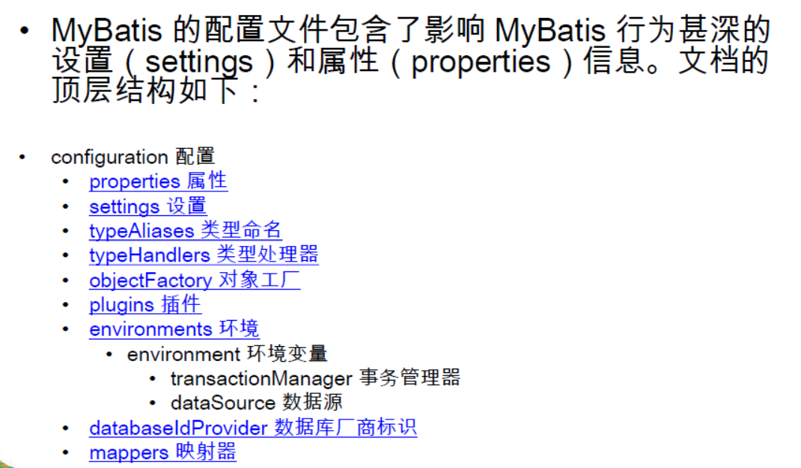
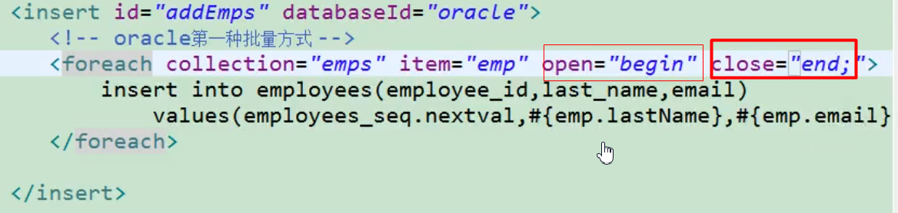

## 说明

## 目录

## mybatis简介

### 传统jdbc工具和hibernate


### mybatis


### 为何要使用mybatis

> - MyBatis是一个半自动化的持久化层框架
> - JDBC
>   - SQL夹在Java代码块里，耦合度高导致硬编码内伤
>   - 维护不易且实际开发需求中sql是有变化，频繁修改的情况多见
> - Hibernate和JPA
>   - 长难复杂SQL，对于Hibernate而言处理也不容易
>   - 内部自动生产的SQL，不容易做特殊优化
>   - 基于全映射的全自动框架，大量字段的POJO进行部分映射时比较困难。导致数据库性能下降
> - 对开发人员而言，核心sql还是需要自己优化
> - **sql和java编码分开，功能边界清晰，一个专注业务、一个专注数据**

## 下载

> mybatis已经迁移到github,下载地址
>
> [mybatis3](https://github.com/mybatis/mybatis-3/)

## HelloWorld

### 创建一个测试表employee

```sql
create table employee
(
    id        int          null,
    last_name varchar(255) null,
    gender    char         null,
    email     varchar(255) null
);
```


### 创建一个maven工程

```xml
  <dependencies>
    <dependency>
      <groupId>junit</groupId>
      <artifactId>junit</artifactId>
      <version>4.11</version>
      <scope>test</scope>
    </dependency>

    <dependency>
      <groupId>org.mybatis</groupId>
      <artifactId>mybatis</artifactId>
      <version>3.4.1</version>
    </dependency>

    <dependency>
      <groupId>mysql</groupId>
      <artifactId>mysql-connector-java</artifactId>
      <version>8.0.17</version>
    </dependency>

    <dependency>
      <groupId>log4j</groupId>
      <artifactId>log4j</artifactId>
      <version>1.2.17</version>
    </dependency>

  </dependencies>
```


### 创建对应的javabean

```java
package com.sugar.bean;

public class Employee {
    private int id;
    private String lastName;
    private String gender;
    private String email;

    public int getId() {
        return id;
    }

    public void setId(int id) {
        this.id = id;
    }

    public String getLastName() {
        return lastName;
    }

    public void setLastName(String lastName) {
        this.lastName = lastName;
    }

    public String getGender() {
        return gender;
    }

    public void setGender(String gender) {
        this.gender = gender;
    }

    public String getEmail() {
        return email;
    }

    public void setEmail(String email) {
        this.email = email;
    }

    @Override
    public String toString() {
        return "Employee{" +
                "id=" + id +
                ", lastName='" + lastName + '\'' +
                ", gender='" + gender + '\'' +
                ", email='" + email + '\'' +
                '}';
    }
}
```

### 创建mybatis主配置文件mybatis-config.xml

```xml
<?xml version="1.0" encoding="UTF-8" ?>
<!DOCTYPE configuration
        PUBLIC "-//mybatis.org//DTD Config 3.0//EN"
        "http://mybatis.org/dtd/mybatis-3-config.dtd">
<configuration>
    <environments default="development">
        <environment id="development">
            <transactionManager type="JDBC"/>
            <dataSource type="POOLED">
                <property name="driver" value="com.mysql.jdbc.Driver"/>
                <property name="url" value="jdbc:mysql://localhost:3306/mybatis_test?useSSL=false&amp;serverTimezone=UTC"/>
                <property name="username" value="root"/>
                <property name="password" value="123456"/>
            </dataSource>
        </environment>
    </environments>
    <!-- 将我们写好的sql映射文件（EmployeeMapper.xml）一定要注册到全局配置文件（mybatis-config.xml）中 -->
    <mappers>
        <mapper resource="conf/employeeMapper.xml"/>
    </mappers>
</configuration>
```

### 创建sql映射文件employeeMapper.xml

```xml
<?xml version="1.0" encoding="UTF-8" ?>
<!DOCTYPE mapper
        PUBLIC "-//mybatis.org//DTD Mapper 3.0//EN"
        "http://mybatis.org/dtd/mybatis-3-mapper.dtd">
<mapper namespace="com.sugar.dao.EmployeeMapper">
    <!--
    namespace:名称空间;指定为接口的全类名
    id：唯一标识
    resultType：返回值类型
    #{id}：从传递过来的参数中取出id值，可以防止sql注入

    public Employee getEmpById(Integer id);
     -->
    <select id="getEmpById" resultType="com.sugar.bean.Employee">
		select id,last_name lastName,email,gender from employee where id = #{id}
	</select>
</mapper>
```

### 添加log4j配置文件log4j.xml

> 添加后可以在控制台看到mybatis发送的sql语句

```xml
<?xml version="1.0" encoding="UTF-8" ?>
<!DOCTYPE log4j:configuration SYSTEM "log4j.dtd">

<log4j:configuration xmlns:log4j="http://jakarta.apache.org/log4j/">

    <appender name="STDOUT" class="org.apache.log4j.ConsoleAppender">
        <param name="Encoding" value="UTF-8"/>
        <layout class="org.apache.log4j.PatternLayout">
            <param name="ConversionPattern" value="%-5p %d{MM-dd HH:mm:ss,SSS} %m  (%F:%L) \n"/>
        </layout>
    </appender>
    <logger name="java.sql">
        <level value="debug"/>
    </logger>
    <logger name="org.apache.ibatis">
        <level value="info"/>
    </logger>
    <root>
        <level value="debug"/>
        <appender-ref ref="STDOUT"/>
    </root>
</log4j:configuration>
```

### 创建测试类

```java
public class App {
    public static void main(String[] args) throws IOException {
        String resource = "conf/mybatis-config.xml";
        InputStream inputStream = Resources.getResourceAsStream(resource);
        SqlSessionFactory sqlSessionFactory = new SqlSessionFactoryBuilder().build(inputStream);
        try (SqlSession session = sqlSessionFactory.openSession()) {
            Employee employee = session.selectOne("com.sugar.dao.EmployeeMapper.getEmpById", 1);
            System.out.println(employee);
        }
    }
}
```

### 总结

> 1. 根据xml配置文件（全局配置文件）创建一个SqlSessionFactory对象 有数据源一些运行环境信息
> 2. sql映射文件；配置了每一个sql，以及sql的封装规则等。
> 3. 将sql映射文件注册在全局配置文件中
> 4. 写代码
>    - 根据全局配置文件得到SqlSessionFactory；
>    - 使用sqlSession工厂，获取到sqlSession对象使用他来执行增删改查
>    - 一个sqlSession就是代表和数据库的一次会话，用完关闭
>    - 使用sql的唯一标志来告诉MyBatis执行哪个sql。sql都是保存在sql映射文件中的

## HelloWorld-接口式编程

> 1. 配置文件和接口动态绑定，通过namespace属性值指定，值为接口全类名
> 2. sql和方法进行绑定，id值为方法名即可绑定
> 3. sqlSession.getMapper方法获取对应接口的代理对象

### 创建EmployeeMapper接口

```java
public interface EmployeeMapper {

    Employee getEmpById(Integer id);
}
```

### 修改employeeMapper.xml

```xml
<?xml version="1.0" encoding="UTF-8" ?>
<!DOCTYPE mapper
        PUBLIC "-//mybatis.org//DTD Mapper 3.0//EN"
        "http://mybatis.org/dtd/mybatis-3-mapper.dtd">
<mapper namespace="com.sugar.dao.EmployeeMapper">
    <!--
    namespace:名称空间;指定为接口的全类名
    id：唯一标识
    resultType：返回值类型
    #{id}：从传递过来的参数中取出id值

    public Employee getEmpById(Integer id);
     -->
    <select id="getEmpById" resultType="com.sugar.bean.Employee">
		select id,last_name lastName,email,gender from employee where id = #{id}
	</select>
</mapper>
```

### 测试

```java
    @Test
    public void testMybatisInteface() throws IOException {
        String resource = "conf/mybatis-config.xml";
        InputStream inputStream = Resources.getResourceAsStream(resource);
        SqlSessionFactory sqlSessionFactory = new SqlSessionFactoryBuilder().build(inputStream);
        SqlSession sqlSession = sqlSessionFactory.openSession();
        EmployeeMapper employeeMapper = sqlSession.getMapper(EmployeeMapper.class);
        Employee employee = employeeMapper.getEmpById(1);
        System.out.println(employee);
        sqlSession.close();
    }
```

## SqlSession

> - SqlSession代表和数据库的一次会话，用完必须关闭
> - SqlSession和connection一样是非线程安全的，不能把它作为成员变量，每次使用都需要获取一个新的
> - sqlSession.getMapper(EmployeeMapper.class)，mybatis会根据配置文件为接口生成一个代理对象

## mybatis全局配置文件



### properties属性引入外部配置文件

> - 作用：可以引入外部properties配置文件，如数据库配置
>
> - properties有2个属性：resource、url
>
>   - resource：用于引入类路径下资源
>   - url：用于引入网络资源或磁盘文件系统下的资源
>
> ```
> <properties resource="" url=""></properties>
> ```
> - 如果属性在不只一个地方进行了配置，那么MyBatis 将按照下面的顺序来加载
>
>   - 在properties 元素体内指定的属性首先被读取,即子标签property设置的值
>
>     ```xml
>         <properties resource="conf/dbconfig.properties">
>             <property name="" value=""/>
>         </properties>
>     ```
>
>   - 然后根据properties 元素中的resource 属性读取类路径下属性文件或根据url 属性指定的路径读取属性文件，并覆盖已读取的同名属性。
>
>   - 最后读取作为方法参数传递的属性，并覆盖已读取的同名属性

### settings设置

> - 这是MyBatis 中极为重要的调整设置，它们会改变MyBatis 的运行时行
>
>   
>
> - 如上设置可以将数据库中使用下划线分割的字段和javabean的驼峰命名字段进行映射

### typeAliases别名处理器

> - 类型别名是为Java 类型设置一个短的名字，可以方便我们引用某个类,别名默认为类名
>
> - **注意：别名不区分大小写，别名冲突就会报错**
>
>   ```xml
>       <typeAliases>
>           <typeAlias type="com.sugar.bean.Employee" alias="employee"/>
>       </typeAliases>
>   ```
>
> - **typeAlias**：子标签可以为某个类指定别名
>
> - **package**：子标签可以为某个包下的所有类批量起别名
>
> - **@Alias注解**：也可以起别名
>
> - 推荐使用全类名，因为可以直接定位到目标类
>
> - mybatis默认起的一些别名
>
>   

### typeHandlers类型处理器

> - 无论是MyBatis 在预处理语句（PreparedStatement）中设置一个参数时，还是从结果集中取出一个值时，都会用类型处理器将获取的值以合适的方式转换成Java 类型
>
>   
>
> - 日期类型的处理
>
>   - 日期和时间的处理，JDK1.8以前一直是个头疼的问题。我们通常使用JSR310规范领导者Stephen Colebourne创建的Joda-Time来操作。1.8已经实现全部的JSR310规范了。
>
>   - 日期时间处理上，我们可以使用MyBatis基于JSR310（Date and Time API）编写的各种日期时间类型处理器
>
>   - MyBatis3.4以前的版本需要我们手动注册这些处理器，以后的版本都是自动注册的
>
>    
>
> - 自定义类型处理器
>
>   - 我们可以重写类型处理器或创建自己的类型处理器来处理不支持的或非标准的类型
>
>   - 步骤：
>
>     > 1. 实现org.apache.ibatis.type.TypeHandler接口或者继承org.apache.ibatis.type.BaseTypeHandler
>     > 2. 指定其映射某个JDBC类型（可选操作）
>     > 3. 在mybatis全局配置文件中注册

### plugins插件

> - 插件是MyBatis提供的一个非常强大的机制，我们可以通过插件来修改MyBatis的一些核心行为。插件通过动态代理机制，可以介入四大对象的任何一个方法的执行。后面会有专门的章节我们来介绍mybatis运行原理以及插件
> - Executor(update, query, flushStatements, commit, rollback, getTransaction, close, isClosed)
> - ParameterHandler(getParameterObject, setParameters)
> - ResultSetHandler(handleResultSets, handleOutputParameters)
> - StatementHandler(prepare, parameterize, batch, update, query)

### environments环境

> - MyBatis可以配置多种环境，比如开发、测试和生产环境需要有不同的配置。
> - 每种环境使用一个environment标签进行配置并指定唯一标识符
> - 可以通过environments标签中的default属性指定一个环境的标识符来快速的切换环境


#### transactionManager

> type：JDBC | MANAGED | 自定义
>
> - JDBC：使用了JDBC 的提交和回滚设置，依赖于从数据源得到的连接来管理事务范围。JdbcTransactionFactory
> - MANAGED：不提交或回滚一个连接、让容器来管理事务的整个生命周期（比如J2EE 应用服务器的上下文）。ManagedTransactionFactory
> - 自定义：实现TransactionFactory接口，type=全类名/别名

#### dataSource

> type：UNPOOLED | POOLED | JNDI | 自定义
>
> - UNPOOLED：不使用连接池，UnpooledDataSourceFactory
> - POOLED：使用连接池，PooledDataSourceFactory
> - JNDI：在EJB 或应用服务器这类容器中查找指定的数据源
> - 自定义：实现DataSourceFactory接口，定义数据源的获取方式
>
> **实际开发中我们使用Spring管理数据源，并进行事务控制的配置来覆盖上述配置**

### databaseIdProvider环境

> - 可以和environments配合使用，做到动态切换数据库
>
> - MyBatis 可以根据不同的数据库厂商执行不同的语句，为不同的厂商起别名如下，也可以不起，则别名为name值
>
>   
>
> - Type：DB_VENDOR
>
>   > - 使用MyBatis提供的VendorDatabaseIdProvider解析数据库厂商标识（根据不同的驱动判断）。也可以实现DatabaseIdProvider接口来自定义
>   > - 会通过DatabaseMetaData#getDatabaseProductName()返回的字符串进行设置。由于通常情况下这个字符串都非常长而且相同产品的不同版本会返回不同的值，所以最好通过设置属性别名来使其变短
>
> - Property-name：数据库厂商标识
>
> - Property-value：为标识起一个别名，方便SQL语句使用databaseId属性引用，在sql映射文件中可以使用databaseId进行引用，如：
>
>   
>
> - MyBatis匹配规则如下：
>
>   > - 如果没有配置databaseIdProvider标签，那么databaseId=null
>   > - 如果配置了databaseIdProvider标签，使用标签配置的name去匹配数据库信息，匹配上设置databaseId=配置指定的值，否则依旧为null
>   > - 如果databaseId不为null，他只会找到配置databaseId的sql语句
>   > - MyBatis 会加载不带databaseId属性和带有匹配当前数据库databaseId 属性的所有语句。如果同时找到带有databaseId 和不带databaseId 的相同语句，则后者会被舍弃，mybatis会使用更精确的
>
>   

### mapper映射

#### 逐个注册SQL映射文件

> - mapper逐个注册SQL映射文件
>
>   > - resource:用于引用类路径下资源
>   >
>   > - url:网络资源或磁盘文件资源
>   >
>   > - class：引用或注册接口，值为**接口全类名**
>   >
>   >   - **若有sql映射文件**，接口和映射文件必须放在同一目录下，并且除后缀名称必须相同，否则mybatis不知道接口和哪个配置文件进行映射
>   >   - **若没有sql映射文件**，可以使用基于注解的方式指定sql
>   >
>   >   ```java
>   >   public interface EmployeeMapper2 {
>   >       @Select("select * from employee where id = #{id}")
>   >       Employee getEmpById(Integer id);
>   >   }
>   >   ```
>
>   

#### 批量注册

> - 这种方式要求SQL映射文件名必须和接口名相同并且在同一目录下,或者使用基于注解的方式
> - 为了将sql配置文件和java代码分开，可以建立2个根目录，并在2个目录下创建同样的包
>
> ```xml
>     <mappers>
>         <package name="com.sugar.dao"/>
>     </mappers>
> ```

## MyBatis-映射文件

### 作用

> 映射文件指导着MyBatis如何进行数据库增删改查，有着非常重要的意义

### 常用标签

> - cache –命名空间的二级缓存配置
> - cache-ref –其他命名空间缓存配置的引用。
> - resultMap–自定义结果集映射
> - parameterMap –已废弃！老式风格的参数映射
> - sql –抽取可重用语句块。
> - insert –映射插入语句
> - update –映射更新语句
> - delete –映射删除语句
> - select –映射查询语句

### 增删改查标签

#### 注意

- ```
  sqlSession = sqlSessionFactory.openSession(); //sqlSession必须手动提交数据，即事务
  sqlSession.commit();
  或
  sqlSessionFactory.openSession(true) //sqlSession会自动提交
  ```

- 普通的方法mybatis允许的返回值类型为Integer,Long,Boolean,void,即影响的行数或是否执行成功

#### 接口类

```java
public interface EmployeeMapper {

    Employee getEmpById(@Param("id") Integer id);

    int insertEmployee(@Param("employee") Employee employee);

    int updateEmployee(@Param("employee") Employee employee);

    int deleteEmployeeById(@Param("id") Integer id);
}
```

#### 映射文件

```xml
<?xml version="1.0" encoding="UTF-8" ?>
<!DOCTYPE mapper
        PUBLIC "-//mybatis.org//DTD Mapper 3.0//EN"
        "http://mybatis.org/dtd/mybatis-3-mapper.dtd">
<mapper namespace="com.sugar.dao.EmployeeMapper">
    <select id="getEmpById" resultType="emp">
		select * from employee where id = #{id}
	</select>

    <insert id="insertEmployee">
        INSERT INTO employee(id,last_name,gender,email)
        VALUES (#{employee.id},#{employee.lastName},#{employee.gender},#{employee.email})
    </insert>

    <update id="updateEmployee">
        UPDATE employee
        SET last_name=#{employee.lastName},gender=#{employee.gender},email=#{employee.email}
        where id=#{employee.id}
    </update>

    <delete id="deleteEmployeeById">
        DELETE FROM employee WHERE id=#{id}
    </delete>
</mapper>
```

### mysql获取自增的主键

> 若数据库支持自动生成主键的字段（比如MySQL 和SQL Server），则可以设置useGeneratedKeys=”true”，然后再把keyProperty设置到目标属性上。

#### mysql设置自增主键

```sql
alter table employee change column id id int not null primary key auto_increment;
```

#### mybatis配置

> 配置useGeneratedKeys属性为true，keyProperty的值为主键字段

```xml
    <insert id="insertEmployee" useGeneratedKeys="true" keyProperty="id">
        INSERT INTO employee(id,last_name,gender,email)
        VALUES (#{employee.id},#{employee.lastName},#{employee.gender},#{employee.email})
    </insert>
```

### oracle使用序列生成主键

> 而对于不支持自增型主键的数据库（例如Oracle），则可以使用selectKey子元素：selectKey 元素将会首先运行，id 会被设置，然后插入语句会被调用

#### 获取序列的下一个值

```sql
select employee_seq.nextval from dual
```

#### mybatis配置

执行流程：

> - 由于order属性配置的是BEFORE，则selectKey中的sql会先执行，就会获取到序列的下一个值
> - 根据keyProperty属性配置的值将查询结果封装的javabean对应的属性中
> - 执行下面的sql

```xml
    <insert id="insertEmployee" useGeneratedKeys="true" keyProperty="id" databaseId="oracle">
        <selectKey keyProperty="id" order="BEFORE" resultType="Integer">
            select employee_seq.nextval from dual
        </selectKey>
        INSERT INTO employee(id,last_name,gender,email)
        VALUES (#{id},#{lastName},#{gender},#{email})
    </insert>
```

order值配置为AFTER的情况

> employee_seq.currval可以获取到当前序列的值
>
> 注意：AFTER模式下获取currval可能会有问题，因为可能同时插入多条数据，故可能获取到的currval值为最后的值

```xml
    <insert id="insertEmployee" useGeneratedKeys="true" keyProperty="id" databaseId="oracle">
        <selectKey keyProperty="id" order="AFTER" resultType="Integer">
            select employee_seq.currval from dual
        </selectKey>
        INSERT INTO employee(id,last_name,gender,email)
        VALUES (employee_seq.nextval,#{lastName},#{gender},#{email})
    </insert>
```

### 参数处理

> mybatis在参数只有一个并且没有标注@Param注解，会直接返回第一个参数，否则会将参数封装到一个map中，可以使用**param1，param2，0，1**这样的key取值

#### 单个参数、多个参数、命名参数

- **单个参数**：可以接受基本类型，对象类型，集合类型的值。这种情况MyBatis可直接使用这个参数，不需要经过任何处理，参数名可以和映射文件中参数名不对应

  ```java
  Employee getEmpById(@Param("id") Integer id);
  
  <select id="getEmpById" resultType="emp">
  	select * from employee where id = #{id111}
  </select>
  ```

- **多个参数**：任意多个参数，都会被MyBatis重新包装成一个Map传入。Map的key是param1，param2，0，1…，值就是参数的值。不推荐使用，参数不直观

- **命名参数**：为参数使用`@Param`起一个名字，MyBatis就会将这些参数封装进map中，key就是我们自己指定的名字

- **POJO**：当这些参数属于我们业务POJO时，我们直接传递POJO

- **Map**：我们也可以封装多个参数为map，直接传递

- 特殊情况

  > 1. 一个参数使用了注解，取值方式：#{id},#{param2}
  >
  >    ```java
  >    Employee getEmpById(@Param("id") Integer id,String name);
  >    ```
  >
  > 2. 一个参数使用了注解，另一个是javabean，取值方式：#{id},#{param2.name}
  >
  >    ```java
  >    Employee getEmpById(@Param("id") Integer id,Employee emp);
  >    ```
  >
  > 3. 参数是集合（List,Set等）或数组，
  >
  >    - 若参数是集合，key为collection，若集合为List，则key为list，
  >    - 若参数是数组，则key为array

#### 参数解析源码

> - names是一个map，key为参数缩影，value为参数名
>
>   > 若参数标注了@Param注解，则参数名为注解的value值，否则若全局配置了useActualParamName(jdk1.8有效)，则参数名为方法参数名，否则参数名为索引值
>
> - 

```java
  public Object getNamedParams(Object[] args) {
    final int paramCount = names.size();
      //1.参数为空直接返回
    if (args == null || paramCount == 0) {
      return null;
        //2.参数只有一个并且没有标注@Param注解，则返回第一个参数
    } else if (!hasParamAnnotation && paramCount == 1) {
      return args[names.firstKey()];
        //3.多个参数或者参数有@Param注解，会封装一个map
    } else {
        //k:参数名，v:参数值
      final Map<String, Object> param = new ParamMap<>();
      int i = 0;
      for (Map.Entry<Integer, String> entry : names.entrySet()) {
        param.put(entry.getValue(), args[entry.getKey()]);
        // add generic param names (param1, param2, ...)
        final String genericParamName = GENERIC_NAME_PREFIX + String.valueOf(i + 1);
        // ensure not to overwrite parameter named with @Param
        if (!names.containsValue(genericParamName)) {
          param.put(genericParamName, args[entry.getKey()]);
        }
        i++;
      }
      return param;
    }
  }
```

#### 参数取值时#和$的区别

> #：以预编译的形式将参数设置到sql语句中，之前是使用?作为占位符,使用PreparedStatement,可以防止sql注入
>
> $：直接替换参数的值
>
> **何时使用$**:原生jdbc不能使用占位符的地方就可以使用$符号进行取值，如数据库表按年份进行了拆分，可以动态拼接表名
>
> ```sql
> select * from ${year}_salary
> select * from salary order by ${year}
> ```

#### 使用#取值时指定参数的相关规则

> - javaType：规定参数的类型，通常可以从参数对象来确定；
>
> - jdbcType：指定数据库对应字段类型；如果null 被当作值来传递，对于所有可能为空的列，jdbcType 需要被设置
>
>   > - 数据为null的时候，有些数据库可能无法识别mybatis对null的默认处理，如oracle会报错jdbcType OTHER，要解决这个为题，需要指定jdbcType=NULL
>   >
>   >   ```xml
>   >   #{name,jdbcType=NULL}
>   >   ```
>   >
>   > - 方法2：在全局配置中设置jdbcTypeForNull=NULL
>   >
>   >   ```xml
>   >       <settings>
>   >           <setting name="mapUnderscoreToCamelCase" value="true"/>
>   >           <setting name="jdbcTypeForNull" value="NULL"/>
>   >       </settings>
>   >   ```
>   >
>   > - 
>
> - mode：用于存储过程，允许指定IN，OUT 或INOUT 参数。如果参数为OUT 或INOUT，参数对象属性的真实值将会被改变，就像在获取输出参数时所期望的那样
>
> - numericScala：对于数值类型，还可以设置小数点后保留的位数
>
> - resultMap：结果集封装
>
> - typeHandler：类型处理器
>
> - jdbcTypeName：与jdbcType相同
>
> - expression：暂未实现

### select标签

> - Select元素来定义查询操作
>
> - id：唯一标识符,用来引用这条语句，需要和接口的方法名一致
>
> - parameterType:参数类型,可以不传，MyBatis会根据TypeHandler自动推断
>
> - resultType:返回值类型,别名或者全类名，如果返回的是集合，定义集合中元素的类型。不能和resultMap同时使用
>
>   > 自动映射配置
>   >
>   > ```
>   > 全局setting设置
>   > –autoMappingBehavior默认是PARTIAL，开启自动映射的功能。唯一的要求是列名和javaBean属性名一致
>   > –如果autoMappingBehavior设置为null则会取消自动映射
>   > –数据库字段命名规范，POJO属性符合驼峰命名法，如A_COLUMNaColumn，我们可以开启自动驼峰命名规则映射功能，mapUnderscoreToCamelCase=true。
>   > ```
>
> - resultMap：自定义结果映射规则

#### 返回List

> resultType指定为集合元素的类型即可
>
> ```xml
>     <select id="getEmpLike" resultType="com.sugar.bean.Employee">
>         select * from employee where last_name like #{keyword}
>     </select>
> ```
>
> ```java
>         List<Employee> employeeList = employeeMapper.getEmpLike("%zhangsan%");
> ```

#### 封装map

**1.封装成一个简单map**

> resultType指定为map，可以指定为map是因为mybatis默认为许多常用的java类起了别名
>
> ```xml
>     <select id="getEmpByIdReturnMap" resultType="map">
>         select * from employee where id = #{id}
>     </select>
> ```
>
> 结果
>
> ```
> {gender=0, last_name=zhangsan, id=1, email=zhangsan@qq.com}
> ```

2.多条数据封装成Map<key,Employee>的形式

> resultType指定为map中value的类型，key通过在方法上使用@MapKey注解声明，值为javaBean的某个属性
>
> ```xml
>     <select id="getEmpByLastName" resultType="com.sugar.bean.Employee">
>         select * from employee where last_name like #{name}
>     </select>
> ```
>
> ```java
>     @MapKey("id")
>     Map<Integer,Employee> getEmpByLastName(String name);
> ```

#### 使用resultMap

##### 自定义结果映射规则

> ```xml
>     <resultMap id="empResult" type="com.sugar.bean.Employee">
>         <!--用于指定主键映射规则，也可以使用result标签定义，但是使用id标签mybatis底层会进行优化-->
>         <id column="id" property="id"/>
>         <!--定义普通列的映射规则-->
>         <result column="last_name" property="lastName"/>
>         <result column="gender" property="gender"/>
>         <result column="email" property="email"/>
>     </resultMap>
> 
>     <select id="getEmpById" resultMap="empResult">
> 		select * from employee where id = #{id}
> 	</select>
> ```

##### 关联查询结果封装

>javaBean的属性是另一个javaBean
>  ```xml
>     <resultMap id="empResult" type="com.sugar.bean.Employee">
>         <!--用于指定主键映射规则，也可以使用result标签定义，但是使用id标签mybatis底层会进行优化-->
>         <id column="emp_id" property="empId"/>
>         <!--定义普通列的映射规则-->
>         <result column="last_name" property="lastName"/>
>         <result column="gender" property="gender"/>
>         <result column="email" property="email"/>
>         <!--级联属性设置-->
>         <result column="dept_id" property="dept.deptId"/>
>         <result column="dept_name" property="dept.deptName"/>
>     </resultMap>
> 
>     <select id="getEmpAndDept" resultMap="empResult">
>         select e.emp_id, e.last_name, e.gender, e.email, d.dept_id, d.dept_name
>         from employee e,
>              dept d
>         where e.emp_dept = d.dept_id
>           and e.emp_id = #{id}
>     </select>
> ```
>
> ```java
> public class Employee {
>     private Integer empId;
>     private String lastName;
>     private String gender;
>     private String email;
>     private Dept dept;
> }
> ```

##### association定义级联属性封装规则

> ```xml
>     <resultMap id="empResult" type="com.sugar.bean.Employee">
>         <!--用于指定主键映射规则，也可以使用result标签定义，但是使用id标签mybatis底层会进行优化-->
>         <id column="emp_id" property="empId"/>
>         <!--定义普通列的映射规则-->
>         <result column="last_name" property="lastName"/>
>         <result column="gender" property="gender"/>
>         <result column="email" property="email"/>
>         <!--级联属性设置-->
>         <!--property指定联合的属性（javaBean的某个属性），javaType指定该属性的类型-->
>         <association property="dept" javaType="com.sugar.bean.Dept">
>             <id column="dept_id" property="deptId"/>
>             <result column="dept_name" property="deptName"/>
>         </association>
>     </resultMap>
> 
>     <select id="getEmpAndDept" resultMap="empResult">
>         select e.emp_id, e.last_name, e.gender, e.email, d.dept_id, d.dept_name
>         from employee e,
>              dept d
>         where e.emp_dept = d.dept_id
>           and e.emp_id = #{id}
>     </select>
> ```

##### association分步查询

> 使用分步查询就不用使用关联查询的sql，就可以使sql变得简洁，功能分离
>
> 缺点：每次查员工信息都会将部门一次一起查出，会发两次sql

```xml
    <resultMap id="empResult" type="com.sugar.bean.Employee">
        <!--用于指定主键映射规则，也可以使用result标签定义，但是使用id标签mybatis底层会进行优化-->
        <id column="emp_id" property="empId"/>
        <!--定义普通列的映射规则-->
        <result column="last_name" property="lastName"/>
        <result column="gender" property="gender"/>
        <result column="email" property="email"/>
        <!--级联属性设置-->
        <!--property指定联合的属性（javaBean的某个属性>
        <!-select指定使用哪个接口方法进行关联查询-->
        <!--column指定使用当前结果集的哪个字段作为参数传递给指定的接口方法-->
        <association select="com.sugar.dao.DeptMapper.getDeptById" column="emp_dept" property="dept"/>
    </resultMap>

    <select id="getEmpAndDept" resultMap="empResult">
		select * from employee where emp_id = #{id}
	</select>
```

##### association分步查询、延迟加载

> 级联的属性在使用时再进行查询
>
> **lazyLoadingEnabled**:设置属性控制全局是否使用延迟加载，默认为false
>
> **aggressiveLazyLoading**：延设置是否**按需加载**，关闭该属性则会按需加载，即使用到某关联属性时，实时执行嵌套查询加载该属性；即若一个对象有多个级联属性时，用到某个属性才会去加载那个属性，而不是加载某个懒属性时加载所有懒属性
>
> ```xml
>     <settings>
>         <setting name="lazyLoadingEnabled" value="true"/>
>         <setting name="aggressiveLazyLoading" value="false"/>
>     </settings>
> ```
>
> 只获取员工的姓名
>
> ```java
> System.out.println(employee.getLastName());
> ```
>
> 输出结果:只发了一次sql
>
> ```
> DEBUG 09-07 19:46:59,501 ==>  Preparing: select * from employee where emp_id = ?   (JakartaCommonsLoggingImpl.java:54) 
> DEBUG 09-07 19:46:59,527 ==> Parameters: 1(Integer)  (JakartaCommonsLoggingImpl.java:54) 
> DEBUG 09-07 19:46:59,577 <==      Total: 1  (JakartaCommonsLoggingImpl.java:54) 
> zhangsan
> ```
>
> 获取部门信息
>
> ```java
> System.out.println(employee.getDept().getDeptName());
> ```
>
> 输出结果：发了2次sql
>
> ```
> DEBUG 09-07 19:49:19,525 ==>  Preparing: select * from employee where emp_id = ?   (JakartaCommonsLoggingImpl.java:54) 
> DEBUG 09-07 19:49:19,555 ==> Parameters: 1(Integer)  (JakartaCommonsLoggingImpl.java:54) 
> DEBUG 09-07 19:49:19,612 <==      Total: 1  (JakartaCommonsLoggingImpl.java:54) 
> DEBUG 09-07 19:49:19,613 ==>  Preparing: select * from dept where dept_id=?   (JakartaCommonsLoggingImpl.java:54) 
> DEBUG 09-07 19:49:19,613 ==> Parameters: 1(Integer)  (JakartaCommonsLoggingImpl.java:54) 
> DEBUG 09-07 19:49:19,615 <==      Total: 1  (JakartaCommonsLoggingImpl.java:54) 
> 开发部
> ```

##### Collection定义关联集合封装规则

> association主要用来定义一对一的关系，Collection用来定义一对多的关系

sql映射文件

> collection使用ofType指定集合中元素类型

```xml
    <resultMap id="deptMap" type="com.sugar.bean.Dept">
        <id column="dept_id" property="deptId"/>
        <result column="dept_name" property="deptName"/>
        <collection property="employees" ofType="com.sugar.bean.Employee">
            <id column="emp_id" property="empId"/>
            <result column="last_name" property="lastName"/>
            <result column="gender" property="gender"/>
            <result column="email" property="email"/>
        </collection>
    </resultMap>

    <select id="getDeptAndEmp" resultMap="deptMap">
        select * from dept d left join employee e on d.dept_id=e.emp_dept
        where d.dept_id=#{deptId}
    </select>
```

javaBean

```java
public class Dept {
    private Integer deptId;
    private String deptName;
    private List<Employee> employees;
}
```

##### Collection分步查询、延迟加载

> 与association使用方式相同

```xml
    <resultMap id="deptMap" type="com.sugar.bean.Dept">
        <id column="dept_id" property="deptId"/>
        <result column="dept_name" property="deptName"/>
        <collection property="employees" column="dept_id" select="com.sugar.dao.EmployeeMapper.getEmpsByDeptId">
        </collection>
    </resultMap>
    <select id="getDeptById" resultMap="deptMap">
        select * from dept where dept_id=#{deptId}
    </select>
```

##### 分步查询传递多值列&fetchType

> - 分步查询的时候通过column指定，将对应的列的数据传递过去，我们有时需要传递多列数据
>
> - 使用{key1=column1,key2=column2…}的形式,然后指定的sql映射中通过#{}取值时指定key为传递过去的column map中的key，与接口的参数名和注解别名无关
>
>   ```xml
>       <resultMap id="deptMap" type="com.sugar.bean.Dept">
>           <id column="dept_id" property="deptId"/>
>           <result column="dept_name" property="deptName"/>
>           <collection property="employees" column="{id=dept_id}" select="com.sugar.dao.EmployeeMapper.getEmpsByDeptId">
>           </collection>
>       </resultMap>
>   ```
>
> - association或者collection标签的fetchType=eager/lazy可以覆盖全局的延迟加载策略，指定立即加载（eager）或者延迟加载（lazy）

##### discriminator鉴别器

> 根据某列的值改变封装行为，mybatis根据指定的列的值进行不同的封装，如下，若vehicle_type的值为1，则会封装一个Car类型的汽车，若vehicle_type的值为2，会封装一个Suv类型的汽车，除了可以使用resultType指定封装的类型，也可以使用resultMap指定封装规则

```xml
    <resultMap id="vehicleResultMap" type="Vehicle">
        <id column="id" property="id"/>
        <id column="vin" property="vin"/>
        <id column="year" property="year"/>
        <id column="make" property="make"/>
        <id column="model" property="model"/>
        <id column="color" property="color"/>
        <discriminator javaType="int" column="vehicle_type">
            <case value="1" resultType="Car">
                <result column="door_count" property="doorCount"/>
            </case>
            <case value="2" resultType="Suv">
                <result column="all_wheel_drive" property="allWheelDriveFlag"/>
            </case>
        </discriminator>
    </resultMap>
```

## 动态sql

### 简介

> - 动态SQL是MyBatis强大特性之一。极大的简化我们拼装SQL的操作
> - 动态SQL 元素和使用JSTL 或其他类似基于XML 的文本处理器相似。
> - MyBatis 采用功能强大的基于OGNL 的表达式来简化操作
>   - if
>   - choose (when, otherwise)
>   - trim (where, set)
>   - foreach

### if&OGNL

#### OGNL


#### if

> - 特殊字符需要进行转义,使用\&quot;的形式
> - &&也可以写成and,||可以写成or


### where

> 当使用多个if时，中间有and连接，如何保证第一个条件之前没有and
>
> - 传统解决办法，使用一个永真条件放在where之后，如1=1
> - mybatis解决方案，使用where标签包裹所有的条件，但是where只会去掉第一个and，不会去掉最后一个and，所以在使用if拼接条件时，需要将and写在前面，或者使用trim标签动态截取

### trim

> 自定义字符串截取，可以截取where标签and的拼接问题
>
> trim的4个属性：
>
> - prefix：给标签体里面的拼接结果添加一个前缀，可以设置为where
> - prefixOverrides：前缀覆盖，如将第一个and去掉，则将该值指定为and
> - suffix：添加后缀
> - suffixOverrides：后缀覆盖
>
> ```xml
> <trim prefix="where" prefixOverrides="and" suffix="" suffixOverrides="and"/>
> ```

### choose分支选择


### set与if结合实现动态更新


### foreach遍历集合

> - 动态SQL 的另外一个常用的必要操作是需要对一个集合进行遍历，通常是在构建IN 条件语句的时候
>
>   
>
> - 当迭代列表、集合等可迭代对象或者数组时
>   –index是当前迭代的次数，item的值是本次迭代获取的元素
>
> - 当使用字典（或者Map.Entry对象的集合）时
>   –index是键，item是值
>
> - 

### mysql使用foreach批量插入

#### 方式一

> 使用insert into values (),()的写法


#### 方式二

> 开启mysql批量sql执行，使用多个sql,sql之间使用;分割


### oracle使用foreach批量插入

#### 方式一

> oracle不支持insert into values (),()这种写法
>
> 解决方案：将多个insert语句放在begin end中，如
>
> ```sql
> begin
> 	insert into values ();
> 	insert into values ();
> end
> ```
> 
> **注意end后面有一个分号**

#### 方式二

> 使用中间表，中间表的字段需要起别名和字段对应
>
> 


### 内置参数parameter和databaseId

> - _parameter：代表整个参数
>   - 只有单个参数时，_parameter就是这个参数
>   - 当有多个参数时，参数会被封装成一个map，_parameter就是这个map
> - _databaseId:若在mybatis配置文件中配置了databaseIdProvider, 则可以使用“_databaseId”变量，这样就可以根据不同的数据库厂商构建特定的语句


### bind绑定

> bind 元素可以从OGNL 表达式中创建一个变量并将其绑定到上下文。比如：
>
> 

### 抽取可重用sql片段


## mybatis缓存

## mybatis整合spring