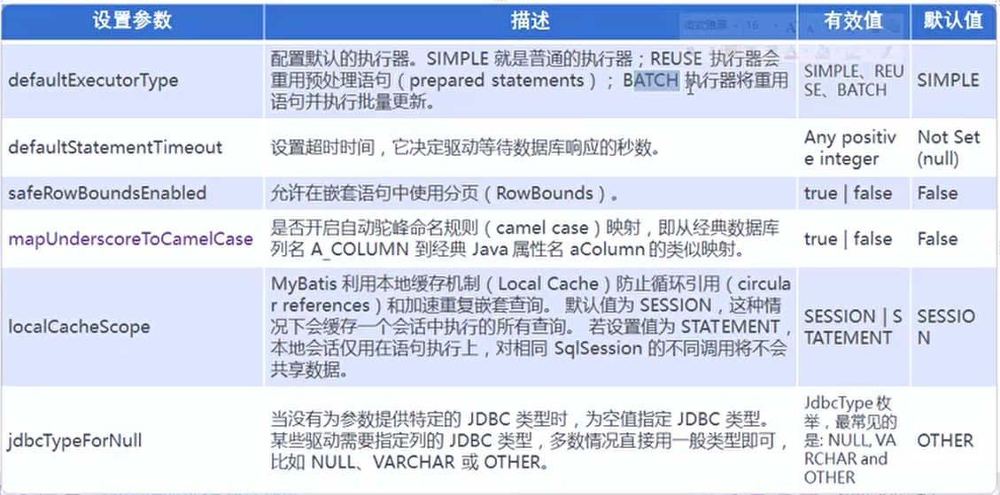
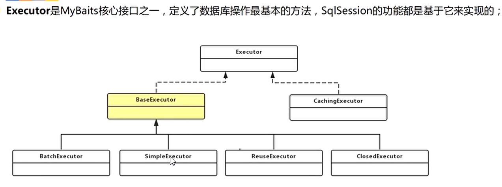
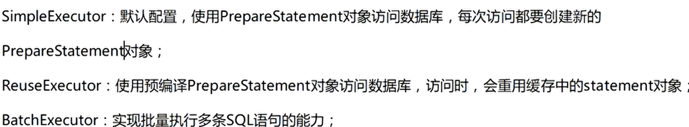

## 说明

## 目录

## mybatis简介

### 传统jdbc工具和hibernate


### mybatis


### 为何要使用mybatis

> - MyBatis是一个半自动化的持久化层框架
> - JDBC
>   - SQL夹在Java代码块里，耦合度高导致硬编码内伤
>   - 维护不易且实际开发需求中sql是有变化，频繁修改的情况多见
> - Hibernate和JPA
>   - 长难复杂SQL，对于Hibernate而言处理也不容易
>   - 内部自动生产的SQL，不容易做特殊优化
>   - 基于全映射的全自动框架，大量字段的POJO进行部分映射时比较困难。导致数据库性能下降
> - 对开发人员而言，核心sql还是需要自己优化
> - **sql和java编码分开，功能边界清晰，一个专注业务、一个专注数据**

## 下载

> mybatis已经迁移到github,下载地址
>
> [mybatis3](https://github.com/mybatis/mybatis-3/)

## HelloWorld

### 创建一个测试表employee

```sql
create table employee
(
    id        int          null,
    last_name varchar(255) null,
    gender    char         null,
    email     varchar(255) null
);
```


### 创建一个maven工程

```xml
  <dependencies>
    <dependency>
      <groupId>junit</groupId>
      <artifactId>junit</artifactId>
      <version>4.11</version>
      <scope>test</scope>
    </dependency>

    <dependency>
      <groupId>org.mybatis</groupId>
      <artifactId>mybatis</artifactId>
      <version>3.4.1</version>
    </dependency>

    <dependency>
      <groupId>mysql</groupId>
      <artifactId>mysql-connector-java</artifactId>
      <version>8.0.17</version>
    </dependency>

    <dependency>
      <groupId>log4j</groupId>
      <artifactId>log4j</artifactId>
      <version>1.2.17</version>
    </dependency>

  </dependencies>
```


### 创建对应的javabean

```java
package com.sugar.bean;

public class Employee {
    private int id;
    private String lastName;
    private String gender;
    private String email;

    public int getId() {
        return id;
    }

    public void setId(int id) {
        this.id = id;
    }

    public String getLastName() {
        return lastName;
    }

    public void setLastName(String lastName) {
        this.lastName = lastName;
    }

    public String getGender() {
        return gender;
    }

    public void setGender(String gender) {
        this.gender = gender;
    }

    public String getEmail() {
        return email;
    }

    public void setEmail(String email) {
        this.email = email;
    }

    @Override
    public String toString() {
        return "Employee{" +
                "id=" + id +
                ", lastName='" + lastName + '\'' +
                ", gender='" + gender + '\'' +
                ", email='" + email + '\'' +
                '}';
    }
}
```

### 创建mybatis主配置文件mybatis-config.xml

```xml
<?xml version="1.0" encoding="UTF-8" ?>
<!DOCTYPE configuration
        PUBLIC "-//mybatis.org//DTD Config 3.0//EN"
        "http://mybatis.org/dtd/mybatis-3-config.dtd">
<configuration>
    <environments default="development">
        <environment id="development">
            <transactionManager type="JDBC"/>
            <dataSource type="POOLED">
                <property name="driver" value="com.mysql.jdbc.Driver"/>
                <property name="url" value="jdbc:mysql://localhost:3306/mybatis_test?useSSL=false&amp;serverTimezone=UTC"/>
                <property name="username" value="root"/>
                <property name="password" value="123456"/>
            </dataSource>
        </environment>
    </environments>
    <!-- 将我们写好的sql映射文件（EmployeeMapper.xml）一定要注册到全局配置文件（mybatis-config.xml）中 -->
    <mappers>
        <mapper resource="conf/employeeMapper.xml"/>
    </mappers>
</configuration>
```

### 创建sql映射文件employeeMapper.xml

```xml
<?xml version="1.0" encoding="UTF-8" ?>
<!DOCTYPE mapper
        PUBLIC "-//mybatis.org//DTD Mapper 3.0//EN"
        "http://mybatis.org/dtd/mybatis-3-mapper.dtd">
<mapper namespace="com.sugar.dao.EmployeeMapper">
    <!--
    namespace:名称空间;指定为接口的全类名
    id：唯一标识
    resultType：返回值类型
    #{id}：从传递过来的参数中取出id值，可以防止sql注入

    public Employee getEmpById(Integer id);
     -->
    <select id="getEmpById" resultType="com.sugar.bean.Employee">
		select id,last_name lastName,email,gender from employee where id = #{id}
	</select>
</mapper>
```

### 添加log4j配置文件log4j.xml

> 添加后可以在控制台看到mybatis发送的sql语句

```xml
<?xml version="1.0" encoding="UTF-8" ?>
<!DOCTYPE log4j:configuration SYSTEM "log4j.dtd">

<log4j:configuration xmlns:log4j="http://jakarta.apache.org/log4j/">

    <appender name="STDOUT" class="org.apache.log4j.ConsoleAppender">
        <param name="Encoding" value="UTF-8"/>
        <layout class="org.apache.log4j.PatternLayout">
            <param name="ConversionPattern" value="%-5p %d{MM-dd HH:mm:ss,SSS} %m  (%F:%L) \n"/>
        </layout>
    </appender>
    <logger name="java.sql">
        <level value="debug"/>
    </logger>
    <logger name="org.apache.ibatis">
        <level value="info"/>
    </logger>
    <root>
        <level value="debug"/>
        <appender-ref ref="STDOUT"/>
    </root>
</log4j:configuration>
```

### 创建测试类

```java
public class App {
    public static void main(String[] args) throws IOException {
        String resource = "conf/mybatis-config.xml";
        InputStream inputStream = Resources.getResourceAsStream(resource);
        SqlSessionFactory sqlSessionFactory = new SqlSessionFactoryBuilder().build(inputStream);
        try (SqlSession session = sqlSessionFactory.openSession()) {
            Employee employee = session.selectOne("com.sugar.dao.EmployeeMapper.getEmpById", 1);
            System.out.println(employee);
        }
    }
}
```

### 总结

> 1. 根据xml配置文件（全局配置文件）创建一个SqlSessionFactory对象 有数据源一些运行环境信息
> 2. sql映射文件；配置了每一个sql，以及sql的封装规则等。
> 3. 将sql映射文件注册在全局配置文件中
> 4. 写代码
>    - 根据全局配置文件得到SqlSessionFactory；
>    - 使用sqlSession工厂，获取到sqlSession对象使用他来执行增删改查
>    - 一个sqlSession就是代表和数据库的一次会话，用完关闭
>    - 使用sql的唯一标志来告诉MyBatis执行哪个sql。sql都是保存在sql映射文件中的

## HelloWorld-接口式编程

> 1. 配置文件和接口动态绑定，通过namespace属性值指定，值为接口全类名
> 2. sql和方法进行绑定，id值为方法名即可绑定
> 3. sqlSession.getMapper方法获取对应接口的代理对象

### 创建EmployeeMapper接口

```java
public interface EmployeeMapper {

    Employee getEmpById(Integer id);
}
```

### 修改employeeMapper.xml

```xml
<?xml version="1.0" encoding="UTF-8" ?>
<!DOCTYPE mapper
        PUBLIC "-//mybatis.org//DTD Mapper 3.0//EN"
        "http://mybatis.org/dtd/mybatis-3-mapper.dtd">
<mapper namespace="com.sugar.dao.EmployeeMapper">
    <!--
    namespace:名称空间;指定为接口的全类名
    id：唯一标识
    resultType：返回值类型
    #{id}：从传递过来的参数中取出id值

    public Employee getEmpById(Integer id);
     -->
    <select id="getEmpById" resultType="com.sugar.bean.Employee">
		select id,last_name lastName,email,gender from employee where id = #{id}
	</select>
</mapper>
```

### 测试

```java
    @Test
    public void testMybatisInteface() throws IOException {
        String resource = "conf/mybatis-config.xml";
        InputStream inputStream = Resources.getResourceAsStream(resource);
        SqlSessionFactory sqlSessionFactory = new SqlSessionFactoryBuilder().build(inputStream);
        SqlSession sqlSession = sqlSessionFactory.openSession();
        EmployeeMapper employeeMapper = sqlSession.getMapper(EmployeeMapper.class);
        Employee employee = employeeMapper.getEmpById(1);
        System.out.println(employee);
        sqlSession.close();
    }
```

## SqlSession

> - SqlSession代表和数据库的一次会话，用完必须关闭
> - SqlSession和connection一样是非线程安全的，不能把它作为成员变量，每次使用都需要获取一个新的
> - sqlSession.getMapper(EmployeeMapper.class)，mybatis会根据配置文件为接口生成一个代理对象

## mybatis全局配置文件


### properties属性引入外部配置文件

> - 作用：可以引入外部properties配置文件，如数据库配置
>
> - properties有2个属性：resource、url
>
>   - resource：用于引入类路径下资源
>   - url：用于引入网络资源或磁盘文件系统下的资源
>
> ```
> <properties resource="" url=""></properties>
> ```
> - 如果属性在不只一个地方进行了配置，那么MyBatis 将按照下面的顺序来加载
>
>   - 在properties 元素体内指定的属性首先被读取,即子标签property设置的值
>
>     ```xml
>         <properties resource="conf/dbconfig.properties">
>             <property name="" value=""/>
>         </properties>
>     ```
>
>   - 然后根据properties 元素中的resource 属性读取类路径下属性文件或根据url 属性指定的路径读取属性文件，并覆盖已读取的同名属性。
>
>   - 最后读取作为方法参数传递的属性，并覆盖已读取的同名属性

### settings设置

> - 这是MyBatis 中极为重要的参数设置，它们会改变MyBatis 的运行时行
>
> 
>
> - 如上设置可以将数据库中使用下划线分割的字段和javabean的驼峰命名字段进行映射
> - 
> - defaultExecutorType一般不使用，知识mybatis批量操作的一种方式，若想要使用，在构建sqlSession的时候可以指定
> - 
> - 

### typeAliases别名处理器

> - 类型别名是为Java 类型设置一个短的名字，可以方便我们引用某个类,别名默认为类名
>
> - **注意：别名不区分大小写，别名冲突就会报错**
>
>   ```xml
>       <typeAliases>
>           <typeAlias type="com.sugar.bean.Employee" alias="employee"/>
>       </typeAliases>
>   ```
>
> - **typeAlias**：子标签可以为某个类指定别名
>
> - **package**：子标签可以为某个包下的所有类批量起别名
>
> - **@Alias注解**：也可以起别名
>
> - 推荐使用全类名，因为可以直接定位到目标类
>
> - mybatis默认起的一些别名
>
>   

### typeHandlers类型处理器

> - 无论是MyBatis 在预处理语句（PreparedStatement）中设置一个参数时，还是从结果集中取出一个值时，都会用类型处理器将获取的值以合适的方式转换成Java 类型
>
>   
>
> - 日期类型的处理
>
>   - 日期和时间的处理，JDK1.8以前一直是个头疼的问题。我们通常使用JSR310规范领导者Stephen Colebourne创建的Joda-Time来操作。1.8已经实现全部的JSR310规范了。
>
>   - 日期时间处理上，我们可以使用MyBatis基于JSR310（Date and Time API）编写的各种日期时间类型处理器
>
>   - MyBatis3.4以前的版本需要我们手动注册这些处理器，以后的版本都是自动注册的
>
>    
>
> - 自定义类型处理器
>
>   - 我们可以重写类型处理器或创建自己的类型处理器来处理不支持的或非标准的类型
>
>   - 步骤：
>
>     > 1. 实现org.apache.ibatis.type.TypeHandler接口或者继承org.apache.ibatis.type.BaseTypeHandler
>     > 2. 指定其映射某个JDBC类型（可选操作）
>     > 3. 在mybatis全局配置文件中注册

### plugins插件

> - 插件是MyBatis提供的一个非常强大的机制，我们可以通过插件来修改MyBatis的一些核心行为。插件通过动态代理机制，可以介入四大对象的任何一个方法的执行。后面会有专门的章节我们来介绍mybatis运行原理以及插件
> - Executor(update, query, flushStatements, commit, rollback, getTransaction, close, isClosed)
> - ParameterHandler(getParameterObject, setParameters)
> - ResultSetHandler(handleResultSets, handleOutputParameters)
> - StatementHandler(prepare, parameterize, batch, update, query)

### environments环境

> - MyBatis可以配置多种环境，比如开发、测试和生产环境需要有不同的配置。
> - 每种环境使用一个environment标签进行配置并指定唯一标识符
> - 可以通过environments标签中的default属性指定一个环境的标识符来快速的切换环境


#### transactionManager

> type：JDBC | MANAGED | 自定义
>
> - JDBC：使用了JDBC 的提交和回滚设置，依赖于从数据源得到的连接来管理事务范围。JdbcTransactionFactory
> - MANAGED：不提交或回滚一个连接、让容器来管理事务的整个生命周期（比如J2EE 应用服务器的上下文）。ManagedTransactionFactory
> - 自定义：实现TransactionFactory接口，type=全类名/别名

#### dataSource

> type：UNPOOLED | POOLED | JNDI | 自定义
>
> - UNPOOLED：不使用连接池，UnpooledDataSourceFactory
> - POOLED：使用连接池，PooledDataSourceFactory
> - JNDI：在EJB 或应用服务器这类容器中查找指定的数据源
> - 自定义：实现DataSourceFactory接口，定义数据源的获取方式
>
> **实际开发中我们使用Spring管理数据源，并进行事务控制的配置来覆盖上述配置**

### databaseIdProvider环境

> - 可以和environments配合使用，做到动态切换数据库
>
> - MyBatis 可以根据不同的数据库厂商执行不同的语句，为不同的厂商起别名如下，也可以不起，则别名为name值
>
>   
>
> - Type：DB_VENDOR
>
>   > - 使用MyBatis提供的VendorDatabaseIdProvider解析数据库厂商标识（根据不同的驱动判断）。也可以实现DatabaseIdProvider接口来自定义
>   > - 会通过DatabaseMetaData#getDatabaseProductName()返回的字符串进行设置。由于通常情况下这个字符串都非常长而且相同产品的不同版本会返回不同的值，所以最好通过设置属性别名来使其变短
>
> - Property-name：数据库厂商标识
>
> - Property-value：为标识起一个别名，方便SQL语句使用databaseId属性引用，在sql映射文件中可以使用databaseId进行引用，如：
>
>   
>
> - MyBatis匹配规则如下：
>
>   > - 如果没有配置databaseIdProvider标签，那么databaseId=null
>   > - 如果配置了databaseIdProvider标签，使用标签配置的name去匹配数据库信息，匹配上设置databaseId=配置指定的值，否则依旧为null
>   > - 如果databaseId不为null，他只会找到配置databaseId的sql语句
>   > - MyBatis 会加载不带databaseId属性和带有匹配当前数据库databaseId 属性的所有语句。如果同时找到带有databaseId 和不带databaseId 的相同语句，则后者会被舍弃，mybatis会使用更精确的
>
>   

### mapper映射

#### 逐个注册SQL映射文件

> - mapper逐个注册SQL映射文件
>
>   > - resource:用于引用类路径下资源
>   >
>   > - url:网络资源或磁盘文件资源
>   >
>   > - class：引用或注册接口，值为**接口全类名**
>   >
>   >   - **若有sql映射文件**，接口和映射文件必须放在同一目录下，并且除后缀名称必须相同，否则mybatis不知道接口和哪个配置文件进行映射
>   >   - **若没有sql映射文件**，可以使用基于注解的方式指定sql
>   >
>   >   ```java
>   >   public interface EmployeeMapper2 {
>   >       @Select("select * from employee where id = #{id}")
>   >       Employee getEmpById(Integer id);
>   >   }
>   >   ```
>
>   

#### 批量注册

> - 这种方式要求SQL映射文件名必须和接口名相同并且在同一目录下,或者使用基于注解的方式
> - 为了将sql配置文件和java代码分开，可以建立2个根目录，并在2个目录下创建同样的包
>
> ```xml
>     <mappers>
>         <package name="com.sugar.dao"/>
>     </mappers>
> ```

## MyBatis-映射文件

### 作用

> 映射文件指导着MyBatis如何进行数据库增删改查，有着非常重要的意义

### 常用标签

> - cache –命名空间的二级缓存配置
> - cache-ref –其他命名空间缓存配置的引用。
> - resultMap–自定义结果集映射
>   -  constructor：若映射的java bean没有默认无参构造器，可以使用该标签声明有参构造器的参数映射规则
> - parameterMap –已废弃！老式风格的参数映射
> - sql –抽取可重用语句块。
> - insert –映射插入语句
> - update –映射更新语句
> - delete –映射删除语句
> - select –映射查询语句

### 增删改查标签

#### 注意

- ```
  sqlSession = sqlSessionFactory.openSession(); //sqlSession必须手动提交数据，即事务
  sqlSession.commit();
  或
  sqlSessionFactory.openSession(true) //sqlSession会自动提交
  ```

- 普通的方法mybatis允许的返回值类型为Integer,Long,Boolean,void,即影响的行数或是否执行成功

#### 接口类

```java
public interface EmployeeMapper {

    Employee getEmpById(@Param("id") Integer id);

    int insertEmployee(@Param("employee") Employee employee);

    int updateEmployee(@Param("employee") Employee employee);

    int deleteEmployeeById(@Param("id") Integer id);
}
```

#### 映射文件

```xml
<?xml version="1.0" encoding="UTF-8" ?>
<!DOCTYPE mapper
        PUBLIC "-//mybatis.org//DTD Mapper 3.0//EN"
        "http://mybatis.org/dtd/mybatis-3-mapper.dtd">
<mapper namespace="com.sugar.dao.EmployeeMapper">
    <select id="getEmpById" resultType="emp">
		select * from employee where id = #{id}
	</select>

    <insert id="insertEmployee">
        INSERT INTO employee(id,last_name,gender,email)
        VALUES (#{employee.id},#{employee.lastName},#{employee.gender},#{employee.email})
    </insert>

    <update id="updateEmployee">
        UPDATE employee
        SET last_name=#{employee.lastName},gender=#{employee.gender},email=#{employee.email}
        where id=#{employee.id}
    </update>

    <delete id="deleteEmployeeById">
        DELETE FROM employee WHERE id=#{id}
    </delete>
</mapper>
```

### mysql获取自增的主键

> 若数据库支持自动生成主键的字段（比如MySQL 和SQL Server），则可以设置useGeneratedKeys=”true”，然后再把keyProperty设置到目标属性上。

#### mysql设置自增主键

```sql
alter table employee change column id id int not null primary key auto_increment;
```

#### mybatis配置

> 配置useGeneratedKeys属性为true，keyProperty的值为主键字段

```xml
    <insert id="insertEmployee" useGeneratedKeys="true" keyProperty="id">
        INSERT INTO employee(id,last_name,gender,email)
        VALUES (#{employee.id},#{employee.lastName},#{employee.gender},#{employee.email})
    </insert>
```

### oracle使用序列生成主键

> 而对于不支持自增型主键的数据库（例如Oracle），则可以使用selectKey子元素：selectKey 元素将会首先运行，id 会被设置，然后插入语句会被调用

#### 获取序列的下一个值

```sql
select employee_seq.nextval from dual
```

#### mybatis配置

执行流程：

> - 由于order属性配置的是BEFORE，则selectKey中的sql会先执行，就会获取到序列的下一个值
> - 根据keyProperty属性配置的值将查询结果封装的javabean对应的属性中
> - 执行下面的sql

```xml
    <insert id="insertEmployee" useGeneratedKeys="true" keyProperty="id" databaseId="oracle">
        <selectKey keyProperty="id" order="BEFORE" resultType="Integer">
            select employee_seq.nextval from dual
        </selectKey>
        INSERT INTO employee(id,last_name,gender,email)
        VALUES (#{id},#{lastName},#{gender},#{email})
    </insert>
```

order值配置为AFTER的情况

> employee_seq.currval可以获取到当前序列的值
>
> 注意：AFTER模式下获取currval可能会有问题，因为可能同时插入多条数据，故可能获取到的currval值为最后的值

```xml
    <insert id="insertEmployee" useGeneratedKeys="true" keyProperty="id" databaseId="oracle">
        <selectKey keyProperty="id" order="AFTER" resultType="Integer">
            select employee_seq.currval from dual
        </selectKey>
        INSERT INTO employee(id,last_name,gender,email)
        VALUES (employee_seq.nextval,#{lastName},#{gender},#{email})
    </insert>
```

### 参数处理

> mybatis在参数只有一个并且没有标注@Param注解，会直接返回第一个参数，否则会将参数封装到一个map中，可以使用**param1，param2，0，1**这样的key取值

#### 单个参数、多个参数、命名参数

- **单个参数**：可以接受基本类型，对象类型，集合类型的值。这种情况MyBatis可直接使用这个参数，不需要经过任何处理，参数名可以和映射文件中参数名不对应

  ```java
  Employee getEmpById(@Param("id") Integer id);
  
  <select id="getEmpById" resultType="emp">
  	select * from employee where id = #{id111}
  </select>
  ```

- **多个参数**：任意多个参数，都会被MyBatis重新包装成一个Map传入。Map的key是param1，param2，0，1…，值就是参数的值。不推荐使用，参数不直观

- **命名参数**：为参数使用`@Param`起一个名字，MyBatis就会将这些参数封装进map中，key就是我们自己指定的名字

- **POJO**：当这些参数属于我们业务POJO时，我们直接传递POJO

- **Map**：我们也可以封装多个参数为map，直接传递

- 特殊情况

  > 1. 一个参数使用了注解，取值方式：#{id},#{param2}
  >
  >    ```java
  >    Employee getEmpById(@Param("id") Integer id,String name);
  >    ```
  >
  > 2. 一个参数使用了注解，另一个是javabean，取值方式：#{id},#{param2.name}
  >
  >    ```java
  >    Employee getEmpById(@Param("id") Integer id,Employee emp);
  >    ```
  >
  > 3. 参数是集合（List,Set等）或数组，
  >
  >    - 若参数是集合，key为collection，若集合为List，则key为list，
  >    - 若参数是数组，则key为array

#### 参数解析源码

> - names是一个map，key为参数缩影，value为参数名
>
>   > 若参数标注了@Param注解，则参数名为注解的value值，否则若全局配置了useActualParamName(jdk1.8有效)，则参数名为方法参数名，否则参数名为索引值
>
> - 

```java
  public Object getNamedParams(Object[] args) {
    final int paramCount = names.size();
      //1.参数为空直接返回
    if (args == null || paramCount == 0) {
      return null;
        //2.参数只有一个并且没有标注@Param注解，则返回第一个参数
    } else if (!hasParamAnnotation && paramCount == 1) {
      return args[names.firstKey()];
        //3.多个参数或者参数有@Param注解，会封装一个map
    } else {
        //k:参数名，v:参数值
      final Map<String, Object> param = new ParamMap<>();
      int i = 0;
      for (Map.Entry<Integer, String> entry : names.entrySet()) {
        param.put(entry.getValue(), args[entry.getKey()]);
        // add generic param names (param1, param2, ...)
        final String genericParamName = GENERIC_NAME_PREFIX + String.valueOf(i + 1);
        // ensure not to overwrite parameter named with @Param
        if (!names.containsValue(genericParamName)) {
          param.put(genericParamName, args[entry.getKey()]);
        }
        i++;
      }
      return param;
    }
  }
```

#### 参数取值时#和$的区别

> #：以预编译的形式将参数设置到sql语句中，之前是使用?作为占位符,使用PreparedStatement,可以防止sql注入
>
> $：直接替换参数的值
>
> **何时使用$**:原生jdbc不能使用占位符的地方就可以使用$符号进行取值，如数据库表按年份进行了拆分，可以动态拼接表名
>
> ```sql
> select * from ${year}_salary
> select * from salary order by ${year}
> ```

#### 使用#取值时指定参数的相关规则

> - javaType：规定参数的类型，通常可以从参数对象来确定；
>
> - jdbcType：指定数据库对应字段类型；如果null 被当作值来传递，对于所有可能为空的列，jdbcType 需要被设置
>
>   > - 数据为null的时候，有些数据库可能无法识别mybatis对null的默认处理，如oracle会报错jdbcType OTHER，要解决这个为题，需要指定jdbcType=NULL
>   >
>   >   ```xml
>   >   #{name,jdbcType=NULL}
>   >   ```
>   >
>   > - 方法2：在全局配置中设置jdbcTypeForNull=NULL
>   >
>   >   ```xml
>   >       <settings>
>   >           <setting name="mapUnderscoreToCamelCase" value="true"/>
>   >           <setting name="jdbcTypeForNull" value="NULL"/>
>   >       </settings>
>   >   ```
>   >
>   > - 
>
> - mode：用于存储过程，允许指定IN，OUT 或INOUT 参数。如果参数为OUT 或INOUT，参数对象属性的真实值将会被改变，就像在获取输出参数时所期望的那样
>
> - numericScala：对于数值类型，还可以设置小数点后保留的位数
>
> - resultMap：结果集封装
>
> - typeHandler：类型处理器
>
> - jdbcTypeName：与jdbcType相同
>
> - expression：暂未实现

### select标签

> - Select元素来定义查询操作
>
> - id：唯一标识符,用来引用这条语句，需要和接口的方法名一致
>
> - parameterType:参数类型,可以不传，MyBatis会根据TypeHandler自动推断
>
> - resultType:返回值类型,别名或者全类名，如果返回的是集合，定义集合中元素的类型。不能和resultMap同时使用
>
>   > 自动映射配置
>   >
>   > ```
>   > 全局setting设置
>   > –autoMappingBehavior默认是PARTIAL，开启自动映射的功能。唯一的要求是列名和javaBean属性名一致
>   > –如果autoMappingBehavior设置为null则会取消自动映射
>   > –数据库字段命名规范，POJO属性符合驼峰命名法，如A_COLUMNaColumn，我们可以开启自动驼峰命名规则映射功能，mapUnderscoreToCamelCase=true。
>   > ```
>
> - resultMap：自定义结果映射规则

#### 返回List

> resultType指定为集合元素的类型即可
>
> ```xml
>     <select id="getEmpLike" resultType="com.sugar.bean.Employee">
>         select * from employee where last_name like #{keyword}
>     </select>
> ```
>
> ```java
>         List<Employee> employeeList = employeeMapper.getEmpLike("%zhangsan%");
> ```

#### 封装map

**1.封装成一个简单map**

> resultType指定为map，可以指定为map是因为mybatis默认为许多常用的java类起了别名
>
> ```xml
>     <select id="getEmpByIdReturnMap" resultType="map">
>         select * from employee where id = #{id}
>     </select>
> ```
>
> 结果
>
> ```
> {gender=0, last_name=zhangsan, id=1, email=zhangsan@qq.com}
> ```

2.多条数据封装成Map<key,Employee>的形式

> resultType指定为map中value的类型，key通过在方法上使用@MapKey注解声明，值为javaBean的某个属性
>
> ```xml
>     <select id="getEmpByLastName" resultType="com.sugar.bean.Employee">
>         select * from employee where last_name like #{name}
>     </select>
> ```
>
> ```java
>     @MapKey("id")
>     Map<Integer,Employee> getEmpByLastName(String name);
> ```

#### 使用resultMap

> resultMap可以使用extends属性继承一个resultMap，减少配置

##### 自定义结果映射规则

> ```xml
>     <resultMap id="empResult" type="com.sugar.bean.Employee">
>         <!--用于指定主键映射规则，也可以使用result标签定义，但是使用id标签mybatis底层会进行优化-->
>         <id column="id" property="id"/>
>         <!--定义普通列的映射规则-->
>         <result column="last_name" property="lastName"/>
>         <result column="gender" property="gender"/>
>         <result column="email" property="email"/>
>     </resultMap>
> 
>     <select id="getEmpById" resultMap="empResult">
> 		select * from employee where id = #{id}
> 	</select>
> ```

##### 关联查询结果封装

>javaBean的属性是另一个javaBean
>  ```xml
>     <resultMap id="empResult" type="com.sugar.bean.Employee">
>         <!--用于指定主键映射规则，也可以使用result标签定义，但是使用id标签mybatis底层会进行优化-->
>         <id column="emp_id" property="empId"/>
>         <!--定义普通列的映射规则-->
>         <result column="last_name" property="lastName"/>
>         <result column="gender" property="gender"/>
>         <result column="email" property="email"/>
>         <!--级联属性设置-->
>         <result column="dept_id" property="dept.deptId"/>
>         <result column="dept_name" property="dept.deptName"/>
>     </resultMap>
> 
>     <select id="getEmpAndDept" resultMap="empResult">
>         select e.emp_id, e.last_name, e.gender, e.email, d.dept_id, d.dept_name
>         from employee e,
>              dept d
>         where e.emp_dept = d.dept_id
>           and e.emp_id = #{id}
>     </select>
> ```
>
> ```java
> public class Employee {
>     private Integer empId;
>     private String lastName;
>     private String gender;
>     private String email;
>     private Dept dept;
> }
> ```

##### association定义级联属性封装规则

> - 可以使用columnPrefix指定同一的前缀，这样association下面的column属性就不需要写该前缀了
> - 可以配置association的resultMap属性指向另一个xml的resultMap，名称为namespace.resultMap(名称)

> ```xml
>  <resultMap id="empResult" type="com.sugar.bean.Employee">
>      <!--用于指定主键映射规则，也可以使用result标签定义，但是使用id标签mybatis底层会进行优化-->
>      <id column="emp_id" property="empId"/>
>      <!--定义普通列的映射规则-->
>      <result column="last_name" property="lastName"/>
>      <result column="gender" property="gender"/>
>      <result column="email" property="email"/>
>      <!--级联属性设置-->
>      <!--property指定联合的属性（javaBean的某个属性），javaType指定该属性的类型-->
>      <association property="dept" javaType="com.sugar.bean.Dept">
>          <id column="dept_id" property="deptId"/>
>          <result column="dept_name" property="deptName"/>
>      </association>
>  </resultMap>
> 
>  <select id="getEmpAndDept" resultMap="empResult">
>      select e.emp_id, e.last_name, e.gender, e.email, d.dept_id, d.dept_name
>      from employee e,
>           dept d
>      where e.emp_dept = d.dept_id
>        and e.emp_id = #{id}
>  </select>
> ```

##### association分步查询

> 使用分步查询就不用使用关联查询的sql，就可以使sql变得简洁，功能分离
>
> 缺点：每次查员工信息都会将部门一次一起查出，会发两次sql

```xml
    <resultMap id="empResult" type="com.sugar.bean.Employee">
        <!--用于指定主键映射规则，也可以使用result标签定义，但是使用id标签mybatis底层会进行优化-->
        <id column="emp_id" property="empId"/>
        <!--定义普通列的映射规则-->
        <result column="last_name" property="lastName"/>
        <result column="gender" property="gender"/>
        <result column="email" property="email"/>
        <!--级联属性设置-->
        <!--property指定联合的属性（javaBean的某个属性>
        <!-select指定使用哪个接口方法进行关联查询-->
        <!--column指定使用当前结果集的哪个字段作为参数传递给指定的接口方法-->
        <association select="com.sugar.dao.DeptMapper.getDeptById" column="emp_dept" property="dept"/>
    </resultMap>

    <select id="getEmpAndDept" resultMap="empResult">
		select * from employee where emp_id = #{id}
	</select>
```

##### association分步查询、延迟加载

> 级联的属性在使用时再进行查询
>
> **lazyLoadingEnabled**:设置属性控制全局是否使用延迟加载，默认为false，这个是全局开关，一般不使用，而是使用association的属性fetchType="lazy"设置懒加载，实现精确控制
>
> **aggressiveLazyLoading**：延设置是否**按需加载**，关闭该属性则会按需加载，即使用到某关联属性时，实时执行嵌套查询加载该属性；即若一个对象有多个级联属性时，用到某个属性才会去加载那个属性，而不是加载某个懒属性时加载所有懒属性
>
> ```xml
>     <settings>
>         <setting name="lazyLoadingEnabled" value="true"/>
>         <setting name="aggressiveLazyLoading" value="false"/>
>     </settings>
> ```
>
> 只获取员工的姓名
>
> ```java
> System.out.println(employee.getLastName());
> ```
>
> 输出结果:只发了一次sql
>
> ```
> DEBUG 09-07 19:46:59,501 ==>  Preparing: select * from employee where emp_id = ?   (JakartaCommonsLoggingImpl.java:54) 
> DEBUG 09-07 19:46:59,527 ==> Parameters: 1(Integer)  (JakartaCommonsLoggingImpl.java:54) 
> DEBUG 09-07 19:46:59,577 <==      Total: 1  (JakartaCommonsLoggingImpl.java:54) 
> zhangsan
> ```
>
> 获取部门信息
>
> ```java
> System.out.println(employee.getDept().getDeptName());
> ```
>
> 输出结果：发了2次sql
>
> ```
> DEBUG 09-07 19:49:19,525 ==>  Preparing: select * from employee where emp_id = ?   (JakartaCommonsLoggingImpl.java:54) 
> DEBUG 09-07 19:49:19,555 ==> Parameters: 1(Integer)  (JakartaCommonsLoggingImpl.java:54) 
> DEBUG 09-07 19:49:19,612 <==      Total: 1  (JakartaCommonsLoggingImpl.java:54) 
> DEBUG 09-07 19:49:19,613 ==>  Preparing: select * from dept where dept_id=?   (JakartaCommonsLoggingImpl.java:54) 
> DEBUG 09-07 19:49:19,613 ==> Parameters: 1(Integer)  (JakartaCommonsLoggingImpl.java:54) 
> DEBUG 09-07 19:49:19,615 <==      Total: 1  (JakartaCommonsLoggingImpl.java:54) 
> 开发部
> ```

##### Collection定义关联集合封装规则

> association主要用来定义一对一的关系，Collection用来定义一对多的关系

sql映射文件

> collection使用ofType指定集合中元素类型

```xml
    <resultMap id="deptMap" type="com.sugar.bean.Dept">
        <id column="dept_id" property="deptId"/>
        <result column="dept_name" property="deptName"/>
        <collection property="employees" ofType="com.sugar.bean.Employee">
            <id column="emp_id" property="empId"/>
            <result column="last_name" property="lastName"/>
            <result column="gender" property="gender"/>
            <result column="email" property="email"/>
        </collection>
    </resultMap>

    <select id="getDeptAndEmp" resultMap="deptMap">
        select * from dept d left join employee e on d.dept_id=e.emp_dept
        where d.dept_id=#{deptId}
    </select>
```

javaBean

```java
public class Dept {
    private Integer deptId;
    private String deptName;
    private List<Employee> employees;
}
```

##### Collection分步查询、延迟加载

> 与association使用方式相同

```xml
    <resultMap id="deptMap" type="com.sugar.bean.Dept">
        <id column="dept_id" property="deptId"/>
        <result column="dept_name" property="deptName"/>
        <collection property="employees" column="dept_id" select="com.sugar.dao.EmployeeMapper.getEmpsByDeptId">
        </collection>
    </resultMap>
    <select id="getDeptById" resultMap="deptMap">
        select * from dept where dept_id=#{deptId}
    </select>
```

##### 分步查询传递多值列&fetchType

> - 分步查询的时候通过column指定，将对应的列的数据传递过去，我们有时需要传递多列数据
>
> - 使用{key1=column1,key2=column2…}的形式,然后指定的sql映射中通过#{}取值时指定key为传递过去的column map中的key，与接口的参数名和注解别名无关
>
>   ```xml
>       <resultMap id="deptMap" type="com.sugar.bean.Dept">
>           <id column="dept_id" property="deptId"/>
>           <result column="dept_name" property="deptName"/>
>           <collection property="employees" column="{id=dept_id}" select="com.sugar.dao.EmployeeMapper.getEmpsByDeptId">
>           </collection>
>       </resultMap>
>   ```
>
> - association或者collection标签的fetchType=eager/lazy可以覆盖全局的延迟加载策略，指定立即加载（eager）或者延迟加载（lazy）

##### discriminator鉴别器

> 根据某列的值改变封装行为，mybatis根据指定的列的值进行不同的封装，如下，若vehicle_type的值为1，则会封装一个Car类型的汽车，若vehicle_type的值为2，会封装一个Suv类型的汽车，除了可以使用resultType指定封装的类型，也可以使用resultMap指定封装规则
>
> - **若鉴别器里面每一个case里面使用的也是resultMap而不是resultType，指定的resultMap必须要继承鉴别器所在的resultMap，resultMap的type也和鉴别器的type相同**

```xml
    <resultMap id="vehicleResultMap" type="Vehicle">
        <id column="id" property="id"/>
        <id column="vin" property="vin"/>
        <id column="year" property="year"/>
        <id column="make" property="make"/>
        <id column="model" property="model"/>
        <id column="color" property="color"/>
        <discriminator javaType="int" column="vehicle_type">
            <case value="1" resultType="Car">
                <result column="door_count" property="doorCount"/>
            </case>
            <case value="2" resultType="Suv">
                <result column="all_wheel_drive" property="allWheelDriveFlag"/>
            </case>
        </discriminator>
    </resultMap>
```

## 动态sql

### 简介

> - 动态SQL是MyBatis强大特性之一。极大的简化我们拼装SQL的操作
> - 动态SQL 元素和使用JSTL 或其他类似基于XML 的文本处理器相似。
> - MyBatis 采用功能强大的基于OGNL 的表达式来简化操作
>   - if
>   - choose (when, otherwise)
>   - trim (where, set)
>   - foreach

### if&OGNL

#### OGNL


#### if

> - 特殊字符需要进行转义,使用\&quot;的形式
> - &&也可以写成and,||可以写成or


### where

> 当使用多个if时，中间有and连接，如何保证第一个条件之前没有and
>
> - 传统解决办法，使用一个永真条件放在where之后，如1=1
> - mybatis解决方案，使用where标签包裹所有的条件，但是where只会去掉第一个and，不会去掉最后一个and，所以在使用if拼接条件时，需要将and写在前面，或者使用trim标签动态截取
> - 当where标签下有多个if标签时，若所有if标签全都不满足条件，则不会生成where，否则会生成where并去掉第一个and

### trim

> 自定义字符串截取，可以截取where标签and的拼接问题
>
> trim的4个属性：
>
> - prefix：给标签体里面的拼接结果添加一个前缀，可以设置为where
> - prefixOverrides：前缀覆盖，如将第一个and去掉，则将该值指定为and
> - suffix：添加后缀
> - suffixOverrides：后缀覆盖
>
> ```xml
> <trim prefix="where" prefixOverrides="and" suffix="" suffixOverrides="and"/>
> ```

### choose分支选择


### set与if结合实现动态更新

> set会去掉最后一个逗号


### 批量插入配置返回主键

> 在insert标签配置属性useGeneratedKeys="true" keyProperty="empId"

### foreach遍历集合

> - 动态SQL 的另外一个常用的必要操作是需要对一个集合进行遍历，通常是在构建IN 条件语句的时候
>
>   
>
> - 当迭代列表、集合等可迭代对象或者数组时
>   –index是当前迭代的次数，item的值是本次迭代获取的元素
>
> - 当使用字典（或者Map.Entry对象的集合）时
>   –index是键，item是值
>
> - 

### mysql使用foreach批量插入

#### 方式一

> 使用insert into values (),()的写法


#### 方式二

> 开启mysql批量sql执行，使用多个sql,sql之间使用;分割


### oracle使用foreach批量插入

#### 方式一

> oracle不支持insert into values (),()这种写法
>
> 解决方案：将多个insert语句放在begin end中，如
>
> ```sql
> begin
> 	insert into values ();
> 	insert into values ();
> end
> ```
> 
> **注意end后面有一个分号**

#### 方式二

> 使用中间表，中间表的字段需要起别名和字段对应
>
> 


### 内置参数parameter和databaseId

> - _parameter：代表整个参数
>   - 只有单个参数时，_parameter就是这个参数
>   - 当有多个参数时，参数会被封装成一个map，_parameter就是这个map
> - _databaseId:若在mybatis配置文件中配置了databaseIdProvider, 则可以使用“_databaseId”变量，这样就可以根据不同的数据库厂商构建特定的语句


### bind绑定

> bind 元素可以从OGNL 表达式中创建一个变量并将其绑定到上下文。比如：
>
> 

### 抽取可重用sql片段


## mybatis缓存

### 一级缓存（应用缓存）

> - 在接口上使用@CacheNameSpace开启一级缓存
> - 一级缓存默认会启用，想要关闭一级缓存可以在select标签上配置flushCache- “true";
> - 一级缓存存在于SqlSession 的生命周期中，在同一个SqlSession 中查询时，MyBatis会把执行的方法和参数通过算法生成缓存的键值，将键值和查询结果存入一个 Map对象中。如果同一个SqlSession 中执行的方法和参数完全一致，那么通过算法会生成相同的键值，当 Map缓存对象中己经存在该键值时，则会返回缓存中的对象;
> - 任何的 INSERT、 UPDATE、 DELETE 操作都会清空一级缓存;

#### 命中条件

> - sql语句相同，参数相同
> - 必须在同一会话
> - 必须在同一个命名空间（方法全限定名）
> - 中间不能清空缓存，调用session.clearCache()方法
> - 执行了update操作（在update中执行select操作也一样），也会清空所有缓存，不只是当前命名空间的缓存

### 二级缓存（应用缓存）

> - 二级缓存存在于SqlSessionFactory 的生命周期中，可以理解为跨sq|Session；**缓存是以namespace为单位的，不同namespace下的操作互不影响。**
>
> - setting参数 cacheEnabled，这个参数是二级缓存的全局开关，默认值是 true，如果把这个参数设置为false，即使有后面的二级缓存配置，也不会生效；
>
> - 要开启二级缓存，你需要在你的SQL映射文件中添加配置:
>
>   ```xml
>   <cache eviction="FIFO"flushinterval="60000"size="512"readOnly="true"/>
>   ```
>
>   字面上看就是这样。这个简单语句的效果如下:
>
>   - 映射语句文件中的所有select 语句将会被缓存。
>   - 映射语句文件中的所有 insert,update 和 delete 语句会刷新缓存。
>   - 缓存会使用Least Recently Used(LRU，最近最少使用的)算法来收回。
>   - 根据时间表(比如 no Flush Interval,没有刷新间隔)，缓存不会以任何时间顺序来刷新。
>   - 缓存会存储列表集合或对象(无论查询方法返回什么)的 512个引用。
>   - 缓存会被视为是 read/write(可读/可写)的缓存;
>
> - 可以在mapper配置文件中引用另一个命名空间的缓存，使用cache-ref标签
>
> - 使用二级缓存容易出现脏读，建议避免使用二级缓存，在业务层使用可控制的缓存代替更好；
>
> - 开启二级缓存后，优先查询二级缓存，然后使一级缓存，最后是db
>
> - 二级缓存的数据是会话关闭后填充进去的，在没关闭前，是没有的

### 缓存使用流程图


## MBG(mybatis逆向工程)

### pom依赖

```xml
<dependency>
  <groupId>org.mybatis.generator</groupId>
  <artifactId>mybatis-generator-core</artifactId>
  <version>1.3.7</version>
</dependency>
```

### 配置文件

```xml
<?xml version="1.0" encoding="UTF-8"?>
<!DOCTYPE generatorConfiguration PUBLIC "-//mybatis.org//DTD MyBatis Generator Configuration 1.0//EN"
        "http://mybatis.org/dtd/mybatis-generator-config_1_0.dtd">
<generatorConfiguration>
    <!--  配置引用的配置文件路径，如数据库配置  -->
    <properties resource="conf/dbconfig.properties"/>
    <!--  配置程序依赖的jar包路径，如mysql驱动包  -->
    <classPathEntry location="E:\mavenRep\mysql\mysql-connector-java\8.0.17\mysql-connector-java-8.0.17.jar"/>
    <!--
    msqlTables:唯一标识context,可以配置多个context,方法错误信息打印
    targetRuntime:
        1.MyBatis3:默认值，生成MyBatis3.x以上版本的内容，包括xxxBySample
        2.MyBatis3Simple:类似MyBatis3，不生成xxxBySample
    defaultModelType:指定生成对象的样式
        1.conditional:类似hierarchical,若表只有一个主键，则所有属性生成一个类，否则会单独生成一个主键类
        2.flat:所有内容（主键，blob字段）等全部生成在一个对象中，推荐使用
        3.hierarchical：主键生成一个对象（key class），blob等字段生成一个对象，其它简单属性生成一个对象(record class)
    -->
    <context id="msqlTables" targetRuntime="MyBatis3Simple" defaultModelType="flat">
        <!--生成的java文件编码格式-->
        <property name="javaFileEncoding" value="UTF-8"/>
        <plugin type="org.mybatis.generator.plugins.SerializablePlugin"/>
        <commentGenerator>
            <!--配置去掉自动生成实体类的注释-->
            <property name="suppressAllComments" value="true"/>
            <!--配置生成注释时不包含时间戳-->
            <property name="suppressDate" value="true"/>
            <!--注释是否包含数据库表的注释信息-->
            <property name="addRemarkComments" value="true"/>
        </commentGenerator>
        <!--配置数据库信息-->
        <jdbcConnection connectionURL="${jdbc.url}"
                        driverClass="${jdbc.driver}"
                        password="${jdbc.password}"
                        userId="${jdbc.username}">

            <property name="nullCatalogMeansCurrent" value="true"/>
        </jdbcConnection>

        <javaTypeResolver>
            <property name="forceBigDecimals" value="false"/>
        </javaTypeResolver>

        <!--
        java对象生成器配置
        targetPackage：对象的包
        targetProject：包的顶层路径
        -->
        <javaModelGenerator targetPackage="com.sugar.bean" targetProject="E:\idea\mybatis-demo\src\main\java">
            <property name="enableSubPackages" value="true"/>
            <!-- 从数据库返回的值被清理前后的空格  -->
            <property name="trimStrings" value="true"/>
            <!--给所有类配置一个父类，如实现Serializable接口的父类-->
            <property name="rootClass" value="com.sugar.bean.BaseEntity"/>
        </javaModelGenerator>

        <!--mapper xml配置-->
        <sqlMapGenerator targetPackage="." targetProject="E:\idea\mybatis-demo\src\main\resources\com\sugar\dao">
            <property name="enableSubPackages" value="true"/>
        </sqlMapGenerator>
        <!--
        mapper接口配置
        type
            1.XMLMAPPER：生成mapper接口，依赖xml
            2.ANNOTATEDMAPPER:mapper接口+注解，不会生成xml
            3.MIXEDMAPPER:生成mapper接口，既有注解又有xml
        -->
        <javaClientGenerator type="XMLMAPPER" targetPackage="com.sugar.dao"
                             targetProject="E:\idea\mybatis-demo\src\main\java">
            <property name="enableSubPackages" value="true"/>
        </javaClientGenerator>

        <!--
        配置需要生成的数据库表
        schema:数据库名
        tableName="%"：表示数据库的表都生成映射

        -->
        <table schema="${jdbc.schema}" tableName="employee"
               enableCountByExample="false" enableUpdateByExample="false" enableDeleteByExample="false"
               enableSelectByExample="false" selectByExampleQueryId="false">
            <!--配置主键生成方式-->
            <generatedKey column="emp_id" sqlStatement="MySql"/>
        </table>
    </context>
</generatorConfiguration>
```

### 使用

#### 命令行

使用场景:对逆向工程定制较少，项目工程结构比较复杂的情况

> java -jar mybatis-generator-core-x.x.xjar -configfile generatorConfig.xml

#### maven插件

##### 插件配置

> 其中configurationFile根据实际情况进行修改，需要配置一个新的plugins和原来的pluginManagement包裹的plugins分开

```xml
        <plugins>
            <plugin>
                <groupId>org.mybatis.generator</groupId>
                <artifactId>mybatis-generator-maven-plugin</artifactId>
                <version>1.3.5</version>
                <configuration>
                    <!--待会要创建的generator配置文件,如果不指定则会默认指定resources目录下的generatorConfig.xml文件-->
                    <configurationFile>src/main/resources/generatorConfig.xml</configurationFile>
                    <verbose>true</verbose>
                    <overwrite>true</overwrite>
                </configuration>
            </plugin>
        </plugins>
```

##### 命令

> 双击即可
>
> 

#### java程序

```java
public class App {

    // 执行main方法以生成代码
    public static void main(String[] args) throws Exception {
        List<String> warnings = new ArrayList<String>();
        boolean overwrite = true;
        // 指定配置文件
        File configFile = new File("E:\\idea\\mybatis-demo\\src\\main\\resources\\generatorConfig.xml");
        ConfigurationParser cp = new ConfigurationParser(warnings);
        Configuration config = cp.parseConfiguration(configFile);
        DefaultShellCallback callback = new DefaultShellCallback(overwrite);
        MyBatisGenerator myBatisGenerator = new MyBatisGenerator(config, callback, warnings);
        myBatisGenerator.generate(null);
    }
}
```

## mybatis集成spring

### Mybatis-spring

> - Mybatis-spring用于帮助你将MyBatis代码无缝地整合到Spring 中。
>   - Spring 将会加载必要的 MyBatis 工厂类和 session类
>   - 提供一个简单的方式来注入 MyBatis数据映射器和SqlSession到业务层的 bean 中。
>   - 方便集成spring事务
>   - 翻译 MyBatis 的异常到Spring 的 DataAccessException异常(数据访问异常)中。
> - 

### Mybatis-spring兼容性

> MyBatis-Spring要求Java5及以上版本还有下面列出的MyBatis和Spring版本:


### 集成步骤

#### 添加Mybatis-spring pom依赖

```xml
<dependency>
    <groupld>org.mybatiss/groupld>
    <artifactld>mybatis-spring<lartifactld>
    <version>1.3.0</version>
</dependency>
```

#### 配置SqlSession FactoryBean

> - **dataSource** :用于配置数据源，该属性为必选项，必须通过这个属性配置数据源
> - **mapperLocations** :配置 SqlSession FactoryBean 扫描XML映射文件的路径，可以使用Ant风格的路径进行配置。
> - **configLocation** :用于配置mybatis config XML的路径，除了数据源外，对MyBatis的各种配置仍然可以通过这种方式进行，并且配置MyBatis settings 时只能使用这种方式。但配置文件中任意环境，数据源和MyBatis 的事务管理器都会被忽略；
> - **typeAliasesPackage**：配置包中类的别名，配置后，包中的类在XML映射文件中使用时可以省略包名部分，直接使用类名。这个配置不支持Ant风格的路径，当需要配置多个包路径时可以使用分号或逗号进行分隔。

```xml
	<!-- spring和MyBatis完美整合，不需要mybatis的配置映射文件 -->
	<bean id="sqlSessionFactory" class="org.mybatis.spring.SqlSessionFactoryBean">
		<property name="dataSource" ref="dataSource" />
		<!-- 自动扫描mapping.xml文件 -->
		<property name="mapperLocations" value="classpath:com/sugar/mapping/*.xml"></property>
	</bean>
```

#### 配置MapperScannerConfigurer

> - **basePackage** :用于配置基本的包路径。可以使用分号或逗号作为分隔符设置多于一个的包路径，每个映射器将会在指定的包路径中递归地被搜索到。
> - **annotationClass**:用于过滤被扫描的接口，如果设置了该属性，那么 MyBatis 的接口只有包含该注解才会被扫描进去

```xml
	<!-- DAO接口所在包名，Spring会自动查找其下的类 -->
	<bean class="org.mybatis.spring.mapper.MapperScannerConfigurer">
		<property name="basePackage" value="com.sugar.dao" />
		<property name="sqlSessionFactoryBeanName" value="sqlSessionFactory"></property>
	</bean>
```

## mybatis源码

> 以mybatis3.5.2为基础

### mybatis整体架构


### 日志模块(logging)

> - MyBatis没有提供日志的实现类，需要接入第三方的日志组件，但第三方日志组件都有各自的Log级别，且各不相同，而MyBatis统一提供了trace、 debug、 warn、 error四个级别;
> - 自动扫描日志实现，并且第三方日志插件加载优先级如下:slf4」（logback是其实现） --》 commonsLoging --》 Log4J2 - -》Log4J--》JdkLog;
> - 日志的使用要优雅的嵌入到主体功能中，**使用代理进行增强**；

#### 使用的设计模式（适配器模式）

> - 适配器模式(Adapter Pattern )是作为两个不兼容的接口之间的桥梁，将一个类的接口转换成客户希望的另外一个接口。适配器模式使得原本由于接口不兼容而不能一起工作的那些类可以一起工作；
>
>   
>
> - 各个类作用
>
>   - Target:目标角色，期待得到的接口.
>   - Adaptee:适配者角色，被适配的接口.
>   - Adapter:适配器角色，将源接口转换成目标接口.
>
> - 适用场景:当调用双方都不太容易修改的时候，为了复用现有组件可以使用适配器模式；在系统中接入第三方组件的时候经常被使用到；
>
> - 注意:如果系统中存在过多的适配器，会增加系统的复杂性，设计人员应考虑对系统进行重构；

#### mybatis日志如何适配器模式

##### 日志接口

> 下面是mybatis自己使用的日志接口，但是它只有error、debug、trace、warn4种日志级别，就需要适配到各种日志框架的日志级别，nybatis使用为各种日志款姐基于Log接口做一个实现类，做中间转换操作

```java
public interface Log {

  boolean isDebugEnabled();

  boolean isTraceEnabled();

  void error(String s, Throwable e);

  void error(String s);

  void debug(String s);

  void trace(String s);

  void warn(String s);

}
```

#### 适配器接口

> 以Slf4j为例，它实现mybatis的Log接口，内部包装一个Slf4j的日志记录对象Logger，实现Log接口的各个方法，实现mybatis log到Slf4j的适配，对于其它日志框架也是如此

```java
class Slf4jLoggerImpl implements Log {

  private final Logger log;

  public Slf4jLoggerImpl(Logger logger) {
    log = logger;
  }

  @Override
  public boolean isDebugEnabled() {
    return log.isDebugEnabled();
  }

  @Override
  public boolean isTraceEnabled() {
    return log.isTraceEnabled();
  }

  @Override
  public void error(String s, Throwable e) {
    log.error(s, e);
  }

  @Override
  public void error(String s) {
    log.error(s);
  }

  @Override
  public void debug(String s) {
    log.debug(s);
  }

  @Override
  public void trace(String s) {
    log.trace(s);
  }

  @Override
  public void warn(String s) {
    log.warn(s);
  }

}
```

#### 日志框架优先级查找实现

> 通过LogFactory实现

```java
public final class LogFactory {

  /**
   * Marker to be used by logging implementations that support markers.
   */
  public static final String MARKER = "MYBATIS";

  //被选定（基于自定义的优先级进行选择）的第三方日志组件适配器构造方法
  private static Constructor<? extends Log> logConstructor;

  //自动扫描日志实现，扫描到一个，则下面的代码就会判断到logConstructor!=null直接退出
  static {
    tryImplementation(LogFactory::useSlf4jLogging);
    tryImplementation(LogFactory::useCommonsLogging);
    tryImplementation(LogFactory::useLog4J2Logging);
    tryImplementation(LogFactory::useLog4JLogging);
    tryImplementation(LogFactory::useJdkLogging);
    tryImplementation(LogFactory::useNoLogging);
  }

  private LogFactory() {
    // disable construction
  }

  public static Log getLog(Class<?> aClass) {
    return getLog(aClass.getName());
  }

  public static Log getLog(String logger) {
    try {
      return logConstructor.newInstance(logger);
    } catch (Throwable t) {
      throw new LogException("Error creating logger for logger " + logger + ".  Cause: " + t, t);
    }
  }

  public static synchronized void useCustomLogging(Class<? extends Log> clazz) {
    setImplementation(clazz);
  }

  public static synchronized void useSlf4jLogging() {
    setImplementation(org.apache.ibatis.logging.slf4j.Slf4jImpl.class);
  }

  public static synchronized void useCommonsLogging() {
    setImplementation(org.apache.ibatis.logging.commons.JakartaCommonsLoggingImpl.class);
  }

  public static synchronized void useLog4JLogging() {
    setImplementation(org.apache.ibatis.logging.log4j.Log4jImpl.class);
  }

  public static synchronized void useLog4J2Logging() {
    setImplementation(org.apache.ibatis.logging.log4j2.Log4j2Impl.class);
  }

  public static synchronized void useJdkLogging() {
    setImplementation(org.apache.ibatis.logging.jdk14.Jdk14LoggingImpl.class);
  }

  public static synchronized void useStdOutLogging() {
    setImplementation(org.apache.ibatis.logging.stdout.StdOutImpl.class);
  }

  public static synchronized void useNoLogging() {
    setImplementation(org.apache.ibatis.logging.nologging.NoLoggingImpl.class);
  }

  private static void tryImplementation(Runnable runnable) {
    if (logConstructor == null) {
      try {
        runnable.run();
      } catch (Throwable t) {
        // ignore
      }
    }
  }

  //通过try-catch的方式加载指定class，各种日志的实现找不到就会抛出异常，上层不作处理继续查找下一个日志实现 
  private static void setImplementation(Class<? extends Log> implClass) {
    try {
      Constructor<? extends Log> candidate = implClass.getConstructor(String.class);
      Log log = candidate.newInstance(LogFactory.class.getName());
      if (log.isDebugEnabled()) {
        log.debug("Logging initialized using '" + implClass + "' adapter.");
      }
      logConstructor = candidate;
    } catch (Throwable t) {
      throw new LogException("Error setting Log implementation.  Cause: " + t, t);
    }
  }

}
```

#### 日志模块类图


#### mybatis基于代理使用日志

##### 代理模式

> 代理模式和适配器模式的区别
>
> - 代理对象和被代理对象要么实现相同的接口（jdk动态代理），要么代理对象是被代理对象的子类；而适配器模式中，被适配对象的接口不是我们需要的


##### 代理模式类图


##### 日志模块jdbc包类图


###### BaseJdbcLogger

```java
//日志代理的基类
public abstract class BaseJdbcLogger {
	//所有需要增强的PreparedStatement set方法
  protected static final Set<String> SET_METHODS;
    //所有需要增强的PreparedStatement的EXECUTE方法
  protected static final Set<String> EXECUTE_METHODS = new HashSet<>();
	//列名--值
  private final Map<Object, Object> columnMap = new HashMap<>();

    //参数数组
  private final List<Object> columnNames = new ArrayList<>();
    //参数值数组
  private final List<Object> columnValues = new ArrayList<>();

    //日志对象
  protected final Log statementLog;
  protected final int queryStack;

  public BaseJdbcLogger(Log log, int queryStack) {
    this.statementLog = log;
    if (queryStack == 0) {
      this.queryStack = 1;
    } else {
      this.queryStack = queryStack;
    }
  }

  static {
    SET_METHODS = Arrays.stream(PreparedStatement.class.getDeclaredMethods())
            .filter(method -> method.getName().startsWith("set"))
            .filter(method -> method.getParameterCount() > 1)
            .map(Method::getName)
            .collect(Collectors.toSet());

    EXECUTE_METHODS.add("execute");
    EXECUTE_METHODS.add("executeUpdate");
    EXECUTE_METHODS.add("executeQuery");
    EXECUTE_METHODS.add("addBatch");
  }
```

###### ConnectionLogger

```java
public final class ConnectionLogger extends BaseJdbcLogger implements InvocationHandler {

    //要增强的Connection对象
  private final Connection connection;

  private ConnectionLogger(Connection conn, Log statementLog, int queryStack) {
    super(statementLog, queryStack);
    this.connection = conn;
  }

  @Override
  public Object invoke(Object proxy, Method method, Object[] params)
      throws Throwable {
    try {
        //若调用的是从Object继承来的方法（如toString、equals）,则不进行增强
      if (Object.class.equals(method.getDeclaringClass())) {
        return method.invoke(this, params);
      }
        //调用prepareStatement方法则构建PreparedStatementLogger增强PreparedStatement，并打印sql
      if ("prepareStatement".equals(method.getName())) {
        if (isDebugEnabled()) {
          debug(" Preparing: " + removeBreakingWhitespace((String) params[0]), true);
        }
        PreparedStatement stmt = (PreparedStatement) method.invoke(connection, params);
        stmt = PreparedStatementLogger.newInstance(stmt, statementLog, queryStack);
        return stmt;
      } else if ("prepareCall".equals(method.getName())) {
        if (isDebugEnabled()) {
          debug(" Preparing: " + removeBreakingWhitespace((String) params[0]), true);
        }
        PreparedStatement stmt = (PreparedStatement) method.invoke(connection, params);
        stmt = PreparedStatementLogger.newInstance(stmt, statementLog, queryStack);
        return stmt;
      } else if ("createStatement".equals(method.getName())) {
        Statement stmt = (Statement) method.invoke(connection, params);
        stmt = StatementLogger.newInstance(stmt, statementLog, queryStack);
        return stmt;
      } else {
        return method.invoke(connection, params);
      }
    } catch (Throwable t) {
      throw ExceptionUtil.unwrapThrowable(t);
    }
  }

	//创建ConnectionLogger，在org.apache.ibatis.executor.BaseExecutor#getConnection进行调用
  public static Connection newInstance(Connection conn, Log statementLog, int queryStack) {
    InvocationHandler handler = new ConnectionLogger(conn, statementLog, queryStack);
    ClassLoader cl = Connection.class.getClassLoader();
    return (Connection) Proxy.newProxyInstance(cl, new Class[]{Connection.class}, handler);
  }

  public Connection getConnection() {
    return connection;
  }

}
```

### 数据源模块(datasource)

> - 常见的数据源组件都实现了javax.sql.DataSource接口；
> - MyBatis不但要能集成第三方的数据源组件，自身也提供了数据源的实现；
> - 一般情况下，数据源的初始化过程参数较多，比较复杂；

#### 工厂模式

> **工厂模式**(Factory Pattern )属于创建型模式，它提供了一种创建对象的最佳方式。定义一个创建对象的接口，让其子类自己决定实例化哪一个工厂类，工厂模式使其创建过程延迟到子类进行
>
> [工厂模式](https://www.zhihu.com/question/20367734)

##### 类图


##### 接口说明

> - 工厂接口(Factory）：工厂接口是工厂方法模式的核心接口，调用者会直接和工厂接口交互用于获取具体的产品实现类；
> - 具体工厂类(ConcreteFactory):是工厂接口的实现类，用于实例化产品对象，不同的具体工厂类会根据需求实例化不同的产品实现类；
> - 产品接口(Product):产品接口用于定义产品类的功能，具体工厂类产生的所有产品都必须实现这个接口。调用者与产品接口直接交互，这是调用者最关心的接口;
> - 具体产品类(ConcreteProduct)：实现产品接口的实现类，具体产品类中定义了具体的业务逻辑；

##### 为什么使用工厂模式


#### 数据源模块类图


> - PooledConnection:使用动态代理封装了真正的数据库连接对象；
> - PoolState:用于管理PooledConnection对象状态的组件，通过两个list分别管理空闲状态的连接资源和活跃状态的连接资源
> - PooledDataSource:一个简单，同步的、线程安全的数据库连接池

#### PooledConnection

```java
class PooledConnection implements InvocationHandler {

  private static final String CLOSE = "close";
  private static final Class<?>[] IFACES = new Class<?>[] { Connection.class };

  private final int hashCode;
    //记录当前连接所在的数据源对象，本次连接是在这个数据源创建的，关闭后也是回到这个数据源
  private final PooledDataSource dataSource;
    //真正的连接对象
  private final Connection realConnection;
    //连接的代理对象
  private final Connection proxyConnection;
    //从数据源取出连接的时间戳
  private long checkoutTimestamp;
    //连接创建的数据戳
  private long createdTimestamp;
    //连接最后一次使用的时间戳
  private long lastUsedTimestamp;
    //根据数据库url、用户名、密码生成一个hash值，唯一标识一个连接
  private int connectionTypeCode;
    //连接是否有效
  private boolean valid;
  
    ...
    
    public Object invoke(Object proxy, Method method, Object[] args) throws Throwable {
    String methodName = method.getName();
        //若客户端手动调用Connection.close去关闭连接，对其进行拦截，转换为将指定连接进行回收，而不是直接关闭该连接
    if (CLOSE.hashCode() == methodName.hashCode() && CLOSE.equals(methodName)) {
      dataSource.pushConnection(this);
      return null;
    }
    try {
      if (!Object.class.equals(method.getDeclaringClass())) {
        //使用前检查路径是否有效
        checkConnection();
      }
        //调用方法
      return method.invoke(realConnection, args);
    } catch (Throwable t) {
      throw ExceptionUtil.unwrapThrowable(t);
    }

  }
    
    ...
}
```

#### PoolState

```java
public class PoolState {

    //数据源
  protected PooledDataSource dataSource;
	//空闲连接池资源集合
  protected final List<PooledConnection> idleConnections = new ArrayList<>();
    //活跃连接池资源集合
  protected final List<PooledConnection> activeConnections = new ArrayList<>();
    //请求次数
  protected long requestCount = 0;
    //累计获得连接的时间
  protected long accumulatedRequestTime = 0;
    //累计使用连接的时间，指从连接取出到归还算一次使用的时间
  protected long accumulatedCheckoutTime = 0;
    //使用连接超时的次数
  protected long claimedOverdueConnectionCount = 0;
    //累计超时时间
  protected long accumulatedCheckoutTimeOfOverdueConnections = 0;
    //累计等待时间
  protected long accumulatedWaitTime = 0;
    //空闲次数
  protected long hadToWaitCount = 0;
    //无效的连接次数
  protected long badConnectionCount = 0;
```

#### PooledDataSource

##### 属性说明

```java
public class PooledDataSource implements DataSource {
	//日志
  private static final Log log = LogFactory.getLog(PooledDataSource.class);
	//锁对象，获取连接、释放连接都会使用它来加锁
  private final PoolState state = new PoolState(this);

  private final UnpooledDataSource dataSource;

  // 可选参数字段
    //最大活跃连接数
  protected int poolMaximumActiveConnections = 10;
    //最大空闲连接数
  protected int poolMaximumIdleConnections = 5;
    //连接Checkout时间(最长使用时间)
  protected int poolMaximumCheckoutTime = 20000;
    //无法获取连接时最大的等待时间
  protected int poolTimeToWait = 20000;
    //最多允许几次无效连接
  protected int poolMaximumLocalBadConnectionTolerance = 3;
    //测试连接是否有效的sql语句
  protected String poolPingQuery = "NO PING QUERY SET";
    //是否允许测试连接有效
  protected boolean poolPingEnabled;
    //配置一段时间，当连接在这段时间内没有被使用，才允许测试连接有效
  protected int poolPingConnectionsNotUsedFor;
	//根据url，用户名、密码生成一个hash值，唯一标识一个连接池，由这个连接池生成的连接都会带上这个值
  private int expectedConnectionTypeCode;
```

##### 获取连接流程图


```java
private PooledConnection popConnection(String username, String password) throws SQLException {
  boolean countedWait = false;
  PooledConnection conn = null;
  long t = System.currentTimeMillis();
  int localBadConnectionCount = 0;

    //循环获取连接
  while (conn == null) {
    synchronized (state) {
        //判断是否有空闲连接
      if (!state.idleConnections.isEmpty()) {
        // 取出第一个空闲连接
        conn = state.idleConnections.remove(0);
        if (log.isDebugEnabled()) {
          log.debug("Checked out connection " + conn.getRealHashCode() + " from pool.");
        }
          //没有空闲连接，判断活跃连接数是否达到最大活跃连接数
      } else {
        // 活跃连接数还没有达到最大活跃连接数，创建一个新的连接
        if (state.activeConnections.size() < poolMaximumActiveConnections) {
          // 创建新连接
          conn = new PooledConnection(dataSource.getConnection(), this);
          if (log.isDebugEnabled()) {
            log.debug("Created connection " + conn.getRealHashCode() + ".");
          }
            //活跃连接数还达到最大活跃连接数
        } else {
          // 获取第一个活跃连接，也是最早创建的连接，判断其是否超时
          PooledConnection oldestActiveConnection = state.activeConnections.get(0);
            //连接获取时间
          long longestCheckoutTime = oldestActiveConnection.getCheckoutTime();
            //连接获取时间大于最大连接获取时间，则已经超时，将其移除
          if (longestCheckoutTime > poolMaximumCheckoutTime) {
            // 记录数据
            state.claimedOverdueConnectionCount++;
            state.accumulatedCheckoutTimeOfOverdueConnections += longestCheckoutTime;
            state.accumulatedCheckoutTime += longestCheckoutTime;
              //移除连接
            state.activeConnections.remove(oldestActiveConnection);
              //回滚事务
            if (!oldestActiveConnection.getRealConnection().getAutoCommit()) {
              try {
                oldestActiveConnection.getRealConnection().rollback();
              } catch (SQLException e) {
               
                log.debug("Bad connection. Could not roll back");
              }
            }
              //复用超时连接创建一个新的连接，并设置相关属性为老连接的
            conn = new PooledConnection(oldestActiveConnection.getRealConnection(), this);
            conn.setCreatedTimestamp(oldestActiveConnection.getCreatedTimestamp());
            conn.setLastUsedTimestamp(oldestActiveConnection.getLastUsedTimestamp());
              //连接置为非法
            oldestActiveConnection.invalidate();
            if (log.isDebugEnabled()) {
              log.debug("Claimed overdue connection " + conn.getRealHashCode() + ".");
            }
          } else {
            //阻塞等待一个连接
            try {
              if (!countedWait) {
                state.hadToWaitCount++;
                countedWait = true;
              }
              if (log.isDebugEnabled()) {
                log.debug("Waiting as long as " + poolTimeToWait + " milliseconds for connection.");
              }
              long wt = System.currentTimeMillis();
              state.wait(poolTimeToWait);
              state.accumulatedWaitTime += System.currentTimeMillis() - wt;
            } catch (InterruptedException e) {
              break;
            }
          }
        }
      }
        //获取到一个非空连接
      if (conn != null) {
        // 判断连接合法性
        if (conn.isValid()) {
          if (!conn.getRealConnection().getAutoCommit()) {
            conn.getRealConnection().rollback();
          }
          conn.setConnectionTypeCode(assembleConnectionTypeCode(dataSource.getUrl(), username, password));
          conn.setCheckoutTimestamp(System.currentTimeMillis());
          conn.setLastUsedTimestamp(System.currentTimeMillis());
          state.activeConnections.add(conn);
          state.requestCount++;
          state.accumulatedRequestTime += System.currentTimeMillis() - t;
            //连接非法
        } else {
          if (log.isDebugEnabled()) {
            log.debug("A bad connection (" + conn.getRealHashCode() + ") was returned from the pool, getting another connection.");
          }
          state.badConnectionCount++;
          localBadConnectionCount++;
          conn = null;
            //判断重试次数
          if (localBadConnectionCount > (poolMaximumIdleConnections + poolMaximumLocalBadConnectionTolerance)) {
            if (log.isDebugEnabled()) {
              log.debug("PooledDataSource: Could not get a good connection to the database.");
            }
            throw new SQLException("PooledDataSource: Could not get a good connection to the database.");
          }
        }
      }
    }

  }

    //判断连接是否为空，因为从上面的循环退出可以是因为抛出异常，需要再次判断
  if (conn == null) {
    if (log.isDebugEnabled()) {
      log.debug("PooledDataSource: Unknown severe error condition.  The connection pool returned a null connection.");
    }
    throw new SQLException("PooledDataSource: Unknown severe error condition.  The connection pool returned a null connection.");
  }

    //返回连接
  return conn;
}
```

##### 释放连接流程图


```java
protected void pushConnection(PooledConnection conn) throws SQLException {

  synchronized (state) {
      //从活跃线程集合移除该路径
    state.activeConnections.remove(conn);
      //判断连接合法性
    if (conn.isValid()) {
        //空闲连接数小于最大空闲连接数
      if (state.idleConnections.size() < poolMaximumIdleConnections && conn.getConnectionTypeCode() == expectedConnectionTypeCode) {
          //统计时长
        state.accumulatedCheckoutTime += conn.getCheckoutTime();
          //回滚事务
        if (!conn.getRealConnection().getAutoCommit()) {
          conn.getRealConnection().rollback();
        }
          //复用连接创建新连接
        PooledConnection newConn = new PooledConnection(conn.getRealConnection(), this);
        state.idleConnections.add(newConn);
        newConn.setCreatedTimestamp(conn.getCreatedTimestamp());
        newConn.setLastUsedTimestamp(conn.getLastUsedTimestamp());
          //老连接失效
        conn.invalidate();
        if (log.isDebugEnabled()) {
          log.debug("Returned connection " + newConn.getRealHashCode() + " to pool.");
        }
          //唤醒所有在获取连接时阻塞的线程
        state.notifyAll();
          //空闲连接达到最大空闲连接数
      } else {
          //累计时长
        state.accumulatedCheckoutTime += conn.getCheckoutTime();
          //回滚事务
        if (!conn.getRealConnection().getAutoCommit()) {
          conn.getRealConnection().rollback();
        }
          //关闭真实连接
        conn.getRealConnection().close();
        if (log.isDebugEnabled()) {
          log.debug("Closed connection " + conn.getRealHashCode() + ".");
        }
          //将连接置为非法状态
        conn.invalidate();
      }
        //连接非法，统计badConnectionCount++
    } else {
      if (log.isDebugEnabled()) {
        log.debug("A bad connection (" + conn.getRealHashCode() + ") attempted to return to the pool, discarding connection.");
      }
      state.badConnectionCount++;
    }
  }
}
```

### 缓存模块(cache)

> - Mybatis缓存的实现是基于Map的，从缓存里面读写数据是缓存模块的核心基础功能；
> - 除核心功能之外，有很多额外的附加功能，如:防止缓存击穿，添加缓存清空策略(fifo、 Iru)、序列化功能、日志能力、定时清空能力等；
> - 附加功能可以以任意的组合附加到核心基础功能之上;

#### 装饰器模式

##### 概念

> - 装饰器模式是一种用于代替继承的技术，无需通过继承增加子类就能扩展对象的新功能。使用对象的关联关系代替继承关系，更加灵活，同时避免类型体系的快速膨胀。

##### 类图


> - 组件(Component):组件接口定义了全部组件类和装饰器实现的行为;
> - 组件实现类(ConcreteComponent）:实现Component接口，组件实现类就是被装饰器装饰的原始对象，新功能或者附加功能都是通过装饰器添加到该类的对象上的；
> - 装饰器抽象类(Decorator):实现Component接口的抽象类，在其中封装了一个Component 对象，也就是被装饰的对象；
> - 具体装饰器类(Concrete Decorator):该实现类要向被装饰的对象添加某些功能;

#### 装饰器模式使用举例 


#### BlockingCache

```java
public class BlockingCache implements Cache {

  private long timeout;
    //真正的缓存实现类，一般是PerpetualCache
  private final Cache delegate;
    //细粒度锁，每个key都会存在一个锁
  private final ConcurrentHashMap<Object, ReentrantLock> locks;

  public BlockingCache(Cache delegate) {
    this.delegate = delegate;
    this.locks = new ConcurrentHashMap<>();
  }

  @Override
  public String getId() {
    return delegate.getId();
  }

  @Override
  public int getSize() {
    return delegate.getSize();
  }

  @Override
  public void putObject(Object key, Object value) {
    try {
      delegate.putObject(key, value);
    } finally {
      releaseLock(key);
    }
  }

  @Override
  public Object getObject(Object key) {
      //对于请求同一个key的线程，只有一个线程会获取到锁，执行下面的代码，一直等到该线程释放锁，其它线程再次竞争锁
    acquireLock(key);
    Object value = delegate.getObject(key);
      //value=null就会阻塞到putObject方法存储对应key的数据才会释放锁
    if (value != null) {
        //释放锁
      releaseLock(key);
    }
    return value;
  }

  @Override
  public Object removeObject(Object key) {
    // despite of its name, this method is called only to release locks
    releaseLock(key);
    return null;
  }

  @Override
  public void clear() {
    delegate.clear();
  }

  private ReentrantLock getLockForKey(Object key) {
      //若key在map中已经对应了一个锁，则直接返回，否则就创建一个新的锁放入map并返回
    return locks.computeIfAbsent(key, k -> new ReentrantLock());
  }

  private void acquireLock(Object key) {
    Lock lock = getLockForKey(key);
    if (timeout > 0) {
      try {
        boolean acquired = lock.tryLock(timeout, TimeUnit.MILLISECONDS);
        if (!acquired) {
          throw new CacheException("Couldn't get a lock in " + timeout + " for the key " +  key + " at the cache " + delegate.getId());
        }
      } catch (InterruptedException e) {
        throw new CacheException("Got interrupted while trying to acquire lock for key " + key, e);
      }
    } else {
      lock.lock();
    }
  }

  private void releaseLock(Object key) {
    ReentrantLock lock = locks.get(key);
    if (lock.isHeldByCurrentThread()) {
      lock.unlock();
    }
  }

  public long getTimeout() {
    return timeout;
  }

  public void setTimeout(long timeout) {
    this.timeout = timeout;
  }
}
```

#### CacheKey解读

> - Mybatis中涉及到动态SQL的原因，缓存项的key不能仅仅通过一个String来表示，所以通过CacheKey来封装缓存的Key值, CacheKey可以封装多个影响缓存项的因素；判断两个CacheKey是否相同关键是比较两个对象的hash值是否一致；
> - 构成CacheKey的对象
>   - mappedStatment的id
>   - 指定查询结果集的范围(分页信息)
>   - 查询所使用的SQL语句
>   - 用户传递给SQL语句的实际参数值

```java
public class CacheKey implements Cloneable, Serializable {

  private static final long serialVersionUID = 1146682552656046210L;

  public static final CacheKey NULL_CACHE_KEY = new NullCacheKey();

  private static final int DEFAULT_MULTIPLYER = 37;
  private static final int DEFAULT_HASHCODE = 17;

    //计算hash值的乘数
  private final int multiplier;
    //CacheKey的hash值，在update方法中实时计算出来
  private int hashcode;
    //校验和，hash值的和
  private long checksum;
    //updateList中元素的个数
  private int count;
  // 8/21/2017 - Sonarlint flags this as needing to be marked transient.  While true if content is not serializable, this is not always true and thus should not be marked transient.
  private List<Object> updateList;

  public CacheKey() {
    this.hashcode = DEFAULT_HASHCODE;
    this.multiplier = DEFAULT_MULTIPLYER;
    this.count = 0;
    this.updateList = new ArrayList<>();
  }

  public CacheKey(Object[] objects) {
    this();
    updateAll(objects);
  }

  public int getUpdateCount() {
    return updateList.size();
  }

  public void update(Object object) {
      //获取object的hash值
    int baseHashCode = object == null ? 1 : ArrayUtil.hashCode(object);

      //计算count，checksum，hashcode
    count++;
    checksum += baseHashCode;
    baseHashCode *= count;

    hashcode = multiplier * hashcode + baseHashCode;

      //计算完成后将object加入集合
    updateList.add(object);
  }

  public void updateAll(Object[] objects) {
    for (Object o : objects) {
      update(o);
    }
  }

  @Override
  public boolean equals(Object object) {
      //判断是否为同一对象
    if (this == object) {
      return true;
    }
      //判断类型是否相同
    if (!(object instanceof CacheKey)) {
      return false;
    }

    final CacheKey cacheKey = (CacheKey) object;

      //先比较hashcode，在update时使用了比较复杂的算法计算hashcode，所以冲突的概率比较低，就优先比较该值
    if (hashcode != cacheKey.hashcode) {
      return false;
    }
      //比较checksum
    if (checksum != cacheKey.checksum) {
      return false;
    }
      //比较count
    if (count != cacheKey.count) {
      return false;
    }

      //上面的都相同，在逐个对象进行比较
    for (int i = 0; i < updateList.size(); i++) {
      Object thisObject = updateList.get(i);
      Object thatObject = cacheKey.updateList.get(i);
      if (!ArrayUtil.equals(thisObject, thatObject)) {
        return false;
      }
    }
    return true;
  }

  @Override
  public int hashCode() {
    return hashcode;
  }

  @Override
  public String toString() {
    StringJoiner returnValue = new StringJoiner(":");
    returnValue.add(String.valueOf(hashcode));
    returnValue.add(String.valueOf(checksum));
    updateList.stream().map(ArrayUtil::toString).forEach(returnValue::add);
    return returnValue.toString();
  }

  @Override
  public CacheKey clone() throws CloneNotSupportedException {
    CacheKey clonedCacheKey = (CacheKey) super.clone();
    clonedCacheKey.updateList = new ArrayList<>(updateList);
    return clonedCacheKey;
  }

}
```

#### 创建CacheKey

> org.apache.ibatis.executor.BaseExecutor#createCacheKey

```java
@Override
public CacheKey createCacheKey(MappedStatement ms, Object parameterObject, RowBounds rowBounds, BoundSql boundSql) {
  if (closed) {
    throw new ExecutorException("Executor was closed.");
  }
  CacheKey cacheKey = new CacheKey();
  cacheKey.update(ms.getId());
  cacheKey.update(rowBounds.getOffset());
  cacheKey.update(rowBounds.getLimit());
  cacheKey.update(boundSql.getSql());
  List<ParameterMapping> parameterMappings = boundSql.getParameterMappings();
  TypeHandlerRegistry typeHandlerRegistry = ms.getConfiguration().getTypeHandlerRegistry();
  // mimic DefaultParameterHandler logic
  for (ParameterMapping parameterMapping : parameterMappings) {
    if (parameterMapping.getMode() != ParameterMode.OUT) {
      Object value;
      String propertyName = parameterMapping.getProperty();
      if (boundSql.hasAdditionalParameter(propertyName)) {
        value = boundSql.getAdditionalParameter(propertyName);
      } else if (parameterObject == null) {
        value = null;
      } else if (typeHandlerRegistry.hasTypeHandler(parameterObject.getClass())) {
        value = parameterObject;
      } else {
        MetaObject metaObject = configuration.newMetaObject(parameterObject);
        value = metaObject.getValue(propertyName);
      }
      cacheKey.update(value);
    }
  }
  if (configuration.getEnvironment() != null) {
    // issue #176
    cacheKey.update(configuration.getEnvironment().getId());
  }
  return cacheKey;
}
```

### 反射模块(reflection)

#### 核心类

> - **ObjectFactory** : MyBatis每次创建结果对象的新实例时，它都会使用对象工厂( ObjectFactory)去构建POJO;
>
> - **ReflectorFactory**:创建Reflector的工厂类， Reflector是mybatis反射模块的基础，每个Reflector对象都对应一个类，在其中缓存了反射操作所需要的类元信息；
>
> - **Reflector**:若给定对象的属性没有get或set方法，mybatis会生成一个调用field设值的反射方法代替；对于有get,set方法的属性，直接反射调用对应get,set方法进行取值，赋值
>
>   ```java
>   public class SetFieldInvoker implements Invoker {
>     private final Field field;
>   
>     public SetFieldInvoker(Field field) {
>       this.field = field;
>     }
>   
>     @Override
>     public Object invoke(Object target, Object[] args) throws IllegalAccessException {
>       try {
>         field.set(target, args[0]);
>       } catch (IllegalAccessException e) {
>         if (Reflector.canControlMemberAccessible()) {
>           field.setAccessible(true);
>           field.set(target, args[0]);
>         } else {
>           throw e;
>         }
>       }
>       return null;
>     }
>   
>     @Override
>     public Class<?> getType() {
>       return field.getType();
>     }
>   }
>   ```
>
> - **ObjectWrapper**:对对象的包装，抽象了对象的属性信息，他定义了一系列查询对象属性信息的方法，以及更新属性的方法；
>
> - **ObjectWrapperFactory**: ObjectWrapper 的工厂类，用于创建ObjectWrapper ;
>
> - **MetaObject**:封装了对象元信息，包装了mybatis中五个核心的反射类。也是提供给外部使用的反射工具类可以利用它可以读取或者修改对象的属性信息；
>
>   
>
> - 

#### 使用

```java
public void testMybatisBeanWapper() {
    ObjectFactory objectFactory = new DefaultObjectFactory();
    Student student = objectFactory.create(Student.class);
    ObjectWrapperFactory objectWrapperFactory = new DefaultObjectWrapperFactory();
    ReflectorFactory reflectorFactory = new DefaultReflectorFactory();
    MetaObject metaObject = MetaObject.forObject(student, objectFactory, objectWrapperFactory, reflectorFactory);

    //模拟数据库查询出来的数据
    Map<String, Object> dbResult = new HashMap<>();
    dbResult.put("stu_name", "张三");
    dbResult.put("stu_age", 18);
    dbResult.put("stu_sex", "男");

    //模拟映射关系
    Map<String, String> resultMap = new HashMap<>();
    resultMap.put("name", "stu_name");
    resultMap.put("age", "stu_age");
    resultMap.put("sex", "stu_sex");

    ObjectWrapper objectWrapper = metaObject.getObjectWrapper();
    for (Map.Entry<String, String> entry : resultMap.entrySet()) {
        String proCol = entry.getKey();
        Object proValue = dbResult.get(resultMap.get(proCol));

        PropertyTokenizer tokenizer = new PropertyTokenizer(proCol);
        objectWrapper.set(tokenizer, proValue);
    }

    System.out.println(metaObject.getOriginalObject());
}
```

### mybatis核心3大流程


### 初始化阶段

#### 建造者模式

##### 定义

> 建造者模式使用多个简单的对象一步一步构建成一个复杂的对象。这种类型的设计模式属于建造型设计模式，它提供了一种创建对象的最佳方式

##### 类图及说明


> - Builder:给出一个抽象接口，以规范产品对象的各个组成成分的建造。这个接口规定要实现复杂对象的哪些部分的创建，并不涉及具体的对象部件的创建；
> - ConcreteBuilder:实现Builder接口，针对不同的商业逻辑，具体化复杂对象的各部分的创建。在建造过程完成后，提供产品的实例
> - Director:调用具体建造者来创建复杂对象的各个部分，在指导者中不涉及具体产品的信息，只负责保证对象各部分完整创建或按某种顺序创建；
> - Product:要创建的复杂对象

##### 使用场景

> - 需要生成的对象具有复杂的内部结构，实例化对象时要屏蔽掉对象内部的细节，让上层代码与复杂对象的实例化过程解耦，可以使用建造者模式；简而言之，如果“遇到多个构造器参数时要考虑用构建器”;
> - 一个对象的实例化是依赖各个组件的产生以及装配顺序，关注的是一步一步地组装出目标对象，可以使用建造器模式

##### 与工厂模式的区别

> 对象复杂度
>
> - 建造者建造的对象更加复杂，是一个复合产品，它由各个部件复合而成，部件不同产品对象不同，生成的产品粒度细;
> - 在工厂方法模式里，我们关注的是一个产品整体，无须关心产品的各部分是如何创建出来的；
>
> 客户端参与程度
>
> - 建造者模式，导演对象参与了产品的创建，决定了产品的类型和内容，参与度高；适合实例化对象时属性变化频繁的场景；
> - 工厂模式，客户端对产品的创建过程参与度低，对象实例化时属性值相对比较固定；
>
> **总结**
>
> - 使用造汽车为例，就是**大众版(工厂模式)**和**定制版(建造者模式)**的区别

#### mybatis建造者模式类图


#### mybatis初始化

> - XMLConfigBuilder：解析mybatis核心配置文件
> - XMLMapperBuilder：解析mapper.xml配置文件里的cache、resultMap等非sql标签
> - XMLStatementBuilder：解析sql标签，insert、delete、update、select


#### 映射器关键类

> - **Configuration** : Mybatis启动初始化的核心就是将所有xml配置文件信息加载到Configuration对象中, Configuration是单例的，生命周期是应用级的；
> - **MapperRegistry** : mapper接口动态代理工厂类的注册中心。在MyBatis中，通过mapperProxy实现InvocationHandler接口， MapperProxyFactory用于生成动态代理的实例对象；
> - **ResultMap**:用于解析mapper.xml文件中的resultMap节点，使用ResultMapping来封装id, result等子元素；
> - **MappedStatement**:用于存储mapper.xml文件中的select、insert、update和delete节点，同时还包含了这些节点的很多重要属性；
> - **SqlSource** : mapper.xml文件中的sql语句会被解析成SqlSource对象，经过解析SqlSource包含的语句最终仅仅包含?占位符，可以直接提交给数据库执行;

#### Configuration

```java
public class Configuration {

    //environment标签
  protected Environment environment;

    //是否启用行内嵌套语句
  protected boolean safeRowBoundsEnabled;
  protected boolean safeResultHandlerEnabled = true;
    //是否启用驼峰命名映射规则
  protected boolean mapUnderscoreToCamelCase;
    //当对象使用延迟加载时，属性的加载取决于能被引用到的那些延迟属性，否则，按需加载(需要的时候才去加载)
  protected boolean aggressiveLazyLoading;
    //是否允许单条SQ1返回多个数据集(取决于驱动的兼容性)默认值：true
  protected boolean multipleResultSetsEnabled = true;
    //允许jdbc生成主键，需要驱动器支持.如果设为了true，这个设置将强制使用被生成的主链，有一些驱动器不兼容不过仍然可以执行，default：false
  protected boolean useGeneratedKeys;
    //使用列标签代替列名,不同的驱动在这方面会有不同的表现，具体可参考相关驱动文档或通过测试这两种不同的模式来观察所用聚动的结果
  protected boolean useColumnLabel = true;
    //配置全局属性的缓存（一级缓存）开关，默认为true
  protected boolean cacheEnabled = true;
  protected boolean callSettersOnNulls;
  protected boolean useActualParamName = true;
  protected boolean returnInstanceForEmptyRow;

    //日志打印的前缀
  protected String logPrefix;
  protected Class<? extends Log> logImpl;
  protected Class<? extends VFS> vfsImpl;
    //设置本地缓存范围，session：就会有数据的共享，statement：语句范围，这样不会有数据的共享
  protected LocalCacheScope localCacheScope = LocalCacheScope.SESSION;
    //设置当jdbc类型为空时，某些驱动程序要指定的值
  protected JdbcType jdbcTypeForNull = JdbcType.OTHER;
    //设置触发延迟加载的方法
  protected Set<String> lazyLoadTriggerMethods = new HashSet<>(Arrays.asList("equals", "clone", "hashCode", "toString"));
    //设置驱动等待数据响应超时时间
  protected Integer defaultStatementTimeout;
    //设置驱动返回接结果数
  protected Integer defaultFetchSize;
  protected ResultSetType defaultResultSetType;
    //执行器类型
  protected ExecutorType defaultExecutorType = ExecutorType.SIMPLE;
    //指定mybatis自动映射行为
  protected AutoMappingBehavior autoMappingBehavior = AutoMappingBehavior.PARTIAL;
  protected AutoMappingUnknownColumnBehavior autoMappingUnknownColumnBehavior = AutoMappingUnknownColumnBehavior.NONE;

  protected Properties variables = new Properties();
  protected ReflectorFactory reflectorFactory = new DefaultReflectorFactory();
    //mybatis每次创建结果对象的新实例时，都会使用ObjectFactory创建POJO
  protected ObjectFactory objectFactory = new DefaultObjectFactory();
  protected ObjectWrapperFactory objectWrapperFactory = new DefaultObjectWrapperFactory();

    //延迟加载的全局开关
  protected boolean lazyLoadingEnabled = false;
    //指定mybatis创建具有延迟加载能力的对象所用到的代理工具
  protected ProxyFactory proxyFactory = new JavassistProxyFactory(); // #224 Using internal Javassist instead of OGNL

  protected String databaseId;
  /**
   * Configuration factory class.
   * Used to create Configuration for loading deserialized unread properties.
   *
   * @see <a href='https://code.google.com/p/mybatis/issues/detail?id=300'>Issue 300 (google code)</a>
   */
  protected Class<?> configurationFactory;

  protected final MapperRegistry mapperRegistry = new MapperRegistry(this);
    //插件集合
  protected final InterceptorChain interceptorChain = new InterceptorChain();
  protected final TypeHandlerRegistry typeHandlerRegistry = new TypeHandlerRegistry();
  protected final TypeAliasRegistry typeAliasRegistry = new TypeAliasRegistry();
  protected final LanguageDriverRegistry languageRegistry = new LanguageDriverRegistry();

  protected final Map<String, MappedStatement> mappedStatements = new StrictMap<MappedStatement>("Mapped Statements collection")
      .conflictMessageProducer((savedValue, targetValue) ->
          ". please check " + savedValue.getResource() + " and " + targetValue.getResource());
  protected final Map<String, Cache> caches = new StrictMap<>("Caches collection");
  protected final Map<String, ResultMap> resultMaps = new StrictMap<>("Result Maps collection");
  protected final Map<String, ParameterMap> parameterMaps = new StrictMap<>("Parameter Maps collection");
  protected final Map<String, KeyGenerator> keyGenerators = new StrictMap<>("Key Generators collection");

  protected final Set<String> loadedResources = new HashSet<>();
  protected final Map<String, XNode> sqlFragments = new StrictMap<>("XML fragments parsed from previous mappers");

  protected final Collection<XMLStatementBuilder> incompleteStatements = new LinkedList<>();
  protected final Collection<CacheRefResolver> incompleteCacheRefs = new LinkedList<>();
  protected final Collection<ResultMapResolver> incompleteResultMaps = new LinkedList<>();
  protected final Collection<MethodResolver> incompleteMethods = new LinkedList<>();

  /*
   * A map holds cache-ref relationship. The key is the namespace that
   * references a cache bound to another namespace and the value is the
   * namespace which the actual cache is bound to.
   */
  protected final Map<String, String> cacheRefMap = new HashMap<>();
```

#### 初始化流程

##### 使用XMLConfigBuilder解析mybatis核心配置文件

```java
 public Configuration parse() {
      //判断配置文件是否已经解析，解析过抛出异常
    if (parsed) {
      throw new BuilderException("Each XMLConfigBuilder can only be used once.");
    }
      //设置解析状态
    parsed = true;
      //解析核心配置文件
    parseConfiguration(parser.evalNode("/configuration"));
    return configuration;
  }

  private void parseConfiguration(XNode root) {
    try {
      //解析配置文件
      propertiesElement(root.evalNode("properties"));
      Properties settings = settingsAsProperties(root.evalNode("settings"));
      loadCustomVfs(settings);
      loadCustomLogImpl(settings);
      typeAliasesElement(root.evalNode("typeAliases"));
      pluginElement(root.evalNode("plugins"));
      objectFactoryElement(root.evalNode("objectFactory"));
      objectWrapperFactoryElement(root.evalNode("objectWrapperFactory"));
      reflectorFactoryElement(root.evalNode("reflectorFactory"));
      settingsElement(settings);
      environmentsElement(root.evalNode("environments"));
      databaseIdProviderElement(root.evalNode("databaseIdProvider"));
      typeHandlerElement(root.evalNode("typeHandlers"));
        //解析mapper标签，mapper.xml或java接口就在这里解析
      mapperElement(root.evalNode("mappers"));
    } catch (Exception e) {
      throw new BuilderException("Error parsing SQL Mapper Configuration. Cause: " + e, e);
    }
  }
```

##### 解析核心配置文件mappers标签

```java
private void mapperElement(XNode parent) throws Exception {
    if (parent != null) {
      for (XNode child : parent.getChildren()) {
          //使用package的方式配置，接口和配置文件在同一个包，并且名称相同
        if ("package".equals(child.getName())) {
          String mapperPackage = child.getStringAttribute("name");
          configuration.addMappers(mapperPackage);
            //使用mapper的方式配置，resource、url、mapperClass3个属性只能填一个，否则抛出异常
        } else {
          String resource = child.getStringAttribute("resource");
          String url = child.getStringAttribute("url");
          String mapperClass = child.getStringAttribute("class");
          if (resource != null && url == null && mapperClass == null) {
            ErrorContext.instance().resource(resource);
            InputStream inputStream = Resources.getResourceAsStream(resource);
            XMLMapperBuilder mapperParser = new XMLMapperBuilder(inputStream, configuration, resource, configuration.getSqlFragments());
            mapperParser.parse();
          } else if (resource == null && url != null && mapperClass == null) {
            ErrorContext.instance().resource(url);
            InputStream inputStream = Resources.getUrlAsStream(url);
            XMLMapperBuilder mapperParser = new XMLMapperBuilder(inputStream, configuration, url, configuration.getSqlFragments());
            mapperParser.parse();
          } else if (resource == null && url == null && mapperClass != null) {
            Class<?> mapperInterface = Resources.classForName(mapperClass);
            configuration.addMapper(mapperInterface);
          } else {
            throw new BuilderException("A mapper element may only specify a url, resource or class, but not more than one.");
          }
        }
      }
    }
  }
```

##### 使用XMLMapperBuilder解析mapper配置文件

```java
public void parse() {
    //mapper文件没有加载或才进行解析
  if (!configuration.isResourceLoaded(resource)) {
    configurationElement(parser.evalNode("/mapper"));
    configuration.addLoadedResource(resource);
      //注册mapper接口
    bindMapperForNamespace();
  }

    //处理解析时未成功的映射和缓存，因为xml配置文件是从上往下解析的，而有时候配置在上面的依赖下面的（如继承关系），就会导致失败，需要特殊处理
  parsePendingResultMaps();
  parsePendingCacheRefs();
  parsePendingStatements();
}
```

###### 解析mapper文件

> builderAssistant（MapperBuilderAssistant）：协助解析mapper文件，XMLMapperBuilder主要负责解析配置文件，而MapperBuilderAssistant负责使用解析完成的配置构建对象

```java
private void configurationElement(XNode context) {
  try {
    String namespace = context.getStringAttribute("namespace");
    if (namespace == null || namespace.equals("")) {
      throw new BuilderException("Mapper's namespace cannot be empty");
    }
      //设置命名空间
    builderAssistant.setCurrentNamespace(namespace);
    cacheRefElement(context.evalNode("cache-ref"));
      //解析完缓存配置后，使用builderAssistant构建缓存对象，基于之前的装饰器模式对缓存对象进行增强
      //builderAssistant.useNewCache(typeClass, evictionClass, flushInterval, size, readWrite, blocking, props);
    cacheElement(context.evalNode("cache"));
    parameterMapElement(context.evalNodes("/mapper/parameterMap"));
    resultMapElements(context.evalNodes("/mapper/resultMap"));
    sqlElement(context.evalNodes("/mapper/sql"));
    buildStatementFromContext(context.evalNodes("select|insert|update|delete"));
  } catch (Exception e) {
    throw new BuilderException("Error parsing Mapper XML. The XML location is '" + resource + "'. Cause: " + e, e);
  }
}

//构建缓存对象
  public Cache useNewCache(Class<? extends Cache> typeClass,
      Class<? extends Cache> evictionClass,
      Long flushInterval,
      Integer size,
      boolean readWrite,
      boolean blocking,
      Properties props) {
      //建造者模式
    Cache cache = new CacheBuilder(currentNamespace)
        .implementation(valueOrDefault(typeClass, PerpetualCache.class))
        .addDecorator(valueOrDefault(evictionClass, LruCache.class))
        .clearInterval(flushInterval)
        .size(size)
        .readWrite(readWrite)
        .blocking(blocking)
        .properties(props)
        .build();
      //添加二级缓存配置
    configuration.addCache(cache);
    currentCache = cache;
    return cache;
  }
```

###### 解析resultMap

> - resultMap标签使用ResultMap进行映射，而标签的每一行子元素都使用ResultMapping进行映射
> - 解析后通过ResultMapResolver构建ResultMap对象，而ResultMapResolver有委托MapperBuilderAssistant构建该对象

**ResultMap对应数据结构**

```java
public class ResultMap {
  private Configuration configuration;

  private String id;
  private Class<?> type;
    //除鉴别器外的映射关系
  private List<ResultMapping> resultMappings;
    //记录id或constructor中的idArg
  private List<ResultMapping> idResultMappings;
    //记录constructor
  private List<ResultMapping> constructorResultMappings;
    //记录非constructor
  private List<ResultMapping> propertyResultMappings;
  private Set<String> mappedColumns;
  private Set<String> mappedProperties;
    //鉴别器
  private Discriminator discriminator;
    //是否有嵌套结果
  private boolean hasNestedResultMaps;
    //是否有嵌套查询
  private boolean hasNestedQueries;
    //是否自动映射
  private Boolean autoMapping;
```

**ResultMapping对应数据结构**

```java
public class ResultMapping {

  private Configuration configuration;
  private String property;
  private String column;
  private Class<?> javaType;
  private JdbcType jdbcType;
  private TypeHandler<?> typeHandler;
    //嵌套结果
  private String nestedResultMapId;
    //嵌套查询，使用select
  private String nestedQueryId;
  private Set<String> notNullColumns;
  private String columnPrefix;
  private List<ResultFlag> flags;
  private List<ResultMapping> composites;
  private String resultSet;
  private String foreignColumn;
  private boolean lazy;
```

###### 解析sql节点

```java
buildStatementFromContext(context.evalNodes("select|insert|update|delete"));

  private void buildStatementFromContext(List<XNode> list) {
    if (configuration.getDatabaseId() != null) {
      buildStatementFromContext(list, configuration.getDatabaseId());
    }
    buildStatementFromContext(list, null);
  }
```

###### 使用XMLStatementBuilder解析sql节点

> 核心对象是`MappedStatement`

```java
public void parseStatementNode() {
  String id = context.getStringAttribute("id");
  String databaseId = context.getStringAttribute("databaseId");

  if (!databaseIdMatchesCurrent(id, databaseId, this.requiredDatabaseId)) {
    return;
  }

  String nodeName = context.getNode().getNodeName();
  SqlCommandType sqlCommandType = SqlCommandType.valueOf(nodeName.toUpperCase(Locale.ENGLISH));
  boolean isSelect = sqlCommandType == SqlCommandType.SELECT;
  boolean flushCache = context.getBooleanAttribute("flushCache", !isSelect);
  boolean useCache = context.getBooleanAttribute("useCache", isSelect);
  boolean resultOrdered = context.getBooleanAttribute("resultOrdered", false);

  // Include Fragments before parsing
  XMLIncludeTransformer includeParser = new XMLIncludeTransformer(configuration, builderAssistant);
  includeParser.applyIncludes(context.getNode());

  String parameterType = context.getStringAttribute("parameterType");
  Class<?> parameterTypeClass = resolveClass(parameterType);

  String lang = context.getStringAttribute("lang");
  LanguageDriver langDriver = getLanguageDriver(lang);

  //解析selectKey节点，解析完成后移除该节点
  processSelectKeyNodes(id, parameterTypeClass, langDriver);

  // Parse the SQL (pre: <selectKey> and <include> were parsed and removed)
  KeyGenerator keyGenerator;
  String keyStatementId = id + SelectKeyGenerator.SELECT_KEY_SUFFIX;
  keyStatementId = builderAssistant.applyCurrentNamespace(keyStatementId, true);
  if (configuration.hasKeyGenerator(keyStatementId)) {
    keyGenerator = configuration.getKeyGenerator(keyStatementId);
  } else {
    keyGenerator = context.getBooleanAttribute("useGeneratedKeys",
        configuration.isUseGeneratedKeys() && SqlCommandType.INSERT.equals(sqlCommandType))
        ? Jdbc3KeyGenerator.INSTANCE : NoKeyGenerator.INSTANCE;
  }

  SqlSource sqlSource = langDriver.createSqlSource(configuration, context, parameterTypeClass);
  StatementType statementType = StatementType.valueOf(context.getStringAttribute("statementType", StatementType.PREPARED.toString()));
  Integer fetchSize = context.getIntAttribute("fetchSize");
  Integer timeout = context.getIntAttribute("timeout");
  String parameterMap = context.getStringAttribute("parameterMap");
  String resultType = context.getStringAttribute("resultType");
  Class<?> resultTypeClass = resolveClass(resultType);
  String resultMap = context.getStringAttribute("resultMap");
  String resultSetType = context.getStringAttribute("resultSetType");
  ResultSetType resultSetTypeEnum = resolveResultSetType(resultSetType);
  if (resultSetTypeEnum == null) {
    resultSetTypeEnum = configuration.getDefaultResultSetType();
  }
  String keyProperty = context.getStringAttribute("keyProperty");
  String keyColumn = context.getStringAttribute("keyColumn");
  String resultSets = context.getStringAttribute("resultSets");

  builderAssistant.addMappedStatement(id, sqlSource, statementType, sqlCommandType,
      fetchSize, timeout, parameterMap, parameterTypeClass, resultMap, resultTypeClass,
      resultSetTypeEnum, flushCache, useCache, resultOrdered,
      keyGenerator, keyProperty, keyColumn, databaseId, langDriver, resultSets);
}
```

#### ResultMap图解


#### MappedStatement图解


#### configuration类图解


### binding模块

#### 类图


#### MapperMethod


#### 翻译过程


#### 源码执行流程

##### 入口

> 使用SqlSeesion的默认实现类DefaultSqlSession来获取Mapper
>
> org.apache.ibatis.session.defaults.DefaultSqlSession#getMapper
>
> ```java
> @Override
> public <T> T getMapper(Class<T> type) {
>     //从MapperRegistry获取Mapper
>   return configuration.getMapper(type, this);
> }
> ```

##### MapperRegistry

> 通过代理工厂获取Mapper实例

```java
public class MapperRegistry {

  private final Configuration config;
    //Mapper接口与代理工厂的映射
  private final Map<Class<?>, MapperProxyFactory<?>> knownMappers = new HashMap<>();

  public MapperRegistry(Configuration config) {
    this.config = config;
  }

  @SuppressWarnings("unchecked")
  public <T> T getMapper(Class<T> type, SqlSession sqlSession) {
      //获取代理工厂
    final MapperProxyFactory<T> mapperProxyFactory = (MapperProxyFactory<T>) knownMappers.get(type);
    if (mapperProxyFactory == null) {
      throw new BindingException("Type " + type + " is not known to the MapperRegistry.");
    }
    try {
        //通过代理工厂获取实例
      return mapperProxyFactory.newInstance(sqlSession);
    } catch (Exception e) {
      throw new BindingException("Error getting mapper instance. Cause: " + e, e);
    }
  }
```

##### MapperProxyFactory创建实例

> 通过MapperProxy创建代理

```java
public class MapperProxyFactory<T> {

  private final Class<T> mapperInterface;
  private final Map<Method, MapperMethod> methodCache = new ConcurrentHashMap<>();

  public MapperProxyFactory(Class<T> mapperInterface) {
    this.mapperInterface = mapperInterface;
  }

  public Class<T> getMapperInterface() {
    return mapperInterface;
  }

  public Map<Method, MapperMethod> getMethodCache() {
    return methodCache;
  }

  @SuppressWarnings("unchecked")
  protected T newInstance(MapperProxy<T> mapperProxy) {
    return (T) Proxy.newProxyInstance(mapperInterface.getClassLoader(), new Class[] { mapperInterface }, mapperProxy);
  }

  public T newInstance(SqlSession sqlSession) {
    final MapperProxy<T> mapperProxy = new MapperProxy<>(sqlSession, mapperInterface, methodCache);
    return newInstance(mapperProxy);
  }

}
```

##### MapperProxy

```java
public class MapperProxy<T> implements InvocationHandler, Serializable {

  private static final long serialVersionUID = -6424540398559729838L;
  private final SqlSession sqlSession;
  private final Class<T> mapperInterface;
  private final Map<Method, MapperMethod> methodCache;

  public MapperProxy(SqlSession sqlSession, Class<T> mapperInterface, Map<Method, MapperMethod> methodCache) {
    this.sqlSession = sqlSession;
    this.mapperInterface = mapperInterface;
    this.methodCache = methodCache;
  }

  @Override
  public Object invoke(Object proxy, Method method, Object[] args) throws Throwable {
    try {
        //Object方法不进行增强
      if (Object.class.equals(method.getDeclaringClass())) {
        return method.invoke(this, args);
          //泛型擦除时为兼容老代理生成的默认方法
      } else if (method.isDefault()) {
        return invokeDefaultMethod(proxy, method, args);
      }
    } catch (Throwable t) {
      throw ExceptionUtil.unwrapThrowable(t);
    }
      //获取方法对应的MapperMethod
    final MapperMethod mapperMethod = cachedMapperMethod(method);
    return mapperMethod.execute(sqlSession, args);
  }
```

##### MapperMethod

> 接口方法与sql的连接桥梁

```java
public class MapperMethod {

    //sql类型和id
  private final SqlCommand command;
    //方法元数据对象
  private final MethodSignature method;

  public MapperMethod(Class<?> mapperInterface, Method method, Configuration config) {
    this.command = new SqlCommand(config, mapperInterface, method);
    this.method = new MethodSignature(config, mapperInterface, method);
  }

  public Object execute(SqlSession sqlSession, Object[] args) {
    Object result;
      //通过sql类型缩小范围
    switch (command.getType()) {
      case INSERT: {
          //使用参数解析器解析参数
        Object param = method.convertArgsToSqlCommandParam(args);
          //调用sqlSession的对应方法
        result = rowCountResult(sqlSession.insert(command.getName(), param));
        break;
      }
      case UPDATE: {
        Object param = method.convertArgsToSqlCommandParam(args);
          //rowCountResult解析sql执行后影响条数，并根据执行的mapper接口方法的返回值(void,int,long,boolean)进行封装
        result = rowCountResult(sqlSession.update(command.getName(), param));
        break;
      }
      case DELETE: {
        Object param = method.convertArgsToSqlCommandParam(args);
        result = rowCountResult(sqlSession.delete(command.getName(), param));
        break;
      }
      case SELECT:
            //方法返回kong,并包含结果处理器
        if (method.returnsVoid() && method.hasResultHandler()) {
          executeWithResultHandler(sqlSession, args);
          result = null;
            //方法返回list
        } else if (method.returnsMany()) {
          result = executeForMany(sqlSession, args);
            //方法返回map
        } else if (method.returnsMap()) {
          result = executeForMap(sqlSession, args);
        } else if (method.returnsCursor()) {
          result = executeForCursor(sqlSession, args);
            //方法方法对象，支持Optional
        } else {
          Object param = method.convertArgsToSqlCommandParam(args);
          result = sqlSession.selectOne(command.getName(), param);
          if (method.returnsOptional()
              && (result == null || !method.getReturnType().equals(result.getClass()))) {
            result = Optional.ofNullable(result);
          }
        }
        break;
      case FLUSH:
        result = sqlSession.flushStatements();
        break;
      default:
        throw new BindingException("Unknown execution method for: " + command.getName());
    }
    if (result == null && method.getReturnType().isPrimitive() && !method.returnsVoid()) {
      throw new BindingException("Mapper method '" + command.getName()
          + " attempted to return null from a method with a primitive return type (" + method.getReturnType() + ").");
    }
    return result;
  }
```

##### convertArgsToSqlCommandParam方法参数解析

```java
public class ParamNameResolver {

  private static final String GENERIC_NAME_PREFIX = "param";

  /**
   * key:参数索引，从0开始；value:参数名称
   * 若参数使用了@Param注解，则参数名为注解的value值；否则使用参数名
   * 当参数中包含RowBounds或ResultHandler类型时，不进行处理，跳过
   * <li>aMethod(@Param("M") int a, @Param("N") int b) -&gt; {{0, "M"}, {1, "N"}}</li>
   * <li>aMethod(int a, int b) -&gt; {{0, "0"}, {1, "1"}}</li>
   * <li>aMethod(int a, RowBounds rb, int b) -&gt; {{0, "0"}, {2, "1"}}</li>
   * </ul>
   */
    
  private final SortedMap<Integer, String> names;

  private boolean hasParamAnnotation;

  public ParamNameResolver(Configuration config, Method method) {
    final Class<?>[] paramTypes = method.getParameterTypes();
    final Annotation[][] paramAnnotations = method.getParameterAnnotations();
    final SortedMap<Integer, String> map = new TreeMap<>();
    int paramCount = paramAnnotations.length;
    // get names from @Param annotations
    for (int paramIndex = 0; paramIndex < paramCount; paramIndex++) {
        //RowBounds或ResultHandler类型直接跳过
      if (isSpecialParameter(paramTypes[paramIndex])) {
        continue;
      }
      String name = null;
        //尝试从Param注解获取参数名
      for (Annotation annotation : paramAnnotations[paramIndex]) {
        if (annotation instanceof Param) {
          hasParamAnnotation = true;
          name = ((Param) annotation).value();
          break;
        }
      }
      if (name == null) {
        // @Param 注解没有配置，根据全局配置是否使用参数名，编译后参数名就变成了arg0,arg1这种，若想要拿到真实的参数名称，可以参考spring,LocalVariableTableParameterNameDiscoverer().getParameterNames(method)
        if (config.isUseActualParamName()) {
          name = getActualParamName(method, paramIndex);
        }
        if (name == null) {
          //还是没有参数名，则使用map的size作为参数名
          name = String.valueOf(map.size());
        }
      }
      map.put(paramIndex, name);
    }
    names = Collections.unmodifiableSortedMap(map);
  }

    //获取参数名
  private String getActualParamName(Method method, int paramIndex) {
    return ParamNameUtil.getParamNames(method).get(paramIndex);
  }
	//判断特殊类型
  private static boolean isSpecialParameter(Class<?> clazz) {
    return RowBounds.class.isAssignableFrom(clazz) || ResultHandler.class.isAssignableFrom(clazz);
  }

  /**
   * 返回参数名称数组.
   */
  public String[] getNames() {
    return names.values().toArray(new String[0]);
  }

    //封装参数对象
  public Object getNamedParams(Object[] args) {
    final int paramCount = names.size();
      //参数为空直接返回null
    if (args == null || paramCount == 0) {
      return null;
        //方法只有一个参数并且该参数没有标注Param注解，则直接返回该值
    } else if (!hasParamAnnotation && paramCount == 1) {
      return args[names.firstKey()];
    } else {
        //封装参数map，k:参数名,v:args中对应参数值
      final Map<String, Object> param = new ParamMap<>();
      int i = 0;
      for (Map.Entry<Integer, String> entry : names.entrySet()) {
        param.put(entry.getValue(), args[entry.getKey()]);
        // 生成特殊的参数名param1,param2...
        final String genericParamName = GENERIC_NAME_PREFIX + String.valueOf(i + 1);
        // 不包含刚生成的特殊参数名，则放入参数map中
        if (!names.containsValue(genericParamName)) {
          param.put(genericParamName, args[entry.getKey()]);
        }
        i++;
      }
      return param;
    }
  }
}
```

### myabtis接口层

#### 创建SqlSession(策略模式)


#### SqlSession类图


#### SqlSession查询接口嵌套关系


### 核心组件Executor

#### 类图



#### 模板模式


#### BaseExecutor源码分析


##### query方法

```java
public <E> List<E> query(MappedStatement ms, Object parameter, RowBounds rowBounds, ResultHandler resultHandler, CacheKey key, BoundSql boundSql) throws SQLException {
  ErrorContext.instance().resource(ms.getResource()).activity("executing a query").object(ms.getId());
  if (closed) {
    throw new ExecutorException("Executor was closed.");
  }
    //判断是否要清空一级缓存
  if (queryStack == 0 && ms.isFlushCacheRequired()) {
    clearLocalCache();
  }
  List<E> list;
  try {
    queryStack++;
      //从一级缓存查询数据
    list = resultHandler == null ? (List<E>) localCache.getObject(key) : null;
    if (list != null) {
        //存储过程结果的处理
      handleLocallyCachedOutputParameters(ms, key, parameter, boundSql);
    } else {
        //缓存未查询到数据，从数据库查询
      list = queryFromDatabase(ms, parameter, rowBounds, resultHandler, key, boundSql);
    }
  } finally {
    queryStack--;
  }
  if (queryStack == 0) {
      //延迟加载
    for (DeferredLoad deferredLoad : deferredLoads) {
      deferredLoad.load();
    }
    // issue #601
    deferredLoads.clear();
      //清空一级缓存
    if (configuration.getLocalCacheScope() == LocalCacheScope.STATEMENT) {
      // issue #482
      clearLocalCache();
    }
  }
  return list;
}


  private <E> List<E> queryFromDatabase(MappedStatement ms, Object parameter, RowBounds rowBounds, ResultHandler resultHandler, CacheKey key, BoundSql boundSql) throws SQLException {
    List<E> list;
      //缓存占位
    localCache.putObject(key, EXECUTION_PLACEHOLDER);
    try {
        //查询数据
      list = doQuery(ms, parameter, rowBounds, resultHandler, boundSql);
    } finally {
        //清理占位
      localCache.removeObject(key);
    }
      //数据存入一级缓存
    localCache.putObject(key, list);
      //处理储存过程
    if (ms.getStatementType() == StatementType.CALLABLE) {
      localOutputParameterCache.putObject(key, parameter);
    }
    return list;
  }
```

##### getConnection

> 在日志级别是debug的情况下，就会使用ConnectionLogger生成具有日志功能的代理Connection

```java
protected Connection getConnection(Log statementLog) throws SQLException {
  Connection connection = transaction.getConnection();
  if (statementLog.isDebugEnabled()) {
    return ConnectionLogger.newInstance(connection, statementLog, queryStack);
  } else {
    return connection;
  }
}
```

#### Executor3个实现类



##### SimpleExecutor

```java
@Override
public <E> List<E> doQuery(MappedStatement ms, Object parameter, RowBounds rowBounds, ResultHandler resultHandler, BoundSql boundSql) throws SQLException {
  Statement stmt = null;
  try {
    Configuration configuration = ms.getConfiguration();
      //使用StatementHandler创建Statement
    StatementHandler handler = configuration.newStatementHandler(wrapper, ms, parameter, rowBounds, resultHandler, boundSql);
      //设置参数
    stmt = prepareStatement(handler, ms.getStatementLog());
      //执行查询并封装查询结果
    return handler.query(stmt, resultHandler);
  } finally {
    closeStatement(stmt);
  }
}

//
  private Statement prepareStatement(StatementHandler handler, Log statementLog) throws SQLException {
    Statement stmt;
      //获取Connection，debug的日志级别会生成具有日志功能的代理Connection
    Connection connection = getConnection(statementLog);
      //生成Statement
    stmt = handler.prepare(connection, transaction.getTimeout());
      //设置参数
    handler.parameterize(stmt);
    return stmt;
  }
```

##### ReuseExecutor

```java
//sql与Statement的缓存
private final Map<String, Statement> statementMap = new HashMap<>();

@Override
public <E> List<E> doQuery(MappedStatement ms, Object parameter, RowBounds rowBounds, ResultHandler resultHandler, BoundSql boundSql) throws SQLException {
  Configuration configuration = ms.getConfiguration();
  StatementHandler handler = configuration.newStatementHandler(wrapper, ms, parameter, rowBounds, resultHandler, boundSql);
  Statement stmt = prepareStatement(handler, ms.getStatementLog());
  return handler.query(stmt, resultHandler);
}

  private Statement prepareStatement(StatementHandler handler, Log statementLog) throws SQLException {
    Statement stmt;
    BoundSql boundSql = handler.getBoundSql();
    String sql = boundSql.getSql();
      //通过sql查询缓存
    if (hasStatementFor(sql)) {
      stmt = getStatement(sql);
      applyTransactionTimeout(stmt);
    } else {
        //缓存未查到，则创建新的
      Connection connection = getConnection(statementLog);
      stmt = handler.prepare(connection, transaction.getTimeout());
      putStatement(sql, stmt);
    }
    handler.parameterize(stmt);
    return stmt;
  }
```

#### 二级缓存

> - 二级缓存基于CachingExecutor实现，它包装了一个Executor delegate，
>
>   ```java
>   @Override
>   public <E> List<E> query(MappedStatement ms, Object parameterObject, RowBounds rowBounds, ResultHandler resultHandler, CacheKey key, BoundSql boundSql)
>       throws SQLException {
>       //查询二级缓存
>     Cache cache = ms.getCache();
>     if (cache != null) {
>       flushCacheIfRequired(ms);
>       if (ms.isUseCache() && resultHandler == null) {
>         ensureNoOutParams(ms, boundSql);
>         @SuppressWarnings("unchecked")
>         List<E> list = (List<E>) tcm.getObject(cache, key);
>           //二级缓存查询结果为空
>         if (list == null) {
>             //使用delegate的查询，先查询一级缓存，在查询数据库
>           list = delegate.query(ms, parameterObject, rowBounds, resultHandler, key, boundSql);
>           tcm.putObject(cache, key, list); // issue #578 and #116
>         }
>         return list;
>       }
>     }
>     return delegate.query(ms, parameterObject, rowBounds, resultHandler, key, boundSql);
>   }
>   ```
>
> - 二级缓存的开启需要在mybatis全局配置中配置cacheEnabled（默认为true），配置后在org.apache.ibatis.session.Configuration#newExecutor(org.apache.ibatis.transaction.Transaction, org.apache.ibatis.session.ExecutorType)就会如下创建executor
>
> - 就算配置了cacheEnabled为true,还需要在mapper.xml文件中配置cache节点初始化缓存器（MappedStatement的cache），否则也是无效的
>
>   ```java
>     public Executor newExecutor(Transaction transaction, ExecutorType executorType) {
>       executorType = executorType == null ? defaultExecutorType : executorType;
>       executorType = executorType == null ? ExecutorType.SIMPLE : executorType;
>       Executor executor;
>       if (ExecutorType.BATCH == executorType) {
>         executor = new BatchExecutor(this, transaction);
>       } else if (ExecutorType.REUSE == executorType) {
>         executor = new ReuseExecutor(this, transaction);
>       } else {
>         executor = new SimpleExecutor(this, transaction);
>       }
>         //使用二级缓存
>       if (cacheEnabled) {
>         executor = new CachingExecutor(executor);
>       }
>       executor = (Executor) interceptorChain.pluginAll(executor);
>       return executor;
>     }
>   ```
>
> - 


#### Executor内部运行流程


#### Executor的3个重要小弟

> 通过对Simple Executor doQuery()方法的解读发现，Executor是个指挥官，它在调度三个小弟工作:
>
> - **StatementHandler**:它的作用是使用数据库的Statement或PrepareStatement执行操作，启承上启下作用；
> - **ParameterHandler**:对预编译的SQL语句进行参数设置，SQL语句中的的占位符“？”都对应
> - BoundSql.parameterMappings集合中的一个元素，在该对象中记录了对应的参数名称以及该参数的相关属性
> - **ResultSetHandler**:对数据库返回的结集(ResultSet)进行封装，返回用户指定的实体类型；

##### StatementHandler


###### BaseStatementHandler

> 定义如何创建一个Statement，而核心方法instantiateStatement(connection)交由子类实现

```java
@Override
public Statement prepare(Connection connection, Integer transactionTimeout) throws SQLException {
  ErrorContext.instance().sql(boundSql.getSql());
  Statement statement = null;
  try {
    statement = instantiateStatement(connection);
    setStatementTimeout(statement, transactionTimeout);
    setFetchSize(statement);
    return statement;
  } catch (SQLException e) {
    closeStatement(statement);
    throw e;
  } catch (Exception e) {
    closeStatement(statement);
    throw new ExecutorException("Error preparing statement.  Cause: " + e, e);
  }
}
```

###### RoutingStatementHandler

> 使用静态代理封装StatementHandler，mybatis实际创建的就是这个类作为StatementHandler

```java
public class RoutingStatementHandler implements StatementHandler {

  private final StatementHandler delegate;

  public RoutingStatementHandler(Executor executor, MappedStatement ms, Object parameter, RowBounds rowBounds, ResultHandler resultHandler, BoundSql boundSql) {

    switch (ms.getStatementType()) {
      case STATEMENT:
        delegate = new SimpleStatementHandler(executor, ms, parameter, rowBounds, resultHandler, boundSql);
        break;
      case PREPARED:
        delegate = new PreparedStatementHandler(executor, ms, parameter, rowBounds, resultHandler, boundSql);
        break;
      case CALLABLE:
        delegate = new CallableStatementHandler(executor, ms, parameter, rowBounds, resultHandler, boundSql);
        break;
      default:
        throw new ExecutorException("Unknown statement type: " + ms.getStatementType());
    }

  }
    
//configuration对象创建StatementHandler，创建的是RoutingStatementHandler
  public StatementHandler newStatementHandler(Executor executor, MappedStatement mappedStatement, Object parameterObject, RowBounds rowBounds, ResultHandler resultHandler, BoundSql boundSql) {
    StatementHandler statementHandler = new RoutingStatementHandler(executor, mappedStatement, parameterObject, rowBounds, resultHandler, boundSql);
    statementHandler = (StatementHandler) interceptorChain.pluginAll(statementHandler);
    return statementHandler;
  }
```

###### ParameterHandler

> 根据占位符使用类型转换器设置参数值

```java
@Override
public void setParameters(PreparedStatement ps) {
  ErrorContext.instance().activity("setting parameters").object(mappedStatement.getParameterMap().getId());
    //所有占位符映射信息
  List<ParameterMapping> parameterMappings = boundSql.getParameterMappings();
  if (parameterMappings != null) {
    for (int i = 0; i < parameterMappings.size(); i++) {
        //当前占位符映射信息
      ParameterMapping parameterMapping = parameterMappings.get(i);
      if (parameterMapping.getMode() != ParameterMode.OUT) {
        Object value;
        String propertyName = parameterMapping.getProperty();
        if (boundSql.hasAdditionalParameter(propertyName)) { // issue #448 ask first for additional params
          value = boundSql.getAdditionalParameter(propertyName);
        } else if (parameterObject == null) {
          value = null;
        } else if (typeHandlerRegistry.hasTypeHandler(parameterObject.getClass())) {
          value = parameterObject;
        } else {
          MetaObject metaObject = configuration.newMetaObject(parameterObject);
          value = metaObject.getValue(propertyName);
        }
        TypeHandler typeHandler = parameterMapping.getTypeHandler();
        JdbcType jdbcType = parameterMapping.getJdbcType();
        if (value == null && jdbcType == null) {
          jdbcType = configuration.getJdbcTypeForNull();
        }
        try {
            //使用类型转换器进行设值
          typeHandler.setParameter(ps, i + 1, value, jdbcType);
        } catch (TypeException | SQLException e) {
          throw new TypeException("Could not set parameters for mapping: " + parameterMapping + ". Cause: " + e, e);
        }
      }
    }
  }
}
```

###### ResultSetHandler

> 对结果进行处理

```java
public List<Object> handleResultSets(Statement stmt) throws SQLException {
  ErrorContext.instance().activity("handling results").object(mappedStatement.getId());

    //存储转换结果
  final List<Object> multipleResults = new ArrayList<>();

  int resultSetCount = 0;
    //包装查询结果
  ResultSetWrapper rsw = getFirstResultSet(stmt);

    //获取映射规则，存储过程可能有多个ResultMap
  List<ResultMap> resultMaps = mappedStatement.getResultMaps();
  int resultMapCount = resultMaps.size();
  validateResultMapsCount(rsw, resultMapCount);
  while (rsw != null && resultMapCount > resultSetCount) {
    ResultMap resultMap = resultMaps.get(resultSetCount);
      //处理一个映射
    handleResultSet(rsw, resultMap, multipleResults, null);
    rsw = getNextResultSet(stmt);
    cleanUpAfterHandlingResultSet();
    resultSetCount++;
  }

  String[] resultSets = mappedStatement.getResultSets();
  if (resultSets != null) {
    while (rsw != null && resultSetCount < resultSets.length) {
      ResultMapping parentMapping = nextResultMaps.get(resultSets[resultSetCount]);
      if (parentMapping != null) {
        String nestedResultMapId = parentMapping.getNestedResultMapId();
        ResultMap resultMap = configuration.getResultMap(nestedResultMapId);
        handleResultSet(rsw, resultMap, null, parentMapping);
      }
      rsw = getNextResultSet(stmt);
      cleanUpAfterHandlingResultSet();
      resultSetCount++;
    }
  }

  return collapseSingleResultList(multipleResults);
}

  private void handleResultSet(ResultSetWrapper rsw, ResultMap resultMap, List<Object> multipleResults, ResultMapping parentMapping) throws SQLException {
    try {
        //处理嵌套查询
      if (parentMapping != null) {
        handleRowValues(rsw, resultMap, null, RowBounds.DEFAULT, parentMapping);
      } else {
        if (resultHandler == null) {
          DefaultResultHandler defaultResultHandler = new DefaultResultHandler(objectFactory);
          handleRowValues(rsw, resultMap, defaultResultHandler, rowBounds, null);
          multipleResults.add(defaultResultHandler.getResultList());
        } else {
          handleRowValues(rsw, resultMap, resultHandler, rowBounds, null);
        }
      }
    } finally {
      // issue #228 (close resultsets)
      closeResultSet(rsw.getResultSet());
    }
  }

  public void handleRowValues(ResultSetWrapper rsw, ResultMap resultMap, ResultHandler<?> resultHandler, RowBounds rowBounds, ResultMapping parentMapping) throws SQLException {
      //处理嵌套查询
    if (resultMap.hasNestedResultMaps()) {
      ensureNoRowBounds();
      checkResultHandler();
      handleRowValuesForNestedResultMap(rsw, resultMap, resultHandler, rowBounds, parentMapping);
    } else {
      handleRowValuesForSimpleResultMap(rsw, resultMap, resultHandler, rowBounds, parentMapping);
    }
  }

  private void handleRowValuesForSimpleResultMap(ResultSetWrapper rsw, ResultMap resultMap, ResultHandler<?> resultHandler, RowBounds rowBounds, ResultMapping parentMapping)
      throws SQLException {
      //临时存储一条数据的映射结果
    DefaultResultContext<Object> resultContext = new DefaultResultContext<>();
    ResultSet resultSet = rsw.getResultSet();
      //mybatis的分页，是物理分页，即先查询出所有数据，然后在内存进行分页，所以不建议使用
    skipRows(resultSet, rowBounds);
    while (shouldProcessMoreRows(resultContext, rowBounds) && !resultSet.isClosed() && resultSet.next()) {
        //处理鉴别器
      ResultMap discriminatedResultMap = resolveDiscriminatedResultMap(resultSet, resultMap, null);
        //映射一条数据
      Object rowValue = getRowValue(rsw, discriminatedResultMap, null);
        //数据暂存到resultContext
      storeObject(resultHandler, resultContext, rowValue, parentMapping, resultSet);
    }
  }

  private Object getRowValue(ResultSetWrapper rsw, ResultMap resultMap, String columnPrefix) throws SQLException {
    final ResultLoaderMap lazyLoader = new ResultLoaderMap();
      //获取返回对象类型
    Object rowValue = createResultObject(rsw, resultMap, lazyLoader, columnPrefix);
    if (rowValue != null && !hasTypeHandlerForResultObject(rsw, resultMap.getType())) {
        //获取返回值元数据对象
      final MetaObject metaObject = configuration.newMetaObject(rowValue);
      boolean foundValues = this.useConstructorMappings;
        //使用自动映射，需要在resultMap配置
      if (shouldApplyAutomaticMappings(resultMap, false)) {
        foundValues = applyAutomaticMappings(rsw, resultMap, metaObject, columnPrefix) || foundValues;
      }
        //根据resultMap配置的映射规则进行映射，使用metaObject对属性进行设值
      foundValues = applyPropertyMappings(rsw, resultMap, metaObject, lazyLoader, columnPrefix) || foundValues;
      foundValues = lazyLoader.size() > 0 || foundValues;
      rowValue = foundValues || configuration.isReturnInstanceForEmptyRow() ? rowValue : null;
    }
    return rowValue;
  }
```

## spring整合mybatis源码

### SqlSessionFactoryBean

> 功能：注入SqlSessionFactory到spring容器
>
> ```java
> public class SqlSessionFactoryBean implements FactoryBean<SqlSessionFactory>, InitializingBean, ApplicationListener<ApplicationEvent> 
> 
> //将sqlSessionFactory注入到spring
>   public SqlSessionFactory getObject() throws Exception {
>     if (this.sqlSessionFactory == null) {
>       afterPropertiesSet();
>     }
> 
>     return this.sqlSessionFactory;
>   }
>   
> //初始化sqlSessionFactory
>   public void afterPropertiesSet() throws Exception {
>     notNull(dataSource, "Property 'dataSource' is required");
>     notNull(sqlSessionFactoryBuilder, "Property 'sqlSessionFactoryBuilder' is required");
>     state((configuration == null && configLocation == null) || !(configuration != null && configLocation != null),
>               "Property 'configuration' and 'configLocation' can not specified with together");
> 
>       //解析xml初始化sqlSessionFactory
>     this.sqlSessionFactory = buildSqlSessionFactory();
>   }
> ```

### MapperFactoryBean

> 对于每一个mapper接口，实际上是实例化一个MapperFactoryBean注入spring
>
> ```java
> public class MapperFactoryBean<T> extends SqlSessionDaoSupport implements FactoryBean<T>
> 
> //通过SqlSession创建Mapper接口的代理对象
>   public T getObject() throws Exception {
>     return getSqlSession().getMapper(this.mapperInterface);
>   }
> ```

### MapperScannerConfigurer

> 功能是将配置的接口全部转换为MapperFactoryBean并注册到spring
>
> 它实现了BeanDefinitionRegistryPostProcessor接口，可以在实例化bean之前修改bean的元数据信息
>
> ```java
> public class MapperScannerConfigurer implements BeanDefinitionRegistryPostProcessor, InitializingBean, ApplicationContextAware, BeanNameAware
> 
>   public void postProcessBeanDefinitionRegistry(BeanDefinitionRegistry registry) {
>     if (this.processPropertyPlaceHolders) {
>       processPropertyPlaceHolders();
>     }
> 
> //构建一个扫描器，可以指定扫描规则
>     ClassPathMapperScanner scanner = new ClassPathMapperScanner(registry);
>     scanner.setAddToConfig(this.addToConfig);
>     scanner.setAnnotationClass(this.annotationClass);
>     scanner.setMarkerInterface(this.markerInterface);
>     scanner.setSqlSessionFactory(this.sqlSessionFactory);
>     scanner.setSqlSessionTemplate(this.sqlSessionTemplate);
>     scanner.setSqlSessionFactoryBeanName(this.sqlSessionFactoryBeanName);
>     scanner.setSqlSessionTemplateBeanName(this.sqlSessionTemplateBeanName);
>     scanner.setResourceLoader(this.applicationContext);
>     scanner.setBeanNameGenerator(this.nameGenerator);
>     scanner.registerFilters();
>     scanner.scan(StringUtils.tokenizeToStringArray(this.basePackage, ConfigurableApplicationContext.CONFIG_LOCATION_DELIMITERS));
>   }
>   
> //ClassPathMapperScanner重写了父类的doScan方法
>   public Set<BeanDefinitionHolder> doScan(String... basePackages) {
>     Set<BeanDefinitionHolder> beanDefinitions = super.doScan(basePackages);
> 
>     if (beanDefinitions.isEmpty()) {
>       logger.warn("No MyBatis mapper was found in '" + Arrays.toString(basePackages) + "' package. Please check your configuration.");
>     } else {
>       processBeanDefinitions(beanDefinitions);
>     }
> 
>     return beanDefinitions;
>   }
> 
> 
> private void processBeanDefinitions(Set<BeanDefinitionHolder> beanDefinitions) {
>     GenericBeanDefinition definition;
>     for (BeanDefinitionHolder holder : beanDefinitions) {
>       definition = (GenericBeanDefinition) holder.getBeanDefinition();
> 
>       if (logger.isDebugEnabled()) {
>         logger.debug("Creating MapperFactoryBean with name '" + holder.getBeanName() 
>           + "' and '" + definition.getBeanClassName() + "' mapperInterface");
>       }
> 
> 	//设置构造器参数，MapperFactoryBean的构造器方法有一个参数
>   definition.getConstructorArgumentValues().addGenericArgumentValue(definition.getBeanClassName());
>         //修改类型为MapperFactoryBean
>       definition.setBeanClass(this.mapperFactoryBean.getClass());
> 
>       definition.getPropertyValues().add("addToConfig", this.addToConfig);
> 
>       boolean explicitFactoryUsed = false;
>       if (StringUtils.hasText(this.sqlSessionFactoryBeanName)) {
>         definition.getPropertyValues().add("sqlSessionFactory", new RuntimeBeanReference(this.sqlSessionFactoryBeanName));
>         explicitFactoryUsed = true;
>       } else if (this.sqlSessionFactory != null) {
>         definition.getPropertyValues().add("sqlSessionFactory", this.sqlSessionFactory);
>         explicitFactoryUsed = true;
>       }
> 
>       if (StringUtils.hasText(this.sqlSessionTemplateBeanName)) {
>         if (explicitFactoryUsed) {
>           logger.warn("Cannot use both: sqlSessionTemplate and sqlSessionFactory together. sqlSessionFactory is ignored.");
>         }
>         definition.getPropertyValues().add("sqlSessionTemplate", new RuntimeBeanReference(this.sqlSessionTemplateBeanName));
>         explicitFactoryUsed = true;
>       } else if (this.sqlSessionTemplate != null) {
>         if (explicitFactoryUsed) {
>           logger.warn("Cannot use both: sqlSessionTemplate and sqlSessionFactory together. sqlSessionFactory is ignored.");
>         }
>         definition.getPropertyValues().add("sqlSessionTemplate", this.sqlSessionTemplate);
>         explicitFactoryUsed = true;
>       }
> 
>         //修改注入类型为byType
>       if (!explicitFactoryUsed) {
>         if (logger.isDebugEnabled()) {
>           logger.debug("Enabling autowire by type for MapperFactoryBean with name '" + holder.getBeanName() + "'.");
>         }
>         definition.setAutowireMode(AbstractBeanDefinition.AUTOWIRE_BY_TYPE);
>       }
>     }
>   }
> ```

### 整合后如何保证SqlSession线程安全

> 我们知道mybatis的SqlSession不是线程安全的，但是我们在spring中注入的Mapper接口(实际类型时MapperProxy)确是单例的，那么它调用方法到SqlSession执行是如何保证线程安全的呢?
>
> 答案是**ThreadLocal**

#### MapperFactoryBean

> 这里的getSqlSession()实际返回的是SqlSessionTemplate，它在MapperFactoryBean的父类SqlSessionDaoSupport进行初始化

```java
public T getObject() throws Exception {
  return getSqlSession().getMapper(this.mapperInterface);
}

//SqlSessionDaoSupport初始化sqlSession
  public void setSqlSessionFactory(SqlSessionFactory sqlSessionFactory) {
    if (!this.externalSqlSession) {
      this.sqlSession = new SqlSessionTemplate(sqlSessionFactory);
    }
  }
```

#### SqlSessionTemplate

```java
public SqlSessionTemplate(SqlSessionFactory sqlSessionFactory, ExecutorType executorType,
    PersistenceExceptionTranslator exceptionTranslator) {

  notNull(sqlSessionFactory, "Property 'sqlSessionFactory' is required");
  notNull(executorType, "Property 'executorType' is required");

  this.sqlSessionFactory = sqlSessionFactory;
  this.executorType = executorType;
  this.exceptionTranslator = exceptionTranslator;
    //基于动态代理增强SqlSession
  this.sqlSessionProxy = (SqlSession) newProxyInstance(
      SqlSessionFactory.class.getClassLoader(),
      new Class[] { SqlSession.class },
      new SqlSessionInterceptor());
}
```

#### SqlSessionInterceptor

```java
  private class SqlSessionInterceptor implements InvocationHandler {
    @Override
    public Object invoke(Object proxy, Method method, Object[] args) throws Throwable {
        //关键代码，获取线程安全的SqlSession
      SqlSession sqlSession = getSqlSession(
          SqlSessionTemplate.this.sqlSessionFactory,
          SqlSessionTemplate.this.executorType,
          SqlSessionTemplate.this.exceptionTranslator);
      try {
        Object result = method.invoke(sqlSession, args);
        if (!isSqlSessionTransactional(sqlSession, SqlSessionTemplate.this.sqlSessionFactory)) {
          // force commit even on non-dirty sessions because some databases require
          // a commit/rollback before calling close()
          sqlSession.commit(true);
        }
        return result;
      } catch (Throwable t) {
        Throwable unwrapped = unwrapThrowable(t);
        if (SqlSessionTemplate.this.exceptionTranslator != null && unwrapped instanceof PersistenceException) {
          // release the connection to avoid a deadlock if the translator is no loaded. See issue #22
          closeSqlSession(sqlSession, SqlSessionTemplate.this.sqlSessionFactory);
          sqlSession = null;
          Throwable translated = SqlSessionTemplate.this.exceptionTranslator.translateExceptionIfPossible((PersistenceException) unwrapped);
          if (translated != null) {
            unwrapped = translated;
          }
        }
        throw unwrapped;
      } finally {
        if (sqlSession != null) {
          closeSqlSession(sqlSession, SqlSessionTemplate.this.sqlSessionFactory);
        }
      }
    }
  }

}


  public static SqlSession getSqlSession(SqlSessionFactory sessionFactory, ExecutorType executorType, PersistenceExceptionTranslator exceptionTranslator) {

    notNull(sessionFactory, NO_SQL_SESSION_FACTORY_SPECIFIED);
    notNull(executorType, NO_EXECUTOR_TYPE_SPECIFIED);

      //SqlSession的线程安全依赖于事务管理器TransactionSynchronizationManager，如果当前线程中的SqlSession（实际上是被包装为SqlSessionHolder）未与SqlSessionFactory绑定，那么就使用Map<SqlSessionFactory,SqlSessionHolder>进行绑定关系，然后通过bindResource方法，存到本地线程变量中
    SqlSessionHolder holder = (SqlSessionHolder) TransactionSynchronizationManager.getResource(sessionFactory);

    SqlSession session = sessionHolder(executorType, holder);
    if (session != null) {
      return session;
    }

    if (LOGGER.isDebugEnabled()) {
      LOGGER.debug("Creating a new SqlSession");
    }

    session = sessionFactory.openSession(executorType);

    registerSessionHolder(sessionFactory, executorType, exceptionTranslator, session);

    return session;
  }
```

## mybatis插件

### 概述

> - 插件是用来改变或者扩展mybatis的原有的功能，mybaits的插件就是通过继承Interceptor拦截器实现的；在没有完全理解插件之前禁止使用插件对mybaits进行扩展，又可能会导致严重的问题；mybatis中能使用插件进行拦截的接口和方法如下:
> - Executor ( update、 query、 flushStatment、 commit 、 rollback 、getTransaction 、 close、 isClose )
> - StatementHandler (prepare、 paramterize 、 batch 、 update、 query)
> - ParameterHandler ( getParameterObject、 setParameters)
> - ResultSetHandler ( handleResultSets、 handleCursorResultSets, handleOutputParameters)

### 插件开发demo

#### 需求

> 定义一个阈值，当查询操作运行时间超过这个阈值记录日志供运维人员定位慢查询，插件实现步骤:
>
> 1.实现Interceptor接口方法
>
> 2.确定拦截的签名
>
> 3.在配置文件中配置插件
>
> 运行测试用例

#### 核心接口

```java
public interface Interceptor {
	//拦截方法
  Object intercept(Invocation invocation) throws Throwable;
	//动态代理增强
  default Object plugin(Object target) {
    return Plugin.wrap(target, this);
  }
	//读取属性
  default void setProperties(Properties properties) {
    // NOP
  }

}
```

#### 代码

```java
//插件配置
    <plugins>
        <plugin interceptor="com.sugar.plugin.MyPlugin">
            <property name="threshold" value="1"/>
        </plugin>
    </plugins>


@Intercepts(@Signature(type = StatementHandler.class, method = "query", args = {Statement.class, ResultHandler.class}))
public class MyPlugin implements Interceptor {

    private Long threshold;

    @Override
    public Object intercept(Invocation invocation) throws Throwable {
        long begin = System.currentTimeMillis();
        Object result = invocation.proceed();
        long end = System.currentTimeMillis();
        long runTime = end - begin;
        if (runTime >= threshold) {
            Object[] args = invocation.getArgs();
            Statement statement = (Statement) args[0];
            MetaObject metaObject = SystemMetaObject.forObject(statement);
            PreparedStatementLogger preparedStatementLogger = (PreparedStatementLogger) metaObject.getValue("h");
            Statement preparedStatement = preparedStatementLogger.getPreparedStatement();
            System.out.println("sql语句:" + preparedStatement.toString() + "执行时间:" + runTime + "ms，已超过阈值");

        }
        return result;
    }

    @Override
    public void setProperties(Properties properties) {
        threshold = Long.valueOf(properties.getProperty("threshold", "300"));
    }
}

```

### 插件原理