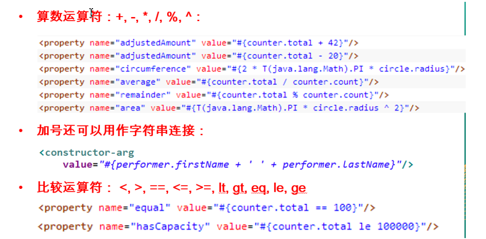

# 1.spring4.0模块


# 2.spring hello world

## 2.1.添加需要的jar包


## 2.2.添加配置文件

> Spring 的配置文件: 一个典型的 Spring 项目需要创建一个或多个 Bean 配置文件, 这些配置文件用于在 Spring IOC 容器里配置 Bean. Bean 的配置文件可以放在 classpath 下, 也可以放在其它目录下

## 2.3.使用idea+maven构建spring工程

1.创建maven工程，配置pom文件

> ```xml
> <dependency>
>       <groupId>org.springframework</groupId>
>       <artifactId>spring-context</artifactId>
>       <version>4.3.23.RELEASE</version>
>     </dependency>
>     <!-- https://mvnrepository.com/artifact/org.springframework/spring-core -->
>     <dependency>
>       <groupId>org.springframework</groupId>
>       <artifactId>spring-core</artifactId>
>       <version>4.3.23.RELEASE</version>
>     </dependency>
>     <!-- https://mvnrepository.com/artifact/org.springframework/spring-beans -->
>     <dependency>
>       <groupId>org.springframework</groupId>
>       <artifactId>spring-beans</artifactId>
>       <version>4.3.23.RELEASE</version>
>     </dependency>
>     <!-- https://mvnrepository.com/artifact/org.springframework/spring-expression -->
>     <dependency>
>       <groupId>org.springframework</groupId>
>       <artifactId>spring-expression</artifactId>
>       <version>4.3.23.RELEASE</version>
>     </dependency>
> ```

2.添加spring配置文件


其中resources是新创建的，为配置文件根目录，需要右键make directory as>sources root将其作为资源目录

```xml
<bean id="student" class="com.sugar.bean.Student">
        <property name="name" value="zhangsan"></property>
</bean>
```

3.编写测试代码

```java
public class App {
    public static void main(String[] args) {
        ApplicationContext applicationContext = new ClassPathXmlApplicationContext("conf/applicationContext.xml");
        Student student = (Student) applicationContext.getBean("student");
        student.hello();
    }
}
```

其中ClassPathXmlApplicationContext用于加载类路径下的配置文件

# 3.spring中bean的配置

## 3.1spring的IOC&DI

> 1.IOC(Inversion of Control)：其思想是反转资源获取的方向. 传统的资源查找方式要求组件向容器发起请求查找资源. 作为回应, 容器适时的返回资源. 而应用了 IOC 之后, 则是容器主动地将资源推送给它所管理的组件, 组件所要做的仅是选择一种合适的方式来接受资源. 这种行为也被称为查找的被动形式
>
> 2.DI(Dependency Injection) — IOC 的另一种表述方式：即组件以一些预先定义好的方式(例如: setter 方法)接受来自如容器的资源注入. 相对于 IOC 而言，这种表述更直接

## 3.2bean的配置方式

> 1.基于xml
>
> 2.基于注解

## 3.3基于xml配置bean

> ```xml
> <bean id="student" class="com.sugar.bean.Student">
>         <property name="name" value="zhangsan"></property>
> </bean>
> ```
>
> 说明：
>
> class:全类名，通过反射的方式在IOC容器中创建对象，所以类需要提供无参的默认构造器
>
> id:标识容器中的bean，id的值必须唯一

## 3.4spring容器

> ```
> 1.在 Spring IOC 容器读取 Bean 配置创建 Bean 实例之前, 必须对它进行实例化. 只有在容器实例化后, 才可以从 IOC 容器里获取 Bean 实例并使用.
> 
> 2.Spring 提供了两种类型的 IOC 容器实现. 
> BeanFactory: IOC 容器的基本实现.
> ApplicationContext: 提供了更多的高级特性. 是 BeanFactory 的子接口.
> BeanFactory 是 Spring 框架的基础设施，面向 Spring 本身；ApplicationContext 面向使用 Spring 框架的开发者，几乎所有的应用场合都直接使用 ApplicationContext 而非底层的 BeanFactory
> 无论使用何种方式, 配置文件时相同的
> 
> ```
>
> ApplicationContext
>
> ```
> 1.ApplicationContext 的主要实现类：
> ClassPathXmlApplicationContext：从 类路径下加载配置文件
> FileSystemXmlApplicationContext: 从文件系统中加载配置文件
> 
> 2.ConfigurableApplicationContext 扩展于 ApplicationContext，新增加两个主要方法：refresh() 和 close()， 让 ApplicationContext 具有启动、刷新和关闭上下文的能力
> 
> 3.ApplicationContext 在初始化上下文时就实例化所有单例的 Bean。
> 
> 4.WebApplicationContext 是专门为 WEB 应用而准备的，它允许从相对于 WEB 根目录的路径中完成初始化工作
> ```
>
> 

## 3.5从容器中获取bean

> 调用 ApplicationContext 的 getBean() 方法
>
> 

其中getBean（String）通过指定bean的id获取bean

getBean(Class<T>)通过指定bean的类型获取bean，若使用这种方式获取bean，该类型的bean在容器中必须唯一，否则会报错

## 3.6依赖注入的方式

> Spring 支持 3 种依赖注入的方式
>
> ```
> 属性注入
> 构造器注入
> 工厂方法注入（很少使用，不推荐）
> ```

### 3.6.1属性注入

> 1.属性注入即通过 setter 方法注入Bean 的属性值或依赖的对象
>
> 2.属性注入使用 <property> 元素, 使用 name 属性指定 Bean 的属性名称，value 属性或 <value> 子节点指定属性值 
>
> 3.属性注入是实际应用中最常用的注入方式
>
> ```xml
> <bean id="student" class="com.sugar.bean.Student">
>         <property name="name" value="zhangsan"></property>
> </bean>
> ```

### 3.6.2构造器注入

> 1.通过构造方法注入Bean 的属性值或依赖的对象，它保证了 Bean 实例在实例化后就可以使用。
>
> 2.构造器注入在 <constructor-arg> 元素里声明属性, <constructor-arg> 中没有 name 属性
>
> ```xml
> <bean id="student2" class="com.sugar.bean.Student">
>         <constructor-arg value="lisi" index="0"/>
>         <constructor-arg value="18" type="int"/>
> </bean>
> ```
>
> index：可以指定参数的位置
>
> type：可以指定参数的类型
>
> 通过index和type可以区分重载的构造器

### 3.6.3属性配置的细节

#### 3.6.3.1字面值

> ```xml
> 1.字面值：可用字符串表示的值，可以通过 <value> 元素标签或 value 属性进行注入。
> <bean id="student2" class="com.sugar.bean.Student">
>         <constructor-arg value="lisi" index="0"/>
>         <constructor-arg type="int">
>             <value>18</value>
>         </constructor-arg>
>     </bean>
> 2.基本数据类型及其封装类、String 等类型都可以采取字面值注入的方式
> 3.若字面值中包含特殊字符，可以使用 <![CDATA[]]> 把字面值包裹起来
>     <constructor-arg index="0">
>             <value><![CDATA[<zhangsan^>]]></value>
>         </constructor-arg>
> ```

#### 3.6.3.2引用其它的bean

> 1.组成应用程序的 Bean 经常需要相互协作以完成应用程序的功能. 要使 Bean 能够相互访问, 就必须在 Bean 配置文件中指定对 Bean 的引用
>
> 2.在 Bean 的配置文件中, 可以通过 <ref> 元素或 ref  属性为 Bean 的属性或构造器参数指定对 Bean 的引用. 
>
> ```xml
> <bean id="course" class="com.sugar.bean.Course"/>
> 
>     <bean id="student2" class="com.sugar.bean.Student">
>         <property name="name" value="zhangsan"/>
>         <property name="course" ref="course"/>
>     </bean>
> ```
>
> 3.也可以在属性或构造器里包含 Bean 的声明, 这样的 Bean 称为内部 Bean,内部 Bean不能被外部引用，只能在内部引用
>
> ```xml
> <bean id="student2" class="com.sugar.bean.Student">
>         <property name="name" value="zhangsan"/>
>         <property name="course">
>             <bean class="com.sugar.bean.Course">
>                 <property name="name" value="shuxue"/>
>             </bean>
>         </property>
>     </bean>
> ```

#### 3.6.3.3注入参数详解：null值和级联属性

> 1.可以使用专用的 <null/> 元素标签为 Bean 的字符串或其它对象类型的属性注入 null 值
>
> ```xml
> <property name="course"><null/></property>
> ```
>
> 2.和 Struts、Hiberante 等框架一样，Spring 支持级联属性的配置
>
> ```xml
> <bean id="student2" class="com.sugar.bean.Student">
>         <constructor-arg value="zhangsan" index="0"/>
>         <constructor-arg value="18" index="1"/>
>         <constructor-arg ref="course"/>
>         <property name="course.name" value="math"/>
>     </bean>
> ```
>
> 为级联属性赋值需要注意：
>
> 1.属性需要先初始化后才可以为级联属性赋值，否则会有异常，和struts2不同
>
> 2.设置级联属性时级联的对象（如上例中的course对象）必须有get方法，上例则必须含有getCourse()方法，并且对应的name属性有set方法

#### 3.6.3.4集合属性

> 1.在 Spring中可以通过一组内置的 xml 标签(例如: <list>, <set> 或 <map>) 来配置集合属性.
>
> 2.配置 java.util.List 类型的属性, 需要指定 <list>  标签, 在标签里包含一些元素. 这些标签可以通过 <value> 指定简单的常量值, 通过 <ref> 指定对其他 Bean 的引用. 通过<bean> 指定内置 Bean 定义. 通过 <null/> 指定空元素. 甚至可以内嵌其他集合.
>
> ```xml
> <property name="course" >
>             <list>
>                 <ref bean="course1"></ref>
>                 <ref bean="course2"></ref>
>             </list>
>         </property>
> ```
>
> 3.数组的定义和 List 一样, 都使用 <list>
>
> 4.配置 java.util.Set 需要使用 <set> 标签, 定义元素的方法与 List 一样
>
> 5.配置map
>
> ```xml
> 1.Java.util.Map 通过 <map> 标签定义, <map> 标签里可以使用多个 <entry> 作为子标签. 每个条目包含一个键和一个值.
> 2.必须在 <key> 标签里定义键
> 3.因为键和值的类型没有限制, 所以可以自由地为它们指定 <value>, <ref>, <bean> 或 <null> 元素. 
> 4.可以将 Map 的键和值作为 <entry> 的属性定义: 简单常量使用 key 和 value 来定义; Bean 引用通过 key-ref 和 value-ref 属性定义
> 
> <property name="course" >
>            <map>
>                <entry key="aaa" value="course1"></entry>
>            </map>
>         </property>
> ```
>
> 6.使用 <props> 定义 java.util.Properties, 该标签使用多个 <prop> 作为子标签. 每个 <prop> 标签必须定义 key 属性
>
> ```xml
> <property name="course" >
>            <props>
>                <prop key="aaa">222</prop>
>                <prop key="bbb">333</prop>
>            </props>
> </property>
> ```
>
> 7.配置独立的集合bean，以便复用，需要导入util的命名空间(导入方法，输入util:list，修复错误即可)
>
> ```xml
> 1.使用基本的集合标签定义集合时, 不能将集合作为独立的 Bean 定义, 导致其他 Bean 无法引用该集合, 所以无法在不同 Bean 之间共享集合.
> 2.可以使用 util schema 里的集合标签定义独立的集合 Bean. 需要注意的是, 必须在 <beans> 根元素里添加 util schema 定义
> 
> <util:list>
>         <value>aaa</value>
>         <value>bbb</value>
>  </util:list>
> ```

#### 3.6.3.5使用p命名空间

> 1.为了简化 XML 文件的配置，越来越多的 XML 文件采用属性而非子元素配置信息。
> 2.Spring 从 2.5 版本开始引入了一个新的 p 命名空间，可以通过 <bean> 元素属性的方式配置 Bean 的属性。
> 3.使用 p 命名空间后，基于 XML 的配置方式将进一步简化
>
> ```xml
> <bean id="student2" class="com.sugar.bean.Student" p:name="zhansan" p:age="19"></bean>
> ```

### 3.6.4自动装配

> 1.Spring IOC 容器可以自动装配 Bean. 需要做的仅仅是在 <bean> 的 autowire 属性里指定自动装配的模式
>
> ```xml
> <bean id="course" class="com.sugar.bean.Course"/>
>     <bean id="student2" class="com.sugar.bean.Student" p:name="zhansan" p:age="19" autowire="byName"></bean>
> ```
>
> 2.byType(根据类型自动装配): 若 IOC 容器中有多个与目标 Bean 类型一致的 Bean. 在这种情况下, Spring 将无法判定哪个 Bean 最合适该属性, 所以不能执行自动装配.
>
> 3.byName(根据名称自动装配): 必须将目标 Bean 的名称和属性名设置的完全相同.
>
> 4.constructor(通过构造器自动装配): 当 Bean 中存在多个构造器时, 此种自动装配方式将会很复杂. 不推荐使用
>
> 5.缺点
>
> ```
> 1.在 Bean 配置文件里设置 autowire 属性进行自动装配将会装配 Bean 的所有属性. 然而, 若只希望装配个别属性时, autowire 属性就不够灵活了. 
> 2.autowire 属性要么根据类型自动装配, 要么根据名称自动装配, 不能两者兼而有之.
> 3.一般情况下，在实际的项目中很少使用自动装配功能，因为和自动装配功能所带来的好处比起来，明确清晰的配置文档更有说服力一些
> ```

### 3.6.5 配置bean之间的关系

#### 1.继承bean配置

> 1.Spring 允许继承 bean 的配置, 被继承的 bean 称为父 bean. 继承这个父 Bean 的 Bean 称为子 Bean
>
> ```xml
> <bean id="student" class="com.sugar.bean.Student" p:name="zhansan" p:age="19"/>
> <bean id="student2" parent="student"/>
> ```
>
> 2.子 Bean 从父 Bean 中继承配置, 包括 Bean 的属性配置
>
> 3.子 Bean 也可以覆盖从父 Bean 继承过来的配置
>
> 4.父 Bean 可以作为配置模板, 也可以作为 Bean 实例. 若只想把父 Bean 作为模板, 可以设置 <bean> 的abstract 属性为 true, 这样 Spring 将不会实例化这个 Bean
>
> ```xml
> <bean id="student" class="com.sugar.bean.Student" p:name="zhansan" p:age="19" abstract="true"/>
> ```
>
> 5.并不是 <bean> 元素里的所有属性都会被继承. 比如: autowire, abstract 等.
>
> 6.也可以忽略父 Bean 的 class 属性, 让子 Bean 指定自己的类, 而共享相同的属性配置. 但此时 abstract 必须设为 true

#### 2.依赖 Bean 配置

> 1.Spring 允许用户通过 depends-on 属性设定 Bean 前置依赖的Bean，前置依赖的 Bean 会在本 Bean 实例化之前创建好,若没有依赖的bean，会出现问题
>
> ```xml
>     <bean id="student" class="com.sugar.bean.Student" p:name="zhansan" p:age="19" depends-on="course"/>
> ```
>
> 2.如果前置依赖于多个 Bean，则可以通过逗号，空格或的方式配置 Bean 的名称

### 3.6.6 bean的作用域

> 1.在 Spring 中, 可以在 <bean> 元素的 scope 属性里设置 Bean 的作用域. 
>
> 2.默认情况下, Spring 只为每个在 IOC 容器里声明的 Bean 创建唯一一个实例, 整个 IOC 容器范围内都能共享该实例：所有后续的 getBean() 调用和 Bean 引用都将返回这个唯一的 Bean 实例.该作用域被称为 singleton, 它是所有 Bean 的默认作用域
>
> 

### 3.6.7 使用外部属性文件

> 1.在配置文件里配置 Bean 时, 有时需要在 Bean 的配置里混入系统部署的细节信息(例如: 文件路径, 数据源配置信息等). 而这些部署细节实际上需要和 Bean 配置相分离
>
> 2.Spring 提供了一个 PropertyPlaceholderConfigurer 的 BeanFactory 后置处理器, 这个处理器允许用户将 Bean 配置的部分内容外移到属性文件中. 可以在 Bean 配置文件里使用形式为 ${var} 的变量, PropertyPlaceholderConfigurer 从属性文件里加载属性, 并使用这些属性来替换变量.
>
> ```xml
>  <context:property-placeholder location="classpath:db.properties"/>
> 
>     <bean id="datasource" class="com.mchange.v2.c3p0.ComboPooledDataSource">
>         <property name="user" value="${user}"/>
>         <property name="password" value="${password}"/>
>         <property name="driverClass" value="${driverClass}"/>
>         <property name="jdbcUrl" value="${jdbcUrl}"/>
>     </bean>
> ```
>
> 3.Spring 还允许在属性文件中使用 ${propName}，以实现属性之间的相互引用

### 3.6.8 SPEL

> 1.Spring 表达式语言（简称SpEL）：是一个支持运行时查询和操作对象图的强大的表达式语言。
>
> 2.语法类似于 EL：SpEL 使用 #{…} 作为定界符，所有在大框号中的字符都将被认为是 SpEL
>
> 3.SpEL 为 bean 的属性进行动态赋值提供了便利
>
> 4.通过 SpEL 可以实现：
>
> ```
> 1.通过 bean 的 id 对 bean 进行引用
> 2.调用方法以及引用对象中的属性
> 3.计算表达式的值
> 4.正则表达式的匹配
> ```

#### 1. SpEL：字面量

```xml
字面量的表示：
整数：<property name="count" value="#{5}"/>
小数：<property name="frequency" value="#{89.7}"/>
科学计数法：<property name="capacity" value="#{1e4}"/>
String可以使用单引号或者双引号作为字符串的定界符号：<property name=“name” value="#{'Chuck'}"/> 或 <property name='name' value='#{"Chuck"}'/>
Boolean：<property name="enabled" value="#{false}"/>
```

#### 2. 引用 Bean、属性和方法


#### 3. SpEL支持的运算符号




### 3.6.9bean的生命周期

> 1.Spring IOC 容器可以管理Bean 的生命周期, Spring 允许在Bean 生命周期的特定点执行定制的任务.
> 2.Spring IOC 容器对Bean 的生命周期进行管理的过程:
>
> ```
> –通过构造器或工厂方法创建Bean 实例
> –为Bean 的属性设置值和对其他Bean 的引用
> –调用Bean 的初始化方法
> –Bean 可以使用了
> –当容器关闭时, 调用Bean 的销毁方法
> ```
>
> 3.在Bean 的声明里设置init-method 和destroy-method 属性, 为Bean 指定初始化和销毁方法.

#### Bean 后置处理器

> 1.Bean 后置处理器允许在调用初始化方法前后对Bean 进行额外的处理.
>
> 2.Bean 后置处理器对IOC 容器里的所有Bean 实例逐一处理, 而非单一实例. 其典型应用是: 检查Bean 属性的正确性或根据特定的标准更改Bean 的属性
>
> 3.对Bean 后置处理器而言, 需要实现接口BeanPostProcessor. 在初始化方法被调用前后, Spring 将把每个Bean 实例分别传递给上述接口的以下两个方法
>
> ```java
> @Override
>     public Object postProcessBeforeInitialization(Object o, String s) throws BeansException {
>         return null;
>     }
> 
>     @Override
>     public Object postProcessAfterInitialization(Object o, String s) throws BeansException {
>         return null;
>     }
> ```
>
> 注意：
>
> 1.参数o代表当前的实例，s代表该实例在spring中配置的名称，
>
> 2.返回值：可以是传入的o，可以修改其属性，甚至可以创建一个新的对象返回
>
> 3.需要在spring里进行配置，只需要配置class即可

### 配置bean

#### 通过静态工厂方法创建Bean

```java
public class MyStaticFactory {
    private static Map<String, Student> map = new HashMap<>();

    static {
        map.put("zhangsan", new Student("zhangsan", 19));
        map.put("lisi", new Student("lisi", 18));
    }

    public static Student getStudent(String name) {
        return map.get(name);
    }
}
```

配置

```xml
<bean class="com.sugar.bean.MyStaticFactory" factory-method="getStudent">
        <constructor-arg value="zhangsan"/>
</bean>
```

#### 通过实例工厂方法创建Bean

```java
public class MyInstanceFactory {
    private Map<String, Student> map = new HashMap<>();

    public MyInstanceFactory() {
        map.put("zhangsan", new Student("zhangsan", 19));
        map.put("lisi", new Student("lisi", 18));
    }

    public Student getStudent(String name) {
        return map.get(name);
    }
}
```

配置

```xml
<bean id="myInstanceFactory" class="com.sugar.bean.MyInstanceFactory"/>

<bean factory-bean="myInstanceFactory" factory-method="getStudent">
        <constructor-arg value="zhangsan"/>
xml</bean>
```

#### 通过FactoryBean配置bean

需要实现FactoryBean接口

```java
public class MyFactoryBean implements FactoryBean<Student> {
    @Override
    public Student getObject() throws Exception {
        return new Student("zs", 19);
    }

    @Override
    public Class<?> getObjectType() {
        return Student.class;
    }

    @Override
    public boolean isSingleton() {
        return true;
    }
}
```

配置

```xml
<bean id="student" class="com.sugar.bean.MyFactoryBean"/>
```

注意：虽然配置的是MyFactoryBean，但是实际返回的类型为Student

#### 通过注解配置bean

1.在classpath中扫描组件

> 1.组件扫描(component scanning): Spring 能够从classpath下自动扫描, 侦测和实例化具有特定注解的组件.
>
> 2.特定组件包括:
> –@Component: 基本注解, 标识了一个受Spring 管理的组件
> –@Respository: 标识持久层组件
> –@Service: 标识服务层(业务层)组件
> –@Controller: 标识表现层组件
>
> 3.对于扫描到的组件, Spring 有默认的命名策略: 使用非限定类名, 第一个字母小写. 也可以在注解中通过value 属性值标识组件的名称
>
> 4.当在组件类上使用了特定的注解之后, 还需要在Spring 的配置文件中声明<context:component-scan>：
> –base-package 属性指定一个需要扫描的基类包，Spring 容器将会扫描这个基类包里及其子包中的所有类.
> –当需要扫描多个包时, 可以使用逗号分隔.
> –如果仅希望扫描特定的类而非基包下的所有类，可使用resource-pattern 属性过滤特定的类，示例：
>
> ```xml
> <!--要使include-filter生效，必须配置use-default-filters="false"-->
> <context:component-scan base-package="com.sugar" resource-pattern="com/*.class" use-default-filters="false">
>         <context:exclude-filter type="annotation" expression="org.springframework.stereotype.Controller"/>
>         <context:include-filter type="annotation" expression="org.springframework.stereotype.Service"/>
>     </context:component-scan>
> ```
>
> –<context:include-filter> 子节点表示要包含的目标类
> –<context:exclude-filter> 子节点表示要排除在外的目标类
> –<context:component-scan> 下可以拥有若干个<context:include-filter> 和<context:exclude-filter> 子节点
>
> 5.<context:include-filter> 和<context:exclude-filter> 子节点支持多种类型的过滤表达式
>
> 

### 组件装配

> 1.<context:component-scan> 元素还会自动注册AutowiredAnnotationBeanPostProcessor实例, 该实例可以自动装配具有@Autowired和@Resource 、@Inject注解的属性.
>
> 2.@Autowired：自动装配具有兼容类型的单个Bean属性
>
> ```
> 1.构造器, 普通字段(即使是非public), 一切具有参数的方法都可以应用@Authwired注解
> 
> 2.默认情况下, 所有使用@Authwired注解的属性都需要被设置. 当Spring 找不到匹配的Bean 装配属性时, 会抛出异常, 若某一属性允许不被设置, 可以设置@Authwired注解的required 属性为false
> 
> 3.默认情况下, 当IOC 容器里存在多个类型兼容的Bean 时, 通过类型的自动装配将无法工作. 此时可以在
> @Qualifier 注解里提供Bean 的名称. Spring 允许对方法的入参标注@Qualifiter已指定注入Bean 的名称
> 
> 4.@Authwired注解也可以应用在数组类型的属性上, 此时Spring 将会把所有匹配的Bean 进行自动装配.
> 
> 5.@Authwired注解也可以应用在集合属性上, 此时Spring 读取该集合的类型信息, 然后自动装配所有与之兼容的Bean.
> 
> 6.@Authwired注解用在java.util.Map上时, 若该Map 的键值为String, 那么Spring 将自动装配与之Map 值类型兼容的Bean, 此时Bean 的名称作为键值
> ```
>
> 3.@Resource 或@Inject
>
> ```
> 1.Spring 还支持@Resource 和@Inject 注解，这两个注解和@Autowired注解的功用类似
> 
> 2.@Resource 注解要求提供一个Bean 名称的属性，若该属性为空，则自动采用标注处的变量或方法名作为Bean 的名称
> 
> 3.@Inject 和@Autowired注解一样也是按类型匹配注入的Bean，但没有reqired属性
> 
> 4.建议使用@Autowired注解
> ```

### 泛型依赖注入

> Spring 4.x 中可以为子类注入子类对应的泛型类型的成员变量的引用
>
> 

即父类间定义依赖关系，子类继承后，spring会注入对应的泛型类型的引用

> 一、为了更加快捷的开发，为了更少的配置，特别是针对 Web 环境的开发，从 Spring 4.0 之后，Spring 引入了 泛型依赖注入。
>
> 二、泛型依赖注入：子类之间的依赖关系由其父类泛型以及父类之间的依赖关系来确定，**父类的泛型必须为同一类型**。
>
> 通俗一点来说：两个子类之间的依赖关系不需要在子类中去声明，而是在父类中进行了声明，而依赖的纽带就是 泛型类型，必须是相同的父类泛型类型才具有依赖关系。

说明：在 BaseService 中通过 @Autowired 注解自动装配了 BaseDao 的实例。而在 UserService 中并没有注入 UserDao 的实例，但是通过父类的泛型类型，在 UserService 中已经注入了 UserDao 的实例

### 整合多个配置文件

> 1.Spring 允许通过<import> 将多个配置文件引入到一个文件中，进行配置文件的集成。这样在启动Spring 容器时，仅需要指定这个合并好的配置文件就可以。
>
> 2.import 元素的resource 属性支持Spring 的标准的路径资源
>
> 

## AOP

### jdk动态代理

```java
public class MyProxy {
    //需要代理的对象
    private Play play;

    public MyProxy(Play play) {
        this.play = play;
    }


    public Play proxy() {
        Class<? extends Play> playClass = play.getClass();
        ClassLoader loader = playClass.getClassLoader();
        Class<?>[] interfaces = playClass.getInterfaces();
        //proxy是正在被代理的对象，若在该方法中使用该对象的方法，会产生无限循环直到内存溢出，因为调用该对象的方法，就会触发InvocationHandler的invoke方法，则造成无限循环，所有使用传入的参数作为回调的duil
        //method是正在被调用的方法
        //args是方法的参数
        InvocationHandler invocationHandler = (proxy, method, args) -> {
            System.out.println("---start---");
            method.invoke(play, args);
            System.out.println("---end---");
            return "";
        };
        Object o = Proxy.newProxyInstance(loader, interfaces, invocationHandler);
        return (Play) o;
    }
}
```

### AOP简介

> 1.AOP(Aspect-Oriented Programming, 面向切面编程): 是一种新的方法论, 是对传统OOP(Object-Oriented Programming, 面向对象编程) 的补充.
>
> 2.AOP 的主要编程对象是切面(aspect), 而切面模块化横切关注点.
>
> 3.在应用AOP 编程时, 仍然需要定义公共功能, 但可以明确的定义这个功能在哪里, 以什么方式应用, 并且不必修改受影响的类. 这样一来横切关注点就被模块化到特殊的对象(切面)里.
>
> 4.AOP 的好处:
> –每个事物逻辑位于一个位置, 代码不分散, 便于维护和升级
> –业务模块更简洁, 只包含核心业务代码.

### AOP术语

> 1. 切面(Aspect): 横切关注点(跨越应用程序多个模块的功能)被模块化的特殊对
>    象
>
> 2. 通知(Advice): 即切面里的方法，切面必须要完成的工作
> 3. 目标(Target): 被通知的对象
> 4. 代理(Proxy): 代理对象，向目标对象应用通知之后创建的对象
> 5. 连接点（Joinpoint）：程序执行的某个特定位置：如类某个方法调用前、调
>    用后、方法抛出异常后等。连接点由两个信息确定：方法表示的程序执行点；
>    相对点表示的方位。例如ArithmethicCalculator#add() 方法执行前的连接点，
>    执行点为ArithmethicCalculator#add()； 方位为该方法执行前的位置
> 6. 切点（pointcut）：即匹配模式，每个类都拥有多个连接点：例如ArithmethicCalculator
>    的所有方法实际上都是连接点，即连接点是程序类中客观存在的事务。AOP
>    通过切点定位到特定的连接点。类比：连接点相当于数据库中的记录，切点
>    相当于查询条件。切点和连接点不是一对一的关系，一个切点匹配多个连接
>    点，切点通过org.springframework.aop.Pointcut 接口进行描述，它使用类
>    和方法作为连接点的查询条件

### 使用AspectJ

#### **在Spring 中启用AspectJ注解支持**

> 1. AspectJ：Java 社区里最完整最流行的AOP 框架.
>
> 2. 在Spring2.0 以上版本中, 可以使用基于AspectJ注解或基于XML 配置的AOP
>
> 3. 要在Spring 应用中使用AspectJ注解, 必须在classpath下包含AspectJ类库: aopalliance.jar、aspectj.weaver.jar 和spring-aspects.jar
>
> 4. 将aopSchema 添加到<beans> 根元素中.
>
> 5. 要在Spring IOC 容器中启用AspectJ注解支持, 只要在Bean 配置文件中定义一个空的XML 元素<aop:aspectj-autoproxy>
>
> ```xml
> <aop:aspectj-autoproxy/>
> ```
>
> 该配置是aspectj的注解生效，在匹配到通知时，自动生成代理对象
>
> 5. 当Spring IOC 容器侦测到Bean 配置文件中的<aop:aspectj-autoproxy> 元素时, 会自动为与AspectJ切面匹配的Bean 创建代理.
>
> ```java
> @Component
> @Aspect
> public class MyAspect {
>     @Before("execution(void com.sugar.aop.PlayImpl.hello())")
>     //JoinPoint可以获取到方法相关信息
>     public void beforeMethod(JoinPoint joinPoint) {
>         String name = joinPoint.getSignature().getName();
>         Object[] args = joinPoint.getArgs();
>         System.out.println("----before----");
>     }
> }
> ```

#### 用AspectJ注解声明切面

> 1. 要在Spring 中声明AspectJ切面, 只需要在IOC 容器中将切面声明为Bean 实例. 当在Spring IOC 容器中初始化AspectJ切面之后, Spring IOC 容器就会为那些与AspectJ切面相匹配的Bean 创建代理.
> 2. 在AspectJ注解中, 切面只是一个带有@Aspect 注解的Java 类.
> 3. 通知是标注有某种注解的简单的Java 方法.
> 4. AspectJ支持5 种类型的通知注解:
>    –@Before: 前置通知, 在方法执行之前执行
>    –@After: 后置通知, 在方法执行之后执行
>    –@AfterRunning: 返回通知, 在方法返回结果之后执行
>    –@AfterThrowing: 异常通知, 在方法抛出异常之后
>    –@Around: 环绕通知, 围绕着方法执行

#### AspectJ切入点表达式

> 最典型的切入点表达式时根据方法的签名来匹配各种方法:
>
> 1. –execution * *com.atguigu.spring.ArithmeticCalculator.*(..): 匹配ArithmeticCalculator中声明的所有方法,第一个* 代表任意修饰符及任意返回值. 第二个* 代表任意方法. ..匹配任意数量的参数. 若目标类与接口与该切面在同一个包中, 可以省略包名.
> 2. –execution public* ArithmeticCalculator.*(..): 匹配ArithmeticCalculator接口的所有公有方法.*
> 3. *–execution publicdouble ArithmeticCalculator.*(..): 匹配ArithmeticCalculator中返回double 类型数值的方法
> 4. –execution publicdouble ArithmeticCalculator.*(double, ..): 匹配第一个参数为double 类型的方法, .. 匹配任意数量任意类型的参数*
> 5. *–execution publicdouble ArithmeticCalculator.*(double, double): 匹配参数类型为double, double 类型的方法

#### 合并切入点表达式

> 在AspectJ中, 切入点表达式可以通过操作符&&, ||, ! 结合起来.


#### AspectJ中通知与动态代理的对应关系

> ```java
> 		try {
>                 //前置通知
>                 Object o = method.invoke(play, args);
>                 //返回后通知，可以访问方法返回值
>             } catch (Exception e) {
>                 e.printStackTrace();
>                 //异常通知，可以访问异常对象
>             }
>             //后置通知,无论方法返回还是抛出异常都会执行
> ```

#### 在返回通知中访问连接点的返回值

> 1. 在返回通知中, 只要将returning属性添加到@AfterReturning注解中, 就可以访问连接点的返回值. 该属性的值即为用来传入返回值的参数名称.
>
> 2. 必须在通知方法的签名中添加一个同名参数. 在运行时, Spring AOP 会通过这个参数传递返回值.
>
> 3. 原始的切点表达式需要出现在pointcut属性中
>
>    ```java
>    @AfterReturning(value = "execution(void com.sugar.aop.PlayImpl.hello())",returning = "result")
>        public void beforeMethod(JoinPoint joinPoint,Object result) {
>            String name = joinPoint.getSignature().getName();
>            Object[] args = joinPoint.getArgs();
>            System.out.println("----before----");
>        }
>    ```

#### 异常通知

> 1. 只在连接点抛出异常时才执行异常通知
>
> 2. 将throwing 属性添加到@AfterThrowing注解中, 也可以访问连接点抛出的异常. Throwable是所有错误
>
> 3. 和异常类的超类. 所以在异常通知方法可以捕获到任何错误和异常.
>
> 4. 如果只对某种特殊的异常类型感兴趣, 可以将参数声明为其他异常的参数类型. 然后通知就只在抛出这个类型及其子类的异常时才被执行
>
>    ```java
>    @AfterThrowing(value = "execution(void com.sugar.aop.PlayImpl.hello())",throwing = "ex")
>        public void beforeMethod(JoinPoint joinPoint,Exception ex) {
>            String name = joinPoint.getSignature().getName();
>            Object[] args = joinPoint.getArgs();
>            System.out.println("----before----");
>        }
>    ```

#### 环绕通知

环绕通知就相当于动态代理的invoke方法

> 1. 环绕通知是所有通知类型中功能最为强大的, 能够全面地控制连接点. 甚至可以控制是否执行连接点.
> 2. 对于环绕通知来说, 连接点的参数类型必须是ProceedingJoinPoint. 它是JoinPoint的子接口, 允许控制何时执行, 是否执行连接点.
> 3. 在环绕通知中需要明确调用ProceedingJoinPoint的proceed() 方法来执行被代理的方法. 如果忘记这样做就会导致通知被执行了, 但目标方法没有被执行.
> 4. 注意: 环绕通知的方法需要返回目标方法执行之后的结果, 即调用joinPoint.proceed(); 的返回值, 否则会出现空指针异常

#### 切面的优先级

> 1. 使用@Order注解指定切面的优先级，值越小，优先级越高，如@Order(1)

#### 重用切点表达式

> ```java
> @Component
> @Aspect
> public class MyAspect {
>     @Pointcut("execution(void com.sugar.aop.PlayImpl.hello())")
>     public void declarePointcut() {
> 
>     }
> 
>     @Before(value = "declarePointcut()")
>     public void beforeMethod(JoinPoint joinPoint) {
>         String name = joinPoint.getSignature().getName();
>         Object[] args = joinPoint.getArgs();
>         System.out.println("----before----");
>     }
> }
> ```
>
> 其它切面也可以使用该表达式，使用全类名.方法（）的形式即可

#### 基于配置文件配置AOP

> ```xml
> <bean id="myAspect" class="com.sugar.aop.MyAspect"/>
> 
>     <aop:config>
>         <!--配置切点表达式-->
>         <aop:pointcut id="pointcut" expression="execution(void com.sugar.aop.PlayImpl.hello())"/>
>         <!--配置切面-->
>         <aop:aspect ref="myAspect" order="1">
>             <!--配置通知-->
>             <aop:before method="beforeMethod" pointcut-ref="pointcut"/>
>         </aop:aspect>
>     </aop:config>
> ```

# spring对jdbc的支持

## JdbcTemplate

### JdbcTemplate方法分类

> - execute方法：可以用于执行任何SQL语句，一般用于执行DDL（数据定义语言）语句；
> - update方法及batchUpdate方法：update方法用于执行新增、修改、删除等语句；batchUpdate方法用于执行批处理相关语句；
> - query方法及queryForXXX方法：用于执行查询相关语句；
> - call方法：用于执行存储过程、函数相关语句

### JdbcTemplate配置

> ```xml
> <context:property-placeholder location="classpath:db.properties"/>
> 
>     <bean id="dataSource" class="com.mchange.v2.c3p0.ComboPooledDataSource">
>         <property name="user" value="${user}"/>
>         <property name="password" value="${password}"/>
>         <property name="driverClass" value="${driverClass}"/>
>         <property name="jdbcUrl" value="${jdbcUrl}"/>
>     </bean>
> 
>     <bean id="jdbcTemplate" class="org.springframework.jdbc.core.JdbcTemplate">
>         <property name="dataSource" ref="dataSource"/>
>     </bean>
> ```

### update方法

> 可用于插入，更新，删除
>
> ```java
> JdbcTemplate jdbcTemplate = (JdbcTemplate)applicationContext.getBean("jdbcTemplate");
> 
> String sql = "UPDATE STUDENT SET NAME = ?";
> jdbcTemplate.update(sql, "zhangsan");
> ```

### batchUpdate方法

> ```java
> String sql2 = "INSERT INTO STUDENT(STUNAME,AGE) VALUES (?,?)";
>         List<Object[]> argsList = new ArrayList<>();
>         argsList.add(new Object[]{"zhangsan", "19"});
>         argsList.add(new Object[]{"lisi", "18"});
>         argsList.add(new Object[]{"wangwu", "20"});
>         jdbcTemplate.batchUpdate(sql2, argsList);
> ```

### 将查询结果封装为对象

> 注意：
>
> 1. 使用BeanProperytRowMapper要求sql数据查询出来的列和实体属性需要一一对应。如果数据中列明和属性名不一致，在sql语句中需要用as重新取一个别名
> 2. 使用JdbcTemplate对象不能获取关联对象，即不支持级联属性的封装，如对象中的另一个对象的属性

> ```java
> //也可指定自定义的RowMapper封装想要的结果
> PlayImpl play = jdbcTemplate.queryForObject(sql, new BeanPropertyRowMapper<>(PlayImpl.class));
> ```

### 查询对象的集合

> ```java
> List<PlayImpl> query = jdbcTemplate.query(sql, new BeanPropertyRowMapper<>(PlayImpl.class));
> ```

### 统计单个值的数量

> **获取某个记录某列或者count、avg、sum等函数返回唯一值**

> ```java
> String sql3 = "SELECT COUNT(ID) FROM STUDENT";
>         Integer count = jdbcTemplate.queryForObject(sql3, Integer.class);
> ```
>
> 注意：查询出的结果必须只含有一个字段，该字段的值会被queryForObject的第二个参数指定类型，从而进行类型转换

## NamedParameterJdbcTemplate

使用具名参数的模板类

> 1. 在SQL 语句中使用具名参数时, 可以在一个Map 中提供参数值, 参数名为键
> 2. 也可以使用SqlParameterSource参数
> 3. 批量更新时可以提供Map 或SqlParameterSource的数组

方式一：具名参数和map的key对应

```java
        NamedParameterJdbcTemplate template = 								applicationContext.getBean(NamedParameterJdbcTemplate.class);
        String sql4 = "INSERT INTO STU(NAME,AGE) VALUES(:name,:age)";
        Map<String,Object> paramap = new HashMap<>();
        paramap.put("name","zhangsan");
        paramap.put("age",18);
        template.update(sql4,paramap);
```

方式二：具名参数和bean的属性对应

```java
        NamedParameterJdbcTemplate template = applicationContext.getBean(NamedParameterJdbcTemplate.class);
        String sql4 = "INSERT INTO STU(NAME,AGE) VALUES(:name,:age)";
        SqlParameterSource source = new BeanPropertySqlParameterSource(student);
        template.update(sql4, source);
```

# spring事务

## 事务简介

> 1. 事务管理是企业级应用程序开发中必不可少的技术, 用来确保数据的完整性和一致性.
> 2. 事务就是一系列的动作, 它们被当做一个单独的工作单元. 这些动作要么全部完成, 要么全部不起作用
> 3. 事务的四个关键属性(ACID)
>    –原子性(atomicity): 事务是一个原子操作, 由一系列动作组成. 事务的原子性确保动作要么全部完成要么完全不起作用.
>    –一致性(consistency): 一旦所有事务动作完成, 事务就被提交. 数据和资源就处于一种满足业务规则的一致性状态中.
>    –隔离性(isolation): 可能有许多事务会同时处理相同的数据, 因此每个事务都应该与其他事务隔离开来, 防止数据损坏.
>    –持久性(durability): 一旦事务完成, 无论发生什么系统错误, 它的结果都不应该受到影响. 通常情况下, 事务的结果被写到持久化存储器中.

## spring中事务管理器的不同实现

> 1. DataSourceTransactionManager：在应用程序中只需要处理一个数据源, 而且通过JDBC 存取
>
> 2. JtaTransactionManager：在JavaEE应用服务器上用JTA(Java Transaction API) 进行事务管理
>
> 3. HibernateTransactionManager：用Hibernate 框架存取数据库
>
> 4. 事务管理器以普通的Bean 形式声明在Spring IOC 容器中
>
> 5. 其它的事务管理器
>
>    

## 声明式事务

> 1. 配置
>
> ```xml
> <!--配置事务管理器，下面的是jdbc的事务管理器，对于不同的框架，spring有不同的事务处理器-->
>     <bean id="tx" class="org.springframework.jdbc.datasource.DataSourceTransactionManager">
>         <property name="dataSource" ref="dataSource"/>
>     </bean>
> 
>     <!--启用事务注解-->
>     <tx:annotation-driven transaction-manager="tx"/>
> ```
>
> 2. 在需要使用事务的方法上使用@Transactional进行声明
>
> 3. 声明式事务的特点
>
>    ```
>    1、Spring 的声明式事务管理在底层是建立在 AOP 的基础上。其本质是在方法前后进行拦截，然后在目标方法开始之前创建一个事务，在执行这目标方法结束后，根据执行情况提交或进行回滚事务。
>    
>    2、声明式事务最大的优点就是不需通过编程的方式而进行管理事务，这样就不需要在业务逻辑代码中掺杂事务管理的代码，只需在配置文件中做相关的事务规则声明，便可将事务规则应用到业务逻辑中。
>    
>    3、声明式事务不足的地方在于，与编程式事务相比，只能作用到方法级别，无法像编程式事务那样可以作用到代码块级别
>    ```
>
>    

## 基于xml用事务通知声明式地管理事务

> 1. 配置事务管理器
> 2. 配置事务属性
> 3. 配置事务切入点，将事务切入点和事务属性关联起来


## 事务传播属性

> 1. 当事务方法被另一个事务方法调用时, 必须指定事务应该如何传播. 例如: 方法可能继续在现有事务中运行, 也可能开启一个新事务, 并在自己的事务中运行.
>
> 2. 事务的传播行为可以由传播属性指定. Spring 定义了7 种类传播行为.
>
>    

> 3. REQUIRED 传播行为
>
>    ```
>    1.当bookService的purchase() 方法被另一个事务方法checkout() 调用时, 它默认会在现有的事务内运行. 这个默认的传播行为就是REQUIRED. 因此在checkout() 方法的开始和终止边界内只有一个事务. 这个事务只在checkout() 方法结束的时候被提交, 结果用户一本书都买不了
>    2.事务传播属性可以在@Transactional 注解的propagation 属性中定义
>    ```
>
>    

> 4. REQUIRES_NEW 传播行为 
>
>    ```
>    另一种常见的传播行为是REQUIRES_NEW. 它表示该方法必须启动一个新事务, 并在自己的事务内运行. 如果有事务在运行, 就应该先挂起它
>    ```
>
>    

## 在Spring 2.x 事务通知中配置传播属性

```xml
<tx:advice transaction-manager="tx" id="txAdvice">
        <tx:attributes>
            <tx:method name="purchase" propagation="REQUIRES_NEW"/>
        </tx:attributes>
    </tx:advice>
```

## 并发事务所导致的问题

> 1. 当同一个应用程序或者不同应用程序中的多个事务在同一个数据集上并发执行时, 可能会出现许多意外的问题
> 2. 并发事务所导致的问题可以分为下面三种类型:
>    –脏读: 对于两个事物T1, T2, T1 读取了已经被T2 更新但还没有被提交的字段. 之后, 若T2 回滚, T1读取的内容就是临时且无效的.
>    –不可重复读:对于两个事物T1, T2, T1 读取了一个字段, 然后T2 更新了该字段. 之后, T1再次读取同一个字段, 值就不同了.
>    –幻读:对于两个事物T1, T2, T1 从一个表中读取了一个字段, 然后T2 在该表中插入了一些新的行. 之后, 如果T1 再次读取同一个表, 就会多出几行

## 事务的隔离级别

> 1. 从理论上来说, 事务应该彼此完全隔离, 以避免并发事务所导致的问题. 然而, 那样会对性能产生极大的影响, 因为事务必须按顺序运行.
>
> 2. 在实际开发中, 为了提升性能, 事务会以较低的隔离级别运行.
>
> 3. 事务的隔离级别可以通过隔离事务属性指定
>
> 4. Spring 支持的事务隔离级别
>
>    
>
>    ```
>    1.事务的隔离级别要得到底层数据库引擎的支持, 而不是应用程序或者框架的支持.
>    2.Oracle 支持的2 种事务隔离级别：READ_COMMITED , SERIALIZABLE
>    3.Mysql 支持4 中事务隔离级别.
>    ```

## @Transactional注解属性

> 1. propagation：指定事务的传播行为，默认为REQUIRED
> 2. isolation：指定事务的隔离级别：默认为DEFAULT，一般使用READ_COMMITTED
> 3. readOnly：设置事务是否只有只读操作，默认为false，设置为true则可以帮助数据库引擎优化事务
> 4. timeout：事务超时的时间（以秒为单位），事务执行超时会强制回滚
> 5. rollbackFor: 将被触发进行回滚的 `Exception(s)`；以逗号分开
> 6. noRollbackFor: 一组异常类，遇到时必须不回滚

## 设置回滚事务属性

> 1. 默认情况下只有未检查异常(RuntimeException和Error类型的异常)会导致事务回滚. 而受检查异常不会.
> 2. 事务的回滚规则可以通过@Transactional 注解的rollbackFor和noRollbackFor属性来定义. 这两个属性被声明为Class[] 类型的, 因此可以为这两个属性指定多个异常类