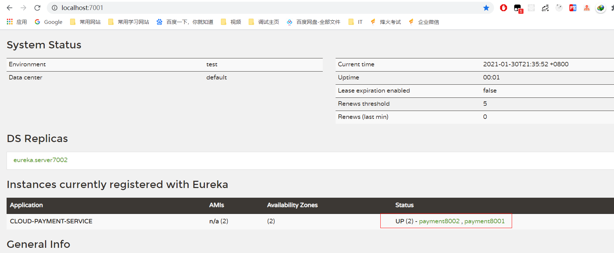
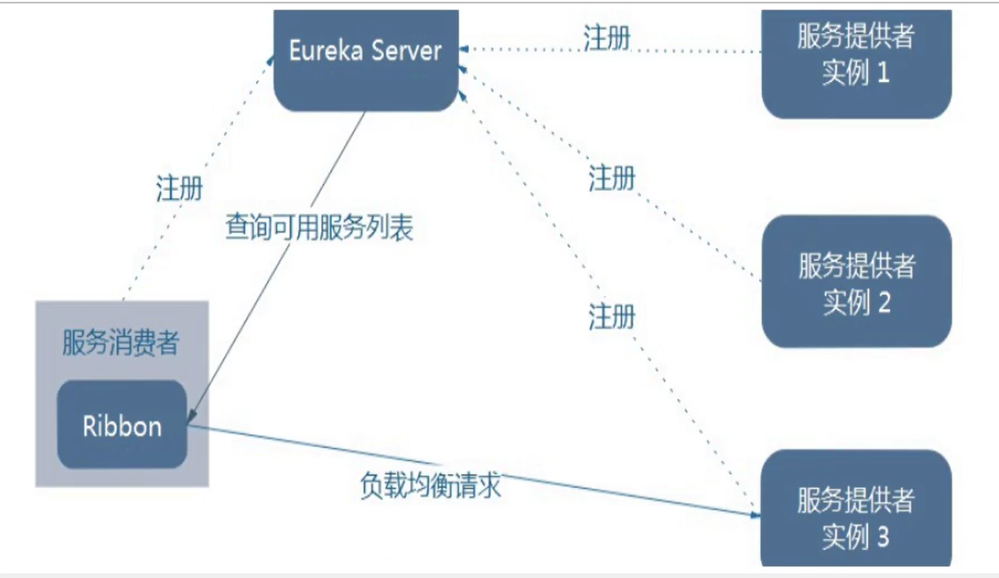
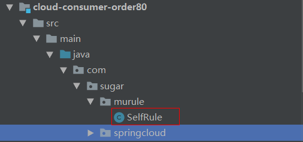
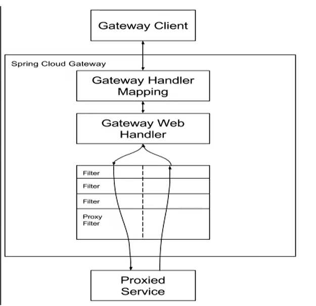
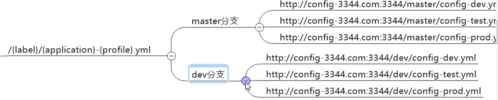
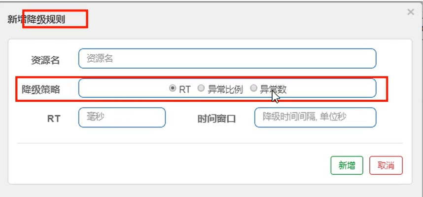

## 说明

## 目录

## 面试题

### springcloud与dubbo的区别

1. springcloud服务之间通过restful API进行通信，dubbo服务之间通过rpc进行通信

## 微服务概述

### 微服务是什么

> 微服务化的核心就是将传统的一站式应用，根据业务拆分成一个一个的服务，彻底
> 地去耦合,每一个微服务提供单个业务功能的服务，一个服务做一件事，
> 从技术角度看就是一种小而独立的处理过程，类似进程概念，能够自行单独启动
> 或销毁，拥有自己独立的数据库。

### 微服务与微服务架构

#### 微服务

> 强调的是服务的大小，它关注的是某一个点，是具体解决某一个问题/提供落地对应服务的一个服务应用,
> 狭意的看,可以看作Eclipse里面的一个个微服务工程/或者Module

#### 微服务架构

> **微服务架构**是⼀种架构模式，它提倡将单⼀应⽤程序划分成⼀组⼩的服务，服务之间互相协调、互相配合，为⽤户提供最终价值。每个服务运⾏在其**独⽴的进程中**，服务与服务间采⽤轻量级的通信机制互相协作（通常是基于HTTP协议的RESTful API）。每个服务都围绕着具体业务进⾏构建，并且能够被独⽴的部署到⽣产环境、类⽣产环境等。另外，**应当尽量避免统⼀的、集中式的服务管理机制**，对具体的⼀个服务⽽⾔，应根据业务上下⽂，选择合适的语⾔、⼯具对其进⾏构建。

### 微服务的优缺点

#### 优点

> - 每个服务足够内聚，足够小，代码容易理解这样能聚焦一个指定的业务功能或业务需求
>   开发简单、开发效率提高，一个服务可能就是专一的只干一件事。
> - 微服务能够被小团队单独开发，这个小团队是2到5人的开发人员组成。
> - 微服务是松耦合的，是有功能意义的服务，无论是在开发阶段或部署阶段都是独立的。
> - 微服务能使用不同的语言开发。
> - 易于和第三方集成，微服务允许容易且灵活的方式集成自动部署，通过持续集成工具，如Jenkins, Hudson, bamboo 。
> - 微服务易于被一个开发人员理解，修改和维护，这样小团队能够更关注自己的工作成果。无需通过合作才能体现价值。
> - 微服务允许你利用融合最新技术。
> - 微服务只是业务逻辑的代码，不会和HTML,CSS 或其他界面组件混合。
> - 每个微服务都有自己的存储能力，可以有自己的数据库。也可以有统一数据库。

#### 缺点

> - 开发人员要处理分布式系统的复杂性
> - 多服务运维难度，随着服务的增加，运维的压力也在增大
> - 系统部署依赖
> - 服务间通信成本
> - 数据一致性
> - 系统集成测试
> - 性能监控……

### 微服务技术栈

|               微服务条目               |                           落地技术                           | 备注 |
| :------------------------------------: | :----------------------------------------------------------: | :--: |
|                服务开发                |                Springboot、Spring、SpringMVC                 |      |
|             服务配置与管理             |            Netflix公司的Archaius、阿里的Diamond等            |      |
|             服务注册与发现             |                 Eureka、Consul、Zookeeper等                  |      |
|                服务调用                |                       Rest、RPC、gRPC                        |      |
|               服务熔断器               |                       Hystrix、Envoy等                       |      |
|                负载均衡                |                       Ribbon、Nginx等                        |      |
| 服务接口调用(客户端调用服务的简化工具) |                           Feign等                            |      |
|                消息队列                |                 Kafka、RabbitMQ、ActiveMQ等                  |      |
|            服务配置中心管理            |                  SpringCloudConfig、Chef等                   |      |
|          服务路由（API网关）           |                            Zuul等                            |      |
|                服务监控                |             Zabbix、Nagios、Metrics、Spectator等             |      |
|               全链路追踪               |                   Zipkin，Brave、Dapper等                    |      |
|                服务部署                |               Docker、OpenStack、Kubernetes等                |      |
|            数据流操作开发包            | SpringCloud Stream（封装与Redis,Rabbit、Kafka等发送接收消息） |      |
|              事件消息总线              |                       Spring Cloud Bus                       |      |

### 为什么选择SpringCloud作为微服务架构

#### 选型依据

> - 整体解决方案和框架成熟度
> - 社区热度
> - 可维护性
> - 学习曲线

#### 当前各大IT公司用的微服务架构有哪些?

> - 阿里Dubbo/HSF
> - 京东JSF
> - 新浪微博Motan
> - 当当网DubboX

#### 各微服务框架对比


## SpringCloud入门概述

### 是什么

#### 官网说明


> - SpringCloud，基于SpringBoot提供了一套微服务解决方案，包括服务注册与发现，配置中心，全链路监控，服务网关，负载均衡，熔断器等组件，除了基于NetFlix的开源组件做高度抽象封装之外，还有一些选型中立的开源组件。
> - SpringCloud利用SpringBoot的开发便利性巧妙地简化了分布式系统基础设施的开发，SpringCloud为开发人员提供了快速构建分布式系统的一些工具，包括配置管理、服务发现、断路器、路由、微代理、事件总线、全局锁、决策竞选、分布式会话等等,它们都可以用SpringBoot的开发风格做到一键启动和部署。
> - SpringBoot并没有重复制造轮子，它只是将目前各家公司开发的比较成熟、经得起实际考验的服务框架组合起来，通过SpringBoot风格进行再封装屏蔽掉了复杂的配置和实现原理，最终给开发者留出了一套简单易懂、易部署和易维护的分布式系统开发工具包

#### 概括

> SpringCloud=分布式微服务架构下的一站式解决方案，是各个微服务架构落地技术的集合体，俗称微服务全家桶

#### SpringCloud和SpringBoot是什么关系

> - SpringBoot专注于快速方便的开发单个个体微服务。
> - SpringCloud是关注全局的微服务协调整理治理框架，它将SpringBoot开发的一个个单体微服务整合并管理起来，
> - 为各个微服务之间提供，配置管理、服务发现、断路器、路由、微代理、事件总线、全局锁、决策竞选、分布式会话等等集成服务
> - SpringBoot可以离开SpringCloud独立使用开发项目，但是SpringCloud离不开SpringBoot，属于依赖的关系.
> - SpringBoot专注于快速、方便的开发单个微服务个体，SpringCloud关注全局的服务治理框架。

#### Dubbo是怎么到SpringCloud的？哪些优缺点让你去技术选型

> - 目前成熟的互联网架构（分布式+服务治理Dubbo）
>
> 
>
> - 我们把SpringCloud VS DUBBO进行一番对比
>
>   > 活跃度
>   >
>   > ```
>   > https://github.com/dubbo
>   > https://github.com/spring-cloud
>   > ```
>   >
>   > 对比结果
>   >
>   > 
>   >
>   > - 最大区别：SpringCloud抛弃了Dubbo的RPC通信，采用的是基于HTTP的REST方式。
>   > - 严格来说，这两种方式各有优劣。虽然从一定程度上来说，后者牺牲了服务调用的性能，但也避免了上面提到的原生RPC带来的问题。而且REST相比RPC更为灵活，服务提供方和调用方的依赖只依靠一纸契约，不存在代码级别的强依赖，这在强调快速演化的微服务环境下，显得更加合适。
>   > - 品牌机与组装机的区别
>   >   很明显，Spring Cloud的功能比DUBBO更加强大，涵盖面更广，而且作为Spring的拳头项目，它也能够与Spring Framework、Spring Boot、Spring Data、Spring Batch等其他Spring项目完美融合，这些对于微服务而言是至关重要的。使用Dubbo构建的微服务架构就像组装电脑，各环节我们的选择自由度很高，但是最终结果很有可能因为一条内存质量不行就点不亮了，总是让人不怎么放心，但是如果你是一名高手，那这些都不是问题；而Spring Cloud就像品牌机，在Spring Source的整合下，做了大量的兼容性测试，保证了机器拥有更高的稳定性，但是如果要在使用非原装组件外的东西，就需要对其基础有足够的了解。
>   > - 社区支持与更新力度
>   >   最为重要的是，DUBBO停止了5年左右的更新，虽然2017.7重启了。对于技术发展的新需求，需要由开发者自行拓展升级（比如当当网弄出了DubboX），这对于很多想要采用微服务架构的中小软件组织，显然是不太合适的，中小公司没有这么强大的技术能力去修改Dubbo源码+周边的一整套解决方案，并不是每一个公司都有阿里的大牛+真实的线上生产环境测试过。
>
> - 总结Cloud与Dubbo
>
>   > 问题：
>   > 曾风靡国内的开源 RPC 服务框架 Dubbo 在重启维护后，令许多用户为之雀跃，但同时，也迎来了一些质疑的声音。互联网技术发展迅速，Dubbo 是否还能跟上时代？Dubbo 与 Spring Cloud 相比又有何优势和差异？是否会有相关举措保证 Dubbo 的后续更新频率？
>   >
>   > 人物：Dubbo重启维护开发的刘军，主要负责人之一
>   >
>   > 刘军，阿里巴巴中间件高级研发工程师，主导了 Dubbo 重启维护以后的几个发版计划，专注于高性能 RPC 框架和微服务相关领域。曾负责网易考拉 RPC 框架的研发及指导在内部使用，参与了服务治理平台、分布式跟踪系统、分布式一致性框架等从无到有的设计与开发过程。

## 版本选择

> spring boot 2.X版和spring cloud H版
>
> - Spring Cloud采用了**英国伦敦地铁站**的名称来命名,并由地铁站名称字母A--Z依次类推的形式来发布迭代版本
>
> - SpringCloud是一个由许多 子项目组成的综合项目，各子项目有不同的发布节奏。为了管理SpringCloud与各子项目的版本依赖关系,发布了一个清单，其中包括了某个SpringCloud版本对应的子项目版本。为了避免SpringCloud版本号与子项目版本号混淆，**SpringCloud版本采用 了名称而非版本号的命名，这些版本的名字采用了伦敦地铁站的名字,根据字母表的顺序来对应版本时间顺序**。例如Angel是第一个版本, Brixton是第二个版本。当SpringCloud的发布内容积累到临界点或者一个重大BUG被解决后， 会发布一个"service releases"版本，简称SRX版本，比如Greenwich.SR2就是SpringCloud发布的Greenwich版本的第2个SRX版本。  
>
> - 查看spring cloud和spring boot某个版本的依赖关系：https://docs.spring.io/spring-cloud/docs/2020.0.0/reference/html/
>
>   
>
> - 官方spring boot 和spring cloud版本号约束地址：https://start.spring.io/actuator/info
>
>   
>
> - spring cloud alibaba文档：https://github.com/alibaba/spring-cloud-alibaba/blob/master/README-zh.md
>
>   

## cloud组件升级

> - 服务注册中心：Eureka(已停止维护)、zookeeper、Consul、**Nacos(推荐)**
> - 服务调用：Ribbon、LoadBalancer(推荐)
> - 服务调用2：Feign、OpenFeign(推荐)
> - 服务降级：Hystrix、resilence4j(推荐)、sentinel（阿里，，推荐）
> - 服务网关：Zuul、gateway(推荐)
> - 服务配置：Config、Apollo(携程)、Nacos(推荐)
> - 服务总线：Bus、Nacos(推荐)


## 父工程搭建

> - 声明打包方式为pom，用于管理依赖
>
> - 使用dependencyManagement配置依赖：**配置这个不会下载jar包**，只有子模块声明具体依赖后才会进行下载，锁定版本+子模块不用写groupId和version了,若子模块需要使用不同于父工程的版本jar包，指明版本号即可
>
> - maven跳过单元测试
>
>   
>
> - 

```xml
<?xml version="1.0" encoding="UTF-8"?>

<project xmlns="http://maven.apache.org/POM/4.0.0" xmlns:xsi="http://www.w3.org/2001/XMLSchema-instance"
         xsi:schemaLocation="http://maven.apache.org/POM/4.0.0 http://maven.apache.org/xsd/maven-4.0.0.xsd">
    <modelVersion>4.0.0</modelVersion>

    <groupId>com.sugar</groupId>
    <artifactId>spring-cloud-demo</artifactId>
    <version>1.0-SNAPSHOT</version>
    <packaging>pom</packaging>

    <modules>
        <module>cloud-provider-payment8001</module>
    </modules>

    <name>spring-cloud-demo</name>

    <!--统一管理jar包版本-->
    <properties>
        <project.build.sourceEncoding>UTF-8</project.build.sourceEncoding>
        <maven.compiler.source>12</maven.compiler.source>
        <maven.compiler.target>12</maven.compiler.target>
        <junit.version>4.12</junit.version>
        <lombok.version>1.18.10</lombok.version>
        <log4j.version>1.2.17</log4j.version>
        <mysql.version>8.0.18</mysql.version>
        <druid.version>1.1.16</druid.version>
        <mybatis.spring.boot.version>2.1.1</mybatis.spring.boot.version>
        <mybatis.plus.version>3.3.2</mybatis.plus.version>
        <dynamic.datasource.version>3.1.1</dynamic.datasource.version>
    </properties>

    <!--    子模块继承,，提供作用：锁定版本+子模块不用写groupId和version了-->
    <dependencyManagement>
        <dependencies>
            <!--spring boot 2.2.2-->
            <dependency>
                <groupId>org.springframework.boot</groupId>
                <artifactId>spring-boot-dependencies</artifactId>
                <version>2.2.2.RELEASE</version>
                <type>pom</type>
                <scope>import</scope>
            </dependency>
            <!--spring cloud Hoxton.SR1-->
            <dependency>
                <groupId>org.springframework.cloud</groupId>
                <artifactId>spring-cloud-dependencies</artifactId>
                <version>Hoxton.SR1</version>
                <type>pom</type>
                <scope>import</scope>
            </dependency>

            <!--spring cloud 阿里巴巴-->
            <dependency>
                <groupId>com.alibaba.cloud</groupId>
                <artifactId>spring-cloud-alibaba-dependencies</artifactId>
                <version>2.1.0.RELEASE</version>
                <type>pom</type>
                <scope>import</scope>
            </dependency>
            <!--mysql-->
            <dependency>
                <groupId>mysql</groupId>
                <artifactId>mysql-connector-java</artifactId>
                <version>${mysql.version}</version>
                <scope>runtime</scope>
            </dependency>
            <!-- druid-->
            <dependency>
                <groupId>com.alibaba</groupId>
                <artifactId>druid</artifactId>
                <version>${druid.version}</version>
            </dependency>

            <dependency>
                <groupId>com.baomidou</groupId>
                <artifactId>mybatis-plus-boot-starter</artifactId>
                <version>${mybatis.plus.version}</version>
            </dependency>

            <dependency>
                <groupId>com.baomidou</groupId>
                <artifactId>dynamic-datasource-spring-boot-starter</artifactId>
                <version>${dynamic.datasource.version}</version>
            </dependency>
            <!--junit-->
            <dependency>
                <groupId>junit</groupId>
                <artifactId>junit</artifactId>
                <version>${junit.version}</version>
            </dependency>
            <!--log4j-->
            <dependency>
                <groupId>log4j</groupId>
                <artifactId>log4j</artifactId>
                <version>${log4j.version}</version>
            </dependency>
        </dependencies>
    </dependencyManagement>

    <build>
        <pluginManagement>
            <plugins>
                <plugin>
                    <groupId>org.springframework.boot</groupId>
                    <artifactId>spring-boot-maven-plugin</artifactId>
                    <configuration>
                        <fork>true</fork>
                        <addResources>true</addResources>
                    </configuration>
                </plugin>
            </plugins>
        </pluginManagement>
    </build>
</project>

```

## 支付模块

> - 端口使用8001
>
> - 父工程上右键-->new module，创建一个cloud-provider-peyment8001模块，groupId和version都会从父工程继承，只需要填写artifactId
>
> - 创建完成后父工程pom就会增加如下代码
>
>   ```xml
>   <modules>
>       <module>cloud-provider-payment8001</module>
>   </modules>
>   ```
>
> - 

### pom

```xml
<?xml version="1.0" encoding="UTF-8"?>
<project xmlns="http://maven.apache.org/POM/4.0.0"
         xmlns:xsi="http://www.w3.org/2001/XMLSchema-instance"
         xsi:schemaLocation="http://maven.apache.org/POM/4.0.0 http://maven.apache.org/xsd/maven-4.0.0.xsd">
    <parent>
        <artifactId>spring-cloud-demo</artifactId>
        <groupId>com.sugar</groupId>
        <version>1.0-SNAPSHOT</version>
    </parent>
    <modelVersion>4.0.0</modelVersion>

    <artifactId>cloud-provider-payment8001</artifactId>

    <dependencies>
        <!-- 包含了sleuth zipkin 数据链路追踪-->
        <dependency>
            <groupId>org.springframework.cloud</groupId>
            <artifactId>spring-cloud-starter-zipkin</artifactId>
        </dependency>
        <dependency>
            <groupId>org.springframework.boot</groupId>
            <artifactId>spring-boot-starter-web</artifactId>
        </dependency>
        <!--监控-->
        <dependency>
            <groupId>org.springframework.boot</groupId>
            <artifactId>spring-boot-starter-actuator</artifactId>
        </dependency>

        <dependency>
            <groupId>com.baomidou</groupId>
            <artifactId>mybatis-plus-boot-starter</artifactId>
        </dependency>

        <dependency>
            <groupId>com.baomidou</groupId>
            <artifactId>dynamic-datasource-spring-boot-starter</artifactId>
        </dependency>
        <!--eureka client-->
<!--        <dependency>-->
<!--            <groupId>org.springframework.cloud</groupId>-->
<!--            <artifactId>spring-cloud-starter-netflix-eureka-client</artifactId>-->
<!--        </dependency>-->
        <!--mysql-connector-java-->
        <dependency>
            <groupId>mysql</groupId>
            <artifactId>mysql-connector-java</artifactId>
        </dependency>
        <!--jdbc-->
        <dependency>
            <groupId>org.springframework.boot</groupId>
            <artifactId>spring-boot-starter-jdbc</artifactId>
        </dependency>
        <!--热部署-->
        <dependency>
            <groupId>org.springframework.boot</groupId>
            <artifactId>spring-boot-devtools</artifactId>
            <scope>runtime</scope>
            <optional>true</optional>
        </dependency>
        <dependency>
            <groupId>org.projectlombok</groupId>
            <artifactId>lombok</artifactId>
            <optional>true</optional>
        </dependency>
        <dependency>
            <groupId>org.springframework.boot</groupId>
            <artifactId>spring-boot-starter-test</artifactId>
            <scope>test</scope>
        </dependency>
    </dependencies>

</project>
```

### 整合mybatis-plus和动态数据源

#### pom

```xml
<dependency>
    <groupId>com.baomidou</groupId>
    <artifactId>mybatis-plus-boot-starter</artifactId>
</dependency>

<dependency>
    <groupId>com.baomidou</groupId>
    <artifactId>dynamic-datasource-spring-boot-starter</artifactId>
</dependency>
```

#### 问题

> Failed to configure a DataSource: 'url' attribute is not specified and no embedd
>
> 原因：没有配置数据源，而是使用了动态数据源

##### 步骤一

> 启动类排除数据源自动配置类
>
> ```java
> @SpringBootApplication(exclude= {DataSourceAutoConfiguration.class})
> ```

##### 步骤二

> 检查pom文件里面 有没有打包成pom，有的话去掉

##### 步骤三

> 就是pom.xml里导入了其它工程的依赖，然后这个其它工程的pom.xml里有需要配置dataSource数据源的依赖，解决办法就是在当前工程导入其他工程依赖时，把其它工程里需要配置dataSource的依赖给exclude掉

#### 步骤四

> 检查是否引入的druid数据源自动配置

### yml配置

```yml
server:
  port: 8001


spring:
  application:
    name: cloud-payment-service
  datasource:
    # 当前数据源操作类型
    type: com.alibaba.druid.pool.DruidDataSource
    # mysql驱动类
   driver-class-name: com.mysql.cj.jdbc.Driver
   url: jdbc:mysql://localhost:3306/springcloud?useUnicode=true&characterEncoding=UTF-8&useSSL=false&serverTimezone=UTC
   username: root
   password: 123456
mybatis:
  mapper-locations: classpath*:mapper/*.xml
  type-aliases-package: com.sugar.springcloud.entities
```

### 主类

```java
package com.sugar.springcloud;

import org.springframework.boot.SpringApplication;
import org.springframework.boot.autoconfigure.SpringBootApplication;

@SpringBootApplication
public class PaymentMain {
    public static void main(String[] args) {
        SpringApplication.run(PaymentMain.class, args);
    }
}
```

### 业务

#### 创建订单表

```sql
create table payment
(
    id     bigint auto_increment
        primary key,
    serial varchar(200) null
)
    comment '支付表';
```

#### 创建实体类

```java
@Data
@AllArgsConstructor
@NoArgsConstructor
public class Payment implements Serializable {
    private Long id;
    private String serial;
}
```

#### 通用返回实体类

```java
@Data
@AllArgsConstructor
@NoArgsConstructor
public class CommonResult<T> {
    private Integer code;
    private String message;
    private T data;

    public CommonResult(Integer code, String message) {
        this(code, message, null);
    }
}
```

#### dao

```java
@DS("springcloud")
public interface PaymentMapper extends BaseMapper<Payment> {
}
```

#### service

```java
public interface PaymentService {
    int insertPayment(Payment payment);

    Payment queryPaymenyById(Long id);
}

@Service
public class PaymentServiceImpl implements PaymentService {
    @Autowired
    private PaymentMapper paymentMapper;

    @Override
    public int insertPayment(Payment payment) {
       return paymentMapper.insert(payment);
    }

    @Override
    public Payment queryPaymenyById(Long id) {
        return paymentMapper.selectById(id);
    }
}
```

#### controller

```java
@RestController
@Slf4j
public class PaymentController {

    @Autowired
    private PaymentService paymentService;

    @PostMapping("/payment/create")
    public CommonResult<Integer> create(@RequestBody Payment payment) {
        int insertCount = paymentService.insertPayment(payment);
        log.info("添加订单:{}", insertCount);
        if (insertCount > 0) {
            return new CommonResult<>(200, "添加订单成功。", insertCount);
        }

        return new CommonResult<>(500, "添加订单失败");
    }

    @GetMapping("/payment/get/{id}")
    public CommonResult<Payment> create(@PathVariable Long id) {
        Payment payment = paymentService.queryPaymenyById(id);
        if (payment == null) {
            return new CommonResult<>(500, "查询订单失败,id:" + id);
        }

        return new CommonResult<>(200, "成功", payment);
    }

}
```

## 热部署工具DevTools

### 添加maven依赖

> 其版本由spring boot版本确定

```xml
<dependency>
    <groupId>org.springframework.boot</groupId>
    <artifactId>spring-boot-devtools</artifactId>
    <scope>runtime</scope>
    <optional>true</optional>
</dependency>
```

### 添加maven插件

> 插件添加到父pom

```xml
<plugin>
    <groupId>org.springframework.boot</groupId>
    <artifactId>spring-boot-maven-plugin</artifactId>
    <configuration>
        <fork>true</fork>
        <addResources>true</addResources>
    </configuration>
</plugin>
```

### 开启自动编译


### 配置

#### ctrl+shift+alt+/


##### 重启idea

## 消费者订单模块

### controller

```java
@RestController
@Slf4j
public class OrderController {

    private static final String PAYMENT_URL = "http://localhost:8001";

    @Autowired
    private RestTemplate template;

    @PostMapping("/consumer/payment/create")
    public CommonResult<Payment> create(@RequestBody Payment payment) {
        return template.postForObject(PAYMENT_URL + "/payment/create", payment, CommonResult.class);
    }

    @GetMapping("/consumer/payment/get/{id}")
    public CommonResult<Payment> getPayment(@PathVariable Long id) {
        return template.getForObject(PAYMENT_URL + "/payment/get/" + id, CommonResult.class);
    }

}
```

### RestTemplate配置

```java
@Configuration
public class SpringContextConfig {

    @Bean
    public RestTemplate restTemplate(){
        return new RestTemplate();
    }
}
```

## 公共模块cloud-api-commons抽取

> - 将多个模块公用的实体类，工具类等抽取出来
>
> - maven clean
>
> - maven install
>
> - 修改其它模块(如删除原有entity包)，引用公共模块
>
>   ```xml
>   <dependency>
>       <groupId>com.sugar</groupId>
>       <artifactId>cloud-api-commons</artifactId>
>       <version>${cloud-api-commons-version}</version>
>   </dependency>
>   ```
>
> - 

## 服务注册eureka

### eureka基础知识

#### 概述

> 在传统的rpc远程调用框架中，管理每个服务与服务之间依赖关系比较复杂,管理比较复杂,所以需要使用服务治理，管理服务于服务之间依赖关系，可以实现服务调用、负载均衡、容错等,实现服务发现与注册。

#### 什么是服务注册于发现

> - Eureka采用了CS的设计架构，Eureka Server作为服务注册功能的服务器，它是服务注册中心。而系统中的其他微服务，使用Eureka的客户端连接到Eureka Server并维持心跳连接。这样系统的维护人员就可以通过Eureka Server来监控系统中各个微服务是否正常运行。
> - 在服务注册与发现中，有一个注册中心。当服务器启动的时候，会把当前自己服务器的信息比如服务地址通讯地址等以别名方式注册到注册中心上。另一方(消费者|服务提供者) ,以该别名的方式去注册中心上获取到实际的服务通讯地址,然后再实现本地RPC调用
> - RPC远程调用框架核心设计思想:在于注册中心，因为使用注册中心管理每个服务与服务之间的一个依赖关系(服务治理概念)。在任何rpc远程框架中，都会有一个注册中心(存放服务地址相关信息(接口地址)  

#### Eureka架构图


#### dubbo架构图


#### Eureka的两个组件

> - Eureka包含两个组件: Eureka Server和Eureka Client
>
> - Eureka Server提供服务注册服务
>   - 各个微服务节点通过配置启动后，会在EurekaServer中进行注册，这样EurekaServer中的服务注册表中  将会存储所有可用服务节点的信息,服务节点的信息可以在界面中直观看到。
>
> - EurekaClient通过注册中心进行访问
>   - 是一个Java客户端， 用于简化Eureka Server的交互， 客户端同时也具备一个内置的、使用轮询(round-robin)负载算法的负载均衡器。在应用启动后,将会向Eureka Server发送心跳(默认周期为30秒)。如果Eureka Server在多个心跳周期内没有接收到某个节点的心跳，EurekaServer将 会从服务注册表中把这个服务节点移除(默认90秒)  

### 单机Eureka搭建

#### pom

```xml
<dependencies>
    <!-- eureka-server -->
    <dependency>
        <groupId>org.springframework.cloud</groupId>
        <artifactId>spring-cloud-starter-netflix-eureka-server</artifactId>
    </dependency>
    <dependency>
        <groupId>com.sugar</groupId>
        <artifactId>cloud-api-commons</artifactId>
        <version>${cloud-api-commons-version}</version>
    </dependency>
    <dependency>
        <groupId>org.springframework.boot</groupId>
        <artifactId>spring-boot-starter-web</artifactId>
    </dependency>
    <!--监控-->
    <dependency>
        <groupId>org.springframework.boot</groupId>
        <artifactId>spring-boot-starter-actuator</artifactId>
    </dependency>
    <!-- 一般通用配置 -->
    <dependency>
        <groupId>org.springframework.boot</groupId>
        <artifactId>spring-boot-devtools</artifactId>
        <scope>runtime</scope>
        <optional>true</optional>
    </dependency>
    <dependency>
        <groupId>org.projectlombok</groupId>
        <artifactId>lombok</artifactId>
        <optional>true</optional>
    </dependency>
    <dependency>
        <groupId>org.springframework.boot</groupId>
        <artifactId>spring-boot-starter-test</artifactId>
        <scope>test</scope>
    </dependency>
</dependencies>
```

#### yml

```yml
server:
  port: 7001

eureka:
  instance:
    hostname: localhost #eureka服务端实例名称
  client:
    #不向注册中心注册自己
    register-with-eureka: false
    #false表示自己就是服务注册中心，只需要维护服务，不需要去检索服务
    fetch-registry: false
    service-url:
      #设置与eureka server交互的地址
      defaultZone: http://${eureka.instance.hostname}:${server.port}/eureka/
```

#### 启动类

```java
@SpringBootApplication(exclude = {DataSourceAutoConfiguration.class})
@EnableEurekaServer
public class EurekaServer7001 {
    public static void main(String[] args) {
        SpringApplication.run(EurekaServer7001.class, args);
    }
}
```

#### 效果图

> 访问http://localhost:7001/


#### 支付模块注册到eureka

##### 添加maven依赖

```xml
<dependency>
    <groupId>org.springframework.cloud</groupId>
    <artifactId>spring-cloud-starter-netflix-eureka-client</artifactId>
</dependency>
```

##### 修改yml

```yml
eureka:
  client:
    #不向注册中心注册自己
    register-with-eureka: true
    #false表示自己就是服务注册中心，只需要维护服务，不需要去检索服务
    fetch-registry: true
    service-url:
      #设置与eureka server交互的地址
      defaultZone: http://localhost:7001//eureka/
```

##### 启动类修改

> 添加@EnableEurekaClient注解

##### 注册成功效果

> 注册名称为yml配置中配置的`spring.application.name`


### 集群Eureka搭建

> 多个eureka server相互注册,defaultZone配置其它eureka server的地址，多个使用逗号分隔

#### 修改host文件

```
127.0.0.1 eureka.server7001
127.0.0.1 eureka.server7002
```

#### 创建eureka server7002

#### eureka server7002 yml配置

```yml
server:
  port: 7002

eureka:
  instance:
    hostname: eureka.server7002 #eureka服务端实例名称
  client:
    #不向注册中心注册自己
    register-with-eureka: false
    #false表示自己就是服务注册中心，只需要维护服务，不需要去检索服务
    fetch-registry: false
    service-url:
      #设置与eureka server交互的地址
      defaultZone: http://eureka.server7001:7001/eureka/
```

#### eureka server7002=1 yml配置

```yml
server:
  port: 7001

eureka:
  instance:
    hostname: eureka.server7001 #eureka服务端实例名称
  client:
    #不向注册中心注册自己
    register-with-eureka: false
    #false表示自己就是服务注册中心，只需要维护服务，不需要去检索服务
    fetch-registry: false
    service-url:
      #设置与eureka server交互的地址
      defaultZone: http://eureka.server7002:7002/eureka/
```

#### 访问效果


#### 支付模块注册到eureka集群

> 修改yml配置,defaultZone配置成多个

```yml
eureka:
  client:
    #不向注册中心注册自己
    register-with-eureka: true
    #false表示自己就是服务注册中心，只需要维护服务，不需要去检索服务
    fetch-registry: true
    service-url:
      #设置与eureka server交互的地址
      defaultZone: http://eureka.server7002:7002/eureka/,http://eureka.server7001:7001/eureka/
```

### 支付模块payment集群配置

#### yml配置

> 使用spring boot profile多环境配置
>
> - 公共配置放在application.yml中
>
> - application-payment8001.yml
>
>   ```yml
>   server:
>     port: 8001
>   
>   spring:
>     profiles:
>       active: payment8001
>   ```
>
> - application-payment8002.yml
>
>   ```yml
>   server:
>     port: 8002
>   
>   spring:
>     profiles:
>       active: payment8002
>   ```
>
> 

#### idea启动配置


配置profile


#### 效果图


### 订单模块通过eureka访问支付模块集群

#### RestTemplate配置

> 标注@LoadBalanced，开启RestTemplate的默认负载均衡策略，默认策略为轮询，即每个服务调用一次

```java
@Bean
@LoadBalanced
public RestTemplate restTemplate(){
    return new RestTemplate();
}
```

#### 修改访问url

> 将之前写死的PAYMENT_URL修改为eureka上服务的名称，端口不需要写

```java
private static final String PAYMENT_URL = "http://CLOUD-PAYMENT-SERVICE";
```

### actuator微服务信息完善

#### 修改服务在eureka上显示的实例名称

##### yml

```yml
eureka:
  instance:
    instance-id: payment8001
```

##### 效果



#### 修改服务在eureka上显示的IP

##### yml

> 配置prefer-ip-address为true

```yml
eureka:
  instance:
    instance-id: payment8002
    prefer-ip-address: true
```

##### 效果


### 服务发现Discovery

>  在客户端获取eureka上的服务信息
>
> - 启动类标注@EnableDiscoveryClient

```java
@Autowired
private DiscoveryClient discoveryClient;

@GetMapping("/payment/discovery")
public Map<String,Object> discovery(){
    Map<String,Object> result = new HashMap<>();
    List<String> services = discoveryClient.getServices();
    result.put("service",services);

    for (String service : services) {
        List<ServiceInstance> instances = discoveryClient.getInstances(service);
        result.put(service,instances);
    }

    return result;
}
```

### Eureka自我保护

#### 概述

> - 保护模式主要用于一组客户端和Eureka Server之间存在网络分区场景下的保护。一但进入保护模式，Eureka Server将会尝试保护其服务注册表中的信息，不再删除服务注册表中的数据,也就是不会注销任何微服务。
>
> - 如果在Eureka Server的首页看到以下这段提示，则说明Eureka进入了保护模式:
>
>   ```
>   EMERGENCY! EUREKA MAY BE INCORRECTLY CLAIMING INSTANCES ARE UP WHEN THEY'RE NOT. RENEWALS ARE LESSER THAN THRESHOLD AND HENCE THE INSTANCES ARE NOT BEING EXPIRED JUST TO BE SAFE.
>   ```
>
> - **某时刻某一个微服务不可用了，Eureka不会立刻清理，依旧会对该微服务的信息进行保存**
>
> - 属于CAP理论中的AP

#### 自我保护机制产生原因

> 为了防止EurekaClient可以正常运行，但是与EurekaServer网络不通情况下，EurekaServer不会立 刻将EurekaClient服务剔除

#### 什么是自我保护模式

> - 默认情况下，如果EurekaServer在一 定时间内没有 接收到某个微服务实例的心跳，EurekaServer将 会注销该实例(默认90秒) 。但是当网络分区故障发生(延时、卡顿、 拥挤)时，微服务与EurekaServer之间无法正常通信，以上行为可能变得非常危险了一因为微服务本身其实是健康的，**此时本不应该注销这个微服务**。Eureka通过“ 自我保护模式”来解决这个问题当EurekaServer节点在短时间内丢失过多客户端时(可能发生了网络分区故障)，那么这 个节点就会进入自我保护模式。
> - **在自我保护模式中，Eureka Server会保护服务注册表中的信息，不再注销任何服务实例。**
> - 它的设计哲学就是宁可保留错误的服务注册信息，也不盲目注销任何可能健康的服务实例。一句话讲解:好死不如赖活着
> - 综上，自我保护模式是一 种应对网络异常的安全保护措施。它的架构哲学是宁可同时保留所有微服务(健康的微服务和不健康的微服务都会保留)也不盲目注销任何健康的微服务。使用自我保护模式，可以让Eureka集群更加的健壮、稳定。   

#### 如何关闭自我保护

##### server端配置yml

```yml
eureka:
 server:
  #关闭自我保护机制
  enable-self-preservation: false
  # 指定 Eviction Task 定时任务的调度频率，用于剔除过期的实例，此处未使用默认频率，频率为：5/秒，默认为：60/秒
  # 有效防止的问题是：应用实例异常挂掉，没能在挂掉之前告知Eureka server要下线掉该服务实例信息。这个就需要依赖Eureka server的EvictionTask去剔除。
  eviction-interval-timer-in-ms: 2000
```

##### client端配置yml

```yml
eureka:
  instance:
    #心跳检测与续约设置，开发时设置小些，保证服务关闭后注册中心能及时删除服务
    #客户端发送心跳时间间隔，默认30s
    lease-renewal-interval-in-seconds: 1
    #Eureka服务端在收到最后一次心跳后等待时间上限，单位为秒(獸认是90秒) ,超时将剔除服务
    lease-expiration-duration-in-seconds: 2
```

## 使用zookeeper替代eureka

> 服务注册到zookeeper是使用临时节点，当服务死掉后，一段时间没有心跳，zookeeper就会删除服务

### 关闭防火墙

> service iptables stop

### 配置pom,主要是zookeeper

> spring-cloud-starter-zookeeper-discovery会自动引入某个版本的zookeeper，和服务器需要的版本不兼容，需要手动排除并引入对应版本的jar包

```xml
<dependencies>
    <dependency>
        <groupId>com.sugar</groupId>
        <artifactId>cloud-api-commons</artifactId>
        <version>${cloud-api-commons-version}</version>
    </dependency>
    <dependency>
        <groupId>org.springframework.boot</groupId>
        <artifactId>spring-boot-starter-web</artifactId>
    </dependency>
    <!--监控-->
    <dependency>
        <groupId>org.springframework.boot</groupId>
        <artifactId>spring-boot-starter-actuator</artifactId>
    </dependency>
    <!--SpringBoot整合Zookeeper客户端-->
    <dependency>
        <groupId>org.springframework.cloud</groupId>
        <artifactId>spring-cloud-starter-zookeeper-discovery</artifactId>
        <exclusions>
            <!--先排除自带的zookeeper3.5.3-->
            <exclusion>
                <groupId>org.apache.zookeeper</groupId>
                <artifactId>zookeeper</artifactId>
            </exclusion>
        </exclusions>
    </dependency>
    <!--添加zookeeper3.4.14版本-->
        <dependency>
            <groupId>org.apache.zookeeper</groupId>
            <artifactId>zookeeper</artifactId>
            <version>3.4.11</version>
            <exclusions>
                <exclusion>
                    <groupId>org.slf4j</groupId>
                    <artifactId>slf4j-log4j12</artifactId>
                </exclusion>
            </exclusions>
        </dependency>
    <!--热部署-->
    <dependency>
        <groupId>org.springframework.boot</groupId>
        <artifactId>spring-boot-devtools</artifactId>
        <scope>runtime</scope>
        <optional>true</optional>
    </dependency>
    <dependency>
        <groupId>org.projectlombok</groupId>
        <artifactId>lombok</artifactId>
        <optional>true</optional>
    </dependency>
    <dependency>
        <groupId>org.springframework.boot</groupId>
        <artifactId>spring-boot-starter-test</artifactId>
        <scope>test</scope>
    </dependency>
</dependencies>
```

### 配置yml

```yml
server:
  port: 8004
spring:
  application:
    name: cloud-provider-payment
  cloud:
    zookeeper:
      connect-string: 192.168.19.11:2181
```

### 启动类

```java
@SpringBootApplication
@EnableDiscoveryClient
public class PaymentMain8004 {
    public static void main(String[] args) {
        SpringApplication.run(PaymentMain8004.class, args);
    }
}
```

### 启动zookeeper

> zkServer.sh start

### 启动项目测试

> 服务注册成功后可在zookeeper查看


### 消费端配置

> 大部分配置同服务方

#### 配置RestTemplate

```java
@Configuration
public class SpringConf {

    @Bean
    @LoadBalanced
    public RestTemplate restTemplate(){
        return new RestTemplate();
    }

}
```

#### 访问服务

```java
@RestController
@Slf4j
public class OrderController {
    private static final String INVOK_URL = "http://cloud-provider-payment";
    @Autowired
    private RestTemplate restTemplate;

    @GetMapping("/consumer/payment/zk")
    public String order() {
        return restTemplate.getForObject(INVOK_URL + "/payment/zk", String.class);
    }
}
```

## consul服务注册

### 简介

> - Consul是一开源的分布式服务发现和配置管理系统，由HashiCorp公司用Go语言开发。
> - 提供了微服务系统中的服务治理、配置中心、控制总线等功能。这些功能中的每一个都可以根据需要单独使用,也可以一起使用以构建全方位的服务网格,总之Consul提供了一种完整的服务网格解决方案。  
> - 它具有很多优点。包括:基于raft协议,比较简洁;支持健康检查, 同时支持HTTP和DNS协议支持跨数据中心的WAN集群提供图形界面跨平台，支持Linux、Mac、 Windows

### 下载使用

> - consul下载后只有一个consul.exe，它就是命令行工具
>
> - 查看版本
>
>   
>
> - 使用开发模式启动：consul agent -dev
>
> - consul  web界面:  localhost:8500/ui/dc1/services

### 服务注册到consul

#### pom

```xml
<dependencies>
    <dependency>
        <groupId>com.sugar</groupId>
        <artifactId>cloud-api-commons</artifactId>
        <version>${cloud-api-commons-version}</version>
    </dependency>
    <dependency>
        <groupId>org.springframework.boot</groupId>
        <artifactId>spring-boot-starter-web</artifactId>
    </dependency>
    <!--监控-->
    <dependency>
        <groupId>org.springframework.boot</groupId>
        <artifactId>spring-boot-starter-actuator</artifactId>
    </dependency>
    <!--SpringCloud consul-server-->
    <dependency>
        <groupId>org.springframework.cloud</groupId>
        <artifactId>spring-cloud-starter-consul-discovery</artifactId>
    </dependency>
    <!--热部署-->
    <dependency>
        <groupId>org.springframework.boot</groupId>
        <artifactId>spring-boot-devtools</artifactId>
        <scope>runtime</scope>
        <optional>true</optional>
    </dependency>
    <dependency>
        <groupId>org.projectlombok</groupId>
        <artifactId>lombok</artifactId>
        <optional>true</optional>
    </dependency>
    <dependency>
        <groupId>org.springframework.boot</groupId>
        <artifactId>spring-boot-starter-test</artifactId>
        <scope>test</scope>
    </dependency>
</dependencies>
```

#### yml

```yml
server:
  port: 8005
spring:
  application:
    name: consul-provider-payment
  cloud:
    consul:
      host: localhost
      port: 8500
      discovery:
        service-name: ${spring.application.name}
```

#### 配置启动后效果


### 服务消费

> 使用方式同zookeeper

## 三种注册中心异同点


### CAP

> 最多只能同时较好的满足两个。
>
> - CAP理论的核心是: 一个分布式系统不可能同时很好的满足一致性,可用性和分区容错性这三个需求,因此，根据CAP原理将NoSQL数据库分成了满足CA原则、满足CP原则和满足AP原则三大类:
> - CA-单点集群,满足一致性，可用性的系统，通常在可扩展性上不太强大。
> - CP -满足一致性,分区容忍必的系统,通常性能不是特别高。
> - AP -满足可用性，分区容忍性的系统,通常可能对一致性要求低一些。  

## Ribbon负载均衡服务调用

### 概述

> - Spring Cloud Ribbon是基于Netflix Ribbon实现的一套**客户端负载均衡的工具**。
> - 简单的说，Ribbon是Netflix发布的开源项目,主要功能是提供**客户端的软件负载均衡算法和服务调用**。Ribbon客户端组件提供一系列完善的配置项如连接超时，重试等。简单的说，就是在配置文件中列出Load Balancer (简称LB)后面所有的机器，Ribbon会自动的帮助你基于某种规则(如简单轮询，随机连接等)去连接这些机器。我们很容易使用Ribbon实现自定义的负载均衡算法。  

### Ribbon能干嘛

> - LB负载均衡(Load Balance)是什么
>   - 简单的说就是将用户的请求平摊的分配到多个服务上，从而达到系统的HA (高可用)。常见的负载均衡有软件Nginx, LVS, 硬件F5等。
>
> - Ribbon本地负载均衡客户端 VS Nginx服务端负载均衡区别
>   - Nginx是服务器负载均衡，客户端所有请求都会交给nginx,然后由nginx实现转发请求。即负载均衡是由服务端实现的。
>   - Ribbon本地负载均衡，在调用微服务接口时候，会在注册中心上获取注册信息服务列表之后缓存到JVM本地，从而在本地实现RPC远程服务调用技术。  
> - 集中式LB
>   - 即在服务的消费方和提供方之间使用独立的LB设施(可以是硬件,如F5,也可以是软件，如ngins), 由该设施负责把访问请求通过某种策略转发至服务的提供方;
> - 进程内LB
>   - 将LB逻辑集成到消费方，消费方从服务注册中心获知有哪些地址可用,然后自己再从这些地址中选择出一个合适的服务器。
>   - Ribbon就属于进程内LB,它只是一个库，集成于消费方进程，消费方通过它来获取到服务提供方的地址。

### Ribbon负载均衡



>   Ribbon在工作时分成两步
>
> - 第一步先选择EurekaServer ,它优先选择在同一个区域内负载较少的server.
> - 第二步再根据用户指定的策略,在从server取到的服务注册列表中选择一个地址。其中Ribbon提供了多种策略:比如轮询、随机和根据响应时间加权。  

### Ribbon自带的负载规则

> - 核心接口IRule：根据特定算法中从服务列表中选取一个要访问的服务

#### IRule接口实现类图


#### IRule接口实现说明

> - com.netflix.load balancer.RoundRobinRule：轮询.
>
> - com.netflix.loadbalancer.RandomRule：随机
>
> - com.netflix.loadbalancer.RetryRule：先按照RoundRobinRule的策略获取服务，如果获取服务失败则在指定时间内会进行重试，获取可用的服务
>
> - WeightedResponseTimeRule：对RoundRobinRule的扩展，响应速度越快的实例选择权重越大，越容易被选择
>
> - BestAvailableRule ：会先过滤掉由于多次访问故障而处于断路器跳闸状态的服务，然后选择一个 并发量最小的服务
>
> - AvailabilityFilteringRule：先过滤掉故障实例，再选择并发较小的实例
>
> - ZoneAvoidanceRule：默认规则,，复合判断server所在区域的性能和server的可用性选择服务器

#### 负载规则替换

> - 编写规则配置类，配置类不能放到SpringBoot主启动类目录及子目录下
>
>   
>
> - 配置类
>
>   ```java
>   @Configuration
>   public class SelfRule {
>       @Bean
>       public IRule rule(){
>           return new RandomRule();
>       }
>   }
>   ```
>
> - 修改启动类
>
>   - 配置RibbonClient，一个服务对应一个RibbonClient，name表示需要负载均衡的服务名，configuration是自定义的规则配置类
>
>   ```java
>   @SpringBootApplication(exclude = {DataSourceAutoConfiguration.class})
>   @EnableEurekaClient
>   @RibbonClient(name = "cloud-payment-service",configuration = SelfRule.class)
>   public class OrderMain80 {
>      public static void main(String[] args) {
>           SpringApplication.run(OrderMain80.class, args);
>       }
>    }
>   ```
>   
>- 

### Ribbon轮询算法原理


## OpenFeign服务调用

### 概述

> - Feign是一个声明式WebService客户端。 使用Feign能让编写Web Service客户端更加简单。
>
> - 它的使用方法是定义一个服务接口然后在上面添加注解。Feign也支持可拔插式的编码器和解码器。Spring Cloud对Feign进行了封装，使其支持了Spring MVC标准注解和HttpMessageConverters。Feign可以 与Eureka和Ribbon组合使用以支持负载均衡  

### OpenFeign能干什么

> - Feign旨在使编写Java Http客户端变得更容易。
>
>   ```
>   前面在使用Ribbon+ RestTemplate时，利用RestTemplate对http请求的封装处理,形成了一套模版化的调用方法。但是在实际开发中，由于对服务依赖的调用可能不止一处,往往一个接口会被多处调用，所以通常都会针对每个微服务自行封装一些客户端类来包装这些依赖服务的调用。所以，Feign在此基础上做了进-步封装，由他来帮助我们定义和实现依赖服务接口的定义。在Feign的实现下，我们只需创建一个接口并使用注解的方式来配置它(以前是Dao接口上面标注Mapper注解现在是-个微服务接口上面标注一个Feign注解即可)，即可完成对服务提供方的接口绑定，简化了使用Spring cloud Ribbon时，自动封装服务调用客户端的开发量。
>   ```
>
> - Feign集成了Ribbon
>
>   ```
>   利用Ribbon维护了Payment的服务列表信息，并且通过轮询实现了客户端的负载均衡。而与Ribbon不同的是,通过feign只需要定义服务绑定接口且以声明式的方法，优雅而简单的实现了服务调用  
>   ```
>
>   

### Feign和OpenFeign的区别

> - Feign
>
>   ```
>   Feign是Spring Cloud组件中的一个轻量级RESTful的HTTP服务客户端，Feign内置了Ribbon,用来做客户端负载均衡，去调用服务注册中心的服务。Feign的使用方式是:使用Feign的注解定义接口，调用这个接口，就可以调用服务注册中心的服务
>   ```
>
> - OpenFeign
>
>   ```
>   OpenFeign是Spring Cloud在Feign的基础上支持了SpringMVC的注解如@RequesMapping等等。 OpenFeign的@FeignClient可以解析SpringMVC的@RequestMapping注解下的接口，并通过动态代理的方式产生实现类,实现类中做负载均衡并调用其他服务。
>   ```
>
>   

### OpenFeign使用

#### pom

```xml
<dependencies>
    <dependency>
        <groupId>com.sugar</groupId>
        <artifactId>cloud-api-commons</artifactId>
        <version>${cloud-api-commons-version}</version>
    </dependency>
    <dependency>
        <groupId>org.springframework.boot</groupId>
        <artifactId>spring-boot-starter-web</artifactId>
    </dependency>
    <!-- openfeign -->
    <dependency>
        <groupId>org.springframework.cloud</groupId>
        <artifactId>spring-cloud-starter-openfeign</artifactId>
    </dependency>
    <!--监控-->
    <dependency>
        <groupId>org.springframework.boot</groupId>
        <artifactId>spring-boot-starter-actuator</artifactId>
    </dependency>
    <!--eureka client-->
    <dependency>
        <groupId>org.springframework.cloud</groupId>
        <artifactId>spring-cloud-starter-netflix-eureka-client</artifactId>
    </dependency>
    <!--热部署-->
    <dependency>
        <groupId>org.springframework.boot</groupId>
        <artifactId>spring-boot-devtools</artifactId>
        <scope>runtime</scope>
        <optional>true</optional>
    </dependency>
    <dependency>
        <groupId>org.projectlombok</groupId>
        <artifactId>lombok</artifactId>
        <optional>true</optional>
    </dependency>
    <dependency>
        <groupId>org.springframework.boot</groupId>
        <artifactId>spring-boot-starter-test</artifactId>
        <scope>test</scope>
    </dependency>
</dependencies>
```

#### yml

```yml
server:
  port: 80

eureka:
  client:
    #不向注册中心注册自己
    register-with-eureka: true
    #false表示自己就是服务注册中心，只需要维护服务，不需要去检索服务
    fetch-registry: true
    service-url:
      #设置与eureka server交互的地址
      defaultZone: http://eureka.server7001:7001/eureka/
#      defaultZone: http://eureka.server7002:7002/eureka/,http://eureka.server7001:7001/eureka/
```

#### 启动类

```java
@SpringBootApplication
@EnableFeignClients
public class OrderMain80 {
    public static void main(String[] args) {
        SpringApplication.run(OrderMain80.class, args);
    }
}
```

#### Feign接口

> @PathVariable注解必须使用value声明绑定的变量

```java
@FeignClient("cloud-payment-service")
@Component
public interface PaymentFeignService {
    @GetMapping("/payment/get/{id}")
    CommonResult<Payment> queryPayment(@PathVariable(value = "id") Long id);
}
```

#### 控制层

```java
@RestController
@Slf4j
public class OrderController {

    @Autowired
    private PaymentFeignService paymentFeignService;

    @GetMapping("/consumer/payment/get/{id}")
    public CommonResult<Payment> queryPayment(@PathVariable Long id) {
        return paymentFeignService.queryPayment(id);
    }
}
```

### OpenFeign超时控制

> 默认Feign客户端只等待一秒钟， 但是服务端处理需要超过1秒钟，导致Feign客户端不想等待了， 直接返回报错。为了避免这样的情况，有时候我们需要设置Feign客户端的超时控制。

#### yml

```yml
ribbon:
  #指的是建立连接后从服务公读取到可朋资源所用的时间
  ReadTimeout: 5000
  #指的是建立连接所用的时间，适用于网络状况正常的情况下两端连接所用的时间
  ConnectTimeout: 5000
```

### OpenFeign日志打印

> - Feign提供了日志打印功能,我们可以通过配置来调整日志级别，从而了解Feign中Http请求的细节。说白了就是对Feign接口的调用情况进行监控和输出

#### Feign日志级别

> - NONE:默认的，不显示任何日志;
>
> - BASIC:仅记录请求方法、URL、 响应状态码及执行时间;
>
> - HEADERS:除了BASIC 中定义的信息之外，还有请求和响应的头信息;
>
> - FULL:除了HEADERS中定义的信息之外，还有请求和响应的正文及元数据。  

#### 配置日志bean

```java
@Configuration
public class FeignConfig {

    @Bean
    public Logger.Level feignLoggerLevel(){
        return Logger.Level.FULL;
    }
}
```

#### yml开启Feign客户端日志

```yml
logging:
  level:
    #配置监控日志级别
    com.sugar.springcloud.service.PaymentFeignService: debug
```

#### 日志效果


### OpenFeign替换RestTemplate

> OpenFeign可以独立于微服务使用，name随便填写一个值，保证非空即可，url填写ip+端口

```java
@FeignClient(name = "11",url = "http://127.0.0.1:8001")
@Component
public interface TestFeignService {
    @GetMapping("/hello")
    String hello();
}
```

## Hystrix断路器

### 概述

#### 分布式系统面临的问题

> 复杂分布式体系结构中的应用程序有数十个依赖关系,每个依赖关系在某些时候将不可避免地失败。
>
> - 服务雪崩
>
>   -   多个微服务之间调用的时候，假设微服务A调用微服务B和微服务C,微服务B和微服务C又调用其它的微服务,这就是所谓的"**扇出**”。如果扇出的链路上某个微服务的调用响应时间过长或者不可用，对微服务A的调用就会占用越来越多的系统资源，进而引起系统崩溃,所谓的”雪崩效应”.
>
>   - 对于高流量的应用来说，单一的后端依赖可能会导致所有服务器上的所有资源都在几秒钟内饱和。比失败更糟糕的是，这些应用程序还可能导致服务之间的延迟增加，备份队列，线程和其他系统资源紧张，导致整个系统发生更多的级联故障。这些都表示需要对故障和延迟进行隔离和管理，以便单个依赖关系的失败，不能取消整个应用程序或系统。  
>   - 所以，通常当你发现一个模块下的某个实例失败后,这时候这个模块依然还会接收流量,然后这个有问题的模块还调用了其他的模块,这样就会发生级联故障，或者叫雪崩。


#### 是什么

> - Hystrix是一个用于处理分布式系统的延迟和容错的开源库,在分布式系统里,许多依赖不可避免的会调用失败，比如超时、异常等,Hystrix能够保证在一个依赖出问题的情况下， 不会导致整体服务失败,避免级联故障，以提高分布式系统的弹性。
>
> - ”断路器”本身是一种开关装置， 当某个服务单元发生故障之后,通过断路器的故障监控(类似熔断保险丝)，向调用方返回一个符合预期的、可处理的备选响应(FalBack) ，而不是长时间的等待或者抛出调用方无法处理的异常,这样就保证了服务调用方的线程不会被长时间、不必要地占用，从而避免了故障在分布式系统中的蔓延，乃至雪崩。  

### Hystrix重要概念

#### 服务降级fallback

> 服务器忙，请稍后再试，不让客户端等待并立刻返回-一个友好提示，fallback

**哪些情况下会发生服务降级**

> - 程序运行异常
>
> - 超时
>
> - 服务熔断触发服务降级
>
> - 线程池/信号量打满也会导致服务降级  

#### 服务熔断break

> - 类比保险丝达到最大服务访问后，直接拒绝访问，拉闸限电，然后调用服务降级的方法并返回友好提示
> - 服务降级-->进而熔断-->恢复调用链路

#### 服务限流flowlimit

> 秒杀高并发等操作，严禁一窝蜂的过来拥挤，大家排队，一秒钟N个，有序进行

### Hystrix案例

#### payment服务

##### pom

```xml
<dependencies>
    <dependency>
        <groupId>com.sugar</groupId>
        <artifactId>cloud-api-commons</artifactId>
        <version>${cloud-api-commons-version}</version>
    </dependency>
    <dependency>
        <groupId>org.springframework.boot</groupId>
        <artifactId>spring-boot-starter-web</artifactId>
    </dependency>
    <!--监控-->
    <dependency>
        <groupId>org.springframework.boot</groupId>
        <artifactId>spring-boot-starter-actuator</artifactId>
    </dependency>
    <!-- hystrix-->
    <dependency>
        <groupId>org.springframework.cloud</groupId>
        <artifactId>spring-cloud-starter-netflix-hystrix</artifactId>
    </dependency>
    <!--eureka client-->
    <dependency>
        <groupId>org.springframework.cloud</groupId>
        <artifactId>spring-cloud-starter-netflix-eureka-client</artifactId>
    </dependency>
    <!--热部署-->
    <dependency>
        <groupId>org.springframework.boot</groupId>
        <artifactId>spring-boot-devtools</artifactId>
        <scope>runtime</scope>
        <optional>true</optional>
    </dependency>
    <dependency>
        <groupId>org.projectlombok</groupId>
        <artifactId>lombok</artifactId>
        <optional>true</optional>
    </dependency>
    <dependency>
        <groupId>org.springframework.boot</groupId>
        <artifactId>spring-boot-starter-test</artifactId>
        <scope>test</scope>
    </dependency>
</dependencies>
```

##### yml

```yml
server:
  port: 8001

eureka:
  client:
    #不向注册中心注册自己
    register-with-eureka: true
    #false表示自己就是服务注册中心，只需要维护服务，不需要去检索服务
    fetch-registry: true
    service-url:
      #设置与eureka server交互的地址
      defaultZone: http://eureka.server7001:7001/eureka/
spring:
  application:
    name: cloud-provider-hystrix-payment
```

##### 启动类

```java
@SpringBootApplication(exclude = {DataSourceAutoConfiguration.class})
@EnableEurekaClient
public class PaymentHystrixMain8001 {

    public static void main(String[] args) {
        SpringApplication.run(PaymentHystrixMain8001.class, args);
    }

}
```

##### 业务类

```java
@RestController
@Slf4j
public class PaymentController {

    @GetMapping("/payment/hystrix/ok")
    public String testOk(){
        return "hello "+Thread.currentThread().getName();
    }

    @GetMapping("/payment/hystrix/timout")
    public String testTimeout(){
        try {
            TimeUnit.SECONDS.sleep(3);
        } catch (InterruptedException e) {
            e.printStackTrace();
        }
        return "hello "+Thread.currentThread().getName();
    }

}
```

#### order消费端

##### pom

```xml
<dependencies>
    <dependency>
        <groupId>com.sugar</groupId>
        <artifactId>cloud-api-commons</artifactId>
        <version>${cloud-api-commons-version}</version>
    </dependency>
    <dependency>
        <groupId>org.springframework.boot</groupId>
        <artifactId>spring-boot-starter-web</artifactId>
    </dependency>
    <!-- openfeign -->
    <dependency>
        <groupId>org.springframework.cloud</groupId>
        <artifactId>spring-cloud-starter-openfeign</artifactId>
    </dependency>
    <!--监控-->
    <dependency>
        <groupId>org.springframework.boot</groupId>
        <artifactId>spring-boot-starter-actuator</artifactId>
    </dependency>
    <dependency>
        <groupId>org.springframework.cloud</groupId>
        <artifactId>spring-cloud-starter-netflix-hystrix</artifactId>
    </dependency>
    <!--eureka client-->
    <dependency>
        <groupId>org.springframework.cloud</groupId>
        <artifactId>spring-cloud-starter-netflix-eureka-client</artifactId>
    </dependency>
    <!--热部署-->
    <dependency>
        <groupId>org.springframework.boot</groupId>
        <artifactId>spring-boot-devtools</artifactId>
        <scope>runtime</scope>
        <optional>true</optional>
    </dependency>
    <dependency>
        <groupId>org.projectlombok</groupId>
        <artifactId>lombok</artifactId>
        <optional>true</optional>
    </dependency>
    <dependency>
        <groupId>org.springframework.boot</groupId>
        <artifactId>spring-boot-starter-test</artifactId>
        <scope>test</scope>
    </dependency>
</dependencies>
```

##### yml

```yml
server:
  port: 8001

eureka:
  client:
    #不向注册中心注册自己
    register-with-eureka: false
    service-url:
      #设置与eureka server交互的地址
      defaultZone: http://eureka.server7001:7001/eureka/
ribbon:
  #指的是建立连接后从服务公读取到可朋资源所用的时间
  ReadTimeout: 5000
  #指的是建立连接所用的时间，适用于网络状况正常的情况下两端连接所用的时间
  ConnectTimeout: 5000
```

##### 启动类

```java
@SpringBootApplication(exclude = {DataSourceAutoConfiguration.class})
@EnableFeignClients
public class OrderHystrixMain80 {
    public static void main(String[] args) {
        SpringApplication.run(OrderHystrixMain80.class, args);
    }
}
```

##### 业务类

```java
@Component
@FeignClient("cloud-provider-hystrix-payment")
public interface PaymentService {
    @GetMapping("/payment/hystrix/ok")
    String testOk();

    @GetMapping("/payment/hystrix/timout")
    String testTimeout();
}

@RestController
@Slf4j
public class OrderController {

    @Autowired
    private PaymentService paymentService;

    @GetMapping("/consumer/payment/hystrix/ok")
    public String testOk() {
        return paymentService.testOk();
    }

    @GetMapping("/consumer/payment/hystrix/timout")
    public String testTimeout() {
        return paymentService.testTimeout();
    }
}
```

#### 降级配置

> 设置自身调用超时时间的峰值，峰值内可以正常运行,超过了需要有兜底的方法处理，作服务降级fallback

##### 服务端

> 启动类添加@EnableCircuitBreaker注解

```java
@GetMapping("/payment/hystrix/timout")
@HystrixCommand(fallbackMethod = "testTimeoutHandler",commandProperties = {
        @HystrixProperty(name = "execution.isolation.thread.timeoutInMilliseconds",value = "3000")
})
public String testTimeout(){
    try {
        TimeUnit.SECONDS.sleep(5);
    } catch (InterruptedException e) {
        e.printStackTrace();
    }
    return "hello "+Thread.currentThread().getName();
}

public String testTimeoutHandler(){
    return "hello "+Thread.currentThread().getName()+",服务繁忙";
}
```

##### 客户端

> 配置使用同服务端

##### 全局降级

> 类上标注@DefaultProperties(defaultFallback = "testTimeoutHandler")，注明默认降级方法（**方法不能有参数**），方法上标注@HystrixCommand声明该方法需要被hystrix管理

##### Feign关联Hystrix

> - @FeignClient配置fallback属性
>
> - yml配置
>
>   ```yml
>   feign:
>     hystrix:
>       enabled: true
>   ```
>
> - 编写PaymentServiceImpl实现PaymentService

```java
@Component
@FeignClient(name = "cloud-provider-hystrix-payment",fallback = PaymentServiceImpl.class)
public interface PaymentService {
    @GetMapping("/payment/hystrix/ok")
    String testOk();

    @GetMapping("/payment/hystrix/timout")
    String testTimeout();
}

@Component
public class PaymentServiceImpl implements PaymentService {
    @Override
    public String testOk() {
        return "payment服务异常,testok";
    }

    @Override
    public String testTimeout() {
        return "payment服务异常,testTimeout";
    }
}
```

### 服务熔断

> - 熔断机制是应对雪崩效应的一种微服务链路保护机制。当扇出链路的某个微服务出错不可用或者响应时间太长时,会进行服务的降级,进而熔断该节点微服务的调用，快速返回错误的响应信息。
>
> - 当检测到该节点微服务调用响应正常后,恢复调用链路。
>
> - 在Spring Cloud框架里,熔断机制通过Hystrix实现。 Hystrix会监控微服务间调用的状况，当失败的调用到一定阈值,缺省是5秒内20次调用失败，就会启动熔断机制。熔断机制的注解是@ HystrixCommand.  

#### 熔断状态

> - 熔断打开：请求不再进行调用当前服务，内部设置时钟一般为MTTR (平均故障处理时间)，当打开时长达到所设时钟则进入半熔断状态
> - 熔断关闭：熔断关闭不会对服务进行熔断
> - 熔断半开：部分请求根据规则调用当前服务，如果请求成功且符合规则则认为当前服务

### 服务熔断案例

#### 配置

> 可配置属性参照HystrixCommandProperties

```java
@GetMapping("/payment/hystrix/paymentCircuitBreaker/{id}")
// 开启断路器后，若10次请求的60%(6次以上)异常,则进入断路状态(CLOSE-->OPEN)，
// 请求的统计窗口时间由metricsRollingStatisticalWindowInMilliseconds属性控制，默认10s
// 等待10s（时间窗口期）后状态变成半开放状态(HALF-OPEN),此时尝试接受请求
// 若请求成功，则断路器状态重置为CLOSE，否则变成OPEN，然后继续等待下一个窗口期
@HystrixCommand(fallbackMethod = "paymentCircuitBreakerFallback", commandProperties = {
        // 是否开启断路器
        @HystrixProperty(name = "circuitBreaker.enabled", value = "true"),
        // 请求次数阈值
        @HystrixProperty(name = "circuitBreaker.requestVolumeThreshold", value = "10"),
        // 时间窗口期
        @HystrixProperty(name = "circuitBreaker.sleepWindowInMilliseconds", value = "10000"),
        // 失败率达到多少后跳闸
        @HystrixProperty(name = "circuitBreaker.errorThresholdPercentage", value = "60")
})
public String paymentCircuitBreaker(@PathVariable("id") Integer id) {
    if (id < 0) {
        throw new RuntimeException("id 不能为负数");
    }
    String uuid = IdUtil.simpleUUID();
    return Thread.currentThread().getName() + "\t" + "调用成功,流水号:" + uuid;
}

public String paymentCircuitBreakerFallback(@PathVariable("id") Integer id) {
    return "id不能为负数,请稍后重试";
}
```

### Hystrix工作流程


### Hystrix服务监控

> 除了隔离依赖服务的调用以外，Hystrix还提供 了准实时的调用监控(Hystrix Dashboard)，Hystrix会持续地记录所有通过Hystrix发起的请求的执行信息，并以统计报表和图形的形式展示给用户，包括每秒执行多少请求多少成功，多少失败等。Netflix通过hystrix-metrics-event-stream项目实现了对以上指标的监控。Spring Cloud也提供了Hystrix Dashboard的整合,对监控内容转化成可视化界面。  

#### pom

```xml
<dependencies>
    <dependency>
        <groupId>org.springframework.boot</groupId>
        <artifactId>spring-boot-starter-web</artifactId>
    </dependency>
    <dependency>
        <groupId>org.springframework.cloud</groupId>
        <artifactId>spring-cloud-starter-netflix-hystrix-dashboard</artifactId>
    </dependency>
    <!--监控-->
    <dependency>
        <groupId>org.springframework.boot</groupId>
        <artifactId>spring-boot-starter-actuator</artifactId>
    </dependency>
    <dependency>
        <groupId>org.springframework.cloud</groupId>
        <artifactId>spring-cloud-starter-netflix-hystrix</artifactId>
    </dependency>
    <!--热部署-->
    <dependency>
        <groupId>org.springframework.boot</groupId>
        <artifactId>spring-boot-devtools</artifactId>
        <scope>runtime</scope>
        <optional>true</optional>
    </dependency>
    <dependency>
        <groupId>org.projectlombok</groupId>
        <artifactId>lombok</artifactId>
        <optional>true</optional>
    </dependency>
    <dependency>
        <groupId>org.springframework.boot</groupId>
        <artifactId>spring-boot-starter-test</artifactId>
        <scope>test</scope>
    </dependency>
</dependencies>
```

#### yml

```yml
server:
  port: 9001
```

#### 启动类

```java
@SpringBootApplication
@EnableHystrixDashboard
public class HystrixDashboardMain9001 {
    public static void main(String[] args) {
        SpringApplication.run(HystrixDashboardMain9001.class, args);
    }
}
```

#### 待监控服务配置

> 配置这个是因为spring-cloud升级没有解决兼容性问题

```java
@Bean
public ServletRegistrationBean getServlet(){
    HystrixMetricsStreamServlet streamServlet = new HystrixMetricsStreamServlet();
    ServletRegistrationBean registrationBean = new ServletRegistrationBean(streamServlet);
    registrationBean.setLoadOnStartup(1);
    registrationBean.addUrlMappings("/hystrix.stream");
    registrationBean.setName("HystrixMetricsStreamServlet");
    return registrationBean;
}
```

#### 界面

http://localhost:9001/hystrix


#### 监控8001服务


## Gateway网关

### 概述

> - Gateway是在Spring生态系统之上构建的API网关服务,基于Spring 5, Spring Boot 2和Project Reactor等技术。
>
> - Gateway旨在提供一种简单而有效的方式来对API进行路由， 以及提供一些强大的过滤器功能，例如: 熔断、限流、重试等  
> - SpringCloud Gateway是Spring Cloud的一个全新项目，基于Spring 5.0+ Spring Boot 2.0和Project Reactor等技术开发的网关,它旨在为微服务架构提供一种简单有效的统一的API路由管理方式。
> - SpringCloud Gateway作为Spring Cloud生态系统中的网关，目标是替代Zuul,在Spring Cloud 2.0以上版本中，没有对新版本的Zuul 2.0以上最新高性能版本进行集成，仍然还是使用的Zuul 1.x非Reactor模式的老版本。而为了提升网关的性能，SpringCloud Gateway是基于WebFlux框架实现的，而WebFlux框架底层则使用了高性能的Reactor模式通信框架Netty。
> - Spring Cloud Gateway的目标提供统一的路由方式且基于Filter 链的方式提供了网关基本的功能，例如:安全,监控/指标，和限流。  

### 网关的位置


### Gateway的特性

> - 基于Spring Framework 5, Project Reactor和Spring Boot 2.0进行构建;
> - 动态路由:能够匹配任何请求属性;
>
> - 可以对路由指定Predicate (断言)和Filter (过滤器) ;
>
> - 集成Hystrix的断路器功能;
>
> - 集成Spring Cloud服务发现功能;
>
> - 易于编写的Predicate (断言)和Filter (过滤器) ;
>
> - 请求限流功能;
>
> - 支持路径重写。  

### springCloud Gateway和Zuul的区别

> 在SpringCloud Finchley正式版之前，Spring Cloud推荐的网关是Netflix提供的Zuul:
>
> - Zuul1.x, 是一个基于阻塞I/O的API Gateway
>
> - Zuul 1.x基于Servlet 2. 5使用阻塞架构它不支持任何长连接(如WebSocket) Zuul的设计模式和Nginx较像，每次I/ 0操作都是从工作线程中选择一 个执行，请求线程被阻塞到工作线程完成,但是差别是Nginx用C++实现，Zuul用Java实现，而JVM本身会有第一次加载较慢的情况，使得Zuul 的性能相对较差。
>
> - Zuul 2.x理念更先进,想基于Netty非阻塞和支持长连接,但SpringCloud目前还没有整合。 Zuul 2.x的性能较Zuul 1.x有较大提升在性能方面，根据官方提供的基准测试，Spring Cloud Gateway的RPS (每秒请求数)是Zuul 的1. 6倍。
>
> - Spring Cloud Gateway建立在Spring Framework 5、 Project Reactor和Spring Boot2之上， 使用非阻塞API。
> - Spring Cloud Gateway还支持WebSocket， 并且与Spring紧密集成拥有更好的开发体验
>    

### Zuul1.0版本模型

> - Springcloud中所集成的Zuul版本,采用的是Tomcat容器，使用的是传统的Servlet IO处理模型。
>
> - Servlet的生命周期：servlet由servlet container进行生命周期管理。
> - container启动时构造servlet对象并调用servlet init(0进行初始化;
>
> - container运行时接受请求,并为每个请求分配一个线程(一 般从线程池中获取空闲线程) 然后调用service()。
> - container关闭时调用servlet destory()销毁servlet;  


**模型缺点**

> - servlet是一 个简单的网络I0模型，当请求进入servlet container时， servlet container就会为其绑定一 个线程，在并发不高的场景下这种模型是适用的。但是一旦高并发(此如抽风用jemeter压测),线程数量就会上涨，而线程资源代价是昂贵的(上线文切换，内存消耗大)严重影响请求的处理时间。在一 些简单业务场景下，不希望为每个request分配一 个线程，只需要1个或几个线程就能应对极大并发的请求,这种业务场景下servlet模型没有优势
>
> - 所以Zuul 1.X是基于servlet之上的一个阻塞式处理模型，即spring实现 了处理所有request请求的一个servlet (DispatcherServlet) 并由该servlet阻塞式处理处理。所以Springcloud Zuul无法摆脱servlet模型的弊端

### Gateway模型

> - 传统的Web框架，比如说: struts2， springmvc等都是基于Servlet API与Servlet容器基础之上运行的。
>
> - 但是在Servlet3.1之后有了异步非阻寒的支持。而WebFlux是一个典型非阻塞异步的框架，它的核心是基于Reactor的相关API实现的。相对于传统的web框架来说，它可以运行在诸如Netty, Undertow及 支持Servlet3.1的容器上。非阻塞式+函数式编程(Spring5必须让你使用java8)
>
> - Spring WebFlux是Spring 5.0引入的新的响应式框架,区别于Spring MVC,它不需要依赖Servlet API,它是完全异步非阻塞的，并且基于Reactor来实现响应式流规范。
>    

### Gateway三大核心概念

#### Route路由

> 路由是构建网关的基本模块，它由ID，目标URI，一系列的断言和过滤器组成，如果断言为true则匹配该路由

#### Predicate断言

>  参考的是Java8的java.util.function.Predicate 
>
> 开发人员可以匹配HTTP请求中的所有内容(例如请求头或请求参数)，如果请求与断言相匹配则进行路由  

#### Filter过滤

> 指的是Spring框架中GatewayFilter的实例，使用过滤器，可以在请求被路由前或者之后对请求进行修改。

#### 总体

> - web请求,通过一些匹配条件，定位到真正的服务节点。并在这个转发过程的前后，进行一些精细化控制。
>
> - predicate就是我们的匹配条件;而filter, 就可以理解为一个无所不能的拦截器。有了这两个元素,再加上目标uri,就可以实现一个具体的路由了  


### Gateway工作流程

> - 客户端向Spring Cloud Gateway发出请求。然后在Gateway Handler Mapping中找到与请求相匹配的路由,将其发送到GatewayWeb Handler。
>
> - Handler再通过指定的过滤器链来将请求发送到我们实际的服务执行业务逻辑，然后返回。
>
> - 过滤器之间用虚线分开是因为过滤器可能会在发送代理请求之前( "pre" )或之后( "post" )执行业务逻辑。  



### Gateway入门配置

#### pom

> 注意不要引入web模块

```xml
<dependencies>
    <dependency>
        <groupId>com.sugar</groupId>
        <artifactId>cloud-api-commons</artifactId>
        <version>${cloud-api-commons-version}</version>
    </dependency>
    <!--gateway-->
    <dependency>
        <groupId>org.springframework.cloud</groupId>
        <artifactId>spring-cloud-starter-gateway</artifactId>
    </dependency>
    <!--eureka client-->
    <dependency>
        <groupId>org.springframework.cloud</groupId>
        <artifactId>spring-cloud-starter-netflix-eureka-client</artifactId>
    </dependency>
    <!--热部署-->
    <dependency>
        <groupId>org.springframework.boot</groupId>
        <artifactId>spring-boot-devtools</artifactId>
        <scope>runtime</scope>
        <optional>true</optional>
    </dependency>
    <dependency>
        <groupId>org.projectlombok</groupId>
        <artifactId>lombok</artifactId>
        <optional>true</optional>
    </dependency>
    <dependency>
        <groupId>org.springframework.boot</groupId>
        <artifactId>spring-boot-starter-test</artifactId>
        <scope>test</scope>
    </dependency>
</dependencies>
```

#### yml

```yml
server:
  port: 9527

eureka:
  instance:
    appname: cloud-gateway-service
  client:
    #不向注册中心注册自己
    register-with-eureka: true
    #false表示自己就是服务注册中心，只需要维护服务，不需要去检索服务
    fetch-registry: true
    service-url:
      #设置与eureka server交互的地址
      defaultZone: http://eureka.server7001:7001/eureka/
spring:
  application:
    name: cloud-gateway
```

#### 9527 yml网关配置

```yml
spring:
  application:
    name: cloud-gateway
  cloud:
    gateway:
      routes:
       - id: payment_route
         uri: http://localhost:8001
         predicates:
           - Path=/payment/get/**
       - id: payment_route2
         uri: http://localhost:8001
         predicates:
           - Path=/payment/lb/**
```

**映射8001接口**


### Gateway配置动态路由

```yml
spring:
  application:
    name: cloud-gateway
  cloud:
    gateway:
      discovery:
        locator:
          enabled: true  #开启从注册中心动态创建路由的功能，利用微服务名称进行路由
      routes:
       - id: payment_route
         uri: lb://cloud-payment-service  #使用lb开头，负载均衡
         predicates:
           - Path=/payment/get/**
       - id: payment_route2
         uri: lb://cloud-payment-service
         predicates:
           - Path=/payment/lb/**
```

### Gateway常用的Predicate


#### After

> 格式为
>
> ```
> 2021-03-10T23:12:35.892+08:00[Asia/Shanghai]
> 
> 获取方法ZonedDateTime.now().toString()
> ```
>
> 使用格式
>
> ```
> - After=2021-03-10T23:12:35.892+08:00[Asia/Shanghai]
> ```

#### Cookie Route

> - Cookie Route Predicate需要两个参数， 一个是Cookie name ,- 个是正则表达式。
>   路由规则会通过获取对应的Cookie name值和正则表达式去四配，如果匹配上就会执行路由，如果没有匹配上则不执行
>
> - 路由规则会通过获取对应的Cookie name值和正则表达式去四配，如果匹配上就会执行路由，如果没有匹配上则不执行
>
> - 例如
>
>   ```
>   #表示请求需要包含名称为hello的cookie,并且cookie的值以h开头，a结尾
>   - Cookie=hello,h.a
>   ```

### Filter

https://docs.spring.io/spring-cloud-gateway/docs

#### 概述

> - 路由过滤器可用于修改进入的HTTP请求和返回的HTTP响应,路由过滤器只能指定路由进行使用。
> - Spring Cloud Gateway内置了多种路由过滤器，他们都由GatewayFilter的工厂 类来产生

#### 过滤器分类

**按生命周期**

> - pre
> - post

**按种类**

> - GatewayFilter：单一的过滤器，只针对特定的路由
>
>   ```yml
>   filters:
>     - AddRequestHeader=X-Request-Id,1024  #对匹配的请求增加请求头，X-Request-Id=1024
>   ```
>
> - GlobalFilter：针对所有路由

#### 自定义全局过滤器

> 实现接口：GlobalFilter，Ordered
>
> 功能：全局日志记录，同一网关鉴权

```java
@Component
public class MyLogGatewayFilter implements GlobalFilter, Ordered {
    private static final Logger LOGGER = LoggerFactory.getLogger(MyLogGatewayFilter.class);

    @Override
    public Mono<Void> filter(ServerWebExchange exchange, GatewayFilterChain chain) {
        String name = exchange.getRequest().getQueryParams().getFirst("name");
        // 没有用户名则是非法请求
        if (StringUtils.isEmpty(name)) {
            LOGGER.info("非法的请求访问-----");
            exchange.getResponse().setStatusCode(HttpStatus.NOT_ACCEPTABLE);
            return exchange.getResponse().setComplete();
        }
        return chain.filter(exchange);
    }

    @Override
    public int getOrder() {
        return 0;
    }
}
```

## Config分布式配置中心

### 概述

> - 微服务意味着要将单体应用中的业务拆分成一个个子服务, 每个服务的粒度相对较小，因此系统中会出现大量的服务。由于每个服务都需要必要的配置信息才能运行，所以王套集中式的、动态的配置管理设施是必不可少的。
> - SpringCloud提供了ConfigServer来解决这个问题,我们每一个微服务自 己带着一个application.yml, 上百个配置 文件的管理....
> - SpringCloud Config为微服务架构中的微服务提供集中化的外部配置支持I配置服务器为各个不同微服务应用的所有环境提供了一个中心化的外部配置。


### 使用

> - SpringCloud Config分为**服务端和客户端**两部分。
> - **服务端**也称为分布式配置中心,I它是一个独立的微服务应用， 用来连接配置服务器并为客户端提供获取配置信息，加密/解密信息等访问接口
> - **客户端**则是通过指定的配置中心来管理应用资源，以及与业务相关的配置内容,并在启动的时候从配置中心获取和加载配置信息配置服务器默认采用git来存储配置信息,这样就有助于对环境配置进行版本管理,并且可以通过git客户端I具来方便的管理和访问配置内容

### 作用

> - 集中管理配置文件
> - 不同环境不同配置，动态化的配置更新，分环境部署比如dev/test/prod/beta/release
> - 运行期间动态调整配置，不再需要在每个服务部署的机器.上编写配置文件,服务会向配置中心统一-拉 取配置自己的信息
> - 当配置发生变动时，服务不需要重启即可感知到配置的变化并应用新的配置
> - 将配置信息以REST接口的形式暴露

### 与Github整合

> 由于SpringCloud Config默认使用Git来存储配置文件(也有其它方式,比如支持SVN和本地文件),但最推荐的还是Git,而且使用的是http/https访问的形式

### 配置总控中心搭建

#### 服务端

##### gitee新建仓库

> 使用自己的github账户建立springcloud-config仓库，并克隆到本地


##### pom添加config的依赖

```xml
        <dependency>
            <groupId>org.springframework.cloud</groupId>
            <artifactId>spring-cloud-config-server</artifactId>
        </dependency>
```

##### yml

```yml
server:
  port: 3344

spring:
  application:
    name: cloud-config-center
  cloud:
    config:
      server:
        git:
          uri: https://gitee.com/sugarsheep/springcloud-config.git
          username: 18583395563
          password: 348507ty
          search-paths:
           - springcloud-config
      label: master

eureka:
  client:
    service-url:
      defaultZone: http://eureka.server7001:7001/eureka/
```

##### 激活并测试

> 激活配置中心注解@EnableConfigServer
>
> 测试，访问链接http://localhost:3344/master/config-dev.yml

##### 配置读取规则

**方式一**



**方式二**

> 默认使用yml配置的label分支


**方式三**

> 返回的是json字符串


#### 客户端

##### pom

```xml
<dependency>
    <groupId>org.springframework.cloud</groupId>
    <artifactId>spring-cloud-starter-config</artifactId>
</dependency>
```

##### bootstrap.yml

> - applicaiton. yml是用户级的资源配置项, **bootstrap. yml是系统级的，优先级更加高**
> - Spring Cloud会创建一个"Bootstrap Context"，作为Spring应 用的Application Context的父上下文。初始化的时候，Bootstrap Context'负责从外部源加载配置属性并解析配置。这两个.上下文共享一个从外部获取的 Environment。
> - Bootstrap属性有高优先级，默认情况下，它们不会被本地配置覆盖。Bootstrap context'和Application Context有着不同的约定，所以新增了一个bootstrap.ymI文件, 保证Bootstrap Context'和Application Context配置的分离。
> - **要将Client模块下的application.yml文件改为bootstrap.yml,**这是很关键的,因为bootstrap.yml是比application.yml先加载的。bootstrap.yml优先级高 于application.yml

```yml
server:
  port: 3355

spring:
  application:
    name: cloud-config-client
  cloud:
    config:
      label: master
      name: config
      profile: dev
      uri: http://localhost:3344

eureka:
  client:
    service-url:
      defaultZone: http://eureka.server7001:7001/eureka/
```

##### 测试类

```java
@RestController
public class ConfigClientController {

    @Value("${config.info}")
    private String configInfo;

    @GetMapping("/configInfo")
    public String hello(){
        return configInfo;
    }
}
```

#### 客户端动态刷新配置

##### 修改pom

> 添加actuator依赖

```xml
<dependency>
    <groupId>org.springframework.boot</groupId>
    <artifactId>spring-boot-starter-actuator</artifactId>
</dependency>
```

##### 暴露监控端口

```yml
#暴露监控端点
management:
  endpoints:
    web:
      exposure:
        include: "*"
```

##### 添加@RefreshScope

```java
@RestController
@RefreshScope
public class ConfigClientController {

    @Value("${config.info}")
    private String configInfo;

    @GetMapping("/configInfo")
    public String hello(){
        return configInfo;
    }

}
```

##### 使用actuator刷新客户端配置

> gitee上配置修改后，config server可以拉取到最新配置，但是config client不能，需要**手动**调用客户端的actuator刷新接口，必须是post请求，才可以使新配置生效

```
curl -X POST "http://localhost:3355/actuator/refresh"
```

## Bus消息总线

### 概述

> - 分布式自动刷新配置功能
> - Spring Cloud Bus配合Spring Cloud Config使用可以实现配置的动态刷新。
> - Bus支持两种消息代理: RabbitMQ 和Kafka
> - Spring Cloud Bus是用来将分布式系统的节点与轻量级消息系统链接起来的框架,它整合了Java的事件处理机制和消息中间件的功能。
> - Spring Cloud Bus能管理和传播分布式系统间的消息，就像一个分布式执行器， 可用于广 播状态更改、事件推送等,也可以当作微服务间的通信通道
> - **总线**：在微服务架构的系统中，通常会使用轻量级的消息代理来构建一个共用的消息主题， 并让系统中所有微服务实例都连接上来。由于该主题中产生的消息会被所有实例监听和消费，所以称它为消息总线。在总线上的各个实例，都可以方便地广播-些需要让其他连接在该主题 上的实例都知道的消息。
> - 基本原理：ConfigClient实例都监听MQ中同一个topic(默认是springCloudBus)。当-个服务刷新数据的时候,它会把这个信息放入到Topic中，这样其它监听同一Topic的服务就能得到通知，然后去更新自身的配置。


### RabbitMQ环境配置

> - 下载Erlang（mq依赖的环境）、RabbitMQ
>
> - 进入RabbitMQ安装目录sbin目录，执行命令：
>
>   ```
>   rabbitmq-plugins enable rabbitmq_management
>   ```
>
>   
>
> - 启动RabbitMQ
>
>   
>
> - 检查是否安装成功：http://localhost:15672/，默认用户和密码是guest

### Bus动态刷新全局广播

#### 设计思想

> - 利用消息总线触发一个客户端/bus/refresh,而刷新所有客户端的配置[
>
> - 利用消息总线触发一个服务端ConfigServer的/bus/refresh端点，而刷新所有客户端的配置

#### config server配置

##### pom

```xml
<!-- 添加消息总线RabbitMQ支持 -->
<dependency>
    <groupId>org.springframework.cloud</groupId>
    <artifactId>spring-cloud-starter-bus-amqp</artifactId>
</dependency>
```

##### yml

> 配置rabbitmq和management

```yml
server:
  port: 3344

spring:
  application:
    name: cloud-config-center
  cloud:
    config:
      server:
        git:
          uri: https://gitee.com/sugarsheep/springcloud-config.git
          username: 18583395563
          password: 348507ty
          search-paths:
           - springcloud-config
      label: master
  rabbitmq:
    host: locahost
    port: 5672
    username: guest
    password: guest

eureka:
  client:
    service-url:
      defaultZone: http://eureka.server7001:7001/eureka/

management:
  endpoints:
    web:
      exposure:
        include: 'bus-refresh'
```

#### client端配置

##### pom

```xml
<!-- 添加消息总线RabbitMQ支持 -->
<dependency>
    <groupId>org.springframework.cloud</groupId>
    <artifactId>spring-cloud-starter-bus-amqp</artifactId>
</dependency>
```

##### yml

```yml
server:
  port: 3355

spring:
  application:
    name: cloud-config-client
  cloud:
    config:
      label: master
      name: config
      profile: dev
      uri: http://localhost:3344
  rabbitmq:
    host: localhost
    port: 5672
    username: guest
    password: guest

eureka:
  client:
    service-url:
      defaultZone: http://eureka.server7001:7001/eureka/

#暴露监控端点
management:
  endpoints:
    web:
      exposure:
        include: "*"
```

#### 测试

> gitee上修改配置，curl -X POST "http://localhost:3344/actuator/bus-refresh"刷新server端配置，检查client是否已刷新配置

### Bus动态刷新定点通知

> - 公式: http://localhost:配置中心端口/actuator/bus-refresh/ {destination}
>
> - /bus/refresh请求不再发送到具体的服务实例上，而是发给config server通过destination参数类指定需要更新配置的服务或实例
>
> - 比如只通知client3355
>
>   ```
>   curl -X POST "http://localhost:3344/actuator/bus-refresh/cloud-config-client:3355"
>   ```

## Stream消息驱动

### 概述

> - 屏蔽底层消息中间件的差异,降低切换成本,统一消息的编程模型
> - 官方定义Spring Cloud Stream是一个构建消息 驱动微服务的框架。
> - 应用程序通过inputs或者outputs来与Spring Cloud Stream中binder对象交互。
> - 通过我们配置来binding(绑定)，而Spring Cloud Stream的binder对象负责与消息中间件交互。
> - 所以，我们只需要搞清楚如何与Spring Cloud Stream交互就可以方便使用消息驱动的方式。
> - 通过使用Spring Integration来连接消息代理中间件以实现消息事件驱动。
> - Spring Cloud Stream为-些供应商的消息中间件产品提供了个性化的自动化配置实现，引用了发布-订阅、消费组、分区的三个核心概念。
> - 目前仅支持RabbitMQ、Kafka.

### Binder

> 在没有绑定器这个概念的情况下，我们的SpringBoot应用要直接与消息中间件进行信息交互的时候，于各消息中间件构建的初衷不同，它们的实现细节.上会有较大的差异性,通过定义绑定器作为中间层，完美地实现了应用程序与消息中间件细节之间的隔离。Stream对消息中间件的进一 步封装，可以做到代码层面对中间件的无感知，甚至于动态的切换中间件(rabbitmq切换为kafka),使得微服务开发的高度解耦，服务可以关注更多自己的业务流程

### Stream流程

> - Binder：很方便的连接中间件，屏蔽差异
> - Channel：通道，是队列Queue的一种抽象，在消息通讯系统中就是实现存储和转发的媒介，通过Channel对队列进行配置
> - Source和Sink：简单的可理解为参照对象是Spring Cloud Stream自身,从Stream发布消息就是输出，接受消息就是输入。


### 编码api和常用注解


### 生产者

#### pom

```xml
<dependency>
    <groupId>org.springframework.cloud</groupId>
    <artifactId>spring-cloud-starter-stream-rabbit</artifactId>
</dependency>
```

#### yml

```yml
server:
  port: 8801

spring:
  application:
    name: cloud-stream-provider
  cloud:
    stream:
      binders:  #在此处配置要绑定的rabbitmq的服务信息;
        defaultRabbit:  #表示定义的名称，用于与binding整合
          type: rabbit  #消息组件的类型
          enviroment:  #设置rabbitmq的相关的环境配置
            spring:
              rabbitmq:
                host: localhost
                post: 5672
                username: guest
                password: guest
      bindings:  #服务的整合名称
        output:  #通道名称
          destination: studyExchange   #表示要使用的Exchange名称定义
          content-type: application/json   #设置消息类型，本次为json文本 则设置“text/plain"
          binder: defaultRabbit   #设置要绑定的消息服务的具体设置

eureka:
  client:
    service-url:
      defaultZone: http://eureka.server7001:7001/eureka/
  instance:
    lease-expiration-duration-in-seconds: 5
    lease-renewal-interval-in-seconds: 2
    instance-id: send-8001.com
    prefer-ip-address: true
```

#### 服务

```java
package com.sugar.springcloud.service.impl;

import com.sugar.springcloud.service.IMessageProvider;
import org.springframework.cloud.stream.annotation.EnableBinding;
import org.springframework.cloud.stream.messaging.Source;
import org.springframework.integration.support.MessageBuilder;
import org.springframework.messaging.MessageChannel;

import javax.annotation.Resource;
import java.util.UUID;

@EnableBinding(Source.class)
public class MessageProviderImpl implements IMessageProvider {

    /**
     * 消息发送管道,对应bindings的output通道，名称必须相同，否则无法注入
     */
    @Resource
    private MessageChannel output;

    @Override
    public String send() {
        String uuid = UUID.randomUUID().toString();
        output.send(MessageBuilder.withPayload(uuid).build());

        return null;
    }
}
```

#### Controller

```java
@RestController
public class MessageController {

    @Autowired
    private IMessageProvider messageProvider;

    @GetMapping("/send")
    public String send(){
        return messageProvider.send();
    }

}
```

#### 效果


### 消费者

#### pom

```xml
<dependency>
    <groupId>org.springframework.cloud</groupId>
    <artifactId>spring-cloud-starter-stream-rabbit</artifactId>
</dependency>
```

#### yml

```yml
server:
  port: 8802

spring:
  application:
    name: cloud-stream-provider
  cloud:
    stream:
      binders:  #在此处配置要绑定的rabbitmq的服务信息;
        defaultRabbit:  #表示定义的名称，用于与binding整合
          type: rabbit  #消息组件的类型
          enviroment:  #设置rabbitmq的相关的环境配置
            spring:
              rabbitmq:
                host: localhost
                post: 5672
                username: guest
                password: guest
      bindings:  #服务的整合名称
        input:  #通道名称
          destination: studyExchange   #表示要使用的Exchange名称定义
          content-type: application/json   #设置消息类型，本次为json文本 则设置“text/plain"
          binder: defaultRabbit   #设置要绑定的消息服务的具体设置

eureka:
  client:
    service-url:
      defaultZone: http://eureka.server7001:7001/eureka/
  instance:
    lease-expiration-duration-in-seconds: 5
    lease-renewal-interval-in-seconds: 2
    instance-id: send-8001.com
    prefer-ip-address: true
```

#### 业务类

```java
package com.sugar.springcloud.controller;

import org.springframework.cloud.stream.annotation.EnableBinding;
import org.springframework.cloud.stream.annotation.StreamListener;
import org.springframework.cloud.stream.messaging.Sink;
import org.springframework.messaging.Message;
import org.springframework.stereotype.Component;

@Component
@EnableBinding(Sink.class)
public class MessageController {

    @StreamListener(Sink.INPUT)
    public void receive(Message<String> message){
        System.out.println(message.getPayload());
    }
}
```

### Stream消息重复消费

> - 注意在Stream中处于同一个group中的多个消费者是竞争关系,就能够保证消息只会被其中一个应用消费一次。
> - 不同组是可以全面消费的(重复消费),
> - 同一组内会发生竞争关系,只有其中一个可以消费。

#### 自定义配置分组

```yml
bindings:  #服务的整合名称
  input:  #通道名称
    destination: studyExchange   #表示要使用的Exchange名称定义
    content-type: application/json   #设置消息类型，本次为json文本 则设置“text/plain"
    binder: defaultRabbit   #设置要绑定的消息服务的具体设置
    group: sugarA
```

#### 消息持久化

> 服务配置group属性后，即使服务死掉重启，也可以接着上次的位置继续消费，保证消息不丢失

## Sleuth链路追踪

### 概述

> - 在微服务框架中，一个由客户端发起的请求在后端系统中会经过多个不同的的服务节点调用来协同产生最后的请求结果,每一个前端请求都会形成一鰒杂的分布式服务调用链路,链路中的任何-环出现高延时或错误都会引起整 个请求最后的失败。
> - Spring Cloud Sleuth提供了一套完整的服务跟踪的解决方案
> - 在分布式系统中提供追踪解决方案并且兼容支持了zipkin（监控界面）

### zipkin搭建安装

> 下载jar包运行即可，不需要单独安装

#### 运行jar包


#### 界面

http://localhost:9411/zipkin/


#### 术语

**完整的请求链路实例**

> 表示一请求链路，一条链路通过Trace ld唯一标识， Span标识发起的请求信息，各span通过parent id关联起来


##### Trace

> 类似于树结构的Span集合，表示一条调用链路，存在唯一标识

##### Span

> 表示调用链路来源，通俗的理解span就是一次请求信息

### 使用

#### pom

```xml
<dependency>
    <groupId>org.springframework.cloud</groupId>
    <artifactId>spring-cloud-starter-zipkin</artifactId>
</dependency>
```

#### yml

```yml
spring:
  application:
    name: cloud-payment-service
  zipkin:
    base-url: http://localhost:9411
  sleuth:
    sampler:
      probability: 1
```

#### 效果


## springcloud alibaba

### 概述

> - 服务限流降级:默认支持Servlet、Feign、 RestTemplate、 Dubbo 和RocketMQ限流降级功能的接入可以在运行时通过控制台实时修改限流降级规则，还支持查看限流降级Metrics监控。
> - 服务注册与发现:适配Spring Cloud服务注册与发现标准，默认集成了Ribbon的支持。
> - 分布式配置管理:支持分布式系统中的外部化配置, 配置更改时自动刷新。
> - 消息驱动能力:基于Spring Cloud Stream为微服务应用构建消息驱动能力。
> - 阿里云对象存储:阿里云提供的海量、安全、低成本、高可靠的云存储服务。支持在任何应用、任何时间、任何地点存储和访问任意类型的数据。
> - 分布式任务调度:提供秒级、精准、高可靠、高可用的定时(基于Cron表达式)任务调度服务。同时提供分布式的任务执行模型，如网格任务。网格任务支持海量子任务均匀分配到所有Worker (schedulerx client)上执行。

## Nacos服务注册和配置中心

### 简介

> - 为什么叫nacos：前四个字母分别为Naming和Configuration的前两个字母，最后的s为Service。
> - 一个更易于构建云原生应用的动态服务发现、配置管理和服务管理平台。

### 下载使用

> - 压缩包解压即可，进入bin目录，执行startup.cmd脚本
> - http://localhost:8848/nacos,  nacos/nacos


### nacos服务注册

#### 服务端注册

##### 父pom

```xml
<!--spring cloud 阿里巴巴-->
<dependency>
    <groupId>com.alibaba.cloud</groupId>
    <artifactId>spring-cloud-alibaba-dependencies</artifactId>
    <version>2.1.0.RELEASE</version>
    <type>pom</type>
    <scope>import</scope>
</dependency>
```

##### 工程pom

```xml
<!-- SpringCloud ailibaba nacos-->
<dependency>
    <groupId>com.alibaba.cloud</groupId>
    <artifactId>spring-cloud-starter-alibaba-nacos-discovery</artifactId>
</dependency>
```

##### yml

```yml
server:
  port: 9001
  
spring:
  application:
    name: nacos-provider-payment
  cloud:
    nacos:
      discovery:
        server-addr: localhost:8848

management:
  endpoints:
    web:
      exposure:
        include: '*'
```

##### 启动类

```java
@SpringBootApplication
@EnableDiscoveryClient
public class NacosProviderPayment9001 {
    public static void main(String[] args) {
        SpringApplication.run(NacosProviderPayment9001.class, args);
    }
}
```

#### 客户端使用

> - 配置同上
> - nacos集成了ribbon，支持负载均衡
> - 服务调用使用openFeign即可

### Nacos  CAP支持

> - Nacos  支持两种模式：AP,CP,可在2种模式之间进行切换
>
> - C是所有节点在同一时间看到的数据是一致的;而A的定义是所有的请求都会收到响应。
>
> - 何时选择使用何种模式?
>
>   ```
>   -般来说,如果不需要存储服务级别的信息且服务实例是通过nacos-client注册, 并能够保持心跳上报,那么就可以选择AP模式。当前主流的服务如Spring cloud和Dubbo服务,都适用于AP模式，AP模式为了服务的可能性而减弱了一 致性,因此AP模式下只支持注册临时实例。
>   
>   如果需要在服务级别编辑或者存储配置信息，那么CP是必须, K8S服务和DNS服务则适用于CP模式。
>   CP模式下则支持注册持久化实例，此时则是以Raft协议为集群运行模式，该模式下注册实例之前必须先注册服务,如果服务不存在,则会返回错误。 
>   ```
>
> - 切换命令:  curl -X PUT '$NACOS_SERVER:8848/nacos/v1/ns/operator/switches?entry = serverMode&value=CPl


### 服务配置中心

> - Nacos同springcloud-config-样,在项目初始化时，要保证先从配置中心进行配置拉取,拉取配置之后，才能保证项目的正常启动。
> - springboot中配置文件的加载是存在优先级顺序的，**bootstrap优先级高于application**

#### 基础配置

##### bootstrap.yml

```yml
server:
  port: 3377

spring:
  application:
    name: nacos-config-client
  cloud:
    nacos:
      discovery:
        server-addr: localhost:8848
      config:
        server-addr: localhost:8848
        file-extension: yaml
```

##### application.yml

```yml
spring:
  profiles:
    active: dev
```

##### 启动类

```java
@SpringBootApplication
@EnableDiscoveryClient
public class NacosConfigClient3377 {
    public static void main(String[] args) {
        SpringApplication.run(NacosConfigClient3377.class, args);
    }
}
```

##### controller

```java
@RestController
@RefreshScope
public class ConfigClientController {

    @Value("${config.info}")
    private String configInfo;

    @GetMapping("/config/info")
    public String getConfigInfo(){
        return configInfo;
    }

}
```

##### nacos中添加配置信息

**nacos匹配规则**

```
${prefix}-${spring.profiles.active}.${file-extension}
```

> - `prefix` 默认为 `spring.application.name` 的值，也可以通过配置项 `spring.cloud.nacos.config.prefix`来配置。
> - `spring.profiles.active` 即为当前环境对应的 profile，详情可以参考 [Spring Boot文档](https://docs.spring.io/spring-boot/docs/current/reference/html/boot-features-profiles.html#boot-features-profiles)。 **注意：当 spring.profiles.active 为空时，对应的连接符 - 也将不存在，dataId 的拼接格式变成 ${prefix}.${file-extension}**
> - `file-exetension` 为配置内容的数据格式，可以通过配置项 `spring.cloud.nacos.config.file-extension` 来配置。目前只支持 `properties` 和 `yaml` 类型。

##### nacos新建规则


#### 分类配置


##### 多环境多项目管理

> - 类似ava里面的package名和类名
> - 最外层的nlaniespace是可以用于区分部署环境的，Group和DatalD逻辑上区分两个目标对象。
> - 默认情况：Namespace=public, Group=DEFAULT _GROUP,默认Cluster是DEFAULT
> - Nacos默认的命名空间是public, Namespace主要用来实现隔离。比方说我们现在有三个环境:升发、测试、产环境,我们就可以创建3三个Namespace, 不同的Namespace之间是隔离的。
> - Group默认是DEFAULT_ GROUP, Group可以把不同的微服务划分到同-个分组里面去
> - Service就是微服务; -个Service可以包含多个Cluster (集群) ，Nacos默认Cluster是DEFAULT, Cluster是对指定微服务的一 个虚拟划分。比方说为了容灾，将Service微服务分别部署在了杭州机房和广州机房,
>   这时就可以给杭州机房的Service微服务起一 个集群名称(HZ) ，给广州机房的Service微服务起一 个集群名称(GZ) ,还可以尽量让同一个机房的微服务互相调用,以提升性能。


```yml
spring:
  application:
    name: nacos-config-client
  cloud:
    nacos:
      discovery:
        server-addr: localhost:8848
      config:
        server-addr: localhost:8848
        file-extension: yaml
        group: DEFAULT
        namespace: 31d51d77-d50c-4461-b5d2-5397c25dc592
```

### nacos集群与持久化

#### 集群架构


#### 概述

> - 默认Nacos使用嵌入式数据库实现数据的存储。所以，如果启动多个默认配置下的Nacos节点，数据存储是存在一致性问题的。
> - 为了解决这个问题，Nacos采用了集中式存储的方式来支持集群化部署，目前只支持MySQL的存储。


#### derby切换mysql

> - mysql脚本路径：‪D:\deInstall\nacos-server-1.1.4\nacos\conf\nacos-mysql.sql
>
> - 修改application.properties，新增数据库配置
>
>   ```properties
>   spring.datasource.platform=mysql
>   
>   db.num=1
>   db.url.0=jdbc:mysql://localhost:3306/nacos_config?characterEncoding=utf8&connectTimeout=1000&socketTimeout=3000&autoReconnect=true
>   db.user=root
>   db.password=123456
>   ```
>
> - 

### linux搭建nacos集群

#### nacos集群配置

> - 1个nginx + 3个nacos + 1个mysql
>
> - mysql执行建表脚本
>
> - 修改application.properties
>
>   ```properties
>   spring.datasource.platform=mysql
>   
>   db.num=1
>   db.url.0=jdbc:mysql://192.168.19.11:3306/nacos_config?characterEncoding=utf8&connectTimeout=1000&socketTimeout=3000&autoReconnect=true
>   db.user=root
>   db.password=111111
>   ```
>
> - 集群配置cluster.conf
>
>   ```
>   192.168.19.11:3333
>   192.168.19.11:4444
>   192.168.19.11:5555
>   ```
>
> - 修改启动脚本startup.sh，使其支持端口号作为参数
>
>   
>
>   
>
> - 1

#### nginx

##### 修改nginx.conf


##### 启动nginx

./nginx -c /usr/local/nginx/conf/nginx.conf

#### 启动nacos集群

```
startup.sh -p 3333
startup.sh -p 4444
startup.sh -p 5555
```

#### 修改服务yml

```yml
spring:
  application:
    name: nacos-provider-payment
  cloud:
    nacos:
      discovery:
#        server-addr: localhost:8848
        server-addr: 192.168.19.11:1111
```

## Sentinel实现熔断与限流

### 安装

> - Sentinel下载后是一个jar包，可执行运行
>
> - 界面http://localhost:8080/     sentinel/sentinel
>
>   

### 初始化监控

#### pom

```xml
<!-- SpringCloud ailibaba nacos-->
<dependency>
    <groupId>com.alibaba.cloud</groupId>
    <artifactId>spring-cloud-starter-alibaba-nacos-discovery</artifactId>
</dependency>
<!-- SpringCloud ailibaba sentinel-datasource-nacos 持久化需要用到-->
<dependency>
    <groupId>com.alibaba.csp</groupId>
    <artifactId>sentinel-datasource-nacos</artifactId>
</dependency>
<!-- SpringCloud ailibaba sentinel-->
<dependency>
    <groupId>com.alibaba.cloud</groupId>
    <artifactId>spring-cloud-starter-alibaba-sentinel</artifactId>
</dependency>
```

#### yml

```yml
server:
  port: 8401

spring:
  application:
    name: cloualibaba-sentinel-service
  cloud:
    nacos:
      discovery:
        server-addr: localhost:8848
    sentinel:
      transport:
        dashboard: localhost:8080
        #默认8719端口，假如被占用会自动从8719开始依次+1扫描,直至找到未被占用的端口
        port: 8719

management:
  endpoints:
    web:
      exposure:
        include: '*'
```

#### 启动类

```java
@SpringBootApplication
@EnableDiscoveryClient
public class SentinelService8401 {
    public static void main(String[] args) {
        SpringApplication.run(SentinelService8401.class, args);
    }
}
```

#### controller

```java
@RestController
public class FlowLimitController {

    @GetMapping("/testA")
    public String testA(){
        return "testA";
    }

    @GetMapping("/testB")
    public String testB(){
        return "testB";
    }

}
```

#### 使用

> sentinel是懒加载机制，需要先调用服务的接口，才会上报到sentinel
>
> ```
> http://localhost:8401/test
> http://localhost:8401/testB
> ```
>
> 


### 流控规则

#### 概述

> - 资源名:唯一名称， **默认请求路径**
> - 针对来源: Sentinel可以针对调用者进行限流，填写微服务名，**默认default (不区分来源)**
> - 阈值类型/单机阈值:
>   - QPS (每秒钟的请求数量) :当调用该api的QPS达到阈值的时候, 进行限流
>   - 线程数:当调用该api的线程数达到阈值的时候，进行限流；Sentinel基于并发线程数的流量控制, 能以资源为维度, 为不同的资源, 配置不用的线程数, 控制访问每个资源的线程数, **有点类似于信号量Semaphore方式, 信号量的资源数即为并发线程数, 比如当有请求需要访问被Sentinel保护的资源时, 会首先去获取信号量Semaphore中的资源, 只有成功从semaphore.acquire();获取资源, 才能访问应用资源.**
> - 是否集群:不需要集群
> - 流控模式
>   - 直接: api达到限流条件时,直接限流
>   - 关联:当关联的资源达到阈值时，就限流自己
>   - 链路:只记录指定链路上的流量(指定资源从入口资源进来的流量,如果达到阈值,就进行限流) [api级别的针对来源]
> - 流控效果
>   - 快速失败:直接失败,抛异常
>   - Warm Up:根据codeFactor (冷加载因子，默认3)的值,从阈值/codeFactor, 经过预热时长,才达到设
>     置的QPS阈值
>   - 排队等待:匀速排队，让请求以匀速的速度通过，阈值类型必须设置为QPS,否则无效

#### 流控模式

##### 直接（默认）

> 表示1秒钟内查询1次就是OK,若超过次数1,就直接快速失败,报默认错误


##### 关联

> - 当关联的资源达到阈值时，就限流自己
>
> - 当与A关联的资源B达到阀值后,就限流A自己
>
> - 当关联资源/testB的qps阀值超过1时，就限流/testA的Rest访问地址，当关联资源到阈值后限制配置好的资源名
>
>   
>
> - 配置postman模拟并发访问testB，使testB限流
>
>   
>
> - 访问testA,发现已被限流

##### 链路

#### 流控效果

##### 快速失败（默认）

##### 预热

> - Warm Up ( RuleConstant. CONTROL _BEHAVIOR _WARM _UP )方式，即预热/冷启动方式。当系统长期处于低水位的情况下，当流量突然增加时，直接把系统拉升到高水位可能瞬间把系统压垮。通过"冷启动"，让通过的流量缓慢增加，在一定时间内逐渐增加到阈值上限，给冷系统一个预热的时间，避免冷系统被压垮。
>
> - 默认coldFactor为3，即请求QPS从threshold / 3开始,经预热时长逐渐升至设定的QPS阈值。
>
> - 案例，阀值为10+预热时长设置5秒。
>   系统初始化的阀值为10 / 3约等于3,即阀值刚开始为3;然后过了5秒后阀值才慢慢升高恢复到10
>
>   
>
> - 应用场景：如:秒杀系统在开启的瞬间，会有很多流量上来，很有可能把系统打死,预热方式就是把为了保护系统,可慢慢的把流量放进来,慢慢的把阀值增长到设置的阀值。

##### 排队等待

> - 匀速排队，让请求以均匀的速度通过，阀值类型必须设成QPS,否则无效。
>
> - 设置含义: /testA每秒1次请求，超过的话就排队等待,等待的超时时间为20000毫秒。
>
> - 匀速排队( RuleConstant .CONTROL BEHAVIOR_ RATE_ _LIMITER )方式会严格控制请求通过的间隔时间,也即是让请求以均匀的速度通过，对应的是**漏桶算法**。
>
>   
>
> - 这种方式主要用于处理间隔性突发的流量，例如消息队列。想象一下这样的场景， 在某-秒有大量的
>   请求到来，而接下来的几秒则处于空闲状态，我们希望系统能够在接下来的空闲期间逐渐处理这些请
>   求,而不是在第- -秒直接拒绝多余的请求。


### 降级规则

#### 概述

> - 熔断降级：除了流量控制以外，对调用链路中不稳定的资源进行熔断降级也是保障高可用的重要措施之一。由于调用关系的复杂性,如果调用链路中的某个资源不稳定，最终会导致请求发生堆积。Sentinel 熔断降级会
>   在调用链路中某个资源出现不稳定状态时(例如调用超时或异常比例升高) , 对这个资源的调用进行限
>   制，让请求快速失败,避免影响到其它的资源而导致级联错误。当资源被降级后,在接下来的降级时间
>   窗口之内，对该资源的调用都自动熔断(默认行为是抛出DegradeException )。
>
> - Sentinel熔断降级会在调用链路中某个资源出现不稳定状态时(例如调用超时或异常比例升高)，对这个资源的调用进行限制,让请求快速失败,避免影响到其它的资源而导致级联错误。
> - 当资源被降级后，在接下来的降级时间窗口之内,对该资源的调用都自动熔断(默认行为是抛出DegradeException)。



> RT (平均响应时间，秒级)
>
> ```
> 平均响应时间超出阈值 且在时间窗口内通过的请求>=5, 两个条件同时满足后触发降级
> 窗口期过后关闭断路器
> RT最大4900 (更大的需要通过-Dcsp.sentinel.statistic.max.rt=XXXX才 能生效)
> ```

> 异常比例(秒级)
> 	QPS >= 5且异常比例(秒级统计)超过阈值时，触发降级;时间窗结束后，关闭降级

> 异常数(分钟级)
> 	异常数(分钟统计)超过阈值时,触发降级;时间窗口结束后，关闭降级

#### RT

#### 异常比例

> 异常比例( DEGRADE_ GRADE_ EXCEPTION RATIO):当资源的每秒请求量>= 5,并且每秒异常总数占
> 通过量的比值超过阈值( DegradeRule中的count )之后，资源进入降级状态，即在接下的时间窗口( DegradeRule中的timeWindow ，以s为单位)之内,对这个方法的调用都会自动地返回。异常比率的阈值范围是[0.0, 1.0]，代表0%- 100%。

#### 异常数

> 异常数( DEGRADE _GRADE_ EXCEPTION_ COUNT ): 当资源**近1分钟**的异常数目超过阈值之后会进行熔
> 断。注意由于统让时间窗口是分钟级别的，若timeWindow 小于60s,则结束熔断状态后仍可能再进入熔断状态。

### 热点key

#### 概述

> - 何为热点?热点即经常访问的数据。很多时候我们希望统计某个热点数据中访问频次最高的Top K数
>   据，并对其访问进行限制。比如:
>   - 商品ID为参数，统计一段时间内最常购买的商品ID并进行限制
>   - 用户ID为参数，针对一-段时间内频繁访问的用户ID进行限制
> - 热点参数限流会统计传入参数中的热点参数,并根据配置的限流阈值与模式，对包含热点参数的资源调
>   用进行限流。热点参数限流可以看做是一种特殊的流量控制， 仅对包含热点参数的资源调用生效。
> - Sentinel利用LRU策略统计最近最常访问的热点参数，结合令牌桶算法来进行参数级别的流控。热点参
>   数限流支持集群模式。
> - **@SentinelResource处理的是Sentinel控制台配置的违规情况，有blockHandler方法配置的兜底处理，并不会处理程序中产生的异常;**

#### 示例

##### 代码

> 使用`@SentinelResource`标识兜底方法

```java
@GetMapping("/testHotkey")
@SentinelResource(value = "testHotkey",blockHandler = "dealTestHotKey")
public String testHotkey(@RequestParam(name = "p1",required = false)String p1,
                         @RequestParam(name = "p2",required = false)String p2){
    return "testHotkey";
}

public String dealTestHotKey(String p1, String p2, BlockException exception){
    return "dealTestHotKey";
}
```

##### 界面配置


#### 参数例外项

> 当参数值为某些**特定值**时对方法进行限流
>
> 如下规则：当方法第一个参数为aa时，限流阈值为50，其它则还是1


### 系统规则

#### 概述

> - Sentinel系统自适应限流从**整体维度**对应用入口流量进行控制，结合应用的Load、CPU 使用率、总体平均RT、入口QPS和并发线程数等几个维度的监控指标，通过自适应的流控策略，让系统的入口流量和系统的负载达到一个平衡，让系统尽可能跑在最大吞吐量的同时保证系统整体的稳定性。
> - 系统保护规则是应用整体维度的，而不是资源维度的，并且仅对入口流量生效。入口流量指的是进入
>   应用的流量( EntryType.IN)，比如Web服务或Dubbo服务端接收的请求，都属于入口流量。系统规则支持以下的模式:
>   - Load自适应(仅对Linux/Unix-like 机器生效) :系统的load1作为启发指标,进行自适应系统保护。当系统load1超过设定的启发值，且系统当前的并发线程数超过估算的系统容量时才会触发系统保护(BBR 阶段)。系统容量由系统的`maxQps * minRt`估算得出。设定参考值-般是`CPU cores*2.5`。
>   - CPU usage (1.5.0+版本) :当系统CPU使用率超过阈值即触发系统保护(取值范围0.0-1.0) ，比较灵敏。
>   - 平均RT:当单台机器上所有入口流量的平均RT达到阈值即触发系统保护，单位是毫秒。
>   - 并发线程数:当单台机器上所有入口流量的并发线程数达到阈值即触发系统保护。
>   - 入口QPS:当单台机器上所有入口流量的QPS达到阈值即触发系统保护。

### @SentinelResource配置

> 不使用blockHandler则会触发sentinel的默认策略，返回block by sentinel 

#### 按资源名称限流


#### 按URL地址限流


#### 自定义限流处理逻辑

##### 针对单个方法

> 此种情况兜底方法必须和原方法的方法参数相同，只是多一个BlockException参数

```java
@GetMapping("/testCustom")
@SentinelResource(value = "testCustom", blockHandlerClass = CustomBlockHandler.class, blockHandler = "handleException")
public CommonResult testCustom() {
    return new CommonResult(200, "testCustom");
}

public class CustomBlockHandler {

    public static CommonResult handleException(BlockException exception){
        return new CommonResult(444,"自定义,error in sentinel block");
    }

}
```

##### 全局处理

> 项目需要有同一的返回响应格式

**实现UrlBlockHandler**

```java
public class MyUrlBlockHandler implements UrlBlockHandler {
    @Override
    public void blocked(HttpServletRequest request, HttpServletResponse response, BlockException ex) throws IOException {
        response.setStatus(500);
        response.setCharacterEncoding("utf-8");
        response.setHeader("Content-Type", "application/json;charset=utf-8");
        response.setContentType("application/json;charset=utf-8");
        CommonResult<Object> result = new CommonResult<>(444, "自定义,block by sentinel");

        new ObjectMapper().writeValue(response.getWriter(), result);
    }
}

@Configuration
public class SpringConf {
    @PostConstruct
    public void initMyUrlBlockHandler() {
        WebCallbackManager.setUrlBlockHandler(new MyUrlBlockHandler());
    }
}

@GetMapping("/testCustom")
@SentinelResource(value = "testCustom")
public CommonResult testCustom() {
    return new CommonResult(200, "testCustom");
}
```

### 服务熔断

> @SentinelResource(value = "testCustom")
>
> - 只配置value，默认处理是返回error page,不友好
>
> - 若blockHandler和fallback 都进行了配置,则被限流降级而抛出BlockException时只会进入blockHlandler处理逻辑。


### 持久化

https://baijiahao.baidu.com/s?id=1686211444924327613&wfr=spider&for=pc

## seata分布式事务

### 分布式事务问题

> - 单体应用被拆分成微服务应用，原来的三个模块被拆分成三个独立的应用，分别使用三个独立的数据源,业务操作需要调用三个服务来完成。此时每个服务内部的数据一致性由本地事务来保证， 但是全局的数据一致性问题没法保证。
> - 一次业务 操作需要跨多个数据源或需要跨多个系统进行远程调用，就会产生分布式事务问题

### seata简介

> Seata是-款开源的分布式事务解决方案，致力于在微服务架构下提供高性能和简单易用的分布式事务服务。

### 分布式事务处理过程

> - ID+三组件模型
>
>   - Transaction ID： XID全 局唯一的事务ID
>
>   - 三组件
>
>     ```
>     Transaction Coordinator (TC)：事务 协调器，维护全局事务的运行状态，负责协调并驱动全局事务的提交或回滚;
>     Transaction Manager (TM)：控制全局 事务的边界，负责开启一个全局事务,并最终发起全局提交或全局回滚的决议;
>     Resource Manager (RM)：控制分支事务， 负责分支注册、状态汇报，并接收事务协调器的指令，驱动分支(本地)事务的提交和回滚
>     
>     ```
>
> - 一次事务的过程
>
>   - TM向TC申请开启一个全局事务，全局事务创建成功并生成一个全局唯一 的XID;
>   - XID在微服务调用链路的上下文中传播;
>   - RM向TC注册分支事务，将其纳入XID对应全局事务的管辖;
>   - TM向TC发起针对XID的全局提交或回滚决议;
>   - TC调度XID下管辖的全部分支事务完成提交或回滚请求。
>
>   
>
> - 

### 使用

> - 本地@ Transartional
> - 全局@ GlobalTransactional

### 安装配置

> - seata版本1.4.0
>
> - 修改conf/file.conf : 主要修改:事务日志存储模式为db +数据库连接信息
>
> - mysql新建数据库seata,建表脚本
>
> ```sql
> -- -------------------------------- The script used when storeMode is 'db' --------------------------------
> -- the table to store GlobalSession data
> CREATE TABLE IF NOT EXISTS `global_table`
> (
>    `xid`                       VARCHAR(128) NOT NULL,
>    `transaction_id`            BIGINT,
>    `status`                    TINYINT      NOT NULL,
>    `application_id`            VARCHAR(32),
>    `transaction_service_group` VARCHAR(32),
>    `transaction_name`          VARCHAR(128),
>    `timeout`                   INT,
>    `begin_time`                BIGINT,
>    `application_data`          VARCHAR(2000),
>    `gmt_create`                DATETIME,
>    `gmt_modified`              DATETIME,
>    PRIMARY KEY (`xid`),
>    KEY `idx_gmt_modified_status` (`gmt_modified`, `status`),
>    KEY `idx_transaction_id` (`transaction_id`)
> ) ENGINE = InnoDB
>  DEFAULT CHARSET = utf8;
> 
> -- the table to store BranchSession data
> CREATE TABLE IF NOT EXISTS `branch_table`
> (
>    `branch_id`         BIGINT       NOT NULL,
>    `xid`               VARCHAR(128) NOT NULL,
>    `transaction_id`    BIGINT,
>    `resource_group_id` VARCHAR(32),
>    `resource_id`       VARCHAR(256),
>    `branch_type`       VARCHAR(8),
>    `status`            TINYINT,
>    `client_id`         VARCHAR(64),
>    `application_data`  VARCHAR(2000),
>    `gmt_create`        DATETIME(6),
>    `gmt_modified`      DATETIME(6),
>    PRIMARY KEY (`branch_id`),
>    KEY `idx_xid` (`xid`)
> ) ENGINE = InnoDB
>  DEFAULT CHARSET = utf8;
> 
> -- the table to store lock data
> CREATE TABLE IF NOT EXISTS `lock_table`
> (
>    `row_key`        VARCHAR(128) NOT NULL,
>    `xid`            VARCHAR(128),
>    `transaction_id` BIGINT,
>    `branch_id`      BIGINT       NOT NULL,
>    `resource_id`    VARCHAR(256),
>    `table_name`     VARCHAR(32),
>    `pk`             VARCHAR(36),
>    `gmt_create`     DATETIME,
>    `gmt_modified`   DATETIME,
>    PRIMARY KEY (`row_key`),
>    KEY `idx_branch_id` (`branch_id`)
> ) ENGINE = InnoDB
>  DEFAULT CHARSET = utf8;
> ```
>
> - 修改registry.conf，将注册中心和配置中心修改为nacos
>
> - 启动nacos,启动seata
>
>   
>
> - 

### 使用案例

#### 说明

> - 这里我们会创建三个服务，一个订单服务, 一个库存服务, 一个账户服务。
> - 当用户下单时，会在订单服务中创建一个订单, 然后通过远程调用库存服务来扣减下单商品的库存,再通过远程调用账户服务来扣减用户账户里面的余额,最后在订单服务中修改订单状态为已完成。
> - 该操作跨越三个数据库，有两次远程调用,很明显会有分布式事务问题。

#### 新建数据库

```sql
create database seata_order;
create database seata_store;
create database seata_account;
```

#### 新建业务表

> 3个数据库分别创建一张业务表

```sql
create table t_order
(
   id bigint auto_increment,
   product_id bigint null comment '产品id',
   user_id bigint null comment '用户id',
   count int null comment '数量',
   money decimal(11) null comment '金额',
   status int(1) null comment '订单状态，0：创建中，1：已完结',
   constraint t_order_pk
      primary key (id)
)
comment '订单表';

create table t_store
(
	id bigint auto_increment,
	product_id bigint null comment '产品id',
	total int null comment '总库存',
	used int null comment '已用库存',
	residue int null comment '剩余库存',
	constraint t_store_pk
		primary key (id)
)
comment '库存表';

create table t_account
(
	id bigint auto_increment,
	user_id bigint null comment '用户id',
	total decimal null comment '总额度',
	used decimal null comment '已用额度',
	residue decimal null comment '剩余可用额度',
	constraint t_account_pk
		primary key (id)
)
comment '账户表';
```

#### 创建回滚日志表

```sql
CREATE TABLE `undo_log` (
  `id` bigint(20) NOT NULL AUTO_INCREMENT,
  `branch_id` bigint(20) NOT NULL,
  `xid` varchar(100) NOT NULL,
  `context` varchar(128) NOT NULL,
  `rollback_info` longblob NOT NULL,
  `log_status` int(11) NOT NULL,
  `log_created` datetime NOT NULL,
  `log_modified` datetime NOT NULL,
  `ext` varchar(100) DEFAULT NULL,
  PRIMARY KEY (`id`),
  UNIQUE KEY `ux_undo_log` (`xid`,`branch_id`)
) ENGINE=InnoDB AUTO_INCREMENT=1 DEFAULT CHARSET=utf8;
```

#### 订单order模块

##### yml

```yml
server:
  port: 2001

spring:
  application:
    name: seata-order-service
  cloud:
    nacos:
      discovery:
        server-addr: localhost:8848

ribbon:
  #指的是建立连接后从服务公读取到可朋资源所用的时间
  ReadTimeout: 500000
  #指的是建立连接所用的时间，适用于网络状况正常的情况下两端连接所用的时间
  ConnectTimeout: 5000

mybatis-plus:
  mapper-locations: classpath*:mapper/*.xml
  type-aliases-package: com.sugar.springcloud.bean.entity

seata:
  enabled: true
  enable-auto-data-source-proxy: true
  tx-service-group: my_test_tx_group
  registry:
    type: nacos
    nacos:
      application: seata-server
      server-addr: 127.0.0.1:8848
      username: nacos
      password: nacos
  config:
    type: nacos
    nacos:
      server-addr: 127.0.0.1:8848
      group: SEATA_GROUP
      username: nacos
      password: nacos
      namespace:
  service:
    vgroup-mapping:
      my_test_tx_group: default
    disable-global-transaction: false
  client:
    rm:
      report-success-enable: false
```

##### pom

```xml
<dependencies>
    <!-- nacos -->
    <dependency>
        <groupId>com.alibaba.cloud</groupId>
        <artifactId>spring-cloud-starter-alibaba-nacos-discovery</artifactId>
    </dependency>
    <!-- seata-->
    <dependency>
        <groupId>com.alibaba.cloud</groupId>
        <artifactId>spring-cloud-starter-alibaba-seata</artifactId>
    </dependency>
    <dependency>
        <groupId>com.sugar</groupId>
        <artifactId>cloud-api-commons</artifactId>
        <version>${cloud-api-commons-version}</version>
    </dependency>
    <dependency>
        <groupId>org.springframework.cloud</groupId>
        <artifactId>spring-cloud-starter-openfeign</artifactId>
    </dependency>
    <dependency>
        <groupId>org.springframework.boot</groupId>
        <artifactId>spring-boot-starter-web</artifactId>
    </dependency>
    <dependency>
        <groupId>org.springframework.boot</groupId>
        <artifactId>spring-boot-starter-actuator</artifactId>
    </dependency>
    <dependency>
        <groupId>com.baomidou</groupId>
        <artifactId>mybatis-plus-boot-starter</artifactId>
    </dependency>
    <!--mysql-connector-java-->
    <dependency>
        <groupId>mysql</groupId>
        <artifactId>mysql-connector-java</artifactId>
    </dependency>
    <dependency>
        <groupId>org.projectlombok</groupId>
        <artifactId>lombok</artifactId>
        <optional>true</optional>
    </dependency>
    <dependency>
        <groupId>org.springframework.boot</groupId>
        <artifactId>spring-boot-starter-test</artifactId>
        <scope>test</scope>
    </dependency>
    <dependency>
        <groupId>cn.hutool</groupId>
        <artifactId>hutool-captcha</artifactId>
        <version>5.2.0</version>
    </dependency>
</dependencies>
```

##### 启动类

```java
@EnableDiscoveryClient
@SpringBootApplication(exclude = {DataSourceAutoConfiguration.class})
@EnableFeignClients
public class SeataOrderService2001 {
    public static void main(String[] args) {
        SpringApplication.run(SeataOrderService2001.class, args);
    }
}
```

##### 代理数据源配置

> 若设置了seata.enable-auto-data-source-proxy=true（由io.seata.spring.annotation.datasource.SeataAutoDataSourceProxyAdvice控制方法代理），则可以不用配置数据源代理，

```java
@Configuration
@MapperScan("com.sugar.springcloud.dao")
public class OrderSqlSessionConfig {

    @Bean
    public DataSource dataSourceProxy() {
        HikariDataSource dataSource = new HikariDataSource();
        dataSource.setJdbcUrl("jdbc:mysql://localhost:3306/seata_order?useUnicode=true&characterEncoding=UTF-8&useSSL=false&serverTimezone=UTC");
        dataSource.setUsername("root");
        dataSource.setPassword("123456");
        dataSource.setDriverClassName("com.mysql.cj.jdbc.Driver");
        return new DataSourceProxy(dataSource);
    }
}
```

##### 业务方法

> 标注@GlobalTransactional即可开启分布式全局事务

```java
@Service
public class BusinessServiceImpl implements BusinessService {

    @Autowired
    private OrderMapper orderMapper;
    @Autowired
    private StoreService storeService;
    @Autowired
    private AccountService accountService;

    /**
     * 采购
     */
    @Override
    @GlobalTransactional(rollbackFor = Exception.class)
    public void purchase(Long userId, Long productId, int orderCount) {
        // 查询商品计算订单价格
        BigDecimal price = storeService.productPrice(productId).getData().multiply(new BigDecimal(orderCount));

        Order order = new Order();
        order.setUserId(userId);
        order.setProductId(productId);
        order.setCount(orderCount);
        order.setMoney(price);
        order.setStatus(0);
        // 新增订单，状态设置为新建
        orderMapper.insert(order);
        // 扣减库存
        storeService.subProductCount(productId, orderCount);
        // System.out.println(1/0);
        // 扣减用户账户余额
        accountService.subUserAccount(userId, price);

        // 修改订单状态为完成
        Order order1 = orderMapper.selectById(order.getId());
        order1.setStatus(1);
        orderMapper.updateById(order1);
    }
}
```

### seata原理

#### AT模式

##### 前提

> - 基于支持本地ACID事务的关系型数据库。
> - Java应用,通过JDBC访问数据库。

##### 整体机制

两阶段提交协议的演变:

> - 一阶段加载:业务数据和回滚日志记录在同一个本地事务中提交,释放本地锁和连接资源。
>
> ```
> 在一阶段, Seata 会拦截“业务SQL"，
> 1解析SQL语义，找到“业务SQL"要更新的业务数据,在业务数据被更新前，将其保存成”before image"
> 2执行”业务SQL"更新业务数据,在业务数据更新之后,
> 3其保存成"after image” ，最后生成行锁。
> 以上操作全部在-个数据库事务内完成，这样保证了一阶段操作的原子性。
> ```
>
> 
>
> - 二阶段提交: .
>
>   - 提交异步化，非常快速地完成。
>   - 回滚通过一阶段的回滚日志进行反向补偿。
>
> ```
> 二阶段如是顺利提交的话,
> 因为“业务SQL"在一阶段已经提交至数据库,所以Seata框架只需将一 阶段保存的快照数据和行锁删掉,完成数据清理即可。
> ```
>
> 
>
> - 二阶段回滚
>
>   ```
>   二阶段如果是回滚的话，Seata 就需要回滚一阶段已经执行的“业务SQL”, 还原业务数据。
>   回滚方式便是用"before image"还原业务数据;但在还原前要首先要校验脏写,对比”数据库当前业务数据”和"after image”,
>   如果两份数据完全一致就说明没有脏写 ，可以还原业务数据，如果不一致就说明有脏写，出现脏写就需要转人工处理。
>   ```
>
>   
>
> - 

#####  代码层面

> - 由GlobalTransactionScanner对标注了@GlobalTransactional注解的方法进行增加，生成xid，并开启全局事务
>
> - xid在微服务间的传递：微服务调用使用feign,seata使用SeataFeignClient对feign方法进行增强，在request对象中增加一个持有xid的请求头
>
>   ```java
>   @Override
>   public Response execute(Request request, Request.Options options) throws IOException {
>   
>      Request modifiedRequest = getModifyRequest(request);
>      return this.delegate.execute(modifiedRequest, options);
>   }
>   
>   	private Request getModifyRequest(Request request) {
>   
>   		String xid = RootContext.getXID();
>   
>   		if (StringUtils.isEmpty(xid)) {
>   			return request;
>   		}
>   
>   		Map<String, Collection<String>> headers = new HashMap<>(MAP_SIZE);
>   		headers.putAll(request.headers());
>   
>   		List<String> seataXid = new ArrayList<>();
>   		seataXid.add(xid);
>   		headers.put(RootContext.KEY_XID, seataXid);
>   
>   		return Request.create(request.method(), request.url(), headers, request.body(),
>   				request.charset());
>   	}
>   ```
>
> - 微服务如何获取xid：seata使用SeataHandlerInterceptor从request中获取传递的xid，绑定到RootContext
>
>   ```java
>   @Override
>   public boolean preHandle(HttpServletRequest request, HttpServletResponse response,
>         Object handler) {
>      String xid = RootContext.getXID();
>      String rpcXid = request.getHeader(RootContext.KEY_XID);
>      if (log.isDebugEnabled()) {
>         log.debug("xid in RootContext {} xid in RpcContext {}", xid, rpcXid);
>      }
>   
>      if (StringUtils.isBlank(xid) && rpcXid != null) {
>         RootContext.bind(rpcXid);
>         if (log.isDebugEnabled()) {
>            log.debug("bind {} to RootContext", rpcXid);
>         }
>      }
>   
>      return true;
>   }
>   ```
>
> - 微服务注册分支：由于数据源被seata进行了代理DataSourceProxy，ConnectionProxy的processGlobalTransactionCommit进行分支注册，状态提交
>
>   ```java
>   private void processGlobalTransactionCommit() throws SQLException {
>       try {
>           register();
>       } catch (TransactionException e) {
>           recognizeLockKeyConflictException(e, context.buildLockKeys());
>       }
>       try {
>           UndoLogManagerFactory.getUndoLogManager(this.getDbType()).flushUndoLogs(this);
>           targetConnection.commit();
>       } catch (Throwable ex) {
>           LOGGER.error("process connectionProxy commit error: {}", ex.getMessage(), ex);
>           report(false);
>           throw new SQLException(ex);
>       }
>       if (IS_REPORT_SUCCESS_ENABLE) {
>           report(true);
>       }
>       context.reset();
>   }
>   ```
>
> - 
>
> 