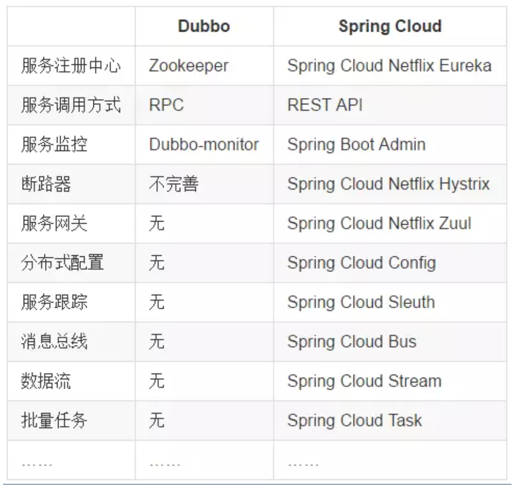
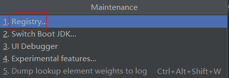

## 说明

## 目录

## 面试题

### springcloud与dubbo的区别

1. springcloud服务之间通过restful API进行通信，dubbo服务之间通过rpc进行通信

## 微服务概述

### 微服务是什么

> 微服务化的核心就是将传统的一站式应用，根据业务拆分成一个一个的服务，彻底
> 地去耦合,每一个微服务提供单个业务功能的服务，一个服务做一件事，
> 从技术角度看就是一种小而独立的处理过程，类似进程概念，能够自行单独启动
> 或销毁，拥有自己独立的数据库。

### 微服务与微服务架构

#### 微服务

> 强调的是服务的大小，它关注的是某一个点，是具体解决某一个问题/提供落地对应服务的一个服务应用,
> 狭意的看,可以看作Eclipse里面的一个个微服务工程/或者Module

#### 微服务架构

> **微服务架构**是⼀种架构模式，它提倡将单⼀应⽤程序划分成⼀组⼩的服务，服务之间互相协调、互相配合，为⽤户提供最终价值。每个服务运⾏在其**独⽴的进程中**，服务与服务间采⽤轻量级的通信机制互相协作（通常是基于HTTP协议的RESTful API）。每个服务都围绕着具体业务进⾏构建，并且能够被独⽴的部署到⽣产环境、类⽣产环境等。另外，**应当尽量避免统⼀的、集中式的服务管理机制**，对具体的⼀个服务⽽⾔，应根据业务上下⽂，选择合适的语⾔、⼯具对其进⾏构建。

### 微服务的优缺点

#### 优点

> - 每个服务足够内聚，足够小，代码容易理解这样能聚焦一个指定的业务功能或业务需求
>   开发简单、开发效率提高，一个服务可能就是专一的只干一件事。
> - 微服务能够被小团队单独开发，这个小团队是2到5人的开发人员组成。
> - 微服务是松耦合的，是有功能意义的服务，无论是在开发阶段或部署阶段都是独立的。
> - 微服务能使用不同的语言开发。
> - 易于和第三方集成，微服务允许容易且灵活的方式集成自动部署，通过持续集成工具，如Jenkins, Hudson, bamboo 。
> - 微服务易于被一个开发人员理解，修改和维护，这样小团队能够更关注自己的工作成果。无需通过合作才能体现价值。
> - 微服务允许你利用融合最新技术。
> - 微服务只是业务逻辑的代码，不会和HTML,CSS 或其他界面组件混合。
> - 每个微服务都有自己的存储能力，可以有自己的数据库。也可以有统一数据库。

#### 缺点

> - 开发人员要处理分布式系统的复杂性
> - 多服务运维难度，随着服务的增加，运维的压力也在增大
> - 系统部署依赖
> - 服务间通信成本
> - 数据一致性
> - 系统集成测试
> - 性能监控……

### 微服务技术栈

|               微服务条目               |                           落地技术                           | 备注 |
| :------------------------------------: | :----------------------------------------------------------: | :--: |
|                服务开发                |                Springboot、Spring、SpringMVC                 |      |
|             服务配置与管理             |            Netflix公司的Archaius、阿里的Diamond等            |      |
|             服务注册与发现             |                 Eureka、Consul、Zookeeper等                  |      |
|                服务调用                |                       Rest、RPC、gRPC                        |      |
|               服务熔断器               |                       Hystrix、Envoy等                       |      |
|                负载均衡                |                       Ribbon、Nginx等                        |      |
| 服务接口调用(客户端调用服务的简化工具) |                           Feign等                            |      |
|                消息队列                |                 Kafka、RabbitMQ、ActiveMQ等                  |      |
|            服务配置中心管理            |                  SpringCloudConfig、Chef等                   |      |
|          服务路由（API网关）           |                            Zuul等                            |      |
|                服务监控                |             Zabbix、Nagios、Metrics、Spectator等             |      |
|               全链路追踪               |                   Zipkin，Brave、Dapper等                    |      |
|                服务部署                |               Docker、OpenStack、Kubernetes等                |      |
|            数据流操作开发包            | SpringCloud Stream（封装与Redis,Rabbit、Kafka等发送接收消息） |      |
|              事件消息总线              |                       Spring Cloud Bus                       |      |

### 为什么选择SpringCloud作为微服务架构

#### 选型依据

> - 整体解决方案和框架成熟度
> - 社区热度
> - 可维护性
> - 学习曲线

#### 当前各大IT公司用的微服务架构有哪些?

> - 阿里Dubbo/HSF
> - 京东JSF
> - 新浪微博Motan
> - 当当网DubboX

#### 各微服务框架对比


## SpringCloud入门概述

### 是什么

#### 官网说明


> - SpringCloud，基于SpringBoot提供了一套微服务解决方案，包括服务注册与发现，配置中心，全链路监控，服务网关，负载均衡，熔断器等组件，除了基于NetFlix的开源组件做高度抽象封装之外，还有一些选型中立的开源组件。
> - SpringCloud利用SpringBoot的开发便利性巧妙地简化了分布式系统基础设施的开发，SpringCloud为开发人员提供了快速构建分布式系统的一些工具，包括配置管理、服务发现、断路器、路由、微代理、事件总线、全局锁、决策竞选、分布式会话等等,它们都可以用SpringBoot的开发风格做到一键启动和部署。
> - SpringBoot并没有重复制造轮子，它只是将目前各家公司开发的比较成熟、经得起实际考验的服务框架组合起来，通过SpringBoot风格进行再封装屏蔽掉了复杂的配置和实现原理，最终给开发者留出了一套简单易懂、易部署和易维护的分布式系统开发工具包

#### 概括

> SpringCloud=分布式微服务架构下的一站式解决方案，是各个微服务架构落地技术的集合体，俗称微服务全家桶

#### SpringCloud和SpringBoot是什么关系

> - SpringBoot专注于快速方便的开发单个个体微服务。
> - SpringCloud是关注全局的微服务协调整理治理框架，它将SpringBoot开发的一个个单体微服务整合并管理起来，
> - 为各个微服务之间提供，配置管理、服务发现、断路器、路由、微代理、事件总线、全局锁、决策竞选、分布式会话等等集成服务
> - SpringBoot可以离开SpringCloud独立使用开发项目，但是SpringCloud离不开SpringBoot，属于依赖的关系.
> - SpringBoot专注于快速、方便的开发单个微服务个体，SpringCloud关注全局的服务治理框架。

#### Dubbo是怎么到SpringCloud的？哪些优缺点让你去技术选型

> - 目前成熟的互联网架构（分布式+服务治理Dubbo）
>
> 
>
> - 我们把SpringCloud VS DUBBO进行一番对比
>
>   > 活跃度
>   >
>   > ```
>   > https://github.com/dubbo
>   > https://github.com/spring-cloud
>   > ```
>   >
>   > 对比结果
>   >
>   > 
>   >
>   > - 最大区别：SpringCloud抛弃了Dubbo的RPC通信，采用的是基于HTTP的REST方式。
>   > - 严格来说，这两种方式各有优劣。虽然从一定程度上来说，后者牺牲了服务调用的性能，但也避免了上面提到的原生RPC带来的问题。而且REST相比RPC更为灵活，服务提供方和调用方的依赖只依靠一纸契约，不存在代码级别的强依赖，这在强调快速演化的微服务环境下，显得更加合适。
>   > - 品牌机与组装机的区别
>   >   很明显，Spring Cloud的功能比DUBBO更加强大，涵盖面更广，而且作为Spring的拳头项目，它也能够与Spring Framework、Spring Boot、Spring Data、Spring Batch等其他Spring项目完美融合，这些对于微服务而言是至关重要的。使用Dubbo构建的微服务架构就像组装电脑，各环节我们的选择自由度很高，但是最终结果很有可能因为一条内存质量不行就点不亮了，总是让人不怎么放心，但是如果你是一名高手，那这些都不是问题；而Spring Cloud就像品牌机，在Spring Source的整合下，做了大量的兼容性测试，保证了机器拥有更高的稳定性，但是如果要在使用非原装组件外的东西，就需要对其基础有足够的了解。
>   > - 社区支持与更新力度
>   >   最为重要的是，DUBBO停止了5年左右的更新，虽然2017.7重启了。对于技术发展的新需求，需要由开发者自行拓展升级（比如当当网弄出了DubboX），这对于很多想要采用微服务架构的中小软件组织，显然是不太合适的，中小公司没有这么强大的技术能力去修改Dubbo源码+周边的一整套解决方案，并不是每一个公司都有阿里的大牛+真实的线上生产环境测试过。
>
> - 总结Cloud与Dubbo
>
>   > 问题：
>   > 曾风靡国内的开源 RPC 服务框架 Dubbo 在重启维护后，令许多用户为之雀跃，但同时，也迎来了一些质疑的声音。互联网技术发展迅速，Dubbo 是否还能跟上时代？Dubbo 与 Spring Cloud 相比又有何优势和差异？是否会有相关举措保证 Dubbo 的后续更新频率？
>   >
>   > 人物：Dubbo重启维护开发的刘军，主要负责人之一
>   >
>   > 刘军，阿里巴巴中间件高级研发工程师，主导了 Dubbo 重启维护以后的几个发版计划，专注于高性能 RPC 框架和微服务相关领域。曾负责网易考拉 RPC 框架的研发及指导在内部使用，参与了服务治理平台、分布式跟踪系统、分布式一致性框架等从无到有的设计与开发过程。

#### 能干嘛

## 版本选择

> spring boot 2.X版和spring cloud H版
>
> - Spring Cloud采用了**英国伦敦地铁站**的名称来命名,并由地铁站名称字母A--Z依次类推的形式来发布迭代版本
>
> - SpringCloud是一个由许多 子项目组成的综合项目，各子项目有不同的发布节奏。为了管理SpringCloud与各子项目的版本依赖关系,发布了一个清单，其中包括了某个SpringCloud版本对应的子项目版本。为了避免SpringCloud版本号与子项目版本号混淆，**SpringCloud版本采用 了名称而非版本号的命名，这些版本的名字采用了伦敦地铁站的名字,根据字母表的顺序来对应版本时间顺序**。例如Ange|是第一个版本, Brixton是第二个版本。当SpringCloud的发布内容积累到临界点或者一个重大BUG被解决后， 会发布一个"service releases"版本，简称SRX版本，比如Greenwich.SR2就是SpringCloud发布的Greenwich版本的第2个SRX版本。  
>
> - 查看spring cloud和spring boot某个版本的依赖关系：https://docs.spring.io/spring-cloud/docs/2020.0.0/reference/html/
>
>   
>
> - 官方spring boot 和spring cloud版本号约束地址：https://start.spring.io/actuator/info
>
>   
>
> - spring cloud alibaba文档：https://github.com/alibaba/spring-cloud-alibaba/blob/master/README-zh.md
>
>   

## cloud组件升级

> - 服务注册中心：Eureka(已停止维护)、zookeeper、Consul、**Nacos(推荐)**
> - 服务调用：Ribbon、LoadBalancer(推荐)
> - 服务调用2：Feign、OpenFeign(推荐)
> - 服务降级：Hystrix、resilence4j(推荐)、sentinel（阿里，，推荐）
> - 服务网关：Zuul、gateway(推荐)
> - 服务配置：Config、Apollo(携程)、Nacos(推荐)
> - 服务总线：Bus、Nacos(推荐)


## 父工程搭建

> - 声明打包方式为pom，用于管理依赖
>
> - 使用dependencyManagement配置依赖：**配置这个不会下载jar包**，只有子模块声明具体依赖后才会进行下载，锁定版本+子模块不用写groupId和version了,若子模块需要使用不同于父工程的版本jar包，指明版本号即可
>
> - maven跳过单元测试
>
>   
>
> - 

```xml
<?xml version="1.0" encoding="UTF-8"?>

<project xmlns="http://maven.apache.org/POM/4.0.0" xmlns:xsi="http://www.w3.org/2001/XMLSchema-instance"
         xsi:schemaLocation="http://maven.apache.org/POM/4.0.0 http://maven.apache.org/xsd/maven-4.0.0.xsd">
    <modelVersion>4.0.0</modelVersion>

    <groupId>com.sugar</groupId>
    <artifactId>spring-cloud-demo</artifactId>
    <version>1.0-SNAPSHOT</version>
    <packaging>pom</packaging>

    <modules>
        <module>cloud-provider-payment8001</module>
    </modules>

    <name>spring-cloud-demo</name>

    <!--统一管理jar包版本-->
    <properties>
        <project.build.sourceEncoding>UTF-8</project.build.sourceEncoding>
        <maven.compiler.source>12</maven.compiler.source>
        <maven.compiler.target>12</maven.compiler.target>
        <junit.version>4.12</junit.version>
        <lombok.version>1.18.10</lombok.version>
        <log4j.version>1.2.17</log4j.version>
        <mysql.version>8.0.18</mysql.version>
        <druid.version>1.1.16</druid.version>
        <mybatis.spring.boot.version>2.1.1</mybatis.spring.boot.version>
        <mybatis.plus.version>3.3.2</mybatis.plus.version>
        <dynamic.datasource.version>3.1.1</dynamic.datasource.version>
    </properties>

    <!--    子模块继承,，提供作用：锁定版本+子模块不用写groupId和version了-->
    <dependencyManagement>
        <dependencies>
            <!--spring boot 2.2.2-->
            <dependency>
                <groupId>org.springframework.boot</groupId>
                <artifactId>spring-boot-dependencies</artifactId>
                <version>2.2.2.RELEASE</version>
                <type>pom</type>
                <scope>import</scope>
            </dependency>
            <!--spring cloud Hoxton.SR1-->
            <dependency>
                <groupId>org.springframework.cloud</groupId>
                <artifactId>spring-cloud-dependencies</artifactId>
                <version>Hoxton.SR1</version>
                <type>pom</type>
                <scope>import</scope>
            </dependency>

            <!--spring cloud 阿里巴巴-->
            <dependency>
                <groupId>com.alibaba.cloud</groupId>
                <artifactId>spring-cloud-alibaba-dependencies</artifactId>
                <version>2.1.0.RELEASE</version>
                <type>pom</type>
                <scope>import</scope>
            </dependency>
            <!--mysql-->
            <dependency>
                <groupId>mysql</groupId>
                <artifactId>mysql-connector-java</artifactId>
                <version>${mysql.version}</version>
                <scope>runtime</scope>
            </dependency>
            <!-- druid-->
            <dependency>
                <groupId>com.alibaba</groupId>
                <artifactId>druid</artifactId>
                <version>${druid.version}</version>
            </dependency>

            <dependency>
                <groupId>com.baomidou</groupId>
                <artifactId>mybatis-plus-boot-starter</artifactId>
                <version>${mybatis.plus.version}</version>
            </dependency>

            <dependency>
                <groupId>com.baomidou</groupId>
                <artifactId>dynamic-datasource-spring-boot-starter</artifactId>
                <version>${dynamic.datasource.version}</version>
            </dependency>
            <!--junit-->
            <dependency>
                <groupId>junit</groupId>
                <artifactId>junit</artifactId>
                <version>${junit.version}</version>
            </dependency>
            <!--log4j-->
            <dependency>
                <groupId>log4j</groupId>
                <artifactId>log4j</artifactId>
                <version>${log4j.version}</version>
            </dependency>
        </dependencies>
    </dependencyManagement>

    <build>
        <pluginManagement>
            <plugins>
                <plugin>
                    <groupId>org.springframework.boot</groupId>
                    <artifactId>spring-boot-maven-plugin</artifactId>
                    <configuration>
                        <fork>true</fork>
                        <addResources>true</addResources>
                    </configuration>
                </plugin>
            </plugins>
        </pluginManagement>
    </build>
</project>

```

## 支付模块

> - 端口使用8001
>
> - 父工程上右键-->new module，创建一个cloud-provider-peyment8001模块，groupId和version都会从父工程继承，只需要填写artifactId
>
> - 创建完成后父工程pom就会增加如下代码
>
>   ```xml
>   <modules>
>       <module>cloud-provider-payment8001</module>
>   </modules>
>   ```
>
> - 

### pom

```xml
<?xml version="1.0" encoding="UTF-8"?>
<project xmlns="http://maven.apache.org/POM/4.0.0"
         xmlns:xsi="http://www.w3.org/2001/XMLSchema-instance"
         xsi:schemaLocation="http://maven.apache.org/POM/4.0.0 http://maven.apache.org/xsd/maven-4.0.0.xsd">
    <parent>
        <artifactId>spring-cloud-demo</artifactId>
        <groupId>com.sugar</groupId>
        <version>1.0-SNAPSHOT</version>
    </parent>
    <modelVersion>4.0.0</modelVersion>

    <artifactId>cloud-provider-payment8001</artifactId>

    <dependencies>
        <!-- 包含了sleuth zipkin 数据链路追踪-->
        <dependency>
            <groupId>org.springframework.cloud</groupId>
            <artifactId>spring-cloud-starter-zipkin</artifactId>
        </dependency>
        <dependency>
            <groupId>org.springframework.boot</groupId>
            <artifactId>spring-boot-starter-web</artifactId>
        </dependency>
        <!--监控-->
        <dependency>
            <groupId>org.springframework.boot</groupId>
            <artifactId>spring-boot-starter-actuator</artifactId>
        </dependency>

        <dependency>
            <groupId>com.baomidou</groupId>
            <artifactId>mybatis-plus-boot-starter</artifactId>
        </dependency>

        <dependency>
            <groupId>com.baomidou</groupId>
            <artifactId>dynamic-datasource-spring-boot-starter</artifactId>
        </dependency>
        <!--eureka client-->
<!--        <dependency>-->
<!--            <groupId>org.springframework.cloud</groupId>-->
<!--            <artifactId>spring-cloud-starter-netflix-eureka-client</artifactId>-->
<!--        </dependency>-->
        <!--mysql-connector-java-->
        <dependency>
            <groupId>mysql</groupId>
            <artifactId>mysql-connector-java</artifactId>
        </dependency>
        <!--jdbc-->
        <dependency>
            <groupId>org.springframework.boot</groupId>
            <artifactId>spring-boot-starter-jdbc</artifactId>
        </dependency>
        <!--热部署-->
        <dependency>
            <groupId>org.springframework.boot</groupId>
            <artifactId>spring-boot-devtools</artifactId>
            <scope>runtime</scope>
            <optional>true</optional>
        </dependency>
        <dependency>
            <groupId>org.projectlombok</groupId>
            <artifactId>lombok</artifactId>
            <optional>true</optional>
        </dependency>
        <dependency>
            <groupId>org.springframework.boot</groupId>
            <artifactId>spring-boot-starter-test</artifactId>
            <scope>test</scope>
        </dependency>
    </dependencies>

</project>
```

### 整合mybatis-plus和动态数据源

#### pom

```xml
<dependency>
    <groupId>com.baomidou</groupId>
    <artifactId>mybatis-plus-boot-starter</artifactId>
</dependency>

<dependency>
    <groupId>com.baomidou</groupId>
    <artifactId>dynamic-datasource-spring-boot-starter</artifactId>
</dependency>
```

#### 问题

> Failed to configure a DataSource: 'url' attribute is not specified and no embedd
>
> 原因：没有配置数据源，而是使用了动态数据源

##### 步骤一

> 启动类排除数据源自动配置类
>
> ```java
> @SpringBootApplication(exclude= {DataSourceAutoConfiguration.class})
> ```

##### 步骤二

> 检查pom文件里面 有没有打包成pom，有的话去掉

##### 步骤三

> 就是pom.xml里导入了其它工程的依赖，然后这个其它工程的pom.xml里有需要配置dataSource数据源的依赖，解决办法就是在当前工程导入其他工程依赖时，把其它工程里需要配置dataSource的依赖给exclude掉

#### 步骤四

> 检查是否引入的druid数据源自动配置

### yml配置

```yml
server:
  port: 8001


spring:
  application:
    name: cloud-payment-service
  datasource:
    # 当前数据源操作类型
    type: com.alibaba.druid.pool.DruidDataSource
    # mysql驱动类
   driver-class-name: com.mysql.cj.jdbc.Driver
   url: jdbc:mysql://localhost:3306/springcloud?useUnicode=true&characterEncoding=UTF-8&useSSL=false&serverTimezone=UTC
   username: root
   password: 123456
mybatis:
  mapper-locations: classpath*:mapper/*.xml
  type-aliases-package: com.sugar.springcloud.entities
```

### 主类

```java
package com.sugar.springcloud;

import org.springframework.boot.SpringApplication;
import org.springframework.boot.autoconfigure.SpringBootApplication;

@SpringBootApplication
public class PaymentMain {
    public static void main(String[] args) {
        SpringApplication.run(PaymentMain.class, args);
    }
}
```

### 业务

#### 创建订单表

```sql
create table payment
(
    id     bigint auto_increment
        primary key,
    serial varchar(200) null
)
    comment '支付表';
```

#### 创建实体类

```java
@Data
@AllArgsConstructor
@NoArgsConstructor
public class Payment implements Serializable {
    private Long id;
    private String serial;
}
```

#### 通用返回实体类

```java
@Data
@AllArgsConstructor
@NoArgsConstructor
public class CommonResult<T> {
    private Integer code;
    private String message;
    private T data;

    public CommonResult(Integer code, String message) {
        this(code, message, null);
    }
}
```

#### dao

```java
@DS("springcloud")
public interface PaymentMapper extends BaseMapper<Payment> {
}
```

#### service

```java
public interface PaymentService {
    int insertPayment(Payment payment);

    Payment queryPaymenyById(Long id);
}

@Service
public class PaymentServiceImpl implements PaymentService {
    @Autowired
    private PaymentMapper paymentMapper;

    @Override
    public int insertPayment(Payment payment) {
       return paymentMapper.insert(payment);
    }

    @Override
    public Payment queryPaymenyById(Long id) {
        return paymentMapper.selectById(id);
    }
}
```

#### controller

```java
@RestController
@Slf4j
public class PaymentController {

    @Autowired
    private PaymentService paymentService;

    @PostMapping("/payment/create")
    public CommonResult<Integer> create(@RequestBody Payment payment) {
        int insertCount = paymentService.insertPayment(payment);
        log.info("添加订单:{}", insertCount);
        if (insertCount > 0) {
            return new CommonResult<>(200, "添加订单成功。", insertCount);
        }

        return new CommonResult<>(500, "添加订单失败");
    }

    @GetMapping("/payment/get/{id}")
    public CommonResult<Payment> create(@PathVariable Long id) {
        Payment payment = paymentService.queryPaymenyById(id);
        if (payment == null) {
            return new CommonResult<>(500, "查询订单失败,id:" + id);
        }

        return new CommonResult<>(200, "成功", payment);
    }

}
```

## 热部署工具DevTools

### 添加maven依赖

> 其版本由spring boot版本确定

```xml
<dependency>
    <groupId>org.springframework.boot</groupId>
    <artifactId>spring-boot-devtools</artifactId>
    <scope>runtime</scope>
    <optional>true</optional>
</dependency>
```

### 添加maven插件

> 插件添加到父pom

```xml
<plugin>
    <groupId>org.springframework.boot</groupId>
    <artifactId>spring-boot-maven-plugin</artifactId>
    <configuration>
        <fork>true</fork>
        <addResources>true</addResources>
    </configuration>
</plugin>
```

### 开启自动编译


### 配置

#### ctrl+shift+alt+/




##### 重启idea

## 消费者订单模块

### controller

```java
@RestController
@Slf4j
public class OrderController {

    private static final String PAYMENT_URL = "http://localhost:8001";

    @Autowired
    private RestTemplate template;

    @PostMapping("/consumer/payment/create")
    public CommonResult<Payment> create(@RequestBody Payment payment) {
        return template.postForObject(PAYMENT_URL + "/payment/create", payment, CommonResult.class);
    }

    @GetMapping("/consumer/payment/get/{id}")
    public CommonResult<Payment> getPayment(@PathVariable Long id) {
        return template.getForObject(PAYMENT_URL + "/payment/get/" + id, CommonResult.class);
    }

}
```

### RestTemplate配置

```java
@Configuration
public class SpringContextConfig {

    @Bean
    public RestTemplate restTemplate(){
        return new RestTemplate();
    }
}
```

## 公共模块cloud-api-commons抽取

> - 将多个模块公用的实体类，工具类等抽取出来
>
> - maven clean
>
> - maven install
>
> - 修改其它模块(如删除原有entity包)，引用公共模块
>
>   ```xml
>   <dependency>
>       <groupId>com.sugar</groupId>
>       <artifactId>cloud-api-commons</artifactId>
>       <version>${cloud-api-commons-version}</version>
>   </dependency>
>   ```
>
> - 

## 服务注册eureka

### eureka基础知识

#### 概述

> 在传统的rpc远程调用框架中，管理每个服务与服务之间依赖关系比较复杂,管理比较复杂,所以需要使用服务治理，管理服务于服务之间依赖关系，可以实现服务调用、负载均衡、容错等,实现服务发现与注册。

#### 什么是服务注册于发现

> - Eureka采用了CS的设计架构，Eureka Server作为服务注册功能的服务器，它是服务注册中心。而系统中的其他微服务，使用Eureka的客户端连接到Eureka Server并维持心跳连接。这样系统的维护人员就可以通过Eureka Server来监控系统中各个微服务是否正常运行。
> - 在服务注册与发现中，有一个注册中心。当服务器启动的时候，会把当前自己服务器的信息比如服务地址通讯地址等以别名方式注册到注册中心上。另一方(消费者|服务提供者) ,以该别名的方式去注册中心上获取到实际的服务通讯地址,然后再实现本地RPC调用
> - RPC远程调用框架核心设计思想:在于注册中心，因为使用注册中心管理每个服务与服务之间的一个依赖关系(服务治理概念)。在任何rpc远程框架中，都会有一个注册中心(存放服务地址相关信息(接口地址)  

#### Eureka架构图


#### dubbo架构图


#### Eureka的两个组件

> - Eureka包含两个组件: Eureka Server和Eureka Client
>
> - Eureka Server提供服务注册服务
>   - 各个微服务节点通过配置启动后，会在EurekaServer中进行注册，这样EurekaServer中的服务注册表中  将会存储所有可用服务节点的信息,服务节点的信息可以在界面中直观看到。
>
> - EurekaClient通过注册中心进行访问
>   - 是一个Java客户端， 用于简化Eureka Server的交互， 客户端同时也具备一个内置的、使用轮询(round-robin)负载算法的负载均衡器。在应用启动后,将会向Eureka Server发送心跳(默认周期为30秒)。如果Eureka Server在多个心跳周期内没有接收到某个节点的心跳，EurekaServer将 会从服务注册表中把这个服务节点移除(默认90秒)  

### 单机Eureka搭建

#### pom

```xml
<dependencies>
    <!-- eureka-server -->
    <dependency>
        <groupId>org.springframework.cloud</groupId>
        <artifactId>spring-cloud-starter-netflix-eureka-server</artifactId>
    </dependency>
    <dependency>
        <groupId>com.sugar</groupId>
        <artifactId>cloud-api-commons</artifactId>
        <version>${cloud-api-commons-version}</version>
    </dependency>
    <dependency>
        <groupId>org.springframework.boot</groupId>
        <artifactId>spring-boot-starter-web</artifactId>
    </dependency>
    <!--监控-->
    <dependency>
        <groupId>org.springframework.boot</groupId>
        <artifactId>spring-boot-starter-actuator</artifactId>
    </dependency>
    <!-- 一般通用配置 -->
    <dependency>
        <groupId>org.springframework.boot</groupId>
        <artifactId>spring-boot-devtools</artifactId>
        <scope>runtime</scope>
        <optional>true</optional>
    </dependency>
    <dependency>
        <groupId>org.projectlombok</groupId>
        <artifactId>lombok</artifactId>
        <optional>true</optional>
    </dependency>
    <dependency>
        <groupId>org.springframework.boot</groupId>
        <artifactId>spring-boot-starter-test</artifactId>
        <scope>test</scope>
    </dependency>
</dependencies>
```

#### yml

```yml
server:
  port: 7001

eureka:
  instance:
    hostname: localhost #eureka服务端实例名称
  client:
    #不向注册中心注册自己
    register-with-eureka: false
    #false表示自己就是服务注册中心，只需要维护服务，不需要去检索服务
    fetch-registry: false
    service-url:
      #设置与eureka server交互的地址
      defaultZone: http://${eureka.instance.hostname}:${server.port}/eureka/
```

#### 启动类

```java
@SpringBootApplication(exclude = {DataSourceAutoConfiguration.class})
@EnableEurekaServer
public class EurekaServer7001 {
    public static void main(String[] args) {
        SpringApplication.run(EurekaServer7001.class, args);
    }
}
```

#### 效果图

> 访问http://localhost:7001/


#### 支付模块注册到eureka

##### 添加maven依赖

```xml
<dependency>
    <groupId>org.springframework.cloud</groupId>
    <artifactId>spring-cloud-starter-netflix-eureka-client</artifactId>
</dependency>
```

##### 修改yml

```yml
eureka:
  client:
    #不向注册中心注册自己
    register-with-eureka: true
    #false表示自己就是服务注册中心，只需要维护服务，不需要去检索服务
    fetch-registry: true
    service-url:
      #设置与eureka server交互的地址
      defaultZone: http://localhost:7001//eureka/
```

##### 启动类修改

> 添加@EnableEurekaClient注解

##### 注册成功效果

> 注册名称为yml配置中配置的`spring.application.name`


### 集群Eureka搭建

> 多个eureka server相互注册,defaultZone配置其它eureka server的地址，多个使用逗号分隔

#### 修改host文件

```
127.0.0.1 eureka.server7001
127.0.0.1 eureka.server7002
```

#### 创建eureka server7002

#### eureka server7002 yml配置

```yml
server:
  port: 7002

eureka:
  instance:
    hostname: eureka.server7002 #eureka服务端实例名称
  client:
    #不向注册中心注册自己
    register-with-eureka: false
    #false表示自己就是服务注册中心，只需要维护服务，不需要去检索服务
    fetch-registry: false
    service-url:
      #设置与eureka server交互的地址
      defaultZone: http://eureka.server7001:7001/eureka/
```

#### eureka server7002=1 yml配置

```yml
server:
  port: 7001

eureka:
  instance:
    hostname: eureka.server7001 #eureka服务端实例名称
  client:
    #不向注册中心注册自己
    register-with-eureka: false
    #false表示自己就是服务注册中心，只需要维护服务，不需要去检索服务
    fetch-registry: false
    service-url:
      #设置与eureka server交互的地址
      defaultZone: http://eureka.server7002:7002/eureka/
```

#### 访问效果


#### 支付模块注册到eureka集群

> 修改yml配置,defaultZone配置成多个

```yml
eureka:
  client:
    #不向注册中心注册自己
    register-with-eureka: true
    #false表示自己就是服务注册中心，只需要维护服务，不需要去检索服务
    fetch-registry: true
    service-url:
      #设置与eureka server交互的地址
      defaultZone: http://eureka.server7002:7002/eureka/,http://eureka.server7001:7001/eureka/
```

### 支付模块payment集群配置

#### yml配置

> 使用spring boot profile多环境配置
>
> - 公共配置放在application.yml中
>
> - application-payment8001.yml
>
>   ```yml
>   server:
>     port: 8001
>   
>   spring:
>     profiles:
>       active: payment8001
>   ```
>
> - application-payment8002.yml
>
>   ```yml
>   server:
>     port: 8002
>   
>   spring:
>     profiles:
>       active: payment8002
>   ```
>
> 

#### idea启动配置


配置profile


#### 效果图


### 订单模块通过eureka访问支付模块集群

#### RestTemplate配置

> 标注@LoadBalanced，开启RestTemplate的默认负载均衡策略，默认策略为轮询，即每个服务调用一次

```java
@Bean
@LoadBalanced
public RestTemplate restTemplate(){
    return new RestTemplate();
}
```

#### 修改访问url

> 将之前写死的PAYMENT_URL修改为eureka上服务的名称，端口不需要写

```java
private static final String PAYMENT_URL = "http://CLOUD-PAYMENT-SERVICE";
```

### actuator微服务信息完善

#### 修改服务在eureka上显示的实例名称

##### yml

```yml
eureka:
  instance:
    instance-id: payment8001
```

##### 效果


#### 修改服务在eureka上显示的IP

##### yml

> 配置prefer-ip-address为true

```yml
eureka:
  instance:
    instance-id: payment8002
    prefer-ip-address: true
```

##### 效果


### 服务发现Discovery

>  在客户端获取eureka上的服务信息
>
> - 启动类标注@EnableDiscoveryClient

```java
@Autowired
private DiscoveryClient discoveryClient;

@GetMapping("/payment/discovery")
public Map<String,Object> discovery(){
    Map<String,Object> result = new HashMap<>();
    List<String> services = discoveryClient.getServices();
    result.put("service",services);

    for (String service : services) {
        List<ServiceInstance> instances = discoveryClient.getInstances(service);
        result.put(service,instances);
    }

    return result;
}
```

### Eureka自我保护

#### 概述

> - 保护模式主要用于一组客户端和Eureka Server之间存在网络分区场景下的保护。一但进入保护模式，Eureka Server将会尝试保护其服务注册表中的信息，不再删除服务注册表中的数据,也就是不会注销任何微服务。
>
> - 如果在Eureka Server的首页看到以下这段提示，则说明Eureka进入了保护模式:
>
>   ```
>   EMERGENCY! EUREKA MAY BE INCORRECTLY CLAIMING INSTANCES ARE UP WHEN THEY'RE NOT. RENEWALS ARE LESSER THAN THRESHOLD AND HENCE THE INSTANCES ARE NOT BEING EXPIRED JUST TO BE SAFE.
>   ```
>
> - **某时刻某一个微服务不可用了，Eureka不会立刻清理，依旧会对该微服务的信息进行保存**
>
> - 属于CAP理论中的AP

#### 自我保护机制产生原因

> 为了防止EurekaClient可以正常运行，但是与EurekaServer网络不通情况下，EurekaServer不会立 刻将EurekaClient服务剔除

#### 什么是自我保护模式

> - 默认情况下，如果EurekaServer在一 定时间内没有 接收到某个微服务实例的心跳，EurekaServer将 会注销该实例(默认90秒) 。但是当网络分区故障发生(延时、卡顿、 拥挤)时，微服务与EurekaServer之间无法正常通信，以上行为可能变得非常危险了一因为微服务本身其实是健康的，**此时本不应该注销这个微服务**。Eureka通过“ 自我保护模式”来解决这个问题当EurekaServer节点在短时间内丢失过多客户端时(可能发生了网络分区故障)，那么这 个节点就会进入自我保护模式。
> - **在自我保护模式中，Eureka Server会保护服务注册表中的信息，不再注销任何服务实例。**
> - 它的设计哲学就是宁可保留错误的服务注册信息，也不盲目注销任何可能健康的服务实例。-句话讲解:好死不如赖活着
> - 综上，自我保护模式是一 种应对网络异常的安全保护措施。它的架构哲学是宁可同时保留所有微服务(健康的微服务和不健康的微服务都会保留)也不盲目注销任何健康的微服务。使用自我保护模式，可以让Eureka集群更加的健壮、稳定。   

#### 如何进制自我保护

##### server端配置yml

```yml
eureka:
 server:
  #关闭自我保护机制
  enable-self-preservation: false
  # 指定 Eviction Task 定时任务的调度频率，用于剔除过期的实例，此处未使用默认频率，频率为：5/秒，默认为：60/秒
  # 有效防止的问题是：应用实例异常挂掉，没能在挂掉之前告知Eureka server要下线掉该服务实例信息。这个就需要依赖Eureka server的EvictionTask去剔除。
  eviction-interval-timer-in-ms: 2000
```

##### client端配置yml

```yml
eureka:
  instance:
    #心跳检测与续约设置，开发时设置小些，保证服务关闭后注册中心能及时删除服务
    #客户端发送心跳时间间隔，默认30s
    lease-renewal-interval-in-seconds: 1
    #Eureka服务端在收到最后一次心跳后等待时间上限，单位为秒(獸认是90秒) ,超时将剔除服务
    lease-expiration-duration-in-seconds: 2
```

## 使用zookeeper替代eureka

