## 明

## 目录

## springmvc hellowrold

### 项目目录结构

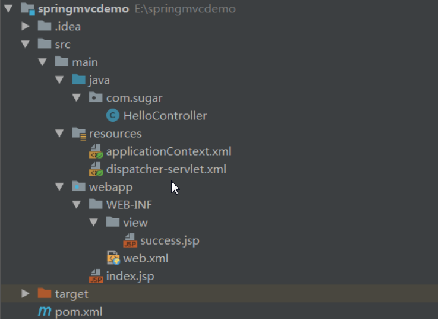

### web.xml配置

```xml
    <!--把applicationContext.xml加入到配置文件中-->
    <context-param>
        <param-name>contextConfigLocation</param-name>
        <param-value>classpath:applicationContext.xml</param-value>
    </context-param>
    <listener>
        <listener-class>org.springframework.web.context.ContextLoaderListener</listener-class>
    </listener>

    <!--配置springmvc DispatcherServlet-->
    <servlet>
        <servlet-name>springMVC</servlet-name>
        <servlet-class>org.springframework.web.servlet.DispatcherServlet</servlet-class>
        <init-param>
            <!--配置dispatcher.xml作为mvc的配置文件-->
            <param-name>contextConfigLocation</param-name>
            <param-value>classpath:dispatcher-servlet.xml</param-value>
        </init-param>
        <load-on-startup>1</load-on-startup>
    </servlet>
    <servlet-mapping>
        <servlet-name>springMVC</servlet-name>
        <url-pattern>/</url-pattern>
    </servlet-mapping>
```

### dispatcher-servlet.xml

```xml
<!--只扫描controller组件-->    
<context:component-scan base-package="com.sugar">
        <context:include-filter type="annotation" expression="org.springframework.stereotype.Controller"/>
    </context:component-scan>

    <bean class="org.springframework.web.servlet.view.InternalResourceViewResolver">
        <property name="prefix" value="/WEB-INF/view/"/>
        <property name="suffix" value=".jsp"/>
    </bean>
```

### applicationContext.xml

```xml
<!--扫描除了controller的组件-->    
<context:component-scan base-package="com.sugar">
        <context:exclude-filter type="annotation" expression="org.springframework.stereotype.Controller"/>
    </context:component-scan>
```

### HelloController

```java
@Controller
public class HelloController {

    @RequestMapping("/hello")
    public String hello() {
        System.out.println("1111111");
        return "success";
    }
}
```

## RequestMapping

### 使用 @RequestMapping 映射请求

> 1. Spring MVC 使用 @RequestMapping 注解为控制器指定可 以处理哪些 URL 请求
>
> 2. 在控制器的类定义及方法定义处都可标注@RequestMapping
>    类定义处：提供初步的请求映射信息。相对于 WEB 应用的根目录
>    方法处：提供进一步的细分映射信息。相对于类定义处的 URL。若 类定义处未标注 @RequestMapping，则方法处标记的 URL 相对于WEB 应用的根目录
>
> 3. DispatcherServlet 截获请求后，就通过控制器上 @RequestMapping 提供的映射信息确定请求所对应的处理方法。
>
> 4. Ant 风格资源地址支持 3 种匹配符：
>
>    ```
>    ?：匹配文件名中的一个字符
>    *：匹配文件名中的任意字符
>    **：** 匹配多层路径
>    ```
>
> 5. @RequestMapping 还支持 Ant 风格的 URL：
>
>    ```
>    /user/*/createUser: 匹配 /user/aaa/createUser、/user/bbb/createUser 等 URL
>    /user/**/createUser: 匹配 /user/createUser、/user/aaa/bbb/createUser 等 URL
>    /user/createUser??: 匹配 /user/createUseraa、/user/createUserbb 等 URL
>    ```

### 映射请求参数、请求方法或请求头

> 标准的 HTTP 请求报头
>
> 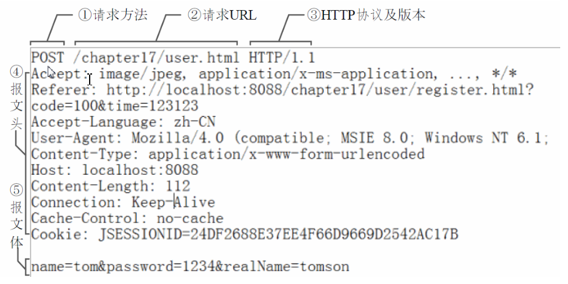

> 1. @RequestMapping 除了可以使用请求 URL 映射请求外， 还可以使用请求方法、请求参数及请求头映射请求
> 2. @RequestMapping 的 value、method、params 及 heads 分别表示请求 URL、请求方法、请求参数及请求头的映射条件，他们之间是与的关系，联合使用多个条件可让请求映射更加精确化。
> 3. params (不限请求方式，get和post都可以使用) 和 headers支持简单的表达式：
>    param1: 表示请求必须包含名为 param1 的请求参数 
>    !param1: 表示请求不能包含名为 param1 的请求参数 
>    param1 != value1: 表示请求包含名为 param1 的请求参数，但其值不能为 value1
>    {“param1=value1”, “param2”}: 请求必须包含名为 param1 和param2 的两个请求参数，且 param1 参数的值必须为 value1

## @PathVariable

> 1. @PathVariable 映射 URL 绑定的占位符
>
> 2. 带占位符的 URL 是 Spring3.0 新增的功能，该功能在 SpringMVC 向 REST 目标挺进发展过程中具有里程碑的意义
>
> 3. 通过 @PathVariable 可以将 URL 中占位符参数绑定到控 制器处理方法的入参中：URL 中的 {xxx} 占位符可以通过@PathVariable("xxx") 绑定到操作方法的入参中
>
>    ```java
>    @RequestMapping("/hello/{id}")
>        public String hello(@PathVariable("id") Integer id) {
>            System.out.println("hello" + id);
>            return "success";
>        }
>    ```

## REST

> 1. REST：即 Representational State Transfer。（资源）表现层状态转化。是目前最流行的一种互联网软件架构。它结构清晰、符合标准、易于理解、扩展方便，所以正得到越来越多网站的采用
>
> 2. 资源（Resources）：网络上的一个实体，或者说是网络上的一个具体信息。它可以是一段文本、一张图片、一首歌曲、一种服务，总之就是一个具体的存在。可以用一个URI（统一资源定位符）指向它，每种资源对应一个特定的 URI 。要获取这个资源，访问它的URI就可以，因此 URI 即为每一个资源的独一无二的识别符。
>
> 3. 表现层（Representation）：把资源具体呈现出来的形式，叫做它的表现层（Representation）。比如，文本可以用 txt 格式表现，也可以用 HTML 格式、XML 格式、JSON 格式表现，甚至可以采用二进制格式。
>
> 4. 状态转化（State Transfer）：每• 发出一个请求，就代表了客户端和服务器的一次交互过程。HTTP协议，是一个无状态协议，即所有的状态都保存在服务器端。因此，如果客户端想要操作服务器，必须通过某种手段，让服务器端发生“状态转化”（State Transfer）。而这种转化是建立在表现层之上的，所以就是 “表现层状态转化”。具体说，就是 HTTP 协议里面，四个表示操作方式的动词：GET、POST、PUT、DELETE。它们分别对应四种基本操作：GET 用来获取资源，POST 用来新建资源，PUT 用来更新资源，DELETE 用来删除资源。
>
> 5. 示例
>
>    ```
>    /order/1 HTTP GET ：得到 id = 1 的 order
>    /order/1 HTTP DELETE：删除 id = 1的 order
>    /order/1 HTTP PUT：更新id = 1的 order
>    /order HTTP POST：新增 order
>    ```
>
> 6. HiddenHttpMethodFilter：浏览器 form 表单只支持 GET 与 POST 请求，而DELETE、PUT 等 method 并不支持，Spring3.0 添加了一个过滤器，可以将这些请求转换为标准的 http 方法，使得支持 GET、POST、PUT 与DELETE 请求
>
>    ```xml
>    <filter>
>            <filter-name>hiddenHttpMethodFilter</filter-name>
>            <filter-class>org.springframework.web.filter.HiddenHttpMethodFilter</filter-class>
>        </filter>
>        <filter-mapping>
>            <filter-name>hiddenHttpMethodFilter</filter-name>
>            <url-pattern>/</url-pattern>
>        </filter-mapping>
>    ```
>
>    具体实现方式：
>
>    ```java
>    1.配置springmvc的HiddenHttpMethodFilter过滤器
>    2.要想发送PUT或DELETE请求，必须使用form表单以post方式提交，并且添加一个隐藏域，name=_method，值为PUT或DELETE，
>    3.@RequestMapping使用占位符
>    4.获取参数值使用@PathVariable
>    @RequestMapping("/hello/{id}")
>        public String hello(@PathVariable("id") Integer id) {
>            System.out.println("hello" + id);
>            return "success";
>        }
>    ```

## 请求处理方法签名

> 1. Spring MVC 通过分析处理方法的签名，将 HTTP 请求信息绑定到处理方法的相应人参中。
> 2. Spring MVC 对控制器处理方法签名的限制是很宽松的，几乎可以按喜欢的任何方式对方法进行签名。
> 3. 必要时可以对方法及方法入参标注相应的注解（@PathVariable、@RequestParam、@RequestHeader 等）、Spring MVC 框架会将 HTTP 请求的信息绑定到相应的方法入参中，并根据方法的返回值类型做出相应的后续处理。

### @RequestParam

> 在处理方法入参处使用 @RequestParam 可以把请求参数传递给请求方法
> value：参数名 
> required：是否必须。默认为 true, 表示请求参数中必须包含对应的参数，若不存在，将抛出异常
>
> defaultValue：设置默认值

### @RequestHeader

> 绑定请求报头的属性值，使用方式同@RequestParam

### @CookieValue

> 绑定请求中的 Cookie 值，使用方式同@RequestParam

## 使用 POJO 对象绑定请求参数值

> Spring MVC 会按请求参数名和 POJO 属性名进行自动匹配，自动为该对象填充属性值。支持级联属性。
> 如：dept.deptId、dept.address.tel 等

## 使用 Servlet API 作为入参

> MVC 的 Handler 方法可以接受哪些 ServletAPI 类型的参数
>
> ```
> HttpServletRequest 
> HttpServletResponse 
> HttpSession 
> java.security.Principal 
> Locale 
> InputStream 
> OutputStream 
> Reader 
> Writer
> ```

## 处理模型数据

> Spring MVC 提供了以下几种途径输出模型数据：
>
> 1. ModelAndView: 处理方法返回值类型为 ModelAndView 时, 方法体即可通过该对象添加模型数据，数据最终会被放到request域中
> 2. Map 及 Model: 入参 为org.springframework.ui.Model、org.springframework.ui.ModelMap 或 java.uti.Map 时，处理方法返回时，Map 中的数据会自动添加到模型中。数据最终会被放到request域中
> 3. @SessionAttributes: 将模型中的某个属性暂存到 HttpSession 中，以便多个请求之间可以共享这个属性
> 4. @ModelAttribute: 方法入参标注该注解后, 入参的对象就会放到数据模型中

### ModelAndView

> 1. 控制器处理方法的返回值如果为 ModelAndView, 则其既包含视图信息，也包含模型数据信息
>
> 2. 添加模型数据
>
>    ```java
>    MoelAndView addObject(String attributeName, Object attributeValue)
>    ModelAndView addAllObject(Map<String, ?> modelMap )
>    ```
>
> 3. 设置视图
>
>    ```java
>    void setView(View view)
>    void setViewName(String viewName)
>    ```

### Map 及 Model

> 1. Spring MVC 在内部使用了一个org.springframework.ui.Model 接口存储模型数据
>
> 2. 具体步骤
>
>    ```
>    1.Spring MVC 在调用方法前会创建一个隐含的模型对象作为模型数据的存储容器。
>    2.如果方法的入参为 Map 或 Model 类型，Spring MVC 会将隐含模型的引用传递给这些入参。在方法体内，开发者可以通过这个入参对象访问到模型中的所有数据，也可以向模型中添加新的属性数据
>    ```
>
>    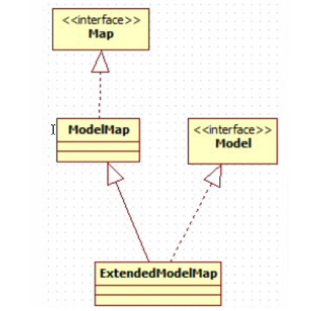

### @SessionAttributes

> 1. 若希望在多个请求之间共用某个模型属性数据，则可以在控制器类上标注一个 @SessionAttributes, Spring MVC 将在模型中对应的属性暂存到 HttpSession 中。
> 2. @SessionAttributes 除了可以通过属性名指定需要放到会话中的属性外，还可以通过模型属性的对象类型指定哪些模型属性需要放到会话中
>    @SessionAttributes(types=User.class) 会将隐含模型中所有类型为 User.class 的属性添加到会话中。
>    @SessionAttributes(value={“user1”, “user2”}) 
>    @SessionAttributes(types={User.class, Dept.class}) 
>    @SessionAttributes(value={“user1”, “user2”}, types={Dept.class})

#### 由@SessionAttributes引发的异常

> 1. 如果在处理类定义处标注了@SessionAttributes(“xxx”)，如@SessionAttributes(“user”),若某个方法的入参是User类型的pojo，则会尝试从会话中获取该属性，并将其赋给该入参，然后再用请求消息填充该入参对象，如果在会话中找不到对应的属性，则抛出 HttpSessionRequiredException 异常
>
> 2. 如何避免该异常
>
>    ```java
>    //1.使用@ModelAttribute("abc")
>    public String helloWorld(@ModelAttribute("abc") User) {  
>           return "helloWorld.jsp";  
>        } 
>        
>        //2.通过@ModelAttribute在方法调用之前创建一个对应的bean，springmvc会先从内部创建的一个map中获取该属性，再尝试从session中获取，创建的对象在map中默认的key为类名首字母小写，若@ModelAttribute使用的value属性，则使用该值作为key
>        @ModelAttribute("user")
>        public void getUser() {  
>           return new User();  
>        }  
>    ```
>
>    

### @ModelAttribute

> 1. 在方法定义上使用 @ModelAttribute 注解：Spring MVC在调用目标处理方法前，会先逐个调用在方法级上标注了@ModelAttribute 的方法。
> 2. 在方法的入参前使用 @ModelAttribute 注解：可以从隐含对象中获取隐含的模型数据中获取对象，再将请求参数 绑定到对象中，再传入入参将方法入参对象添加到模型中
#### 注释void返回值的方法

> 
>
>    ```java
>    @Controller
>    public class HelloModelController {
>        
>        @ModelAttribute 
>        public void populateModel(@RequestParam String abc, Model model) {  
>           model.addAttribute("attributeName", abc);  
>        }  
>    
>        @RequestMapping(value = "/helloWorld")  
>        public String helloWorld() {  
>           return "helloWorld.jsp";  
>        }  
>    
>    }
>    ```
>
>    在这个代码中，访问控制器方法helloWorld时，会首先调用populateModel方法，将页面参数abc(/helloWorld.ht?abc=text)放到model的attributeName属性中，在视图中可以直接访问。

#### 注释返回具体类的方法

> ```java
> @Controller
> public class Hello2ModelController {
>    
>     @ModelAttribute 
>     public User populateModel() {  
>        User user=new User();
>        user.setAccount("ray");
>        return user;
>     }  
>     @RequestMapping(value = "/helloWorld2")  
>     public String helloWorld() {  
>        return "helloWorld.jsp";  
>     }  
> }
> ```
>
> 当用户请求 http://localhost:8080/test/helloWorld2时，首先访问populateModel方法，返回User对象，model属性的名称没有指定，它由返回类型隐含表示，如这个方法返回User类型，那么这个model属性的名称是user。这个例子中model属性名称有返回对象类型隐含表示，model属性对象就是方法的返回值。它无须要特定的参数,可以使用value属性设置
>
> ```java
> @ModelAttribute(value="myUser")
> ```

#### 对象合并

> ```java
> @Controller
> public class Hello2ModelController {
>    
>     @ModelAttribute
>     public User populateModel() {  
>        User user=new User();
>        user.setAccount("ray");
>        return user;
>     }  
>     
>     @RequestMapping(value = "/helloWorld2")  
>     public String helloWorld(User user) {
>         user.setName("老王");
>         return "helloWorld.jsp";  
>     }  
> }
> ```
>
> 这个在编写代码的时候很有用处,比如在更新的时候，我们可以现在populateModel方法中根据ID获取对象，然后使用spring mvc的自动组装功能，组装User对象，这样在客户端提交了值的属性才会被组装到对象中。
>
> 比如：User对象，首先从数据库中获取此对象，客户端表单只有account属性，提交时就只会改变account属性

#### **对象合并指定对象名称**

> ```java
> @Controller
> public class Hello2ModelController {
>     
>     @ModelAttribute("myUser")
>     public User populateModel() {  
>        User user=new User();
>        user.setAccount("ray");
>        return user;
>     }  
>     
>     @RequestMapping(value = "/helloWorld2")  
>     public String helloWorld(@ModelAttribute("myUser") User user) {
>         user.setName("老王");
>        return "helloWorld.jsp";  
>     }  
> }
> ```
>
> 这样传入到helloWorld方法的参数必须是myUser匹配的对象才行

#### POJO类型入参执行流程

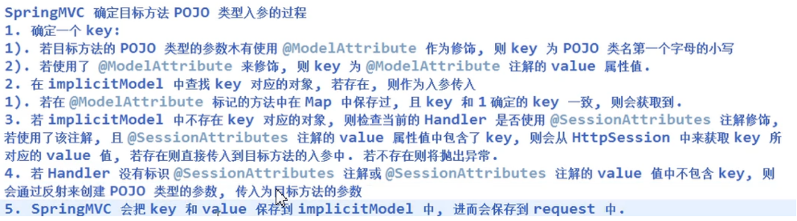

## 视图解析器流程

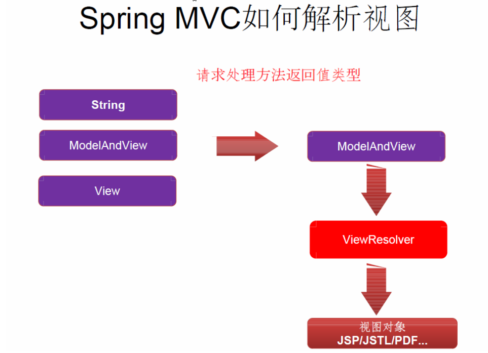

### 视图和视图解析器

> 1. 请求处理方法执行完成后，最终返回一个 ModelAndView对象。对于那些返回 String，View 或 ModeMap 等类型的处理方法，Spring MVC 也会在内部将它们装配成一个ModelAndView 对象，它包含了逻辑名和模型对象的视图
> 2. Spring MVC 借助视图解析器（ViewResolver）得到最终的视图对象（View），最终的视图可以是 JSP ，也可能是Excel、JFreeChart 等各种表现形式的视图
> 3. 对于最终究竟采取何种视图对象对模型数据进行渲染，处理器并不关心，处理器工作重点聚焦在生产模型数据的工作上，从而实现 MVC 的充分解耦

#### 视图

> 1. 视图的作用是渲染模型数据，将模型里的数据以某种形式呈现给客户。
> 2. 为了实现视图模型和具体实现技术的解耦，Spring 在org.springframework.web.servlet 包中定义了一个高度抽象的 View接口：
> 3. 视图对象由视图解析器负责实例化。由于视图是无状态的，所以他们不会有线程安全的问题（对于每一个请求都创建一个新的视图对象）

#### 常用的视图实现类

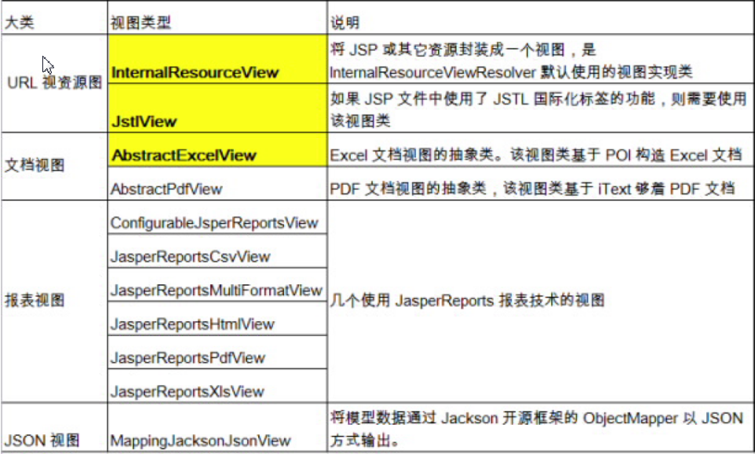

#### 视图解析器

> 1. SpringMVC 为逻辑视图名的解析提供了不同的策略，可以在 Spring WEB 上下文中配置一种或多种解析策略，并指定他们之间的先后顺序。每一种映射策略对应一个具体的视图解析器实现类。
> 2. 视图解析器的作用比较单一：将逻辑视图解析为一个具体的视图对象。
> 3. 所有的视图解析器都必须实现 ViewResolver 接口

#### 常用的视图解析器实现类

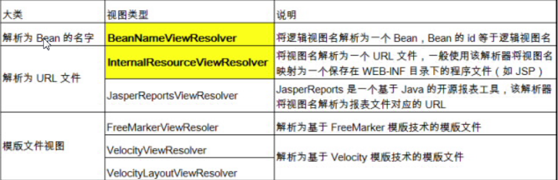

> 1. 程序员可以选择一种视图解析器或混用多种视图解析器
> 2. 每个视图解析器都实现了 Ordered 接口并开放出一个 order 属性，可以通过 order 属性指定解析器的优先顺序，order 越小优先级越高,解析器的order默认值为Integer的最大值。
> 3. SpringMVC 会按视图解析器顺序的优先顺序对逻辑视图名进行解析，直到解析成功并返回视图对象，否则将抛出 ServletException 异
>    常

#### InternalResourceViewResolver

> 1. 若项目中使用了 JSTL， 则 SpringMVC 会自动把视图由InternalResourceView 转为 JstlView
>
> 2. 若使用 JSTL 的 fmt 标签则需要在 SpringMVC 的配置文件中配置国 际化资源文件
>
>    ```xml
>        <bean id="messageSource" class="org.springframework.context.support.ResourceBundleMessageSource">
>            <property name="basename" value="i18n"/>
>        </bean>
>    ```
>
> 3. 若希望直接响应通过 SpringMVC 渲染的页面，可以使用 mvc:view-controller 标签实现
>
>    ```xml
>        <mvc:view-controller path="/success" view-name="success"/>
>        <!--配置该标签才能使@RequestMapping生效，否则全部失效-->
>        <mvc:annotation-driven/>
>    ```

#### Excel 视图

> 1. 若希望使用  Excel 展示数据列表，仅需要扩展SpringMVC 提供的 AbstractExcelView 或AbstractJExcel View 即可。实现 buildExcelDocument() 方法，在方法中使用模型数据对象构建 Excel 文档就可以了。
> 2. AbstractExcelView 基于 POI API，而 AbstractJExcelView 是基于 JExcelAPI 的。
> 3. 视图对象需要配置 IOC 容器中的一个 Bean，使用 BeanNameViewResolver 作为视图解析器即可
> 4. 若希望直接在浏览器中直接下载 Excel 文档，则可以设置响应头 Content-Disposition 的值为
>    attachment;filename=xxx.xls

#### 关于重定向

> 1. 一般情况下，控制器方法返回字符串类型的值会被当成逻 辑视图名处理
> 2. 如果返回的字符串中带 forward: 或 redirect: •前缀时，SpringMVC 会对他们进行特殊处理：将 forward: 和redirect: 当成指示符，其后的字符串作为 URL 来处理
>    redirect:success.jsp：会完成一个到 success.jsp 的重定向的操作 
>    forward:success.jsp：会完成一个到 success.jsp 的转发操作

## springmvc处理静态资源

### DispatcherServlet配置

```xml
<servlet>
        <servlet-name>springMVC</servlet-name>
        <servlet-class>org.springframework.web.servlet.DispatcherServlet</servlet-class>
        <init-param>
            <!--配置dispatcher.xml作为mvc的配置文件-->
            <param-name>contextConfigLocation</param-name>
            <param-value>classpath:dispatcher-servlet.xml</param-value>
        </init-param>
        <load-on-startup>1</load-on-startup>
    </servlet>
    <servlet-mapping>
        <servlet-name>springMVC</servlet-name>
        <url-pattern>/</url-pattern>
    </servlet-mapping>
```

> 使用以上配置，DispatcherServlet会拦截所有请求，包括静态资源和RequestMapping的映射，url-pattern还有另外一种配置方式，即*.do的形式，这样可以保证静态资源不被拦截，但是这样就不能使用restful风格的url

### 解决方案1

```xml
    <mvc:default-servlet-handler/>
    <!--配置该标签才能使@RequestMapping生效，否则全部失效-->
    <mvc:annotation-driven/>
```

> 1. 这样会在 SpringMVC 上下文中定义一个 org.springframework.web.servlet.resource.DefaultServletHttpRquestHandler，其会对进入 DispatcherServlet 的URL 进行筛选，若发现是静态资源请求，则转由 Web 应用服务器默认的 Servlet 处理，如果不是静态资源的请求，才由 DispatcherServlet 继续处理
> 2. 一般 Web 应用服务器 (包括 Tomcat、Jetty等)  默认Servlet名称都是 default，因此 DefaultServletHttpRquestHandler 可以找到。如果使用的 Web 应用服务器的默认 Servlet 名称不是 “default"，则需要通过 default-servlet-name 属性显式指定 :
>
> ```xml
> <mvc:default-servlet-handler default-servlet-name="yourServerDefaultServletName"/>
> ```

> Tomcat, Jetty, JBoss, and GlassFish  默认 Servlet的名字 -- "default"
>
> 　　Google App Engine 默认 Servlet的名字 -- "_ah_default"
>
> 　　Resin 默认 Servlet的名字 -- "resin-file"
>
> 　　WebLogic 默认 Servlet的名字  -- "FileServlet"
>
> 　　*WebSphere  默认 Servlet的名字 -- "SimpleFileServlet"*

### 解决方案2

> 使用mvc:resources
>
> 1. <mvc:default-servlet-handler/> 将静态资源的处理经由 Spring MVC 框架交回 Web 应用服务器处理。而 <mvc:resources/> 更进一步，由 Spring MVC 框架自行处理静态资源，并添加一些附加功能
> 2. <mvc:resources/> 允许静态资源放在任何地方，如 WEB-INF 目录下、类路径，甚至 JAR 包中，可以使用诸如 "classpath:" 等的资源前缀指定资源位置。可以通过 cacheSeconds 属性指定静态资源在浏览器端的缓存时间，一般设置为一年。在输出静态资源时，会根据配置设置好响应报头的 Expires 和 Cache-Control 值
> 3. 在接收静态资源的获取请求时，会检查请求头的 Last-Modified 值，如果静态资源没有发生变化，则直接返回 303 响应状态码，指示客户端使用浏览器缓存的数据，而非静态资源的内容输出到客户端，以节省带宽，提高性能
>    在 spring-mvc.xml 中的配置
>
> ```xml
> <!--对静态资源文件的访问,2个*代表多层路径-->
> <resources mapping="/resources/**" location="/resources/" />
> <resources mapping="/images/**" location="/images/" />
> <resources mapping="/js/**" location="/js/" />
> <!--配置该标签才能使@RequestMapping生效，否则全部失效-->
> <mvc:annotation-driven/>
> ```
>
> 1. /images /**映射到 ResourceHttpRequestHandler 进行处理，location指定**静态资源**的位置.可以是web application根目录下、jar包里面，这样可以把**静态资源**压缩到jar包中。cache-period可以使得**静态资源进行web cache  
> 2. 如果出现下面的错误，可能是没有配置 <**mvc**:annotation-driven /> 的原因。 报错WARNING: No mapping found for HTTP request with URI [/**mvc**/user/findUser/lisi/770] in DispatcherServlet with name 'springMVC'
> 3. 使用 <mvc:resources/>元素,把 mapping 的 URI 注册到 SimpleUrlHandlerMapping的urlMap 中,key 为 mapping 的 URI pattern值,而 value为 ResourceHttpRequestHandler,这样就巧妙的把对**静态资源**的访问由 HandlerMapping 转到ResourceHttpRequestHandler 处理并返回,所以就支持 classpath 目录, jar 包内**静态资源**的访问.另外需要注意的一点是,不要对 SimpleUrlHandlerMapping 设置 defaultHandler. 因为对 static uri 的 defaultHandler 就是ResourceHttpRequestHandler,否则无法处理static resources request.

### 解决方案3

> ## **激活Tomcat的defaultServlet来处理静态文件**
>
> ```xml
> <servlet-mapping>
>     <servlet-name>default</servlet-name>
>     <url-pattern>*.jpg</url-pattern>
> </servlet-mapping>
> <servlet-mapping>
>     <servlet-name>default</servlet-name>
>     <url-pattern>*.js</url-pattern>
> </servlet-mapping>
> <servlet-mapping>
>     <servlet-name>default</servlet-name>
>     <url-pattern>*.css</url-pattern>
> </servlet-mapping>
> ```
>
> 要配置多个，每种文件配置一个。要写在DispatcherServlet的前面， 让defaultServlet先拦截，这个就不会进入**Spring**了

### 多个HandlerMapping的执行顺序问题

> 1. DefaultAnnotationHandlerMapping 的 order 属性值是：0
>
> 2. <**mvc**:resources/ >自动注册的 SimpleUrlHandlerMapping 的 order 属性值是： 2147483646
>
> 3. <mvc:default-servlet-handler/>自动注册的 SimpleUrlHandlerMapping 的 order 属性值是：2147483647
>
>    说明：order值越小，优先级越高

### 强制浏览器更新

> 有的时候我们希望能强制更新浏览器缓存的内容，这个时候我们可以给静态资源加入一个版本的概念。大概意思是在URL中加入一个版本，每次有更新的时候都更新版本号，这样每次更新后请求的静态资源路径都不一样，浏览器也就会重新从服务端获取静态资源进行缓存了。SpringMVC对此也提供了支持，我们可以通过`<mvc:fixed-version-strategy/>`来定义一个固定的版本号，这样我们的请求路径需要重写为加上版本号，比如按照之前静态资源的配置，原本请求路径是`/static/css/common.css`，加上版本号之后就是`/static/1.0/css/common.css`，因为我们配置的请求路径映射是`/static/**`，即只需要在`**`前加上版本号作为一级目录。SpringMVC接收到请求`/static/1.0/css/common.css`会自动提取出版本号1.0,并把请求版本号与当前版本号比较，能匹配则响应去掉版本号的内容，否则就是404了
>
> ```xml
>   <mvc:resources location="/static/" mapping="/static/**" cache-period="600">
>         <!-- 指定静态资源缓存，有版本更新时通过版本号来更新 -->
>         <mvc:resource-chain resource-cache="true">
>             <mvc:resolvers>
>                 <mvc:version-resolver>
>                     <mvc:fixed-version-strategy version="1.0" patterns="/**" />
>                 </mvc:version-resolver>
>             </mvc:resolvers>
>         </mvc:resource-chain>
>     </mvc:resources>
> ```

## springmvc表单标签

> 1. 通过 SpringMVC 的表单标签可以实现将模型数据中的属性和 HTML 表单元素相绑定，以实现表单数据更便捷编辑和表单值的回显
>
> 2. form 标签
>
>    ```
>    1.一般情况下，通过 GET 请求获取表单页面，而通过POST 请求提交表单页面，因此获取表单页面和提交表单页面的 URL 是相同的。只要满足该最佳条件的契约，<form:form> 标签就无需通过 action 属性指定表单提交的 URL
>    2.可以通过 modelAttribute 属性指定绑定的模型属性，若没有指定该属性，则默认从 request 域对象中读取command 的表单 bean，如果该属性值也不存在，则会发生错误。
>    ```
>
> 3. 表单标签
>
>    ```
>    SpringMVC提供了多个表单组件标签，如<form:input/>、<form:select/> 等，用以绑定表单字段的
>    属性值，它们的共有属性如下：
>        path：表单字段，对应 html 元素的 name 属性，支持级联属性
>        htmlEscape：是否对表单值的 HTML 特殊字符进行转换，默认值为 true
>        cssClass：表单组件对应的 CSS样式类名
>        cssErrorClass：表单组件的数据存在错误时，采取的 CSS样式
>    ```
>
>    ```
>    1.form:input、form:password、form:hidden、form:textarea：对应 HTML 表单的 text、password、hidden、textarea标签
>    2.form:radiobutton：单选框组件标签，当表单 bean 对应的属性值和 value 值相等时，单选框被选中
>    3.form:radiobuttons：单选框组标签，用于构造多个单选框
>        items：可以是一个 List、String[] 或 Map
>        itemValue：指定 radio 的 value 值。可以是集合中 bean 的一个属性值
>        itemLabel：指定 radio 的 label 值
>        delimiter：多个单选框可以通过 delimiter 指定分隔符
>    ```
>
>    ```
>    form:checkbox：复选框组件。用于构造单个复选框
>    form:checkboxs：用于构造多个复选框。使用方式同form:radiobuttons 标签
>    form:select：用于构造下拉框组件。使用方式同form:radiobuttons 标签
>    form:option：下拉框选项组件标签。使用方式同form:radiobuttons 标签
>    form:errors：显示表单组件或数据校验所对应的错误
>        <form:errors path= “ *” /> ：显示表单所有的错误
>        <form:errors path= “ user*” /> ：显示所有以 user 为前缀的属性对应的错误
>        <form:errors path= “ username” /> ：显示特定表单对象属性的错误
>    ```

## 数据绑定流程

> 1. Spring MVC 主框架将 ServletRequest 对象及目标方法的入参实例传递给 WebDataBinderFactory 实例，以创建 DataBinder 实例对象
>
> 2. DataBinder 调用装配在 Spring MVC 上下文中的ConversionService 组件进行数据类型转换、数据格式
> 化工作。将 Servlet 中的请求信息填充到入参对象中
>
> 3. 调用 Validator 组件对已经绑定了请求消息的入参对象进行数据合法性校验，并最终生成数据绑定结果
> BindingData 对象
>
> 4. Spring MVC 抽取 BindingResult 中的入参对象和校验错误对象，将它们赋给处理方法的响应入参
>
> 5. Spring MVC 通过反射机制对目标处理方法进行解析，将请求消息绑定到处理方法的入参中。数据绑定的核心部件是DataBinder，运行机制如下
>
> 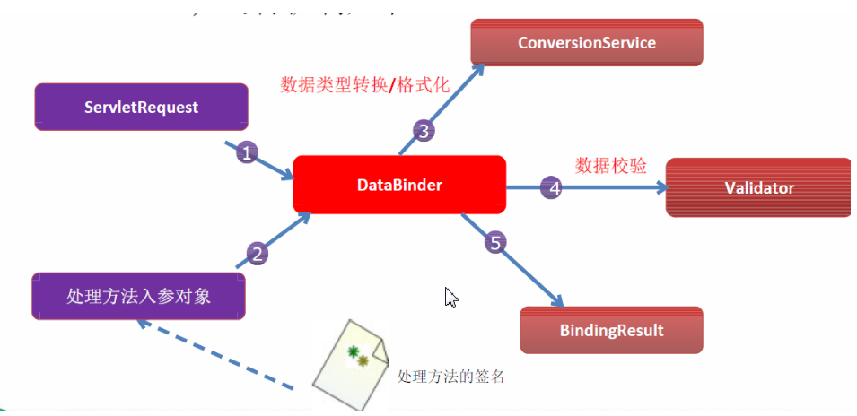
>
> 6. Spring MVC 上下文中内建了很多转换器，可完成大多数 Java 类型的转换工作

### 自定义类型装换器

> 1. ConversionService 是 Spring 类型转换体系的核心接口。
>
> 2. 可以利用 ConversionServiceFactoryBean 在 Spring 的 IOC容器中定义一个 ConversionService. Spring 将自动识别出IOC 容器中的 ConversionService，并在 Bean 属性配置及Spring MVC 处理方法入参绑定等场合使用它进行数据的转换
>
> 3. 可通过 ConversionServiceFactoryBean 的 converters 属性注册自定义的类型转换器


### Spring 支持的转换器

> Spring 定义了 3 种类型的转换器接口，实现任意一个转换器接口都可以作为自定义转换器注册到
> ConversionServiceFactroyBean 中：
>
> 1. Converter<S,T>：将 S 类型对象转为 T 类型对象
> 2. ConverterFactory：将相同系列多个 “同质” Converter 封装在一起。如果希望将一种类型的对象转换为另一种类型及其子类的对象（例如将 String 转换为 Number 及 Number 子类（Integer、Long、Double 等）对象）可使用该转换器工厂类
> 3. GenericConverter：会根据源类对象及目标类对象所在的宿主类中的上下文信息进行类型转换

### Converter<S,T>

> 定义实体类
>
> ```java
> public class Student {
>     private String name;
>     private int age;
> 
>     public String getName() {
>         return name;
>     }
> 
>     public void setName(String name) {
>         this.name = name;
>     }
> 
>     public int getAge() {
>         return age;
>     }
> 
>     public void setAge(int age) {
>         this.age = age;
>     }
> 
>     @Override
>     public String toString() {
>         return "Student{" +
>                 "name='" + name + '\'' +
>                 ", age=" + age +
>                 '}';
>     }
> }
> ```
>
> 定义类型装换器
>
> ```java
> public class MyConvertor implements Converter<String, Student> {
>     @Override
>     public Student convert(String s) {
>         String[] split = s.split(",");
>         Student student = new Student();
>         student.setName(split[0]);
>         student.setAge(Integer.parseInt(split[1]));
>         return student;
>     }
> }
> ```
>
> 注册类型装换器
>
> ```xml
> <!--必须配置conversion-service才会生效-->
> <mvc:annotation-driven conversion-service="conversionService"/>
> 
>     <bean id="conversionService" class="org.springframework.context.support.ConversionServiceFactoryBean">
>         <property name="converters">
>             <list>
>                 <bean class="com.sugar.MyConvertor"/>
>             </list>
>         </property>
>     </bean>
> ```
>
> 使用类型装换器
>
> ```java
> @Controller
> public class HelloController {
> 
>     @RequestMapping("/hello")
>     public String hello(@RequestParam("stu") Student student) {
>         System.out.println("hello" + student.getName());
>         System.out.println(student);
>         return "success";
>     }
> }
> ```

### ConverterFactory

> 定义Student类的一个子类
>
> ```java
> public class SuperStudent extends Student {
>     private String sex;
> 
>     public String getSex() {
>         return sex;
>     }
> 
>     public void setSex(String sex) {
>         this.sex = sex;
>     }
> 
>     @Override
>     public String toString() {
>         return super.toString() + "SuperStudent{" +
>                 "sex='" + sex + '\'' +
>                 '}';
>     }
> }
> ```
>
> 定义子类的类型装换器
>
> ```java
> public class SuperStudentConvertor implements Converter<String, SuperStudent> {
>     @Override
>     public SuperStudent convert(String s) {
>         String[] split = s.split(",");
>         SuperStudent student = new SuperStudent();
>         student.setName(split[0]);
>         student.setAge(Integer.parseInt(split[1]));
>         student.setSex(split[2]);
>         return student;
>     }
> }
> ```
>
> 定义类型装换器
>
> ```java
> public class MyConverterFactory implements ConverterFactory<String, Student> {
>     @Override
>     public <T extends Student> Converter<String, T> getConverter(Class<T> aClass) {
>         if (aClass == Student.class) {
>             return (Converter<String, T>) new StudentConvertor();
>         } else {
>             return (Converter<String, T>) new SuperStudentConvertor();
>         }
>     }
> }
> ```
>
> 注册类型装换器
>
> ```xml
>     <mvc:annotation-driven conversion-service="conversionService"/>
> 
>     <bean id="conversionService" class="org.springframework.context.support.ConversionServiceFactoryBean">
>         <property name="converters">
>             <list>
>                 <bean class="com.sugar.MyConverterFactory"/>
>             </list>
>         </property>
>     </bean>
> ```
>
> 使用类型装换器
>
> ```java
> @Controller
> public class HelloController {
> 
>     @RequestMapping("/hello")
>     public String hello(@RequestParam("stu") SuperStudent student) {
>         System.out.println("hello" + student.getName());
>         System.out.println(student);
>         return "success";
>     }
> }
> ```

### GenericConverter

> 关于 GenericConverter 的使用，这里也举一个例子。假设我们有一项需求是希望能通过 user的 id 或者 username 直接转换为对应的 user 对象，那么我们就可以针对于 id 和 username 来建立一个 GenericConverter 。这里假设 id 是 int 型，而 username 是 String 型的，所以我们的GenericConverter 可以这样来写
>
> ```java
> public class UserGenericConverter implements GenericConverter {
>  
>     @Autowired
>     private UserService userService;
>    
>     @Override
>     public Object convert(Object source, TypeDescriptor sourceType,
>            TypeDescriptor targetType) {
>        if (source == null || sourceType == TypeDescriptor.NULL || targetType == TypeDescriptor.NULL) {
>            return null;
>        }
>        User user = null;
>        if (sourceType.getType() == Integer.class) {
>            user = userService.findById((Integer) source);//根据id来查找user
>        } else if (sourceType.getType() == String.class) {
>            user = userService.find((String)source);//根据用户名来查找user
>        }
>        return user;
>     }
>  
>     @Override
>     public Set<ConvertiblePair> getConvertibleTypes() {
>        Set<ConvertiblePair> pairs = new HashSet<ConvertiblePair>();
>        pairs.add(new ConvertiblePair(Integer.class, User.class));
>        pairs.add(new ConvertiblePair(String.class, User.class));
>        return pairs;
>     }
>  
> }
> ```
>
> 1. 我们可以看到在上面定义的 UserGenericConverter 中，我们在 getConvertibleTypes 方法中添加了两组转换的组合， Integer 到 User 和 String 到 User 。然后我们给 UserGenericConverter注入了一个 UserService ，在 convert 方法中我们简单的根据原类型是 Integer 还是 String 来判断传递的原数据是 id 还是 username ，并利用UserService 对应的方法返回相应的 User 对象
> 2. GenericConverter注册方法同Converter 接口

### 总结

> 虽然 Converter 接口、 ConverterFactory 接口和 GenericConverter 接口之间没有任何的关系，但是 Spring 内部在注册 Converter 实现类和 ConverterFactory 实现类时是先把它们转换为GenericConverter ，之后再统一对 GenericConverter 进行注册的。也就是说 Spring 内部会把Converter 和 ConverterFactory 全部转换为 GenericConverter 进行注册，在 Spring 注册的容器中只存在 GenericConverter 这一种类型转换器。我想之所以给用户开放 Converter 接口和ConverterFactory 接口是为了让我们能够更方便的实现自己的类型转换器。基于此， Spring 官方也提倡我们在进行一些简单类型转换器定义时更多的使用 Converter 接口和 ConverterFactory 接口，在非必要的情况下少使用 GenericConverter 接口。

### ConditionalGenericConverter 

> 对于 GenericConverter 接口 Spring 还为我们提供了一个它的子接口，叫做ConditionalGenericConverter ，在这个接口中只定义了一个方法： matches 方法。我们一起来看一下 ConditionalGenericConverter 接口的定义
>
> ```java
> public interface ConditionalGenericConverter extends GenericConverter {
>  
>     boolean matches(TypeDescriptor sourceType, TypeDescriptor targetType);
>    
> }
> ```
>
> 顾名思义，从 `Conditional `我们就可以看出来这个接口是用于定义有条件的类型转换器的，也就是说不是简单的满足类型匹配就可以使用该类型转换器进行类型转换了，必须要满足某种条件才能使用该类型转换器。而该类型转换器的条件控制就是通过 `ConditionalGenericConverter` 接口的`matches` 方法来实现的。关于 `ConditionalGenericConverter` 的使用 Spring 内部已经实现了很多，这里我们来看一个 Spring 已经实现了的将 String 以逗号分割转换为目标类型数组的实现：
>
> ```java
> final class StringToArrayConverter implements ConditionalGenericConverter {
>  
>     private final ConversionService conversionService;
>  
>     public StringToArrayConverter(ConversionService conversionService) {
>        this.conversionService = conversionService;
>     }
>  
>     public Set<ConvertiblePair> getConvertibleTypes() {
>        return Collections.singleton(new ConvertiblePair(String.class, Object[].class));
>     }
>  
>     public boolean matches(TypeDescriptor sourceType, TypeDescriptor targetType) {
>        return this.conversionService.canConvert(sourceType, targetType.getElementTypeDescriptor());
>     }
>  
>     public Object convert(Object source, TypeDescriptor sourceType, TypeDescriptor targetType) {
>        if (source == null) {
>            return null;
>        }     
>        String string = (String) source;
>        String[] fields = StringUtils.commaDelimitedListToStringArray(string);
>         //target实际上是一个数组
>        Object target = Array.newInstance(targetType.getElementType(), fields.length);
>        for (int i = 0; i < fields.length; i++) {
>            Object sourceElement = fields[i];
>            Object targetElement = this.conversionService.convert(sourceElement, sourceType, targetType.getElementTypeDescriptor());
>            Array.set(target, i, targetElement);
>        }
>        return target;
>     }
>  
> }
> ```
>
> 我们可以看到这个 `StringToArrayConverter `就是实现了` ConditionalGenericConverter `接口的。根据里面的 `matches `方法的逻辑我们知道当我们要把一个字符串转换为一个数组的时候，只有我们已经定义了一个字符串到这个目标数组元素对应类型的类型转换器时才可以使用`StringToArrayConverter `进行类型转换。也就是说假如我们已经定义了一个 `String `到` User` 的类型转换器，那么当我们需要将 `String `转换为对应的 `User` 数组的时候，我们就可以直接使用 `Spring `为我们提供的 `StringToArrayConverter` 了。

## mvc:annotation-driven

> 1. `<mvc:annotation-driven />` 会自动注册`RequestMappingHandlerMapping`、`RequestMappingHandlerAdapter `与`ExceptionHandlerExceptionResolver` 三个bean。
>
> 2. 还将提供以下支持：
>    支持使用 `ConversionService` 实例对表单参数进行类型转换
>    支持使用 `@NumberFormat annotation`、`@DateTimeFormat`注解完成数据类型的格式化
>    支持使用 `@Valid` 注解对 JavaBean 实例进行 JSR 303 验证
>    支持使用 `@RequestBody `和 `@ResponseBody` 注解
>
> 3. 加与不加该配置的区别
>
>    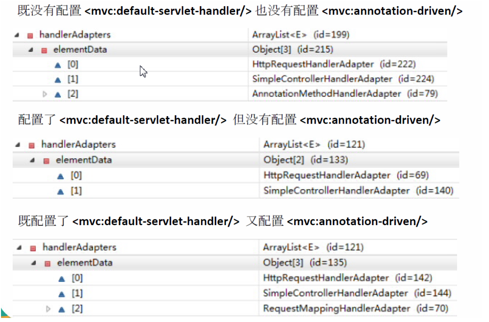

## @InitBinder

> 1. 由 `@InitBinder` 标识的方法，可以对 `WebDataBinder` 对象进行初始化。`WebDataBinder `是 `DataBinder `的子类，用于完成由表单字段到 JavaBean 属性的绑定
>
> 2. `@InitBinder`方法不能有返回值，它必须声明为`void`。
>
> 3. `@InitBinder`方法的参数通常是是 `WebDataBinder`
>
> 4. `@InitBinder`只在`@Controller`中注解方法来为这个控制器注册一个绑定器初始化方法，方法只对本控制器有效
>
> ```java
>     @InitBinder
>     public void initBinder(WebDataBinder dataBinder){
>         //在进行数据绑定时，不自动绑定对象的name属性，另行处理
>         dataBinder.setDisallowedFields("name");
>     }
> ```
>
> 5. 用法举例：比如表单中有多选按钮，对应的是JaveBean中的一个集合属性，然而选择的是id，而集合保存的确实类，这里我们就不能任SpringMVC自动绑定，需要我们手动绑定，所以就关闭其的自动绑定，不然会报错！
### 注册编辑器

> `WebDataBinder`是用来绑定请求参数到指定的属性编辑器.由于前台传到`controller`里的值是`String`类型的，当往`Model`里Set这个值的时候，如果set的这个属性是个对象，Spring就会去找到对应的`editor`进行转换，然后再set进去！Spring自己提供了大量的实现类（如下图所示的在`org.springframwork.beans.propertyEditors`下的所有`editor`），诸如`CustomDateEditor `，`CustomBooleanEditor`，`CustomNumberEditor`等许多，基本上够用。  在平时使用`SpringMVC`时，会碰到`javabean`中有Date类型参数，表单中传来代表日期的字符串转化为日期类型，SpringMVC默认不支持这种类型的转换。我们就需要手动设置时间格式并在`webDateBinder`上注册这个编辑器！
>
> 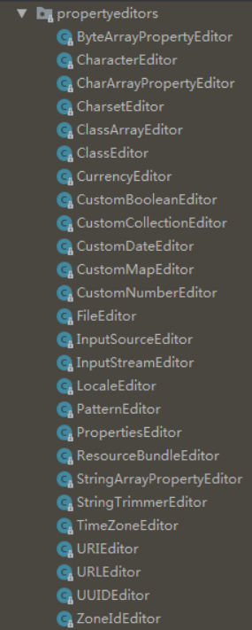
>
#### 注册一个Date类型的编辑器

>
> ```java
> 
>     @InitBinder
>     public void initBinder(WebDataBinder binder) {
>         //CustomDateEditor是spring提供的类，使用它直接传入对应的构造参数即可
>         CustomDateEditor editor = new CustomDateEditor(new SimpleDateFormat("yyyy-MM-dd"),true);
>         binder.registerCustomEditor(Date.class, editor);
>     }
> ```
>
#### 注册自定义编辑器

>
>使用自定义编辑器就是在第二个的基础上添加个自定义编辑器就行了，自定义的编辑器类需要继承`org.springframework.beans.propertyeditors.PropertiesEditor`
>
>```java
>public class DoubleEditor extends PropertyEditorSupport {
>   @Override
>   public void setAsText(String text) throws IllegalArgumentException {
>       if (text == null || text.equals("")) {
>           text = "0";
>       }
>       setValue(Double.parseDouble(text));
>   }
>
>   @Override
>   public String getAsText() {
>       return getValue().toString();
>   }
>}
>```
>
>```java
>   @InitBinder
>   public void initBinder(WebDataBinder dataBinder) {
>       dataBinder.registerCustomEditor(Double.class, new DoubleEditor());
>   }
>```
>
#### 设置属性的前缀实现参数绑定

> jsp代码
>
> ```jsp
> <form action="/testBean" method="post">
>     name: <input type="text" name="u.name"> <br>
>     age: <input type="text" name="u.age"> <br>
>     name: <input type="text" name="s.name"> <br>
>     age: <input type="text" name="s.age"> <br>
>     <input type="submit">
> </form>
> ```
>
> controller
>
> @InitBinder注解标注的方法传入的WebDataBinder不是同一个对象
>
> ```java
>     @InitBinder("user")
>     public void init1(WebDataBinder binder) {
>         binder.setFieldDefaultPrefix("u.");
>     }
>  
>     @InitBinder("stu")
>     public void init2(WebDataBinder binder) {
>         binder.setFieldDefaultPrefix("s.");
>     }
>  
>     @RequestMapping("/testBean")
>     public ModelAndView testBean(User user, @ModelAttribute("stu") Student stu) {
>         System.out.println(stu);
>         System.out.println(user);
>         String viewName = "success";
>         ModelAndView modelAndView = new ModelAndView(viewName);
>         modelAndView.addObject("user", user);
>         modelAndView.addObject("student", stu);
>         return modelAndView;
>  
>     }
> ```
>
> `@InitBinder("user")`括号内的参数为类的首字母小写(默认命名规则),也可以用`@ModelAttribute("stu")`做限定.

## 数据格式化

> 1. 对属性对象的输入/输出进行格式化，从其本质上讲依然属于 “类型转换” 的范畴。
>
> 2. `Spring `在格式化模块中定义了一个实现`ConversionService `接口的`FormattingConversionService `实现类，该实现类扩展了 `GenericConversionService`，因此它既具有类型转换的功能，又具有格式化的功能
>
> 3. `FormattingConversionService `拥有一个`FormattingConversionServiceFactroyBean `工厂类，后者用于在 Spring 上下文中构造前者
>
> 4. `FormattingConversionServiceFactroyBean`内部已经注册了 :
>
>    `NumberFormatAnnotationFormatterFactroy`：支持对数字类型的属性使用 `@NumberFormat` 注解
>    `JodaDateTimeFormatAnnotationFormatterFactroy`：支持对日期– 类型的属性使用 `@DateTimeFormat` 注解
>
> 5. 装配了` FormattingConversionServiceFactroyBean` 后，就可以在 Spring MVC 入参绑定及模型数据输出时使用注解驱动了。`<mvc:annotation-driven/> `默认创建的`ConversionService `实例即为`FormattingConversionServiceFactroyBean`

### 日期格式化

> @DateTimeFormat 注解可对java.util.Date、java.util.Calendar、java.long.Long 时间类型进行标注：
>
> > 1. pattern 属性：类型为字符串。指定解析/格式化字段数据的模式， 如：”yyyy-MM-dd hh:mm:ss”
> > 2. iso 属性：类型为 DateTimeFormat.ISO。指定解析/格式化字段数据 的ISO模式，包括四种：ISO.NONE（不使用） -- 默认、ISO.DATE(yyyy-MM-dd) 、ISO.TIME(hh:mm:ss.SSSZ)、
> >    ISO.DATE_TIME(yyyy-MM-dd hh:mm:ss.SSSZ)
> > 3. style 属性：字符串类型。通过样式指定日期时间的格式，由两位字符组成，第一位表示日期的格式，第二位表示时间的格式：S：短日期/时间格式、M：中日期/时间格式、L：长日期/时间格式、F：完整日期/时间格式、-：忽略日期或时间格式

### 数值格式化

> @NumberFormat • 可对类似数字类型的属性进行标注，它拥有两个互斥的属性：
>
> > 1. style：类型为 NumberFormat.Style。用于指定– 样式类型，包括三种：Style.NUMBER（正常数字类型）、Style.CURRENCY（货币类型）、 Style.PERCENT（百分数类型）
> > 2. pattern：类型为 String，自定义样式，如patter="#,###"；

### 示例

```java
@NumberFormat(pattern="#,###,###.#")
private Float price;
@DateTimeFormat(pattern="yyyy-MM-dd")
private Date productionDate;
```

### 注意

> 1. 若想要使用springmvc提供的格式化功能，又想使用自定义的类型转换器，需要使用`FormattingConversionServiceFactoryBean`替换`ConversionServiceFactoryBean`
>
>    ```xml
>    <!--必须配置conversion-service才会生效-->
>    <mvc:annotation-driven conversion-service="conversionService"/>
>    
>     <bean id="conversionService" class="org.springframework.context.support.FormattingConversionServiceFactoryBean">
>         <property name="converters">
>             <list>
>                 <bean class="com.sugar.MyConvertor"/>
>             </list>
>         </property>
>     </bean>
>    ```
>
> 2. 获取springmvc类型转换或格式化结果，在方法上注入`BindingResult `
>
>    ```java
>    public String saveProduct(@ModelAttribute Product product,
>               BindingResult bindingResult, Model model) {
>            if(bindingResult.getErrorCount() > 0)
>            {
>                System.out.println("出错了");
>                for(FieldError  error : bindingResult.getFieldErrors())
>                {
>                    System.out.println(error.getField() +" : "+error.getDefaultMessage());
>                }
>            }
>       }
>    ```

## JSR303数据校验

> 1. 使用JSR303验证标准
> 2. 加入hibernate validate验证框架相关的jar包
> 3. 配置mvc:annotation-driven
> 4. 在需要进行数据校验的bean的属性上使用对应的注解
> 5. 在controller层的方法对应的需要校验的bean前面添加@valid注解

### JSR303

> 1. JSR 303 是 Java 为 Bean 数据合法性校验提供的标准框架，它已经包含在 JavaEE 6.0 中 .
>
> 2. JSR 303 通过在 Bean 属性上标注类似于 @NotNull、@Max 等标准的注解指定校验规则，并通过标准的验证接口对 Bean 进行验证
>
> 3. JSR定义的校验类型
>
>    ```
>    空检查
>    @Null       验证对象是否为null
>    @NotNull    验证对象是否不为null, 无法查检长度为0的字符串
>    @NotBlank 检查约束字符串是不是Null还有被Trim的长度是否大于0,只对字符串,且会去掉前后空格.
>    @NotEmpty 检查约束元素是否为NULL或者是EMPTY.
>     
>    Booelan检查
>    @AssertTrue     验证 Boolean 对象是否为 true  
>    @AssertFalse    验证 Boolean 对象是否为 false  
>     
>    长度检查
>    @Size(min=, max=) 验证对象（Array,Collection,Map,String）长度是否在给定的范围之内  
>    @Length(min=, max=) Validates that the annotated string is between min and max included.
>     
>    日期检查
>    @Past           验证 Date 和 Calendar 对象是否在当前时间之前  
>    @Future     验证 Date 和 Calendar 对象是否在当前时间之后  
>    @Pattern    验证 String 对象是否符合正则表达式的规则
>     
>    数值检查，建议使用在Stirng,Integer类型，不建议使用在int类型上，因为表单值为“”时无法转换为int，但可以转换为Stirng为"",Integer为null
>    @Min            验证 Number 和 String 对象是否大等于指定的值  
>    @Max            验证 Number 和 String 对象是否小等于指定的值  
>    @DecimalMax 被标注的值必须不大于约束中指定的最大值. 这个约束的参数是一个通过BigDecimal定义的最大值的字符串表示.小数存在精度
>    @DecimalMin 被标注的值必须不小于约束中指定的最小值. 这个约束的参数是一个通过BigDecimal定义的最小值的字符串表示.小数存在精度
>    @Digits     验证 Number 和 String 的构成是否合法  
>    @Digits(integer=,fraction=) 验证字符串是否是符合指定格式的数字，interger指定整数精度，fraction指定小数精度。
>     
>    @Range(min=, max=) 检查数字是否介于min和max之间.
>    @Range(min=10000,max=50000,message="range.bean.wage")
>     
>    @Valid 递归的对关联对象进行校验, 如果关联对象是个集合或者数组,那么对其中的元素进行递归校验,如果是一个map,则对其中的值部分进行校验.(是否进行递归验证)
>    @CreditCardNumber信用卡验证
>    @Email  验证是否是邮件地址，如果为null,不进行验证，算通过验证。
>    @ScriptAssert(lang= ,script=, alias=)
>    @URL(protocol=,host=, port=,regexp=, flags=)
>    ```

### Hibernate Validator 扩展注解

> `Hibernate Validator` 是 JSR 303 的一个参考实现，除支持所有标准的校验注解外，它还支持以下的扩展注解
>
> ```
> @NotEmpty 检查约束元素是否为NULL或者是EMPTY.
> @Length(min=, max=) 字符串长度必须在指定范围之内
> @Email  验证是否是邮件地址，如果为null,不进行验证，算通过验证。
> @Range(min=, max=) 检查数字是否介于min和max之间.
> ```

### Spring MVC 数据校验

> 1. Spring 4.0 拥有自己独立的数据校验框架，同时支持 JSR303 标准的校验框架。
> 2. Spring 在进行数据绑定时，可同时调用校验框架完成数据校验工作。在 Spring MVC 中，可直接通过注解驱动的方式进行数据校验
> 3. Spring 的 `LocalValidatorFactroyBean `既实现了 Spring 的`Validator `接口，也实现了 JSR 303 的 `Validator` 接口。只要在 Spring 容器中定义了一个`LocalValidatorFactoryBean`，即可将其注入到需要数据校验的 Bean 中。
> 4. Spring 本身并没有提供 JSR303 的实现，所以必须将JSR303 的实现者的 jar 包放到类路径下
> 5. `<mvc:annotation-driven/> `会默认装配好一个 `LocalValidatorFactoryBean`，通过在处理方法的入参上标注 `@valid `注解即可让 Spring MVC 在完成数据绑定后执行数据校验的工作
> 6. 在已经标注了 JSR303 注解的表单/命令对象前标注一个` @Valid`，Spring MVC 框架在将请求参数绑定到该入参对象后，就会调用校验框架根据注解声明的校验规则实施校验
> 7. Spring MVC 是通过对处理方法签名的规约来保存校验结果的：前一个表单/命令对象的校验结果保存到随后的入参中，这个保存校验结果的入参必须是` BindingResult `或`Errors `类型，这两个类都位于
>    `org.springframework.validation` 包中
> 8. **需校验的 Bean 对象和其绑定结果对象或错误对象时成对出现的，它们之间不允许声明其他的入参,因为可以对多个参数进行校验，所以将对不同bean的校验结果存放到指定bean的后一个参数中**
> 9. `Errors `接口提供了获取错误信息的方法，如 `getErrorCount() `或`getFieldErrors(String field) `
> 10. `BindingResult `扩展了 `Errors `接口

### 在目标方法中获取校验结果

> 1. 在表单/命令对象类的属性中标注校验注解，在处理方法对应的入参前添加 @Valid，Spring MVC 就会实施校验并将校验结果保存在被校验入参对象之后的 BindingResult 或Errors 入参中。
>
> 2. 常用方法： 
>
>    FieldError getFieldError(String field) :获取指定属性的错误信息
>    List<FieldError> getFieldErrors() ：获取所有属性的错误信息
>    Object getFieldValue(String field) ：获取属性值
>    Int getErrorCount()：获取错误属性个数

### 在页面上显示错误

> 1. Spring MVC 除了会将表单/命令对象的校验结果保存到对应的 BindingResult 或 Errors 对象中外，还会将所有校验结果保存到 “隐含模型”
> 2. 即使处理方法的签名中没有对应于表单/命令对象的结果入参，校验结果也会保存在 “隐含对象” 中。
> 3. 隐含模型中的所有数据最终将通过 HttpServletRequest 的属性列表暴露给 JSP 视图对象，因此在 JSP 中可以获取错误信息
> 4. 在 JSP 页面上可通过 <form:errors path=“userName”>显示错误消息，使用*可以显示所有错误信息

### 提示消息的国际化

> 1. 每个属性在数据绑定和数据校验发生错误时，都会生成一个对应的 FieldError 对象。
>
> 2. 当一个属性校验失败后，校验框架会为该属性生成 4 个消 息代码，这些代码以校验注解类名为前缀，结合modleAttribute、属性名及属性类型名生成多个对应的消息代码：例如 User 类中的 password 属性标准了一个 @Pattern 注解，当该属性值不满足 @Pattern 所定义的规则时, 就会产生以下 4个错误代码：
>    Pattern.user.password 
>    Pattern.password 
>    Pattern.java.lang.String 
>    Pattern 
>
> 3. 当使用 Spring MVC 标签显示错误消息时， Spring MVC 会查看WEB 上下文是否装配了对应的国际化消息，如果没有，则显示默认的错误消息，否则使用国际化消息。
>
> 4. 若数据类型转换或数据格式转换时发生错误，或该有的参 数不存在，或调用处理方法时发生错误，都会在隐含模型中创建错误消息。其错误代码前缀说明如下：
>    required：必要的参数不存在。如 @RequiredParam(“param1”) 标注了一个入参，但是该参数不存在
>    typeMismatch：在数据绑定时，发生数据类型不匹配的问题 
>    methodInvocation：Spring MVC 在调用处理方法时发生了错误 
>
> 5. 注册国际化资源文件 
>
>    ```xml
>    <!-- 国际化 -->
>         <bean id="messageSource" class="org.springframework.context.support.ResourceBundleMessageSource">
>             <!-- 配置国际化文件的名称 -->
>           <property name="basenames" value="i18n"></property>
>         </bean>
>    ```

## 处理JSON

> 1. 添加jar包
>
>    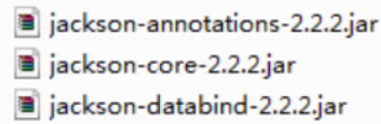
>
> 2. 编写目标方法，使其返回 JSON 对应的对象或集合
>
> 3. 在方法上添加 @ResponseBody 注解

## springmvc全局异常处理

### 使用@ControllerAdvice

[SpringMVC实现全局异常处理器](https://blog.csdn.net/hbtj_1216/article/details/81102063)

## properties文件映射map

> 使用PropertiesFactoryBean读取配置文件，location属性指定路径

## springmvc处理图片、视频等静态资源

```java
@Component
public class NonStaticResourceHttpRequestHandler extends ResourceHttpRequestHandler {

    public final static String ATTR_FILE = "NON-STATIC-FILE";

    @Override
    protected Resource getResource(HttpServletRequest request) {
        final Path filePath = (Path) request.getAttribute(ATTR_FILE);
        return new FileSystemResource(filePath.toFile());
    }

}

@RestController
public class FileRestController {

    private final NonStaticResourceHttpRequestHandler nonStaticResourceHttpRequestHandler;

    /**
     * 预览视频文件, 支持 byte-range 请求
     */
    @RequestMapping("/video")
    public void videoPreview(HttpServletRequest request, HttpServletResponse response) throws Exception {
        String path = request.getParameter("path");
        Path filePath = Paths.get(path);
        if (Files.exists(filePath)) {
            String mimeType = Files.probeContentType(filePath);
            if (!StringUtils.isEmpty(mimeType)) {
                response.setContentType(mimeType);
            }
            request.setAttribute(NonStaticResourceHttpRequestHandler.ATTR_FILE, filePath);
            nonStaticResourceHttpRequestHandler.handleRequest(request, response);
        } else {
            response.setStatus(HttpServletResponse.SC_NOT_FOUND);
            response.setCharacterEncoding(StandardCharsets.UTF_8.toString());
        }
    }

}
```

