## 说明

以下源码基于spring5.2.1.RELEASE

## 目录

## 基于配置类使用spring

> - @Configuration:告诉spring这是一个配置类
> - @Bean:向spring注入一个bean

### 配置类

```java
@Configuration
public class SpringConfig {

    /**
     * 默认使用方法名作为beanid，也可使用@Bean的value配置
     */
    @Bean("person2")
    public Person person() {
        return new Person("zhangsan", 15);
    }

}
```

### 使用

```java
public class App {
    public static void main(String[] args) {
        ApplicationContext app = new AnnotationConfigApplicationContext(SpringConfig.class);
        Person person = app.getBean(Person.class);
        System.out.println(person);
    }
}
```

## spring常用注解

### @ComponentScan

#### 功能

> - 组件扫描器，可以指定扫描指定包下面的所有组件(basePackages)，也可以根据过滤规则指定包含或排除某些组件
> - 默认会扫描指定包下面所有的组件

#### 配置包含规则

> 需要关闭默认过滤规则

```java
@ComponentScan(basePackages = {"com.sugar"}, includeFilters = {
        @ComponentScan.Filter(type = FilterType.ANNOTATION, classes = {Controller.class})}, useDefaultFilters = false)
```

#### 配置排除规则

> 需要打开默认过滤规则

```java
@ComponentScan(basePackages = {"com.sugar"}, excludeFilters = {
        @ComponentScan.Filter(type = FilterType.ANNOTATION, classes = {Controller.class})}, useDefaultFilters = true)
```

#### 自定义包含规则

```java
@ComponentScan(basePackages = {"com.sugar"}, includeFilters = {
        @ComponentScan.Filter(type = FilterType.CUSTOM, classes = {MyTypeFilter.class})}, useDefaultFilters = false)


public class MyTypeFilter implements TypeFilter {
    @Override
    public boolean match(MetadataReader metadataReader, MetadataReaderFactory metadataReaderFactory) throws IOException {
        AnnotationMetadata annotationMetadata = metadataReader.getAnnotationMetadata();
        ClassMetadata classMetadata = metadataReader.getClassMetadata();
        String className = classMetadata.getClassName();
        if(className.contains("ller")){
            return true;
        }
        return false;
    }
}
```

#### useDefaultFilters说明

> - 从源码可以看出，当useDefaultFilters=true时，就会扫描所有@Component的组件，所以设置includeFilters没用，因为所有组件已经扫描进容器了，不需要再次添加
> - 所以设置excludeFilters可以生效，当容器扫描完成后，从容器排除指定规则的bean

```java
public ClassPathBeanDefinitionScanner(BeanDefinitionRegistry registry, boolean useDefaultFilters,
      Environment environment, @Nullable ResourceLoader resourceLoader) {

   Assert.notNull(registry, "BeanDefinitionRegistry must not be null");
   this.registry = registry;

   if (useDefaultFilters) {
       //注册@Component组件
      registerDefaultFilters();
   }
   setEnvironment(environment);
   setResourceLoader(resourceLoader);
}

	protected void registerDefaultFilters() {
		this.includeFilters.add(new AnnotationTypeFilter(Component.class));
		...
	}
```

##### 代码执行链

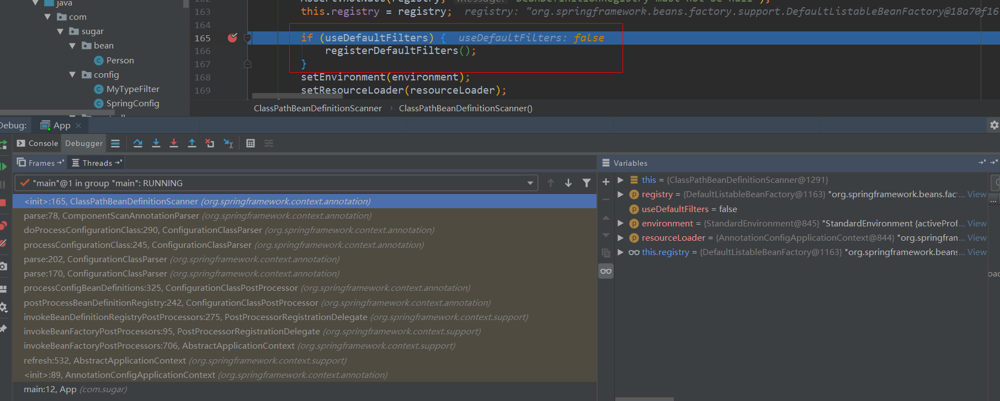

### @Scope

> - 声明bean的作用域，有4个取值
>
> - ```java
>   * @see ConfigurableBeanFactory#SCOPE_PROTOTYPE  //单例，容器启动时创建
>   * @see ConfigurableBeanFactory#SCOPE_SINGLETON  //多例，使用时创建
>   * @see org.springframework.web.context.WebApplicationContext#SCOPE_REQUEST  //同一个request单例
>   * @see org.springframework.web.context.WebApplicationContext#SCOPE_SESSION  //同一个session单例
>   ```
> ```
> 
> ```
>
> ```
> 
> ```
>
> ```
> 
> ```
>
> ```
> 
> ```
>
> ```
> 
> ```
>
> ```
> 
> ```
>
> ```
> 
> ```
>
> ```
> 
> ```
>
> ```
> 
> ```
>
> ```
> 
> ```
>
> ```
> 
> ```
>
> ```
> 
> ```
>
> ```
> 
> ```
>
> ```
> 
> ```
>
> ```
> 
> ```
>
> ```
> 
> ```
>
> ```
> 
> ```

### @Lazy

> - 针对单例bean会在spring容器创建时初始化，使用该注解可以使bean在第一次使用时初始化

### @Conditional

> 根据条件注册bean,自定义过滤规则需要实现org.springframework.context.annotation.Condition接口

#### 示例

> 使容器在windows和linux加载不同的bean

```java
/**
 * windows环境注册bean
 */
public class WindowsCondition implements Condition {
    @Override
    public boolean matches(ConditionContext context, AnnotatedTypeMetadata metadata) {
        ConfigurableListableBeanFactory beanFactory = context.getBeanFactory();
        Environment environment = context.getEnvironment();
        String osName = environment.getProperty("os.name");
        return osName.contains("Windows");
    }
}
```

#### 使用

```java
@Configuration
public class SpringConfig {
    @Bean
    public Person person() {
        return new Person("zhangsan", 15);
    }
    
    @Bean
    @Conditional(WindowsCondition.class)
    public Person lisi() {
        return new Person("lisi", 15);
    }
    
    @Bean
    @Conditional(LinuxCondition.class)
    public Person wangwu() {
        return new Person("wangwu", 15);
    }
}
```

### @Import

> 向spring容器导入组件，参数为数组，这种方式导入spring后，bean的名称是类的**全类名**
>
> ```java
> /**
>  * 导入Dog和MyImportSelector规则指定的bean
>  */
> @Configuration
> @Import({Dog.class, MyImportSelector.class})
> public class SpringConfig {
>     @Bean
>     public Person person() {
>         return new Person("zhangsan", 15);
>     }
> 
> }
> 
> //自定义导入规则
> public class MyImportSelector implements ImportSelector {
>     @Override
>     public String[] selectImports(AnnotationMetadata importingClassMetadata) {
>         return new String[]{"com.sugar.bean.Cat"};
>     }
> }
> ```

#### 通过ImportBeanDefinitionRegistrar注册bean

```java
public class MyImportBeanDefinitionRegistrar implements ImportBeanDefinitionRegistrar {
    @Override
    public void registerBeanDefinitions(AnnotationMetadata importingClassMetadata, BeanDefinitionRegistry registry) {
        boolean a = registry.containsBeanDefinition("com.sugar.bean.Cat");
        boolean b = registry.containsBeanDefinition("com.sugar.bean.Dog");
        //当容器中包含Cat和Dog时才注册pig
        if (a && b) {
            RootBeanDefinition rootBeanDefinition = new RootBeanDefinition(Pig.class);
            registry.registerBeanDefinition("pig", rootBeanDefinition);
        }
    }
}

@Configuration
@Import({Dog.class, Cat.class, MyImportBeanDefinitionRegistrar.class})
public class SpringConfig {
    @Bean
    public Person person() {
        return new Person("zhangsan", 15);
    }

}
```

#### 使用FactoryBean导入组件

##### 自定义FactoryBean

```java
public class MyFactoryBean implements FactoryBean<Dog> {

    public MyFactoryBean() {
        System.out.println("MyFactoryBean 创建");
    }

    @Override
    public Dog getObject() throws Exception {
        return new Dog();
    }

    @Override
    public Class<?> getObjectType() {
        return Dog.class;
    }

    @Override
    public boolean isSingleton() {
        return true;
    }
}
```

##### 配置FactoryBean

```java
@Configuration
public class SpringConfig {
    @Bean
    public Person person() {
        return new Person("zhangsan", 15);
    }

    @Bean
    public MyFactoryBean myFactoryBean(){
        return new MyFactoryBean();
    }

}
```

##### 使用

```java
public class App {
    public static void main(String[] args) throws Exception {
        ApplicationContext app = new AnnotationConfigApplicationContext(SpringConfig.class);
        for (String name : app.getBeanDefinitionNames()) {
            System.out.println(name);
        }

        //获取到FactoryBean内部创建的Dog，而不是FactoryBean
        Object myFactoryBean = app.getBean("myFactoryBean");
        System.out.println(myFactoryBean);

        //添加&前缀获取FactoryBean本身
        Object myFactoryBean2 = app.getBean("&myFactoryBean");
        System.out.println(myFactoryBean2);
    }
}
```

### @Value

> 对bean的属性进行赋值，支持3种方式
>
> - 字符串
> - spring el表达式
> - properties配置文件属性

#### Person

```java
@Data
public class Person {
    @Value("zhangsan")
    private String name;
    @Value("#{20-2}")
    private int age;
    @Value("${person.sex}")
    private String sex;

    public Person() {
        System.out.println("person constructor");
    }

}
```

#### SpringConfig

> 指定encoding避免中文乱码

```java
@Configuration
@ComponentScan(basePackages = {"com.sugar"})
@PropertySource(value = "classpath:person.properties",encoding = "UTF-8")
public class SpringConfig {
    @Bean
    public Person person() {
        return new Person();
    }

}
```

#### App

> spring实际上是把配置文件加载到ConfigurableEnvironment

```java
public class App {
    public static void main(String[] args) throws Exception {
        AnnotationConfigApplicationContext app = new AnnotationConfigApplicationContext(SpringConfig.class);
        for (String name : app.getBeanDefinitionNames()) {
            System.out.println(name);
        }

        Person person = app.getBean(Person.class);
        System.out.println(person);

        ConfigurableEnvironment environment = app.getEnvironment();
        System.out.println(environment.getProperty("person.sex"));

        app.close();
    }
}
```

### @Autowired

> - 功能：自动从spring容器注入属性，当容器中对于同一个类型有多个实例时，可以配合@Qualifier装配指定的bean
>
> - @Resource：JSR250标准注解，按名称注入属性
>
> - 注意：当一个bean同时被@ComponentScan和@Bean标注为组件，使用@Autowired注入的是@Bean标注的，也可以使用@Primary指定bean的优先级，标注了该注解优先级最高，自动装配时优先使用该注解标注的bean
>
> - @Primary和@Qualifier同时存在时，会按@Qualifier指定的名称加载bean

#### @Autowired、@Resource、@Inject的区别

| 注解       | 支持@Primary | 支持required | 来源   |
| ---------- | ------------ | ------------ | ------ |
| @Autowired | 是           | 是           | spring |
| @Resource  | 否           | 否           | JSR250 |
| @Inject    | 是           | 否           | JSR330 |

## spring bean的生命周期

### 初始化和销毁

> - 执行流程：容器创建-->创建person-->person init-->容器创建完成-->容器销毁-->person destroy
>
> - bean的销毁**只针对单例bean**，多例bean不会生效

```java
@Configuration
public class SpringConfig {
    @Bean(initMethod = "init",destroyMethod = "destroy")
    public Person person() {
        return new Person("zhangsan", 15);
    }

}

public class App {
    public static void main(String[] args) throws Exception {
        AnnotationConfigApplicationContext app = new AnnotationConfigApplicationContext(SpringConfig.class);
        for (String name : app.getBeanDefinitionNames()) {
            System.out.println(name);
        }

        app.close();
    }
}
```

### InitializingBean和DisposableBean

> - InitializingBean:该接口的方法会在bean的属性设置完后调用
> - DisposableBean：单例bean销毁时调用

```java
@Data
public class Person implements InitializingBean, DisposableBean {
    private String name;
    private int age;

    public Person() {
        System.out.println("person constructor");
    }

    @Override
    public void destroy() {
        System.out.println("person destroy");
    }

    @Override
    public void afterPropertiesSet() throws Exception {
        System.out.println("person init");
    }
}
```

### @PostConstruct和@PreDestroy

> - 这两个注解是JSR250的规范，功能与spring提供的InitializingBean和DisposableBean相同，spring实现了这两个JSR250注解的功能

```java
@Data
public class Person {
    private String name;
    private int age;

    public Person() {
        System.out.println("person constructor");
    }

    @PreDestroy
    public void destroy() {
        System.out.println("person destroy");
    }

    @PostConstruct
    public void afterPropertiesSet() throws Exception {
        System.out.println("person init");
    }
}
```

### BeanPostProcessor

> bean的后置处理器，在bean的初始化方法（前面的3种定义方式）执行前后进行增强

```java
@Component
public class MyBeanPostProcessor implements BeanPostProcessor {
    
    @Override
    public Object postProcessBeforeInitialization(Object bean, String beanName) throws BeansException {
        System.out.println("--------postProcessBeforeInitialization-------");
        System.out.println("beanName:"+beanName+" bean:"+bean);
        return bean;
    }

    @Override
    public Object postProcessAfterInitialization(Object bean, String beanName) throws BeansException {
        System.out.println("------------postProcessAfterInitialization-------------");
        System.out.println("beanName:"+beanName+" bean:"+bean);
        return bean;
    }
}
```

## 重要接口

### ImportBeanDefinitionRegistrar

> - 注册一个bean定义到spring
>
>   ```java
>   public interface ImportBeanDefinitionRegistrar{
>   	//AnnotationMetadata：标注的配置类的注解元数据信息bean
>       //BeanDefinitionRegistry:spring bean定义注册器
>   	void registerBeanDefinitions(AnnotationMetadata importingClassMetadata, BeanDefinitionRegistry registry)；
>   }	
>   ```
>
> - 

### BeanPostProcessor

> bean的后置处理器，在目标对象执行初始化方法前后进行增强，例如可以直接修改bean的属性
>
> ```java
> //初始化前执行
> default Object postProcessBeforeInitialization(Object bean, String beanName) throws BeansException {
>    return bean;
> }
> //初始化后执行
> 	default Object postProcessAfterInitialization(Object bean, String beanName) throws BeansException {
> 		return bean;
> 	}
> ```

### BeanFactoryPostProcessor

> 顾名思义，它是BeanFactory的后置处理器,通过它我们可以拿到所有的bean定义信息，它会在所有bean实例化之前执行
>
> ```java
> @Component
> public class MyBeanFactoryPostProcessor implements BeanFactoryPostProcessor {
>     @Override
>     public void postProcessBeanFactory(ConfigurableListableBeanFactory beanFactory) throws BeansException {
>         System.out.println("MyBeanFactoryPostProcessor.postProcessBeanFactory执行");
>         System.out.println("bean定义个数：" + beanFactory.getBeanDefinitionCount());
>         for (String definitionName : beanFactory.getBeanDefinitionNames()) {
>             System.out.println(definitionName);
>         }
>     }
> }
> ```

#### 执行原理

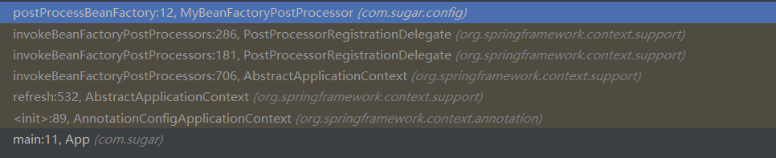

#### AbstractAutowireCapableBeanFactor

```java
protected Object initializeBean(final String beanName, final Object bean, @Nullable RootBeanDefinition mbd) {
   if (System.getSecurityManager() != null) {
      AccessController.doPrivileged((PrivilegedAction<Object>) () -> {
         invokeAwareMethods(beanName, bean);
         return null;
      }, getAccessControlContext());
   }
   else {
      invokeAwareMethods(beanName, bean);
   }

   Object wrappedBean = bean;
   if (mbd == null || !mbd.isSynthetic()) {
       //BeanPostProcessor前置增强
      wrappedBean = applyBeanPostProcessorsBeforeInitialization(wrappedBean, beanName);
   }

   try {
      invokeInitMethods(beanName, wrappedBean, mbd);
   }
   catch (Throwable ex) {
      throw new BeanCreationException(
            (mbd != null ? mbd.getResourceDescription() : null),
            beanName, "Invocation of init method failed", ex);
   }
   if (mbd == null || !mbd.isSynthetic()) {
       //BeanPostProcessor后置增强
      wrappedBean = applyBeanPostProcessorsAfterInitialization(wrappedBean, beanName);
   }

   return wrappedBean;
}
```

### BeanDefinitionRegistryPostProcessor

> 对BeanDefinition进行处理的后置处理器，是BeanFactoryPostProcessor的子接口，在BeanFactoryPostProcessor之前执行
>
> 方法执行时机：
>
> BeanDefinitionRegistryPostProcessor和BeanFactoryPostProcessor都会各按优先级(Order)进行执行
>
> 1. BeanDefinitionRegistryPostProcessor.postProcessBeanDefinitionRegistry
> 2. BeanDefinitionRegistryPostProcessor.postProcessBeanFactory
> 3. BeanFactoryPostProcessor.postProcessBeanFactory
>
> ```java
> @Component
> public class MyBeanDefinitionRegistryPostProcessor implements BeanDefinitionRegistryPostProcessor {
>     @Override
>     public void postProcessBeanDefinitionRegistry(BeanDefinitionRegistry registry) throws BeansException {
>         System.out.println("MyBeanDefinitionRegistryPostProcessor.postProcessBeanDefinitionRegistry执行");
>         System.out.println("bean定义个数:" + registry.getBeanDefinitionCount());
>         AbstractBeanDefinition rbd = BeanDefinitionBuilder.rootBeanDefinition(Cat.class).getBeanDefinition();
>         //注册一个新的
>         registry.registerBeanDefinition("cat1", rbd);
>     }
> 
>     @Override
>     public void postProcessBeanFactory(ConfigurableListableBeanFactory beanFactory) throws BeansException {
>         System.out.println("MyBeanDefinitionRegistryPostProcessor.postProcessBeanFactory执行");
>         System.out.println("bean定义个数:" + beanFactory.getBeanDefinitionCount());
>     }
> }
> ```

#### 执行原理

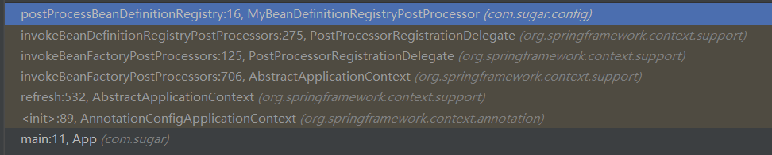


## AOP

### maven依赖

```xml
<dependency>
  <groupId>org.springframework</groupId>
  <artifactId>spring-aspects</artifactId>
  <version>5.2.1.RELEASE</version>
</dependency>
```

### AOP的5种通知

> - 前置通知：方法执行前执行
> - 后置通知：方法执行后执行
> - 返回后通知：方法正常执行结束后执行
> - 异常通知：方法异常时执行
> - 环绕通知：前面4种通知的综合

### AOP常用概念

### 示例

> 配置类需要@EnableAspectJAutoProxy开启动态代理功能

```java
@Aspect
@Component
public class LogAspects {

    @Pointcut("execution(* com.sugar.bean.Calculator.*(..))")
    public void pointCut() {

    }

    @Before(value = "pointCut()")
    public void beforeLog(JoinPoint joinPoint) {
        System.out.println(joinPoint.getSignature().getName() + "方法执行前--beforeLog，方法参数:"
                + Arrays.asList(joinPoint.getArgs()));
    }

    @After(value = "pointCut()")
    public void afterLog() {
        System.out.println("方法执行后--afterLog");
    }

    @AfterReturning(value = "pointCut()", returning = "result")
    public void afterReturn(Object result) {
        System.out.println("方法返回后--afterReturn,结果:" + result);
    }

    @AfterThrowing(value = "pointCut()", throwing = "ex")
    public void afterThrow(Exception ex) {
        System.out.println("方法异常--afterThrow,异常:" + ex);
    }

    @Around(value = "pointCut()")
    public Object around(ProceedingJoinPoint joinPoint) throws Throwable {
        System.out.println("around start");
        Object result = joinPoint.proceed();
        System.out.println("around end");
        return result;
    }

}
```

**正常执行结果**

```
around start
div方法执行前--beforeLog，方法参数:[1, 1]
around end
方法执行后--afterLog
方法返回后--afterReturn,结果:1
```

**异常执行结果**

```
around start
div方法执行前--beforeLog，方法参数:[1, 0]
方法执行后--afterLog
方法异常--afterThrow,异常:java.lang.ArithmeticException: / by zero
```

### AOP的实现原理

#### 注解

> 需要在配置类上添加`@EnableAspectJAutoProxy`开启AOP功能，该注解的功能是导入`AspectJAutoProxyRegistrar`组件
>
> ```java
> @Target(ElementType.TYPE)
> @Retention(RetentionPolicy.RUNTIME)
> @Documented
> @Import(AspectJAutoProxyRegistrar.class)
> public @interface EnableAspectJAutoProxy {
> 	//控制aop的具体实现方式,为true 的话使用cglib,为false的话使用java的Proxy,默认为false，当不能使用jdk动态代理时，使用cglib
> 	boolean proxyTargetClass() default false;
> 
> 	//控制代理的暴露方式,解决内部调用不能使用代理的场景
> 	boolean exposeProxy() default false;
> }
> ```

#### AspectJAutoProxyRegistrar

> - 实现了`ImportBeanDefinitionRegistrar`，功能是导入`AnnotationAwareAspectJAutoProxyCreator`到spring容器中

#### AnnotationAwareAspectJAutoProxyCreator

> 可以看出AnnotationAwareAspectJAutoProxyCreator实际上是一个BeanPostProcessor，对于AOP而言，最重要的是InstantiationAwareBeanPostProcessor，里面定义了一些AOP相关bean的拦截处理

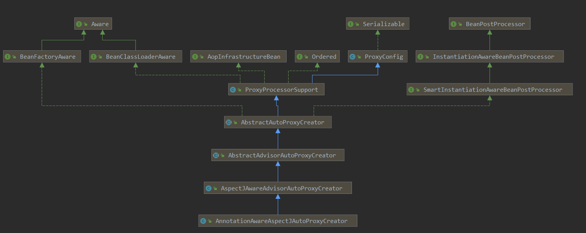

### aop源码执行流程

#### 1.使用配置类初始化容器

> 基于@Configuration的方式配置spring

```java
AnnotationConfigApplicationContext app = new AnnotationConfigApplicationContext(SpringConfig.class);
```

#### 刷新容器--AnnotationConfigApplicationContext

```java
public AnnotationConfigApplicationContext(Class<?>... componentClasses) {
   this();
   register(componentClasses);
    //刷新容器
   refresh();
}
```

#### 注册bean的后置处理器--AbstractApplicationContext

```java
registerBeanPostProcessors(beanFactory);

	protected void registerBeanPostProcessors(ConfigurableListableBeanFactory beanFactory) {
        //使用代理注册后置处理器
		PostProcessorRegistrationDelegate.registerBeanPostProcessors(beanFactory, this);
	}
```

#### 按序注册后置处理器--PostProcessorRegistrationDelegate

> 1. 实现PriorityOrdered接口的
> 2. 实现Ordered接口的，**AOP的核心类实现了该接口，所以会在这里进行注册**
> 3. 未实现Ordered与MergedBeanDefinitionPostProcessor接口的
> 4. 实现MergedBeanDefinitionPostProcessor接口的，该接口的作用是对@Autowired和@Value其作用，将依赖进行装配

```java
public static void registerBeanPostProcessors(
      ConfigurableListableBeanFactory beanFactory, AbstractApplicationContext applicationContext) {

   String[] postProcessorNames = beanFactory.getBeanNamesForType(BeanPostProcessor.class, true, false);

   // Register BeanPostProcessorChecker that logs an info message when
   // a bean is created during BeanPostProcessor instantiation, i.e. when
   // a bean is not eligible for getting processed by all BeanPostProcessors.
   int beanProcessorTargetCount = beanFactory.getBeanPostProcessorCount() + 1 + postProcessorNames.length;
   beanFactory.addBeanPostProcessor(new BeanPostProcessorChecker(beanFactory, beanProcessorTargetCount));

   // Separate between BeanPostProcessors that implement PriorityOrdered,
   // Ordered, and the rest.
   List<BeanPostProcessor> priorityOrderedPostProcessors = new ArrayList<>();
   List<BeanPostProcessor> internalPostProcessors = new ArrayList<>();
   List<String> orderedPostProcessorNames = new ArrayList<>();
   List<String> nonOrderedPostProcessorNames = new ArrayList<>();
   for (String ppName : postProcessorNames) {
      if (beanFactory.isTypeMatch(ppName, PriorityOrdered.class)) {
         BeanPostProcessor pp = beanFactory.getBean(ppName, BeanPostProcessor.class);
         priorityOrderedPostProcessors.add(pp);
         if (pp instanceof MergedBeanDefinitionPostProcessor) {
            internalPostProcessors.add(pp);
         }
      }
      else if (beanFactory.isTypeMatch(ppName, Ordered.class)) {
         orderedPostProcessorNames.add(ppName);
      }
      else {
         nonOrderedPostProcessorNames.add(ppName);
      }
   }

   // First, register the BeanPostProcessors that implement PriorityOrdered.
   sortPostProcessors(priorityOrderedPostProcessors, beanFactory);
   registerBeanPostProcessors(beanFactory, priorityOrderedPostProcessors);

   // Next, register the BeanPostProcessors that implement Ordered.
   List<BeanPostProcessor> orderedPostProcessors = new ArrayList<>(orderedPostProcessorNames.size());
   for (String ppName : orderedPostProcessorNames) {
       //aop 处理器在这里注册
      BeanPostProcessor pp = beanFactory.getBean(ppName, BeanPostProcessor.class);
      orderedPostProcessors.add(pp);
      if (pp instanceof MergedBeanDefinitionPostProcessor) {
         internalPostProcessors.add(pp);
      }
   }
   sortPostProcessors(orderedPostProcessors, beanFactory);
   registerBeanPostProcessors(beanFactory, orderedPostProcessors);

   // Now, register all regular BeanPostProcessors.
   List<BeanPostProcessor> nonOrderedPostProcessors = new ArrayList<>(nonOrderedPostProcessorNames.size());
   for (String ppName : nonOrderedPostProcessorNames) {
      BeanPostProcessor pp = beanFactory.getBean(ppName, BeanPostProcessor.class);
      nonOrderedPostProcessors.add(pp);
      if (pp instanceof MergedBeanDefinitionPostProcessor) {
         internalPostProcessors.add(pp);
      }
   }
   registerBeanPostProcessors(beanFactory, nonOrderedPostProcessors);

   // Finally, re-register all internal BeanPostProcessors.
   sortPostProcessors(internalPostProcessors, beanFactory);
   registerBeanPostProcessors(beanFactory, internalPostProcessors);

   // Re-register post-processor for detecting inner beans as ApplicationListeners,
   // moving it to the end of the processor chain (for picking up proxies etc).
   beanFactory.addBeanPostProcessor(new ApplicationListenerDetector(applicationContext));
}
```

#### 实例化后置处理器--AbstractBeanFactory

```java
public <T> T getBean(String name, Class<T> requiredType) throws BeansException {
   return doGetBean(name, requiredType, null, false);
}

doGetBean-->323.createBean(beanName, mbd, args)
// Create bean instance.
				if (mbd.isSingleton()) {
					sharedInstance = getSingleton(beanName, () -> {
						try {
							return createBean(beanName, mbd, args);
						}
						catch (BeansException ex) {
							destroySingleton(beanName);
							throw ex;
						}
					});
					bean = getObjectForBeanInstance(sharedInstance, name, beanName, mbd);
				}

```

#### createBean--AbstractAutowireCapableBeanFactory

```java
//506--试图创建一个代理bean，但是会返回null，代理是在需要代理的对象创建后进行增强的，后置处理器注册节点不会产生任何增强
Object bean = resolveBeforeInstantiation(beanName, mbdToUse);
```

#### 实例化所有非懒加载单例bean--AbstractApplicationContext

```java
finishBeanFactoryInitialization(beanFactory);

beanFactory.preInstantiateSingletons();shezhi

//同样到达创建bean的流程
preInstantiateSingletons()--》getBean(beanName)--》doGetBean--》createBean--》
//试图创建代理对象，这里同样返回null，因为bean还没有初始化
resolveBeforeInstantiation(beanName, mbdToUse)--》null-->doCreateBean
--》populateBean  对bean的属性进行设值
--》initializeBean  初始化bean
--》applyBeanPostProcessorsBeforeInitialization  在bean初始化之前增强
--》invokeInitMethods  初始化，首先判断是否为InitializingBean，然后查看是否有自定义的初始化方法
--》applyBeanPostProcessorsAfterInitialization  对初始化后的bean进行增强，aop开始生效，		AnnotationAwareAspectJAutoProxyCreator对bean进行代理增强
--》postProcessAfterInitialization(AbstractAutoProxyCreator)
--》wrapIfNecessary  判断是否需要包装
--》getAdvicesAndAdvisorsForBean  获取bean的通知，calculator配置了切面，所以不为空
--》createProxy  根据通知创建代理，spring通过cglib或jdk代理生成代理对象，对于没有实现接口的类，只 	能使用cglib创建代理
--》返回代理后的对象，这里返回一个cglib创建的对象
```

#### AbstractAutoProxyCreator代理calculator

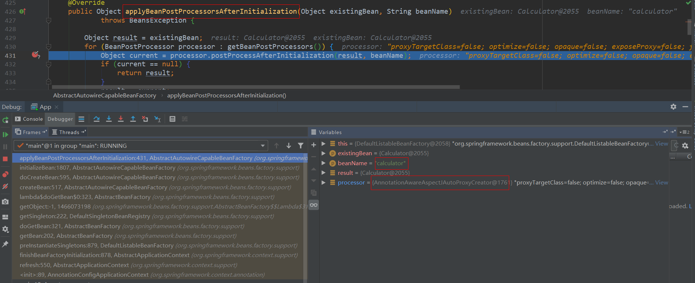

#### 代理后的calculator--cglib生成

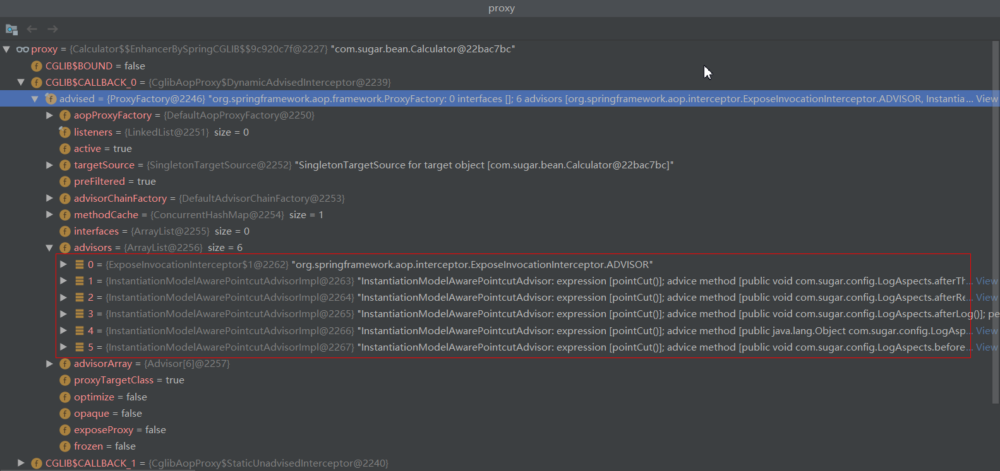

### aop代理对象调用链

```java
Calculator calculator = app.getBean(Calculator.class);
calculator.div(1, 1);

--》intercept(CglibAopProxy)  进入cglib拦截链
--》getInterceptorsAndDynamicInterceptionAdvice  获取拦截链
--》CglibMethodInvocation.proceed()  拦截链调用，调用采用类似于压栈的方式执行，按拦截链数组顺序进	行调用，但调用时又会调用下一个节点的proceed方法，直到调用到最后一个节点的proceed方法，再依次返回，	从异常，返回值等的处理方式不难明白该顺序的意义，将异常包装在最外层，返回值在次一层，AOP对于每一种通	知都有一个具体的实现类进行拦截
```

#### AOPl拦截链

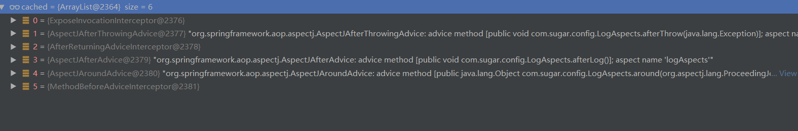

#### AOP拦截链核心方法(ReflectiveMethodInvocation)

```java
public Object proceed() throws Throwable {
   // We start with an index of -1 and increment early.
   if (this.currentInterceptorIndex == this.interceptorsAndDynamicMethodMatchers.size() - 1) {
      return invokeJoinpoint();
   }

   Object interceptorOrInterceptionAdvice =
         this.interceptorsAndDynamicMethodMatchers.get(++this.currentInterceptorIndex);
   if (interceptorOrInterceptionAdvice instanceof InterceptorAndDynamicMethodMatcher) {
      // Evaluate dynamic method matcher here: static part will already have
      // been evaluated and found to match.
      InterceptorAndDynamicMethodMatcher dm =
            (InterceptorAndDynamicMethodMatcher) interceptorOrInterceptionAdvice;
      Class<?> targetClass = (this.targetClass != null ? this.targetClass : this.method.getDeclaringClass());
      if (dm.methodMatcher.matches(this.method, targetClass, this.arguments)) {
         return dm.interceptor.invoke(this);
      }
      else {
         // Dynamic matching failed.
         // Skip this interceptor and invoke the next in the chain.
         return proceed();
      }
   }
   else {
      // It's an interceptor, so we just invoke it: The pointcut will have
      // been evaluated statically before this object was constructed.
      return ((MethodInterceptor) interceptorOrInterceptionAdvice).invoke(this);
   }
}
```

#### AOP通知处理对象

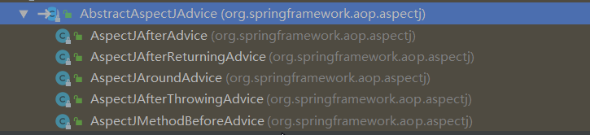

#### AOP通知执行顺序

```
around start
div方法执行前--beforeLog，方法参数:[1, 1]
around end
方法执行后--afterLog
方法返回后--afterReturn,结果:1
```

> 从上面执行结果可以看出，在有环绕通知的情况下，先调用环绕通知，而下一个通知是在环绕通知中通过joinPoint.proceed()手动调用的，调用前置通知，结束后，执行环绕通知
>
> 总结：环绕通知--》前置通知--》环绕通知--》后置通知--》返回后通知，而异常通知会在程序出现异常时生效

异常执行结果

```
around start
div方法执行前--beforeLog，方法参数:[1, 0]
方法执行后--afterLog
方法异常--afterThrow,异常:java.lang.ArithmeticException: / by zero
```

## 声明式事务

### 使用

#### 配置类

> - @EnableTransactionManagement：开始事务管理器
> - 使用@Bean注入一个PlatformTransactionManager：注入具体的事务管理器

```java
@Configuration
@EnableTransactionManagement
@ComponentScan(basePackages = {"com.sugar"})
public class SpringConfig {
    @Bean
    public DataSource dataSource() throws PropertyVetoException {
        ComboPooledDataSource dataSource = new ComboPooledDataSource();
        dataSource.setJdbcUrl("jdbc:mysql://localhost:3306/test?useSSL=false&serverTimezone=UTC");
        dataSource.setDriverClass("com.mysql.cj.jdbc.Driver");
        dataSource.setUser("root");
        dataSource.setPassword("123456");
        return dataSource;
    }

    @Bean
    public JdbcTemplate jdbcTemplate(@Autowired DataSource dataSource) {
        return new JdbcTemplate(dataSource);
    }

    @Bean
    public PlatformTransactionManager platformTransactionManager(@Autowired DataSource dataSource) {
        return new DataSourceTransactionManager(dataSource);
    }

}
```

#### 使用

> 在方法上添加@Transactional，当方法内发生异常时即会回滚，**对于多数据源会失效**

```java
@Service
public class UserService {
    @Autowired
    private UserDao userDao;

    @Transactional
    public void insertUser() {
        userDao.insertUser();
        System.out.println(1/0);
    }
}
```

### 实现原理

#### 导入TransactionManagementConfigurationSelector

> 导入AutoProxyRegistrar，ProxyTransactionManagementConfiguration

```java
@Target(ElementType.TYPE)
@Retention(RetentionPolicy.RUNTIME)
@Documented
@Import(TransactionManagementConfigurationSelector.class)
public @interface EnableTransactionManagement {

	boolean proxyTargetClass() default false;

	AdviceMode mode() default AdviceMode.PROXY;

	int order() default Ordered.LOWEST_PRECEDENCE;

}
    
public class TransactionManagementConfigurationSelector extends AdviceModeImportSelector<EnableTransactionManagement> {

	@Override
	protected String[] selectImports(AdviceMode adviceMode) {
		switch (adviceMode) {
            //默认是PROXY
			case PROXY:
				return new String[] {AutoProxyRegistrar.class.getName(),
						ProxyTransactionManagementConfiguration.class.getName()};
			case ASPECTJ:
				return new String[] {determineTransactionAspectClass()};
			default:
				return null;
		}
	}

	private String determineTransactionAspectClass() {
		return (ClassUtils.isPresent("javax.transaction.Transactional", getClass().getClassLoader()) ?
				TransactionManagementConfigUtils.JTA_TRANSACTION_ASPECT_CONFIGURATION_CLASS_NAME :
				TransactionManagementConfigUtils.TRANSACTION_ASPECT_CONFIGURATION_CLASS_NAME);
	}

}
```

#### AutoProxyRegistrar

> 设置EnableTransactionManagement里面配置的属性，注册核心组件InfrastructureAdvisorAutoProxyCreator，事务对应的后置处理器

```java
public class AutoProxyRegistrar implements ImportBeanDefinitionRegistrar {

   private final Log logger = LogFactory.getLog(getClass());

   @Override
   public void registerBeanDefinitions(AnnotationMetadata importingClassMetadata, BeanDefinitionRegistry registry) {
      boolean candidateFound = false;
      Set<String> annTypes = importingClassMetadata.getAnnotationTypes();
      for (String annType : annTypes) {
         AnnotationAttributes candidate = AnnotationConfigUtils.attributesFor(importingClassMetadata, annType);
         if (candidate == null) {
            continue;
         }
         Object mode = candidate.get("mode");
         Object proxyTargetClass = candidate.get("proxyTargetClass");
         if (mode != null && proxyTargetClass != null && AdviceMode.class == mode.getClass() &&
               Boolean.class == proxyTargetClass.getClass()) {
            candidateFound = true;
            if (mode == AdviceMode.PROXY) {
                //注册核心组件InfrastructureAdvisorAutoProxyCreator
               AopConfigUtils.registerAutoProxyCreatorIfNecessary(registry);
               if ((Boolean) proxyTargetClass) {
                  AopConfigUtils.forceAutoProxyCreatorToUseClassProxying(registry);
                  return;
               }
            }
         }
      }
      if (!candidateFound && logger.isInfoEnabled()) {
         String name = getClass().getSimpleName();
         logger.info(String.format("%s was imported but no annotations were found " +
               "having both 'mode' and 'proxyTargetClass' attributes of type " +
               "AdviceMode and boolean respectively. This means that auto proxy " +
               "creator registration and configuration may not have occurred as " +
               "intended, and components may not be proxied as expected. Check to " +
               "ensure that %s has been @Import'ed on the same class where these " +
               "annotations are declared; otherwise remove the import of %s " +
               "altogether.", name, name, name));
      }
   }

}
```

#### ProxyTransactionManagementConfiguration

```java
@Configuration(proxyBeanMethods = false)
public class ProxyTransactionManagementConfiguration extends AbstractTransactionManagementConfiguration {

   @Bean(name = TransactionManagementConfigUtils.TRANSACTION_ADVISOR_BEAN_NAME)
   @Role(BeanDefinition.ROLE_INFRASTRUCTURE)
   public BeanFactoryTransactionAttributeSourceAdvisor transactionAdvisor(
         TransactionAttributeSource transactionAttributeSource,
         TransactionInterceptor transactionInterceptor) {
      BeanFactoryTransactionAttributeSourceAdvisor advisor = new BeanFactoryTransactionAttributeSourceAdvisor();
      advisor.setTransactionAttributeSource(transactionAttributeSource);
      advisor.setAdvice(transactionInterceptor);
      if (this.enableTx != null) {
         advisor.setOrder(this.enableTx.<Integer>getNumber("order"));
      }
      return advisor;
   }

    //封装@Transactional注解里面的属性
   @Bean
   @Role(BeanDefinition.ROLE_INFRASTRUCTURE)
   public TransactionAttributeSource transactionAttributeSource() {
      return new AnnotationTransactionAttributeSource();
   }

    //封装事务的注解属性信息(TransactionAttributeSource)和事务管理器(TransactionManager)
   @Bean
   @Role(BeanDefinition.ROLE_INFRASTRUCTURE)
   public TransactionInterceptor transactionInterceptor(
         TransactionAttributeSource transactionAttributeSource) {
      TransactionInterceptor interceptor = new TransactionInterceptor();
      interceptor.setTransactionAttributeSource(transactionAttributeSource);
      if (this.txManager != null) {
         interceptor.setTransactionManager(this.txManager);
      }
      return interceptor;
   }

}
```

#### 事务执行链

```java
--》执行目标方法，进入cglib代理
--》TransactionInterceptor.invoke  对方法进行拦截
--》invokeWithinTransaction（TransactionAspectSupport）

protected Object invokeWithinTransaction(Method method, @Nullable Class<?> targetClass,
			final InvocationCallback invocation) throws Throwable {

		// 获取事务注解属性
		TransactionAttributeSource tas = getTransactionAttributeSource();
		final TransactionAttribute txAttr = (tas != null ? tas.getTransactionAttribute(method, targetClass) : null);
        //获取事务管理器
		final TransactionManager tm = determineTransactionManager(txAttr);

		。。。

		PlatformTransactionManager ptm = asPlatformTransactionManager(tm);
		final String joinpointIdentification = methodIdentification(method, targetClass, txAttr);

		if (txAttr == null || !(ptm instanceof CallbackPreferringPlatformTransactionManager)) {
			//开启事务
			TransactionInfo txInfo = createTransactionIfNecessary(ptm, txAttr, joinpointIdentification);

			Object retVal;
			try {
				//反射执行目标方法
				retVal = invocation.proceedWithInvocation();
			}
			catch (Throwable ex) {
				// 异常回滚
				completeTransactionAfterThrowing(txInfo, ex);
				throw ex;
			}
			finally {
                //重置事务信息
				cleanupTransactionInfo(txInfo);
			}

			if (vavrPresent && VavrDelegate.isVavrTry(retVal)) {
				// Set rollback-only in case of Vavr failure matching our rollback rules...
				TransactionStatus status = txInfo.getTransactionStatus();
				if (status != null && txAttr != null) {
					retVal = VavrDelegate.evaluateTryFailure(retVal, txAttr, status);
				}
			}

            //提交事务，提交后数据库可见
			commitTransactionAfterReturning(txInfo);
			return retVal;
		}

		。。。
	}
```

## IOC

> IOC的核心是refresh()方法

### prepareRefresh()

> 预刷新

```java
protected void prepareRefresh() {
   //设置容器为激活状态
   this.startupDate = System.currentTimeMillis();
   this.closed.set(false);
   this.active.set(true);

    //日志
   if (logger.isDebugEnabled()) {
      if (logger.isTraceEnabled()) {
         logger.trace("Refreshing " + this);
      }
      else {
         logger.debug("Refreshing " + getDisplayName());
      }
   }

   // 初始化属性配置，由子类实现
   initPropertySources();

  //校验上面的属性配置合法性
   getEnvironment().validateRequiredProperties();

   // 保存预刷新监听器
   if (this.earlyApplicationListeners == null) {
      this.earlyApplicationListeners = new LinkedHashSet<>(this.applicationListeners);
   }
   else {
      // 重置监听器为预刷新监听器
      this.applicationListeners.clear();
      this.applicationListeners.addAll(this.earlyApplicationListeners);
   }

  //初始化事件监听器，监听spring各种状态的改变，然后通知指定类
   this.earlyApplicationEvents = new LinkedHashSet<>();
}
```

### obtainFreshBeanFactory()

> 创建BeanFactory
>
> ```java
> //AnnotationConfigApplicationContext是GenericApplicationContext的子类
> public class AnnotationConfigApplicationContext extends GenericApplicationContext
> ```

```java
protected ConfigurableListableBeanFactory obtainFreshBeanFactory() {
   refreshBeanFactory();
    //返回一个DefaultListableBeanFactory的实例
   return getBeanFactory();
}

	@Override
	protected final void refreshBeanFactory() throws IllegalStateException {
        //校验是否已经刷新，不允许刷新多次
		if (!this.refreshed.compareAndSet(false, true)) {
			throw new IllegalStateException(
					"GenericApplicationContext does not support multiple refresh attempts: just call 'refresh' once");
		}
        //设置一个序列化id
		this.beanFactory.setSerializationId(getId());
	}

--》getBeanFactory()
public GenericApplicationContext() {
    //实际返回的是这个类型的BeanFactory
		this.beanFactory = new DefaultListableBeanFactory();
	}
```

### prepareBeanFactory(beanFactory)

> BeanFactory初始化

```java
protected void prepareBeanFactory(ConfigurableListableBeanFactory beanFactory) {
   // 设置类加载器
   beanFactory.setBeanClassLoader(getClassLoader());
    //设置表达式解析器，如SPEL
   beanFactory.setBeanExpressionResolver(new StandardBeanExpressionResolver(beanFactory.getBeanClassLoader()));
    //添加属性编辑注册器，Spring 使用PropertyEditors的接口来实现对象和字符串之间的转换，如spring mvc中controller接收的参数就通过这个转换类型，也可以自定义
   beanFactory.addPropertyEditorRegistrar(new ResourceEditorRegistrar(this, getEnvironment()));

   //添加后置处理器
   beanFactory.addBeanPostProcessor(new ApplicationContextAwareProcessor(this));
    //忽略以下接口的aware
   beanFactory.ignoreDependencyInterface(EnvironmentAware.class);
   beanFactory.ignoreDependencyInterface(EmbeddedValueResolverAware.class);
   beanFactory.ignoreDependencyInterface(ResourceLoaderAware.class);
   beanFactory.ignoreDependencyInterface(ApplicationEventPublisherAware.class);
   beanFactory.ignoreDependencyInterface(MessageSourceAware.class);
   beanFactory.ignoreDependencyInterface(ApplicationContextAware.class);

  //当需要autowired自动装配以下类型的时候，配置返回对象为当前容器
   beanFactory.registerResolvableDependency(BeanFactory.class, beanFactory);
   beanFactory.registerResolvableDependency(ResourceLoader.class, this);
   beanFactory.registerResolvableDependency(ApplicationEventPublisher.class, this);
   beanFactory.registerResolvableDependency(ApplicationContext.class, this);

   //添加一个检测器
   beanFactory.addBeanPostProcessor(new ApplicationListenerDetector(this));

   // Detect a LoadTimeWeaver and prepare for weaving, if found.
   if (beanFactory.containsBean(LOAD_TIME_WEAVER_BEAN_NAME)) {
      beanFactory.addBeanPostProcessor(new LoadTimeWeaverAwareProcessor(beanFactory));
      // Set a temporary ClassLoader for type matching.
      beanFactory.setTempClassLoader(new ContextTypeMatchClassLoader(beanFactory.getBeanClassLoader()));
   }

   //注册环境变量相关的bean
   if (!beanFactory.containsLocalBean(ENVIRONMENT_BEAN_NAME)) {
      beanFactory.registerSingleton(ENVIRONMENT_BEAN_NAME, getEnvironment());
   }
   if (!beanFactory.containsLocalBean(SYSTEM_PROPERTIES_BEAN_NAME)) {
      beanFactory.registerSingleton(SYSTEM_PROPERTIES_BEAN_NAME, getEnvironment().getSystemProperties());
   }
   if (!beanFactory.containsLocalBean(SYSTEM_ENVIRONMENT_BEAN_NAME)) {
      beanFactory.registerSingleton(SYSTEM_ENVIRONMENT_BEAN_NAME, getEnvironment().getSystemEnvironment());
   }
}
```

### postProcessBeanFactory(beanFactory)

> 默认空实现，交由子容器自定义

```java
protected void postProcessBeanFactory(ConfigurableListableBeanFactory beanFactory) {
}
```

### invokeBeanFactoryPostProcessors(beanFactory)

> - 按优先级调用BeanFactoryPostProcessor
> - 优先调用BeanDefinitionRegistryPostProcessor
> - 再调用BeanFactoryPostProcessor

### registerBeanPostProcessors(beanFactory)

> 注册bean的后置处理器，按优先级注册

### initMessageSource()

> 初始化国际化消息转换器

### initApplicationEventMulticaster()

> 注册时间派发器

### onRefresh()

> 容器刷新，默认空实现，有子容器实现

### registerListeners()

> 注册监听器

### finishBeanFactoryInitialization(beanFactory)

> 初始化容器中非懒加载的单实例bean
>
> 核心代码
>
> ```java
> //初始化所有单例bean
> beanFactory.preInstantiateSingletons();
> -->getBean(beanName) (DefaultListableBeanFactory)
> -->doGetBean(name, null, null, false) (AbstractBeanFactory)
> 
> ```

#### AbstractBeanFactory doGetBean源码解析

##### 转换对于的beanName

> 通过传入的name去容器中获取bean的实际名称，分为2个步骤
>
> ```java
> String beanName = transformedBeanName(name)
>     
> -->canonicalName(BeanFactoryUtils.transformedBeanName(name))
> ```
>
> - BeanFactoryUtils.transformedBeanName(name):在spring中存在**FacrotyBean**,当传入的name前缀是&（可以有多个）时，将其去掉，返回
>
>   ```java
>   public static String transformedBeanName(String name) {
>      Assert.notNull(name, "'name' must not be null");
>       //没有&前缀直接返回
>      if (!name.startsWith(BeanFactory.FACTORY_BEAN_PREFIX)) {
>         return name;
>      }
>      return transformedBeanNameCache.computeIfAbsent(name, beanName -> {
>         do {
>            beanName = beanName.substring(BeanFactory.FACTORY_BEAN_PREFIX.length());
>         }
>          //去除重复的&前缀
>         while (beanName.startsWith(BeanFactory.FACTORY_BEAN_PREFIX));
>         return beanName;
>      });
>   }
>   ```
>
> - canonicalName(name):name可能是bean的别名，在容器的别名缓存中获取bean的真实名称
>
>   ```javascript
>   public String canonicalName(String name) {
>      String canonicalName = name;
>      // Handle aliasing...
>      String resolvedName;
>      do {
>         resolvedName = this.aliasMap.get(canonicalName);
>         if (resolvedName != null) {
>            canonicalName = resolvedName;
>         }
>      }
>       //可能存在多级别名，A->B->C,resolvedName为null时，则表示该name已经不是别名了，可以直接返回了
>      while (resolvedName != null);
>      return canonicalName;
>   }
>   ```
>
> - 

##### 尝试从缓存中加载单例

```java
Object sharedInstance = getSingleton(beanName)
    
	protected Object getSingleton(String beanName, boolean allowEarlyReference) {
    //尝试从singletonObjects获取
		Object singletonObject = this.singletonObjects.get(beanName);
		if (singletonObject == null && isSingletonCurrentlyInCreation(beanName)) {
			synchronized (this.singletonObjects) {
                //尝试从earlySingletonObjects获取
				singletonObject = this.earlySingletonObjects.get(beanName);
				if (singletonObject == null && allowEarlyReference) {
                    //尝试从singletonFactories获取
					ObjectFactory<?> singletonFactory = this.singletonFactories.get(beanName);
					if (singletonFactory != null) {
						singletonObject = singletonFactory.getObject();
						this.earlySingletonObjects.put(beanName, singletonObject);
						this.singletonFactories.remove(beanName);
					}
				}
			}
		}
		return singletonObject;
	}
```

> 单例在Spring 的同一个容器内只会被创建一次，后续再获取bean ，就直接从单例缓存中获
> 取了。当然这里也只是尝试加载，首先尝试从缓存中加载，如果加载不成功则再次尝试从
> singletonFactories 中加载。因为在创建单例bean 的时候会存在依赖注入的情况，而在创建依赖
> 的时候为了避免循环依赖，在Spring 中创建bean 的原则是不等bean 创建完成就会将创建bean
> 的ObjectFactory 提早曝光加入到缓存中， 一旦下一个bean 创建时候需要依赖上一个bean 则直
> 接使用ObjectFactory 

## springMvc

### servlet3.0

> - 依赖tomcat7.0以上版本，可以不用配置web.xml，使用纯注解版本

#### ServletContainerInitializer

> - tomcat运行插件，允许在tonmcat启动时定制操作
>
> - 容器初始化器，在容器初始化过程中，会调用实现该接口的方法
>
> - 自定义一个类实现该接口
>
>   ```java
>   //HandlesTypes注解标识需要扫描到tomcat容器的根接口（实现该接口的类，子接口，在抽象类等都会被扫描到），会存入onStartup方法的set参数中
>   @HandlesTypes(value = {Hello.class})
>   public class MyServletContainerInitializer implements ServletContainerInitializer {
>       @Override
>       public void onStartup(Set<Class<?>> set, ServletContext servletContext) throws ServletException {
>           System.out.println("-----------start--------------");
>           for (Class<?> aClass : set) {
>               System.out.println(aClass.getName());
>           }
>       }
>   }
>   ```
>
> - tomcat基于**SPI机制**加载ServletContainerInitializer，需要建立目录结构如下
>
>   - 在resources目录下创建META-INF/services/javax.servlet.ServletContainerInitializer文件，文件内容为自定义实现ServletContainerInitializer接口类的全类名，若有多个，则写多行即可
>
>   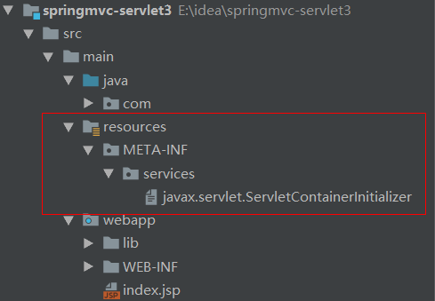
>
> - 

### springmvc与servlet3.0

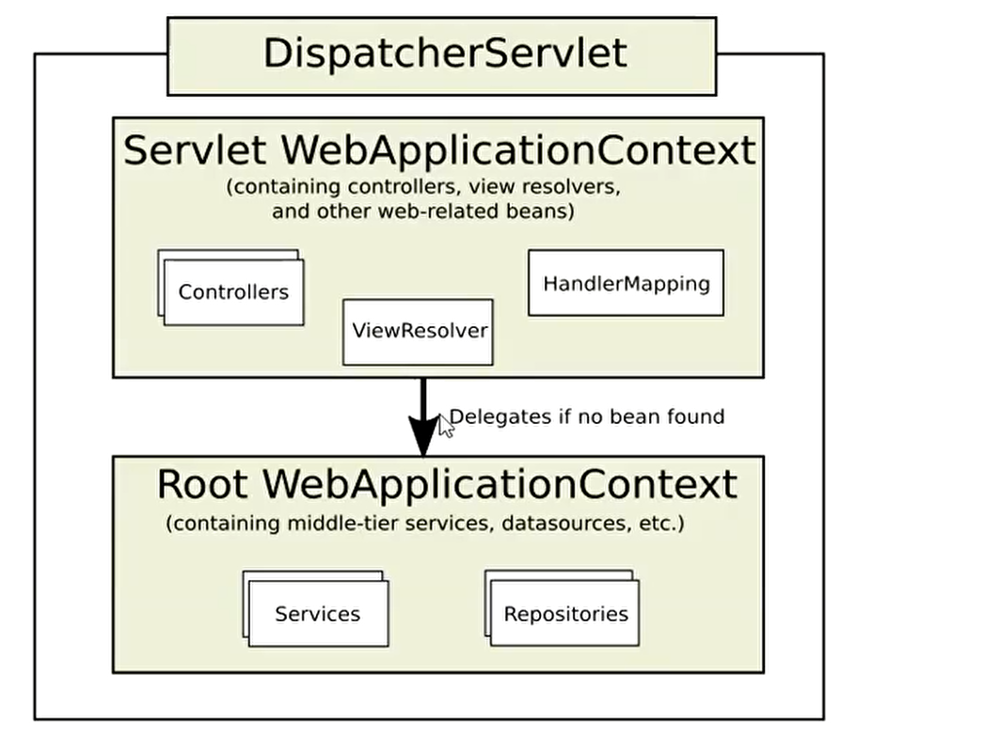

#### 整合

> 可以看出springmvc正是使用servlet3.0提供的ServletContainerInitializer进行初始化，其实现类是org.springframework.web.SpringServletContainerInitializer

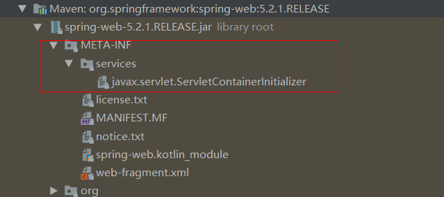

#### SpringServletContainerInitializer

> springmvc导入的是WebApplicationInitializer
>
> 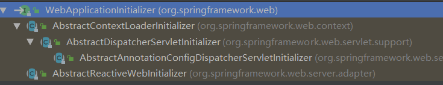

```java
@HandlesTypes(WebApplicationInitializer.class)
public class SpringServletContainerInitializer implements ServletContainerInitializer {
   @Override
   public void onStartup(@Nullable Set<Class<?>> webAppInitializerClasses, ServletContext servletContext)
         throws ServletException {

      List<WebApplicationInitializer> initializers = new LinkedList<>();

      if (webAppInitializerClasses != null) {
         for (Class<?> waiClass : webAppInitializerClasses) {
            //校验其非接口、非抽象类、并且是WebApplicationInitializer的实现类，springmvc提供的都是抽象类，所以不会做任何操作
            if (!waiClass.isInterface() && !Modifier.isAbstract(waiClass.getModifiers()) &&
                  WebApplicationInitializer.class.isAssignableFrom(waiClass)) {
               try {
                  initializers.add((WebApplicationInitializer)
                        ReflectionUtils.accessibleConstructor(waiClass).newInstance());
               }
               catch (Throwable ex) {
                  throw new ServletException("Failed to instantiate WebApplicationInitializer class", ex);
               }
            }
         }
      }

      if (initializers.isEmpty()) {
         servletContext.log("No Spring WebApplicationInitializer types detected on classpath");
         return;
      }

      servletContext.log(initializers.size() + " Spring WebApplicationInitializers detected on classpath");
      AnnotationAwareOrderComparator.sort(initializers);
      for (WebApplicationInitializer initializer : initializers) {
         initializer.onStartup(servletContext);
      }
   }

}
```

#### AbstractContextLoaderInitializer

```java
public abstract class AbstractContextLoaderInitializer implements WebApplicationInitializer {

   protected final Log logger = LogFactory.getLog(getClass());


    //注册spring核心监听器ContextLoaderListener
   @Override
   public void onStartup(ServletContext servletContext) throws ServletException {
      registerContextLoaderListener(servletContext);
   }

   protected void registerContextLoaderListener(ServletContext servletContext) {
       //创建web根应用，主要管理service和repository
      WebApplicationContext rootAppContext = createRootApplicationContext();
      if (rootAppContext != null) {
         ContextLoaderListener listener = new ContextLoaderListener(rootAppContext);
         listener.setContextInitializers(getRootApplicationContextInitializers());
          //注册监听器
         servletContext.addListener(listener);
      }
      else {
         logger.debug("No ContextLoaderListener registered, as " +
               "createRootApplicationContext() did not return an application context");
      }
   }

    //模板方法，由子类实现，创建web根容器，是任何DispatcherServlet子容器的父容器
   @Nullable
   protected abstract WebApplicationContext createRootApplicationContext();

   @Nullable
   protected ApplicationContextInitializer<?>[] getRootApplicationContextInitializers() {
      return null;
   }

}
```

#### AbstractDispatcherServletInitializer

```java
public abstract class AbstractDispatcherServletInitializer extends AbstractContextLoaderInitializer {
    
    	@Override
	public void onStartup(ServletContext servletContext) throws ServletException {
		super.onStartup(servletContext);
		registerDispatcherServlet(servletContext);
	}

   protected void registerDispatcherServlet(ServletContext servletContext) {
       //获取DispatcherServlet名称，可覆盖
		String servletName = getServletName();
		Assert.hasLength(servletName, "getServletName() must not return null or empty");

       //创建servlet容器，主要管理controller，视图解析器viewResolver，请求映射handlerMapping
		WebApplicationContext servletAppContext = createServletApplicationContext();
		Assert.notNull(servletAppContext, "createServletApplicationContext() must not return null");

       //创建DispatcherServlet并注册
		FrameworkServlet dispatcherServlet = createDispatcherServlet(servletAppContext);
		Assert.notNull(dispatcherServlet, "createDispatcherServlet(WebApplicationContext) must not return null");
		dispatcherServlet.setContextInitializers(getServletApplicationContextInitializers());

		ServletRegistration.Dynamic registration = servletContext.addServlet(servletName, dispatcherServlet);
		if (registration == null) {
			throw new IllegalStateException("Failed to register servlet with name '" + servletName + "'. " +
					"Check if there is another servlet registered under the same name.");
		}

		registration.setLoadOnStartup(1);
		registration.addMapping(getServletMappings());
		registration.setAsyncSupported(isAsyncSupported());

       //注册过滤器
		Filter[] filters = getServletFilters();
		if (!ObjectUtils.isEmpty(filters)) {
			for (Filter filter : filters) {
				registerServletFilter(servletContext, filter);
			}
		}

		customizeRegistration(registration);
	}


}
```

#### AbstractAnnotationConfigDispatcherServletInitializer

```java
@Override
@Nullable
protected WebApplicationContext createRootApplicationContext() {
   Class<?>[] configClasses = getRootConfigClasses();
   if (!ObjectUtils.isEmpty(configClasses)) {
      AnnotationConfigWebApplicationContext context = new AnnotationConfigWebApplicationContext();
      context.register(configClasses);
      return context;
   }
   else {
      return null;
   }
}

/**
 * {@inheritDoc}
 * <p>This implementation creates an {@link AnnotationConfigWebApplicationContext},
 * providing it the annotated classes returned by {@link #getServletConfigClasses()}.
 */
@Override
protected WebApplicationContext createServletApplicationContext() {
   AnnotationConfigWebApplicationContext context = new AnnotationConfigWebApplicationContext();
   Class<?>[] configClasses = getServletConfigClasses();
   if (!ObjectUtils.isEmpty(configClasses)) {
      context.register(configClasses);
   }
   return context;
}
```

#### springmvc整合tomcat

1. 继承AbstractAnnotationConfigDispatcherServletInitializer自定义容器组件扫描

   ```java
   public class MyAnnotationConfigDispatcherServletInitializer extends AbstractAnnotationConfigDispatcherServletInitializer {
       //根容器处理非controller
       @Override
       protected Class<?>[] getRootConfigClasses() {
           return new Class[]{RootConfig.class};
       }
   
       //servlet容器处理根容器处理controller
       @Override
       protected Class<?>[] getServletConfigClasses() {
           return new Class[]{AppConfig.class};
       }
   
       //配置拦截的请求映射，拦截所有请求，jsp不会被拦截，因为jsp本质是一个servlet，由tomcat进行管理
       @Override
       protected String[] getServletMappings() {
           return new String[]{"/"};
       }
   }
   ```

2. RootConfig

   ```java
   @ComponentScan(basePackages = {"com.sugar"}, excludeFilters = {@ComponentScan.Filter(type = FilterType.ANNOTATION,
           classes = {Controller.class})})
   public class RootConfig {
   }
   ```

3. AppConfig

   > includeFilters生效需要禁用默认过滤规则

   ```java
   @ComponentScan(basePackages = {"com.sugar"}, includeFilters = {@ComponentScan.Filter(type = FilterType.ANNOTATION,
           classes = {Controller.class})}, useDefaultFilters = false)
   public class AppConfig {
   }
   ```

### 接管springmvc

> - 使用@EnableWebMvc开启该功能
> - 实现WebMvcConfigurer，覆盖相应的方法即可

```java
@ComponentScan(basePackages = {"com.sugar"}, includeFilters = {@ComponentScan.Filter(type = FilterType.ANNOTATION,
        classes = {Controller.class})}, useDefaultFilters = false)
@EnableWebMvc
public class AppConfig implements WebMvcConfigurer {
    @Override
    public void configureDefaultServletHandling(DefaultServletHandlerConfigurer configurer) {
        //静态资源交由tomcat处理
        configurer.enable();
    }

    @Override
    public void addInterceptors(InterceptorRegistry registry) {
        registry.addInterceptor(new MyInterceptor());
    }

    @Override
    public void configureViewResolvers(ViewResolverRegistry registry) {
        registry.jsp("/WEB-INF/", ".jsp");
    }
}
```

### servlet异步机制

> - 配置asyncSupported = true
> - 使用AsyncContext

```java
@WebServlet(value = "/helloServlet", asyncSupported = true)
public class HelloServlet extends HttpServlet {
    @Override
    protected void doGet(HttpServletRequest req, HttpServletResponse resp) throws ServletException, IOException {
        System.out.println("main start");

        AsyncContext asyncContext = req.startAsync();
        asyncContext.start(() -> {
            System.out.println("sub start");
            try {
                TimeUnit.SECONDS.sleep(5);
                asyncContext.complete();
                asyncContext.getResponse().getWriter().write("hello");
            } catch (InterruptedException | IOException e) {
                e.printStackTrace();
            }
            System.out.println("sub end");
        });

        System.out.println("main end");
    }
}
```

**执行结果**

```
main start
main end
sub start
sub end
```

### springmvc异步

> 1. 返回Callable
> 2. 使用DeferredResult，可以实现多个线程数据传递，当前线程阻塞等待另一个线程设置值，否则等到超时直接返回错误信息

```java
@RestController
public class AsyncController {
    private BlockingQueue<DeferredResult<String>> blockingQueue = new ArrayBlockingQueue(1024);

        @GetMapping(value = "/asyncResult")
    public Callable<String> asyncResult() {
        System.out.println(Thread.currentThread() + "  main start");
        Callable<String> stringCallable = () -> {
            System.out.println(Thread.currentThread() + "  sub start");

            return "asyncResult";
        };

        System.out.println(Thread.currentThread() + "  main end");
        return stringCallable;
    }

    /**
     * 返回值是DeferredResult类型，如果没有结果请求阻塞
     *
     * @return
     */
    @GetMapping("/quotes")
    public DeferredResult<String> quotes() {
        //指定超时时间，及出错时返回的值
        DeferredResult<String> result = new DeferredResult(3000L, "error");
        blockingQueue.add(result);
        return result;
    }

    /**
     * 另外一个请求(新的线程)设置值
     *
     */

    @GetMapping("take")
    public void take() throws InterruptedException {
        DeferredResult<String> result = blockingQueue.take();
        result.setResult("route");

    }
}

public class MyInterceptor implements HandlerInterceptor {
    @Override
    public boolean preHandle(HttpServletRequest request, HttpServletResponse response, Object handler) throws Exception {
        System.out.println(Thread.currentThread()+"--preHandle--"+request.getRequestURI());
        return true;
    }

    @Override
    public void postHandle(HttpServletRequest request, HttpServletResponse response, Object handler, ModelAndView modelAndView) throws Exception {
        System.out.println(Thread.currentThread()+"--postHandle--"+request.getRequestURI());
    }

    @Override
    public void afterCompletion(HttpServletRequest request, HttpServletResponse response, Object handler, Exception ex) throws Exception {
        System.out.println(Thread.currentThread()+"--afterCompletion--"+request.getRequestURI());

    }
}
```

#### Callable执行结果

> 从拦截器到controller方法执行是同一个线程，而Callable执行是springmvc的异步线程池执行，执行完成后，会再次请求该接口返回数据，所以preHandle打印了2次

```
Thread[catalina-exec-6,5,main]--preHandle--/springmvc_servlet3_war_exploded/asyncResult
Thread[catalina-exec-6,5,main]  main start
Thread[catalina-exec-6,5,main]  main end

Thread[MvcAsync1,5,main]  sub start
Thread[catalina-exec-7,5,main]--preHandle--/springmvc_servlet3_war_exploded/asyncResult
Thread[catalina-exec-7,5,main]--postHandle--/springmvc_servlet3_war_exploded/asyncResult
Thread[catalina-exec-7,5,main]--afterCompletion--/springmvc_servlet3_war_exploded/asyncResult
```

## 简易版springmvc实现

