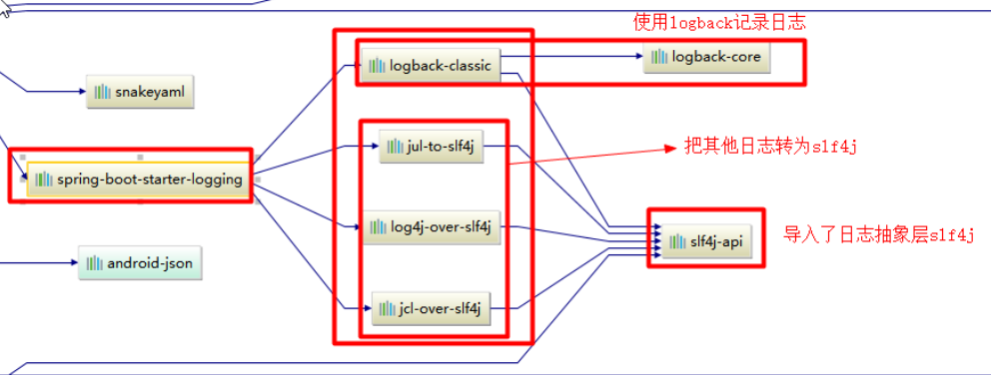
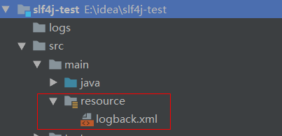

## 说明

## 目录

## 基本使用

> 1. 项目统一使用slf4j（基于门面设计模式的日志接口框架）作为日志接口
>
> 2. slf4j提供了将其它日志框架切换到slf4j的包，要使用slf4j，需要先将原始的jar进行移除，添加slf4j提供的包进行替换、
>
> 3. slf4j提供了2种包
>
>    > - xx-to-slf4j：将某个日志框架切换到使用slf4j进行输出日志，它实际上是一个偷天换日包，它的包结构和原始的日志包内部的日志接口调用切换到slf4j，然后在项目中添加一个实现了slf4j的日志框架，如logback，这样项目中的所有日志记录就会全部使用logback；如果不想使用logback作为日志框架，则可以去掉logback的依赖，然后倒入其它的日志框架，如log4j2,不过这样是不够的，还需要将log4j2整合到slf4j，就需要添加一个适配包，如slf4j-log4j12，这样就切换成功了
>    >
>    >   
>    >
>    > - slf4j-xxx：slf4j和某个日志框架的适配包，slf4j会在类路径下寻找binder,适配包的作用就是提供这样一个binder，由于logback本身就实现了slf4j，所以不需要提供类似的binder
>
> 4. logback.xml
>
>    > - 需要放在类路径下，maven工程可以放在resources目录下，java工程放在src下即可
>    >
>    >   
>    >
>    > - 配置demo
>    >
>    >   ```xml
>    >   <?xml version="1.0"?>
>    >   <configuration>
>    >       <!-- 定义日志的根目录 -->
>    >       <property name="LOG_HOME" value="logs" />
>    >       <!-- 定义日志文件名称 -->
>    >       <property name="appName" value="sugar_log"/>
>    >   
>    >       <!-- ch.qos.logback.core.ConsoleAppender 控制台输出 -->
>    >       <appender name="console" class="ch.qos.logback.core.ConsoleAppender">
>    >           <encoder>
>    >               <pattern>[%-5level] %d{yyyy-MM-dd HH:mm:ss.SSS} [%thread] %logger{36} %line: %msg%n
>    >               </pattern>
>    >           </encoder>
>    >       </appender>
>    >   
>    >       <!-- ch.qos.logback.core.rolling.RollingFileAppender 文件日志输出 -->
>    >       <appender name="file"
>    >                 class="ch.qos.logback.core.rolling.RollingFileAppender">
>    >           <File>${LOG_HOME}/${appName}.log</File>
>    >           <encoder>
>    >               <Pattern>[%-5level] %d{yyyy-MM-dd HH:mm:ss} [%thread] %logger{36} : %msg %n</Pattern>
>    >               <charset>UTF-8</charset>  <!--解决中文乱码问题-->
>    >           </encoder>
>    >           <rollingPolicy class="ch.qos.logback.core.rolling.TimeBasedRollingPolicy">
>    >               <FileNamePattern>${LOG_HOME}/${appName}-%d{yyyy-MM-dd}-%i.log
>    >               </FileNamePattern>
>    >               <MaxHistory>10</MaxHistory>
>    >               <!--
>    >                 当日志文件超过maxFileSize指定的大小是，根据上面提到的%i进行日志文件滚动
>    >                  注意此处配置SizeBasedTriggeringPolicy是无法实现按文件大小进行滚动的，
>    >                  必须配置timeBasedFileNamingAndTriggeringPolicy
>    >               -->
>    >               <TimeBasedFileNamingAndTriggeringPolicy
>    >                       class="ch.qos.logback.core.rolling.SizeAndTimeBasedFNATP">
>    >                   <MaxFileSize>5MB</MaxFileSize>
>    >               </TimeBasedFileNamingAndTriggeringPolicy>
>    >           </rollingPolicy>
>    >       </appender>
>    >   
>    >       <!-- 将上面两个 appender 关联到我们的项目 -->
>    >       <logger name="com.sugar" level="DEBUG" additivity="false"> <!-- name 是项目包名，为了方便调试，输出 DEBUG 级别及其以上的log -->
>    >           <appender-ref ref="console"/>
>    >           <appender-ref ref="file" />
>    >       </logger>
>    >   
>    >       <!--
>    >          root与logger是父子关系，没有特别定义则默认为root，任何一个类只会和一个logger对应，
>    >          要么是定义的logger，要么是root，判断的关键在于找到这个logger，然后判断这个logger的appender和level。
>    >      -->
>    >       <!-- 日志级别 -->
>    >       <root>
>    >           <!-- 定义了ERROR和INFO级别的日志，分别在FILE文件和控制台输出 -->
>    >           <level value="error" />
>    >           <level value="info" />
>    >           <appender-ref ref="file" />
>    >           <appender-ref ref="console" />
>    >       </root>
>    >   </configuration>
>    >   ```
>    >
>    > - 1

## 各个日志框架jar一览

[slf4j、jcl、jul、log4j1、log4j2、logback大总结](https://my.oschina.net/pingpangkuangmo/blog/410224)

### log4j

> - log4j：log4j1的全部内容

### log4j2

> - log4j-api:log4j2定义的API
> - log4j-core:log4j2上述API的实现

### logback

> - logback-core:logback的核心包
> - logback-classic：logback实现了slf4j的API

### commons-logging

> - commons-logging:commons-logging的原生全部内容
> - log4j-jcl:commons-logging到log4j2的桥梁
> - jcl-over-slf4j：commons-logging到slf4j的桥梁

### slf4j转向某个实际的日志框架

> 场景介绍：如 使用slf4j的API进行编程，底层想使用log4j1来进行实际的日志输出，这就是slf4j-log4j12干的事。
>
> - slf4j-jdk14：slf4j到jdk-logging的桥梁
> - slf4j-log4j12：slf4j到log4j1的桥梁
> - log4j-slf4j-impl：slf4j到log4j2的桥梁
> - logback-classic：slf4j到logback的桥梁
> - slf4j-jcl：slf4j到commons-logging的桥梁

### 某个实际的日志框架转向slf4j

> 场景介绍：如 使用log4j1的API进行编程，但是想最终通过logback来进行输出，所以就需要先将log4j1的日志输出转交给slf4j来输出，slf4j再交给logback来输出。将log4j1的输出转给slf4j，这就是log4j-over-slf4j做的事
>
> 这一部分主要用来进行实际的日志框架之间的切换
>
> - jul-to-slf4j：jdk-logging到slf4j的桥梁
> - log4j-over-slf4j：log4j1到slf4j的桥梁
> - jcl-over-slf4j：commons-logging到slf4j的桥梁