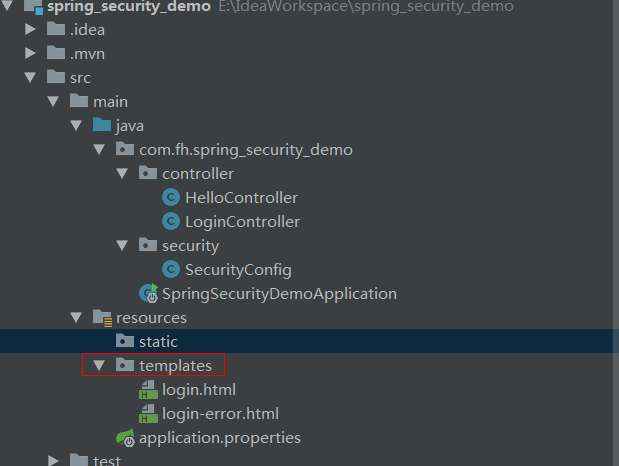
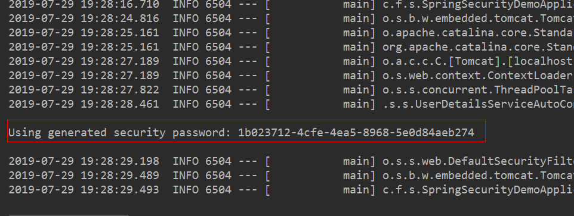

## 说明

## 目录

## 使用springboot集成springSecurity

### 添加pom依赖

```xml
    <dependencies>
        <dependency>
            <groupId>org.springframework.boot</groupId>
            <artifactId>spring-boot-starter-security</artifactId>
        </dependency>
        <dependency>
            <groupId>org.springframework.boot</groupId>
            <artifactId>spring-boot-starter-web</artifactId>
        </dependency>

        <dependency>
            <groupId>org.springframework.boot</groupId>
            <artifactId>spring-boot-starter-test</artifactId>
            <scope>test</scope>
        </dependency>
        <dependency>
            <groupId>org.springframework.security</groupId>
            <artifactId>spring-security-test</artifactId>
            <scope>test</scope>
        </dependency>
        <!--thymeleaf默认将资源映射到resources/templates下,后缀为html-->
        <dependency>
            <groupId>org.springframework.boot</groupId>
            <artifactId>spring-boot-starter-thymeleaf</artifactId>
        </dependency>
    </dependencies>
```



### 使用springSecurity默认配置

> 默认配置会拦截所有url，当访问服务器任意url时，会弹出一个登陆认证窗口，默认用户名为user，密码会在springboot启动时打印在控制台



### 配置登陆页面和错误页面

> 编写配置类需要继承`WebSecurityConfigurerAdapter`，并重写`void configure(HttpSecurity http)`方法	

#### SecurityConfig.java

```java
@Configurable
@EnableWebSecurity
public class SecurityConfig extends WebSecurityConfigurerAdapter {

    @Override
    protected void configure(HttpSecurity http) throws Exception {
        http
                //表单登录，permitAll()表示这个不需要验证 登录页面，登录失败页面
                .formLogin().loginPage("/login").loginProcessingUrl("/login/form").failureUrl("/login-error").permitAll()
                .and()
                .authorizeRequests().anyRequest().authenticated()
                .and()
                .csrf().disable();
    }
}
```

#### LoginController.java

```java
@Controller
public class LoginController {

    @RequestMapping(value = "/login")
    public String login(){
        return "login";
    }

    @RequestMapping(value = "/login-error")
    public String loginError(){
        return "login-error";
    }
}
```

#### login.html

```html
<!DOCTYPE html>
<html lang="en">
<head>
    <meta charset="UTF-8">
    <title>登录页面</title>
    <link rel="stylesheet" href="https://cdn.bootcss.com/bootstrap/3.3.7/css/bootstrap.min.css"/>
</head>
<body>
<form class="form-signin" action="/login/form" method="post">
    <h2 class="form-signin-heading">用户登录</h2>
    <table>
        <tr>
            <td>用户名:</td>
            <td><input type="text" name="username" class="form-control" placeholder="请输入用户名"/></td>
        </tr>
        <tr>
            <td>密码:</td>
            <td><input type="password" name="password" class="form-control" placeholder="请输入密码"/></td>
        </tr>
        <tr>

            <td colspan="2">
                <button type="submit" class="btn btn-lg btn-primary btn-block">登录</button>
            </td>
        </tr>
    </table>
</form>
</body>
</html>
```

#### login-error.html

```html
<!DOCTYPE html>
<html lang="en">
<head>
    <meta charset="UTF-8">
    <title>登录错误页面</title>
    <link rel="stylesheet" href="https://cdn.bootcss.com/bootstrap/3.3.7/css/bootstrap.min.css" />
</head>
<body>
    <h3>用户名或密码错误</h3>
</body>
</html>
```

### 自定义用户名和密码

> 需要重写`WebSecurityConfigurerAdapter`类的`void configure(AuthenticationManagerBuilder auth)`方法

```java
@Configurable
@EnableWebSecurity
public class SecurityConfig extends WebSecurityConfigurerAdapter {

    @Override
    protected void configure(HttpSecurity http) throws Exception {
        http
                //表单登录，permitAll()表示这个不需要验证 登录页面，登录失败页面
                .formLogin().loginPage("/login").loginProcessingUrl("/login/form").failureUrl("/login-error").permitAll()
                .and()
                .authorizeRequests().anyRequest().authenticated()
                .and()
                .csrf().disable();
    }

    /**
     * inMemoryAuthentication表示用户信息从内存获取,也可设置其它方式，如从数据库进行获取,设置密码必须使用密码编码器进行编码，并且必须将对应的密码编码器注入spring容器
     */
    @Override
    protected void configure(AuthenticationManagerBuilder auth) throws Exception {
        auth
                .inMemoryAuthentication()
                .withUser("admin").password(new BCryptPasswordEncoder().encode("123456")).roles("USER");
    }

    /**
     * 将对应的密码编码器注入spring容器，若不注入，则会抛出There is no PasswordEncoder mapped for the id "null"错误
     */
    @Bean
    public PasswordEncoder passwordEncoder() {
        return new BCryptPasswordEncoder();
    }
}
```

#### 定义多个用户

> 使用and进行连接即可

```java
@Override
protected void configure(AuthenticationManagerBuilder auth) throws Exception {
    auth
            .inMemoryAuthentication()
            .withUser("admin").password(new BCryptPasswordEncoder().encode("123456")).roles("USER")
            .and()
            .withUser("test").password(new BCryptPasswordEncoder().encode("111111")).roles("USER");
}
```

### Spring Security原理

> - spring security的原理就是使用很多的拦截器对URL进行拦截，以此来管理登录验证和用户权限验证。
>
> - 用户登陆，会被AuthenticationProcessingFilter拦截，调用AuthenticationManager的实现，而且AuthenticationManager会调用ProviderManager来获取用户验证信息（不同的Provider调用的服务不同，因为这些信息可以是在数据库上，可以是在LDAP服务器上，可以是xml配置文件上等），如果验证通过后会将用户的权限信息封装一个User放到spring的全局缓存SecurityContextHolder中，以备后面访问资源时使用
>
> - 所以我们要自定义用户的校验机制的话，我们只要实现自己的AuthenticationProvider就可以了。在用AuthenticationProvider 这个之前，我们需要提供一个获取用户信息的服务，实现  UserDetailsService 接口
>
>   用户名密码->(Authentication(未认证)  ->  AuthenticationManager ->AuthenticationProvider->UserDetailService->UserDetails->Authentication(已认证）

#### UserInfo.java

```java
class UserInfo implements Serializable, UserDetails {
      /**
       *
       */
      private static final long serialVersionUID = 1L;
      private String username;
      private String password;
      private String role;
      private boolean accountNonExpired;
      private boolean accountNonLocked;
      private boolean credentialsNonExpired;
      private boolean enabled;
      public UserInfo(String username, String password, String role, boolean accountNonExpired, boolean accountNonLocked,
                  boolean credentialsNonExpired, boolean enabled) {
            this.username = username;
            this.password = password;
            this.role = role;
            this.accountNonExpired = accountNonExpired;
            this.accountNonLocked = accountNonLocked;
            this.credentialsNonExpired = credentialsNonExpired;
            this.enabled = enabled;
      }
      // 这是权限
      @Override
      public Collection<? extends GrantedAuthority> getAuthorities() {
            return AuthorityUtils.commaSeparatedStringToAuthorityList(role);
      }
      @Override
      public String getPassword() {
            return password;
      }
      @Override
      public String getUsername() {
            return username;
      }
      @Override
      public boolean isAccountNonExpired() {
            return accountNonExpired;
      }
      @Override
      public boolean isAccountNonLocked() {
            return accountNonLocked;
      }
      @Override
      public boolean isCredentialsNonExpired() {
            return credentialsNonExpired;
      }
      @Override
      public boolean isEnabled() {
            return enabled;
      }
}
```

#### MyUserDetailsService.java

```java
@Component("myUserDetailsService")
public class MyUserDetailsService implements UserDetailsService {

    @Override
    public UserDetails loadUserByUsername(String username) throws UsernameNotFoundException {
        //这里可以可以通过username（登录时输入的用户名）然后到数据库中找到对应的用户信息，并构建成我们自己的UserInfo来返回。
        if (username.equals("admin")) {
            //假设返回的用户信息如下;
            UserInfo userInfo = new UserInfo("admin", "123456", "ROLE_ADMIN", true, true, true, true);
            return userInfo;

        }
        return null;

    }

}
```

#### MyAuthenticationProvider.java

```java
@Component
public class MyAuthenticationProvider implements AuthenticationProvider {
    /**
     * 注入我们自己定义的用户信息获取对象
     */
    @Autowired
    @Qualifier("myUserDetailsService")
    private UserDetailsService userDetailService;

    @Override
    public Authentication authenticate(Authentication authentication) throws AuthenticationException {
        // TODO Auto-generated method stub
        String userName = authentication.getName();// 这个获取表单输入中返回的用户名;
        String password = (String) authentication.getCredentials();// 这个是表单中输入的密码；
        // 这里构建来判断用户是否存在和密码是否正确
        UserInfo userInfo = (UserInfo) userDetailService.loadUserByUsername(userName); // 这里调用我们的自己写的获取用户的方法；
        if (userInfo == null) {
            throw new BadCredentialsException("用户名不存在");
        }
        // //这里我们还要判断密码是否正确，实际应用中，我们的密码一般都会加密，以Md5加密为例
//         Md5PasswordEncoder md5PasswordEncoder=new Md5PasswordEncoder();
        // //这里第个参数，是salt
        // 就是加点盐的意思，这样的好处就是用户的密码如果都是123456，由于盐的不同，密码也是不一样的，就不用怕相同密码泄漏之后，不会批量被破解。
//         String encodePwd=md5PasswordEncoder.encodePassword(password, userName);
        // //这里判断密码正确与否
        // if(!userInfo.getPassword().equals(encodePwd))
        // {
        // throw new BadCredentialsException("密码不正确");
        // }
        // //这里还可以加一些其他信息的判断，比如用户账号已停用等判断，这里为了方便我接下去的判断，我就不用加密了。
        //
        //
        if (!userInfo.getPassword().equals("123456")) {
            throw new BadCredentialsException("密码不正确");
        }
        Collection<? extends GrantedAuthority> authorities = userInfo.getAuthorities();
        // 构建返回的用户登录成功的token
        return new UsernamePasswordAuthenticationToken(userInfo, password, authorities);
    }

    @Override
    public boolean supports(Class<?> authentication) {
        // 这里直接改成retrun true;表示是支持这个执行
        return true;
    }
}
```

#### 改造SecurityConfig.java

```java
@Configurable
@EnableWebSecurity
public class SecurityConfig extends WebSecurityConfigurerAdapter {

    @Autowired
    private AuthenticationProvider provider;

    @Override
    protected void configure(HttpSecurity http) throws Exception {
        http
                //表单登录，permitAll()表示这个不需要验证 登录页面，登录失败页面
                .formLogin().loginPage("/login").loginProcessingUrl("/login/form").failureUrl("/login-error").permitAll()
                .and()
                .authorizeRequests().anyRequest().authenticated()
                .and()
                .csrf().disable();
    }

    @Override
    protected void configure(AuthenticationManagerBuilder auth) {
        auth.authenticationProvider(provider);
    }

    /**
     * 将对应的密码编码器注入spring容器
     */
    @Bean
    public PasswordEncoder passwordEncoder() {
        return new BCryptPasswordEncoder();
    }
}
```

