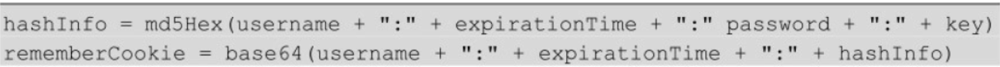

## 说明

## 目录

## 使用springboot集成springSecurity

### 添加pom依赖

```xml
    <dependencies>
        <dependency>
            <groupId>org.springframework.boot</groupId>
            <artifactId>spring-boot-starter-security</artifactId>
        </dependency>
        <dependency>
            <groupId>org.springframework.boot</groupId>
            <artifactId>spring-boot-starter-web</artifactId>
        </dependency>

        <dependency>
            <groupId>org.springframework.boot</groupId>
            <artifactId>spring-boot-starter-test</artifactId>
            <scope>test</scope>
        </dependency>
        <dependency>
            <groupId>org.springframework.security</groupId>
            <artifactId>spring-security-test</artifactId>
            <scope>test</scope>
        </dependency>
        <!--thymeleaf默认将资源映射到resources/templates下,后缀为html-->
        <dependency>
            <groupId>org.springframework.boot</groupId>
            <artifactId>spring-boot-starter-thymeleaf</artifactId>
        </dependency>
    </dependencies>
```


### 使用springSecurity默认配置

> 默认配置会拦截所有url，当访问服务器任意url时，会弹出一个登陆认证窗口，默认用户名为user，密码会在springboot启动时打印在控制台


### 修改springSecurity默认用户名和密码

> **不建议使用**,修改后控制台就不会打印随机密码了

```yml
spring:
  security:
    user:
      name: user
      password: 123456
```

### 配置登陆页面和错误页面

> 编写配置类需要继承`WebSecurityConfigurerAdapter`，并重写`void configure(HttpSecurity http)`方法	

#### SecurityConfig.java

```java
@EnableWebSecurity
public class WebSecurityConfig extends WebSecurityConfigurerAdapter {
    @Override
    protected void configure(HttpSecurity http) throws Exception {
        http
                //表单登录，permitAll()表示登录相关的3个url不需要验证 登录页面，登录失败页面
                .formLogin().loginPage("/myLogin.html").loginProcessingUrl("/login/form").failureUrl("/login-error.html").permitAll()
                //登录成功后的执行逻辑，可以返回json，也可以重定向
                .successHandler((httpServletRequest, httpServletResponse, authentication) -> {
                    httpServletResponse.setContentType("application/json;charset=utf-8");
                    //返回json数据
                    Map<String,Object> result = new HashMap<>();
                    result.put("error_code",0);
                    result.put("message","欢迎登录系统");
                    httpServletResponse.getWriter().write(JSON.toJSONString(result));
                })
                .failureHandler((httpServletRequest, httpServletResponse, e) -> {
                    httpServletResponse.setContentType("application/json;charset=utf-8");
                    httpServletResponse.setStatus(401);
                    //返回json数据
                    Map<String,Object> result = new HashMap<>();
                    result.put("error_code",401);
                    result.put("message","用户名或密码错误");
                    httpServletResponse.getWriter().write(JSON.toJSONString(result));
                })
                .and()
                .authorizeRequests().anyRequest().authenticated()
                .and()
                .csrf().disable();
    }
}
```

#### login.html

```html
<!DOCTYPE html>
<html lang="en">
<head>
    <meta charset="UTF-8">
    <title>登录页面</title>
    <link rel="stylesheet" href="https://cdn.bootcss.com/bootstrap/3.3.7/css/bootstrap.min.css"/>
</head>
<body>
<form class="form-signin" action="/login/form" method="post">
    <h2 class="form-signin-heading">用户登录</h2>
    <table>
        <tr>
            <td>用户名:</td>
            <td><input type="text" name="username" class="form-control" placeholder="请输入用户名"/></td>
        </tr>
        <tr>
            <td>密码:</td>
            <td><input type="password" name="password" class="form-control" placeholder="请输入密码"/></td>
        </tr>
        <tr>

            <td colspan="2">
                <button type="submit" class="btn btn-lg btn-primary btn-block">登录</button>
            </td>
        </tr>
    </table>
</form>
</body>
</html>
```

#### login-error.html

```html
<!DOCTYPE html>
<html lang="en">
<head>
    <meta charset="UTF-8">
    <title>登录错误页面</title>
    <link rel="stylesheet" href="https://cdn.bootcss.com/bootstrap/3.3.7/css/bootstrap.min.css" />
</head>
<body>
    <h3>用户名或密码错误</h3>
</body>
</html>
```

### 配置认证

> - /admin/api：需要登录，但是登录后403没有权限，因为默认是User角色
> - /user/api/：登录后正常访问
> - /app/api/：无需登录
> - 其它url：需要登录

```java
@Override
protected void configure(HttpSecurity http) throws Exception {
    http.authorizeRequests()
            .antMatchers("/admin/api/**").hasRole("ADMIN")
            //在没有任何配置的情况下，默认是USER角色
            .antMatchers("/user/api/**").hasRole("USER")
            .antMatchers("/app/api/**").permitAll()
            .anyRequest().authenticated()
            .and()
            .formLogin();
}
```

### 多用户

> 需要重写`WebSecurityConfigurerAdapter`类的`void configure(AuthenticationManagerBuilder auth)`方法

```java
@Configurable
@EnableWebSecurity
public class SecurityConfig extends WebSecurityConfigurerAdapter {

    @Override
    protected void configure(HttpSecurity http) throws Exception {
        http
                //表单登录，permitAll()表示这个不需要验证 登录页面，登录失败页面
                .formLogin().loginPage("/login").loginProcessingUrl("/login/form").failureUrl("/login-error").permitAll()
                .and()
                .authorizeRequests().anyRequest().authenticated()
                .and()
                .csrf().disable();
    }

    /**
     * inMemoryAuthentication表示用户信息从内存获取,也可设置其它方式，如从数据库进行获取,设置密码必须使用密码编码器进行编码，并且必须将对应的密码编码器注入spring容器
     */
    @Override
    protected void configure(AuthenticationManagerBuilder auth) throws Exception {
        auth
                .inMemoryAuthentication()
                .withUser("admin").password(new BCryptPasswordEncoder().encode("123456")).roles("USER");
    }

    /**
     * 将对应的密码编码器注入spring容器，若不注入，则会抛出There is no PasswordEncoder mapped for the id "null"错误
     */
    @Bean
    public PasswordEncoder passwordEncoder() {
        return new BCryptPasswordEncoder();
    }
}
```

#### 定义多个用户

> 使用and进行连接即可

```java
@Override
protected void configure(AuthenticationManagerBuilder auth) throws Exception {
    auth
            .inMemoryAuthentication()
            .withUser("admin").password(new BCryptPasswordEncoder().encode("123456")).roles("USER")
            .and()
            .withUser("test").password(new BCryptPasswordEncoder().encode("111111")).roles("USER");
}
```

#### 基于内存的多用户支持

```java
@Configuration
public class AppConfig {

    @Bean
    public UserDetailsService userDetailsService(){
        InMemoryUserDetailsManager manager = new InMemoryUserDetailsManager();
        manager.createUser(User.withUsername("zhangsan").password(new BCryptPasswordEncoder().encode("123456")).roles("USER").build());
        manager.createUser(User.withUsername("lisi").password(new BCryptPasswordEncoder().encode("123456")).roles("ADMIN").build());

        return manager;
    }

    /**
     * 将对应的密码编码器注入spring容器，若不注入，则会抛出There is no PasswordEncoder mapped for the id "null"错误
     */
    @Bean
    public PasswordEncoder passwordEncoder() {
        return new BCryptPasswordEncoder();
    }

}
```

#### 基于数据库实现多用户

> 使用JdbcUserDetailsManager

##### 执行数据库建表脚本

```sql
create table users
(
    username varchar(50) not null primary key,
    password varchar(500) not null,
    enabled boolean not null
);
create table authorities
(
    username varchar(50) not null,
    authority varchar(50) not null,
    constraint fk_authorities_users foreign key (username) references users (username)
);
create unique index ix_auth_username on authorities (username, authority);
```

##### 配置

> - 这里使用了mybatis-plus的多数据源方案，在类上标注DS注解指定注入的数据源
> - 重启应用后就会在数据库创建2个用户

```java
@Configuration
@DS("test")
public class AppConfig {

    @Autowired
    private DataSource dataSource;

    @Bean
    public UserDetailsService userDetailsService() {
        JdbcUserDetailsManager manager = new JdbcUserDetailsManager();
        manager.setDataSource(dataSource);
        //应用启动时创建用户，存在则不创建
        if (!manager.userExists("zhangsan")) {
            manager.createUser(User.withUsername("zhangsan").password(new BCryptPasswordEncoder().encode("123456")).roles("USER").build());
        }
        if (!manager.userExists("lisi")) {
            manager.createUser(User.withUsername("lisi").password(new BCryptPasswordEncoder().encode("123456")).roles("ADMIN").build());
        }

        return manager;
    }

    /**
     * 将对应的密码编码器注入spring容器，若不注入，则会抛出There is no PasswordEncoder mapped for the id "null"错误
     */
    @Bean
    public PasswordEncoder passwordEncoder() {
        return new BCryptPasswordEncoder();
    }

}
```

##### 数据库

> 密码是加密过的


### Spring Security原理

> - spring security的原理就是使用很多的拦截器对URL进行拦截，以此来管理登录验证和用户权限验证。
>
> - 用户登陆，会被AuthenticationProcessingFilter拦截，调用AuthenticationManager的实现，而且AuthenticationManager会调用ProviderManager来获取用户验证信息（不同的Provider调用的服务不同，因为这些信息可以是在数据库上，可以是在LDAP服务器上，可以是xml配置文件上等），如果验证通过后会将用户的权限信息封装一个User放到spring的全局缓存SecurityContextHolder中，以备后面访问资源时使用
>
> - 所以我们要自定义用户的校验机制的话，我们只要实现自己的AuthenticationProvider就可以了。在用AuthenticationProvider 这个之前，我们需要提供一个获取用户信息的服务，实现  UserDetailsService 接口
>
>   用户名密码->(Authentication(未认证)  ->  AuthenticationManager ->AuthenticationProvider->UserDetailService->UserDetails->Authentication(已认证）

#### UserInfo.java

```java
class UserInfo implements Serializable, UserDetails {
      /**
       *
       */
      private static final long serialVersionUID = 1L;
      private String username;
      private String password;
      private String role;
      private boolean accountNonExpired;
      private boolean accountNonLocked;
      private boolean credentialsNonExpired;
      private boolean enabled;
      public UserInfo(String username, String password, String role, boolean accountNonExpired, boolean accountNonLocked,
                  boolean credentialsNonExpired, boolean enabled) {
            this.username = username;
            this.password = password;
            this.role = role;
            this.accountNonExpired = accountNonExpired;
            this.accountNonLocked = accountNonLocked;
            this.credentialsNonExpired = credentialsNonExpired;
            this.enabled = enabled;
      }
      // 这是权限
      @Override
      public Collection<? extends GrantedAuthority> getAuthorities() {
            return AuthorityUtils.commaSeparatedStringToAuthorityList(role);
      }
      @Override
      public String getPassword() {
            return password;
      }
      @Override
      public String getUsername() {
            return username;
      }
      @Override
      public boolean isAccountNonExpired() {
            return accountNonExpired;
      }
      @Override
      public boolean isAccountNonLocked() {
            return accountNonLocked;
      }
      @Override
      public boolean isCredentialsNonExpired() {
            return credentialsNonExpired;
      }
      @Override
      public boolean isEnabled() {
            return enabled;
      }
}
```

#### MyUserDetailsService.java

```java
@Component("myUserDetailsService")
public class MyUserDetailsService implements UserDetailsService {

    @Override
    public UserDetails loadUserByUsername(String username) throws UsernameNotFoundException {
        //这里可以可以通过username（登录时输入的用户名）然后到数据库中找到对应的用户信息，并构建成我们自己的UserInfo来返回。
        if (username.equals("admin")) {
            //假设返回的用户信息如下;
            UserInfo userInfo = new UserInfo("admin", "123456", "ROLE_ADMIN", true, true, true, true);
            return userInfo;

        }
        return null;

    }

}
```

#### MyAuthenticationProvider.java

```java
@Component
public class MyAuthenticationProvider implements AuthenticationProvider {
    /**
     * 注入我们自己定义的用户信息获取对象
     */
    @Autowired
    @Qualifier("myUserDetailsService")
    private UserDetailsService userDetailService;

    @Override
    public Authentication authenticate(Authentication authentication) throws AuthenticationException {
        // TODO Auto-generated method stub
        String userName = authentication.getName();// 这个获取表单输入中返回的用户名;
        String password = (String) authentication.getCredentials();// 这个是表单中输入的密码；
        // 这里构建来判断用户是否存在和密码是否正确
        UserInfo userInfo = (UserInfo) userDetailService.loadUserByUsername(userName); // 这里调用我们的自己写的获取用户的方法；
        if (userInfo == null) {
            throw new BadCredentialsException("用户名不存在");
        }
        // //这里我们还要判断密码是否正确，实际应用中，我们的密码一般都会加密，以Md5加密为例
//         Md5PasswordEncoder md5PasswordEncoder=new Md5PasswordEncoder();
        // //这里第个参数，是salt
        // 就是加点盐的意思，这样的好处就是用户的密码如果都是123456，由于盐的不同，密码也是不一样的，就不用怕相同密码泄漏之后，不会批量被破解。
//         String encodePwd=md5PasswordEncoder.encodePassword(password, userName);
        // //这里判断密码正确与否
        // if(!userInfo.getPassword().equals(encodePwd))
        // {
        // throw new BadCredentialsException("密码不正确");
        // }
        // //这里还可以加一些其他信息的判断，比如用户账号已停用等判断，这里为了方便我接下去的判断，我就不用加密了。
        //
        //
        if (!userInfo.getPassword().equals("123456")) {
            throw new BadCredentialsException("密码不正确");
        }
        Collection<? extends GrantedAuthority> authorities = userInfo.getAuthorities();
        // 构建返回的用户登录成功的token
        return new UsernamePasswordAuthenticationToken(userInfo, password, authorities);
    }

    @Override
    public boolean supports(Class<?> authentication) {
        // 这里直接改成retrun true;表示是支持这个执行
        return true;
    }
}
```

#### 改造SecurityConfig.java

```java
@Configurable
@EnableWebSecurity
public class SecurityConfig extends WebSecurityConfigurerAdapter {

    @Autowired
    private AuthenticationProvider provider;

    @Override
    protected void configure(HttpSecurity http) throws Exception {
        http
                //表单登录，permitAll()表示这个不需要验证 登录页面，登录失败页面
                .formLogin().loginPage("/login").loginProcessingUrl("/login/form").failureUrl("/login-error").permitAll()
                .and()
                .authorizeRequests().anyRequest().authenticated()
                .and()
                .csrf().disable();
    }

    @Override
    protected void configure(AuthenticationManagerBuilder auth) {
        auth.authenticationProvider(provider);
    }

    /**
     * 将对应的密码编码器注入spring容器
     */
    @Bean
    public PasswordEncoder passwordEncoder() {
        return new BCryptPasswordEncoder();
    }
}
```

## 自定义数据库模型认证和授权

### 自定义UserDetailsService

```java
@Component
public class MyUserDetailsServiceImpl implements UserDetailsService {
    @Autowired
    private CustomUsersDao customUsersDao;

    @Override
    public UserDetails loadUserByUsername(String s) throws UsernameNotFoundException {
        Optional<CustomUsers> userOp = customUsersDao.queryUserByUsername(s);
        if (!userOp.isPresent()) {
            throw new UsernameNotFoundException("用户不存在");
        }
        CustomUsers user = userOp.get();
        //将逗号分隔的权限切开
 user.setGrantedAuthorities(AuthorityUtils.commaSeparatedStringToAuthorityList(user.getRoles()));

        return user;
    }

    /**
     * 这里使用一个不加密的加密器，方便测试，生产环境不能使用
     */
    @Bean
    public PasswordEncoder passwordEncoder() {
        return NoOpPasswordEncoder.getInstance();
    }
}
```

### 自定义的用户表

```sql
create table custom_users
(
    id       int auto_increment
        primary key,
    username varchar(50)   null,
    password varchar(255)  null,
    enable   int default 1 null comment '用户是否可用，0:不可用,1:可用',
    roles    text          null comment '多个角色使用逗号分隔'
)
    comment '自定义用户表';

create index custom_users_username_index
    on custom_users (username);
```


### 实体类

> 实现UserDetails接口，主要是返回角色列表List<GrantedAuthority>

```java
@Data
public class CustomUsers implements UserDetails {

    @TableId
    private Long id;
    private String username;
    private String password;
    private Boolean enable;
    private String roles;

    @TableField(exist = false)
    private List<GrantedAuthority> grantedAuthorities;

    public void setGrantedAuthorities(List<GrantedAuthority> grantedAuthorities) {
        this.grantedAuthorities = grantedAuthorities;
    }

    @Override
    public Collection<? extends GrantedAuthority> getAuthorities() {
        return grantedAuthorities;
    }

    @Override
    public boolean isAccountNonExpired() {
        return true;
    }

    @Override
    public boolean isAccountNonLocked() {
        return true;
    }

    @Override
    public boolean isCredentialsNonExpired() {
        return true;
    }

    @Override
    public boolean isEnabled() {
        return this.enable;
    }
}
```

## 图形验证码

### 引入验证码生成jar包

```xml
<!-- 图形验证码 -->
<dependency>
    <groupId>com.github.penggle</groupId>
    <artifactId>kaptcha</artifactId>
    <version>2.3.2</version>
</dependency>
```

### 编写生成验证码请求

```java
@Controller
public class KaptchaController {
    private static final Logger LOGGER = LoggerFactory.getLogger(KaptchaController.class);

    @Autowired
    private Producer producer;

    @GetMapping("/getKaptcha")
    public void getKaptcha(HttpServletRequest request, HttpServletResponse response) {
        response.setContentType("image/jpeg");
        //生成验证码
        String text = producer.createText();
        //验证码保存到session
        request.getSession().setAttribute("kaptcha", text);
        //生成验证码图片
        BufferedImage image = producer.createImage(text);
        try (OutputStream out = response.getOutputStream()) {
            ImageIO.write(image, "jpg", out);
            out.flush();
        } catch (Exception e) {
            LOGGER.error(e.getMessage(), e);
        }

    }
}
```

### 修改登陆页面

> 登陆请求url:/auth/form

```html
<!DOCTYPE html>
<html lang="en">
<head>
    <meta charset="UTF-8">
    <title>登录页面</title>
    <link rel="stylesheet" href="https://cdn.bootcss.com/bootstrap/3.3.7/css/bootstrap.min.css"/>
</head>
<body>
<form class="form-signin" action="/auth/form" method="post">
    <h2 class="form-signin-heading">用户登录</h2>
    <table>
        <tr>
            <td>用户名:</td>
            <td><input type="text" name="username" class="form-control" placeholder="请输入用户名"/></td>
        </tr>
        <tr>
            <td>密码:</td>
            <td><input type="password" name="password" class="form-control" placeholder="请输入密码"/></td>
        </tr>
        <tr>
            <td>验证码:</td>
            <td><input type="text" name="kaptcha" class="form-control" placeholder="请输入验证码"/></td>
            <td></td>
        </tr>
        <tr>

            <td colspan="2">
                <button type="submit" class="btn btn-lg btn-primary btn-block">登录</button>
            </td>
        </tr>
    </table>
</form>
</body>
</html>
```

### spring security配置

```java
@EnableWebSecurity
public class WebSecurityConfig extends WebSecurityConfigurerAdapter {

    @Override
    protected void configure(HttpSecurity http) throws Exception {
        http.authorizeRequests()
                .antMatchers("/admin/api/**").hasRole("ADMIN")
                //在没有任何配置的情况下，默认是USER角色
                .antMatchers("/user/api/**").hasRole("USER")
                .antMatchers("/app/api/**", "/getKaptcha","/myLogin.html").permitAll()
                .anyRequest().authenticated()
                .and()
                //关闭csrf防护功能，否则请求没带token是无法登陆成功的，会一直重定向到登陆页面
                .csrf().disable()
                .formLogin()
                .loginPage("/myLogin.html")
                //默认是/login,对应form表单中的请求
                .loginProcessingUrl("/auth/form").permitAll()
                .failureUrl("/login-error.html");

        //添加验证码过滤器在用户校验之前
        http.addFilterBefore(new VerificationCodeFilter(), UsernamePasswordAuthenticationFilter.class);
    }
}
```

### 验证码过滤器

```java
/**
 * 一次请求只会通过一次该过滤器
 */
public class VerificationCodeFilter extends OncePerRequestFilter {
    @Override
    protected void doFilterInternal(HttpServletRequest request, HttpServletResponse response, FilterChain filterChain) throws ServletException, IOException {
        System.out.println(request.getRequestURI());
        //非登录请求放行
        if (!"/auth/form".equals(request.getRequestURI())) {
            filterChain.doFilter(request, response);
        } else {
            verificationCode(request);
            filterChain.doFilter(request, response);
        }
    }

    private void verificationCode(HttpServletRequest request) {
        String kaptcha = request.getParameter("kaptcha");
        String kaptcha1 = (String) request.getSession().getAttribute("kaptcha");
        if (!StringUtils.isEmpty(kaptcha)) {
            //从session移除验证码
            request.getSession().removeAttribute("kaptcha");
        }

        //校验验证码
        if (StringUtils.isEmpty(kaptcha) || !kaptcha.equals(kaptcha1)) {
            throw new VerificationCodeException();
        }
    }
}
```

## 使用自定义认证实现图形验证码

> 用户校验过滤器**UsernamePasswordAuthenticationFilter**中，会使用**AuthenticationManager**进行认证，**AuthenticationManager**则使用所有的**AuthenticationProvider**对请求进行认证
>
> ```java
> org.springframework.security.web.authentication.UsernamePasswordAuthenticationFilter#attemptAuthentication
> public Authentication attemptAuthentication(HttpServletRequest request,
> 			HttpServletResponse response) throws AuthenticationException {
> 		if (postOnly && !request.getMethod().equals("POST")) {
> 			throw new AuthenticationServiceException(
> 					"Authentication method not supported: " + request.getMethod());
> 		}
> 
> 		String username = obtainUsername(request);
> 		String password = obtainPassword(request);
> 
> 		if (username == null) {
> 			username = "";
> 		}
> 
> 		if (password == null) {
> 			password = "";
> 		}
> 
> 		username = username.trim();
> 
> 		UsernamePasswordAuthenticationToken authRequest = new UsernamePasswordAuthenticationToken(
> 				username, password);
> 
> 		//设置额外信息，允许自定义，通过自定义AuthenticationDetailsSource实现
> 		setDetails(request, authRequest);
> 
>     	//认证，实际调用org.springframework.security.authentication.ProviderManager#authenticate
> 		return this.getAuthenticationManager().authenticate(authRequest);
> 	}
> ```

### 自定义认证器

> - DaoAuthenticationProvider实现了从UserDetailsService获取用户，然后和界面封装的UsernamePasswordAuthenticationToken的登录信息做校验的基本逻辑，我们只需要实现验证码的校验逻辑即可
>
> - 关键点在于如何将request对象中的验证码进行存储，并通过UsernamePasswordAuthenticationToken进行传输，它有一个方法Object getDetails()，所以我们可以保存任意对象到details

```java
@Component
public class MyAuthenticationProvider extends DaoAuthenticationProvider {

	//自动注入
    @Autowired
    public MyAuthenticationProvider(UserDetailsService userDetailsService, PasswordEncoder passwordEncoder) {
        this.setUserDetailsService(userDetailsService);
        this.setPasswordEncoder(passwordEncoder);
    }

    @Override
    protected void additionalAuthenticationChecks(UserDetails userDetails, UsernamePasswordAuthenticationToken authentication) throws AuthenticationException {
        //校验验证码
        MyWebAuthenticationDetails  myWebAuthenticationDetails= (MyWebAuthenticationDetails) authentication.getDetails();
        //判断验证码是否验证通过，没通过直接抛出异常
        if(!myWebAuthenticationDetails.isImageCodeIsRight()){
            throw new VerificationCodeException();
        }

        super.additionalAuthenticationChecks(userDetails, authentication);
    }

}
```

### 封装验证码

> - 关键是封装WebAuthenticationDetails对象，它通过AuthenticationDetailsSource进行构造

```java
/**
 * 封装request对象,验证码识别逻辑
 */
public class MyWebAuthenticationDetails extends WebAuthenticationDetails {

    //验证码是否合法
    private boolean imageCodeIsRight;

    public MyWebAuthenticationDetails(HttpServletRequest request) {
        super(request);
        //页面提交的验证码
        String kaptcha = request.getParameter("kaptcha");

        HttpSession session = request.getSession();
        //从session拿出验证码
        String rightKaptcha = (String) session.getAttribute("kaptcha");

        if (!StringUtils.isEmpty(rightKaptcha)) {
            session.removeAttribute("kaptcha");
            //校验验证码
            if (rightKaptcha.equals(kaptcha)) {
                this.imageCodeIsRight = true;
            }
        }
    }

    public boolean isImageCodeIsRight() {
        return imageCodeIsRight;
    }
}

@Component
public class MyWebAuthenticationDetailsSource implements AuthenticationDetailsSource<HttpServletRequest, WebAuthenticationDetails> {
    @Override
    public WebAuthenticationDetails buildDetails(HttpServletRequest request) {
        return new MyWebAuthenticationDetails(request);
    }
}

```

### spring security配置

> - 配置AuthenticationDetailsSource
> - 配置AuthenticationProvider

```java
@EnableWebSecurity
public class WebSecurityConfig extends WebSecurityConfigurerAdapter {

    @Autowired
    private AuthenticationDetailsSource<HttpServletRequest, WebAuthenticationDetails> authenticationDetailsSource;
    @Autowired
    private AuthenticationProvider authenticationProvider;

    /**
     * 配置任认证器
     */
    @Override
    protected void configure(AuthenticationManagerBuilder auth) throws Exception {
        auth.authenticationProvider(authenticationProvider);
    }

    @Override
    protected void configure(HttpSecurity http) throws Exception {
        http.authorizeRequests()
                .antMatchers("/admin/api/**").hasRole("ADMIN")
                //在没有任何配置的情况下，默认是USER角色
                .antMatchers("/user/api/**").hasRole("USER")
                .antMatchers("/app/api/**", "/getKaptcha", "/myLogin.html").permitAll()
                .anyRequest().authenticated()
                .and()
                //关闭csrf防护功能，否则请求没带token是无法登陆成功的，会一直重定向到登陆页面
                .csrf().disable()
                .formLogin()
                //应用authenticationDetailsSource
                .authenticationDetailsSource(authenticationDetailsSource)
                .loginPage("/myLogin.html")
                //默认是/login
                .loginProcessingUrl("/auth/form").permitAll()
                .failureUrl("/login-error.html")；
       

    }
}
```

## 自动登录

### 原理

> - 自动登录是将用户的登录信息保存在用户浏览器的cookie中，当用户下次访问时，自动实现校验
>   并建立登录态的一种机制
>
> - spring security散列算法生成令牌
>
>   
>
>   - **expirationTime**：本次自动登录的有效期
>   - **key**：指定的一个散列盐值，用于防止令牌被修改
>   - **验证方法**：根据**rememberCookie**使用**base64**解码得到**username**，然后从数据库查询得到密码，再使用**md5Hex**再计算一个**hashinfo**，然后与老的**hashinfo**对比

### 实现自动登录

#### 散列加密方案

> spring使用TokenBasedRememberMeServices实现

##### 配置

> - 默认过期时间2星期，在**AbstractRememberMeServices**中定义
> - 默认cookie名称为remember-me
> - 指定key，key的默认策略时uuid，重启会使自动登录失效，需要设置一个确定值

```java
@EnableWebSecurity
public class WebSecurityConfig extends WebSecurityConfigurerAdapter {

    @Autowired
    private UserDetailsService userDetailsService;

    @Override
    protected void configure(HttpSecurity http) throws Exception {
        http.authorizeRequests()
                .antMatchers("/admin/api/**").hasRole("ADMIN")
                //在没有任何配置的情况下，默认是USER角色
                .antMatchers("/user/api/**").hasRole("USER")
                .antMatchers("/app/api/**").permitAll()
                .anyRequest().authenticated()
                .and()
                //关闭csrf防护功能，否则请求没带token是无法登陆成功的，会一直重定向到登陆页面
                .csrf().disable()
                .formLogin()
                .and()
            	//开启功能
                .rememberMe().userDetailsService(userDetailsService)
            	.key("sugar");

    }
}
```

##### 效果

会多一个复选框


登录完成后F12可以看到保存的cookie


##### 缺点

> - 即如果该令牌在有效期内被盗取，那么用户的身份将完全暴露

#### 持久化令牌方案

> - 在持久化令牌方案中，最核心的是**series**和**token**两个值，它们都是用MD5散列过的随机字符串。
>   不同的是，series仅在用户使用密码重新登录时更新，而token会在每一个新的session中都重新生成
> - spring使用PersistentTokenBasedRememberMeServices实现

##### 创建配置表

```sql
create table persistent_logins
(
    username  varchar(50)  null,
    series    varchar(50)  not null
        primary key,
    token     varchar(100) null,
    last_used timestamp    null
)
```

##### 配置

> 配置tokenRepository，可以使用spring默认提供的JdbcTokenRepositoryImpl，也可以自己实现

```java
@EnableWebSecurity
@DS("user")
public class WebSecurityConfig extends WebSecurityConfigurerAdapter {

    @Autowired
    private UserDetailsService userDetailsService;
    @Autowired
    private DataSource dataSource;

    @Override
    protected void configure(HttpSecurity http) throws Exception {
        JdbcTokenRepositoryImpl tokenRepository = new JdbcTokenRepositoryImpl();
        tokenRepository.setDataSource(dataSource);

        http.authorizeRequests()
                .antMatchers("/admin/api/**").hasRole("ADMIN")
                //在没有任何配置的情况下，默认是USER角色
                .antMatchers("/user/api/**").hasRole("USER")
                .antMatchers("/app/api/**").permitAll()
                .anyRequest().authenticated()
                .and()
                //关闭csrf防护功能，否则请求没带token是无法登陆成功的，会一直重定向到登陆页面
                .csrf().disable()
                .formLogin()
                .and()
                .rememberMe()
                .userDetailsService(userDetailsService)
                .key("sugar")
                .tokenRepository(tokenRepository);

    }
}
```

##### 源码

> org.springframework.security.web.authentication.rememberme.PersistentTokenBasedRememberMeServices#processAutoLoginCookie

```java
protected UserDetails processAutoLoginCookie(String[] cookieTokens,
      HttpServletRequest request, HttpServletResponse response) {
	//Series+Token
   if (cookieTokens.length != 2) {
      throw new InvalidCookieException("Cookie token did not contain " + 2
            + " tokens, but contained '" + Arrays.asList(cookieTokens) + "'");
   }

   final String presentedSeries = cookieTokens[0];
   final String presentedToken = cookieTokens[1];

    //通过Series查询自动登录信息
   PersistentRememberMeToken token = tokenRepository
         .getTokenForSeries(presentedSeries);

   if (token == null) {
      throw new RememberMeAuthenticationException(
            "No persistent token found for series id: " + presentedSeries);
   }

   // token不同抛出异常
   if (!presentedToken.equals(token.getTokenValue())) {
    //删除数据库登录信息
      tokenRepository.removeUserTokens(token.getUsername());

      throw new CookieTheftException(
            messages.getMessage(
                  "PersistentTokenBasedRememberMeServices.cookieStolen",
                  "Invalid remember-me token (Series/token) mismatch. Implies previous cookie theft attack."));
   }

    //判断过期时间
   if (token.getDate().getTime() + getTokenValiditySeconds() * 1000L < System
         .currentTimeMillis()) {
      throw new RememberMeAuthenticationException("Remember-me login has expired");
   }

    //构建新的登录信息bean，token重新生成
   PersistentRememberMeToken newToken = new PersistentRememberMeToken(
         token.getUsername(), token.getSeries(), generateTokenData(), new Date());

   try {
       //更新数据库登录信息
      tokenRepository.updateToken(newToken.getSeries(), newToken.getTokenValue(),
            newToken.getDate());
       //设置cookie
      addCookie(newToken, request, response);
   }
   catch (Exception e) {
      logger.error("Failed to update token: ", e);
      throw new RememberMeAuthenticationException(
            "Autologin failed due to data access problem");
   }

   return getUserDetailsService().loadUserByUsername(token.getUsername());
}


	protected void onLoginSuccess(HttpServletRequest request,
			HttpServletResponse response, Authentication successfulAuthentication) {
		String username = successfulAuthentication.getName();

		logger.debug("Creating new persistent login for user " + username);

        //登录成功后生成Series和Token，创建PersistentRememberMeToken
		PersistentRememberMeToken persistentToken = new PersistentRememberMeToken(
				username, generateSeriesData(), generateTokenData(), new Date());
		try {
            //入库
			tokenRepository.createNewToken(persistentToken);
            //设置cookie
			addCookie(persistentToken, request, response);
		}
		catch (Exception e) {
			logger.error("Failed to save persistent token ", e);
		}
	}
```

## 注销登录

> - spring security默认注册了注销过滤器**LogoutFilter**，它默认注册了一个/logout路由，用户通过访问该路由可以安全地注销其登录状态，包括使HttpSession失效、清空已配置的Remember-me验证，以及清空SecurityContextHolder，并在注销成功之后重定向到/login?logout页面

### 自定义注销行为

```java
http.logout()
        //注销的路由
        .logoutUrl("/logout")
        //注销成功后跳转的路由
        .logoutSuccessUrl("/")
        //注销成功的处理器
        .logoutSuccessHandler((request, response, authentication) -> {

        })
        //是优化session失效
        .invalidateHttpSession(true)
        //注销后需要删除的cookie
        .deleteCookies("aaa")
        //添加一个注销处理器，LogoutFilter实际由多个LogoutHandler处理的
        .addLogoutHandler((request, response, authentication) -> {

        });
```

### LogoutFilter

```java
public class LogoutFilter extends GenericFilterBean {

   private RequestMatcher logoutRequestMatcher;

    //聚合后的多个LogoutHandler
   private final LogoutHandler handler;
   private final LogoutSuccessHandler logoutSuccessHandler;

   public LogoutFilter(LogoutSuccessHandler logoutSuccessHandler,
         LogoutHandler... handlers) {
       //聚合多个LogoutHandler
      this.handler = new CompositeLogoutHandler(handlers);
      Assert.notNull(logoutSuccessHandler, "logoutSuccessHandler cannot be null");
      this.logoutSuccessHandler = logoutSuccessHandler;
      setFilterProcessesUrl("/logout");
   }

   public void doFilter(ServletRequest req, ServletResponse res, FilterChain chain)
         throws IOException, ServletException {
      HttpServletRequest request = (HttpServletRequest) req;
      HttpServletResponse response = (HttpServletResponse) res;

      if (requiresLogout(request, response)) {
         Authentication auth = SecurityContextHolder.getContext().getAuthentication();

         if (logger.isDebugEnabled()) {
            logger.debug("Logging out user '" + auth
                  + "' and transferring to logout destination");
         }

          //调用所有的LogoutHandler
         this.handler.logout(request, response, auth);

         logoutSuccessHandler.onLogoutSuccess(request, response, auth);

         return;
      }

       //继续执行过滤
      chain.doFilter(request, response);
   }

}


public final class CompositeLogoutHandler implements LogoutHandler {

	private final List<LogoutHandler> logoutHandlers;

	public CompositeLogoutHandler(LogoutHandler... logoutHandlers) {
		Assert.notEmpty(logoutHandlers, "LogoutHandlers are required");
		this.logoutHandlers = Arrays.asList(logoutHandlers);
	}

	public CompositeLogoutHandler(List<LogoutHandler> logoutHandlers) {
		Assert.notEmpty(logoutHandlers, "LogoutHandlers are required");
		this.logoutHandlers = logoutHandlers;
	}

	@Override
	public void logout(HttpServletRequest request, HttpServletResponse response, Authentication authentication) {
		for (LogoutHandler handler : this.logoutHandlers) {
			handler.logout(request, response, authentication);
		}
	}
}
```

## 会话管理

### 会话固定攻击

> URL重写原本是为了兼容禁用cookie的浏览器而设计的，但也容易被黑客利用。黑客只需访问一次系统，将系统生成的sessionId提取并拼凑在URL上，然后将该URL发给一些取得信任的用户。只要用户在session有效期内通过此URL进行登录，该sessionId就会绑定到用户的身份，黑客便可以轻松享有同样的会话状态，完全不需要用户名和密码，这就是典型的会话固定攻击

### 防御会话固定攻击

> - 防御会话固定攻击的方法非常简单，只需在用户登录之后重新生成新的session即可。在继承
>   WebSecurityConfigurerAdapter时，Spring Security已经启用了该配置sessionManagement
> - 在 Spring Security 中，即便没有配置，也大可不必担心会话固定攻击。这是因为Spring Security的
>   HTTP防火墙会帮助我们拦截不合法的URL，当我们试图访问带session的URL时，实际上会被重定向
>   到错误页，该功能由**StrictHttpFirewall**实现。
>
> 

#### sessionManagement的4种策略

> 默认已经启用migrateSession策略
>
> - none：不做任何变动，登录之后沿用旧的session。
> - newSession：登录之后创建一个新的session。
> - migrateSession：登录之后创建一个新的session，并将旧的session中的数据复制过来。
> - changeSessionId：不创建新的会话，而是使用由Servlet容器提供的会话固定保护。

## CAS

### keyTool

> - jdk自带的密钥和证书管理工具，位于{JAVA_HOMR}/bin目录下
>
> - 设置本地秘钥库
>
>   ```
>   keytool -genkey -alias casServer -keyalg RSA -keystore E:\cas\keyStore
>   ```
>
>   
>
>   - 需要注意的是，在交互过程中会涉及两个口令：密钥库口令和密钥口令。如果在生成密钥时，
>     keystore 指定的密钥库已经存在，那么新生成的密钥就会添加到该密钥库，否则将生成一个新的密钥库用于存放新生成的密钥。所以，当指定的密钥库已经存在时，必须填写指定密钥库的口令；如果密钥库不存在，则可以设定一个新口令。
>   - 另外，在“您的名字与姓氏是什么？”一项，应当填写CAS Server的域名，否则在后续的单点登录
>     过程中会遇到问题。如果只是用于本地开发测试，则域名可以随意填写，并通过配置hosts的方式使其生效。其他参数可以根据个人情况填写，或者直接跳过。制作成功之后就可以在对应的路径下找到密钥库了
>   - **秘钥库口令和key server口令最好设置成一样**
>
> - 从秘钥库导出证书并导入JDK
>
>   - 从秘钥库导出证书
>
>   ```
>   keytool -export -trustcacerts -alias casServer -file E:\cas\cas.cer -keystore E:\cas\keyStore
>   ```
>
>   > 执行效果是：从E:\cas\keyStore这个密钥库中，导出别名为casServer的证书到E:\cas\cas.cer文件中。密钥库口令为keystore生成时自定义的口令
>
>   - 导入证书到JDK
>
>   ```
>   keytool -import -trustcacerts -alias casServer -file E:\cas\cas.cer -keystore D:\deInstall\Java\jdk1.8.0_211\jre\lib\security\cacerts
>   ```
>
>   > - JDK8及以前的版本中，该证书库位于**%JAVAHOME%/jre/lib/security/cacerts**中。从JDK9开始，取消了jre目录，因此证书库位于**%JAVAHOME%/lib/security/cacerts**
>   > - 密钥库口令为cacerts的默认口令：changeit
>
> - 1

### 配置CAS

#### 下载代码

> <https://github.com/apereo/cas-overlay-template/tree/5.3>

#### 修改配置

> - 新建目录src/main/resources，将overlays/{cas-server}/WEB-INF/classes/application.properties复制到此目录下，后续将用这个新的配置文件覆盖CAS Server的配置
>
>   ```properties
>   server.context-path=/cas
>   server.port=8081
>   
>   #2个密码在创建秘钥库时最好设置成相同的，可以避免许多问题，如启动失败
>   server.ssl.key-store=file:E:\\cas\\keyStore
>   server.ssl.key-store-password=348507ty
>   server.ssl.key-password=348507ty
>   ```
>
> - 启动服务
>
>   > idea terminal窗口输入mvn spring-boot:run启动，当控制台输出ready图案时表示启动成功，其它错误可以忽略
>
> - 修改本地域名映射
>
>   - 修改hosts文件，映射之前创建秘钥库时的域名
>   - **ipconfig /flushdns**：使域名映射生效
>
>   ```
>   127.0.0.1 cas.sugar.cn
>   ```
>
> - 

#### 测试访问cas

> - 访问https://cas.sugar.cn:8081/cas，则会跳转到登陆页面
> - 用户名和密码在application.properties配置的最后，默认为casuser，Mellon


### CAS client接入CAS

> - 新建目录/src/main/resources/services，创建文件cas_client-10000002.json，文件格式一般是**服务名-服务id.json**
>
>   ```json
>   {
>     "@class" : "org.apereo.cas.services.RegexRegisteredService",
>     "serviceId" : "^https://client.cas.sugar.cn",
>     "name" : "cas client",
>     "id" : 10000002,
>     "description" : "test client",
>     "evaluationOrder" : 1
>   }
>   ```
>
>   - @class 必须指定为org.apereo.cas.services.RegexgisteredService 的实现类，serviceId则通过正则
>     表达式的方式匹配来自 CAS Client 的 URL，每个 id 都是全局唯一编号，evaluationOrder指明了服务的执行顺序
>
> - 配置
>
>   ```properties
>   #json资源加载路径
>   cas.serviceRegistry.json.location=classpath:/services
>   #是否开启json文件识别，默认false
>   cas.serviceRegistry.initFromJson=true
>   #是否自动扫描服务配置，默认true
>   cas.serviceRegistry.watcherEnabled=true
>   #默认每120s扫描一次服务配置
>   cas.serviceRegistry.repeatInterval=120000
>   #默认在cas server启动后延迟15s开启自动扫描
>   cas.serviceRegistry.startDelay=15000
>   ```
>
> - 重启服务15s后控制台即可看到如下内容
>
>   ```
>   <Loaded [1] service(s) from [InMemoryServiceRegistry].>
>   ```
>
> - 

### 用Spring Security实现CAS Client

#### 添加cas依赖

```xml
<dependency>
    <groupId>org.springframework.security</groupId>
    <artifactId>spring-security-cas</artifactId>
</dependency>
```

#### cas client配置

