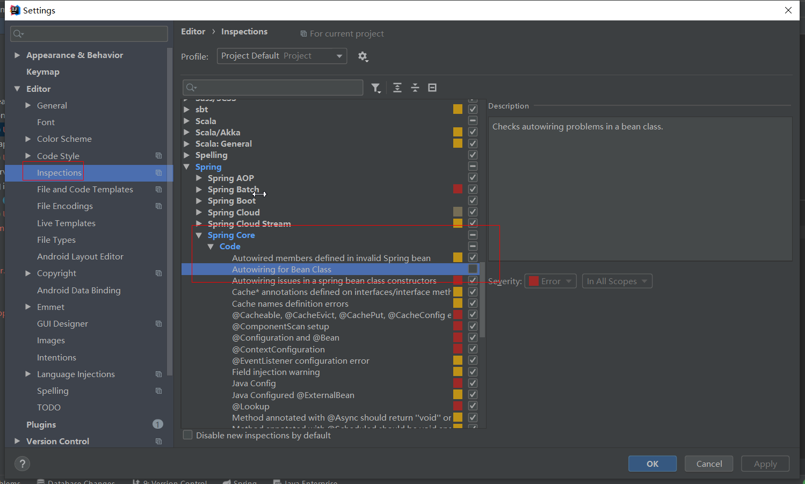

## 说明

## 目录

## idea技巧

### 解决spring的@Autowired报错问题



## 配置项目域名

> - host文件路径：C:\Windows\System32\drivers\etc
>
> - 修改host文件
>
> ```
> 127.0.0.1 user.gmail.cn
> ```
>
> - 刷新host文件，使其生效：ipconfig /flushdns
> - .com后缀无法生效

## 整合通用mapper

### 添加maven依赖

```xml
        <dependency>
            <groupId>tk.mybatis</groupId>
            <artifactId>mapper-spring-boot-starter</artifactId>
            <version>2.0.2</version>
            <exclusions>
                <exclusion>
                    <groupId>org.springframework.boot</groupId>
                    <artifactId>spring-boot-starter-jdbc</artifactId>
                </exclusion>
            </exclusions>
        </dependency>
```

### 使用方法

> - 配置了通用mapper之后，就不需要使用xml映射文件写sql进行映射，只需要使mapper接口继承通用Mapper的Mapper类即可
>
> - 通用mapper提供了单表大量的操作接口，足以完成简单功能
>
> - 若需要指定javabean的主键，需要使用@id注解声明，若想要实现在插入数据的时候返回自增的主键，需要再配置@GeneratedValue
>
>   ```java
>     @Id
>     @GeneratedValue(strategy = GenerationType.IDENTITY)
>     private long id;
>   ```
>
> - 修改启动类mapper扫描器，使用通用mapper的扫描器
>
>   ```java
>   import org.springframework.boot.SpringApplication;
>   import org.springframework.boot.autoconfigure.SpringBootApplication;
>   import tk.mybatis.spring.annotation.MapperScan;
>   
>   @SpringBootApplication
>   @MapperScan(basePackages = "com.sugar.gmail.user.mapper")
>   public class GmailUserApplication {
>   
>       public static void main(String[] args) {
>           SpringApplication.run(GmailUserApplication.class, args);
>       }
>   
>   }
>   ```

### 通用mapper条件查询

#### 方式1

```java
UmsMemberReceiveAddress umsMemberReceiveAddress = new UmsMemberReceiveAddress();
umsMemberReceiveAddress.setMemberId(Long.valueOf(userId));
return umsMemberReceiveAddressMapper.select(umsMemberReceiveAddress);
```

#### 方式2

```java
Example example = new Example(UmsMemberReceiveAddress.class);
example.createCriteria().andEqualTo("memberId",userId);
return umsMemberReceiveAddressMapper.selectByExample(example);
```

### 注意

> - Javabean的属性不要使用基本类型，要使用包装类型

