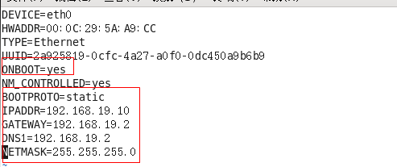
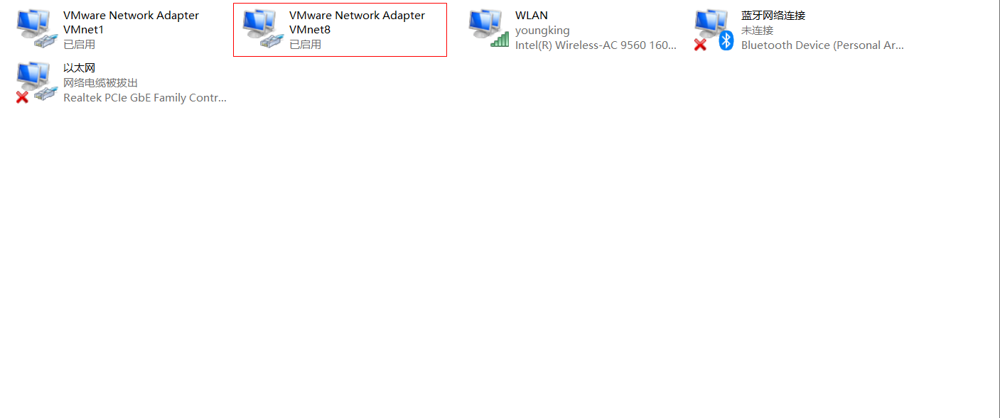
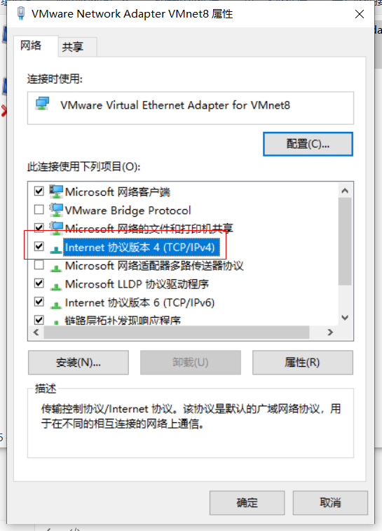
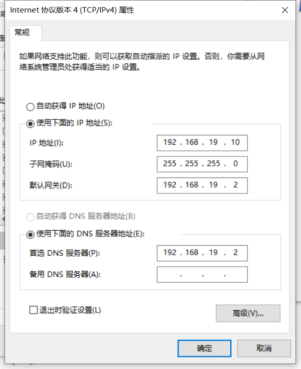
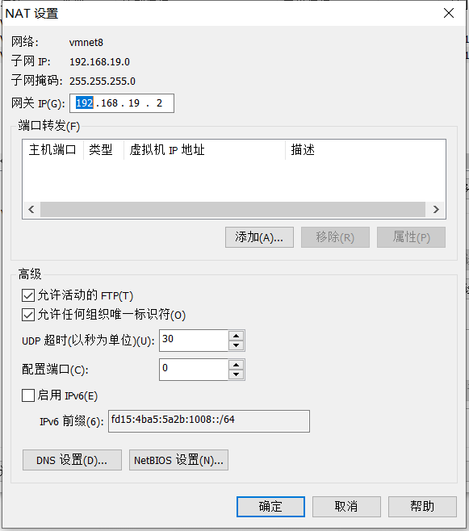

## 说明

## 目录

以cenos6.8为例

## 基础知识

### linux配置静态ip并使用xshell连接

#### 查看22端口（即远程连接服务）是否开放

> 1. 终端输入setup，选择系统设置，查看sshd服务是否开启（前面是*的表示开启）

#### 分配ip地址

> - ifconfig命令查看ip相关信息
>
> - 配置固定ip，即每次重启不会重新分配ip
>
> - 配置文件路径：/etc/sysconfig/network-scripts/ifcfg-eth0
>
> - 将ip配置为静态的，ONBOOT设置为yes，再配置IPADDR,GATEWAY,DNS1(与GATEWAY相同)
>
>   
>
> - vmvare查看虚拟机网关：编辑》虚拟网络编辑器》
>
> - 重启网络服务：service network restart

#### 解决windows和linux无法ping通的问题

查看windows的vmware配置的信息和虚拟机的是否相同，要将windows的ip和linux的ip配置成同一网段

##### windows配置







##### 虚拟机配置




### linux与windows文件传输

- 使用xshell进行文件传输，
- linux需要安装软件包lrzsz，命令：yum install lrzsz -y
- 安装完成后向将文件拖入xshell即可上传文件,sz 文件名即可下载文件

### windows访问linux上部署的tomcat

- linux配置tomcat并启动
- windows进行访问，若无法访问，先查看windows是否可以ping通linux服务器，若可以ping通，则检查linux的**防火墙**，可以关闭防火墙或开放指定的端口；若不可以ping通，虚拟机修改为使用NAT模式

```shell
# 查看防火墙状态
service iptables status
 
# 停止防火墙
service iptables stop
 
# 启动防火墙
service iptables start
 
# 重启防火墙
service iptables restart
 
# 永久关闭防火墙
chkconfig iptables off
 
# 永久关闭后重启
chkconfig iptables on
```

