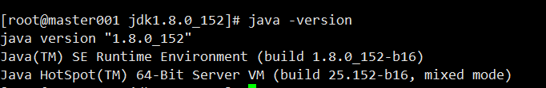
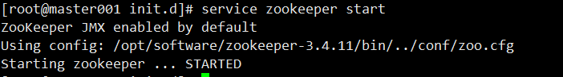
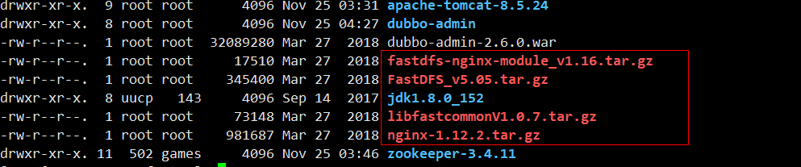
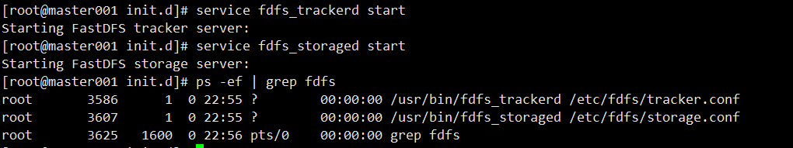
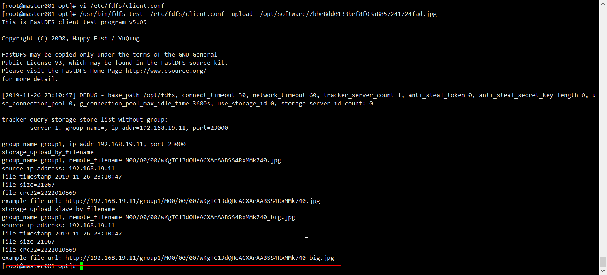
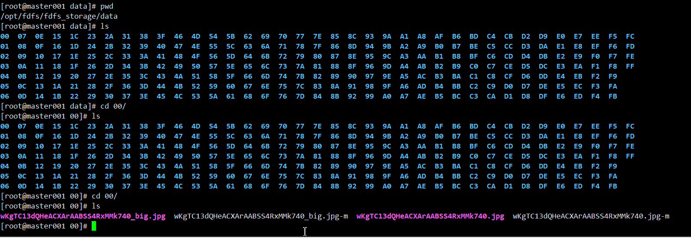
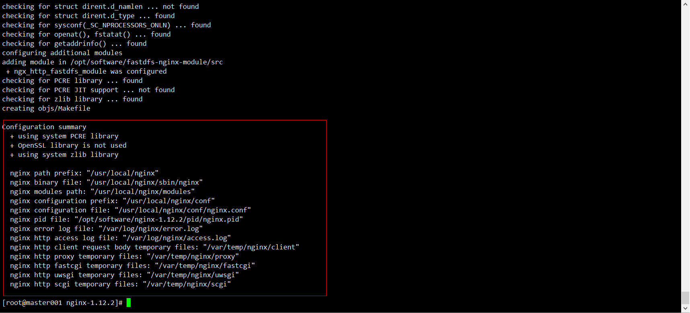

## 说明

## 目录

以cenos6.8为例

## 基础知识

### linux配置静态ip并使用xshell连接

#### 查看22端口（即远程连接服务）是否开放

> 1. 终端输入setup，选择系统设置，查看sshd服务是否开启（前面是*的表示开启）

#### 分配ip地址

> - ifconfig命令查看ip相关信息
>
> - 配置固定ip，即每次重启不会重新分配ip
>
> - 配置文件路径：/etc/sysconfig/network-scripts/ifcfg-eth0
>
> - 将ip配置为静态的，ONBOOT设置为yes，再配置IPADDR,GATEWAY,DNS1(与GATEWAY相同)
>
>   
>
> - vmvare查看虚拟机网关：编辑》虚拟网络编辑器》
>
> - 重启网络服务：service network restart

#### 解决windows和linux无法ping通的问题

查看windows的vmware配置的信息和虚拟机的是否相同，要将windows的ip和linux的ip配置成同一网段

##### windows配置


##### 虚拟机配置


### linux与windows文件传输

- 使用xshell进行文件传输，
- linux需要安装软件包lrzsz，命令：yum install lrzsz -y
- 安装完成后向将文件拖入xshell即可上传文件,sz 文件名即可下载文件

### windows访问linux上部署的tomcat

- linux配置tomcat并启动
- windows进行访问，若无法访问，先查看windows是否可以ping通linux服务器，若可以ping通，则检查linux的**防火墙**，可以关闭防火墙或开放指定的端口；若不可以ping通，虚拟机修改为使用NAT模式

```shell
# 查看防火墙状态
service iptables status
 
# 停止防火墙
service iptables stop
 
# 启动防火墙
service iptables start
 
# 重启防火墙
service iptables restart
 
# 永久关闭防火墙
chkconfig iptables off
 
# 永久关闭后重启
chkconfig iptables on
```

### 时间同步

> - yum -y install ntp :安装同步软件包
> - ntpdate time1.aliyun.com：执行同步命令
> - date：查看日期

## 软件安装

### jdk1.8

> - 下载linux版的jdk1.8并上传解压
>
> - 配置环境变量,vi /etc/profile，添加如下内容
>
>   ```shell
>   export JAVA_HOME=/opt/software/jdk1.8.0_152
>   export PATH=$PATH:$JAVA_HOME/bin
>   export CLASSPATH=.:$JAVA_HOME/lib/dt.jar:$JAVA_HOME/lib/tools.jar
>   ```
>
> - 使配置生效，执行source /etc/profile
>
> - 验证jdk是否配置好，出现如下界面则表示配置完成
>
>   

### zookeeper

> - 解压zookeeper压缩包
>
> - 修改默认配置文件，zookeeper-3.4.11/conf/zoo_sample.cfg,将其重命名为zoo.cfg，修改dataDir=/tmp/zookeeper，这个配置是zookeeper的数据目录路径，将其修改为zookeeper下的一个目录
>
>   ```shell
>   dataDir=/opt/software/zookeeper-3.4.11/dataDir
>   ```
>
> - 配置开机启动,在`/etc/init.d`目录下创建一个脚本zookeeper，内容如下
>
>   ```shell
>   #!/bin/bash
>   #chkconfig:2345 20 90
>   #description:zookeeper
>   #processname:zookeeper
>   ZK_PATH=/opt/software/zookeeper-3.4.11
>   export JAVA_HOME=/opt/software/jdk1.8.0_152
>   case $1 in
>            start) sh  $ZK_PATH/bin/zkServer.sh start;;
>            stop)  sh  $ZK_PATH/bin/zkServer.sh stop;;
>            status) sh  $ZK_PATH/bin/zkServer.sh status;;
>            restart) sh $ZK_PATH/bin/zkServer.sh restart;;
>            *)  echo "require start|stop|status|restart"  ;;
>   esac
>   ```
>
> - 增加脚本的执行权限
>
>   ```shell
>   chmod +x /etc/init.d/zookeeper
>   ```
>
> - 注册zookeeper服务
>
>   ```shell
>   chkconfig --add zookeeper
>   
>   chkconfig --list //查看已经注册的服务列表
>   ```
>
> - 启动zookeeper服务
>
>   ```shell
>   service zookeeper start
>   ```
>
>   

### 配置dubbo监控界面

> - dubbo监控程序是一个war包，因此运行需要一个tomcat
>
> ```
> dubbo-admin-2.6.0.war
> ```
>
> - 解压到指定目录
>
> ```shell
> unzip dubbo-admin-2.6.0.war -d dubbo-admin/
> ```
>
> - 配置tomcat,在apache-tomcat-8.5.24/conf/Catalina/localhost/下新建一个dubbo.xml(另一种方式是在server.xml中配置Context)，文件名称为项目名（**即下面配置中path的值**），文件内容
>
> ```xml
> <Context docBase="/opt/software/dubbo-admin/" path="/dubbo" privileged="true" reloadable="true" caseSensitive="false" debug="0" crossContext="true"/>
> ```
>
> - 配置dubbo-admin开机启动
>
> ```shell
> #!/bin/bash
> #chkconfig:2345 20 90
> #description:dubbo-admin
> #processname:dubbo-admin
> CATALANA_HOME=/opt/software/apache-tomcat-8.5.24
> export JAVA_HOME=/opt/software/jdk1.8.0_152
> case $1 in
> start)  
>    echo "Starting Tomcat..."  
>    $CATALANA_HOME/bin/startup.sh  
>    ;;  
>  
> stop)  
>    echo "Stopping Tomcat..."  
>    $CATALANA_HOME/bin/shutdown.sh  
>    ;;  
>  
> restart)  
>    echo "Stopping Tomcat..."  
>    $CATALANA_HOME/bin/shutdown.sh  
>    sleep 2  
>    echo  
>    echo "Starting Tomcat..."  
>    $CATALANA_HOME/bin/startup.sh  
>    ;;  
> *)  
>    echo "Usage: tomcat {start|stop|restart}"  
>    ;; esac
> 
> ```
>
> - 增加配置文件可执行权限
>
> ```shell
> chmod +x /etc/init.d/dubbo-admin
> ```
>
> - 添加服务dubbo-admin
>
> ```shell
> chkconfig --add dubbo-admin
> ```
>
> - 启动服务
>
> ```shell
> service dubbo-admin start
> ```
> - dubbo-admin默认用户名和密码都是root
> - 如果主机无法访问虚拟机的dubbo-admin界面，可以检查防火墙是否关闭

### fastdfs

#### 简介

> - fastdfs是由阿里开源的一个分布式文件系统，由c语言编写

#### 安装顺序

> 1. libfastcommon
> 2. fdfs_tracker：依赖：Gcc、libevent、perl
> 3. fdfs_storage
> 4. FastDFS-nginx-module
> 5. nginx：依赖pcre-devel、zlib-devel

#### 前期准备

> - 安装gcc，安装后输入gcc即可确认是否安装成功
>
>   ```shell
>   yum install gcc-c++ -y
>   ```
>
> - libevent
>
>   ```shell
>   yum -y install libevent
>   ```
>
> - perl库，是一个正则语法库
>
>   ```shell
>   yum install perl*
>   ```
>
> - pcre-devel、zlib-devel：是nginx的依赖
>
>   ```
>   yum -y install zlib zlib-devel pcre pcre-devel gcc gcc-c++ openssl openssl-devel libevent libevent-devel perl unzip net-tools wget
>   ```

#### 安装所需要的模块



#### 安装libfastcommon

> 1. 上传压缩包并解压
>
> 2. 进入到解压后的文件夹中，进行编译 **./make.sh**
>
> 3. 安装 ./make.sh install
>
> 4. 注意：libfastcommon安装好后会自动将库文件拷贝至/usr/lib64下，由于FastDFS程序引用usr/lib目录所以需要将/usr/lib64下的库文件拷贝至/usr/lib下。
>
>    ```shell
>    cp /usr/lib64/libfastcommon.so /usr/lib/
>    ```

#### 安装tracker

> 1. 上传压缩包并解压FastDFS_v5.05.tar.gz
>
> 2. 进入到解压后的文件夹中，进行编译 **./make.sh**
>
> 3. 安装 ./make.sh install
>
> 4. 安装成功之后，将安装目录下的conf下的文件拷贝到/etc/fdfs/下。(可以不进行拷贝，拷贝的原因是方便管理)
>
> 5. 修改配置文件，vim /etc/fdfs/tracker.conf，修改其中的数据存储路径，该路径必须存在
>
>    ```
>    #指定软件产生的数据和日志存储路径
>    base_path=/opt/fdfs/
>    ```
>
>    

#### storage配置

> 1. storage不需要再进行安装了，因为安装tracker时已经安装了
>
> 2. 修改配置文件：vim /etc/fdfs/storage.conf
>
>    ```shell
>    #tracker中指定的路径
>    base_path=/opt/fdfs/
>    #用于存储上传文件的路径
>    store_path0=/opt/fdfs/fdfs_storage
>    #tracker的地址
>    tracker_server=192.168.19.11:22122
>    ```

#### 设置服务开机启动

> 进入启动脚本目录，/etc/init.d，fastdfs安装时已经创建了2个服务**fdfs_storaged**和**fdfs_trackerd**

##### tracker

```shell
#/usr/local/fdfs/目录需要先创建，然后将fastdfs目录下的2个脚本拷贝过去即可
cp stop.sh /usr/local/fdfs/
cp restart.sh /usr/local/fdfs/
```

需要修改以下6处

```shell
#1
PRG=/usr/bin/fdfs_trackerd
#2
CONF=/etc/fdfs/tracker.conf

#3.将脚本stop.sh拷贝到/usr/local/fdfs/stop.sh
if [ ! -f /usr/local/fdfs/stop.sh ]; then
  echo "file /usr/local/fdfs/stop.sh does not exist!"
  exit 2
fi

#4.将脚本restart.sh拷贝到/usr/local/fdfs/restart.sh
if [ ! -f /usr/local/fdfs/restart.sh ]; then
  echo "file /usr/local/fdfs/restart.sh does not exist!"
  exit 2
fi

stop() {
#5
        /usr/local/fdfs/stop.sh $CMD
        RETVAL=$?
        return $RETVAL
}

restart() {
#6
        /usr/local/fdfs/restart.sh $CMD &
}
```

##### storage

> 配置方式同tracker，由于2个脚本restart.sh和stop.sh已经拷贝，所以不需要再次拷贝

##### 将服务添加到linux

```shell
#进入/etc/init.d
chkconfig --add fdfs_trackerd
chkconfig --add fdfs_storaged
```

#### fastdfs启动

```shell
service fdfs_trackerd star
service fdfs_storaged start
```



#### 上传文件测试

> - FastDFS安装成功可通过/usr/bin/fdfs_test测试上传、下载等操作。
>
> - 修改/etc/fdfs/client.conf
>
> ```shell
> base_path=/opt/fdfs
> tracker_server=192.168.19.11:22122
> ```
>
> - 先上传一张图片到linux任意目录
>
> - 执行如下命令进行上传文件到fastdfs
>
> ```shell
> /usr/bin/fdfs_test  /etc/fdfs/client.conf  upload  /opt/software/7bbe8dd0133bef8f03a8857241724fad.jpg
> ```
>
> - 结果，fastdfs会生成一个url，但是该url目前是无法访问的，因为fastdfs不提供web服务，需要nginx进行转发
>
>   ```
>   http://192.168.19.11/group1/M00/00/00/wKgTC13elTuAG2Z_AAEwPZNcA4U23_big.jpeg
>   
>   http://192.168.19.11/group1/M00/00/00/wKgTC13elTuAG2Z_AAEwPZNcA4U23.jpeg
>   ```
>
>   
>
> 
>
> - 进入之前配置的storage目录查看上传结果
>
> 
>
> - 1

### fastdfs整合nginx

#### 安装nginx整合插件fastdfs-nginx-module

> 1. 上传并解压文件fastdfs-nginx-module_v1.16.tar.gz
>
> 2. 修改配置fastdfs-nginx-module/src/config（插件自身的配置文件）
>
>    ```shell
>    #fastdfs和fastcommon的路径都需要修改，去掉其中的local
>    CORE_INCS="$CORE_INCS /usr/include/fastdfs /usr/include/fastcommon/"
>    ```
>
> 3. 将FastDFS-nginx-module/src下的mod_fastdfs.conf（整合配置）拷贝至/etc/fdfs/下
>
> 4. 修改拷贝后的mod_fastdfs.conf
>
>    ```shell
>    base_path=/opt/fdfs
>    tracker_server=192.168.19.11:22122
>    #设置url是否包含group
>    url_have_group_name = true
>    store_path0=/opt/fdfs/fdfs_storage
>    ```

#### 安装nginx

> 1. mkdir -p /var/temp/nginx/client：创建一个临时目录
>
> 2. 进入解压后的nginx目录，执行
>
>    > - pid-path：该路径需要修改，当nginx设置为开机启动后，每次linux启动会清空/var/run下的文件，所以需要修改该目录
>    > - add-module：设置为添加的fastdfs-nginx-module模块的对应目录
>
>    ```
>    ./configure \
>    --prefix=/usr/local/nginx \
>    --pid-path=/opt/software/nginx-1.12.2/pid/nginx.pid \
>    --lock-path=/var/lock/nginx.lock \
>    --error-log-path=/var/log/nginx/error.log \
>    --http-log-path=/var/log/nginx/access.log \
>    --with-http_gzip_static_module \
>    --http-client-body-temp-path=/var/temp/nginx/client \
>    --http-proxy-temp-path=/var/temp/nginx/proxy \
>    --http-fastcgi-temp-path=/var/temp/nginx/fastcgi \
>    --http-uwsgi-temp-path=/var/temp/nginx/uwsgi \
>    --http-scgi-temp-path=/var/temp/nginx/scgi \
>    --add-module=/opt/software/fastdfs-nginx-module/src
>    
>    ```
>
>    出现如下内容则表示配置成功
>
>    
>
> 3. 执行**make**命令和**make install**命令
>
> 4. 修改nginx配置文件nginx.conf
>
>    > - 修改其中的 server_name为本机ip
>    > - 配置location
>
>    ```shell
>    server {
>            listen       80;
>            server_name  192.168.19.11;
>    
>            #charset koi8-r;
>    
>            #access_log  logs/host.access.log  main;
>    
>            location /group1/M00 {
>                #root   html;
>                #index  index.html index.htm;
>                ngx_fastdfs_module;
>            }
>    
>    ```
>
> 5. 启动nginx
>
>    > /usr/local/nginx/sbin/nginx
>
> 6. nginx常用命令
>
>    > 1. 重新加载配置文件：./nginx -s reload
>    > 2. 快速关闭nginx：./nginx -s stop
>    > 3. 优雅的关机：./nginx -s quit
>    > 4. 重新打开日志文件：./nginx -s reopen
>    > 5. 检查配置文件合法性：./nginx -t
>
> 7. 配置开机启动

## 防火墙

> - 不同操作系统命令可能不同

### 查看开放的端口

```shell
firewall-cmd --list-all
```

### 添加开放的端口

```shell
#开放80端口
sudo firewall-cmd --add-port=80/tcp --permanent
```

### 重新加载防火墙配置

```shell
firewall-cmd -reload
```

