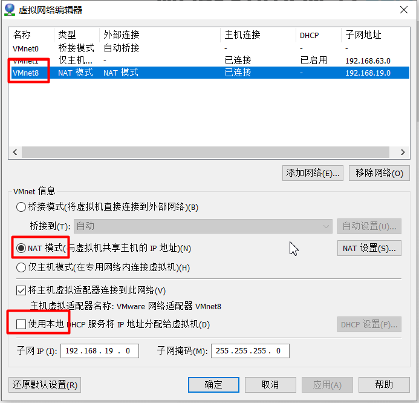

## 说明

## 目录

以cenos6.8为例

## 基础知识

### linux配置静态ip并使用xshell连接

#### 查看22端口（即远程连接服务）是否开放

> 1. 终端输入setup，选择系统设置，查看sshd服务是否开启（前面是*的表示开启）

#### 分配ip地址

> - ifconfig命令查看ip相关信息
>
> - 配置固定ip，即每次重启不会重新分配ip
>
> - 配置文件路径：/etc/sysconfig/network-scripts/ifcfg-eth0
>
> - 将ip配置为静态的，ONBOOT设置为yes，再配置IPADDR,GATEWAY,DNS1(与GATEWAY相同)
>
>   
>
> - vmvare查看虚拟机网关：编辑》虚拟网络编辑器》
>
> - 重启网络服务：service network restart

#### 解决windows和linux无法ping通的问题

查看windows的vmware配置的信息和虚拟机的是否相同，要将windows的ip和linux的ip配置成同一网段

##### windows配置

##### 虚拟机配置

