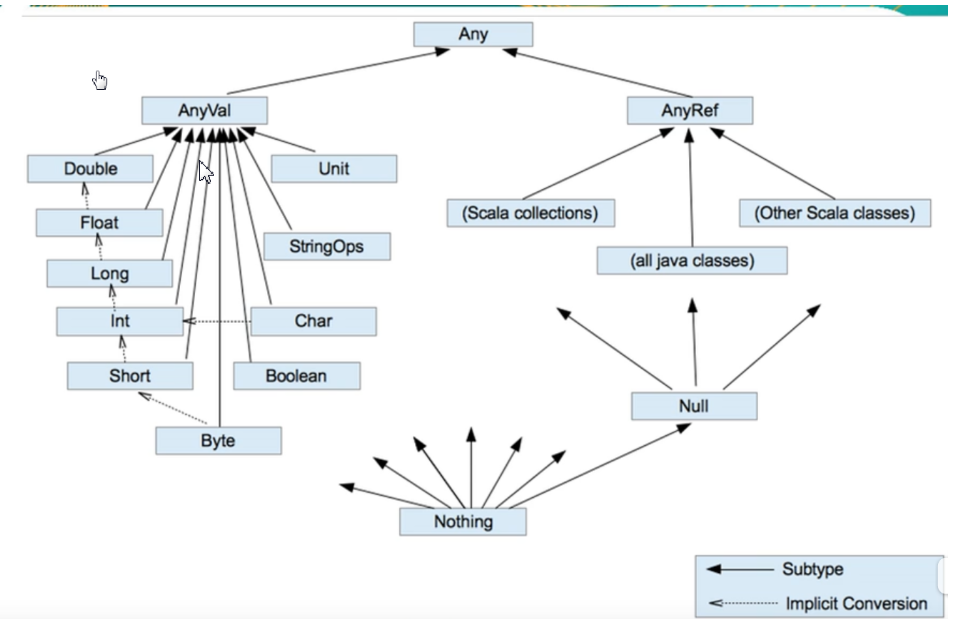

# scala

## 使用idea创建基于scala的maven项目

- 创建普通maven项目
- 右键项目添加scala框架支持（必须先安装scala的idea插件）

## scala的helloworld

```scala
object HelloWorld {
  def main(args: Array[String]): Unit = {
    println("hello world");
  }
}
```

> 说明：
>
> - object:声明scala对象
> - def:声明方法
> - main:方法名
> - args: Array[String]:方法参数和类型，scala参数在前，参数类型在后
> - : Unit = ：方法返回值为空，等同于void

## scala的编译过程

> 以Hello.scala为例：
>
> - 使用scalac Hello.scala编译会产生两个class文件，Hello.class和Hello$.class
>
>   ```scala
>   public final class HelloWorld
>   {
>     public static void main(String[] paramArrayOfString)
>     {
>       HelloWorld$.MODULE$.main(paramArrayOfString);
>     }
>   }
>   ```
>
>   ```scala
>   import scala.Predef.;
>   
>   public final class HelloWorld$
>   {
>     public static  MODULE$;
>     
>     static
>     {
>       new ();
>     }
>     
>     public void main(String[] args)
>     {
>       Predef..MODULE$.println("hello world");
>     }
>     
>     private HelloWorld$()
>     {
>       MODULE$ = this;
>     }
>   }
>   ```
>
> - 我们编写的方法实际上是Hello$（Hello$内部会有一个静态的Hello类型的实例，名称为MODULE$）的一个方法，程序入口是Hello里的main方法，等同于java的main方法，

## 注意

> - scala可以直接运行.scala文件
> - scala不需要在行尾添加分号

# scala基础

## 定义变量

> - 使用var定义变量,val定义常量
>
> ```scala
> val age:Int=10
> ```
> - 变量定义后类型就不可以修改
>
> - val线程安全，效率高，底层会使用final进行修饰，一般将一个对象定义为val，而对象的属性是var的
>
>   ```scala
>   val dog = new Dog
>   dog.name="tom"
>   ```
>
> - 变量定义时，必须初始化

## 打印语句

> ```scala
> object HelloWorld {
>   def main(args: Array[String]): Unit = {
>     val age:Int=10
>     println("hello world") //与java相同
>     printf("age:%s",age)  //与c相同
>     println(s"age:$age")  //与php相同
>     println(s"age:${age*10}")  //使用表达式
> 
>   }
> 
> }
> ```

## 生成文档注释

- scaladoc -d 文件生成位置 Hello.scala

## 类型推导

> var age=10
>
> 有两种方式可以确定age的类型：
>
> - 通过idea的提示可以确定，如打印一个变量时
>
> - ```scala
>   age.isInstanceOf[Int]
>   ```
> 

## 程序中+号的使用

- 等同于java

## 数据类型

> - scala的数据类型都是对象，没有类似java的原生类型
>
> - scala数据类型分为2个大类：AnyVal(值类型)和AnyRef（引用类型）
>
> - scala数据类型图
>
> 
>
> - 小结
>
>   - scala中，Any是所有类型的父类
>   - scala中，一切皆为对象，分为两大类
>   - Null是scala的特别类型
>   - 
>
> - 