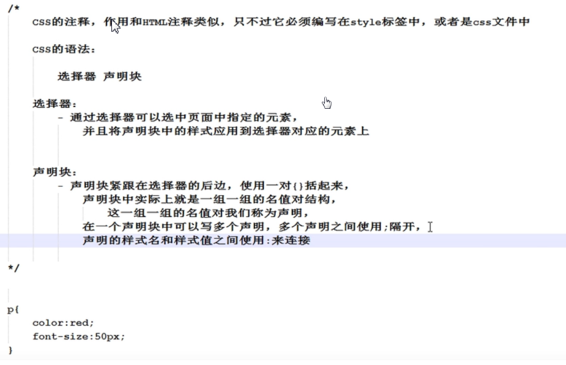

1. 火狐浏览器查看页面的层叠效果

   下载tilt插件，安装后按alt，点击顶部工具，即可查看页面层叠效果

2. css可以写在哪里？

   ```html
   1.内联样式，即作为标签的属性
   	<p style="color: red">你好</p>
   2.写在head里，可以被当前页面复用
       	<style type="text/css">
               p{
                   color: red;
                   font-size: 20px
               }
           </style>
   3.写在外部css文件，可以被多个页面复用，若多个页面依赖同一个css文件，还可以加载访问速度，因为第一次	访问时浏览器缓存了该css文件
   	<link rel="stylesheet" type="text/css" href="style.css"/>
   ```

3. css基本语法

   ```html
   1.css注释写在/* */之间
   2.css的组成，选择器+声明块
   ```

   

4. ide里快捷生成html代码

   ```
   ！+tab:生成html页面模板
   ```

5. 块级元素和内联元素

   ```html
   块元素:
   	div是一个块元素，没有任何其它语义，没有默认样式，主要用来进行页面布局；
   	块元素会独占一行
   	
   内联元素（行内元素）：
   	span是一个行内元素，主要用来选中文本设置样式
   	
   一般情况下只使用块元素包含内联元素，不会使用内联元素包含块元素
   a元素可以包含任何元素，p元素不可以包含其它块元素
   ```

   

