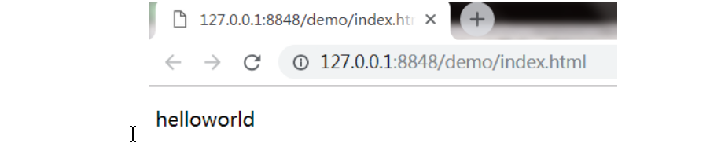

伪元素表示一些特殊的位置，如元素最前面，最后面，p元素第一行

```html
p:first-letter  p元素的第一个字符
p:first-line  p元素的第一行，可以根据浏览器大小变化
p:before  p元素的最前面，如<p>hello</p>，p元素和hello之间的位置
p:after  p元素的最后面
可以使用content属性为before和after伪元素添加内容，添加的内容无法被选中，如：

p:before{
	content："hello";
}
```

示例代码

```html
<!DOCTYPE html>
<html>
	<head>
		<meta charset="utf-8" />
		<title></title>
		<style type="text/css">
			p:before{
				content: "hello";
			}
		</style>
	</head>
	<body>
		<p>world</p>
	</body>
</html>
```

效果

