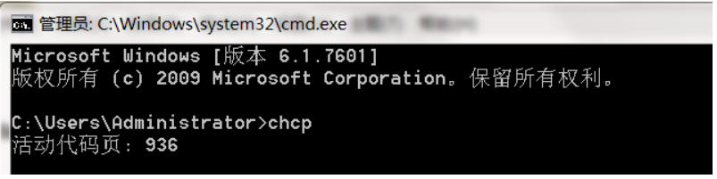

1. 前端3个技术分别是html,css,javascript,分别对应结构、表现、行为

2. html里如何使用注释？

   ```html
   <!--这是注释，可以跨行-->
   ```

3. 一个html页面的结构是怎样的？

   ```html
   <!-- 声明当前页面所使用的标准为html5标准 -->
   <!DOCTYPE html>
   <html>
   <head>
       <meta charset="utf-8" />
       <title>Page Title</title>
   </head>
   <body>
       <h1>hello</h1>
   </body>
   </html>
   ```

4. 如何知道一个标签有哪些属性？

   可以查看w3cschool离线手册

5. 如果不写doctype，会产生什么后果？

   会进入浏览器的怪异模式，导致页面的展示效果与预期不同

6. 如何解决乱码问题？

   保证文件的编码字符集和解码字符集相同即不会乱码，在html中使用meta声明文件使用的字符集

   ```html
    <meta charset="utf-8" />
   ```

7. BOM是什么？

   ```
   BOM——Byte Order Mark，就是字节序标记
   
   在UCS 编码中有一个叫做”ZERO WIDTH NO-BREAK SPACE“的字符，它的编码是FEFF。而FFFE在UCS中是不存在的字符，所以不应该出现在实际传输中。
   
   UCS规范建议我们在传输字节流前，先传输 字符”ZERO WIDTH NO-BREAK SPACE“。
   
   如果接收者收到FEFF，就表明这个字节流是大字节序的；如果收到FFFE，就表明这个字节流是小字节序的。因此字符”ZERO WIDTH NO-BREAK SPACE“又被称作BOM。
   ```

8. 记事本的ANSI编码是什么？

   ANSI即根据系统语言判断字符集，它是windows所有的一种字符集，它根据chcp命令的值判断字符集，936表示GBK

   

9. title和h1标签的重要性

   搜索引擎的蜘蛛程序在爬取网页的时候，会识别title和h1标签，将其作为页面的关键字，方便检索

10. html里的空格和换行

    在编写源代码时，不管有多少空格，都会变成一个空格，换行也一样，换行可以使用<br/>

11. html页面使用实体，即特殊字符

    ```
    < &lt; > &gt; 空格 &nbsp; 版权符号 &copy;
    更多的特殊字符可以查看位w3cschool离线手册
    ```

    

