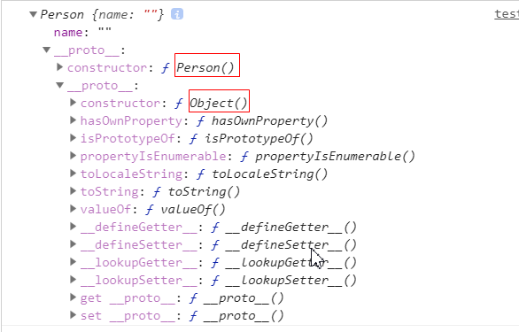

## 说明

## 目录

## 基础知识

### 使用立即执行函数封装模块

> Javascript不是一种模块化编程语言，在es6以前，它是不支持”类”（class），所以也就没有”模块”（module）了，为了解决这个问题，则使用立即执行函数封装模块

例如：

```js
        let myModule = (function(){
            let count = 0;
            let increment = ()=>{
                count = count+1;
                console.log(count);
            } 
            let decrement = ()=>{
                count = count-1;
                console.log(count);
            }
            return{
                increment,
                decrement
            }
        })();
        myModule.increment();
        myModule.decrement();
```

### 纯函数

> - 函数的返回结果只依赖于它的参数：不依赖于类似于外部变量这种变量
> - 函数执行过程里面没有副作用：如参数是对象，不会修改对象的值，除了修改外部的变量，一个函数在执行过程中还有很多方式产生外部可观察的变化，比如说调用 DOM API 修改页面，或者你发送了 Ajax 请求，还有调用 window.reload 刷新浏览器，甚至是 console.log 往控制台打印数据也是副作用

### Object.assign()

> 使用后面的参数扩展第一个参数

```js
Object.assign({}, state, {
        visibilityFilter: action.filter
      })
```

### this的指向

> ```js
> function test(){
>     console.log(this);
> }
> 
> let obj = {
>     name:'zhangsan',
>     hello:test
> }
> 
> test(); // this为window
> obj.hello(); //this为obj
> ```
>
> - 以函数的方式进行调用，则this指向为window
> - 以对象的属性方法进行调用，则指向的是该对象

### 创建对象

#### 使用工厂方法创建对象

```js
function createPerson(name, age) {
    let person = new Object();
    person.name = name;
    person.age = age;
    person.sayName = function(){
        console.log(this.name);
    }
    return person;
}
let obj = createPerson("zhangsan", 16);
let obj2 = createPerson("lisi", 18);
obj.sayName();
obj2.sayName();
```

#### 使用构造函数创建对象

> - 构造函数首字母大写
> - 创建对象时使用new关键字

```js
function Person(name, age) {
    this.name = name;
    this.age = age;
    this.sayName = function(){
        console.log(this.name);
    }
}
let person = new Person("zhangsan", 16)
```

#### 使用es6语法class

> 该写法实际是一种语法糖，其本质和构造函数相同

```js
class Person{
    constructor(name){
        this.name = name
    }
}

let person = new Person('zhangsan');
console.log(person.name);
```


### 判断对象是否含有某个属性

#### 使用in

> 若原型对象中含有该属性，也会返回true

```js
console.log("name" in obj)
```

#### 使用hasOwnProperty

> - 只判断对象本身是否包含该属性，不检查原型
> - hasOwnProperty方法在对象的原型的原型中

```js
p1.hasOwnProperty('name')
```

### 原型

#### 使用原型给类添加属性和方法

> - 我们所创建的每一个函数（包括构造函数），解析器都会向函数中添加一个属性prototype(是一个特殊对象)
> - 若函数不作为构造函数调用，则prototype没有任何作用
> - 若以构造函数调用，创建的对象会有一个隐含属性指向和prototype同样的对象，名称为\__proto__
> - 添加方法到原型中，既不会为每个对象都创建该方法，也不会污染全局对象

原型对象中添加属性

```js
Person.prototype.name='zhangsan'
```

> 访问一个对象的属性，会先在该对象的属性中寻找，若没有找到，则再继续到该对象的原型对象中找

#### 原型链

> 对象都有一个原型，Object类的原型为null,在原型链中没有找到对应的属性，则返回undefined,
>
> 如一个person对象的原型链为

#### 查看对象的原型

> 1. 使用对象的\__proto__属性
> 2. 使用es6的Object.getPrototypeOf()方法

#### es6原型

```js
class B{
     constructor(){

        this.bb='hello'
     }
}
class A  extends B{
     constructor(){
        super()
        this.name='world'
     }
}

var a=new A();
console.log(a.bb+" "+a.name);
//输出hello world


console.log(typeof(A))
//输出  "function"
```

> 实际上类A 的类型是function，所以说，本质上class在JS中是一种语法糖，JS继承的本质依然是原型，不过，ES6引入class，extends 来掩盖原型的概念也是一个很友好的举动，对于长期学习那些类继承为基础的面对对象编程语言的程序员而言。

#### 设置对象的原型

```js
Object.setPrototype(a,b)
a.constructor = A  //重设a的构造函数
```

> 将a原型设置为b
>
> 指定原型时，注意constructor也会改变

