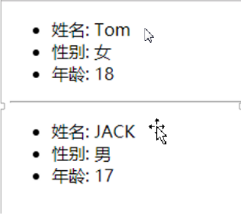
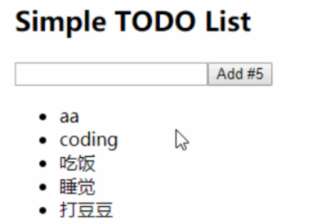
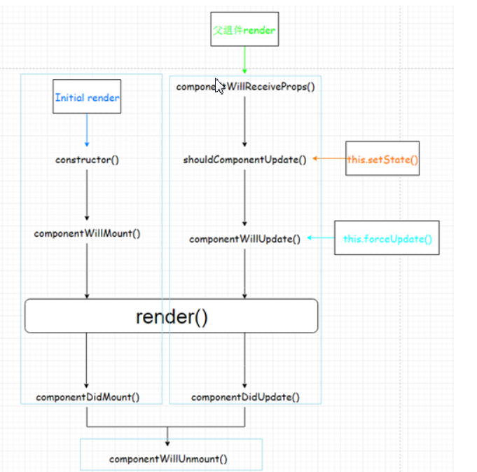
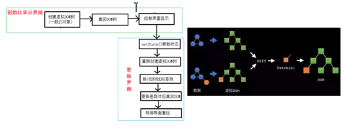

# React面向组件编程

## 定义组件的2种方式

- 工厂方法

  ```js
  function MyComponent(){
      return <h1>hello</h1>
  }
  ```

- 类

  ```js
   class MyComponent extends React.Component{
       render(){
           return <h1>hello</h1>
       }
   }
  ```

> 组件名称首字母必须大写，工厂方法适合定义简单组件（没有state），类适合定义复杂组件

## state

> state是组件对象最重要的属性, 值是对象(可以包含多个数据)
>
> 组件被称为"状态机", 通过更新组件的state来更新对应的页面显示(重新渲染组件)
>
> state的3个操作：初始化、读取、更新
>
> - 初始化
>
>   ```js
>   constructor(props) {
>             super(props);
>             //初始化state
>             this.state = {
>               isLikeMe: false
>             };
>           }
>   ```
>
> - 读取
>
>   ```js
>   const { isLikeMe } = this.state;
>   ```
>
> - 更新
>
>   ```js
>   this.setState({ isLikeMe });
>   ```
>
> demo：组件显示字符串我喜欢你，点击切换字符串
>
> 代码：
>
> ```js
> <!DOCTYPE html>
> <html>
>   <head>
>     <meta charset="utf-8" />
>     <title></title>
>   </head>
> 
>   <body>
>     <div id="test"></div>
> 
>     <script src="js/react.development.js"></script>
>     <script src="js/react-dom.development.js"></script>
>     <script src="js/babel.min.js"></script>
> 
>     <script type="text/babel">
>       //定义组件
>       class Like extends React.Component {
>         constructor(props) {
>           super(props);
>           //初始化state
>           this.state = {
>             isLikeMe: false
>           };
> 
>           //绑定组件的this对象到handleClick,bind方法会返回一个绑定了组件this的新方法，将原方法指向用该新方法
>           this.handleClick = this.handleClick.bind(this);
>         }
> 
>         handleClick() {
>           //this为undefined,需要绑定组件的this
>           const isLikeMe = !this.state.isLikeMe;
>           //更新state，更新后render会被调用
>           this.setState({ isLikeMe });
>         }
> 
>         render() {
>           //读取state
>           const { isLikeMe } = this.state;
>           return (
>             //react的点击事件是onClick，与原生的onclick不同，它的值类似于这种格式{this.handleClick},告诉它点击事件发生时需要回调的方法即可
>             <h2 onClick={this.handleClick}>
>               {isLikeMe ? "你喜欢我" : "我喜欢你"}
>             </h2>
>           );
>         }
>       }
> 
>       ReactDOM.render(<Like />, document.getElementById("test"));
>     </script>
>   </body>
> </html>
> 
> ```
>
> 

## props

> - 理解
>   - 每个组件对象都会有props(properties的简写)属性
>   - 组件标签的所有属性都保存在props中
> - 作用
>   - 通过标签属性从组件外向组件内传递变化的数据
>   - 注意: 组件内部不要修改props数据

### 编码操作

> 1. 内部读取某个属性值
>
> ```js
> this.props.propertyName
> ```
>
> 2. 对props中的属性值进行类型限制和必要性限制
>
> ```js
>       //指定属性类型和必要性
>       Person.propTypes = {
>         name: PropTypes.string.isRequired,
>         age: PropTypes.number
>       };
> ```
>
> 3. 扩展属性: 将对象的所有属性通过props传递
>
> ```js
> <Person {...person}/>
> ```
>
> 4. 默认属性值
>
> ```js
> Person.defaultProps = {
> name: 'Mary'
> }
> ```
>
> 5. 组件类的构造函数
>
> ```js
> constructor (props) {
> super(props)
> console.log(props) // 查看所有属性
> }
> ```

### demo

> ```
> 需求: 自定义用来显示一个人员信息的组件
> 
>   1). 姓名必须指定
> 
>   2). 如果性别没有指定, 默认为男
>   3). 如果年龄没有指定, 默认为18
> ```



### 代码

```jsx
<!DOCTYPE html>
<html lang="en">
  <head>
    <meta charset="UTF-8" />
    <meta name="viewport" content="width=device-width, initial-scale=1.0" />
    <meta http-equiv="X-UA-Compatible" content="ie=edge" />
    <title>Document</title>
  </head>
  <body>
    <div id="test"></div>

    <script src="js/react.development.js"></script>
    <script src="js/react-dom.development.js"></script>
    <script src="js/prop-types.js"></script>
    <script src="js/babel.min.js"></script>

    <script type="text/babel">
      function Person(params) {
        return (
          <ul>
            <li>姓名:{params.name}</li>
            <li>年龄:{params.age}</li>
            <li>性别:{params.sex}</li>
          </ul>
        );
      }
      const person = {
        name: "张三",
        age: 18,
        sex: "男"
      };

      const person2 = {
        name: "李四"
      };

      //指定属性默认值
      Person.defaultProps = {
        age: 18,
        sex: "男"
      };
      //指定属性类型和必要性
      Person.propTypes = {
        name: PropTypes.string.isRequired,
        age: PropTypes.number
      };

      ReactDOM.render(<Person {...person} />, document.getElementById("test"));
    </script>
  </body>
</html>
```

## refs

### 需求

> ```
> 需求: 自定义组件, 功能说明如下:
> 
>   2. 点击按钮, 提示第一个输入框中的值
> 
>   3. 当第2个输入框失去焦点时, 提示这个输入框中的值
> ```

### refs属性

> - 组件内的标签都可以定义ref属性来标识自己
>   - <input type="text" ref={input => this.msgInput = input}/>
>   -  回调函数在组件初始化渲染完或卸载时自动调用
>
> - 在组件中可以通过this.msgInput来得到对应的真实DOM元素
>
> - 作用: 通过ref获取组件内容特定标签对象, 进行读取其相关数据

### 事件处理

> - 通过onXxx属性指定组件的事件处理函数(注意大小写)
>
>   - React使用的是自定义(合成)事件, 而不是使用的原生DOM事件
>   - React中的事件是通过事件委托方式处理的(委托给组件最外层的元素)
>
> - 通过event.target得到发生事件的DOM元素对象
>
>   ```js
>   <input onFocus={this.handleClick}/>
>   handleFocus(event) {
>   event.target  //返回input对象
>   }
>   ```
>
>   

### demo

```jsx
<!DOCTYPE html>
<html lang="en">
  <head>
    <meta charset="UTF-8" />
    <meta name="viewport" content="width=device-width, initial-scale=1.0" />
    <meta http-equiv="X-UA-Compatible" content="ie=edge" />
    <title>Document</title>
  </head>
  <body>
    <div id="test"></div>

    <script src="js/react.development.js"></script>
    <script src="js/react-dom.development.js"></script>
    <script src="js/prop-types.js"></script>
    <script src="js/babel.min.js"></script>

    <script type="text/babel">      
      class MyComponent extends React.Component {

        constructor(props){
          super(props);

          this.showInput=this.showInput.bind(this);
          this.handleBlur=this.handleBlur.bind(this);
        }

        showInput(){
        //老的用法
            const input = this.refs.content;
            //新的用法
            alert(this.input.value);
        }

        //事件监听都有event形参可以使用
        handleBlur(event){
            alert(event.target.value);
        }

        render() {
          return (
            <div>
            //老的用法
              <input type="text" ref="content"/>&nbsp;&nbsp;
              //新的用法
              <input type="text" ref={input=>this.input=input}/>&nbsp;&nbsp;
              <button onClick={this.showInput}>提示输入</button>&nbsp;&nbsp;
              <input type="text" placeholder="失去焦点提示内容" onBlur={this.handleBlur}/>
            </div>
          );
        }
      }
      

      ReactDOM.render(<MyComponent />, document.getElementById("test"));
    </script>
  </body>
</html>

```

### 强烈注意

> - 组件内置的方法中的this为组件对象
> - 在组件类中自定义的方法中this为null
>   - 强制绑定this: 通过函数对象的bind()
>   - 箭头函数(ES6模块化编码时才能使用)

## 组件的组合

### 需求

> 功能: 组件化实现此功能
>     1. 显示所有todo列表
>     2. 输入文本, 点击按钮显示到列表的首位, 并清除输入的文本
>
> 

### 功能界面的组件化编码流程(无比重要)

> 1)       拆分组件: 拆分界面,抽取组件
>
> 2)       实现静态组件: 使用组件实现静态页面效果
>
> 3)       实现动态组件
>
> ​	a.       动态显示初始化数据
>
> ​	b.       交互功能(从绑定事件监听开始)
>
> 问题：数据保存在哪个组件内？
>
> ```
> 看数据是某个组件需要（直接给它）,还是某些组件需要(给共同的父组件)
> ```
>
> 问题：需要在子组件中改变父组件的状态，怎么做？
>
> ```
> 改变状态的方法在父组件中定义，将方法引用作为参数传递给子组件，子组件可以通过props获取
> ```
>
> 

### demo

```jsx
<!DOCTYPE html>
<html lang="en">
  <head>
    <meta charset="UTF-8" />
    <meta name="viewport" content="width=device-width, initial-scale=1.0" />
    <meta http-equiv="X-UA-Compatible" content="ie=edge" />
    <title>Document</title>
  </head>
  <body>
    <div id="test"></div>

    <script src="js/react.development.js"></script>
    <script src="js/react-dom.development.js"></script>
    <script src="js/prop-types.js"></script>
    <script src="js/babel.min.js"></script>

    <script type="text/babel">
      class App extends React.Component {
        constructor(props) {
          super(props);
          //初始化状态
          this.state = {
            todos: ["吃饭", "睡觉", "写代码"]
          };
          this.addTodo= this.addTodo.bind(this);
        }

        addTodo(todo) {
          const { todos } = this.state;
          todos.unshift(todo);
          this.setState({ todos });
        }

        render() {
          const { todos } = this.state;
          return (
            <div>
              <h1>Simple TODO LIST</h1>
              <Add count={todos.length} addTodo={this.addTodo}/>
              <List todos={todos} />
            </div>
          );
        }
      }
      class Add extends React.Component {
        constructor(props) {
          super(props);
          this.add = this.add.bind(this);
        }

        add() {
          //1.读取输入的数据
          const todo = this.todoInput.value.trim();
          //2.检查合法性
          //空字符串的boolean为false
          if(!todo){
            return;
          }
          //3.添加
          this.props.addTodo(todo);
          //4.清除
          this.todoInput.value="";
        }
        render() {
          const count = this.props.count;
          return (
            <div>
              <input type="text" ref={input=>this.todoInput=input}/>
              <button onClick={this.add}>add #{count + 1}</button>
            </div>
          );
        }
      }
      Add.propTypes = {
        count: PropTypes.number.isRequired,
        addTodo:PropTypes.func.isRequired
      };
      class List extends React.Component {
        render() {
          const { todos } = this.props;
          return (
            <div>
              <ul>
                {todos.map((todo, index) => (
                  <li key={index}>{todo}</li>
                ))}
              </ul>
            </div>
          );
        }
      }
      List.propTypes = {
        todos: PropTypes.array.isRequired
      };

      ReactDOM.render(<App />, document.getElementById("test"));
    </script>
  </body>
</html>

```

## 收集表单数据

### 需求

> 自定义包含表单的组件
>     1. 输入用户名密码后, 点击登陆提示输入信息
>     2. 不提交表单

### 理解

> 1)       问题: 在react应用中, 如何收集表单输入数据
>
> 2)       包含表单的组件分类
>
> ​	a.       受控组件: 表单项输入数据能自动收集成状态
>
> ​	b.       非受控组件: 需要时才手动读取表单输入框中的数据

### demo

```jsx
<!DOCTYPE html>
<html lang="en">
  <head>
    <meta charset="UTF-8" />
    <meta name="viewport" content="width=device-width, initial-scale=1.0" />
    <meta http-equiv="X-UA-Compatible" content="ie=edge" />
    <title>Document</title>
  </head>
  <body>
    <div id="test"></div>

    <script src="js/react.development.js"></script>
    <script src="js/react-dom.development.js"></script>
    <script src="js/prop-types.js"></script>
    <script src="js/babel.min.js"></script>

    <script type="text/babel">
      class MyForm extends React.Component {
        constructor(props) {
          super(props);
          this.state={
            pwd:""
          }

          this.handleSubmit = this.handleSubmit.bind(this);
          this.handleChange = this.handleChange.bind(this);
        }

        handleSubmit(event) {
          //阻止事件的默认行为，让其不提交
          event.preventDefault();

          const name = this.nameInput.value;
          const {pwd} = this.state;
          alert(`当前准备提交的字符串为：name=${name}，pwd=${pwd}`);
        }

        handleChange(event){
          //读取输入的值
          const pwd=event.target.value;

          //更新pwd的状态
          this.setState({pwd});
        }

        render() {
          return (
            <form action="/test" onSubmit={this.handleSubmit}>
              用户名：<input type="text" ref={input=>this.nameInput=input}/>
              密码：<input type="password" value={this.state.pwd} onChange={this.handleChange}/>
              <input type="submit" value="登录"/>
            </form>
          );
        }
      }

      ReactDOM.render(<MyForm />, document.getElementById("test"));
    </script>
  </body>
</html>

```

## 组件生命周期

### 需求

> 需求: 自定义组件
>     1. 让指定的文本做显示/隐藏的渐变动画
>     2. 切换持续时间为2S
>     3. 点击按钮从界面中移除组件界面

### 理解

> 1. 组件对象从创建到死亡它会经历特定的生命周期阶段
> 2. React组件对象包含一系列的勾子函数(生命周期回调函数), 在生命周期特定时刻回调
> 3. 我们在定义组件时, 可以重写特定的生命周期回调函数, 做特定的工作

### 生命周期流程图



### 生命周期详述

> 1. 组件的三个生命周期状态:
>
>    - Mount：插入真实 DOM
>    - Update：被重新渲染
>    - Unmount：被移出真实 DOM
>
> 2. React 为每个状态都提供了勾子(hook)函数
>
>    - componentWillMount()
>    - componentDidMount()
>    - componentWillUpdate()
>    - componentDidUpdate()
>    - componentWillUnmount()
>
> 3. 生命周期流程:
>
>    a.第一次初始化渲染显示: ReactDOM.render()
>
>    - constructor(): 创建对象初始化state
>    - componentWillMount() : 将要插入回调
>    - render() : 用于插入虚拟DOM回调
>    - componentDidMount() : 已经插入回调
>
>    b.每次更新state: this.setSate()
>
>    - componentWillUpdate() : 将要更新回调
>    - render() : 更新(重新渲染)
>    - componentDidUpdate() : 已经更新回调
>
>    c.移除组件:ReactDOM.unmountComponentAtNode(containerDom)
>
>    - componentWillUnmount() : 组件将要被移除回调

### 重要的勾子

- render(): 初始化渲染或更新渲染调用
- componentDidMount(): 开启监听, 发送ajax请求
- componentWillUnmount(): 做一些收尾工作, 如: 清理定时器
- componentWillReceiveProps(): 后面需要时讲

### demo

```jsx
<!DOCTYPE html>
<html lang="en">
  <head>
    <meta charset="UTF-8" />
    <meta name="viewport" content="width=device-width, initial-scale=1.0" />
    <meta http-equiv="X-UA-Compatible" content="ie=edge" />
    <title>Document</title>
  </head>
  <body>
    <div id="test" style="opacity: "></div>

    <script src="js/react.development.js"></script>
    <script src="js/react-dom.development.js"></script>
    <script src="js/prop-types.js"></script>
    <script src="js/babel.min.js"></script>

    <script type="text/babel">
      class Life extends React.Component {
        constructor(props) {
          super(props);

          this.state = {
            opacity: 1
          };

          this.handleClick = this.handleClick.bind(this);
        }

        componentDidMount() {
          console.log("设置定时器");
          //设置定时器
          this.IntervalId = setInterval(function() {
            let { opacity } = this.state;
            opacity -= 0.1;
            if (opacity <= 0) {
              opacity = 1;
            }

            console.log("11");
            this.setState({ opacity });
          }.bind(this), 200);
        }

        handleClick() {
          ReactDOM.unmountComponentAtNode(document.getElementById("test"));
        }

        //清理定时器，防止内存泄漏
        componentWillUnmount() {
          clearInterval(this.IntervalId);
        }

        render() {
          const { opacity } = this.state;
          console.log(opacity);
          
          return (
            <div>
              <h2 style={{ opacity: opacity }}>{this.props.msg}</h2>
              <button onClick={this.handleClick}>消失</button>
            </div>
          );
        }
      }

      ReactDOM.render(<Life msg="react太难了"/>, document.getElementById("test"));
    </script>
  </body>
</html>

```

## 虚拟DOM与DOM Diff算法

### 基本原理图



## 受控组件和非受控组件

- 受控组件，即表单标签的值是和组件的state的属性进行绑定，再添加一个onChange方法，就可以实现数据的双向传递

  ```jsx
  <input
      type="text"
      value={this.state.value}
      onChange={(e) => {
          this.setState({
              value: e.target.value.toUpperCase(),
          });
      }}
  />
  ```

- 非受控组件，即表单标签的值是保存到组件的ref中，使用时通过ref获取

  ```jsx
  class UnControlled extends Component {
      handleSubmit = (e) => {
          console.log(e);
          e.preventDefault();
          console.log(this.name.value);  //通过ref的属性获取元素的值
      }
      render() {
          return (
              <form onSubmit={this.handleSubmit}>
                  <input type="text" ref={i => this.name = i} defaultValue="BeiJing" />
                  <button type="submit">Submit</button>
              </form>
          );
      }
  }
  ```

# React应用

## 使用create-react-app创建react应用

### react脚手架

> 1. xxx脚手架: 用来帮助程序员快速创建一个基于xxx库的模板项目
>    - 包含了所有需要的配置
>    - 指定好了所有的依赖
>    - 可以直接安装/编译/运行一个简单效果
> 2. react提供了一个用于创建react项目的脚手架库: create-react-app
> 3. 项目的整体技术架构为:  react +webpack + es6 + eslint
> 4. 使用脚手架开发的项目的特点: 模块化, 组件化, 工程化

### 创建项目并启动

```
npm install -g create-react-app
create-react-app hello-react（创建可能失败，可以切换到淘宝镜像npm config set registry https://registry.npm.taobao.org）
cd hello-react
npm start
```

### react脚手架项目结构

```
ReactNews
	|--node_modules---第三方依赖模块文件夹
	|--public
		|-- index.html-----------------主页面
	|--scripts
		|-- build.js-------------------build打包引用配置
	|-- start.js-------------------start运行引用配置
	|--src------------源码文件夹
		|--components-----------------react组件
		|--index.js-------------------应用入口js
	|--.gitignore------git版本管制忽略的配置
	|--package.json----应用包配置文件 
	|--README.md-------应用描述说明的readme文件

```

#### package.json

当前应用的一个描述文件

> 1. 项目标识：名称+版本
> 2. 运行时依赖
> 3. 开发时依赖
> 4. 脚本

## 发送ajax请求

- 使用axios

  > 1. 安装模块
  >
  >    ```shell
  >    cnpm install --save axios
  >    ```
  >
  > 2. 导入模块
  >
  >    ```jsx
  >    import axios from 'axios';
  >    ```
  >
  > 3. 发送请求
  >
  >    ```jsx
  >    const url = 'http://localhost:8080/hello';
  >    axios.get(url)
  >        .then(response => {
  >        console.log(response);
  >        const message  = response.data;
  >        this.setState({ message });
  >        console.log(message);
  >    })
  >        .catch(e => {
  >        alert('请求异常' + e);
  >    })
  >    ```
  >
  > 4. 

- 使用fetch

## 组件之间相互通信

### 通过props传递

> - 共同的数据放在父组件上, 特有的数据放在自己组件内部(state)
> - 一般数据-->父组件传递数据给子组件-->子组件读取数据
> - 函数数据-->子组件传递数据给父组件-->子组件调用函数
> - 问题: 多层传递属性麻烦, 兄弟组件通信不方便

### 使用发布订阅方式

> 即使用使用消息订阅(subscribe)-发布(publish)机制: 自定义事件机制
>
> ```
> 工具库: PubSubJS
> 下载: npm install pubsub-js --save
> 使用: 
>   import PubSub from 'pubsub-js' //引入
>   PubSub.subscribe('delete', function(msg, data){ }); //订阅，msg是订阅的消息名称（无用处，即和delete相同），data是订阅后收到的数据
>   PubSub.publish('delete', data) //发布消息
> 优点: 可以支持任意关系组件之间的通信，可以实现兄弟组件通信，跨父子组件进行通信
> ```
>
> 

## react-router4

### 相关理解

#### react-router的理解

- react的一个插件库
- 专门用来实现一个SPA应用
- 基于react的项目基本都会用到此库

#### SPA的理解

- 单页Web应用（single page web application，SPA）
- 整个应用只有一个完整的页面
- 点击页面中的链接不会刷新页面, 本身也不会向服务器发请求
- 当点击链接时, 只会做页面的局部更新
- 数据都需要通过ajax请求获取, 并在前端异步展现

####  路由的理解

1. 什么是路由?
	一个路由就是一个映射关系(key:value)
	key为路由路径, value可能是function/component
2. 路由分类
    后台路由: node服务器端路由, value是function, 用来处理客户端提交的请求并返回一个响应数据
    前台路由: 浏览器端路由, value是component, 当请求的是路由path时, 浏览器端前没有发送http请求, 但界面会更新显示对应的组件 
3. 后台路由
  * 注册路由: router.get(path, function(req, res))
  * 当node接收到一个请求时, 根据请求路径找到匹配的路由, 调用路由中的函数来处理请求, 返回响应数据
4. 前端路由
   - 注册路由: <Route path="/about" component={About}>
   - 当浏览器的hash变为#about时, 当前路由组件就会变为About组件

### 关于url中的#

```
1. 理解#
	'#'代表网页中的一个位置。其右面的字符，就是该位置的标识符
	改变#不触发网页重载
	改变#会改变浏览器的访问历史
2. 操作#
	window.location.hash读取#值
	window.onhashchange = func 监听hash改变
3. 学习资源: 
	阮一峰教程: http://www.ruanyifeng.com/blog/2011/03/url_hash.html
```

###  相关API

#### 1). react-router中的相关组件: 

```
Router: 路由器组件, 用来包含各个路由组件
Route: 路由组件, 注册路由 
IndexRoute: 默认子路由组件
hashHistory: 路由的切换由URL的hash变化决定，即URL的#部分发生变化
Link: 路由链接组件
```

#### 2). Router: 路由器组件

```
属性:  history={hashHistory} 用来监听浏览器地址栏的变化, 并将URL解析成一个地址对象，供React Router匹配
子组件: Route
```

#### 3). Route: 路由组件

```
属性1: path="/xxx"  
属性2: component={Xxx}
根路由组件: path="/"的组件, 一般为App
子路由组件: 子<Route>配置的组件
```

#### 4). IndexRoute: 默认路由

```
当父路由被请求时, 默认就会请求此路由组件
```

#### 5). hashHistory

```
用于Router组件的history属性
作用: 为地址url生成?_k=hash, 用于内部保存对应的state
```

#### 6). Link: 路由链接

```
属性1: to="/xxx"
属性2: activeClassName="active"
```

### react-router的基本使用

#### 1). 下载

```
npm install react-router --save
npm install react-router-dom --save  //web版本
```

#### 2). 定义各个路由组件

- About.jsx

  ```jsx
  import React, { Component } from 'react';
  
  class About extends Component {
      render() {
          return (
              <div>
                  <h3>about内容</h3>
              </div>
          );
      }
  }
  
  export default About;
  ```

- Home.jsx

  ```jsx
  import React, { Component } from 'react';
  
  class Home extends Component {
      render() {
          return (
              <div>
                  <h3>home内容</h3>
              </div>
          );
      }
  }
  
  export default Home;
  ```

- App.jsx

  ```jsx
  import React, { Component } from 'react';
  import { NavLink, Switch, Route ,Redirect} from 'react-router-dom';
  
  import About from '../views/About';
  import Home from '../views/Home';
  
  class App extends Component {
      render() {
          return (
              <div>
                  <div className='row'>
                      <div className='col-xs-offset-2 col-xs-8'>
                          <div className='page-header'><h2>React Router Demo</h2></div>
                      </div>
                  </div>
  
                  <div className='row'>
                      <div className='col-xs-offset-2 col-xs-2'>
                          <div className='list-group'>
                              <NavLink className='list-group-item activeClass' aria-current='true' to='/about'>About</NavLink>
                              <NavLink className='list-group-item' aria-current='false' to="/home">Home</NavLink>
                          </div>
                      </div>
                      <div className='col-xs-6'>
                          <div className='panel'>
                              <Switch>
                                  <Route path='/about' component={About} />
                                  <Route path='/home' component={Home} />
                                  {/* 定义默认路由 */}
                                  <Redirect to='/about'/>
                              </Switch>
                          </div>
                      </div>
                  </div>
              </div>
          );
      }
  }
  
  export default App;
  ```

- index.js

  ```jsx
  import React from 'react';
  import ReactDOM from 'react-dom';
  import App from './components/App';
  import { BrowserRouter, HashRouter } from 'react-router-dom'
  
  ReactDOM.render(
      (
          <BrowserRouter>
              <App />
          </BrowserRouter>
      ),
      document.getElementById('root')
  );
  
  
  ```

- 自定义组件覆盖默认组件

  ```jsx
  import React, { Component } from 'react';
  import {NavLink} from 'react-router-dom';
  
  class MyNavLink extends Component {
      render() {
          // 将MyNavLink的属性全部传递给NavLink,activeClassName激活状态设置默认样式，默认的class为active
          return <NavLink {...this.props} activeClassName='activenew'/>;
      }
  }
  
  export default MyNavLink;
  ```

- 

#### 3). index.js: 注册路由, 渲染路由器标签

```
import React from 'react'
import {render} from 'react-dom'
import {Router, Route, IndexRoute, hashHistory} from 'react-router'
import App from './modules/App'
import About from './modules/About'
import Repos from './modules/Repos'
import Home from './modules/Home'

render((
  <Router history={hashHistory}>
    <Route path="/" component={App}>
      <IndexRoute component={Home}/>
      <Route path="/about" component={About}></Route>
      <Route path="/repos" component={Repos}></Route>
    </Route>
  </Router>
), document.getElementById('app'))
```

#### 4). 主页面: index.html

```
<style>
  .active {
    color: red;
  }
</style>
```

### 向路由组件传递请求参数

- 父组件可以通过url向子组件传递参数，其中的`:id`既是占位符，也是参数的名称

  ```jsx
  <Route path='/home/message/messageDetail/:id' component={MessageDetail} />
  ```

  子组件通过如下方式获取参数,获取出来的参数是一个字符串：

  ```jsx
  const { id } = this.props.match.params;
  ```

  字符串转数字的简便方法,将字符串乘以1，即可转换成number类型

  ```jsx
  id*1
  ```

- 数组查找元素，使用find方法，找到第一个匹配的元素

  ```jsx
  const message = allMessages.find(m => m.id === id*1);
  ```

- 

#### 1). 父路由组件：Message.jsx

```jsx
import React, { Component } from 'react';
import { Route } from 'react-router-dom';

import MessageDetail from './MessageDetail';

class Message extends Component {

    state = {
        messages: []
    }

    componentDidMount = () => {
        // 模拟发送ajax请求
        setTimeout(() => {
            const messages = [
                { id: 1, title: 'message001' },
                { id: 2, title: 'message002' },
                { id: 3, title: 'message003' },
            ];
            this.setState({ messages });
        }, 1000)
    }

    render() {
        return (
            <div>
                <ul>
                    {
                        this.state.messages.map((m, index) =>
                            (
                                <li key={index}>
                                    <a href={`/home/message/messageDetail/${m.id}`}>{m.title}</a>
                                </li>
                            )
                        )
                    }
                </ul>
                <Route path='/home/message/messageDetail/:id' component={MessageDetail} />
            </div>
        );
    }
}

export default Message;
```

#### 2). 子路由组件：MessageDetail.jsx

```jsx
import React, { Component } from 'react';

const allMessages = [
    { id: 1, title: 'message001', content: '张三' },
    { id: 2, title: 'message002', content: '李四' },
    { id: 3, title: 'message003', content: '王五' },
];

class MessageDetail extends Component {

    render() {
        const { id } = this.props.match.params;
        const temp = id*1;
        console.log(typeof(temp));
        const message = allMessages.find(m => m.id === id*1);
        return (
            <div>
                <ul>
                    <li>id: {message.id}</li>
                    <li>title: {message.title}</li>
                    <li>Content: {message.content}</li>
                </ul>
            </div>
        );
    }
}

export default MessageDetail;
```

### 优化Link组件

> 设置默认的激活样式，并使用参数列表的方式传递所有参数

#### 1). NavLink.js

```jsx
import React from 'react'
import {Link} from 'react-router'
export default function NavLink(props) {
  return <Link {...props} activeClassName="active"/>
}
```

### 嵌套路由

> 即路由中又包含一个路由

#### 如何编写嵌套路由

- 编写一个路由组件

- 在父路由组件中指定

  - 路由连接：<NavLink>或<Link>
  - 路由:<Route>

- 父组件定义嵌套路由

  ```jsx
  import React, { Component } from 'react';
  import { Switch, Route, Redirect } from 'react-router-dom';
  
  import MyNavLink from './MyNavLink';
  import News from './News';
  import Message from './Message';
  
  class Home extends Component {
      render() {
          return (
              <div>
                  <h3>home内容</h3>
                  <div>
                      <ul className='nav nav-tabs'>
                          <li>
                              <MyNavLink to='/home/mews'>news</MyNavLink>
                          </li>
                          <li>
                              <MyNavLink to='/home/message'>message</MyNavLink>
                          </li>
                      </ul>
                      <div>
                          <Switch>
                              <Route path='/home/mews' component={News}></Route>
                              <Route path='/home/message' component={Message}></Route>
                              <Redirect to='/home/mews'/>
                          </Switch>
                      </div>
                  </div>
              </div>
          );
      }
  }
  
  export default Home;
  ```

- 组件1

  ```jsx
  import React, { Component } from 'react';
  
  class News extends Component {
      state = {
          newsArr: [
              'news01',
              'news02',
              'news03'
          ]
      }
  
      render() {
          return (
              <ul>
                  {
                      this.state.newsArr.map((news, index) => <li key={index}>{news}</li>)
                  }
              </ul>
          );
      }
  }
  
  export default News;
  ```

- 组件2

  ```jsx
  import React, { Component } from 'react';
  
  class Message extends Component {
  
      state = {
          messages: []
      }
  
      componentDidMount = () => {
          // 模拟发送ajax请求
          setTimeout(() => {
              const messages = [
                  { id: 1, title: 'message001' },
                  { id: 2, title: 'message002' },
                  { id: 3, title: 'message003' },
              ];
              this.setState({ messages });
          }, 1000)
      }
  
      render() {
          return (
              <ul>
                  {
                      this.state.messages.map((m, index) =>
                          (
                              <li key={index}>
                                  <a href='??'>{m.title}</a>
                              </li>
                          )
                      )
                  }
              </ul>
          );
      }
  }
  
  export default Message;
  ```


### 路由链接与非路由链接

- 路由链接：不会向后台发送请求
- 非路由链接：会发送请求，即F12中的network中会有请求

### 多种路由跳转方式

- 通过history对象的方法进行跳转

  - push：插入一个历史记录
  - replace：替换最新的历史记录
  - goBack：回退一个历史记录
  - goForward：前进一个历史记录

- 直接通过js进行跳转

  ```
  window.location.href="http://www.baidu.com";
  ```


## react-ui

### MATERIAL-UI(国外)

- <https://material-ui.com/>

### Ant Design（蚂蚁金服）

- <https://ant.design/index-cn>

- 实现按需下载

  - 下载依赖包

    ```
    npm install react-app-rewired customize-cra --save-dev
    npm install babel-plugin-import --save-dev
    ```

  - 修改package.json

    ```json
    "scripts": {
       "start": "react-app-rewired start",
       "build": "react-app-rewired build",
       "test": "react-app-rewired test --env=jsdom"
    }
    ```

  - 然后在项目根目录创建一个 config-overrides.js 用于修改默认配置

    ```js
    const { override, fixBabelImports } = require('customize-cra');
    module.exports = override(
        fixBabelImports('import', {
            libraryName: 'antd-mobile',
            style: 'css',
        }),
    );
    ```

  - 

- demo

  ```jsx
  import React, { Component } from 'react';
  
  import { Button ,Toast} from 'antd-mobile';
  
  class App extends Component {
  
      handleClick =()=>{
          Toast.info("提交成功")
      }
  
      render() {
          return (
              <Button type='primary' onClick={this.handleClick}>提交</Button>
          );
      }
  }
  
  export default App;
  ```

## redux

### redux是什么

- redux是专门做状态管理的独立第3方库, 不是react插件
- 对应用中状态进行集中式的管理(写/读)
- 与react-redux, redux-thunk等插件配合使用
- 作用：集中式管理react应用中多个组件的共享状态

### react与redux交互图


- react通过store获取state

### 何时需要使用redux

- 总体原则：能不用就不用，如果不用比较吃力才使用
- 某个组件的状态需要共享
- 某个状态需要在任何地方都可以拿到
- 一个组件需要改变全局状态
- 一个组件需要修改另一个组件的状态

### redux核心api

1. createStore()

   > 作用：创建包含指定reducer的store对象

2. store对象

   - 作用：redux最核心的管理对象
   - 它内部维护着：state,reducer
   - 核心方法
     - getState()
     - dispatch(action),
     - subscribe(linstener)
   - 编码：
     - store.getState()
     - store.dispatch({type:'INCREMENT',number})
     - store.subscribe(render)
   - 

3. 

### redux的使用

- 安装

  ```
  cnpm install --save redux
  ```

- demo

  

- redux文件一般分为4个部分

  - action-types.js:定义代码中需要使用的常量
  - actions.js:定义所有的action
  - reducers:定义所有的reducer，即所有action的处理
  - store.js：获取store对象

- 导入一个文件中的所有模块

  ```jsx
  import * as actions from '../redux/actions' //获取时通过actions获取即可
  ```

- 代码

  - index.js

    ```jsx
    import React from 'react';
    import ReactDOM from 'react-dom';
    
    
    import App from './components/App';
    import store from './redux/store';
    
    function render(){
        return ReactDOM.render(<App store={store}/>,document.getElementById('root'));
    }
    
    // 初始化渲染
    render();
    //订阅监听
    store.subscribe(render)
    ```

  - App.jsx

    ```jsx
    import React, { Component } from 'react';
    
    import * as actions from '../redux/actions'
    
    
    class App extends Component {
    
    
        increment = () => {
            const number = this.select.value * 1;
            this.props.store.dispatch(actions.increment(number))
        }
    
        decrement = () => {
            const number = this.select.value * 1;
            this.props.store.dispatch(actions.decrement(number))
        }
    
        incrementIfOdd = () => {
            const number = this.select.value * 1;
            const count = this.props.store.getState();
            if (count % 2 === 1) {
                this.props.store.dispatch(actions.increment(number))
            }
        }
    
        incrementAsync = () => {
            const number = this.select.value * 1;
    
            setTimeout(() => {
                this.props.store.dispatch(actions.increment(number))
    
            }, 1000);
        }
        render() {
            const count = this.props.store.getState();
            return (
                <div>
                    <p>click {count} times</p>
                    <div>
                        <select ref={select => this.select = select}>
                            <option value="1">1</option>
                            <option value="2">2</option>
                            <option value="3">3</option>
                        </select>&nbsp;&nbsp;
                        <button onClick={this.increment}>+</button>&nbsp;&nbsp;
                        <button onClick={this.decrement}>-</button>&nbsp;&nbsp;
                        <button onClick={this.incrementIfOdd}>increment if odd</button>&nbsp;&nbsp;
                        <button onClick={this.incrementAsync}>async</button>
                    </div>
                </div>
            );
        }
    }
    
    export default App;
    ```

  - action-types.js

    ```js
    export const INCREMENT = 'INCREMENT';
    export const DECREMENT = 'DECREMENT';
    ```

  - actions.js

    ```js
    import { INCREMENT, DECREMENT } from '../redux/action-types';
    
    export const increment = (number)=>({type:INCREMENT,data:number})
    
    export const decrement = (number)=>({type:DECREMENT,data:number})
    ```

  - reducers.js

    ```js
    import { INCREMENT, DECREMENT } from './action-types'
    
    export function counter(state = 0, action) {
        switch (action.type) {
            case INCREMENT:
                return state + action.data;
            case DECREMENT:
                return state - action.data;
            default:
                return state;
        }
    }
    ```

  - store.js

    ```js
    import {createStore} from 'redux';
    import {counter} from './reducers.js'
    
    //创建store
    const store = createStore(counter);
    export default store;
    ```

- 

### redux的三个核心概念

#### action

- 标识要执行行为的对象

- 包含2个方面的属性

  - type:标识属性，值为字符串，唯一，必要属性
  - xxx:数据属性，值任意类型，可选属性

- 例子

  ```jsx
  const action{
  	type:'INCREMENT',
  	data:2
  }
  ```

- Action Creator(创建Action的工厂函数)

  ```jsx
  const increment=(number)=>({type:'INCREMENT',data:number}); //加括号是为了返回对象，如果不加，{}就会被认为是函数体的标识
  ```

- 

#### reducer

- 根据老的state和action，产生新的state和纯函数

- 例子

  ```jsx
  export default function counter(state=0,action){
  	switch(action.type){
  		case 'INCREMENT':
  			return state+action.data;
  		case 'DECREMENT':
  			return state-action.data;
  		default:
  			return state;
  	}
  }
  ```

- 注意

  - 返回一个新的状态
  - 不要修改原来的状态

#### store

- 将state、action和reducer联系在一起的对象

- 如何得到此对象

  ```jsx
  import {createStore} from 'redux'
  import reducer from './reducers'
  const store = createStore(reducer)  //内部会第一次调用reducer函数获得初始state
  ```

- 此对象的功能

  - getState():得到state
  - dispatch(action):分发action，出发reducer调用，产生新的state
  - subscribe(linstener)：注册监听，当产生新的state时自动调用

### 降低react和redux的耦合度

- 使用react-redux：react-redux是react的一个组件

# vscode插件

- vscode-icons：文件图标插件，为不同的文件添加不同的图标
- Bracket Pair Colorize：括号颜色匹配
- Color Highlight：颜色高亮显示
- Path Intellisense：Path Intellisense 是一个 Visual Studio Code 插件，可自动补全文件名。它对于在 React 中导入组件非常有用，因为你不必手动输入要查找的文件的路径
- reactjs code snippets：react 开发的一些简写，提高开发效率 
- ESLint
- Debugger for Chrome
- IntelliSense for CSS class names in HTML
- Bookmarks：将常用的位置添加到书签，可以极大提高效率