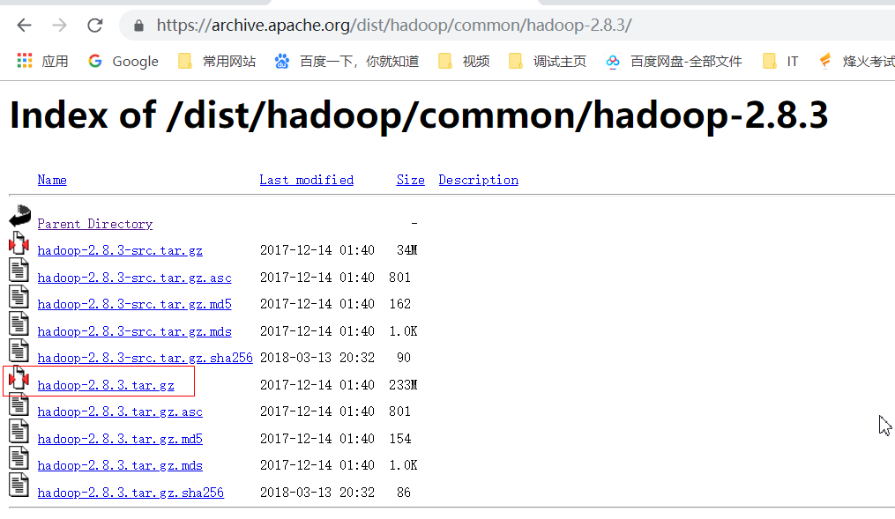
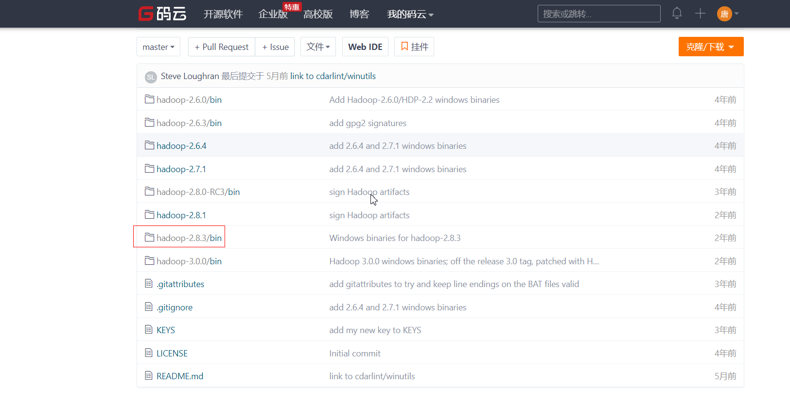
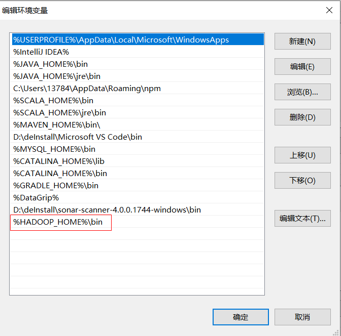

## 说明

## 目录

## windows安装hadoop

### 下载hadoop二进制文件包

> - [官方网站](http://hadoop.apache.org/releases.html)
>
> - [历史版本](https://archive.apache.org/dist/hadoop/common/)
>
> - 这里以2.8.3版本为例
>
>   

### 解压hadoop二进制包

> - 解压时需要使用**管理员模式**运行解压软件解压，否则会报错

### 下载winutils

> - 这个是别人编译好的hadoop的windows版本二进制文件，下载好后使用对应版本的bin替换hadoop的bin目录
>
> - 下载winutils可能很慢，在github上可以先将其fork，然后使用gitee（码云，国内代码托管平台）从github导入对应项目即可，下载速度会加快
>
> 
>
> - 

### 配置hadoop环境变量

> - 配置HADOOP_HOME
>
>   
>
> - 配置PATH
>
>   

### 修改配置文件

> - 配置文件路径：%HADOOP_HOME%\\etc\hadoop

#### core-site.xml（配置默认hdfs的访问端口）

```xml
<configuration>
    <property>
        <name>fs.defaultFS</name>
        <value>hdfs://localhost:9000</value>
    </property>    
</configuration>
```

#### hdfs-site.xml

> - 设置复制数为1，即不进行复制。namenode文件路径以及datanode数据路径

```xml
<configuration>
    <property>
        <name>dfs.replication</name>
        <value>1</value>
    </property>
    <property>    
        <name>dfs.namenode.name.dir</name>    
        <value>file:/hadoop/data/dfs/namenode</value>    
    </property>    
    <property>    
        <name>dfs.datanode.data.dir</name>    
        <value>file:/hadoop/data/dfs/datanode</value>  
    </property>
</configuration>
```

#### mapred-site.xml

> - 将mapred-site.xml.template 名称修改为 mapred-site.xml 后再修改内容（设置mr使用的框架，这里使用yarn）

```xml
<configuration>
    <property>
        <name>mapreduce.framework.name</name>
        <value>yarn</value>
    </property>
</configuration>
```

#### yarn-site.xml

> - 这里yarn设置使用了mr混洗

```xml
<configuration>
    <property>
        <name>yarn.nodemanager.aux-services</name>
        <value>mapreduce_shuffle</value>
    </property>
    <property>
        <name>yarn.nodemanager.aux-services.mapreduce.shuffle.class</name>
        <value>org.apache.hadoop.mapred.ShuffleHandler</value>
    </property>
</configuration>
```

#### hadoop-env.cmd

> - 设置JAVA_HOME的值(如果这里使用了带空格的Program Files路径将会报错！,将原来引用环境变量的值修改为绝对路径

### 格式化hdfs

> - 进入bin目录，在cmd中运行命令 hdfs namenode -format

### 启动hadoop

> - 注意：需要使用管理员运行cmd才行
> - 进入sbin目录，在cmd中运行命令start-all.cmd

### 检查

> - 查看Hadoop状态：http://localhost:50070
> - 查看集群状态：http://localhost:8088

### 停止hadoop

> - 执行stop-all.cmd关闭Hadoop