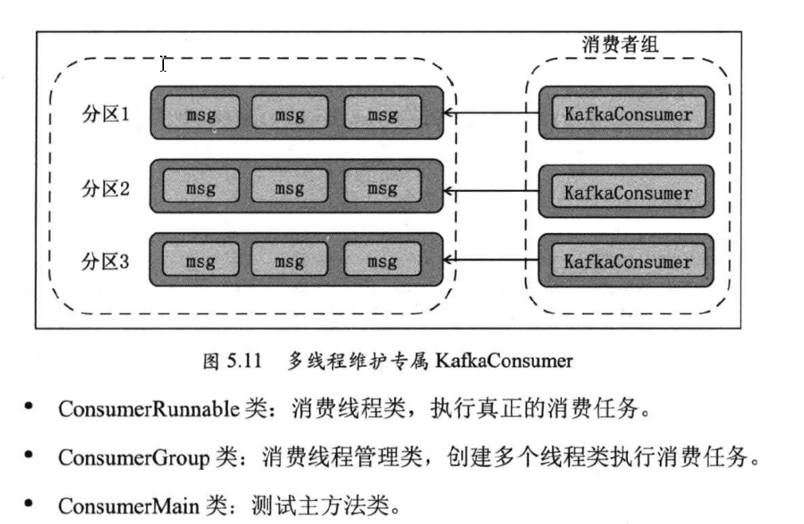

**新API的KafkaConcumer是非线程安全的，不能在多个线程中使用同一个KafkaConcumer，而与之对应的KafkaProducer是线程安全的**

### 1.方式一：每个线程维护一个KafkaConcumer

比如一个topic有12个分区，那么可以使用最多12个线程（12个线程属于同一个消费者组，若超过12个，就会产生闲置线程，浪费资源）消费该topic的数据



####  ConsumerRunnable.java

```` java
package com.fh.sugar;

import org.apache.kafka.clients.consumer.ConsumerConfig;
import org.apache.kafka.clients.consumer.ConsumerRecord;
import org.apache.kafka.clients.consumer.ConsumerRecords;
import org.apache.kafka.clients.consumer.KafkaConsumer;

import java.util.Collections;
import java.util.Properties;

/**
 * 线程消费类，负责执行真正的消费任务
 */
public class ConsumerRunnable implements Runnable {
    private final KafkaConsumer<String, String> kafkaConsumer;

    public ConsumerRunnable(String brokerList, String groupId, String topic) {
        Properties properties = new Properties();
        properties.put(ConsumerConfig.BOOTSTRAP_SERVERS_CONFIG, brokerList);
        properties.put(ConsumerConfig.GROUP_ID_CONFIG, groupId);
        properties.put(ConsumerConfig.ENABLE_AUTO_COMMIT_CONFIG, true);
        properties.put(ConsumerConfig.AUTO_COMMIT_INTERVAL_MS_CONFIG, 1000);
        properties.put(ConsumerConfig.SESSION_TIMEOUT_MS_CONFIG, 3000);
        properties.put(ConsumerConfig.KEY_DESERIALIZER_CLASS_CONFIG, "org.apache.kafka.common.serialization.StringDeserializer");
        properties.put(ConsumerConfig.VALUE_DESERIALIZER_CLASS_CONFIG, "org.apache.kafka.common.serialization.StringDeserializer");

        this.kafkaConsumer = new KafkaConsumer<>(properties);
        kafkaConsumer.subscribe(Collections.singletonList(topic));
    }

    @Override
    public void run() {
        while (true) {
            ConsumerRecords<String, String> records = kafkaConsumer.poll(200);
            for (ConsumerRecord<String, String> record : records) {
                System.out.println(Thread.currentThread().getName() + " consumed " + record.partition() + " the message with offset:" + record.offset());
            }
        }
    }
}
````

#### ConsumerGroup.java

```java
package com.fh.sugar;

import java.util.ArrayList;
import java.util.List;

public class ConsumerGroup {
    private List<ConsumerRunnable> consumers;

    public ConsumerGroup(int consumerNum, String groupId, String topic, String brokerList) {
        consumers = new ArrayList<>(consumerNum);
        for (int i = 0; i < consumerNum; i++) {
            ConsumerRunnable consumerRunnable = new ConsumerRunnable(brokerList, groupId, topic);
            consumers.add(consumerRunnable);
        }
    }

    public void execute() {
        for (ConsumerRunnable task : consumers) {
            new Thread(task).start();
        }
    }
}
```

#### ConsumerMain.java

```java
package com.fh.sugar;

public class ConsumerMain {
    public static void main(String[] args) {
        String brokerList="localhost:9092";
        String groupId="testGroup";
        String topic="test-topic";
        int consumerNum=12;
        ConsumerGroup consumerGroup = new ConsumerGroup(consumerNum, groupId, topic, brokerList);
        consumerGroup.execute();

    }
}

```

### 2.方式二：单线程+多work线程

其中单线程用于拉取数据，然后交给多个work线程消费

#### ConsumerThreadHandler.java

```java
package com.fh.sugar.demo2;

import org.apache.kafka.clients.consumer.*;
import org.apache.kafka.common.TopicPartition;
import org.apache.kafka.common.errors.WakeupException;

import java.util.*;
import java.util.concurrent.ArrayBlockingQueue;
import java.util.concurrent.ExecutorService;
import java.util.concurrent.ThreadPoolExecutor;
import java.util.concurrent.TimeUnit;

public class ConsumerThreadHanlder<K, V> {
    //消费者，用于拉取数据
    private final KafkaConsumer<K, V> consumer;
    //线程池
    private ExecutorService executorService;
    //存储每个分区要提交的偏移量
    private final Map<TopicPartition, OffsetAndMetadata> offsets = new HashMap<>();

    public ConsumerThreadHanlder(String brokerList, String groupId, String topic) {
        Properties properties = new Properties();
        properties.put(ConsumerConfig.BOOTSTRAP_SERVERS_CONFIG, brokerList);
        properties.put(ConsumerConfig.GROUP_ID_CONFIG, groupId);
        properties.put(ConsumerConfig.ENABLE_AUTO_COMMIT_CONFIG, false); //关闭自动提交
        properties.put(ConsumerConfig.AUTO_OFFSET_RESET_CONFIG, "earliest"); //若该group有已提交的偏移量，则从上次位置继续消费，否则从头开始消费
        properties.put(ConsumerConfig.AUTO_COMMIT_INTERVAL_MS_CONFIG, 1000);
        properties.put(ConsumerConfig.SESSION_TIMEOUT_MS_CONFIG, 3000);
        properties.put(ConsumerConfig.KEY_DESERIALIZER_CLASS_CONFIG, "org.apache.kafka.common.serialization.StringDeserializer");
        properties.put(ConsumerConfig.VALUE_DESERIALIZER_CLASS_CONFIG, "org.apache.kafka.common.serialization.StringDeserializer");

        this.consumer = new KafkaConsumer<>(properties);
        consumer.subscribe(Collections.singletonList(topic), new ConsumerRebalanceListener() {
            /**
             * 分区取消时要执行的方法
             * @param collection 分区列表
             */
            @Override
            public void onPartitionsRevoked(Collection<TopicPartition> collection) {
                consumer.commitSync(offsets); //使用同步方式提交位移
            }

            /**
             * 分区重新分配时要执行的方法
             * @param collection 分区列表
             */
            @Override
            public void onPartitionsAssigned(Collection<TopicPartition> collection) {
                offsets.clear();
            }
        });
    }

    public void consume(int consumerNum) {
        executorService = new ThreadPoolExecutor(consumerNum, consumerNum, 0L, TimeUnit.SECONDS,
                new ArrayBlockingQueue<>(1000), new ThreadPoolExecutor.CallerRunsPolicy());
        try {
            while (true) {
                ConsumerRecords<K, V> records = consumer.poll(1000);
                if (!records.isEmpty()) {
                    executorService.execute(new ConsumerWorker(records, offsets));
                }
                commitOffsets();
            }
        } catch (WakeupException e) {

        } finally {
            commitOffsets();
            consumer.close();
        }
    }

    private void commitOffsets() {
        Map<TopicPartition, OffsetAndMetadata> unModfiedMap;
        synchronized (offsets) {
            if (offsets.isEmpty()) {
                return;
            }
            unModfiedMap = Collections.unmodifiableMap(new HashMap<>(offsets));
        }
        consumer.commitSync(unModfiedMap);
    }

    public void close() {
        consumer.wakeup();
        consumer.close();
    }
}

```

#### ConsumerWorker.java

```java
package com.fh.sugar.demo2;

import org.apache.kafka.clients.consumer.ConsumerRecord;
import org.apache.kafka.clients.consumer.ConsumerRecords;
import org.apache.kafka.clients.consumer.OffsetAndMetadata;
import org.apache.kafka.common.TopicPartition;

import java.util.List;
import java.util.Map;

public class ConsumerWorker<K, V> implements Runnable {
    private final ConsumerRecords<K, V> records;
    private final Map<TopicPartition, OffsetAndMetadata> offsets;

    public ConsumerWorker(ConsumerRecords<K, V> records, Map<TopicPartition, OffsetAndMetadata> offsets) {
        this.records=records;
        this.offsets=offsets;
    }

    @Override
    public void run() {
        //获取所有分区，按分区进行消费
        for(TopicPartition partition:records.partitions()){
            //获取指定分区的数据
            List<ConsumerRecord<K, V>> partitionRecords = records.records(partition); 
            for (ConsumerRecord<K, V> record : partitionRecords) {
                //具体消费逻辑
                System.out.println("");
            }
            //上报位移,获取最后一条数据的偏移量
            long lastOffset = partitionRecords.get(partitionRecords.size() - 1).offset();
            synchronized (offsets){
                if(!offsets.containsKey(partition)){
                    offsets.put(partition,new OffsetAndMetadata(lastOffset+1));
                }else {
                    long current = offsets.get(partition).offset();
                    if(current<=lastOffset+1){
                        offsets.put(partition,new OffsetAndMetadata(lastOffset+1));
                    }
                }
            }
        }

    }
}

```

#### Main.java

```java
package com.fh.sugar.demo2;

import java.util.concurrent.TimeUnit;

public class Main {
    public static void main(String[] args) {
        String brokerList="localhost:9092";
        String groupId="testGroup";
        String topic="test-topic";
        final ConsumerThreadHanlder<byte[], byte[]> threadHanlder = new ConsumerThreadHanlder<>(brokerList, groupId, topic);
        final int cpuCount=Runtime.getRuntime().availableProcessors(); //返回当前可用处理器的数量
        Runnable runnable= () -> threadHanlder.consume(cpuCount);
        new Thread(runnable).start();
        try {
            TimeUnit.SECONDS.sleep(20);
        } catch (InterruptedException e) {
            e.printStackTrace();
        }
        System.out.println("start closing the consumer");
        threadHanlder.close();
    }
}

```

###  3.两种方式对比

方式1：每个线程消费一个分区的数据，线程数最多为topic的分区数（这是由kafka组管理机制决定的）

方式2：有3层链路，主线程-->消费者线程-->worker线程，可能会丢失数据，但是可以保证不会重复消费数据

