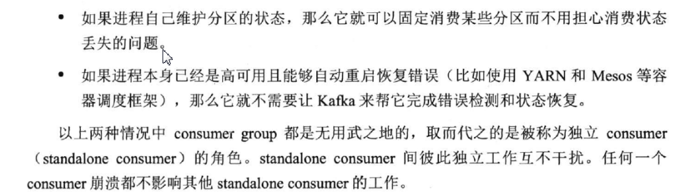
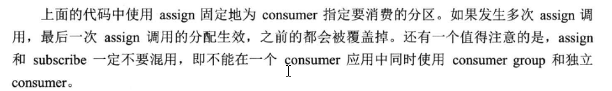

**独立消费者，即使用assign方法分配分区的消费者，它不受kafka的组管理机制限制，可以实现精确控制消费，任何一个独立消费者崩溃都不会影响其它消费者**



```java
//获取分区信息
List<PartitionInfo> partitionInfos = consumer.partitionsFor("test_topic");
List<TopicPartition> partitions = new ArrayList<>();
for (PartitionInfo partitionInfo : partitionInfos) {
     partitions.add(new TopicPartition(partitionInfo.topic(), partitionInfo.partition()));
}
consumer.assign(partitions);
```

