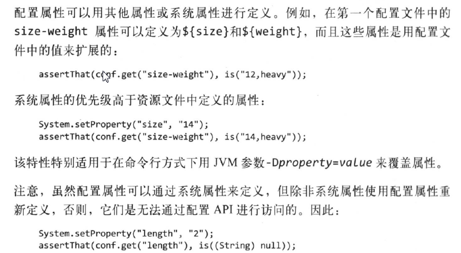

1. Configuration对象添加配置文件时，若添加了多个配置文件，并且配置文件中有相同的属性，则后添加的会覆盖先添加的

   ```java
   Configuration conf = new Configuration();
   conf.addResource("a.xml");
   conf.addResource("b.xml");  //b中的属性值会覆盖a中的
   ```

   有一种情况例外，该属性被声明为final，则不会被覆盖

   ```xml
   <property>
       <name>color</name>
       <value>red</value>
       <!-- 将属性声明为final，不会被覆盖 -->
       <final>true</final>
   </property>
   ```

2. 变量扩展

   

