## 说明

## 目录

## DataSet创建和删除临时表

### 创建临时表

```java
// 创建它的SparkSession对象终止前有效
df.createOrReplaceTempView("tempViewName")  

// spark应用程序终止前有效
df.createOrReplaceGlobalTempView("tempViewName")  
```

### 删除临时表

```java
spark.catalog.dropTempView("tempViewName")
spark.catalog.dropGlobalTempView("tempViewName")
```

## spark java-api使用

> 注意要使用和安装的scala对应版本兼容的spark
>
> 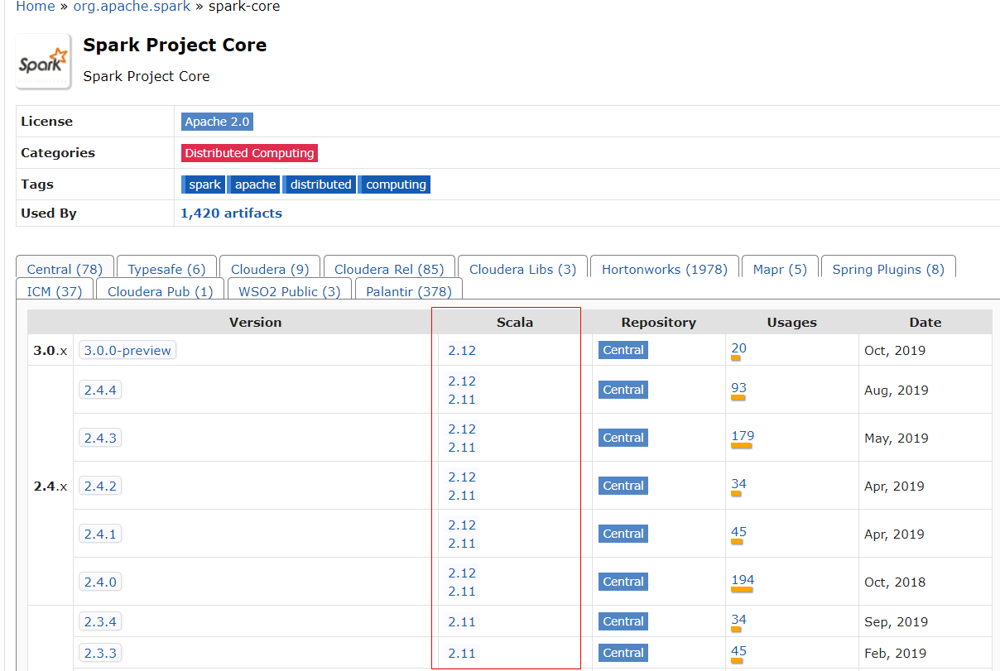

### 创建java maven工程

```xml
<dependency>
            <groupId>org.apache.spark</groupId>
            <artifactId>spark-core_2.12</artifactId>
            <version>2.4.4</version>
            <!--排除日志依赖，统一使用slf4j+logback-->
            <exclusions>
                <exclusion>
                    <groupId>log4j</groupId>
                    <artifactId>log4j</artifactId>
                </exclusion>
                <exclusion>
                    <groupId>org.slf4j</groupId>
                    <artifactId>slf4j-log4j12</artifactId>
                </exclusion>
            </exclusions>
        </dependency>
        <dependency>
            <groupId>ch.qos.logback</groupId>
            <artifactId>logback-core</artifactId>
            <version>1.2.3</version>
        </dependency>
        <dependency>
            <groupId>ch.qos.logback</groupId>
            <artifactId>logback-classic</artifactId>
            <version>1.2.3</version>
        </dependency>
        <!-- https://mvnrepository.com/artifact/org.slf4j/log4j-over-slf4j -->
        <dependency>
            <groupId>org.slf4j</groupId>
            <artifactId>log4j-over-slf4j</artifactId>
            <version>1.7.24</version>
        </dependency>
```

### 常见问题


#### spark报任务没有序列化问题

> spark会把当前作为一个任务，所以该类需要实现java.io.Serializable接口，并且，若程序内部使用了主类的成员变量，则该成员变量也不要是可以序列化的，否则会报错

#### 找不到winutils.exe

> - 下载winutils.exe，并放在hadoop的bin目录下即可，需要确保环境变量配置正确（HADOOP_HOME、PATH）
> - 然后重启电脑即可

### spark算子分类

#### transformation 

> - Transformation 变换/转换：这种变换并不触发提交作业，完成作业中间过程处理。Transformation 操作是延迟计算的，也就是说从一个RDD 转换生成另一个 RDD 的转换操作不是马上执行，需要等到有 Action 操作的时候才会真正触发运算,如map,filter
>
> - Transformation 算子根据value的类型可以分为2类
>
>   ```
>   1. Value数据类型的Transformation算子，对value进行操作 如：map，filter等
>   2. Key-Value数据类型的Transfromation算子，只有key-value形式的数据才能用。 
>   如：reduceByKey，groupByKey等
>   ```
>
> - 

#### action

> - Action 行动算子：这类算子会触发 SparkContext 提交 Job 作业。 Action 算子会触发 Spark 提交作业（Job）,如count

### transformation 算子

#### Value数据类型

##### map

> 将一个元素映射成另一个元素，1对1映射

##### flatmap

> 1对多映射

##### mapPartitions

###### 说明

> - mapPartitions函数会对每个分区依次调用分区函数处理，然后将处理的结果(若干个Iterator)生成新的RDDs。mapPartitions与map类似，但是如果在映射的过程中需要频繁创建额外的对象，使用mapPartitions要比map高效的过。比如，将RDD中的所有数据通过JDBC连接写入数据库，如果使用map函数，可能要为每一个元素都创建一个connection，这样开销很大，如果使用mapPartitions，那么只需要针对每一个分区建立一个connection
> - **两者的主要区别是调用的粒度不一样：map的输入变换函数是应用于RDD中每个元素，而mapPartitions的输入函数是应用于每个分区**
> - 假设一个rdd有10个元素，分成3个分区。如果使用map方法，map中的输入函数会被调用10次；而使用mapPartitions方法的话，其输入函数会只会被调用3次，每个分区调用1次

###### 代码

```java
SparkConf conf = new SparkConf().setAppName("SparkRDD").setMaster("local");
        JavaSparkContext sc = new JavaSparkContext(conf);
        List<Integer> data = Arrays.asList(1, 2, 4, 3, 5, 6, 7);
        //RDD有两个分区
        JavaRDD<Integer> javaRDD = sc.parallelize(data, 2);
        //计算每个分区的合计
        JavaRDD<Integer> mapPartitionsRDD = javaRDD.mapPartitions(new FlatMapFunction<Iterator<Integer>, Integer>() {
            @Override
            public Iterator<Integer> call(Iterator<Integer> integerIterator) throws Exception {
                int isum = 0;
                while (integerIterator.hasNext())
                    isum += integerIterator.next();
                LinkedList<Integer> linkedList = new LinkedList<Integer>();
                linkedList.add(isum);
                return linkedList.iterator();
            }
        });

        System.out.println("mapPartitionsRDD~~~~~~~~~~~~~~~~~~~~~~" + mapPartitionsRDD.collect());
        sc.close();
```

##### glom

> - 将每个分区内的元素映射成一个集合，集合包含该分区所以元素
>
>   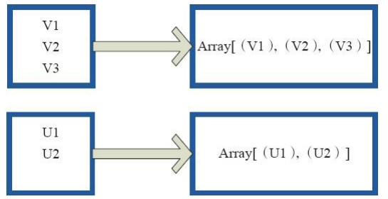

##### union

> - 将2个rdd上下拼接成一个新的rdd
> - 使用 union 函数时需要保证两个 RDD 元素的数据类型相同，返回的 RDD 数据类型和被合并的 RDD 元素数据类型相同，**并不进行去重操作**，保存所有元素

##### cartesian

###### 说明

> - **Cartesian 对两个 RDD 做笛卡尔集，生成的 CartesianRDD 中 partition 个数 = partitionNum(RDD a) * partitionNum(RDD b)**。
> - 从getDependencies分析可知，这里的依赖关系与前面的不太一样，CartesianRDD中每个partition依赖两个parent RDD，而且其中每个 partition 完全依赖(NarrowDependency) RDD a 中一个 partition，同时又完全依赖(NarrowDependency) RDD b 中另一个 partition。具体如下CartesianRDD 中的 partiton i 依赖于 (RDD a).List(i / numPartitionsInRDDb) 和 (RDD b).List(i % numPartitionsInRDDb)

###### 代码

```java
List<Integer> data = Arrays.asList(1, 2, 4, 3, 5, 6, 7);
JavaRDD<Integer> javaRDD = javaSparkContext.parallelize(data);

JavaPairRDD<Integer,Integer> cartesianRDD = javaRDD.cartesian(javaRDD); System.out.println(cartesianRDD.collect());
```

##### groupBy

> - 将元素通过函数生成相应的 Key，数据就转化为 Key-Value 格式，之后将 Key 相同的元素分为一组
> - 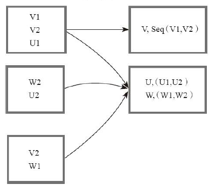

##### filter

> - filter 函数功能是对元素进行过滤，对每个 元 素 应 用 f 函 数， 返 回 值 为 true 的 元 素 在RDD 中保留，返回值为 false 的元素将被过滤掉 

##### distinct

###### 说明

> - 对rdd元素进行去重
> - 原理：distinct() 功能是 deduplicate RDD 中的所有的重复数据。由于重复数据可能分散在不同的 partition 里面，因此需要 shuffle 来进行 aggregate 后再去重。然而，shuffle 要求数据类型是 <K, V> 。如果原始数据只有 Key（比如例子中 record 只有一个整数），那么需要补充成 <K, null> 。这个补充过程由 map() 操作完成，生成 MappedRDD。然后调用上面的 reduceByKey() 来进行 shuffle，在 map 端进行 combine，然后 reduce 进一步去重，生成 MapPartitionsRDD。最后，将 <K, null> 还原成 K，仍然由 map() 完成，生成 MappedRDD

###### 代码

```java
List<Integer> data = Arrays.asList(1, 2, 4, 3, 5, 6, 7, 1, 2);
JavaRDD<Integer> javaRDD = javaSparkContext.parallelize(data);

JavaRDD<Integer> distinctRDD1 = javaRDD.distinct();
System.out.println(distinctRDD1.collect());
JavaRDD<Integer> distinctRDD2 = javaRDD.distinct(2);
System.out.println(distinctRDD2.collect());
```

##### subtract 

> - subtract相当于进行集合的差操作，RDD 1去除RDD 1和RDD 2交集中的所有元素。图中左侧的大方框代表两个RDD，大方框内的小方框代表RDD的分区。 右侧大方框 代表合并后的RDD，大方框内的小方框代表分区。 V1在两个RDD中均有，根据差集运算规则，新RDD不保留，V2在第一个RDD有，第二个RDD没有，则在新RDD元素中包含V2 
> - 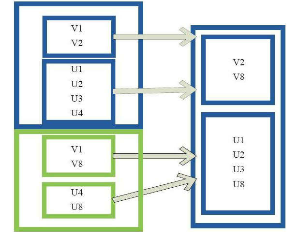

##### sample 

> - sample 将 RDD 这个集合内的元素进行采样，获取所有元素的子集。用户可以设定是否有放回的抽样、百分比、随机种子，进而决定采样方式。内部实现是生成 SampledRDD(withReplacement， fraction， seed)。 
>
>   ```
>   函数参数设置： 
>   withReplacement=true，表示有放回的抽样。 
>   withReplacement=false，表示无放回的抽样 
>   Fraction=>,一个大于0,小于或等于1的小数值,用于控制要读取的数据所占整个数据集的概率. 
>   Seed=>,这个值如果没有传入,默认值是一个0~Long.maxvalue之间的整数
>   ```

##### takeSample

###### 说明

> - takeSample函数返回一个数组(是collect后的结果，不是rdd)，在数据集中随机采样 num 个元素组成
> - takeSample函数类似于[sample](https://www.jianshu.com/p/abe1755220b2)函数，该函数接受三个参数，第一个参数withReplacement ，表示采样是否放回，true表示有放回的采样，false表示无放回采样；第二个参数num，表示返回的采样数据的个数，这个也是takeSample函数和sample函数的区别；第三个参数seed，表示用于指定的随机数生成器种子。
> - 另外，takeSample函数先是计算fraction，也就是采样比例，然后调用sample函数进行采样，并对采样后的数据进行collect()，最后调用take函数返回num个元素。注意，如果采样个数大于RDD的元素个数，且选择的无放回采样，则返回原始rdd的数据。

###### 代码

```java
List<Integer> data = Arrays.asList(5, 1, 0, 4, 4, 2, 2);
JavaRDD<Integer> javaRDD = javaSparkContext.parallelize(data, 3);
System.out.println("takeSample-----1-------------" + javaRDD.takeSample(true,2));
System.out.println("takeSample-----2-------------" + javaRDD.takeSample(true,2,100));
//返回20个元素
System.out.println("takeSample-----3-------------" + javaRDD.takeSample(true,20,100));
//无放回采样，采样个数大于数据集个数，返回7个元素
System.out.println("takeSample-----4-------------" + javaRDD.takeSample(false,20,100));
```

##### cache

> - cache 将 RDD 元素从磁盘缓存到内存。 相当于 persist(MEMORY_ONLY) 函数的功能
> - [Spark Cache的几点思考](https://blog.csdn.net/qq_27639777/article/details/82319560)

##### persist 

> - persist 函数对 RDD 进行缓存操作。数据缓存在哪里依据 StorageLevel 这个枚举类型进行确定。 有以下几种类型的组合（见10）， DISK 代表磁盘，MEMORY 代表内存， SER 代表数据是否进行序列化存储。 
>   下面为函数定义， StorageLevel 是枚举类型，代表存储模式，用户可以通过按需进行选择。persist(newLevel:StorageLevel).图 中列出persist 函数可以进行缓存的模式。例如，MEMORY_AND_DISK_SER 代表数据可以存储在内存和磁盘，并且以序列化的方式存储，其他同理 
> - 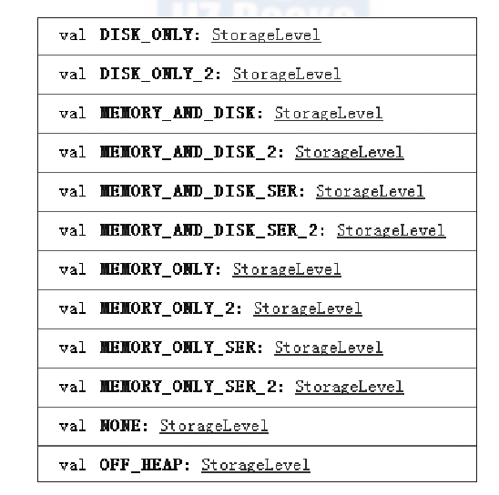

#### Key-Value数据类型

### action算子

### rdd api解析

#### join

##### 说明

> - 对2个rdd进行join操作，将2个rdd中key相同的数据聚合到一起，形成（k,<v1,v2>）的二元组
>
> - 将一组数据转化为RDD后，分别创造出两个PairRDD，然后再对两个PairRDD进行归约（即合并相同Key对应的Value）
>
> - 若rdd1有一条数据（1,1），rdd2有2条数据（1，A）,(1,B),则会产生<1,<1,A>>,<1,<1,B>>，相当于做**笛卡尔积**，产生1*2=2条结果
>
> - 如图所示
>
>   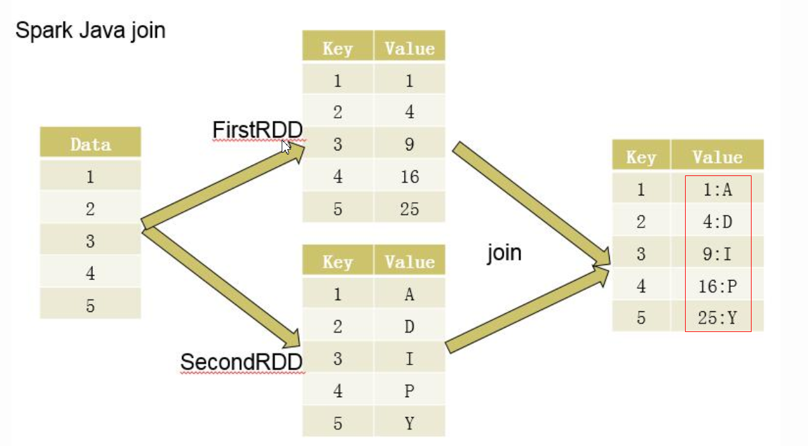

##### 代码

```java
@Test
    public void testJoin() {
        SparkConf conf = new SparkConf().setAppName("SparkRDD").setMaster("local");
        JavaSparkContext sc = new JavaSparkContext(conf);
        List<Integer> data = Arrays.asList(1, 2, 3, 4, 5);
        JavaRDD<Integer> rdd = sc.parallelize(data);

        //FirstRDD
        JavaPairRDD<Integer, Integer> firstRDD = rdd.mapToPair(new PairFunction<Integer, Integer, Integer>() {
            @Override
            public Tuple2<Integer, Integer> call(Integer num) throws Exception {
                return new Tuple2<>(num, num * num);
            }
        });

        //SecondRDD
        JavaPairRDD<Integer, String> secondRDD = rdd.mapToPair(new PairFunction<Integer, Integer, String>() {
            @Override
            public Tuple2<Integer, String> call(Integer num) throws Exception {
                return new Tuple2<>(num, String.valueOf((char) (64 + num * num)));
            }
        });

        JavaPairRDD<Integer, Tuple2<Integer, String>> joinRDD = firstRDD.join(secondRDD);

        JavaRDD<String> res = joinRDD.map(new Function<Tuple2<Integer, Tuple2<Integer, String>>, String>() {
            @Override
            public String call(Tuple2<Integer, Tuple2<Integer, String>> integerTuple2Tuple2) throws Exception {
                int key = integerTuple2Tuple2._1();
                int value1 = integerTuple2Tuple2._2()._1();
                String value2 = integerTuple2Tuple2._2()._2();
                return "<" + key + ",<" + value1 + "," + value2 + ">>";
            }
        });

        List<String> resList = res.collect();
        for (String str : resList) {
            System.out.println(str);
        }

        sc.close();
    }
```

#### cogroup

##### 说明

> - 有两个元组Tuple的集合A与B,先对A组集合中key相同的value进行聚合,然后对B组集合中key相同的value进行聚合,之后对A组与B组进行"join"操作
> - 即2个rdd（元素是元组）先各自内部根据key进行聚合，然后将聚合的结果进行join操作

##### 代码

```java
@Test
    public void testCogroup(){
        SparkConf conf=new SparkConf().setAppName("spark WordCount!").setMaster("local");
        JavaSparkContext sContext=new JavaSparkContext(conf);
        List<Tuple2<Integer,String>> namesList=Arrays.asList(
                new Tuple2<Integer, String>(1,"Spark"),
                new Tuple2<Integer, String>(3,"Tachyon"),
                new Tuple2<Integer, String>(4,"Sqoop"),
                new Tuple2<Integer, String>(2,"Hadoop"),
                new Tuple2<Integer, String>(2,"Hadoop2")
        );

        List<Tuple2<Integer,Integer>> scoresList=Arrays.asList(
                new Tuple2<Integer, Integer>(1,100),
                new Tuple2<Integer, Integer>(3,70),
                new Tuple2<Integer, Integer>(3,77),
                new Tuple2<Integer, Integer>(2,90),
                new Tuple2<Integer, Integer>(2,80)
        );
        JavaPairRDD<Integer, String> names=sContext.parallelizePairs(namesList);
        JavaPairRDD<Integer, Integer> scores=sContext.parallelizePairs(scoresList);
        /**
         * <Integer> JavaPairRDD<Integer, Tuple2<Iterable<String>, Iterable<Integer>>>
         * org.apache.spark.api.java.JavaPairRDD.cogroup(JavaPairRDD<Integer, Integer> other)
         */
        JavaPairRDD<Integer, Tuple2<Iterable<String>, Iterable<Integer>>> nameScores=names.cogroup(scores);

        nameScores.foreach(new VoidFunction<Tuple2<Integer, Tuple2<Iterable<String>, Iterable<Integer>>>>() {
            private static final long serialVersionUID = 1L;
            int i=1;
            @Override
            public void call(
                    Tuple2<Integer, Tuple2<Iterable<String>, Iterable<Integer>>> t)
                    throws Exception {
                String string="ID:"+t._1+" , "+"Name:"+t._2._1+" , "+"Score:"+t._2._2;
                string+="     count:"+i;
                System.out.println(string);
                i++;
            }
        });

        sContext.close();
    }
```

#### groupByKey

##### 说明

> - 即根据数据的key进行聚合，所以需要rdd的元素是元组
>
> - 在spark中，我们知道一切的操作都是基于RDD的。在使用中，RDD有一种非常特殊也是非常实用的format——pair RDD，即RDD的每一行是（key, value）的格式。这种格式很像Python的字典类型，便于针对key进行一些处理
>
> - groupByKey也是对每个key进行操作，但只生成一个sequence。需要特别注意“Note”中的话，它告诉我们：如果需要对sequence进行aggregation操作（注意，groupByKey本身不能自定义操作函数），那么，选择reduceByKey/aggregateByKey更好。这是因为groupByKey不能自定义函数，我们需要先用groupByKey生成RDD，然后才能对此RDD通过map进行自定义函数操作
>
> - 当采用groupByKey时，由于它不接收函数，spark只能先将所有的键值对(key-value pair)都移动，这样的后果是集群节点之间的开销很大，导致传输延时。整个过程如下
>
>   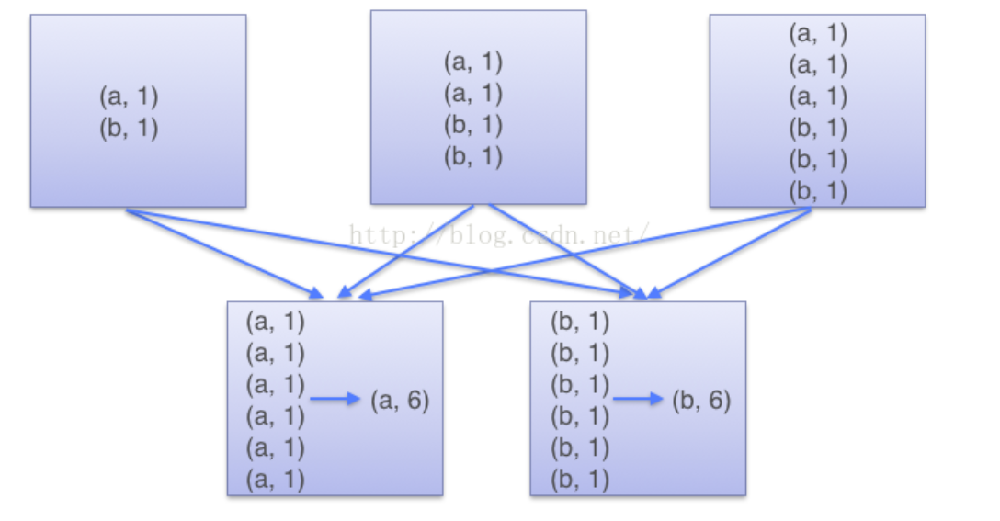
>
> - 如果仅仅是group处理，那么以下函数应该优先于 groupByKey ：
>
>   > （1）、combineByKey 组合数据，但是组合之后的数据类型与输入时值的类型不一样。
>   > （2）、foldByKey合并每一个 key 的所有值，在级联函数和“零值”中使用。
>
> - 1

##### 代码

```java
SparkConf sparkConf = new SparkConf();  
        sparkConf.setAppName("Spark_GroupByKey_Sample");  
        sparkConf.setMaster("local");  
  
        JavaSparkContext context = new JavaSparkContext(sparkConf);  
  
        List<Integer> data = Arrays.asList(1,1,2,2,1);  
        JavaRDD<Integer> distData= context.parallelize(data);  
  
        JavaPairRDD<Integer, Integer> firstRDD = distData.mapToPair(new PairFunction<Integer, Integer, Integer>() {  
            @Override  
            public Tuple2<Integer, Integer> call(Integer integer) throws Exception {  
                return new Tuple2(integer, integer*integer);  
            }  
        });  
  
		//得到<1,[1,1,1]>,<2,[4,4,]>
        JavaPairRDD<Integer, Iterable<Integer>> secondRDD = firstRDD.groupByKey();  
  
		//得到<1,1 1 1>,<2,4 4>
        List<Tuple2<Integer, String>> reslist = secondRDD.map(new Function<Tuple2<Integer, Iterable<Integer>>, Tuple2<Integer, String>>() {  
            @Override  
            public Tuple2<Integer, String> call(Tuple2<Integer, Iterable<Integer>> integerIterableTuple2) throws Exception {  
                int key = integerIterableTuple2._1();  
                StringBuffer sb = new StringBuffer();  
                Iterable<Integer> iter = integerIterableTuple2._2();  
                for (Integer integer : iter) {  
                        sb.append(integer).append(" ");  
                }  
                return new Tuple2(key, sb.toString().trim());  
            }  
        }).collect();  
  
  
        for(Tuple2<Integer, String> str : reslist) {  
            System.out.println(str._1() + "\t" + str._2() );  
        }  
        context.stop(); 
```

#### mapToPair

> 将映射映射成一个元组

#### mapPartitionsWithIndex

##### 说明

> - mapPartitionsWithIndex与mapPartitions基本相同，只是在处理函数的参数是一个**二元元组**，元组的第一个元素是当前处理的**分区的index**，元组的第二个元素是当前处理的分区元素组成的Iterator
> - 分区号从0开始

##### 代码

```java
List<Integer> data = Arrays.asList(1, 2, 4, 3, 5, 6, 7);
//RDD有两个分区
JavaRDD<Integer> javaRDD = javaSparkContext.parallelize(data,2);
//分区index、元素值、元素编号输出
JavaRDD<String> mapPartitionsWithIndexRDD = javaRDD.mapPartitionsWithIndex(new Function2<Integer, Iterator<Integer>, Iterator<String>>() {
 @Override 
public Iterator<String> call(Integer v1, Iterator<Integer> v2) throws Exception {        
  LinkedList<String> linkedList = new LinkedList<String>();        
  int i = 0;        
  while (v2.hasNext())            
   linkedList.add(Integer.toString(v1) + "|" + v2.next().toString() + Integer.toString(i++));        
  return linkedList.iterator();    
  }
},false);

System.out.println("mapPartitionsWithIndexRDD~~~~~~~~~~~~~~~~~~~~~~" + mapPartitionsWithIndexRDD.collect());
```

#### sortBy

##### 说明

> - sortBy根据给定的f函数将RDD中的元素进行排序

##### 代码

```java
List<Integer> data = Arrays.asList(5, 1, 1, 4, 4, 2, 2);
JavaRDD<Integer> javaRDD = javaSparkContext.parallelize(data, 3);
final Random random = new Random(100);
//对RDD进行转换，每个元素有两部分组成
JavaRDD<String> javaRDD1 = javaRDD.map(new Function<Integer, String>() {    
  @Override    
  public String call(Integer v1) throws Exception {        
    return v1.toString() + "_" + random.nextInt(100);    
  }
});
System.out.println(javaRDD1.collect());
//按RDD中每个元素的第二部分进行排序
JavaRDD<String> resultRDD = javaRDD1.sortBy(new Function<String, Object>() {    
  @Override    
  public Object call(String v1) throws Exception {        
    return v1.split("_")[1];    
  }
},false,3);
System.out.println("result--------------" + resultRDD.collect());
```

#### takeOrdered

##### 说明

> - takeOrdered函数用于从RDD中，按照默认（升序）或指定排序规则，返回前num个元素。

##### 代码

```java
    public static class TakeOrderedComparator implements Serializable, Comparator<Integer> {
        @Override
        public int compare(Integer o1, Integer o2) {
            return -o1.compareTo(o2);
        }
    }

    @Test
    public void testTakeOrdered() {
        SparkConf conf = new SparkConf().setAppName("SparkRDD").setMaster("local");
        JavaSparkContext sc = new JavaSparkContext(conf);
        List<Integer> data = Arrays.asList(5, 1, 0, 4, 4, 2, 2);
        JavaRDD<Integer> javaRDD = sc.parallelize(data, 3);
        System.out.println("takeOrdered-----1-------------" + javaRDD.takeOrdered(2));
        List<Integer> list = javaRDD.takeOrdered(2, new TakeOrderedComparator());
        System.out.println("takeOrdered----2--------------" + list);
        sc.close();
    }
```

#### fold

##### 说明

> - 根据设置的初始值和函数对rdd进行聚合，flod()函数相比reduce()加了一个初始值参数,reduce会以第一个元素作为初始值
> - fold是aggregate的简化，将aggregate中的seqOp和combOp使用同一个函数op。
>   从源码中可以看出，先是将zeroValue赋值给jobResult，然后针对每个分区利用op函数与zeroValue进行计算，再利用op函数将taskResult和jobResult合并计算，同时更新jobResult，最后，将jobResult的结果返回

##### 代码

```java
        SparkConf conf = new SparkConf().setAppName("SparkRDD").setMaster("local");
        JavaSparkContext sc = new JavaSparkContext(conf);
        List<String> data = Arrays.asList("5", "1", "1", "3", "6", "2", "2");
        JavaRDD<String> javaRDD = sc.parallelize(data, 5);
        String foldRDD = javaRDD.fold("0", new Function2<String, String, String>() {
            @Override
            public String call(String v1, String v2) throws Exception {
                System.out.println(String.format("v1:%s,v2:%s", v1, v2));
                return v1 + " - " + v2;
            }
        });
        System.out.println("~~~~~~~~~~~~~~~~~~~~~~~~~~~~~~~" + foldRDD);
        sc.close()
```

输出结果

```
~~~~~~~~~~~~~~~~~~~~~~~~~~~~~~~0 - 0 - 5 - 0 - 1 - 0 - 1 - 3 - 0 - 6 - 0 - 2 - 2
```

结果分析

> - 由于在初始化rdd时设置分片为5，则初始值会在每个分片被使用，（【5】，【1】，【1,3】，【6】，【2,2】）
>
> - 首先，“0”作为初始值作为每个分区的初始值，则得到5个分区的结果为（【0 - 5】，【0 - 1】，【0 - 1 - 3】，【0 - 6】，【0 - 2 - 2】）
> - 最后，将各个分区的结果再和初始值“0”进行聚合，得到【0 - 0 - 5 - 0 - 1 - 0 - 1 - 3 - 0 - 6 - 0 - 2 - 2】
> - 所以以上过程seqOp5次，combOp1次
> - 若只有一个分片，初始值也会使用2次，seqOp1次，combOp1次，结果【0 - 0 - 5 - 1 - 1 - 3 - 6 - 2 - 2】

#### countByKey

##### 说明

> - 即根据key进行聚合统计相同元素出现次数
> - rdd元素需要时元组才能使用，所以需要先**mapToPair**进行转换
> - 如果数据量比较大，可能出现**OOM**
> - 从源码中可以看出，先是进行map操作转化为(key,1)键值对，再进行reduce聚合操作，最后利用collect函数将数据加载到driver，并转化为map类型。注意，从上述分析可以看出，countByKey操作将数据全部加载到driver端的内存，如果数据量比较大，可能出现**OOM**。因此，如果key数量比较多，建议进行`rdd.mapValues(_ => 1L).reduceByKey(_ + _)`，返回`RDD[T, Long]`。

##### 代码

```java
        SparkConf conf = new SparkConf().setAppName("SparkRDD").setMaster("local");
        JavaSparkContext sc = new JavaSparkContext(conf);
        List<String> data = Arrays.asList("5", "1", "1", "3", "6", "2", "2");
        JavaRDD<String> javaRDD = sc.parallelize(data,5);
        JavaPairRDD<String,String> javaPairRDD = javaRDD.mapToPair(new PairFunction<String, String, String>() {
            @Override
            public Tuple2<String, String> call(String s) throws Exception {
                return new Tuple2<String, String>(s,s);
            }
        });
        System.out.println(javaPairRDD.countByKey());

        sc.close();
```

#### reduce

##### 说明

> - 根据映射函数f，对RDD中的元素进行二元计算（满足交换律和结合律），返回计算结果。
> - 从源码中可以看出，reduce函数相当于对RDD中的元素进行**reduceLeft**函数操作，reduceLeft函数是从列表的左边往右边应用reduce函数；之后，**在driver端对结果进行合并处理**，因此，如果分区数量过多或者自定义函数过于复杂，对driver端的负载比较重。

##### 代码

```java
        SparkConf conf = new SparkConf().setAppName("SparkRDD").setMaster("local");
        JavaSparkContext sc = new JavaSparkContext(conf);
        List<Integer> list = Arrays.asList(1, 2, 3, 4, 5);
        JavaRDD<Integer> rdd = sc.parallelize(list);
        Integer reduce = rdd.reduce(new Function2<Integer, Integer, Integer>() {
            @Override
            public Integer call(Integer a, Integer b) throws Exception {
                System.out.println(String.format("a:%s,b:%s", a, b));
                return a + b;
            }
        });
        System.out.println(reduce);
        sc.close();
```

#### aggregate

##### 说明

> - aggregate函数将每个分区里面的元素进行聚合，然后用combine函数将每个分区的结果和初始值(zeroValue)进行combine操作。
> - 这个函数最终返回U的类型不需要和RDD的T中元素类型一致。 这样，我们需要一个函数将T中元素合并到U中，另一个函数将两个U进行合并。
> - 其中，参数1是初值元素；参数2是seq函数是与初值进行比较；参数3是comb函数是进行合并 。 
>   注意：如果没有指定分区，aggregate是计算每个分区的，空值则用初始值替换。
> - 以求rdd平均数为例，要算平均值，我就有两个值是要求的，一个是rdd的各元素的累加和，另一个是元素计数，我初始化为(0, 0)，每个分区返回这样一个2元组，然后comb函数对其进行合并求平均数。

流程如图：

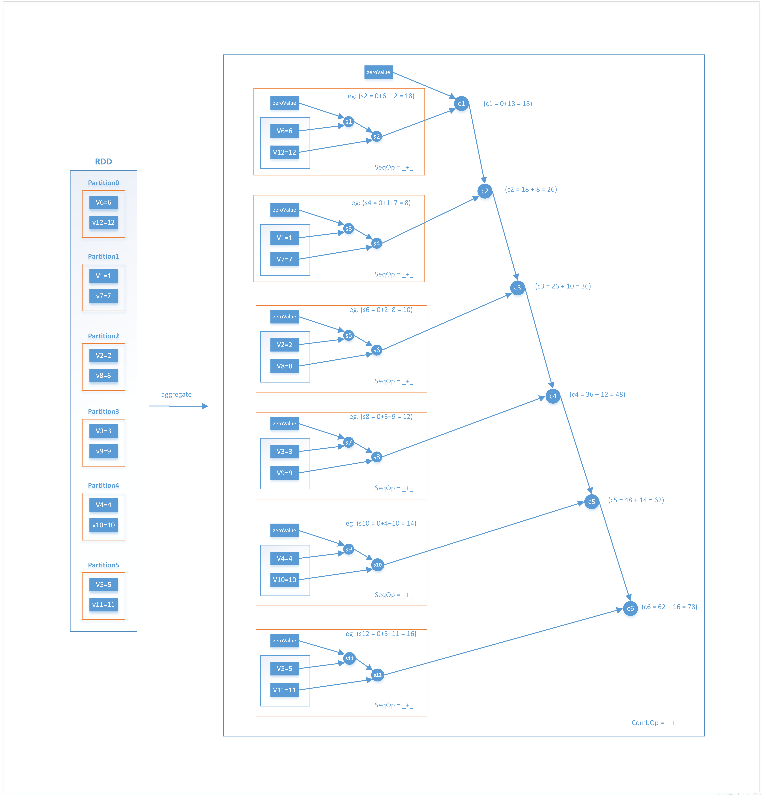

##### 代码

```java
SparkConf conf = new SparkConf().setAppName("SparkRDD").setMaster("local");
        JavaSparkContext sc = new JavaSparkContext(conf);
        List<Integer> data = Arrays.asList(5, 1, 1, 4, 4, 2, 2);
        //分成3个分片处理
        JavaRDD<Integer> rdd = sc.parallelize(data, 3);
        //初始值设置为<0,0>，第一个为分区和，第二个为分区元素个数
        Tuple2<Integer, Integer> initValue = new Tuple2<>(0, 0);
        Tuple2<Integer, Integer> result = rdd.aggregate(initValue,
                //seqOp函数应用到每个分区，初始值为<0,0>
                new Function2<Tuple2<Integer, Integer>, Integer, Tuple2<Integer, Integer>>() {
                    @Override
                    public Tuple2<Integer, Integer> call(Tuple2<Integer, Integer> tuple2, Integer a) throws Exception {
                        //a为分区rdd元素，将其与tuple2的第一个值进行求和累加，第二个值进行+1计数
                        return new Tuple2<>(tuple2._1 + a, tuple2._2 + 1);
                    }
                },
                //comb函数应用于每个分区的结果rdd，仍然会与初始值聚合一次
                new Function2<Tuple2<Integer, Integer>, Tuple2<Integer, Integer>, Tuple2<Integer, Integer>>() {
                    @Override
                    public Tuple2<Integer, Integer> call(Tuple2<Integer, Integer> tuple2a, Tuple2<Integer, Integer> tuple2b) throws Exception {
                        return new Tuple2<>(tuple2a._1 + tuple2b._1, tuple2a._2 + tuple2b._2);
                    }
                });

        System.out.println(result);
        //计算平均值
        System.out.println(result._1 / result._2);

        sc.close();
```

#### aggregateByKey

##### 说明

> - **aggregateByKey产生的rdd分区数默认和来源rdd分区数相同，也可以设置分区数或自定义分区函数**
> - **若来源rdd只有一个分区，则comb函数不会执行，至少要2个才可以，因为该函数用来聚合各个分区的数据，一个分区不用进行聚合**
> - 分区参数并不影响计算过程，只影响结果集产生的分区数
> - aggregateByKey函数对PairRDD中相同Key的值进行聚合操作，在聚合过程中同样使用了一个中立的初始值。
> - 和aggregate函数类似，aggregateByKey返回值的类型不需要和RDD中value的类型一致。因为aggregateByKey是对相同Key中的值进行聚合操作，所以aggregateByKey函数最终返回的类型还是Pair RDD，
> - 对应的结果是Key和聚合好的值；而aggregate函数直接是返回非RDD的结果，这点需要注意。在实现过程中，定义了三个aggregateByKey函数原型，
> - 但最终调用的aggregateByKey函数都一致。其中，参数zeroValue代表做比较的初始值；参数partitioner代表分区函数数，也可指定分区数；参数seq代表与初始值比较的函数；参数comb是进行合并的方法

##### 代码

```java
SparkConf conf = new SparkConf().setAppName("SparkRDD").setMaster("local");
        JavaSparkContext sc = new JavaSparkContext(conf);
        //将这个测试程序拿文字做一下描述就是：在data数据集中，按key将value进行分组合并，
        //合并时在seq函数与指定的初始值进行比较，保留大的值；然后在comb中来处理合并的方式。
        List<Integer> data = Arrays.asList(5, 1, 1, 4, 4, 2, 2);
        int numPartitions = 5;
        JavaRDD<Integer> javaRDD = sc.parallelize(data,3);
        final Random random = new Random(100);
        JavaPairRDD<Integer, Integer> javaPairRDD = javaRDD.mapToPair(new PairFunction<Integer, Integer, Integer>() {
            @Override
            public Tuple2<Integer, Integer> call(Integer integer) throws Exception {
                return new Tuple2<Integer, Integer>(integer, random.nextInt(10));
            }
        });
        System.out.println("~~~~~~~~~~~~~~~~~~~~~~~~~~~~~~~~~~~~~~~~~~~~~~" + javaPairRDD.collect());

        JavaPairRDD<Integer, Integer> aggregateByKeyRDD = javaPairRDD.aggregateByKey(3, new Function2<Integer, Integer, Integer>() {
            int i = 0;
            @Override
            public Integer call(Integer v1, Integer v2) throws Exception {
                System.out.println("seq~~~~~~~~~~~i~~~~~~~~~~~~~~~"+i++);
                System.out.println("seq~~~~~~~~~~~~~~~~~~~~~~~~~~~~~~~" + v1 + "," + v2);
                return Math.max(v1, v2);
            }
        }, new Function2<Integer, Integer, Integer>() {
            int i = 0;

            @Override
            public Integer call(Integer v1, Integer v2) throws Exception {
                System.out.println("comb~~~~~~~~~i~~~~~~~~~~~~~~~~~~~" + i++);
                System.out.println("comb~~~~~~~~~v1~~~~~~~~~~~~~~~~~~~" + v1);
                System.out.println("comb~~~~~~~~~v2~~~~~~~~~~~~~~~~~~~" + v2);
                return v1 + v2;
            }
        });
        System.out.println("aggregateByKeyRDD.partitions().size()~~~~~~~~~~~~~~~~~~~~~~~~~~~~~~~~~~~~~~~~" + aggregateByKeyRDD.partitions().size());
        System.out.println("aggregateByKeyRDD~~~~~~~~~~~~~~~~~~~~~~~~~~~~~~~~~~~~~~~~~~" + aggregateByKeyRDD.collect());
        sc.close();
```

**说明**

> - 若mapToPair产生的结果为[(5,5), (1,0), (1,5), (4,0), (4,5), (2,0), (2,4)]，根据设置的分片数3分成3份，【(5,5), (1,0)】，【 (1,5), (4,0)】，【(4,5), (2,0), (2,4)】
> - 根据seqOp函数，每个分区取最大值，则分区1结果为【(5,5,),(1,3)】(备注：aggregateByKey会在分区内根据key先聚合，相同key的value作为参数值会合并最终产生一个值)；分区2结果【(1,5), (4,3)】；分区3结果【(4,5),(2,4)】(备注：分区3内key=2的有2个，第一次调用call(3,0),返回3；第二次调用call(3,4),返回4)
> - seqOp函数处理完成之后，将各个分区的数据按照key再进行聚合，得到数据集【(5,5),(1,（3,5）)， (4,（3,5）),(2,4)】，聚合后只有一个值的数据不会调用comb函数，所以在本代码中comb函数会调用2次，得到结果【(1,8),(4,8)】
> - 最终结果为【(5,5),(1,8),(4,8),(2,4)】

**总结**

> - seqOp函数会针对每个分区内对key进行聚合后的结果进行聚合，相同key的数据聚合成1个
> - comb函数会对各个分区聚合后的数据根据key再次进行聚合后的数据进行聚合，并且只对一个key对应多个value的数据才会被调用

#### foreach

> - foreach用于遍历RDD,将函数f应用于每一个元素

#### foreachPartition

##### 说明

> - foreachPartition和foreach类似，只不过是对每一个分区使用f。

##### 代码

```java
SparkConf conf = new SparkConf().setAppName("SparkRDD").setMaster("local");
        JavaSparkContext sc = new JavaSparkContext(conf);
        List<Integer> data = Arrays.asList(5, 1, 1, 4, 4, 2, 2);
        JavaRDD<Integer> javaRDD = sc.parallelize(data,3);

//获得分区ID
        JavaRDD<String> partitionRDD = javaRDD.mapPartitionsWithIndex(new Function2<Integer, Iterator<Integer>, Iterator<String>>() {
            @Override
            public Iterator<String> call(Integer v1, Iterator<Integer> v2) throws Exception {
                LinkedList<String> linkedList = new LinkedList<String>();
                while(v2.hasNext()){
                    linkedList.add(v1 + "=" + v2.next());
                }
                return linkedList.iterator();
            }
        },false);
        System.out.println(partitionRDD.collect());
        javaRDD.foreachPartition(new VoidFunction<Iterator<Integer>>() {
            @Override
            public void call(Iterator<Integer> integerIterator) throws Exception {
                System.out.println("___________begin_______________");
                while(integerIterator.hasNext())
                    System.out.print(integerIterator.next() + "      ");
                System.out.println("\n___________end_________________");
            }
        });
        sc.close();
```

#### lookup

##### 说明

> - lookup用于(K,V)类型的RDD,指定K值，返回RDD中该K对应的所有V值。
> - 从源码中可以看出，如果partitioner不为空（即某些可以设置分区器的算子产生的rdd调用lookUp时），计算key得到对应的partition，在从该partition中获得key对应的所有value；如果partitioner为空，则通过filter过滤掉其他不等于key的值，然后将其value输出。

##### 代码

```java
SparkConf conf = new SparkConf().setAppName("SparkRDD").setMaster("local");
JavaSparkContext sc = new JavaSparkContext(conf);
List<Integer> data = Arrays.asList(5, 1, 1, 4, 4, 2, 2);
JavaRDD<Integer> javaRDD = sc.parallelize(data, 3);
JavaPairRDD<Integer, Integer> javaPairRDD = javaRDD.mapToPair(new PairFunction<Integer, Integer, Integer>() {
    int i = 0;

    @Override
    public Tuple2<Integer, Integer> call(Integer integer) throws Exception {
        i++;
        return new Tuple2<Integer, Integer>(integer, i + integer);
    }
});
System.out.println(javaPairRDD.collect());
System.out.println("lookup------------" + javaPairRDD.lookup(4));
sc.close();
```

#### saveAsTextFile

##### 说明

> - saveAsTextFile用于将RDD以文本文件的格式存储到文件系统（如hadoop）中
> - 从源码中可以看到，saveAsTextFile函数是依赖于saveAsHadoopFile函数，由于saveAsHadoopFile函数接受PairRDD，所以在saveAsTextFile函数中利用rddToPairRDDFunctions函数转化为(NullWritable,Text)类型的RDD，然后通过saveAsHadoopFile函数实现相应的写操作

##### 代码

```java
SparkConf conf = new SparkConf().setAppName("SparkRDD").setMaster("local");
JavaSparkContext sc = new JavaSparkContext(conf);
List<Integer> data = Arrays.asList(5, 1, 1, 4, 4, 2, 2);
JavaRDD<Integer> rdd = sc.parallelize(data,3);
rdd.saveAsTextFile("C:\\Users\\13784\\Desktop\\b");
sc.close();
```

#### saveAsObjectFile

##### 说明

> - saveAsObjectFile用于将RDD中的元素序列化成对象，存储到文件中
> - 从源码中可以看出，saveAsObjectFile函数是依赖于saveAsSequenceFile函数实现的，将RDD转化为类型为序列化对象进行存储

##### 代码

```java
List<Integer> data = Arrays.asList(5, 1, 1, 4, 4, 2, 2);
JavaRDD<Integer> javaRDD = javaSparkContext.parallelize(data,5);
javaRDD.saveAsObjectFile("/user/tmp");
```

#### treeAggregate

##### 说明

> - 与aggregate不同的是treeAggregate多了depth（默认为2）的参数，其他参数含义相同。aggregate在执行完SeqOp后会将计算结果拿到**driver**端使用CombOp遍历一次SeqOp计算的结果，最终得到聚合结果。
> - 而treeAggregate不会一次就Comb得到最终结果，SeqOp得到的结果也许很大，直接拉到driver可能会OutOfMemory，因此它会先把分区的结果做局部聚合(reduceByKey)，如果分区数过多时会做分区合并，之后再把结果拿到driver端做reduce。
> - 注：与aggregate不同的地方是：在每个分区，会做两次或者多次combOp，避免将所有局部的值传给driver端。另外，初始值zeroValue不会参与combOp。
> - 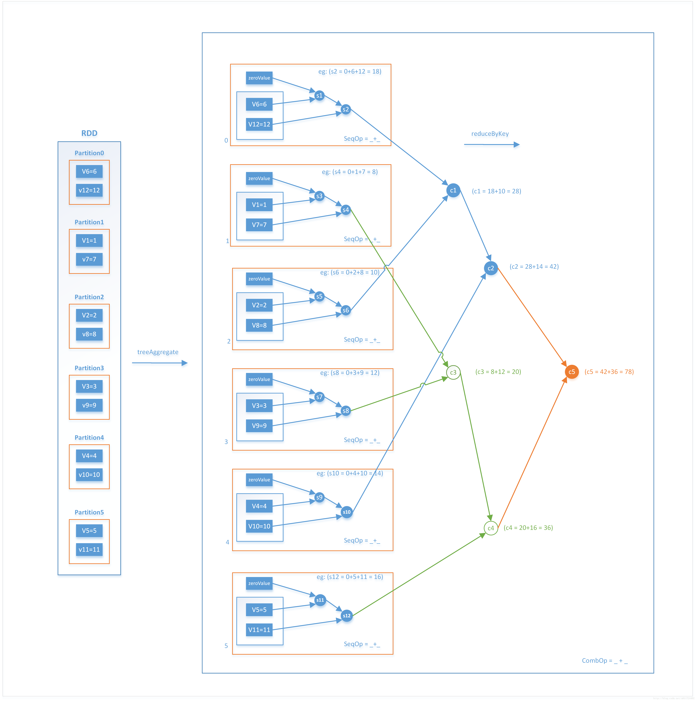

##### 代码

```java
List<Integer> data = Arrays.asList(5, 1, 1, 4, 4, 2, 2);
JavaRDD<Integer> javaRDD = javaSparkContext.parallelize(data,3);
//转化操作
JavaRDD<String> javaRDD1 = javaRDD.map(new Function<Integer, String>() {    
  @Override    
  public String call(Integer v1) throws Exception {        
    return Integer.toString(v1);    
  }
});

String result1 = javaRDD1.treeAggregate("0", new Function2<String, String, String>() {    
  @Override    
  public String call(String v1, String v2) throws Exception {        
    System.out.println(v1 + "=seq=" + v2);        
    return v1 + "=seq=" + v2;    
  }
}, new Function2<String, String, String>() {    
    @Override    
    public String call(String v1, String v2) throws Exception {        
      System.out.println(v1 + "<=comb=>" + v2);        
      return v1 + "<=comb=>" + v2;    
  }
});
System.out.println(result1);
```

#### treeReduce

##### 说明

> - 与treeAggregate类似，只不过是seqOp和combOp相同的treeAggregate。
> - 从源码中可以看出，treeReduce函数先是针对每个分区利用scala的reduceLeft函数进行计算；最后，在将局部合并的RDD进行treeAggregate计算，这里的seqOp和combOp一样，初值为空。在实际应用中，可以用treeReduce来代替reduce，主要是用于单个reduce操作开销比较大，而treeReduce可以通过调整深度来控制每次reduce的规模
> - 简单的解释就是treeReduce 是在excutor 端把脏活儿累活给做完了，必须要在单节点做的时候才返回，reduce是什么都不管，我返回数据到单节点，什么都要你单节点的来做
> - treeReduce是该reduce的时候，先在自己的分区，把key合并一下，然后在传到drive节点统一，相当于预计算了，reduce是该reduce的时候，全部数据不合并key直接返回给driver，然后统一
> - 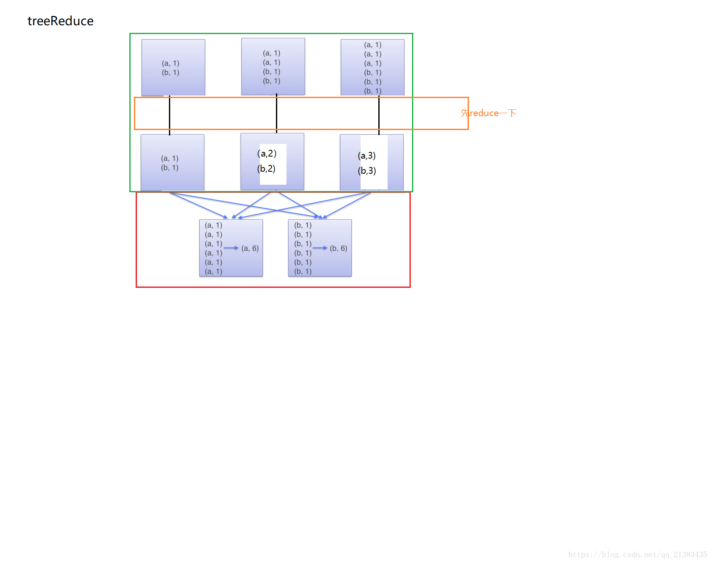

##### 代码

```java
List<Integer> data = Arrays.asList(5, 1, 1, 4, 4, 2, 2);
JavaRDD<Integer> javaRDD = javaSparkContext.parallelize(data,5);
JavaRDD<String> javaRDD1 = javaRDD.map(new Function<Integer, String>() {    
    @Override    
    public String call(Integer v1) throws Exception {        
      return Integer.toString(v1);    
    }
});
String result = javaRDD1.treeReduce(new Function2<String, String, String>() {    
    @Override    
    public String call(String v1, String v2) throws Exception {        
      System.out.println(v1 + "=" + v2);        
      return v1 + "=" + v2;    
  }
});
System.out.println("~~~~~~~~~~~~~~~~~~~~~~~~~~~~~~~" + treeReduceRDD);
```

#### combineByKey

##### 说明

> - combineByKey的3个重要参数
>
>   ```
>   1. createCombiner: V => C ，分区初始化操作，即在同一个分区中对于相同key的数据，在第一条数据执行时使用该函数进行初始化，第二条数据开始就执行mergeValue操作（第一个参数即createCombiner初始化获得的值），这个函数把当前的值作为参数，此时我们可以对其做些附加操作(类型转换)并把它返回 (这一步类似于初始化操作)
>   2. mergeValue: (C, V) => C，该函数把元素V合并到之前的元素C(createCombiner)上 (这个操作在每个分区内进行)
>   3.mergeCombiners: (C, C) => C，该函数把2个元素C合并 (这个操作在不同分区间进行)
>   ```
>
> - 以求平均数举例，代码如下
>
>   ```scala
>   //初始化数据，元组
>   val initialScores = Array(("Fred", 88.0), ("Fred", 95.0), ("Fred", 91.0), ("Wilma", 93.0), ("Wilma", 95.0), ("Wilma", 98.0))
>   //转换成rdd
>   val d1 = sc.parallelize(initialScores，3)
>   
>   type MVType = (Int, Double) //定义一个元组类型(科目计数器,分数)
>   d1.combineByKey(
>     score => (1, score),
>     (c1: MVType, newScore) => (c1._1 + 1, c1._2 + newScore),
>     (c1: MVType, c2: MVType) => (c1._1 + c2._1, c1._2 + c2._2)
>   ).map { case (name, (num, socre)) => (name, socre / num) }.collect
>   ```
>
>   说明
>
>   ```
>   score => (1, score)：这是createCombiner，是在每个分区内的初始化函数，加入第一个分区的数据是("Fred", 88.0),("Wilma", 95.0), ("Fred", 95.0),当第一个key为Fred的数据进入这是createCombiner时，执行初始化，得到<1,88.0>,key为Wilma的数据进来时执行相同的操作，当key为Fred的第二条数据进来时，spark发现该值已经初始化，则执行mergeValue操作，将相同key的数据进行聚合，得到<2,183>
>   
>   (c1: MVType, newScore) => (c1._1 + 1, c1._2 + newScore):这是mergeValue，分区内相同key的聚合函数，即用来计算出刚才的<2,183>
>   
>   (c1: MVType, c2: MVType) => (c1._1 + c2._1, c1._2 + c2._2)：mergeCombiners，将不同分区的结果进行合并，同样是根据key聚合的
>   ```
>
> - 

## SparkSession、SparkContext、JavaSparkContext

> - SparkSession是spark2.0新加入的统一入口，简化开发，通过它可以使用SqlContext、HiveContext
>
>   ```java
>   //默认是使用SqlContext的功能，若需要使用HiveContext，在构建时调用enableHiveSupport()即可
>   SparkSession spark = SparkSession
>         .builder()
>         .appName("Java Spark SQL basic example")
>         .config("spark.some.config.option", "some-value")
>         .getOrCreate();
>   
>   //从sparkContext中得到JavaSparkContext 
>   JavaSparkContext sc = JavaSparkContext.fromSparkContext(spark.sparkContext());
>    
>   //从JavaSparkContext中得到SparkContext 
>   SparkContext sparkContext = JavaSparkContext.toSparkContext(sc);
>   ```
>
> - 

## RDD

### RDD概念

> - 弹性分布式数据集，是spark中的数据（逻辑）抽象，它代表一个不可变、可分区、里面的元素可以并行计算的集合
>
>   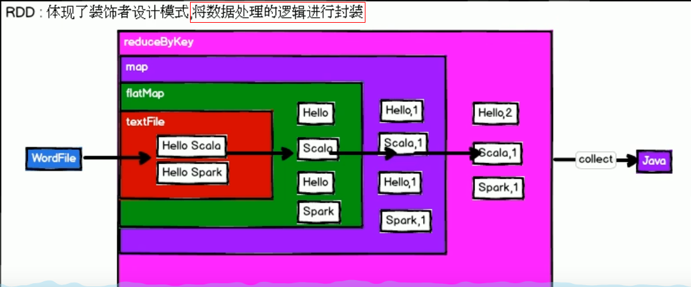
>
> - 不可变：rdd不提供修改原始数据集的操作，只能进行转化生成新的rdd
>
> - 可分区：分区是为了并行计算

### RDD属性

> - 一组分区，即数据集的基本组成单位
> - 分区函数，计算每条数据属于哪个分区
> - RDD的依赖关系
> - 一个列表，存储存取每个Partition的的优先位置（在spark中，移动数据不如移动计算，即优先将任务发给数据所在节点(datanode)的excutor来计算，这样就避免了网络IO，效率更高）

### RDD特点

> - 不可变
> - 对RDD进行改动，只能通过转换操作，生成一个新的rdd
> - rdd之间存在依赖关系，即血缘，rdd的执行时按照血缘延迟计算（执行行动算子如collect开始计算）的
> - 血缘关系较长，可以通过持久化来切断血缘关系

## spark中rdd的创建

> - 共3种方式，从集合创建、从外部存储创建（如本地文件系统，hdfs集群）、从其它rdd创建

### 从内存中的集合创建rdd

> - spark提供了2个方法，parallelize和makeRDD
> - parallelize的并行度默认是**max(totalCoreCount,2)**,totalCoreCount是当前cpu可用的核心数，也可以在sparkConf中配置`spark.default.parallelism`来指定并行度
> - parallelize是创建并行的rdd，可以指定切片数
> - makeRDD内部调用的还是parallelize，**没有区别**

### 从外部存储创建rdd

> - 使用textFile方法，其中的path可以指定通配符（如：/home/data/\*/\*），甚至可以使用正则表达式
> - textFile不会递归遍历文件夹，若指定的path下包含目录，会报错
> - textFile的**最小分区**是min(defaultParallelism,2)，它取决于hadoop的切片规则
> - textFile切片规则

### 从其它rdd创建