## 说明

## 目录

## docker简介

### 是什么

**问题：为什么会有docker出现**

> - 一款产品从开发到上线，从操作系统，到运行环境，再到应用配置。作为开发+运维之间的协作我们需要关心很多东西，这也是很多互联网公司都不得不面对的问题，特别是各种版本的迭代之后，不同版本环境的兼容，对运维人员都是考验。Docker之所以发展如此迅速，也是因为它对此给出了一个标准化的解决方案。环境配置如此麻烦，换一台机器，就要重来一次，费力费时。很多人想到，能不能从根本上解决问题，软件可以带环境安装？也就是说，安装的时候，把原始环境一模一样地复制过来。开发人员利用 Docker 可以消除协作编码时“在我的机器上可正常工作”的问题。
>
>   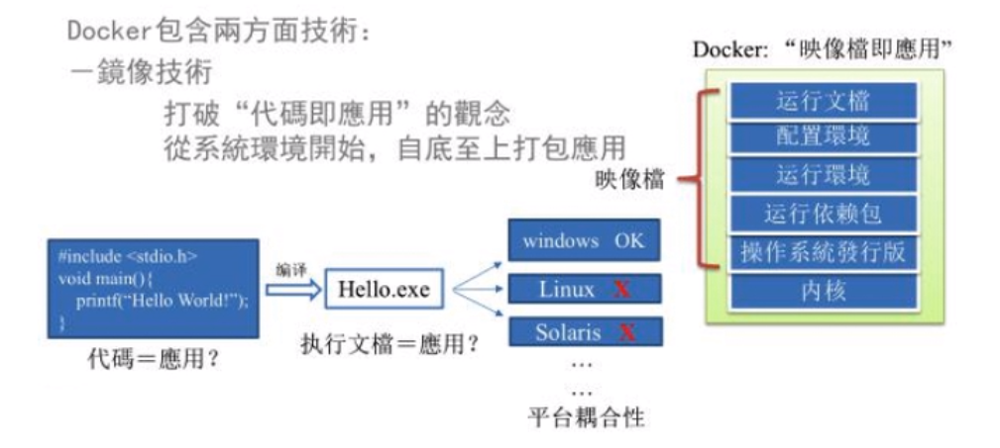
>
> - 之前在服务器配置一个应用的运行环境，要安装各种软件，就拿尚硅谷电商项目的环境来说吧，Java/Tomcat/MySQL/JDBC驱动包等。安装和配置这些东西有多麻烦就不说了，它还不能跨平台。假如我们是在 Windows上安装的这些环境，到了Linux 又得重新装。况且就算不跨操作系统，换另一台同样操作系统的服务器，要移植应用也是非常麻烦的。传统上认为，软件编码开发/测试结束后，所产出的成果即是程序或是能够编译执行的二进制字节码等(java为例)。而为了让这些程序可以顺利执行，开发团队也得准备完整的部署文件，让运维团队得以部署应用程序，开发需要清楚的告诉运维部署团队，用的全部配置文件+所有软件环境。不过，即便如此，仍然常常发生部署失败的状况。Docker镜像的设计，使得Docker得以打破过去「程序即应用」的观念。透过镜像(images)将作业系统核心除外，运作应用程序所需要的系统环境，由下而上打包，达到应用程序跨平台间的无缝接轨运作。

### docker的理念

> - Docker是基于Go语言实现的云开源项目。Docker的主要目标是“Build, Ship and Run Any App,Anywhere”，也就是通过对应用组件的封装、分发、部署、运行等生命周期的管理，使用户的APP(可以是一个WEB应用或数据库应用等等)及其运行环境能够做到“一次封装，到处运行”
>
>   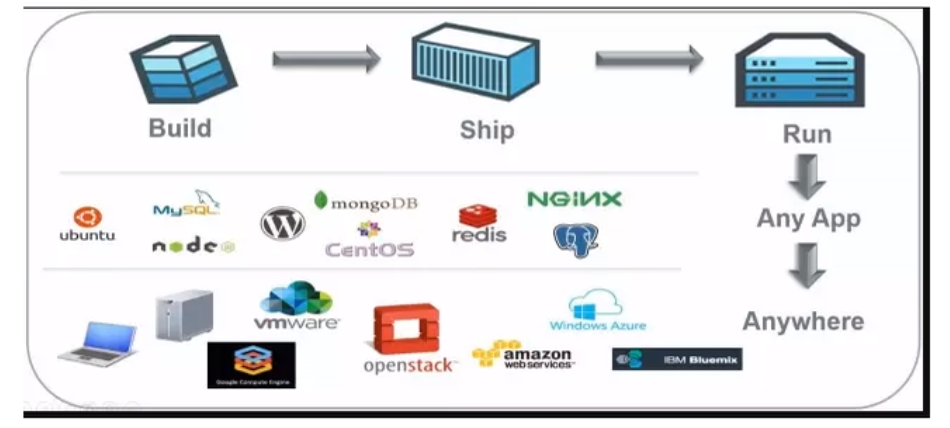
>
> - Linux 容器技术的出现就解决了这样一个问题，而 Docker就是在它的基础上发展过来的。将应用运行在Docker容器上面，而Docker容器在任何操作系统上都是一致的，这就实现了跨平台、跨服务器。只需要一次配置好环境，换到别的机子上就可以一键部署好，大大简化了操作
>
> - 解决了运行环境和配置问题软件容器，方便做持续集成并有助于整体发布的容器虚拟化技术。

### 能干嘛

#### 之前的虚拟机技术

> - 虚拟机（virtual machine)就是带环境安装的一种解决方案。
>
> - 它可以在一种操作系统里面运行另一种操作系统，比如在Windows 系统里面运行Linux系统。应用程序对此毫无感知，因为虚拟机看上去跟真实系统一模一样，而对于底层系统来说，虚拟机就是一个普通文件，不需要了就删掉，对其他部分毫无影响。这类虚拟机完美的运行了另一套系统，能够使应用程序，操作系统和硬件三者之间的逻辑不变。
>
>   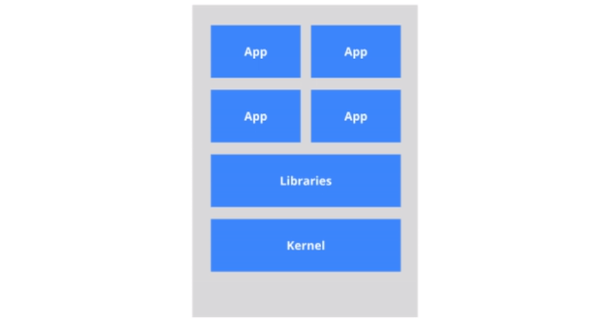
>
> - 虚拟机的缺点
>
>   - 资源占用多
>   - 冗余步骤多
>   - 启动慢

#### 容器虚拟化技术

> - 由于前面虚拟机存在这些缺点，Linux 发展出了另一种虚拟化技术:Linux 容器（Linux Containers，缩写为LXC)。Linux 容器不是模拟一个完整的操作系统，而是对进程进行隔离。有了容器，就可以将软件运行所需的所有资源打包到一个隔离的容器中。容器与虚拟机不同，不需要捆绑一整套操作系统，只需要软件工作所需的库资源和设置。系统因此而变得高效轻量并保证部署在任何环境中的软件都能始终如一地运行。
>
>   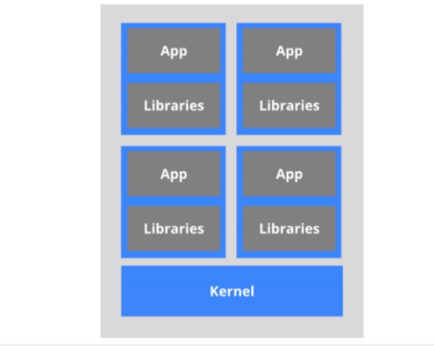
>
> - 比较了Docker 和传统虚拟化方式的不同之处:
>
>   - 传统虚拟机技术是虚拟出一套硬件后，在其上运行一个完整操作系统，在该系统上再运行所需应用进程;
>   - 而容器内的应用进程直接运行于宿主的内核，容器内没有自己的内核，而且也没有进行硬件虚拟。因此容器要比传统虚拟机更为轻便。
>   - 每个容器之间互相隔离，每个容器有自己的文件系统，容器之间进程不会相互影响，能区分计算资源

#### 开发/运维(DevOps)

> - 一次构建，随处运行
> - 更快速的应用交付和部署
>   - 传统的应用开发完成后，需要提供一堆安装程序和配置说明文档，安装部署后需根据配置文档进行繁杂的配置才能正常运行。 Docker化之后只需要交付少量容器镜像文件，在正式生产环境加载镜像并运行即可，应用安装配置在镜像里已经内置好，大大节省部署配置和测试验证时间。
> - 更便捷的升级和扩缩容
> - 更简单的系统运维
> - 更高效的计算资源利用

### 去哪下

#### 官网

> - docker官网:http://www.docker.com
> - docker中文网站:https://www.docker-cn.com

#### 仓库

> - Docker Hub官网:https://hub.docker.com/

## docker安装

### 前提说明

```
CentOS Docker 安装
Docker支持以下的CentOS版本:
	CentOS 7(64-bit)
	CentOS 6.5 (64-bit)或更高的版本
前提条件
目前，CentOS 仅发行版本中的内核支持 Docker
Docker运行在Cents7上，要求系统为64位、系统内核版本为3.10以上。
Docker运行在CentOS-6.5或更高的版本的CentOS 上，要求系统为64位、系统内核版本为2.6.32-431或者更高版本。
```

> - 查看自己的内核,uname命令用于打印当前系统相关信息（内核版本号、硬件架构、主机名称和操作系统类型等)。
>
>   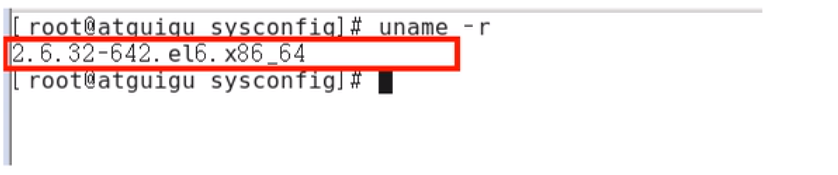
>
> - 查看已安装的CentOS版本信息
>
>   - sb_release -a
>
>   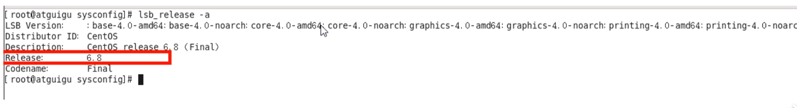
>
>   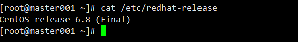
>
> - 

### docker基本组成

#### **架构图**

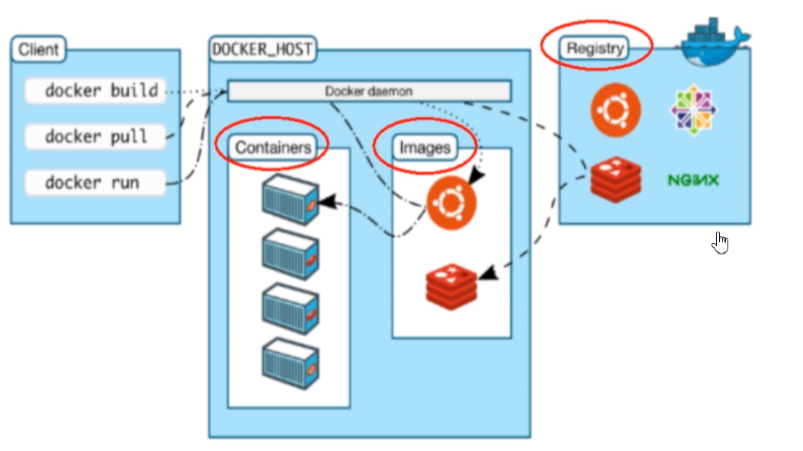

#### 镜像(image)

> - Docker镜像（Image)就是一个只读的模板。镜像可以用来创建 Docker容器，一个镜像可以创建很多容器
>
>   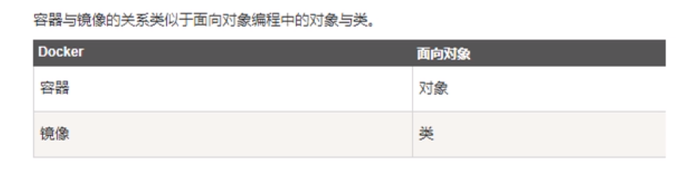

#### 容器(container)

> - Docker利用容器（Container)独立运行的一个或一组应用。容器是用镜像创建的运行实例。
> - 它可以被启动、开始、停止、删除。每个容器都是相互隔离的、保证安全的平台。
> - 可以把容器看做是一个简易版的Linux环境(包括root用户权限、进程空间、用户空间和网络空间等)和运行在其中的应用程序。
> - 容器的定义和镜像几乎一模一样，也是一堆层的统一视角，唯一区别在于容器的最上面那一层是可读可写的。

#### 仓库(repository)

> - 仓库（Repository)是集中存放镜像文件的场所。
> - 仓库(Repository)和仓库注册服务器（Registry)是有区别的。仓库注册服务器上往往存放着多个仓库，每个仓库中又包含了多个镜像，每个镜像有不同的标签（tag)。
> - 仓库分为公开仓库(Public)和私有仓库(Private) 两种形式。
> - 最大的公开仓库是 Docker Hub(https:I/hub.docker.com),存放了数量庞大的镜像供用户下载。国内的公开仓库包括阿里云、网易云等

#### 总结

> 需要正确的理解仓储/镜像/容器这几个概念:
>
> - Docker 本身是一个容器运行载体或称之为管理引擎。我们把应用程序和配置依赖打包好形成一个可交付的运行环境，这个打包好的运行环境就似乎 image镜像文件。只有通过这个镜像文件才能生成 Docker 容器。image 文件可以看作是容器的板。Docker根据 image文件生成容器的实例。同一个image 文件，可以生成多个同时运行的容器实例。
>   - image 文件生成的容器实例，本身也是一个文件，称为镜像文件
>   - 一个容器运行一种服务，当我们需要的时候，就可以通过docker客户端创建一个对应的运行实例，也就是我们的容器
>   - 至于仓储，就是放了一堆镜像的地方，我们可以把镜像发布到仓储中，需要的时候从仓储中拉下来就可以了。

### 安装步骤

#### centos6.8安装

> - 1.yum install -y epel-release
>
>   - Docker使用EPEL发布，RHEL系的OS首先要确保已经持有EPEL仓库，否则先检查OS的版本，然后安装相应的EPEL包。
>
> - 2.yum install -y docker-io
>
>   - 执行命令可能出现No package docker-io available无法安装docker,解决办法：
>
>     ```shell
>     yum install https://get.docker.com/rpm/1.7.1/centos-6/RPMS/x86_64/docker-engine-1.7.1-1.el6.x86_64.rpm
>     ```
>
>   - 1
>
> - 3.安装后的配置文件：/etc/sysconfig/docker
>
> - 4.启动Docker后台服务:service docker start
>
> - 5.docker version验证

#### centos7.0安装

> - 参照官方文档

### 永远的helloWorld

#### 阿里云镜像加速

> - <https://cr.console.aliyun.com/cn-hangzhou/instances/mirrors>
> - 注册后获取私人加速地址
>
> - 配置/etc/sysconfig/docker
>
>   ​	other_args="--registry-mirror=https://k9lz13e1.mirror.aliyuncs.com"
>
> - service docker restart重启服务
>
> - 检查配置的镜像是否生效
>
>   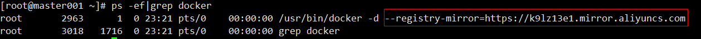

#### 网易云镜像加速

> - 使用方式基本同阿里云

#### 启动docker后台容器（测试运行hello world）

> - docker run hello-world
> - 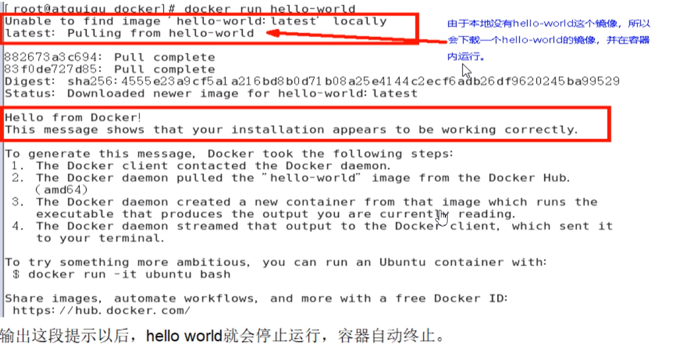
> - 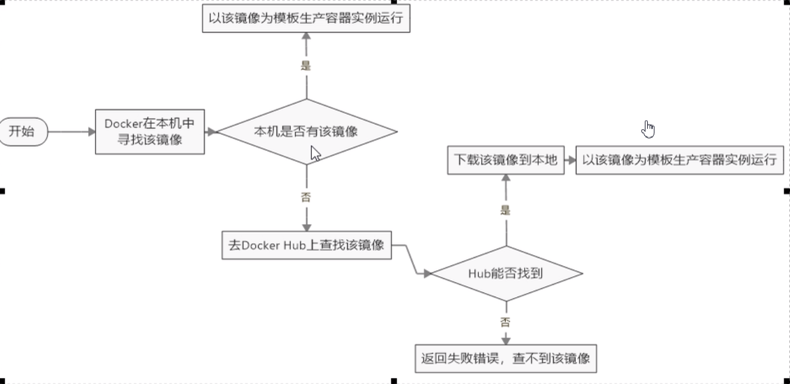
> - 

### 底层原理