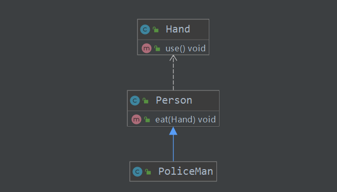

## 说明

## 目录

## UML基本介绍

> - UML——Unified modeling language UML (统一建模语言)，是一种用于软件系统分析和设计的语言工具，它用于帮助软件开发人员进行思考和记录思路的结果
>
> - UML 本身是一套符号的规定，就像数学符号和化学符号一样，这些符号用于描述软件模型中的各个元素和他们之间的关系，比如类、接口、实现、泛化、依赖、组合、聚合等，如图:
>
>   
>
> - 

## UML图

画 UML 图与写文章差不多，都是把自己的思想描述给别人看，关键在于思路和条理，UML 图分类：

> - 用例图(use case)
>
> - 静态结构图：**类图**、对象图、包图、组件图、部署图
>
> - 动态行为图：交互图（时序图与协作图）、状态图、活动图

**说明**：

> - 类图是描述类与类之间的关系的，是 UML 图中最核心的
> -  用于描述系统中的类**(**对象**)**本身的组成和类**(**对象**)**之间的各种静态关系。、
> - 类之间的关系：**依赖、泛化（继承）、实现、关联、聚合与组合。**

## 依赖

> - 只要是在类中用到了对方，那么他们之间就存在依赖关系。如果没有对方，连编绎都通过不了。
>   - 成员变量
>   - 方法参数
>   - 方法返回值
>   - 局部变量
> - 依赖的符号是**虚线箭头**，箭头指向被依赖的类
> - 

## 泛化(继承)

> - 泛化关系实际上就是继承关系，他是依赖关系的特例
>
>   

## 实现

> 实现关系实际上就是 **A** 类实现 **B** 接口，他是依赖关系的特例
>
> 

## 关联

> 关联关系是依赖关系的特例，将另一个类作为**成员属性**依赖，分为双向关系和单向关系，如单向一对一，双向一对一，一对多
>
> **一对多**
>
> 
>
> **双向一对一**：如Person有一个属性IdCard,而IdCard也有一个属性是Person
>
> 

## 聚合

> - 聚合关系（Aggregation）表示的是**整体和部分的关系**，**整体与部分可以分开**。聚合关系是**关联关系的特例**，所以他具有关联的导航性与多重性。如燕群有燕组成，但燕可以脱离燕群
> - 使用带**空心菱形的实线**来表示

## 组合

> - 组合关系：也是整体与部分的关系，但是**整体与部分不可以分开**。如人和手的关系
> - 使用带**实心菱形的实线**来表示