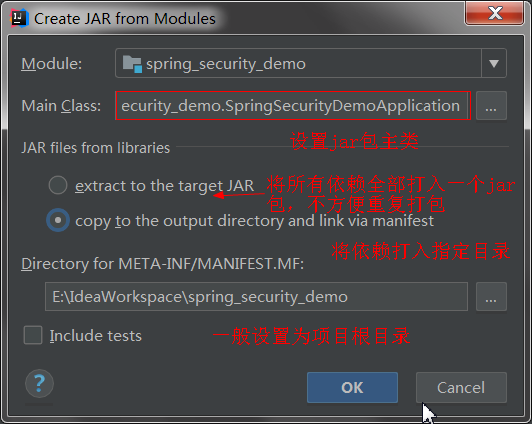

## 说明

## 目录

## 快捷键

| 按键   | 功能                   |
| ------ | ---------------------- |
| ctrl+e | 打开最近操作的文件列表 |
|        |                        |
|        |                        |

## idea生成jar包

### 打开project structure

> - 选择Artifacts-->+号-->JAR-->From modules with ...


### 设置jar包基本配置

> - jar包主类，若打的是可执行jar包，需要设置，当然也可以不用设置，执行jar包时可以指定主类，设置上最好
> - 打包方式
>   - extract  to the target JAR:将所有依赖包括要执行的代码一起打成一个整包，在需要重复打jar包的情况下不方便部署，因为项目依赖的jar包一般都很多，打完之后一个包几十M
>   - copy to the output directory and link via manifest:将jar包拷贝到指定目录下，然后使用MENIFILE.MF文件链接到依赖的jar包
> - MENIFILE.MF文件位置：一般设置为项目根目录，里面会生成一些jar包的配置，如版本、主类、依赖的jar包



### jar包配置

> - 勾选上Include in poject build：在项目构建时产生jar包
> - 在output root下创建lib目录，然后右键-->Add Copy of-->library Files,将jar包添加到lib目录下；也可以手动将jar包拖入lib目录
> - 删除lib外面的jar包


### 配置classpath

> - 由于jar包全部放入了lib目录，需要在Class Path里加上lib/前缀，可以使用notepad++进行批量操作（将光标放到开头，按alt+c即可），配置完成后点击ok


### 构建项目

> - 点击工具栏Build-->Build Artifacts-->Build即可


## idea插件反编译整个jar包源码

> - 安装插件java-decompiler
>
>   
>
> - 反编译指定jar包，如logback-classic-1.2.3.jar，命令如下
>
>   ```shell
>   java -cp "C:\Program Files\JetBrains\IntelliJ IDEA 2018.3\plugins\java-decompiler\lib\java-decompiler.jar" org.jetbrains.java.decompiler.main.decompiler.ConsoleDecompiler -dgs=true logback-classic-1.2.3.jar mysrc
>   ```
>
>   **mysrc**是编译后存放文件的目录，需要先创建好，程序执行完后会在该目录下生成反编译后的压缩包
>
> - 