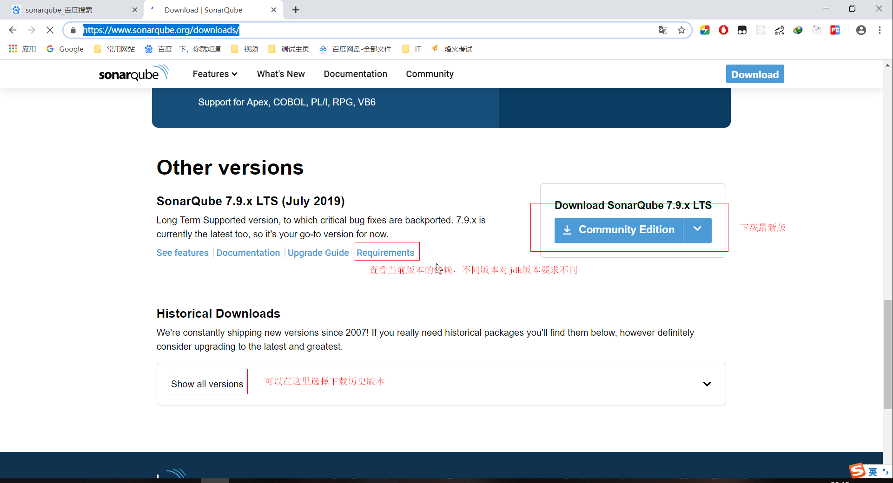
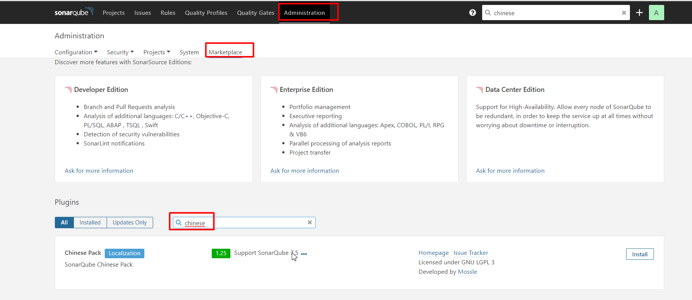
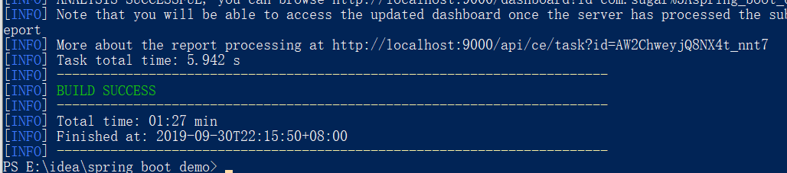
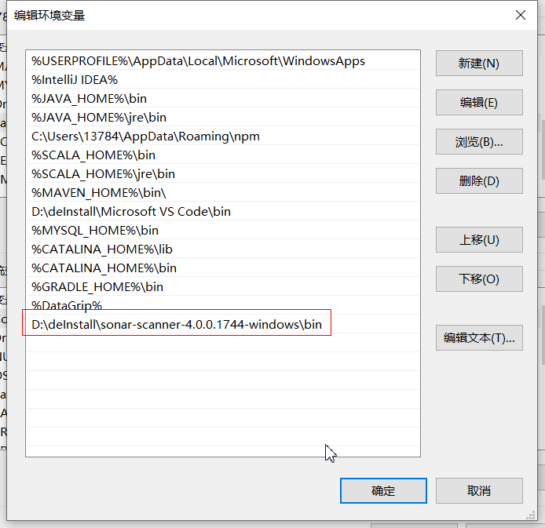
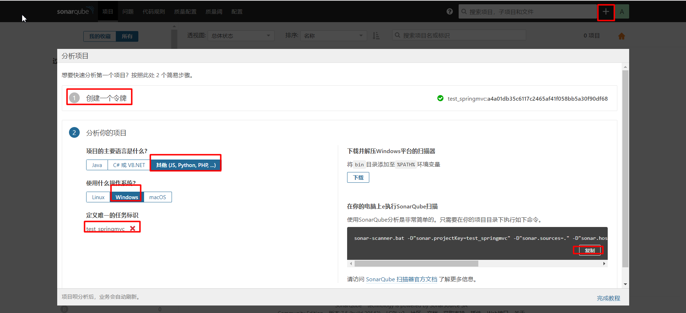
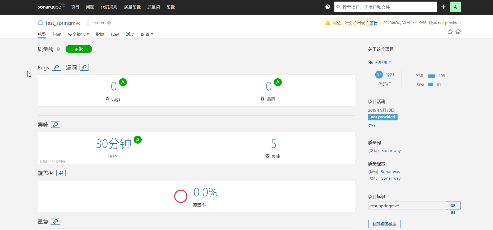

## 说明

## 目录

## 简介

> - sonarqube是一个代码静态检查工具，能够检查代码中的bug，支持多种语言

## 下载

> [链接](https://www.sonarqube.org/downloads/)
>
> - 社区版本是免费的
>
> - 注意：不同版本的sonar对jdk的版本要求不同，最新版（当前是7.9）依赖jdk11
>
> 

## 安装配置

> - 无需安装，将压缩包解压到任意目录即可
>
> - 修改安装目录下的conf/sonar.properties，添加配置
>
> ```properties
> sonar.jdbc.url=jdbc:mysql://localhost:3306/sonarqube?useUnicode=true&characterEncoding=utf8&rewriteBatchedStatements=true&useConfigs=maxPerformance&useSSL=false
> sonar.jdbc.username=用户名  // 刚刚创建的sonarQube用户
> sonar.jdbc.password=密码   // 创建用户对应的密码
> sonar.sourceEncoding=UTF-8 // 设置编码格式为UTF-8
> ```
>
> - 配置登录用户名和密码
>
> ```properties
> sonar.login=admin 
> sonar.password=admin
> ```
> - 配置web服务端口
>
>   ```properties
>   sonar.web.port=9000  //默认9000，可以不配置
>   ```
>
> - 11

## 启动

> - 到解压目录的bin\windows-x86-64(我的是64位的)目录下:
>
> 双击StartSonar.bat文件 启动SonarQube
>
> - 到浏览器界面,输入 : http://localhost:9000
> - 安装中文插件

## 汉化

> - 打开sonar界面并登录，之后界面上Administration > Marketplace，在搜索框中输入`chinese`，出现一个`Chinese Pack`，点击右侧的`install`按钮
>
>   
>
> - 安装完成后会提示重启，重启即可

## 使用

### 基于maven

> - 在maven的setting.xml进行如下配置,在对应的标签下添加配置
>
>   ```xml
>   <settings>
>   	<pluginGroups>
>   		<pluginGroup>org.sonarsource.scanner.maven</pluginGroup>
>   	</pluginGroups>
>   	<profiles>
>   		<profile>
>   			<id>sonar</id>
>   			<activation>
>   				<activeByDefault>true</activeByDefault>
>   			</activation>
>   			<properties>
>   				<sonar.jdbc.url>jdbc:mysql://localhost:3306/sonarqube?useUnicode=true&amp;amp;characterEncoding=utf8&amp;rewriteBatchedStatements=true&amp;useConfigs=maxPerformance&amp;useSSL=false</sonar.jdbc.url>
>   				<sonar.jdbc.driver>com.mysql.jdbc.Driver</sonar.jdbc.driver>
>   				<sonar.jdbc.username>root</sonar.jdbc.username>
>   				<sonar.jdbc.password>123456</sonar.jdbc.password>
>   				<sonar.host.url>http://localhost:9000</sonar.host.url>
>   			</properties>
>   		</profile>
>   	 </profiles>
>   </settings>
>   ```
>
> - 注意：数据库连接中的&需要进行转义，使用\&amp;
>
> - 执行：在所在项目pom.xml那一级执行命令`mvn clean install sonar:sonar`
>
> - 看到如下结果则表示扫描成功
>
>   

### 基于sonar scanner

#### 下载

> [链接](https://docs.sonarqube.org/latest/analysis/scan/sonarscanner/)
>
> - 解压到任意目录即可

#### 配置path



#### 配置conf/sonar-scanner.properties

```properties
#默认配置如下
sonar.host.url=http://localhost:9000
sonar.sourceEncoding=UTF-8
```

#### 最简单的使用方式

> - 登录SonarQube，创建一个项目
>
> - 创建一个令牌
>
> - 选择分析的项目(以php语言为例)
>
> - 通过cmd进入项目根路径，执行命令即可
>
>   
>
> - 复制的参数中缺少一个配置，执行会报错，需要添加如下配置
>
>   ```properties
>   #配置class文件路径
>   -D"sonar.java.binaries=./target/classes" 
>   ```
>
> - 完整配置如下
>
>   ```properties
>   sonar-scanner.bat -D"sonar.projectKey=test_springmvc" -D"sonar.sources=." -D"sonar.host.url=http://localhost:9000" -D"sonar.login=a4a01db35c6117c2465af41f058bb5a30f90df68" -D"sonar.java.binaries=./target/classes"
>   ```
>
> - 分析完成后即可看到如下结果
>
>   

