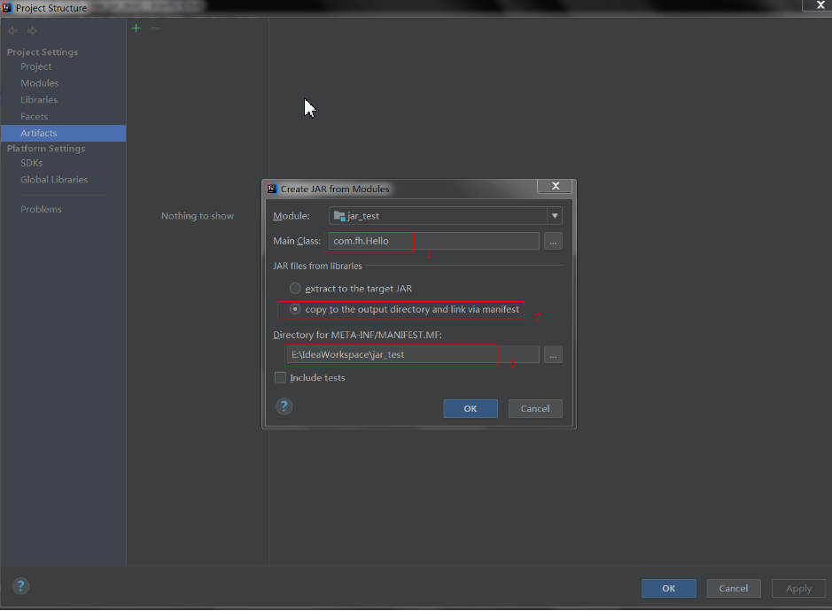
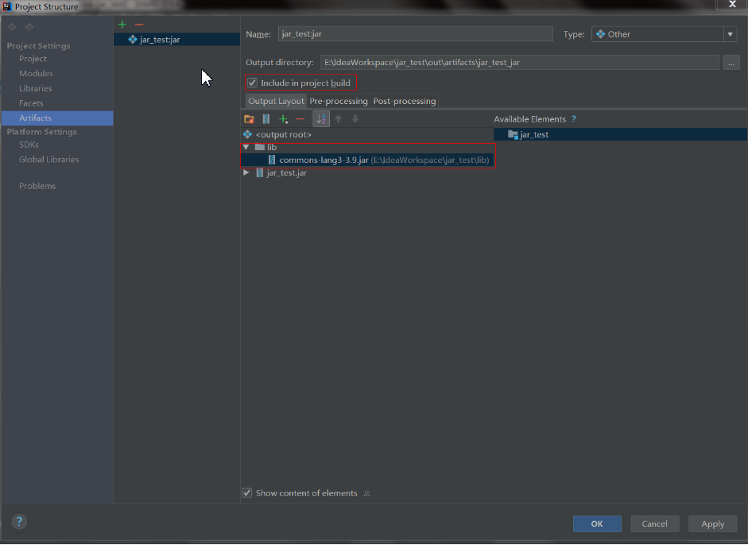
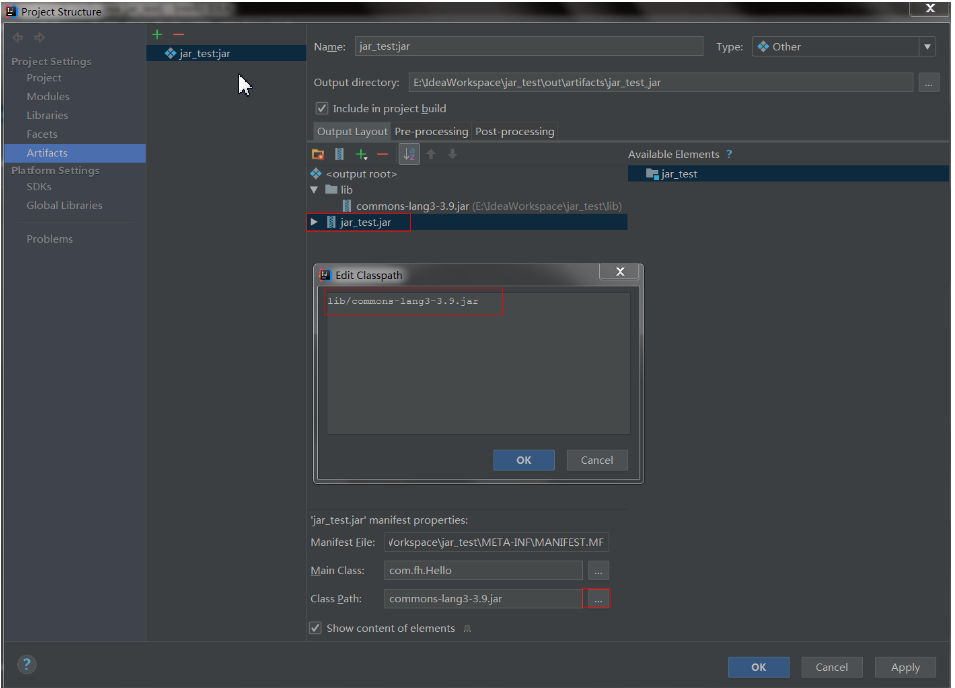
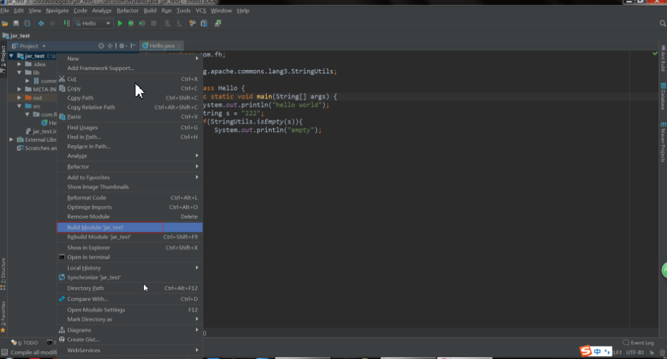

> 1. idea打可运行jar包
>
>    > 1.设置主类
>    >
>    > 2.选择copy to output,将依赖的jar包输入出到一个目录
>    >
>    > 3.设置META-INF目录位置，一般设为项目根目录
>
> 

> 1.设置项目构建时生成jar包
>
> 2.创建lib目录，将jar包全都放入lib目录
>
> 

> 1.设置jar包的class_path,在所有的jar包前添加lib/,可以使用notepad++进行批量添加，将光标放到第一行的开头，按alt+c弹出设置框，设置后即可批量进行添加
>
> 

> 右键模块进行构建，jar包输出目录为上图中的output directory
>
> 