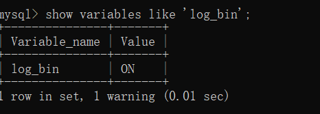
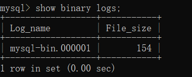
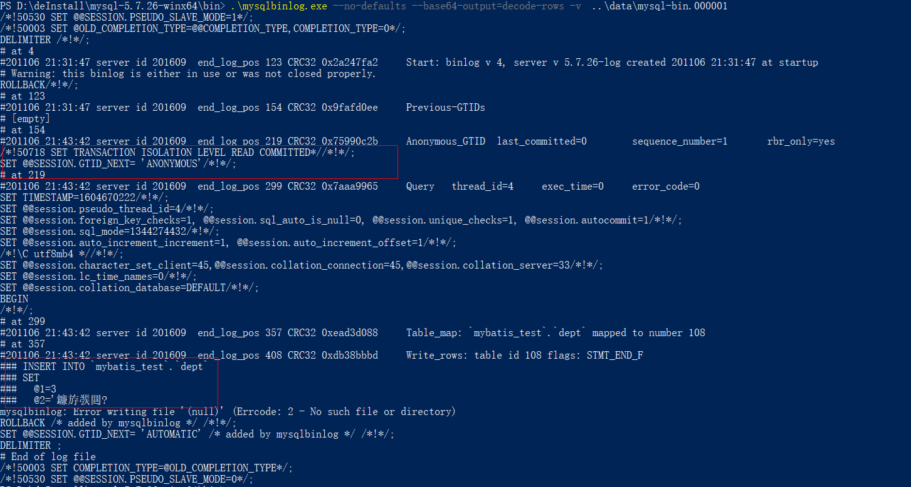

## 说明

## 目录

## mysql5.7解压版安装步骤

### 下载

[mysql5.7压缩版下载链接](https://dev.mysql.com/downloads/mysql/)

1. 
2. 
3. 

### 解压到任意目录

> 我的是：D:\deInstall

### 配置环境变量

#### 添加：MYSQL_HOME


#### 编辑path变量


### 新建my.ini文件

> 5.7版本没有该文件需要自己新建，内容如下，注意要修改自己的文件地址。
>
> 将my.ini文件放到D:\Program Files\mysql-5.7.23-winx64目录下。

```ini
[mysqld]
port = 3306
basedir=D:/deInstall/mysql-5.7.26-winx64
datadir=D:/deInstall/mysql-5.7.26-winx64/data
max_connections=200
character-set-server=utf8
default-storage-engine=INNODB
sql_mode=NO_ENGINE_SUBSTITUTION,STRICT_TRANS_TABLES
[mysql]
default-character-set=utf8
```

### 注册mysql服务

> 执行mysqld -install命令进行安装
>
> mysqld --install MySQL --defaults-file="D:\deInstall\mysql-5.7.26-winx64\my.ini"

若执行命令出现如下情况，使用管理员权限执行即可


安装成功


### 执行mysqld --initialize-insecure --user=mysql命令初始化

> 执行命令是my.ini中的datadir指定的路径不能存在，成功后，会生成data目录并生成root用户

### 启动、停止MySQL。

- 启动mysql服务：net start mysql
- 停止mysql服务：net stop mysql

### 修改默认密码

> 执行"mysqladmin -u root -p password 新密码"命令设置密码，root旧密码为空，直接回车就可以

### 命令行连接mysql

> mysql -u root -p

### 如何移除mysql服务

> mysqld -remove MySQL

### 安装常见问题

#### 无法启动mysql服务

> 原因：服务的可执行文件路径与实际路径不符


解决办法：


## java连接mysql连接串

> jdbc:mysql://localhost:3306/mybatis_test?useSSL=false&serverTimezone=UTC
>
> 说明：serverTimezone是mysql8必须设置的

## 开启binlog

### 检查binlog是否开启

show variables like '%log_bin%';



### 开启binlog

修改my.ini文件，内容如下

> - 配置log-bin和binlog-format
> - 在MySQL 5.7.3 及以后版本,如果没有设置server-id, 那么设置binlog后无法开启MySQL服务
> - 重启mysql服务即可

```properties
[client]
port=3306
default-character-set=utf8

[mysqld] 
#Path to install software directory 
basedir=D:\deInstall\mysql-5.7.26-winx64

#Path to the database directory
datadir=D:\deInstall\mysql-5.7.26-winx64\data

#Port Number
port=3306

max_connections=200

#created  and no character set is defined
character_set_server=utf8

#Set the SQL mode to strict
sql_mode="NO_ENGINE_SUBSTITUTION,NO_AUTO_CREATE_USER,STRICT_TRANS_TABLES"
explicit_defaults_for_timestamp=true

# Binary Logging
log-bin=mysql-bin
binlog-format=Row

#The default storage engine that will be used when create new tables when
default-storage-engine=INNODB

#General and Slow logging
log-output=FILE
general-log=0
general_log_file="yuri.log"
slow-query-log=1
slow_query_log_file="yuri-slow.log"
long_query_time=10

#Error Logging
log-error="yuri.err"

#Server ID
server-id=201609
```

### 查看binlog

> binlog会记录除了查询外的所有对数据库的修改操作
>
> 

```
show binary logs

# 可以将结果输出到文件
mysqlbinlog --no-defaults --database=db  --base64-output=decode-rows -v --start-datetime='2019-04-11 00:00:00' --stop-datetime='2019-04-11 15:00:00'  mysql-bin.000001
```





## 性能衡量指标

- QPS：Queries Per Second（每秒查询处理量)同时适用与InnoDB和MyISAM引擎
  - QPS=QUESTIONS/UPTIME
- TPS：Transactions Per Second(每秒传输的事务处理个数)，这是指服务器每秒处理的事务数，支持事务的存储引擎如lnnoDB等特有的一个性能指标。
  - TPS = (COM_COMMIT + COM_ROLLBACK)/UPTIME
    - COM_COMMIT ：事务提交次数，即成功的事务个数
    - COM_ROLLBACK：事务回滚次数，即失败的事务个数
    - UPTIME：mysql服务启动时间
- 响应时间：执行Sql等待返回结果之间的等待时间

## MysqlSlap-mysql压力测试工具

MySQLSlap是从MySQL的5.1.4版开始就开始官方提供的压力测试工具

| 参数                                 | 作用                                                         |
| ------------------------------------ | ------------------------------------------------------------ |
| --create-schema=name                 | 指定测试的数据库名，默认是mysqlslap                          |
| --engine=name                        | 创建测试表所使用的存储引擎，可指定多个                       |
| --concumrency=N                      | 模拟N个客户端并发执行。可指定多个值，以逗号或者              |
| --number-of-queries=N                | 总的测试查询次数(并发客户数x每客户查询次数).比如并发是10.总次数是100.那么10个客户端各执行10个 |
| --iterations=N                       | 迭代执行的次数，即重复的次数(相同的测试进行N次，求一个平均值)，指的是整个步骤的重复次数，包括准备数据、测试load、清理 |
| --commit=N                           | 执行N条DML后提交一次                                         |
| auto-generate-sql, -a                | #自动生成测试表和数据，表示用mysqlslap工具自己生成的SQL脚本来测试并发压力。 |
| auto-generate-sql-load-type=name     | #测试语句的类型。代表要测试的环境是读操作还是写操作还是两者混合的。#取值包括: read (scan tables), write (insert into tables), key(read primary keys), update (update primary keys), or mixed(half inserts, half scanning selects). 默认值是:mixed. |
| auto-generate-sql-add-auto-increment | 对生成的表自动添加auto_increment列                           |
| --number -char-cols=name             | 自动生成的测试表中包含N个字符类型的列，默认1                 |
| -number-int-cols-name                | 自动生成的测试表中包含N个数字类型的列，默认1                 |
| --debug-info                         | 打印内存和CPU的信息                                          |

## 事务