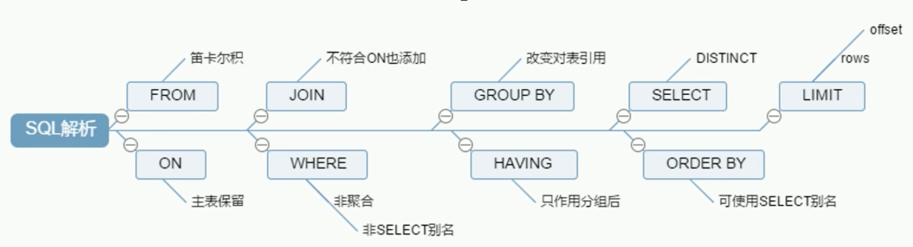
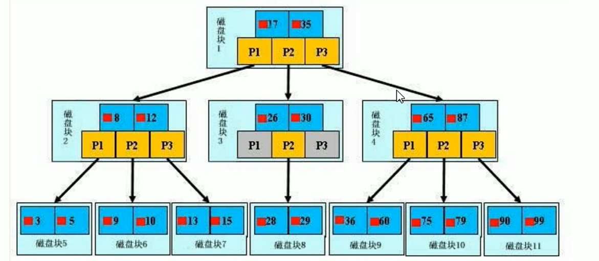

## 说明

## 目录

## mysql5.7解压版安装步骤

### 下载

[mysql5.7压缩版下载链接](https://dev.mysql.com/downloads/mysql/)

1. 
2. 
3. 

### 解压到任意目录

> 我的是：D:\deInstall

### 配置环境变量

#### 添加：MYSQL_HOME


#### 编辑path变量


### 新建my.ini文件

> 5.7版本没有该文件需要自己新建，内容如下，注意要修改自己的文件地址。
>
> 将my.ini文件放到D:\Program Files\mysql-5.7.23-winx64目录下。

```ini
[mysqld]
port = 3306
basedir=D:/deInstall/mysql-5.7.26-winx64
datadir=D:/deInstall/mysql-5.7.26-winx64/data
max_connections=200
character-set-server=utf8
default-storage-engine=INNODB
sql_mode=NO_ENGINE_SUBSTITUTION,STRICT_TRANS_TABLES
[mysql]
default-character-set=utf8
```

### 注册mysql服务

> 执行mysqld -install命令进行安装
>
> mysqld --install MySQL --defaults-file="D:\deInstall\mysql-5.7.26-winx64\my.ini"

若执行命令出现如下情况，使用管理员权限执行即可


安装成功


### 执行mysqld --initialize-insecure --user=mysql命令初始化

> 执行命令是my.ini中的datadir指定的路径不能存在，成功后，会生成data目录并生成root用户

### 启动、停止MySQL。

- 启动mysql服务：net start mysql
- 停止mysql服务：net stop mysql

### 修改默认密码

> 执行"mysqladmin -u root -p password 新密码"命令设置密码，root旧密码为空，直接回车就可以

### 命令行连接mysql

> mysql -u root -p

### 如何移除mysql服务

> mysqld -remove MySQL

### 安装常见问题

#### 无法启动mysql服务

> 原因：服务的可执行文件路径与实际路径不符


解决办法：


## java连接mysql连接串

> jdbc:mysql://localhost:3306/mybatis_test?useSSL=false&serverTimezone=UTC
>
> 说明：serverTimezone是mysql8必须设置的

## 开启binlog

### 检查binlog是否开启

show variables like '%log_bin%';


### 开启binlog

修改my.ini文件，内容如下

> - 配置log-bin和binlog-format
> - 在MySQL 5.7.3 及以后版本,如果没有设置server-id, 那么设置binlog后无法开启MySQL服务
> - 重启mysql服务即可

```properties
[client]
port=3306
default-character-set=utf8

[mysqld] 
#Path to install software directory 
basedir=D:\deInstall\mysql-5.7.26-winx64

#Path to the database directory
datadir=D:\deInstall\mysql-5.7.26-winx64\data

#Port Number
port=3306

max_connections=200

#created  and no character set is defined
character_set_server=utf8

#Set the SQL mode to strict
sql_mode="NO_ENGINE_SUBSTITUTION,NO_AUTO_CREATE_USER,STRICT_TRANS_TABLES"
explicit_defaults_for_timestamp=true

# Binary Logging
log-bin=mysql-bin
binlog-format=Row

#The default storage engine that will be used when create new tables when
default-storage-engine=INNODB

#General and Slow logging
log-output=FILE
general-log=0
general_log_file="yuri.log"
slow-query-log=1
slow_query_log_file="yuri-slow.log"
long_query_time=10

#Error Logging
log-error="yuri.err"

#Server ID
server-id=201609
```

### 查看binlog

> binlog会记录除了查询外的所有对数据库的修改操作
>
> 

```
show binary logs

# 可以将结果输出到文件
mysqlbinlog --no-defaults --database=db  --base64-output=decode-rows -v --start-datetime='2019-04-11 00:00:00' --stop-datetime='2019-04-11 15:00:00'  mysql-bin.000001
```


## 性能衡量指标

- QPS：Queries Per Second（每秒查询处理量)同时适用与InnoDB和MyISAM引擎
  - QPS=QUESTIONS/UPTIME
- TPS：Transactions Per Second(每秒传输的事务处理个数)，这是指服务器每秒处理的事务数，支持事务的存储引擎如lnnoDB等特有的一个性能指标。
  - TPS = (COM_COMMIT + COM_ROLLBACK)/UPTIME
    - COM_COMMIT ：事务提交次数，即成功的事务个数
    - COM_ROLLBACK：事务回滚次数，即失败的事务个数
    - UPTIME：mysql服务启动时间
- 响应时间：执行Sql等待返回结果之间的等待时间

## MysqlSlap-mysql压力测试工具

MySQLSlap是从MySQL的5.1.4版开始就开始官方提供的压力测试工具

| 参数                                 | 作用                                                         |
| ------------------------------------ | ------------------------------------------------------------ |
| --create-schema=name                 | 指定测试的数据库名，默认是mysqlslap                          |
| --engine=name                        | 创建测试表所使用的存储引擎，可指定多个                       |
| --concumrency=N                      | 模拟N个客户端并发执行。可指定多个值，以逗号或者              |
| --number-of-queries=N                | 总的测试查询次数(并发客户数x每客户查询次数).比如并发是10.总次数是100.那么10个客户端各执行10个 |
| --iterations=N                       | 迭代执行的次数，即重复的次数(相同的测试进行N次，求一个平均值)，指的是整个步骤的重复次数，包括准备数据、测试load、清理 |
| --commit=N                           | 执行N条DML后提交一次                                         |
| auto-generate-sql, -a                | #自动生成测试表和数据，表示用mysqlslap工具自己生成的SQL脚本来测试并发压力。 |
| auto-generate-sql-load-type=name     | #测试语句的类型。代表要测试的环境是读操作还是写操作还是两者混合的。#取值包括: read (scan tables), write (insert into tables), key(read primary keys), update (update primary keys), or mixed(half inserts, half scanning selects). 默认值是:mixed. |
| auto-generate-sql-add-auto-increment | 对生成的表自动添加auto_increment列                           |
| --number -char-cols=name             | 自动生成的测试表中包含N个字符类型的列，默认1                 |
| -number-int-cols-name                | 自动生成的测试表中包含N个数字类型的列，默认1                 |
| --debug-info                         | 打印内存和CPU的信息                                          |

## mysql配置文件

> - windows : my.ini
> - linux : /etc/my.cnf

**文件相关主要配置项**

> - **二进制日志log-bin**：用于主从复制
>
>   ```
>   log-bin=D:\deInstall\mysql-5.7.26-winx64\data\logBin
>   ```
>
> - **错误日志log-error**：默认是关闭的,记录严重的警告和错误信息，每次启动和关闭的详细信息等。
>
>   ```
>   log-error=D:\deInstall\mysql-5.7.26-winx64\data\logError
>   ```
>
> - **查询日志log**：默认关闭，记录查询的sql语句，如果开启会减低mysqI的整体性能，因为记录日志也是需要消耗系统资源
>
> - **数据文件**：以InnoDB为例
>
>   - 两系统
>     - windows：datadir=D:\deInstall\mysql-5.7.26-winx64\data
>     - linux：默认路径: /var/ib/mysql
>   - frm文件：存放表结构
>   - ibd文件：数据和索引

## mysql逻辑架构


> - 和其它数据库相比，MySQL有点与众不同，它的架构可以在多种不同场景中应用并发挥良好作用。主要体现在存储引擎的架构上，插件式的存储引擎架构将查询处理和其它的系统任务以及数据的存储提取相分离。这种架构可以根据业务的需求和实际需要选择合适的存储引擎。
>
> - **连接层**：最上层是一些客户端和连接服务，包含本地sock通信和大多数基于客户端/服务端工具实现的类似于tcp/ip的通信。主要完成- - 些类似于连接处理、授权认证、及相关的安全方案。在该层上引入了线程池的概念，为通过认证安全接入的客户端提供线程。同样在该层上可以实现基于SSL的安全链接。服务器也会为安全接入的每个客户端验证它所具有的操作权限。
>
> - **服务层**：第二层架构主要完成大多数的核心服务功能，如SQL接口，并完成缓存的查询，SQL的分析和优化及部分内置函数的执行。所有跨存储引擎的功能也在这一层实现，如过程、函数等。在该层，服务器会解析查询并创建相应的内部解析树，并对其完成相应的优化如确定查询表的顺序,是否利用索引等，最后生成相应的执行操作。如果是select语句，服务器还会查询内部的缓存。如果缓存空间足够大，这样在解决大量读操作的环境中能够很好的提升系统的性能。
>
> - **引擎层**：存储引擎层，存储引擎真正的负责了MySQL中数据的存储和提取，服务器通过API与存储引擎进行通信。不同的存储引擎具有的功能不同，这样我们可以根据自己的实际需要进行选取。后面介绍MyISAM和InnoDB
>
> - **存储层**：数据存储层，主要是将数据存储在运行于裸设备的文件系统之上，并完成与存储引擎的交互。
>
> - 查看mysql提供的引擎：show engines ;
>
>   
>
> - 查看当前的存储引擎：show variables like '%storage_engine%';
>
>   
>
> - MyISAM和InnoDB
>
>   
>
> - 

## 索引优化分析

### sql执行的加载顺序




### 索引概述

> - MySQL官方对索引的定义为:索引(Index)是帮助MySQL高效获取数据的数据结构。可以得到索引的本质:索引是数据结构。
>
> - 可以简单理解为“排好序的快速查找数据结构”。
>
> - 索引会影响where后的查找和order by的排序
>
> - 在数据之外，数据库系统还维护着满足特定查找算法的数据结构，这些数据结构以某种方式引用(指向)数据,这样就可以在这些数据结构上实现高级查找算法。这种数据结构，就是索引。下图就是一种可能的索引方式示例:
>
>   
>
>   左边是数据表，一共有两列七条记录，最左边的是数据记录的物理地址
>
>   为了加快Col2的查找，可以维护一个右边所示的二叉查找树，每个节点分别包含索引键值和一个指向对应数据记录物理地址的指针，这样就可以运用二叉查找在一定的复杂度内获取到相应数据，从而快速的检索出符合条件的记录。
>
> - 一般来说索引本身也很大，不可能全部存储在内存中，因此索引往往以索引文件的形式存储的磁盘上
>
> - 我们平常所说的索引，如果没有特别指明，都是指B树(多路搜索树，并不一定是二叉的)结构组织的索引。其中聚集索引,次要索引，覆盖索引，复合索引，前缀索引，唯一-索引默认都是使用**B+树**索引，统称索引。当然，除了B+树这种类型的索引之外，还有哈稀索引(hash index)等。

### 索引优势

> - 类似大学图书馆建书目索引，提高数据检索的效率，降低数据库的IO成本
> - 通过索引列对数据进行排序，降低数据排序的成本，降低了CPU的消耗

### 索引劣势

> - 实际上索引也是一张表，该表保存了主键与索引字段，并指向实体表的记录，所以索引列也是要占用空间的
> - 虽然索引大大提高了查询速度，同时却**会降低更新表的速度**，如对表进行INSERT、UPDATE和DELETE。
>   因为更新表时，MySQL不仅要保存数据，还要保存一下索引文件每次更新添加了索引列的字段，都会调整因为更新所带来的键值变化后的索引信息
> - 索引只是提高效率的一个因素，如果你的MySQL有大数据量的表，就需要花时间研究建立最优秀的索引，或优化查询

### 索引分类

> - 单值索引：即一个索引只包含单个列，一个表可以有多个单列索引
> - 唯一索引：索引列的值必须唯一，但允许有空值
> - 复合索引：即一个索引包含多个列

### mysql索引结构

#### BTree索引



##### 初始化过程

> 一颗b+树，浅蓝色的块我们称之为-一个磁盘块，可以看到每个磁盘块包含几个数据项(深蓝色所示)和指针(黄色所示)，如磁盘块1包含数据项17和35，包含指针P1、P2、P3,
>
> P1表示小于17的磁盘块，P2表示在17和35之间的磁盘块，P3表示大于35的磁盘块。
>
> 真实的数据存在于叶子节点即3、5、9、10、13、15、28、29、36、60、75、79、90、99。
>
> 非叶子节点只不存储真实的数据，只存储指引搜索方向的数据项，如17、35并不真实存在于数据表中。

##### 查找过程

> - 如果要查找数据项29，那么首先会把磁盘块1由磁盘加载到内存，此时发生一次I0，在内存中用二分查找确定29在17和35之间，锁定磁盘块1的P2指针，内存时间因为非常短(相比磁盘的I0)可以忽略不计，通过磁盘块1的P2指针的磁盘地址把磁盘块3由磁盘加载到内存，发生第二次I0，29在26和30之间， 锁定磁盘块3的P2指针，通过指针加载磁盘块8到内存，发生第三次I口， 同时内存中做二分查找找到29，结束查询，总计三次I0。
>
> - 真实的情况是，3层的b+树可以表示上百万的数据，如果上百万的数据查找只需要三次IO，性能提高将是巨大的，如果没有索引，每个数据项都要发生一次IO，那么总共需要百万次的I0，显然成本非常非常高。

#### hash索引

#### full-text索引

#### R-Tree索引

### 哪些情况需要创建索引

> - 主键自动建立唯一索引
> - 频繁作为查询条件的字段应该创建索引
> - 查询中与其它表关联的字段，外键关系建立索引
> - 频繁更新的字段不适合创建索引：因为每次更新不单单是更新了记录还会更新索引
> - Where条件里用不到的字段不创建索引
> - 单键/组合索引的选择问题，who? (在高并发下倾向创建组合索引)
> - 查询中排序的字段，排序字段若通过索引去访问将大大提高排序速度
> - 查询中统计或者分组字段

### 哪些情况不需要创建索引

> - 表记录太少
> - 经常增删改的表：Why:提高了查询速度，同时却会降低更新表的速度，如对表进行INSERT、UPDATE和DELETE。因为更新表时，MySQL不仅 要保存数据，还要保存一下索引文件
> - 数据重复且分布平均的表字段，因此应该只为最经常查询和最经常排序的数据列建立索引。注意，如果某个数据列包含许多重复的内容，为它建立索引就没有太大的实际效果。

### 性能分析

> - MySql Query Optimizer
>
>   ```
>   1 Mysq|中有 专门负责优化SELECT语 句的优化器模块，主要功能:通过计算分析系统中收集到的统计信 息，为客户端请求的Query提供他认为最优的执行计划(他认为最优的数据检索方式，但不见得是DBA认为是最优的，这部分最耗费时间)
>   
>   2当客户端向MySQL请求一 条Query， 命令解析器模块完成请求分类，区别出是SELECT并转发给MySQL
>   Query Optimizer时，MySQL Query Optimizer首先会对整条Query进行优化，处理掉一些 常量表达式的预算,直接换算成常量值。并对Query中的查询条件进行简化和转换，如去掉一些无用或显而 易见的条件、结构调整等。然后分析Query中的Hint信息(如果有)，看显示Hint信息是否可以完全确定该Query的执行计划。如果没有Hint或Hint信息还不足以完全确定执行计划，则会读取所涉及对象的统计信息，根据Query进行写相应的计算分析，然后再得出最后的执行计划。
>   
>   ```
>
> - mysql的常见瓶颈
>
>   - CPU:CPU在饱和的时候--般发生在数据装入内存或从磁盘上读取数据时候
>   - IO:磁盘I/O瓶颈发生在装入数据远大于内存容量的时候
>   - 服务器硬件的性能瓶颈:top,free,iostat和vmstat来查看系统的性能状态
>
> - 

## mysql explain(执行计划)

### 概述

> 使用EXPLAIN关键字可以模拟优化器执行SQL查询语句，从而知道MySQL是如何处理你的SQL语句的。分析你的查询语句或是表结构的性能瓶颈

### 作用

> - 表的读取顺序
> - 数据读取操作的操作类型.
> - 哪些索引可以使用
> - 哪些索引被实际使用
> - 表之间的引用
> - 每张表有多少行被优化器查询

### 执行计划字段介绍

