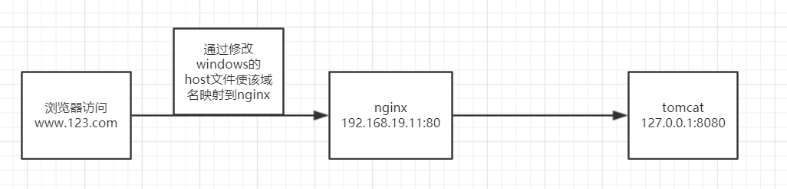

## 目录

## 说明

## nginx简介

### **Nginx** 概述

> Nginx ("enginex") 是一个高性能的 HTTP 和反向代理服务器,特点是占有内存少，并发能力强，事实上 nginx 的并发能力确实在同类型的网页服务器中表现较好，中国大陆使用 nginx 网站用户有：百度、京东、新浪、网易、腾讯、淘宝等

### **Nginx** 作为 **web** 服务器

> Nginx 可以作为静态页面的 web 服务器，同时还支持 CGI 协议的动态语言，比如 perl、php 等。但是不支持 java。Java 程序只能通过与 tomcat 配合完成。Nginx 专为性能优化而开发， 性能是其最重要的考量,实现上非常注重效率  ，能经受高负载的考验,有报告表明能支持高 达 50,000 个并发连接数。
>
> <https://lnmp.org/nginx.html>

### 正向代理

> Nginx 不仅可以做反向代理，实现负载均衡。还能用作正向代理来进行上网等功能。正向代理：如果把局域网外的 Internet 想象成一个巨大的资源库，则局域网中的客户端要访 问 Internet，则需要通过代理服务器来访问，这种代理服务就称为正向代理
>
> 

### 反向代理

> 反向代理，其实客户端对代理是无感知的，因为客户端不需要任何配置就可以访问，我们只需要将请求发送到反向代理服务器，由反向代理服务器去选择目标服务器获取数据后，在返 回给客户端，此时反向代理服务器和目标服务器对外就是一个服务器，暴露的是代理服务器 地址，隐藏了真实服务器 IP 地址
>
> 

### 负载均衡

> - 客户端发送多个请求到服务器，服务器处理请求，有一些可能要与数据库进行交互，服务器处理完毕后，再将结果返回给客户端。
>
> - 这种架构模式对于早期的系统相对单一，并发请求相对较少的情况下是比较适合的，成 本也低。但是随着信息数量的不断增长，访问量和数据量的飞速增长，以及系统业务的复杂 度增加，这种架构会造成服务器相应客户端的请求日益缓慢，并发量特别大的时候，还容易 造成服务器直接崩溃。很明显这是由于服务器性能的瓶颈造成的问题，那么如何解决这种情 况呢？
>
> - 我们首先想到的可能是升级服务器的配置，比如提高 CPU 执行频率，加大内存等提高机 器的物理性能来解决此问题，但是我们知道[摩尔定律](https://www.cnblogs.com/ysocean/p/7641540.html)的日益失效，硬件的性能提升已经不能 满足日益提升的需求了。最明显的一个例子，天猫双十一当天，某个热销商品的瞬时访问量 是极其庞大的，那么类似上面的系统架构，将机器都增加到现有的顶级物理配置，都是不能 够满足需求的。那么怎么办呢？
>
> - 上面的分析我们去掉了增加服务器物理配置来解决问题的办法，也就是说纵向解决问题 的办法行不通了，那么横向增加服务器的数量呢？这时候集群的概念产生了，单个服务器解 决不了，我们增加服务器的数量，然后将请求分发到各个服务器上，将原先请求集中到单个服务器上的情况改为将请求分发到多个服务器上，将负载分发到不同的服务器，也就是我们所说的负载均衡
>
>   

### 动静分离

> 为了加快网站的解析速度，可以把动态页面和静态页面由不同的服务器来解析，加快解析速
> 度。降低原来单个服务器的压力
>
> 

## nginx在linux安装

### 安装nginx相关依赖

> - 安装pcre
>
>   ```shell
>   1.使用wget或直接上传压缩包
>   2.进入解压后的目录，执行./configure
>   3.执行make &&make install
>   
>   #查看pcre版本
>   pcre-config --version
>   ```
>
> - 安装openssl和zlib
>
>   ```shell
>   yum -y install make zlib  zlib-devel gcc-c++ libtool openssl openssl-devel
>   ```

### 安装nginx

> - 上传并解压压缩包
> - 进入解压后的目录，执行./configure
> - 执行make &&make install

### 说明

> - nginx安装完成后会在/usr/local下创建一个nginx目录
>
> - sbin目录下是启动脚本，进入该目录执行**./nginx**即可启动nginx
>
> - 启动后可通过浏览器访问nginx（80端口），若如法访问，需检查防火墙是否开启了该端口号
>
>   
>
> - conf目录下是配置文件

## nginx常用命令

> nginx相关操作需要进入/usr/local/nginx/sbin目录

### 查看版本号

```shell
./nginx -v
```

### 启动nginx

```shell
./nginx
```

### 关闭nginx

```shell
./nginx -s stop
```

### 重新加载nginx(nginx.conf配置)

```shell
./nginx -s reload
```

### 校验nginx.conf合法性

```shell
./nginx -t
```

## nginx配置文件nginx.conf

### 配置文件路径

> /usr/local/nginx/conf/nginx.conf

### 配置文件组成部分

> - nginx配置文件主要由3部分组成：全局块、events块、http块

#### 全局块

> - 从配置文件开始到 events 块之间的内容，主要会设置一些影响nginx 服务器整体运行的配置指令，主要包括配置运行 Nginx 服务器的用户（组）、允许生成的 worker process 数，进程 PID 存放路径、日志存放路径和类型以及配置文件的引入等。
> - **worker process** ：这是 Nginx 服务器并发处理服务的关键配置，worker_processes 值越大，可以支持的并发处理量也越多，但是会受到硬件、软件等设备的制约，**默认为1**

#### events块

```shell
events {
    worker_connections  1024;
}
```

> - **events 块涉及的指令主要影响 Nginx 服务器与用户的网络连接**，常用的设置包括是否开启对多 work process 下的网络连接进行序列化，是否允许同时接收多个网络连接，选取哪种事件驱动模型来处理连接请求，每个 word process 可以同时支持的最大连接数等。
> - 上述例子就表示每个 work process 支持的最大连接数为 1024
> - 这部分的配置对 Nginx 的性能影响较大，在实际中应该灵活配置。

#### http块

```shell
http {
    include       mime.types;
    default_type  application/octet-stream;

    #log_format  main  '$remote_addr - $remote_user [$time_local] "$request" '
    #                  '$status $body_bytes_sent "$http_referer" '
    #                  '"$http_user_agent" "$http_x_forwarded_for"';

    #access_log  logs/access.log  main;

    sendfile        on;
    #tcp_nopush     on;

    #keepalive_timeout  0;
    keepalive_timeout  65;

    #gzip  on;

    server {
        listen       80;
        server_name  192.168.19.11;

        #charset koi8-r;

        #access_log  logs/host.access.log  main;

        location /group1/M00 {
            #root   html;
            #index  index.html index.htm;
            ngx_fastdfs_module;
        }

```

> - 这算是 Nginx 服务器配置中最频繁的部分，代理、缓存和日志定义等绝大多数功能和第三方模块的配置都在这里。 需要注意的是：http 块也可以包括 **http全局块、server 块**。

##### http全局块

> http全局块配置的指令包括文件引入、MIME-TYPE 定义、日志自定义、连接超时时间、单链接请求数上限等。

##### server 块

> - 这块和虚拟主机有密切关系，虚拟主机从用户角度看，和一台独立的硬件主机是完全一样的，该技术的产生是为了节省互联网服务器硬件成本。
> -  每个 http 块可以包括多个 server 块，而每个 server 块就相当于一个虚拟主机。 
> - 而每个 server 块也分为全局 server 块，以及可以同时包含多个 locaton 块。

###### 全局 server 块

> 最常见的配置是本虚拟机主机的监听配置和本虚拟主机的名称或IP配置。

###### locaton 块

> - 一个 server 块可以配置多个 location 块。 
> - 这块的主要作用是基于 Nginx 服务器接收到的请求字符串（例如 server_name/uri-string），对虚拟主机名称（也可以是IP别名）之外的字符串（例如 前面的 /uri-string）进行匹配，对特定的请求进行处理。地址定向、数据缓存和应答控制等功能，还有许多第三方模块的配置也在这里进行。

## nginx配置实例

### 反向代理

#### 实例1

> 效果：访问www.123.com跳转到tomcat首页

##### 准备工作

> - 安装tomcat,使用其默认端口8080进行启动
> - 检查防火墙是否开放了8080端口访问权限

##### 访问过程分析



##### 具体实现步骤

> - 进入C:\Windows\System32\drivers\etc目录修改hosts映射,在文件中添加如下内容，配置后即可通过<http://www.123.com:8080/>访问tomcat
>
>   ```
>   192.168.19.11 www.123.com
>   ```
>
> - 在nginx中进行请求转发的配置
>
>   ```shell
>   server {
>           listen       80;
>           server_name  192.168.19.11;
>          
>           location /{
>             proxy_pass http://127.0.0.1:8080;
>           }
>   
>   ```
>
> - 重新加载配置文件后即可通过www.123.com直接访问tomcat

#### 实例2

##### 实现效果

> - 使用nginx监听9001端口
> - 若访问http://192.168.19.11:9001/hello,则跳转到http://192.168.19.11:8080/hello/
> - 若访问http://192.168.19.11:9001/hello2,则跳转到http://192.168.19.11:8081/hello2/

### 负载均衡

### 动静分离